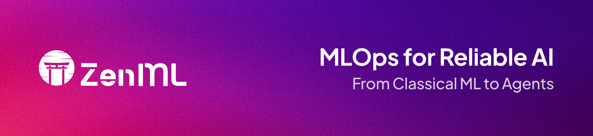

<div align="center">
  
  <h1 align="center">Create an internal MLOps platform for your entire machine learning team.
</h1>
</div>

<!-- PROJECT SHIELDS -->
<!--
*** I'm using markdown "reference style" links for readability.
*** Reference links are enclosed in brackets [ ] instead of parentheses ( ).
*** See the bottom of this document for the declaration of the reference variables
*** for contributors-url, forks-url, etc. This is an optional, concise syntax you may use.
*** https://www.markdownguide.org/basic-syntax/#reference-style-links
-->

<div align="center">

  <!-- PROJECT LOGO -->
  <br />
    <a href="https://zenml.io">
      
    </a>
  <br />

  [![PyPi][pypi-shield]][pypi-url]
  [![PyPi][pypiversion-shield]][pypi-url]
  [![PyPi][downloads-shield]][downloads-url]
  [![Contributors][contributors-shield]][contributors-url]
  [![License][license-shield]][license-url]
  <!-- [![Build][build-shield]][build-url] -->
  <!-- [![CodeCov][codecov-shield]][codecov-url] -->

</div>

<!-- MARKDOWN LINKS & IMAGES -->
<!-- https://www.markdownguide.org/basic-syntax/#reference-style-links -->

[pypi-shield]: https://img.shields.io/pypi/pyversions/zenml?color=281158

[pypi-url]: https://pypi.org/project/zenml/

[pypiversion-shield]: https://img.shields.io/pypi/v/zenml?color=361776

[downloads-shield]: https://img.shields.io/pypi/dm/zenml?color=431D93

[downloads-url]: https://pypi.org/project/zenml/

[codecov-shield]: https://img.shields.io/codecov/c/gh/zenml-io/zenml?color=7A3EF4

[codecov-url]: https://codecov.io/gh/zenml-io/zenml

[contributors-shield]: https://img.shields.io/github/contributors/zenml-io/zenml?color=7A3EF4

[contributors-url]: https://github.com/zenml-io/zenml/graphs/contributors

[license-shield]: https://img.shields.io/github/license/zenml-io/zenml?color=9565F6

[license-url]: https://github.com/zenml-io/zenml/blob/main/LICENSE

[linkedin-shield]: https://img.shields.io/badge/-LinkedIn-black.svg?style=for-the-badge&logo=linkedin&colorB=555

[linkedin-url]: https://www.linkedin.com/company/zenml/

[twitter-shield]: https://img.shields.io/twitter/follow/zenml_io?style=for-the-badge

[twitter-url]: https://twitter.com/zenml_io

[slack-shield]: https://img.shields.io/badge/-Slack-black.svg?style=for-the-badge&logo=linkedin&colorB=555

[slack-url]: https://zenml.io/slack-invite

[build-shield]: https://img.shields.io/github/workflow/status/zenml-io/zenml/Build,%20Lint,%20Unit%20&%20Integration%20Test/develop?logo=github&style=for-the-badge

[build-url]: https://github.com/zenml-io/zenml/actions/workflows/ci.yml

---

## ⭐️ Show Your Support

If you find ZenML helpful or interesting, please consider giving us a star on GitHub. Your support helps promote the project and lets others know that it's worth checking out. 

Thank you for your support! 🌟

[](https://github.com/zenml-io/zenml/stargazers)

## 🤸 Quickstart
[](https://colab.research.google.com/github/zenml-io/zenml/blob/main/examples/quickstart/quickstart.ipynb)

[Install ZenML](https://docs.zenml.io/getting-started/installation) via [PyPI](https://pypi.org/project/zenml/). Python 3.8 - 3.11 is required:

```bash
pip install "zenml[server]" notebook
```

Take a tour with the guided quickstart by running:

```bash
zenml go
```

## 🪄 Simple, integrated, End-to-end MLOps 

### Create machine learning pipelines with minimal code changes

ZenML is a MLOps framework intended for data scientists or ML engineers looking to standardize machine learning practices. Just add `@step` and `@pipeline` to your existing Python functions to get going. Here is a toy example:

```python
from zenml import pipeline, step

@step  # Just add this decorator
def load_data() -> dict:
    training_data = [[1, 2], [3, 4], [5, 6]]
    labels = [0, 1, 0]
    return {'features': training_data, 'labels': labels}

@step
def train_model(data: dict) -> None:
    total_features = sum(map(sum, data['features']))
    total_labels = sum(data['labels'])
    
    print(f"Trained model using {len(data['features'])} data points. "
          f"Feature sum is {total_features}, label sum is {total_labels}")

@pipeline  # This function combines steps together 
def simple_ml_pipeline():
    dataset = load_data()
    train_model(dataset)

if __name__ == "__main__":
    run = simple_ml_pipeline()  # call this to run the pipeline
   
```


### Provision a MLOps stack or reuse existing infrastructure easily

The framework is a gentle entry point for practitioners to build complex ML pipelines with little knowledge required of the underlying infrastructure complexity. ZenML pipelines can be run on AWS, GCP, Azure, Airflow, Kubeflow and even on Kubernetes without having to change any code or know underlying internals. 

There are public templates to easily provision a simple MLOps stack that can be used with ZenML:

[](https://console.aws.amazon.com/cloudformation/home?region=eu-central-1#/stacks/create/review?stackName=zenml-stack&templateURL=https://zenml-cf-templates.s3.eu-central-1.amazonaws.com/aws-ecr-s3-sagemaker.yaml)


[](https://ssh.cloud.google.com/cloudshell/editor?cloudshell_git_repo=https://github.com/zenml-io/zenml&cloudshell_working_dir=infra&cloudshell_open_in_editor=gcp-gar-gcs-vertex.yaml,gcp-gar-gcs-vertex-config.yaml&cloudshell_print=gcp-gar-gcs-vertex.txt&cloudshell_git_branch=feature/prd-482-one-click-stacks)

[](https://ssh.cloud.google.com/cloudshell/editor?cloudshell_git_repo=https://github.com/zenml-io/zenml&cloudshell_working_dir=infra&cloudshell_open_in_editor=gcp-gar-gcs-vertex.yaml,gcp-gar-gcs-vertex-config.yaml&cloudshell_print=gcp-gar-gcs-vertex.txt&cloudshell_git_branch=feature/prd-482-one-click-stacks)

Or, use a simple CLI command:

```bash
zenml stack deploy --provider aws  # can be gcp, azure
```

Already have existing resources? No problem, you can register them easily:

```bash
zenml stack register --provider aws  # can be gcp, azure
```

TODO: Might be nice to have a GIF here of zenml stack register.

Read more about [ZenML stacks](https://docs.zenml.io/user-guide/production-guide/understand-stacks).

### Run workloads easily on your production infrastructure

Once you have your MLOps stack configured, you can easily run workloads on it:

```bash
zenml stack set k8s  # Set a stack with kubernetes orchestrator
python run.py
```

```python
from zenml.config import ResourceSettings, DockerSettings

@step(
  settings={
    "resources": ResourceSettings(memory="16GB", gpu_count="1", cpu_count="8"),
    "docker": DockerSettings(parent_image="pytorch/pytorch:1.12.1-cuda11.3-cudnn8-runtime")
  }
)
def training(...):
	...
```


### Track models, pipeline, and artifacts

Create a complete lineage of who, where, and what data and models are produced.

You’ll be able to find out who produced which model, at what time, with which data, and on which version of the code. This guarantees full reproducibility and auditability.

```python
from zenml import Model

@step(model=Model(name="classification"))
def trainer(training_df: pd.DataFrame) -> Annotated["model", torch.nn.Module]:
	...
```


### Purpose built for machine learning with integration to you favorite tools

While ZenML brings a lot of value of the box, it also integrates into your existing tooling and infrastructure without you having to be locked in.

```python
from bentoml._internal.bento import bento

@step(on_failure=alert_slack, experiment_tracker="mlflow")
def train_and_deploy(training_df: pd.DataFrame) -> bento.Bento
	mlflow.autolog()
	...
	return bento
```


## 🖼️ Learning

The best way to learn about ZenML is the [docs](https://docs.zenml.io/). We recommend beginning with the [Starter Guide](https://docs.zenml.io/user-guide/starter-guide) to get up and running quickly.

If you are a visual learner, this 11-minute video tutorial is also a great start:

[](https://www.youtube.com/watch?v=wEVwIkDvUPs)

And finally, here are some other examples and use cases for inspiration:

1. [E2E Batch Inference](examples/e2e/): Feature engineering, training, and inference pipelines for tabular machine learning.
2. [Basic NLP with BERT](examples/e2e_nlp/): Feature engineering, training, and inference focused on NLP.
3. [LLM RAG Pipeline with Langchain and OpenAI](https://github.com/zenml-io/zenml-projects/tree/main/llm-agents): Using Langchain to create a simple RAG pipeline.
4. [Huggingface Model to Sagemaker Endpoint](https://github.com/zenml-io/zenml-projects/tree/main/huggingface-sagemaker): Automated MLOps on Amazon Sagemaker and HuggingFace
5. [LLMops](https://github.com/zenml-io/zenml-projects/tree/main/llm-complete-guide): Complete guide to do LLM with ZenML


## 🔋 Deploy ZenML

For full functionality ZenML should be deployed on the cloud to
enable collaborative features as the central MLOps interface for teams.

Currently, there are two main ways to deploy ZenML:

- **ZenML Pro**: [ZenML Pro](cloud.zenml.io/?utm_source=readme&utm_medium=referral_link&utm_campaign=cloud_promotion&utm_content=signup_link),
offers a SaaS version which comes with a control plane to create and manage multiple ZenML servers.
These servers are managed and maintained by ZenML’s dedicated team, alleviating
the burden of server management from your end. They also come with additional features like RBAC, a Model Control Plane
and [much more](https://zenml-io.gitbook.io/zenml-documentation/getting-started/zenml-pro.
- **Self-hosted deployment**: Alternatively, you have the flexibility to [deploy
ZenML on your own self-hosted environment](https://docs.zenml.io/getting-started/deploying-zenml#deploying-a-zenml-server).
This can be achieved through various methods, including using our CLI, Docker,
Helm, or HuggingFace Spaces.

## Use ZenML with VS Code

ZenML has a [VS Code extension](https://marketplace.visualstudio.com/items?itemName=ZenML.zenml-vscode) that allows you to inspect your stacks and pipeline runs directly from your editor. The extension also allows you to switch your stacks without needing to type any CLI commands.

<details>
  <summary>🖥️ VS Code Extension in Action!</summary>
  <div align="center">
  
</div>
</details>

## 🗺 Roadmap

ZenML is being built in public. The [roadmap](https://zenml.io/roadmap) is a regularly updated source of truth for the ZenML community to understand where the product is going in the short, medium, and long term.

ZenML is managed by a [core team](https://zenml.io/company) of developers that are responsible for making key decisions and incorporating feedback from the community. The team oversees feedback via various channels,
and you can directly influence the roadmap as follows:

- Vote on your most wanted feature on our [Discussion
board](https://zenml.io/discussion).
- Start a thread in our [Slack channel](https://zenml.io/slack).
- [Create an issue](https://github.com/zenml-io/zenml/issues/new/choose) on our GitHub repo.

## 🙌 Contributing and Community

We would love to develop ZenML together with our community! The best way to get
started is to select any issue from the `[good-first-issue`
label](https://github.com/issues?q=is%3Aopen+is%3Aissue+archived%3Afalse+user%3Azenml-io+label%3A%22good+first+issue%22)
and open up a Pull Request! 

If you
would like to contribute, please review our [Contributing
Guide](CONTRIBUTING.md) for all relevant details.

## 🆘 Getting Help

The first point of call should
be [our Slack group](https://zenml.io/slack-invite/).
Ask your questions about bugs or specific use cases, and someone from
the [core team](https://zenml.io/company) will respond.
Or, if you
prefer, [open an issue](https://github.com/zenml-io/zenml/issues/new/choose) on
our GitHub repo.

## ⭐️ Show Your Support

If you find ZenML helpful or interesting, please consider giving us a star on GitHub. Your support helps promote the project and lets others know that it's worth checking out. 

Thank you for your support! 🌟

[](https://github.com/zenml-io/zenml/stargazers)

## 📜 License

ZenML is distributed under the terms of the Apache License Version 2.0.
A complete version of the license is available in the [LICENSE](LICENSE) file in
this repository. Any contribution made to this project will be licensed under
the Apache License Version 2.0.

<div>
<p align="left">
    <div align="left">
      Join our <a href="https://zenml.io/slack" target="_blank">
      
    <b>Slack Community</b> </a> and be part of the ZenML family.
    </div>
    <br />
    <a href="https://zenml.io/features">Features</a>
    ·
    <a href="https://zenml.io/roadmap">Roadmap</a>
    ·
    <a href="https://github.com/zenml-io/zenml/issues">Report Bug</a>
    ·
    <a href="https://zenml.io/cloud">Sign up for ZenML Pro</a>
    ·
    <a href="https://www.zenml.io/blog">Read Blog</a>
    ·
    <a href="https://github.com/issues?q=is%3Aopen+is%3Aissue+archived%3Afalse+user%3Azenml-io+label%3A%22good+first+issue%22">Contribute to Open Source</a>
    ·
    <a href="https://github.com/zenml-io/zenml-projects">Projects Showcase</a>
    <br />
    <br />
    🎉 Version 0.60.0 is out. Check out the release notes
    <a href="https://github.com/zenml-io/zenml/releases">here</a>.
    <br />
    🖥️ Download our VS Code Extension <a href="https://marketplace.visualstudio.com/items?itemName=ZenML.zenml-vscode">here</a>.
    <br />
  </p>
</div>
