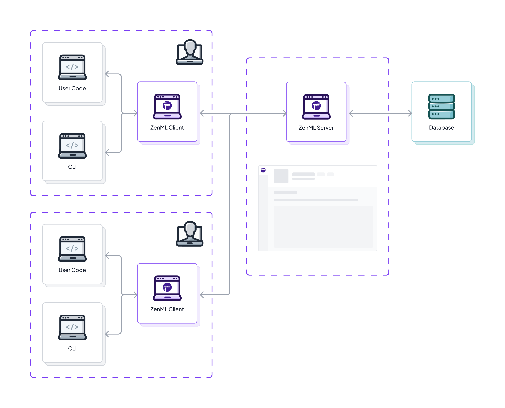

<!-- PROJECT SHIELDS -->
<!--
*** I'm using markdown "reference style" links for readability.
*** Reference links are enclosed in brackets [ ] instead of parentheses ( ).
*** See the bottom of this document for the declaration of the reference variables
*** for contributors-url, forks-url, etc. This is an optional, concise syntax you may use.
*** https://www.markdownguide.org/basic-syntax/#reference-style-links
-->

<div align="center">

  <!-- PROJECT LOGO -->
  <br />
    <a href="https://zenml.io">
      
    </a>
  <br />

  [![PyPi][pypi-shield]][pypi-url]
  [![PyPi][pypiversion-shield]][pypi-url]
  [![PyPi][downloads-shield]][downloads-url]
  [![Contributors][contributors-shield]][contributors-url]
  [![License][license-shield]][license-url]
  <!-- [![Build][build-shield]][build-url] -->
  <!-- [![CodeCov][codecov-shield]][codecov-url] -->

</div>

<!-- MARKDOWN LINKS & IMAGES -->
<!-- https://www.markdownguide.org/basic-syntax/#reference-style-links -->

[pypi-shield]: https://img.shields.io/pypi/pyversions/zenml?color=281158

[pypi-url]: https://pypi.org/project/zenml/

[pypiversion-shield]: https://img.shields.io/pypi/v/zenml?color=361776

[downloads-shield]: https://img.shields.io/pypi/dm/zenml?color=431D93

[downloads-url]: https://pypi.org/project/zenml/

[codecov-shield]: https://img.shields.io/codecov/c/gh/zenml-io/zenml?color=7A3EF4

[codecov-url]: https://codecov.io/gh/zenml-io/zenml

[contributors-shield]: https://img.shields.io/github/contributors/zenml-io/zenml?color=7A3EF4

[contributors-url]: https://github.com/zenml-io/zenml/graphs/contributors

[license-shield]: https://img.shields.io/github/license/zenml-io/zenml?color=9565F6

[license-url]: https://github.com/zenml-io/zenml/blob/main/LICENSE

[linkedin-shield]: https://img.shields.io/badge/-LinkedIn-black.svg?style=for-the-badge&logo=linkedin&colorB=555

[linkedin-url]: https://www.linkedin.com/company/zenml/

[twitter-shield]: https://img.shields.io/twitter/follow/zenml_io?style=for-the-badge

[twitter-url]: https://twitter.com/zenml_io

[slack-shield]: https://img.shields.io/badge/-Slack-black.svg?style=for-the-badge&logo=linkedin&colorB=555

[slack-url]: https://zenml.io/slack-invite

[build-shield]: https://img.shields.io/github/workflow/status/zenml-io/zenml/Build,%20Lint,%20Unit%20&%20Integration%20Test/develop?logo=github&style=for-the-badge

[build-url]: https://github.com/zenml-io/zenml/actions/workflows/ci.yml

<div align="center">
  
  <h3 align="center">Create an MLOps workflow for your entire team.</h3>
  <p align="center">
    <div align="center">
      Join our <a href="https://zenml.io/slack" target="_blank">
      
    <b>Slack Community</b> </a> and be part of the ZenML family.
    </div>
    <br />
    <a href="https://zenml.io/features">Features</a>
    ·
    <a href="https://zenml.io/roadmap">Roadmap</a>
    ·
    <a href="https://github.com/zenml-io/zenml/issues">Report Bug</a>
    ·
    <a href="https://zenml.io/cloud">Sign up for Cloud</a>
    ·
    <a href="https://www.zenml.io/blog">Read Blog</a>
    ·
    <a href="https://github.com/issues?q=is%3Aopen+is%3Aissue+archived%3Afalse+user%3Azenml-io+label%3A%22good+first+issue%22">Contribute to Open Source</a>
    ·
    <a href="https://github.com/zenml-io/zenml-projects">Projects Showcase</a>
    <br />
    <br />
    🎉 Version 0.56.3 is out. Check out the release notes
    <a href="https://github.com/zenml-io/zenml/releases">here</a>.
    <br />
    🖥️ Download our VS Code Extension <a href="https://marketplace.visualstudio.com/items?itemName=ZenML.zenml-vscode">here</a>.
    <br />
  </p>
</div>

---

<!-- TABLE OF CONTENTS -->
<details>
  <summary>🏁 Table of Contents</summary>
  <ol>
    <li><a href="#🤖-introduction">Introduction</a></li>
    <li><a href="#🤸-quickstart">Quickstart</a></li>
    <li>
      <a href="#🖼️-learning">Learning</a>
    </li>
    <li><a href="#🗺-roadmap">Roadmap</a></li>
    <li><a href="#🙌-contributing-and-community">Contributing and Community</a></li>
    <li><a href="#🆘-getting-help">Getting Help</a></li>
    <li><a href="#📜-license">License</a></li>
  </ol>
</details>

<br />

# 🤖 Introduction

🤹 ZenML is an extensible, open-source MLOps framework for creating portable,
production-ready machine learning pipelines. By decoupling infrastructure from
code, ZenML enables developers across your organization to collaborate more
effectively as they develop to production.

- 💼 ZenML gives data scientists the freedom to fully focus on modeling and
experimentation while writing code that is production-ready from the get-go.

- 👨‍💻 ZenML empowers ML engineers to take ownership of the entire ML lifecycle
  end-to-end. Adopting ZenML means fewer handover points and more visibility on
  what is happening in your organization.

- 🛫 ZenML enables MLOps infrastructure experts to define, deploy, and manage
sophisticated production environments that are easy to use for colleagues.

<div align="center">
  
</div>

# 🛠️ Why ZenML?


ZenML offers a systematic approach to structuring your machine learning codebase for a seamless transition to production. It's an ideal solution for teams grappling with establishing an internal standard for coordinating ML operations. ZenML provides not just a tool, but a workflow strategy that guides you in integrating all your tools and infrastructure effectively.

Use ZenML if:

- You need to easily automate ML workflows on services like an Airflow cluster or AWS Sagemaker Pipelines.
- Your ML tasks require repeatability and reproducibility.
- Automating and standardizing ML workflows across your team is a challenge.
- Your team integrates multiple tools with no central platform.
- You'd like a single place to track data, code, configuration, and models along with your cloud artifact storage.
- Collaboration and hand-overs between multiple teams is difficult.

# ☄️ What makes ZenML different?


ZenML marries the capabilities of a classic pipeline tool like [Airflow](https://airflow.apache.org/) and a metadata tracking service like [MLflow](https://mlflow.org/). Furthermore, both these types of tools can seamlessly co-exist with ZenML, providing a comprehensive, end-to-end ML experience.

It excels at:

- Enabling creation of simple, pythonic [ML pipelines](https://docs.zenml.io/user-guide/starter-guide/create-an-ml-pipeline) that function locally and on any [orchestration backend](https://docs.zenml.io/user-guide/production-guide/cloud-orchestration).
- Automating versioning of [data](https://docs.zenml.io/user-guide/starter-guide/manage-artifacts) and [models](https://docs.zenml.io/user-guide/starter-guide/track-ml-models) on [remote artifact storage like S3](https://docs.zenml.io/user-guide/production-guide/remote-storage).
- Abstracting infrastructure and run configuration from code through a [simple YAML config](https://docs.zenml.io/user-guide/advanced-guide/pipelining-features/configure-steps-pipelines).
- Logging complex [metadata](https://docs.zenml.io/user-guide/advanced-guide/data-management/logging-metadata) for models and artifacts.
- Automatically containerizing and deploying your workflows to the cloud, connected to your [code repository](https://docs.zenml.io/user-guide/production-guide/connect-code-repository).
- Connecting your [secret store](https://docs.zenml.io/user-guide/advanced-guide/secret-management) to your ML workflows.

However, ZenML doesn't:

- Automatically create visuals and track experiments: It [integrates with experiment trackers](https://docs.zenml.io/stacks-and-components/component-guide/experiment-trackers) that specialize in this task.
- Package and deploy models: ZenML catalogs models and metadata, streamlining model deployment. Refer to [ZenML model deployers](https://docs.zenml.io/stacks-and-components/component-guide/model-deployers) for more information.
- Handle distributed computation: While ZenML pipelines scale vertically with ease, it [works with tools like Spark](https://docs.zenml.io/stacks-and-components/component-guide/step-operators/spark-kubernetes) for intricate distributed workflows.

# 🤸 Quickstart

[Install ZenML](https://docs.zenml.io/getting-started/installation) via
[PyPI](https://pypi.org/project/zenml/). Python 3.8 - 3.11 is required:

```bash
pip install "zenml[server]"
# you'll also need the `notebook` package installed to run Jupyter notebooks:
# OPTIONALLY: `pip install notebook`
```

Take a tour with the guided quickstart by running:

```bash
zenml go
```

# 🔋 Deploy ZenML

For full functionality ZenML should be deployed on the cloud to
enable collaborative features as the central MLOps interface for teams.

<div align="center">
  
</div>

Currently, there are two main options to deploy ZenML:

- **ZenML Cloud**: With [ZenML Cloud](cloud.zenml.io/?utm_source=readme&utm_medium=referral_link&utm_campaign=cloud_promotion&utm_content=signup_link), 
you can utilize a control plane to create ZenML servers, also known as tenants. 
These tenants are managed and maintained by ZenML's dedicated team, alleviating 
the burden of server management from your end. 

- **Self-hosted deployment**: Alternatively, you have the flexibility to [deploy 
ZenML on your own self-hosted environment](https://docs.zenml.io/deploying-zenml/zenml-self-hosted). 
This can be achieved through various methods, including using our CLI, Docker, 
Helm, or HuggingFace Spaces.

# 🖼️ Learning

The best way to learn about ZenML is the [docs](https://docs.zenml.io). We recommend beginning with the [Starter Guide](https://docs.zenml.io/user-guide/starter-guide) to get up and running quickly.

For inspiration, here are some other examples and use cases:

1. [E2E Batch Inference](examples/e2e/): Feature engineering, training, and inference pipelines for tabular machine learning.
2. [Basic NLP with BERT](examples/e2e_nlp/): Feature engineering, training, and inference focused on NLP.
3. [LLM RAG Pipeline with Langchain and OpenAI](https://github.com/zenml-io/zenml-projects/tree/main/llm-agents): Using Langchain to create a simple RAG pipeline.
4. [Huggingface Model to Sagemaker Endpoint](https://github.com/zenml-io/zenml-projects/tree/main/huggingface-sagemaker): Automated MLOps on Amazon Sagemaker and HuggingFace.

# Use ZenML with VS Code

ZenML has a [VS Code
extension](https://marketplace.visualstudio.com/items?itemName=ZenML.zenml-vscode)
that allows you to inspect your stacks and pipeline runs directly from your
editor. The extension also allows you to switch your stacks without needing to
type any CLI commands.

<details>
  <summary>🖥️ VS Code Extension in Action!</summary>
  <div align="center">
  
</div>
</details>

# 🗺 Roadmap

ZenML is being built in public. The [roadmap](https://zenml.io/roadmap) is a
regularly updated source of truth for the ZenML community to understand where
the product is going in the short, medium, and long term.

ZenML is managed by a [core team](https://zenml.io/company) of
developers that are responsible for making key decisions and incorporating
feedback from the community. The team oversees feedback via various channels,
and you can directly influence the roadmap as follows:

- Vote on your most wanted feature on our [Discussion
  board](https://zenml.io/discussion).
- Start a thread in our [Slack channel](https://zenml.io/slack).
- [Create an issue](https://github.com/zenml-io/zenml/issues/new/choose) on our
  GitHub repo.

# 🙌 Contributing and Community

We would love to develop ZenML together with our community! The best way to get
started is to select any issue from the [`good-first-issue`
label](https://github.com/issues?q=is%3Aopen+is%3Aissue+archived%3Afalse+user%3Azenml-io+label%3A%22good+first+issue%22)
and open up a Pull Request! If you
would like to contribute, please review our [Contributing
Guide](CONTRIBUTING.md) for all relevant details.

# 🆘 Getting Help

The first point of call should
be [our Slack group](https://zenml.io/slack-invite/).
Ask your questions about bugs or specific use cases, and someone from
the [core team](https://zenml.io/company) will respond.
Or, if you
prefer, [open an issue](https://github.com/zenml-io/zenml/issues/new/choose) on
our GitHub repo.

# Vulnerability affecting `zenml<0.46.7` (CVE-2024-25723)

We have identified a critical security vulnerability in ZenML versions prior to
0.46.7. This vulnerability potentially allows unauthorized users to take
ownership of ZenML accounts through the user activation feature. Please [read our
blog post](https://www.zenml.io/blog/critical-security-update-for-zenml-users)
for more information on how we've addressed this.

# 📜 License

ZenML is distributed under the terms of the Apache License Version 2.0.
A complete version of the license is available in the [LICENSE](LICENSE) file in
this repository. Any contribution made to this project will be licensed under
the Apache License Version 2.0.
