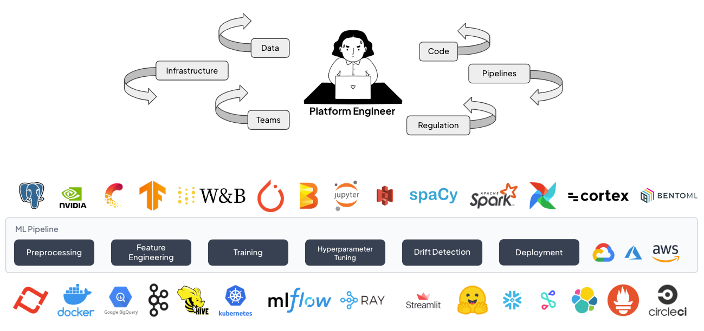
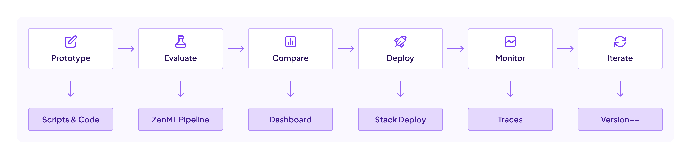

<div align="center">

  <!-- PROJECT LOGO -->
  <br />
    <a href="https://zenml.io">
      
    </a>
  <br />
  <div align="center">
    <h3 align="center">Your unified toolkit for shipping everything from decision trees to complex AI agents, built on the MLOps principles you already trust.</h3>
  </div>

  [![PyPi][pypi-shield]][pypi-url]
  [![PyPi][pypiversion-shield]][pypi-url]
  [![PyPi][downloads-shield]][downloads-url]
  [![Contributors][contributors-shield]][contributors-url]
  [![License][license-shield]][license-url]

</div>

<!-- MARKDOWN LINKS & IMAGES -->
[pypi-shield]: https://img.shields.io/pypi/pyversions/zenml?color=281158
[pypi-url]: https://pypi.org/project/zenml/
[pypiversion-shield]: https://img.shields.io/pypi/v/zenml?color=361776
[downloads-shield]: https://img.shields.io/pepy/dt/zenml?color=431D93
[downloads-url]: https://pypi.org/project/zenml/
[contributors-shield]: https://img.shields.io/github/contributors/zenml-io/zenml?color=7A3EF4
[contributors-url]: https://github.com/zenml-io/zenml/graphs/contributors
[license-shield]: https://img.shields.io/github/license/zenml-io/zenml?color=9565F6
[license-url]: https://github.com/zenml-io/zenml/blob/main/LICENSE

<div align="center">
<p>
    <a href="https://zenml.io/features">Features</a> •
    <a href="https://zenml.io/roadmap">Roadmap</a> •
    <a href="https://github.com/zenml-io/zenml/issues">Report Bug</a> •
    <a href="https://zenml.io/pro">Sign up for ZenML Pro</a> •
    <a href="https://www.zenml.io/blog">Blog</a> •
    <a href="https://zenml.io/podcast">Podcast</a>
    <br />
    <br />
    🎉 For the latest release, see the <a href="https://github.com/zenml-io/zenml/releases">release notes</a>.
</p>
</div>

---

ZenML is a unified MLOps framework that extends the battle-tested principles you rely on for classical ML to the new world of AI agents. It's one platform to develop, evaluate, and deploy your entire AI portfolio - from decision trees to complex multi-agent systems. By providing a single framework for your entire AI stack, ZenML enables developers across your organization to collaborate more effectively without maintaining separate toolchains for models and agents.


## 🚨 The Problem: MLOps Works for Models, But What About AI?



You're an ML engineer. You've perfected deploying `scikit-learn` models and wrangling PyTorch jobs. Your MLOps stack is dialed in. But now, you're being asked to build and ship AI agents, and suddenly your trusted toolkit is starting to crack.

- **The Adaptation Struggle:** Your MLOps habits (rigorous testing, versioning, CI/CD) don’t map cleanly onto agent development. How do you version a prompt? How do you regression test a non-deterministic system? The tools that gave you confidence for models now create friction for agents.

- **The Divided Stack:** To cope, teams are building a second, parallel stack just for LLM-based systems. Now you’re maintaining two sets of tools, two deployment pipelines, and two mental models. Your classical models live in one world, your agents in another. It's expensive, complex, and slows everyone down.

- **The Broken Feedback Loop:** Getting an agent from your local environment to production is a slow, painful journey. By the time you get feedback on performance, cost, or quality, the requirements have already changed. Iteration is a guessing game, not a data-driven process.

## 💡 The Solution: One Framework for your Entire AI Stack

Stop maintaining two separate worlds. ZenML is a unified MLOps framework that extends the battle-tested principles you rely on for classical ML to the new world of AI agents. It’s one platform to develop, evaluate, and deploy your entire AI portfolio.

```python
# Morning: Your sklearn pipeline is still versioned and reproducible.
train_and_deploy_classifier()

# Afternoon: Your new agent evaluation pipeline uses the same logic.
evaluate_and_deploy_agent()

# Same platform. Same principles. New possibilities.
```

With ZenML, you're not replacing your knowledge; you're extending it. Use the pipelines and practices you already know to version, test, deploy, and monitor everything from classic models to the most advanced agents.

## 💻 See It In Action: Multi-Agent Architecture Comparison

**The Challenge:** Your team built three different customer service agents. Which one should go to production? With ZenML, you can build a reproducible pipeline to test them on real data and make a data-driven decision, with full observability via Langgraph, LiteLLM & Langfuse.

https://github.com/user-attachments/assets/edeb314c-fe07-41ba-b083-cd9ab11db4a7

```python
from zenml import pipeline, step
from zenml.types import HTMLString
import pandas as pd

@step
def load_real_conversations() -> pd.DataFrame:
    """Load customer service queries for testing."""
    return load_customer_queries()

@step
def train_intent_classifier(queries: pd.DataFrame):
    """Train a scikit-learn classifier alongside your agents."""
    return train_sklearn_pipeline(queries)

@step
def load_prompts() -> dict:
    """Load prompts as versioned ZenML artifacts."""
    return load_agent_prompts_from_files()

@step
def run_architecture_comparison(queries: pd.DataFrame, classifier, prompts: dict) -> tuple:
    """Test three different agent architectures on the same data."""
    architectures = {
        "single_agent": SingleAgentRAG(prompts),
        "multi_specialist": MultiSpecialistAgents(prompts), 
        "langgraph_workflow": LangGraphAgent(prompts)  # Real LangGraph implementation!
    }
    
    # ZenML automatically versions agent code, prompts, and configurations
    # LiteLLM provides unified access to 100+ LLM providers
    # Langgraph orchestrates a multi-agent graph
    # Langfuse tracks costs, performance, and traces for full observability
    results = test_all_architectures(queries, architectures)
    mermaid_diagram = generate_langgraph_visualization()
    
    return results, mermaid_diagram

@step
def evaluate_and_decide(queries: pd.DataFrame, results: dict) -> HTMLString:
    """Generate beautiful HTML report with winner selection."""
    return create_styled_comparison_report(results)

@pipeline
def compare_agent_architectures():
    """Data-driven agent architecture decisions with full MLOps tracking."""
    queries = load_real_conversations()
    prompts = load_prompts()  # Prompts as versioned artifacts
    classifier = train_intent_classifier(queries)
    results, viz = run_architecture_comparison(queries, classifier, prompts)
    report = evaluate_and_decide(queries, results)

if __name__ == "__main__":
    compare_agent_architectures()
    # 🎯 Rich visualizations automatically appear in ZenML dashboard
```

**🚀 [See the complete working example →](examples/agent_comparison/)**
Prefer a smaller end-to-end template? Check out the [Minimal Agent Production](examples/minimal_agent_production/) example — a lightweight document analysis service with pipelines, evaluation, and a simple web UI.

**The Result:** A clear winner is selected based on data, not opinions. You have full lineage from the test data and agent versions to the final report and deployment decision.



## 🚀 Get Started (5 minutes)

### 🏗️ Architecture Overview

ZenML uses a **client-server architecture** with an integrated web dashboard ([zenml-io/zenml-dashboard](https://github.com/zenml-io/zenml-dashboard)) for pipeline visualization and management:

- **Local Development**: `pip install "zenml[server]"` - runs both client and server locally
- **Production**: Deploy server separately, connect with `pip install zenml` + `zenml login <server-url>`

```bash
# Install ZenML with server capabilities
pip install "zenml[server]"

# Install required dependencies
pip install scikit-learn openai numpy

# Initialize your ZenML repository
zenml init

# Start local server or connect to a remote one
zenml login

# Set OpenAI API key (optional)
export OPENAI_API_KEY=sk-svv....
```

### Your First Pipeline (2 minutes)

```python
# simple_pipeline.py
from zenml import pipeline, step
from sklearn.ensemble import RandomForestClassifier
from sklearn.datasets import make_classification
from sklearn.model_selection import train_test_split
from sklearn.metrics import accuracy_score
from typing import Tuple
from typing_extensions import Annotated
import numpy as np

@step
def create_dataset() -> Tuple[
    Annotated[np.ndarray, "X_train"],
    Annotated[np.ndarray, "X_test"], 
    Annotated[np.ndarray, "y_train"],
    Annotated[np.ndarray, "y_test"]
]:
    """Generate a simple classification dataset."""
    X, y = make_classification(n_samples=100, n_features=4, n_classes=2, random_state=42)
    X_train, X_test, y_train, y_test = train_test_split(X, y, test_size=0.2, random_state=42)
    return X_train, X_test, y_train, y_test

@step
def train_model(X_train: np.ndarray, y_train: np.ndarray) -> RandomForestClassifier:
    """Train a simple sklearn model."""
    model = RandomForestClassifier(n_estimators=10, random_state=42)
    model.fit(X_train, y_train)
    return model

@step
def evaluate_model(model: RandomForestClassifier, X_test: np.ndarray, y_test: np.ndarray) -> float:
    """Evaluate the model accuracy."""
    predictions = model.predict(X_test)
    return accuracy_score(y_test, predictions)

@step
def generate_summary(accuracy: float) -> str:
    """Use OpenAI to generate a model summary."""
    import openai

    client = openai.OpenAI()  # Set OPENAI_API_KEY environment variable
    response = client.chat.completions.create(
        model="gpt-3.5-turbo",
        messages=[{
            "role": "user", 
            "content": f"Write a brief summary of a ML model with {accuracy:.2%} accuracy."
        }],
        max_tokens=50
    )
    return response.choices[0].message.content

@pipeline
def simple_ml_pipeline():
    """A simple pipeline combining sklearn and OpenAI."""
    X_train, X_test, y_train, y_test = create_dataset()
    model = train_model(X_train, y_train)
    accuracy = evaluate_model(model, X_test, y_test)
    try:
        import openai  # noqa: F401
        generate_summary(accuracy)
    except ImportError:
        print("OpenAI is not installed. Skipping summary generation.")


if __name__ == "__main__":
    result = simple_ml_pipeline()
```

Run it:
```bash
export OPENAI_API_KEY="your-api-key-here"
python simple_pipeline.py
```

## 🗣️ Chat With Your Pipelines: ZenML MCP Server

Stop clicking through dashboards to understand your ML workflows. The **[ZenML MCP Server](https://github.com/zenml-io/mcp-zenml)** lets you query your pipelines, analyze runs, and trigger deployments using natural language through Claude Desktop, Cursor, or any MCP-compatible client.

```
💬 "Which pipeline runs failed this week and why?"
📊 "Show me accuracy metrics for all my customer churn models"  
🚀 "Trigger the latest fraud detection pipeline with production data"
```

**Quick Setup:**
1. Download the `.dxt` file from [zenml-io/mcp-zenml](https://github.com/zenml-io/mcp-zenml)
2. Drag it into Claude Desktop settings
3. Add your ZenML server URL and API key
4. Start chatting with your ML infrastructure

The MCP (Model Context Protocol) integration transforms your ZenML metadata into conversational insights, making pipeline debugging and analysis as easy as asking a question. Perfect for teams who want to democratize access to ML operations without requiring dashboard expertise.

## 📚 Learn More

### 🖼️ Getting Started Resources

The best way to learn about ZenML is through our comprehensive documentation and tutorials:

- **[Your First AI Pipeline](https://docs.zenml.io/your-first-ai-pipeline)** - Build and evaluate an AI service in minutes
- **[Starter Guide](https://docs.zenml.io/user-guides/starter-guide)** - From zero to production in 30 minutes
- **[LLMOps Guide](https://docs.zenml.io/user-guides/llmops-guide)** - Specific patterns for LLM applications
- **[SDK Reference](https://sdkdocs.zenml.io/)** - Complete SDK reference

For visual learners, start with this 11-minute introduction:

[](https://www.youtube.com/watch?v=wEVwIkDvUPs)

### 📖 Production Examples

1. **[Agent Architecture Comparison](examples/agent_comparison/)** - Compare AI agents with LangGraph workflows, LiteLLM integration, and automatic visualizations via custom materializers
2. **[Minimal Agent Production](examples/minimal_agent_production/)** - Document analysis service with pipelines, evaluation, and web UI
3. **[E2E Batch Inference](examples/e2e/)** - Complete MLOps pipeline with feature engineering
4. **[LLM RAG Pipeline](https://github.com/zenml-io/zenml-projects/tree/main/llm-complete-guide)** - Production RAG with evaluation loops
5. **[Agentic Workflow (Deep Research)](https://github.com/zenml-io/zenml-projects/tree/main/deep_research)** - Orchestrate your agents with ZenML
6. **[Fine-tuning Pipeline](https://github.com/zenml-io/zenml-projects/tree/main/gamesense)** - Fine-tune and deploy LLMs

### 🏢 Deployment Options

**For Teams:**
- **[Self-hosted](https://docs.zenml.io/getting-started/deploying-zenml)** - Deploy on your infrastructure with Helm/Docker
- **[ZenML Pro](https://cloud.zenml.io/?utm_source=readme)** - Managed service with enterprise support (free trial)

**Infrastructure Requirements:**
- Docker (or Kubernetes for production)
- Object storage (S3/GCS/Azure)
- MySQL-compatible database (MySQL 8.0+ or MariaDB)
- _[Complete requirements](https://docs.zenml.io/getting-started/deploying-zenml/deploy-with-helm)_

### 🎓 Books & Resources

<div align="center">
  <a href="https://www.amazon.com/LLM-Engineers-Handbook-engineering-production/dp/1836200072">
    
  </a>
  <a href="https://www.amazon.com/-/en/Andrew-McMahon/dp/1837631964">
    
  </a>
</div>

ZenML is featured in these comprehensive guides to production AI systems.

## 🤝 Join ML Engineers Building the Future of AI

**Contribute:**
- 🌟 [Star us on GitHub](https://github.com/zenml-io/zenml/stargazers) - Help others discover ZenML
- 🤝 [Contributing Guide](CONTRIBUTING.md) - Start with [`good-first-issue`](https://github.com/issues?q=is%3Aopen+is%3Aissue+archived%3Afalse+user%3Azenml-io+label%3A%22good+first+issue%22)
- 💻 [Write Integrations](https://github.com/zenml-io/zenml/blob/main/src/zenml/integrations/README.md) - Add your favorite tools

**Stay Updated:**
- 🗺 [Public Roadmap](https://zenml.io/roadmap) - See what's coming next
- 📰 [Blog](https://zenml.io/blog) - Best practices and case studies
- 🎙 [Slack](https://zenml.io/slack) - Talk with AI practitioners

## ❓ FAQs from ML Engineers Like You

**Q: "Do I need to rewrite my agents or models to use ZenML?"**

A: No. Wrap your existing code in a `@step`. Keep using `scikit-learn`, PyTorch, LangGraph, LlamaIndex, or raw API calls. ZenML orchestrates your tools, it doesn't replace them.

**Q: "How is this different from LangSmith/Langfuse?"**

A: They provide excellent observability for LLM applications. We orchestrate the **full MLOps lifecycle for your entire AI stack**. With ZenML, you manage both your classical ML models and your AI agents in one unified framework, from development and evaluation all the way to production deployment.

**Q: "Can I use my existing MLflow/W&B setup?"**

A: Yes! ZenML integrates with both [MLflow](https://docs.zenml.io/stacks/experiment-trackers/mlflow) and [Weights & Biases](https://docs.zenml.io/stacks/experiment-trackers/wandb). Your experiments, our pipelines.

**Q: "Is this just MLflow with extra steps?"**

A: No. MLflow tracks experiments. We orchestrate the entire development process – from training and evaluation to deployment and monitoring – for both models and agents.

**Q: "How do I configure ZenML with Kubernetes?"**

A: ZenML integrates with Kubernetes through the native Kubernetes orchestrator, Kubeflow, and other K8s-based orchestrators. See our [Kubernetes orchestrator guide](https://docs.zenml.io/stacks/orchestrators/kubernetes) and [Kubeflow guide](https://docs.zenml.io/stacks/orchestrators/kubeflow), plus [deployment documentation](https://docs.zenml.io/getting-started/deploying-zenml/deploy-with-helm).

**Q: "What about cost? I can't afford another platform."**

A: ZenML's open-source version is free forever. You likely already have the required infrastructure (like a Kubernetes cluster and object storage). We just help you make better use of it for MLOps.

### 🛠 VS Code Extension

Manage pipelines directly from your editor:

<details>
  <summary>🖥️ VS Code Extension in Action!</summary>
  <div align="center">
  
</div>
</details>

Install from [VS Code Marketplace](https://marketplace.visualstudio.com/items?itemName=ZenML.zenml-vscode).

## 📜 License

ZenML is distributed under the terms of the Apache License Version 2.0. See
[LICENSE](LICENSE) for details.
