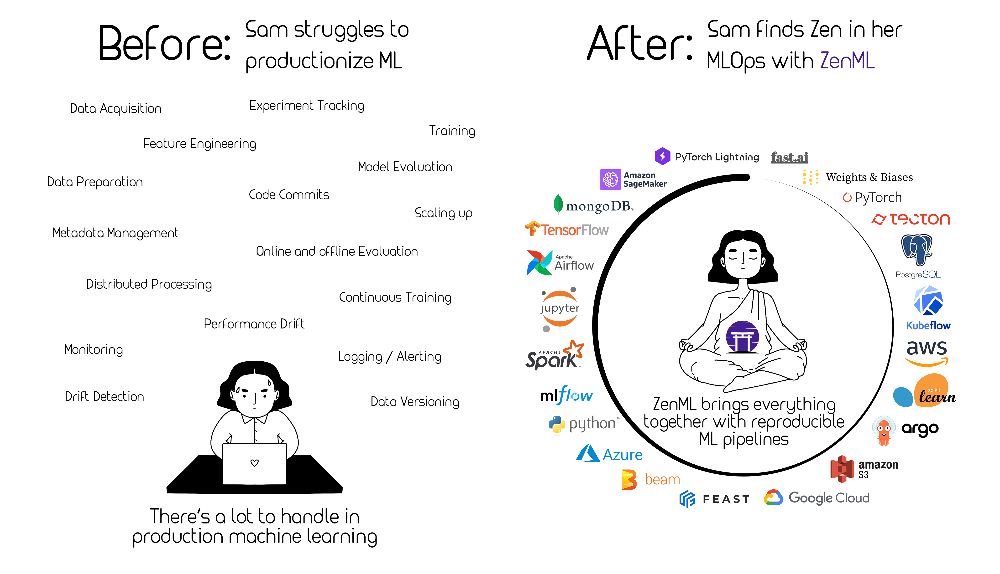

<div align="center">
    
</div>

# 👀 What is ZenML?

**ZenML** is an extensible, open-source MLOps framework to create production-ready machine learning pipelines. Built for data scientists, it has a simple, flexible syntax, is cloud- and tool-agnostic, and has interfaces/abstractions that are catered towards ML workflows.

At its core, **ZenML pipelines execute ML-specific workflows** from sourcing data to splitting, preprocessing, training, all the way to the evaluation of results and even serving. There are many built-in batteries to support common ML development tasks. ZenML is not here to replace the great tools that solve these individual problems. Rather, it **integrates natively with popular ML tooling** and gives standard abstraction to write your workflows.

🎉 **Version 0.7.0 out now!** [Check out the release notes here](https://github.com/zenml-io/zenml/releases).

[](https://pypi.org/project/zenml/)
[](https://pepy.tech/project/zenml)

[](https://codecov.io/gh/zenml-io/zenml)
[](https://interrogate.readthedocs.io/en/latest/)


<div align="center">
Join our <a href="https://zenml.io/slack-invite" target="_blank">
    
<b>Slack Community</b> </a> and become part of the ZenML family
</div>
<div align="center"> Give us a 
    
<b>GitHub star</b> to show your love
</div>
<div align="center"> 
    <b>NEW: </b> <a href="https://zenml.io/discussion" target="_blank"><b> Vote</b></a> on the next ZenML features 
</div>

<br>



# 🤖 Why use ZenML?

ZenML pipelines are designed to be written early on the development lifecycle. Data scientists can explore their pipelines as they develop towards production, switching stacks from local to cloud deployments with ease. You can read more about why we started building ZenML [on our blog](https://blog.zenml.io/why-zenml/). By using ZenML in the early stages of your project, you get the following benefits:

- **Reproducibility** of training and inference workflows
- A **simple and clear** way to represent the steps of your pipeline in code
- **Plug-and-play integrations**: bring all your favorite tools together
- Easy switching between local and cloud stacks
- Painless **deployment and configuration** of infrastructure
- **Scale up** your stack transparently and logically to suit your training and deployment needs

# 📖 Learn More

| ZenML Resources | Description |
| ------------- | - |
| 🧘‍♀️ **[ZenML 101]** | New to ZenML? Here's everything you need to know! |
| ⚛️ **[Core Concepts]** | Some key terms and concepts we use. |
| 🗃 **[Functional API Guide]** | Build production ML pipelines with simple functions. |
| 🚀 **[New in v0.7.0]** | New features, bug fixes. |
| 🗳 **[Vote for Features]** | Pick what we work on next! |
| 📓 **[Docs]** | Full documentation for creating your own ZenML pipelines. |
| 📒 **[API Reference]** | The detailed reference for ZenML's API. |
| 🗂️️ **[ZenFiles]** | End-to-end projects using ZenML. |
| ⚽️ **[Examples]** | Learn best through examples where ZenML is used? We've got you covered. |
| 📬 **[Blog]** | Use cases of ZenML and technical deep dives on how we built it. |
| 🔈 **[Podcast]** | Conversations with leaders in ML, released every 2 weeks. |
| 📣 **[Newsletter]** | We build ZenML in public. Subscribe to learn how we work. |
| 💬 **[Join Slack]** | Need help with your specific use case? Say hi on Slack! |
| 🗺 **[Roadmap]** | See where ZenML is working to build new features. |
| 🙋‍♀️ **[Contribute]** | How to contribute to the ZenML project and code base. |

[ZenML 101]: https://docs.zenml.io/
[Core Concepts]: https://docs.zenml.io/core-concepts
[Functional API Guide]: https://docs.zenml.io/v/docs/guides/functional-api
[New in v0.7.0]: https://github.com/zenml-io/zenml/releases
[Vote for Features]: https://zenml.io/discussion
[Docs]: https://docs.zenml.io/
[API Reference]: https://apidocs.zenml.io/
[ZenFiles]: https://github.com/zenml-io/zenfiles
[Examples]: https://github.com/zenml-io/zenml/tree/main/examples
[Blog]: https://blog.zenml.io/
[Podcast]: https://podcast.zenml.io/
[Newsletter]: https://zenml.io/newsletter/
[Join Slack]: https://zenml.io/slack-invite/
[Roadmap]: https://zenml.io/roadmap
[Contribute]: https://github.com/zenml-io/zenml/blob/main/CONTRIBUTING.md

# 🎮 Features

### 1. 🗃 Use Caching across (Pipelines As) Experiments

ZenML makes sure for every pipeline you can trust that:

- Code is versioned
- Data is versioned
- Models are versioned
- Configurations are versioned

You can utilize caching to help iterate quickly through ML experiments. (Read [our blogpost](https://blog.zenml.io/caching-ml-pipelines/) to learn more!)

### 2. ♻️ Leverage Powerful Integrations

Once code is organized into a ZenML pipeline, you can supercharge your ML development with [powerful integrations](https://docs.zenml.io/features/integrations) on multiple [MLOps stacks](https://docs.zenml.io/core-concepts). There are lots of moving parts for all the MLOps tooling and infrastructure you require for ML in production and ZenML aims to bring it all together under one roof.

We currently support [Airflow](https://airflow.apache.org/) and [Kubeflow](https://www.kubeflow.org/) as third-party orchestrators for your ML pipeline code. ZenML steps can be built from any of the other tools you usually use in your ML workflows, from [`scikit-learn`](https://scikit-learn.org/stable/) to [`PyTorch`](https://pytorch.org/) or [`TensorFlow`](https://www.tensorflow.org/).


### 3. ☁️ Scale to the Cloud

Switching from local experiments to cloud-based pipelines doesn't need to be complicated. ZenML supports running pipelines on Kubernetes clusters in the cloud through our [Kubeflow](https://www.kubeflow.org/) integration. Switching from your local stack to a cloud stack is easy to do with our CLI tool.

### 4. 🧩 Visualize the Steps of your Pipeline

It’s not uncommon for pipelines to be made up of many steps, and those steps can interact and intersect with one another in often complex patterns. We’ve built a way for you to inspect what’s going on with your ZenML pipeline:


### 5. 📊 Visualize Statistics

Now you can use awesome third-party libraries to visualize ZenML steps and artifacts. We support the facets visualization for statistics out of the box, to find data drift between your training and test sets.

We use the built-in FacetStatisticsVisualizer using the [Facets Overview](https://pypi.org/project/facets-overview/) integration.


### 6. 🧐 Introspect your Pipeline Results

Once you've run your experiment, you need a way of seeing what was produced and how it was produced. We offer a flexible interface to support [post-execution workflows](https://docs.zenml.io/v/docs/guides/post-execution-workflow). This allows you to access any of the artifacts produced by pipeline steps as well as any associated metadata.

```python
pipeline = repo.get_pipeline(pipeline_name=..., stack_key=...) # access a pipeline by name and/or stack key
runs = pipeline.runs  # all runs of a pipeline chronologically ordered
run = runs[-1]  # latest run
steps = run.steps  # all steps of a pipeline
step = steps[0] 
output = step.output
df = output.read(materializer_class=PandasMaterializer)
df.head()
```

### 7. 🛠 Configure Pipeline Runs with YAML Code

Not everyone wants to keep their configuration of pipeline runs in the same place as the active code defining steps. You can define the particular customization of runs with YAML code if that's your jam!


```yaml
steps:
  step_name:
    parameters:
      parameter_name: parameter_value
      some_other_parameter_name: 2
  some_other_step_name:
    ...
```

# 🤸 Getting Started

## 💾 Install ZenML

*Requirements*: ZenML supports Python 3.7 and 3.8.

ZenML is available for easy installation into your environment via PyPI:

```bash
pip install zenml
```

Alternatively, if you’re feeling brave, feel free to install the bleeding edge:
**NOTE:** Do so on your own risk, no guarantees given!

```bash
pip install git+https://github.com/zenml-io/zenml.git@main --upgrade
```

ZenML is also available as a Docker image hosted publicly on [DockerHub](https://hub.docker.com/r/zenmldocker/zenml). 
Use the following command to get started in a bash environment:

```shell
docker run -it zenmldocker/zenml /bin/bash
```

## 🚅 Quickstart

The quickest way to get started is to create a simple pipeline.

#### Step 1: Initialize a ZenML repo

```bash
zenml init
zenml integration install sklearn # we use scikit-learn for this example
```

#### Step 2: Assemble, run, and evaluate your pipeline locally

```python
import numpy as np
from sklearn.base import ClassifierMixin

from zenml.integrations.sklearn.helpers.digits import get_digits, get_digits_model
from zenml.pipelines import pipeline
from zenml.steps import step, Output

@step
def importer() -> Output(
    X_train=np.ndarray, X_test=np.ndarray, y_train=np.ndarray, y_test=np.ndarray
):
    """Loads the digits array as normal numpy arrays."""
    X_train, X_test, y_train, y_test = get_digits()
    return X_train, X_test, y_train, y_test


@step
def trainer(
    X_train: np.ndarray,
    y_train: np.ndarray,
) -> ClassifierMixin:
    """Train a simple sklearn classifier for the digits dataset."""
    model = get_digits_model()
    model.fit(X_train, y_train)
    return model


@step
def evaluator(
    X_test: np.ndarray,
    y_test: np.ndarray,
    model: ClassifierMixin,
) -> float:
    """Calculate the accuracy on the test set"""
    test_acc = model.score(X_test, y_test)
    print(f"Test accuracy: {test_acc}")
    return test_acc


@pipeline
def mnist_pipeline(
    importer,
    trainer,
    evaluator,
):
    """Links all the steps together in a pipeline"""
    X_train, X_test, y_train, y_test = importer()
    model = trainer(X_train=X_train, y_train=y_train)
    evaluator(X_test=X_test, y_test=y_test, model=model)


pipeline = mnist_pipeline(
    importer=importer(),
    trainer=trainer(),
    evaluator=evaluator(),
)
pipeline.run()
```

# 🗂️ ZenFiles

ZenFiles are production-grade ML use-cases powered by ZenML. They are fully fleshed out, end-to-end, projects that showcase 
ZenML's capabilities. They can also serve as a template from which to start similar projects.

The ZenFiles project is fully maintained and can be viewed as a sister repository of ZenML. Check it out [here](https://github.com/zenml-io/zenfiles).

# 🗺 Roadmap

ZenML is being built in public. The [roadmap](https://zenml.io/roadmap) is a regularly updated source of truth for the ZenML community to understand where the product is going in the short, medium, and long term.

ZenML is managed by a [core team](https://zenml.io/team) of developers that are responsible for making key decisions and incorporating feedback from the community. The team oversees feedback via various channels, and you can directly influence the roadmap as follows:

- Vote on your most wanted feature on our [Discussion board](https://zenml.io/discussion).
- Create a [Feature Request](https://github.com/zenml-io/zenml/issues/new/choose) in the [GitHub board](https://github.com/zenml-io/zenml/issues).
- Start a thread in our [Slack channel](https://zenml.io/slack-invite).

# 🙋‍♀️ Contributing & Community

We would love to develop ZenML together with our community! Best way to get started is to select any issue from the [`good-first-issue` label](https://github.com/zenml-io/zenml/labels/good%20first%20issue). If you would like to contribute, please review our [Contributing Guide](CONTRIBUTING.md) for all relevant details.

<br>


# 🆘 Where to get help

First point of call should be [our Slack group](https://zenml.io/slack-invite/). Ask your questions about bugs or specific use cases and someone from the core team will respond.

# 📜 License

ZenML is distributed under the terms of the Apache License Version 2.0. A complete version of the license is available in the [LICENSE.md](LICENSE.md) in this repository. Any contribution made to this project will be licensed under the Apache License Version 2.0.
