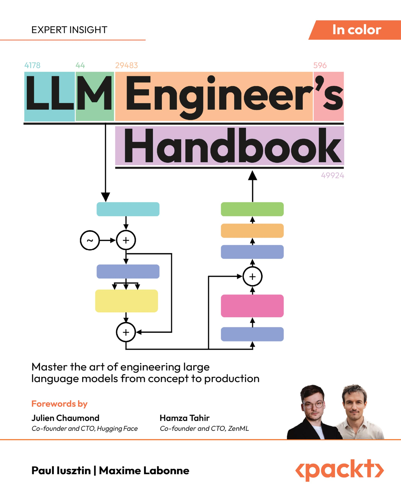
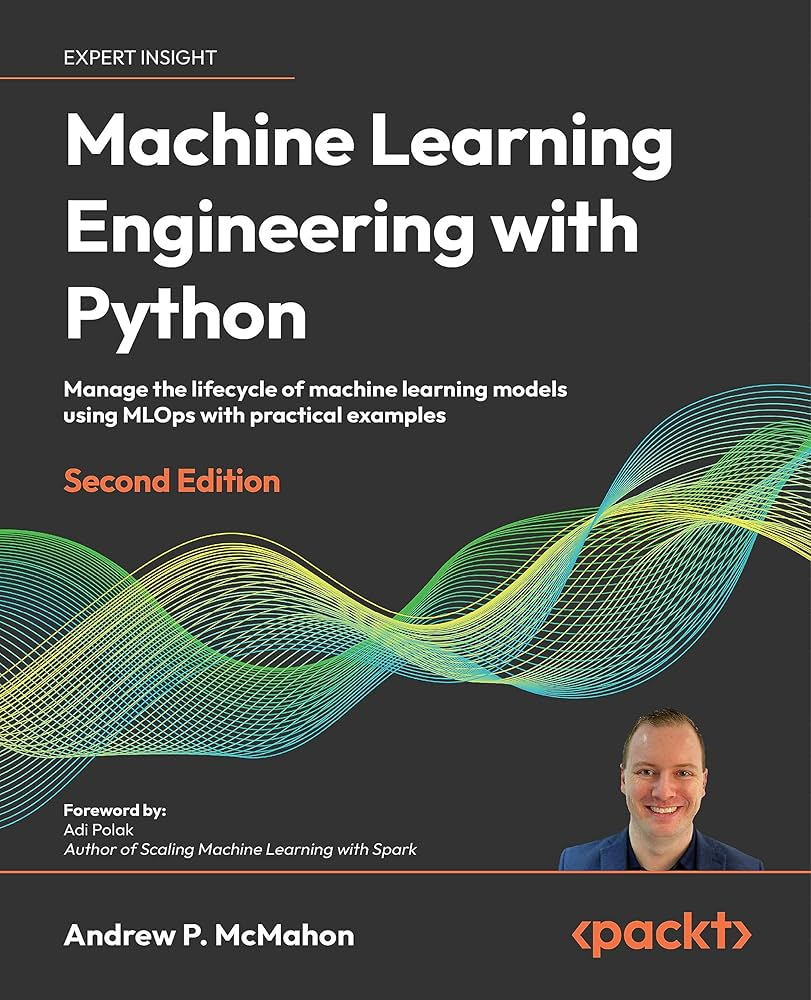

<div align="center">
  
  <h1 align="center">Beyond The Demo: Production-Grade AI Systems</h1>
  <h3 align="center">ZenML brings battle-tested MLOps practices to your AI applications, handling evaluation, monitoring, and deployment at scale</h3>
</div>

<!-- PROJECT SHIELDS -->
<!--
*** I'm using markdown "reference style" links for readability.
*** Reference links are enclosed in brackets [ ] instead of parentheses ( ).
*** See the bottom of this document for the declaration of the reference variables
*** for contributors-url, forks-url, etc. This is an optional, concise syntax you may use.
*** https://www.markdownguide.org/basic-syntax/#reference-style-links
-->

<div align="center">

  <!-- PROJECT LOGO -->
  <br />
    <a href="https://zenml.io">
      
    </a>
  <br />

  [![PyPi][pypi-shield]][pypi-url]
  [![PyPi][pypiversion-shield]][pypi-url]
  [![PyPi][downloads-shield]][downloads-url]
  [![Contributors][contributors-shield]][contributors-url]
  [![License][license-shield]][license-url]
  <!-- [![Build][build-shield]][build-url] -->
  <!-- [![CodeCov][codecov-shield]][codecov-url] -->

</div>

<!-- MARKDOWN LINKS & IMAGES -->
<!-- https://www.markdownguide.org/basic-syntax/#reference-style-links -->

[pypi-shield]: https://img.shields.io/pypi/pyversions/zenml?color=281158

[pypi-url]: https://pypi.org/project/zenml/

[pypiversion-shield]: https://img.shields.io/pypi/v/zenml?color=361776

[downloads-shield]: https://img.shields.io/pypi/dm/zenml?color=431D93

[downloads-url]: https://pypi.org/project/zenml/

[codecov-shield]: https://img.shields.io/codecov/c/gh/zenml-io/zenml?color=7A3EF4

[codecov-url]: https://codecov.io/gh/zenml-io/zenml

[contributors-shield]: https://img.shields.io/github/contributors/zenml-io/zenml?color=7A3EF4

[contributors-url]: https://github.com/zenml-io/zenml/graphs/contributors

[license-shield]: https://img.shields.io/github/license/zenml-io/zenml?color=9565F6

[license-url]: https://github.com/zenml-io/zenml/blob/main/LICENSE

[linkedin-shield]: https://img.shields.io/badge/-LinkedIn-black.svg?style=for-the-badge&logo=linkedin&colorB=555

[linkedin-url]: https://www.linkedin.com/company/zenml/

[twitter-shield]: https://img.shields.io/twitter/follow/zenml_io?style=for-the-badge

[twitter-url]: https://twitter.com/zenml_io

[slack-shield]: https://img.shields.io/badge/-Slack-black.svg?style=for-the-badge&logo=linkedin&colorB=555

[slack-url]: https://zenml.io/slack-invite

[build-shield]: https://img.shields.io/github/workflow/status/zenml-io/zenml/Build,%20Lint,%20Unit%20&%20Integration%20Test/develop?logo=github&style=for-the-badge

[build-url]: https://github.com/zenml-io/zenml/actions/workflows/ci.yml

---

Need help with documentation? Visit our [docs site](https://docs.zenml.io) for comprehensive guides and tutorials, or browse the [SDK reference](https://sdkdocs.zenml.io/) to find specific functions and classes.

## ⭐️ Show Your Support

If you find ZenML helpful or interesting, please consider giving us a star on GitHub. Your support helps promote the project and lets others know that it's worth checking out. 

Thank you for your support! 🌟

[](https://github.com/zenml-io/zenml/stargazers)

## 🤸 Quickstart
[](https://colab.research.google.com/github/zenml-io/zenml/blob/main/examples/quickstart/quickstart.ipynb)

[Install ZenML](https://docs.zenml.io/getting-started/installation) via [PyPI](https://pypi.org/project/zenml/). Python 3.9 - 3.12 is required:

```bash
pip install "zenml[server]" notebook
```

Take a tour with the guided quickstart by running:

```bash
zenml go
```

## 🪄 From Prototype to Production: AI Made Simple

### Create AI pipelines with minimal code changes

ZenML is an open-source framework that handles MLOps and LLMOps for engineers scaling AI beyond prototypes. Automate evaluation loops, track performance, and deploy updates across 100s of pipelines—all while your RAG apps run like clockwork.

```python
from zenml import pipeline, step

@step
def load_rag_documents() -> dict:
    # Load and chunk documents for RAG pipeline
    documents = extract_web_content(url="https://www.zenml.io/")
    return {"chunks": chunk_documents(documents)}

@step
def generate_embeddings(data: dict) -> None:
    # Generate embeddings for RAG pipeline
    embeddings = embed_documents(data['chunks'])
    return {"embeddings": embeddings}

@step
def index_generator(
    embeddings: dict,
) -> str:
    # Generate index for RAG pipeline
    index = create_index(embeddings)
    return index.id
    

@pipeline
def rag_pipeline() -> str:
    documents = load_rag_documents()
    embeddings = generate_embeddings(documents)
    index = index_generator(embeddings)
    return index
```


### Easily provision an MLOps stack or reuse your existing infrastructure

The framework is a gentle entry point for practitioners to build complex ML pipelines with little knowledge required of the underlying infrastructure complexity. ZenML pipelines can be run on AWS, GCP, Azure, Airflow, Kubeflow and even on Kubernetes without having to change any code or know underlying internals. 

ZenML provides different features to aid people to get started quickly on a remote setting as well. If you want to deploy a remote stack from scratch on your selected cloud provider, you can use the 1-click deployment feature either through the dashboard:


Or, through our CLI command:

```bash
zenml stack deploy --provider aws
```

Alternatively, if the necessary pieces of infrastructure are already deployed, you can register a cloud stack seamlessly through the stack wizard:

```bash
zenml stack register <STACK_NAME> --provider aws
```

Read more about [ZenML stacks](https://docs.zenml.io/user-guide/production-guide/understand-stacks).

### Run workloads easily on your production infrastructure

Once you have your MLOps stack configured, you can easily run workloads on it:

```bash
zenml stack set <STACK_NAME>
python run.py
```

```python
from zenml.config import ResourceSettings, DockerSettings

@step(
  settings={
    "resources": ResourceSettings(memory="16GB", gpu_count="1", cpu_count="8"),
    "docker": DockerSettings(parent_image="pytorch/pytorch:1.12.1-cuda11.3-cudnn8-runtime")
  }
)
def training(...):
	...
```


### Track models, pipeline, and artifacts

Create a complete lineage of who, where, and what data and models are produced.

You'll be able to find out who produced which model, at what time, with which data, and on which version of the code. This guarantees full reproducibility and auditability.

```python
from zenml import Model

@step(model=Model(name="rag_llm", tags=["staging"]))
def deploy_rag(index_id: str) -> str:
    deployment_id = deploy_to_endpoint(index_id)
    return deployment_id
```


## 🚀 Key LLMOps Capabilities

### Continual RAG Improvement
**Build production-ready retrieval systems**  

<div align="center">
  
</div>

ZenML tracks document ingestion, embedding versions, and query patterns. Implement feedback loops and:
- Fix your RAG logic based on production logs
- Automatically re-ingest updated documents
- A/B test different embedding models
- Monitor retrieval quality metrics

### Reproducible Model Fine-Tuning
**Confidence in model updates**

<div align="center">
  
</div>

Maintain full lineage of SLM/LLM training runs:
- Version training data and hyperparameters
- Track performance across iterations
- Automatically promote validated models
- Roll back to previous versions if needed

### Purpose built for machine learning with integrations to your favorite tools

While ZenML brings a lot of value out of the box, it also integrates into your existing tooling and infrastructure without you having to be locked in.

```python
from bentoml._internal.bento import bento

@step(on_failure=alert_slack, experiment_tracker="mlflow")
def train_and_deploy(training_df: pd.DataFrame) -> bento.Bento
	mlflow.autolog()
	...
	return bento
```


## 🔄 Your LLM Framework Isn't Enough for Production

While tools like LangChain and LlamaIndex help you **build** LLM workflows, ZenML helps you **productionize** them by adding:

✅ **Artifact Tracking** - Every vector store index, fine-tuned model, and evaluation result versioned automatically  
✅ **Pipeline History** - See exactly what code/data produced each version of your RAG system  
✅ **Stage Promotion** - Move validated pipelines from staging → production with one click  

## 🖼️ Learning

The best way to learn about ZenML is the [docs](https://docs.zenml.io/). We recommend beginning with the [Starter Guide](https://docs.zenml.io/user-guide/starter-guide) to get up and running quickly.

If you are a visual learner, this 11-minute video tutorial is also a great start:

[](https://www.youtube.com/watch?v=wEVwIkDvUPs)

And finally, here are some other examples and use cases for inspiration:

1. [E2E Batch Inference](examples/e2e/): Feature engineering, training, and inference pipelines for tabular machine learning.
2. [Basic NLP with BERT](examples/e2e_nlp/): Feature engineering, training, and inference focused on NLP.
3. [LLM RAG Pipeline with Langchain and OpenAI](https://github.com/zenml-io/zenml-projects/tree/main/zenml-support-agent): Using Langchain to create a simple RAG pipeline.
4. [Huggingface Model to Sagemaker Endpoint](https://github.com/zenml-io/zenml-projects/tree/main/huggingface-sagemaker): Automated MLOps on Amazon Sagemaker and HuggingFace
5. [LLMops](https://github.com/zenml-io/zenml-projects/tree/main/llm-complete-guide): Complete guide to do LLM with ZenML


## 📚 Learn from Books

<div align="center">
  <a href="https://www.amazon.com/LLM-Engineers-Handbook-engineering-production/dp/1836200072">
    </img>
  </a>&nbsp;&nbsp;&nbsp;&nbsp;
  <a href="https://www.amazon.com/-/en/Andrew-McMahon/dp/1837631964">
    </img>
  </a>
  </br></br>
</div>

ZenML is featured in these comprehensive guides to modern MLOps and LLM engineering. Learn how to build production-ready machine learning systems with real-world examples and best practices.

## 🔋 Deploy ZenML

For full functionality ZenML should be deployed on the cloud to
enable collaborative features as the central MLOps interface for teams.

Read more about various deployment options [here](https://docs.zenml.io/getting-started/deploying-zenml).

Or, sign up for [ZenML Pro to get a fully managed server on a free trial](https://cloud.zenml.io/?utm_source=readme&utm_medium=referral_link&utm_campaign=cloud_promotion&utm_content=signup_link).

## Use ZenML with VS Code

ZenML has a [VS Code extension](https://marketplace.visualstudio.com/items?itemName=ZenML.zenml-vscode) that allows you to inspect your stacks and pipeline runs directly from your editor. The extension also allows you to switch your stacks without needing to type any CLI commands.

<details>
  <summary>🖥️ VS Code Extension in Action!</summary>
  <div align="center">
  
</div>
</details>

## 🗺 Roadmap

ZenML is being built in public. The [roadmap](https://zenml.io/roadmap) is a regularly updated source of truth for the ZenML community to understand where the product is going in the short, medium, and long term.

ZenML is managed by a [core team](https://zenml.io/company) of developers that are responsible for making key decisions and incorporating feedback from the community. The team oversees feedback via various channels,
and you can directly influence the roadmap as follows:

- Vote on your most wanted feature on our [Discussion
board](https://zenml.io/discussion).
- Start a thread in our [Slack channel](https://zenml.io/slack).
- [Create an issue](https://github.com/zenml-io/zenml/issues/new/choose) on our GitHub repo.

## 🙌 Contributing and Community

We would love to develop ZenML together with our community! The best way to get
started is to select any issue from the `[good-first-issue`
label](https://github.com/issues?q=is%3Aopen+is%3Aissue+archived%3Afalse+user%3Azenml-io+label%3A%22good+first+issue%22)
and open up a Pull Request! 

If you
would like to contribute, please review our [Contributing
Guide](CONTRIBUTING.md) for all relevant details.

## 🆘 Getting Help

The first point of call should
be [our Slack group](https://zenml.io/slack-invite/).
Ask your questions about bugs or specific use cases, and someone from
the [core team](https://zenml.io/company) will respond.
Or, if you
prefer, [open an issue](https://github.com/zenml-io/zenml/issues/new/choose) on
our GitHub repo.

## 📚 LLM-focused Learning Resources

1. [LL Complete Guide - Full RAG Pipeline](https://github.com/zenml-io/zenml-projects/tree/main/llm-complete-guide) - Document ingestion, embedding management, and query serving
2. [LLM Fine-Tuning Pipeline](https://github.com/zenml-io/zenml-projects/tree/main/zencoder) - From data prep to deployed model
3. [LLM Agents Example](https://github.com/zenml-io/zenml-projects/tree/main/zenml-support-agent) - Track conversation quality and tool usage

## 🤖 AI-Friendly Documentation with llms.txt

ZenML implements the llms.txt standard to make our documentation more accessible to AI assistants and LLMs. Our implementation includes:

- Base documentation at [zenml.io/llms.txt](https://zenml.io/llms.txt) with core user guides
- Specialized files for different documentation aspects:
  - [Component guides](https://zenml.io/component-guide.txt) for integration details
  - [How-to guides](https://zenml.io/how-to-guides.txt) for practical implementations
  - [Complete documentation corpus](https://zenml.io/llms-full.txt) for comprehensive access

This structured approach helps AI tools better understand and utilize ZenML's documentation, enabling more accurate code suggestions and improved documentation search.

## 📜 License

ZenML is distributed under the terms of the Apache License Version 2.0.
A complete version of the license is available in the [LICENSE](LICENSE) file in
this repository. Any contribution made to this project will be licensed under
the Apache License Version 2.0.

<div>
<p align="left">
    <div align="left">
      Join our <a href="https://zenml.io/slack" target="_blank">
      
    <b>Slack Community</b> </a> and be part of the ZenML family.
    </div>
    <br />
    <a href="https://zenml.io/features">Features</a>
    ·
    <a href="https://zenml.io/roadmap">Roadmap</a>
    ·
    <a href="https://github.com/zenml-io/zenml/issues">Report Bug</a>
    ·
    <a href="https://zenml.io/pro">Sign up for ZenML Pro</a>
    ·
    <a href="https://www.zenml.io/blog">Read Blog</a>
    ·
    <a href="https://github.com/issues?q=is%3Aopen+is%3Aissue+archived%3Afalse+user%3Azenml-io+label%3A%22good+first+issue%22">Contribute to Open Source</a>
    ·
    <a href="https://github.com/zenml-io/zenml-projects">Projects Showcase</a>
    <br />
    <br />
    🎉 Version 0.80.1 is out. Check out the release notes
    <a href="https://github.com/zenml-io/zenml/releases">here</a>.
    <br />
    🖥️ Download our VS Code Extension <a href="https://marketplace.visualstudio.com/items?itemName=ZenML.zenml-vscode">here</a>.
    <br />
  </p>
</div>
