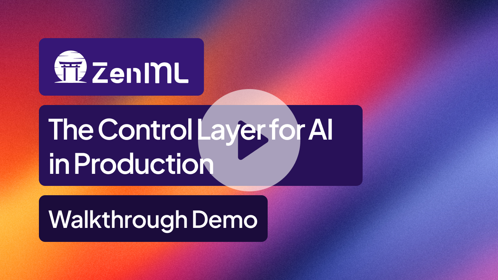

<div align="center">

  <!-- PROJECT LOGO -->
  <br />
    <a href="https://zenml.io">
      
    </a>
  <br />
  <div align="center">
    <h3 align="center">One AI Platform From Pipelines to Agents </h3>
  </div>

  [![PyPi][pypi-shield]][pypi-url]
  [![PyPi][pypiversion-shield]][pypi-url]
  [![PyPi][downloads-shield]][downloads-url]
  [![Contributors][contributors-shield]][contributors-url]
  [![License][license-shield]][license-url]

</div>

<!-- MARKDOWN LINKS & IMAGES -->
[pypi-shield]: https://img.shields.io/pypi/pyversions/zenml?color=281158
[pypi-url]: https://pypi.org/project/zenml/
[pypiversion-shield]: https://img.shields.io/pypi/v/zenml?color=361776
[downloads-shield]: https://img.shields.io/pepy/dt/zenml?color=431D93
[downloads-url]: https://pypi.org/project/zenml/
[contributors-shield]: https://img.shields.io/github/contributors/zenml-io/zenml?color=7A3EF4
[contributors-url]: https://github.com/zenml-io/zenml/graphs/contributors
[license-shield]: https://img.shields.io/github/license/zenml-io/zenml?color=9565F6
[license-url]: https://github.com/zenml-io/zenml/blob/main/LICENSE

<div align="center">
<p>
    <a href="https://zenml.io/projects">Projects</a> •
    <a href="https://zenml.io/roadmap">Roadmap</a> •
    <a href="https://github.com/zenml-io/zenml/issues">Report Bug</a> •
    <a href="https://zenml.io/pro">Sign up for ZenML Pro</a> •
    <a href="https://www.zenml.io/blog">Blog</a> •
    <a href="https://docs.zenml.io/">Docs</a>
    <br />
    <br />
    🎉 For the latest release, see the <a href="https://github.com/zenml-io/zenml/releases">release notes</a>.
</p>
</div>

---

ZenML is built for ML or AI Engineers working on traditional ML use-cases, LLM workflows, or agents, in a company setting.

At it's core, ZenML allows you to write **workflows (pipelines)** that run on any **infrastructure backend (stacks)**. You can embed any Pythonic logic within these pipelines, like training a model, or running an agentic loop. ZenML then operationalizes your application by:

1. Automatically containerizing and tracking your code.
2. Tracking individual runs with metrics, logs, and metadata.
3. Abstracting away infrastructure complexity.
4. Integrating your existing tools and infrastructure e.g. MLflow, Langgraph, Langfuse, Sagemaker, GCP Vertex, etc.
5. Allowing you to quickly iterate on experiments with an observable layer, in development and in production.

...amongst many other features.

ZenML is used by thousands of companies to run their AI workflows. Here are some featured ones:

<div align="center">
  <a href="https://www.airbus.com/"></a>&nbsp;&nbsp;&nbsp;&nbsp;
  <a href="https://www.axa.com/"></a>&nbsp;&nbsp;&nbsp;&nbsp;
  <a href="https://www.jetbrains.com/"></a>&nbsp;&nbsp;&nbsp;&nbsp;
  <a href="https://rivian.com/"></a>&nbsp;&nbsp;&nbsp;&nbsp;
  <a href="https://www.wisetechglobal.com/"></a>&nbsp;&nbsp;&nbsp;&nbsp;
  <a href="https://www.brevo.com/"></a>
</div>
<div align="center">
  <a href="https://www.leroymerlin.com/"></a>&nbsp;&nbsp;&nbsp;&nbsp;
  <a href="https://www.koble.ai/"></a>&nbsp;&nbsp;&nbsp;&nbsp;
  <a href="https://www.playtika.com/"></a>&nbsp;&nbsp;&nbsp;&nbsp;
  <a href="https://nielseniq.com/"></a>&nbsp;&nbsp;&nbsp;&nbsp;
  <a href="https://www.enel.com/"></a>
</div>

<sub><i>(please email support@zenml.io if you want to be featured)</i></sub>

## 🚀 Get Started (5 minutes)

```bash
# Install ZenML with server capabilities
pip install "zenml[server]"  # pip install zenml will install a slimmer client

# Initialize your ZenML repository
zenml init

# Start local server or connect to a remote one
zenml login
```

You can then explore any of the [examples](examples/) in this repo. We recommend starting with the [quickstart](examples/quickstart/), which demonstrates core ZenML concepts: pipelines, steps, artifacts, snapshots, and deployments.

### 🏗️ Architecture Overview

ZenML uses a [**client-server architecture**](https://docs.zenml.io/getting-started/system-architectures) with an integrated web dashboard ([zenml-io/zenml-dashboard](https://github.com/zenml-io/zenml-dashboard)):

- **Local Development**: `pip install "zenml[local]"` - runs both client and server locally
- **Production**: Deploy server separately, connect with `pip install zenml` + `zenml login <server-url>`

## 🎮 Demo

Here is a short demo:

 [](https://zenml.io/demo-video)

## 🖼️ Resources

The best way to learn about ZenML is through our comprehensive documentation and tutorials:

- **[Documentation](https://docs.zenml.io/)** - Complete product documentation
- **[Your First AI Pipeline](https://docs.zenml.io/getting-started/your-first-ai-pipeline)** - Build and evaluate an AI service in minutes
- **[Starter Guide](https://docs.zenml.io/user-guides/starter-guide)** - From zero to production in 30 minutes
- **[LLMOps Guide](https://docs.zenml.io/user-guides/llmops-guide)** - Specific patterns for LLM applications
- **[SDK Reference](https://sdkdocs.zenml.io/)** - Complete SDK reference

 ## 📚 More examples

1. **[Agent Architecture Comparison](examples/agent_comparison/)** - Compare AI agents with LangGraph workflows, LiteLLM integration, and automatic visualizations via custom materializers
2. **[Deploying ML Models](examples/deploying_ml_model/)** - Deploy classical ML models as production endpoints with monitoring and versioning
3. **[Deploying Agents](examples/deploying_agent/)** - Document analysis service with pipelines, evaluation, and embedded web UI
4. **[E2E Batch Inference](examples/e2e/)** - Complete MLOps pipeline with feature engineering
5. **[LLM RAG Pipeline](https://github.com/zenml-io/zenml-projects/tree/main/llm-complete-guide)** - Production RAG with evaluation loops
6. **[Agentic Workflow (Deep Research)](https://github.com/zenml-io/zenml-projects/tree/main/deep_research)** - Orchestrate your agents with ZenML
7. **[Fine-tuning Pipeline](https://github.com/zenml-io/zenml-projects/tree/main/gamesense)** - Fine-tune and deploy LLMs

## 🗣️ Chat With Your Pipelines: ZenML MCP Server

Stop clicking through dashboards to understand your ML workflows. The **[ZenML MCP Server](https://github.com/zenml-io/mcp-zenml)** lets you query your pipelines, analyze runs, and trigger deployments using natural language through Claude Desktop, Cursor, or any MCP-compatible client.

```
💬 "Which pipeline runs failed this week and why?"
📊 "Show me accuracy metrics for all my customer churn models"  
🚀 "Trigger the latest fraud detection pipeline with production data"
```

**Quick Setup:**
1. Download the `.dxt` file from [zenml-io/mcp-zenml](https://github.com/zenml-io/mcp-zenml)
2. Drag it into Claude Desktop settings
3. Add your ZenML server URL and API key
4. Start chatting with your ML infrastructure

The MCP (Model Context Protocol) integration transforms your ZenML metadata into conversational insights, making pipeline debugging and analysis as easy as asking a question. Perfect for teams who want to democratize access to ML operations without requiring dashboard expertise.

### 🎓 Books & Resources

<div align="center">
  <a href="https://www.amazon.com/LLM-Engineers-Handbook-engineering-production/dp/1836200072">
    
  </a>
  <a href="https://www.amazon.com/-/en/Andrew-McMahon/dp/1837631964">
    
  </a>
</div>

[ZenML](https://zenml.io) is featured in these comprehensive guides to production AI systems.

## 🤝 Join ML Engineers Building the Future of AI

**Contribute:**
- 🌟 [Star us on GitHub](https://github.com/zenml-io/zenml/stargazers) - Help others discover ZenML
- 🤝 [Contributing Guide](CONTRIBUTING.md) - Start with [`good-first-issue`](https://github.com/issues?q=is%3Aopen+is%3Aissue+archived%3Afalse+user%3Azenml-io+label%3A%22good+first+issue%22)
- 💻 [Write Integrations](https://github.com/zenml-io/zenml/blob/main/src/zenml/integrations/README.md) - Add your favorite tools

**Stay Updated:**
- 🗺 [Public Roadmap](https://zenml.io/roadmap) - See what's coming next
- 📰 [Blog](https://zenml.io/blog) - Best practices and case studies
- 🎙 [Slack](https://zenml.io/slack) - Talk with AI practitioners

## ❓ FAQs from ML Engineers Like You

**Q: "Do I need to rewrite my agents or models to use ZenML?"**

A: No. Wrap your existing code in a `@step`. Keep using `scikit-learn`, PyTorch, LangGraph, LlamaIndex, or raw API calls. ZenML orchestrates your tools, it doesn't replace them.

**Q: "How is this different from LangSmith/Langfuse?"**

A: They provide excellent observability for LLM applications. We orchestrate the **full MLOps lifecycle for your entire AI stack**. With ZenML, you manage both your classical ML models and your AI agents in one unified framework, from development and evaluation all the way to production deployment.

**Q: "Can I use my existing MLflow/W&B setup?"**

A: Yes! ZenML integrates with both [MLflow](https://docs.zenml.io/stacks/experiment-trackers/mlflow) and [Weights & Biases](https://docs.zenml.io/stacks/experiment-trackers/wandb). Your experiments, our pipelines.

**Q: "Is this just MLflow with extra steps?"**

A: No. MLflow tracks experiments. We orchestrate the entire development process – from training and evaluation to deployment and monitoring – for both models and agents.

**Q: "How do I configure ZenML with Kubernetes?"**

A: ZenML integrates with Kubernetes through the native Kubernetes orchestrator, Kubeflow, and other K8s-based orchestrators. See our [Kubernetes orchestrator guide](https://docs.zenml.io/stacks/orchestrators/kubernetes) and [Kubeflow guide](https://docs.zenml.io/stacks/orchestrators/kubeflow), plus [deployment documentation](https://docs.zenml.io/getting-started/deploying-zenml/deploy-with-helm).

**Q: "What about cost? I can't afford another platform."**

A: ZenML's open-source version is free forever. You likely already have the required infrastructure (like a Kubernetes cluster and object storage). We just help you make better use of it for MLOps.

### 🛠 VS Code / Cursor Extension

Manage pipelines directly from your editor:

<details>
  <summary>🖥️ VS Code Extension in Action!</summary>
  <div align="center">
  
</div>
</details>

Install from [VS Code Marketplace](https://marketplace.visualstudio.com/items?itemName=ZenML.zenml-vscode).

## 📜 License

ZenML is distributed under the terms of the Apache License Version 2.0. See
[LICENSE](LICENSE) for details.
