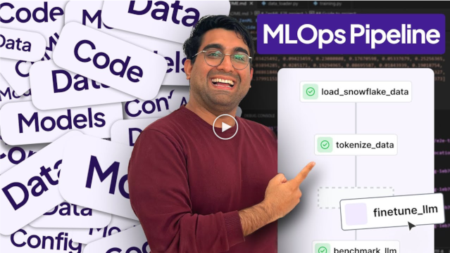

<div align="center">
  
  <h1 align="center">The Orchestration & Observability Layer for Production AI</h1>
  <h3 align="center">ZenML brings battle-tested MLOps practices to all your AI applications – from traditional ML to the latest LLMs – handling evaluation, monitoring, and deployment at scale.</h3>
</div>

<div align="center">

  <!-- PROJECT LOGO -->
  <br />
    <a href="https://zenml.io">
      
    </a>
  <br />

  [![PyPi][pypi-shield]][pypi-url]
  [![PyPi][pypiversion-shield]][pypi-url]
  [![PyPi][downloads-shield]][downloads-url]
  [![Contributors][contributors-shield]][contributors-url]
  [![License][license-shield]][license-url]

</div>

<!-- MARKDOWN LINKS & IMAGES -->
[pypi-shield]: https://img.shields.io/pypi/pyversions/zenml?color=281158
[pypi-url]: https://pypi.org/project/zenml/
[pypiversion-shield]: https://img.shields.io/pypi/v/zenml?color=361776
[downloads-shield]: https://img.shields.io/pypi/dm/zenml?color=431D93
[downloads-url]: https://pypi.org/project/zenml/
[contributors-shield]: https://img.shields.io/github/contributors/zenml-io/zenml?color=7A3EF4
[contributors-url]: https://github.com/zenml-io/zenml/graphs/contributors
[license-shield]: https://img.shields.io/github/license/zenml-io/zenml?color=9565F6
[license-url]: https://github.com/zenml-io/zenml/blob/main/LICENSE

---

## 🚨 The Problem: From Demo to Production is Hard

You've built an impressive POC with LangGraph, and your RAG demo is working flawlessly. Your traditional ML model shows great results in notebooks. But taking that next step into a production environment reveals a host of new challenges.


For LLM applications, you're facing questions like: How do you run evaluation pipelines on every update? How do you process documents in batch while tracking costs across multiple providers? How do you version prompts and ensure compliance with regulations like the EU AI Act?

For traditional ML, the challenges are equally daunting: How do you track which data produced which model? How do you automate retraining when performance degrades? How do you ensure reproducibility across different environments?

This is where many AI projects stall. The transition from a prototype to a reliable, scalable system requires infrastructure, tooling, and practices that most teams struggle to implement. Whether you're a platform team trying to tame tool sprawl, an enterprise needing robust batch workflows, or an organization in a regulated industry requiring full lineage for compliance – the gap between demo and production is real.

## 💡 The Solution: One Framework for All Your AI Workloads

ZenML provides the production-grade orchestration layer that bridges this gap. It's a framework that lets you write your ML and LLM logic once and run it anywhere – from your laptop to any cloud provider – while automatically handling versioning, lineage, and integrations with your existing tools.


Instead of stitching together different solutions for traditional ML and LLM workloads, ZenML provides a unified approach. Your `scikit-learn` training pipeline and your RAG ingestion pipeline can share the same infrastructure, monitoring, and deployment practices. Write portable code that works locally for quick iteration and scales seamlessly to production without changes.

## 🚀 Quickstart

[](https://colab.research.google.com/github/zenml-io/zenml/blob/main/examples/quickstart/quickstart.ipynb)

[Install ZenML](https://docs.zenml.io/getting-started/installation) via [PyPI](https://pypi.org/project/zenml/). Python 3.9 - 3.12 is required:

```bash
pip install "zenml[server]" notebook
```

Take a tour with the guided quickstart by running:

```bash
zenml go
```

## 🎯 Why ZenML?

ZenML transforms how you build and deploy AI systems by providing a comprehensive framework that handles both traditional ML and modern LLM workloads. Here's what makes ZenML different:

### Write Once, Run Anywhere

Your workflow logic shouldn't be tied to your infrastructure. ZenML lets you write portable pipelines that run on your laptop for rapid iteration and seamlessly scale to any cloud stack for production – without changing a single line of code.

```python
from zenml import pipeline, step

@step
def load_data() -> dict:
    # Your data loading logic works everywhere
    return {"data": load_from_source()}

@pipeline
def my_training_pipeline():
    data = load_data()
    model = train_model(data)
    evaluate_model(model)
    return model

# Run locally for quick iteration
zenml stack set local
python run.py

# Switch to production cloud stack - same code!
zenml stack set aws_production
python run.py
```

_[Placeholder: GIF showing stack switching and pipeline execution]_

### Automatic Versioning & Lineage

Every artifact, model, and pipeline run is automatically versioned and tracked. Whether you're debugging a model from six months ago or proving compliance for the EU AI Act, you have complete lineage of your AI systems.

```python
from zenml import Model, log_metadata

@step(model=Model(name="customer_churn_model", license="Apache 2.0"))
def train_model(data: pd.DataFrame) -> ClassifierMixin:
    model = RandomForestClassifier()
    # Automatic versioning of model and data
    return model

@step
def evaluate_llm(responses: list) -> float:
    score = calculate_hallucination_rate(responses)
    # Track custom metadata like costs
    log_metadata({"llm_eval_cost_usd": len(responses) * 0.001})
    return score
```

### Infrastructure Made Simple

Deploy a complete MLOps stack with one command, or connect to your existing infrastructure. ZenML handles the complexity so you can focus on your AI logic.

```bash
# Deploy a new stack on AWS
zenml stack deploy --provider aws

# Or register existing infrastructure
zenml stack register production --provider gcp
```

_[Placeholder: Screenshot of ZenML dashboard showing stack components]_

### Seamless Tool Integration

ZenML connects with the tools you already use, creating a unified workflow from experimentation to production. No vendor lock-in, just seamless integration.

| **Category** | **Key Features** | **Benefit** |
|--------------|------------------|-------------|
| **Portability** | Write once, run on any infrastructure | No code changes between dev and prod |
| **Versioning** | Automatic tracking of all artifacts and models | Full reproducibility and compliance |
| **Integration** | 40+ integrations with popular ML/LLM tools | Use your existing toolchain |
| **Scalability** | From local runs to distributed cloud workloads | Grow without rewriting |
| **Observability** | Built-in monitoring and alerting | Catch issues before they impact users |
| **Collaboration** | Centralized dashboard and artifact store | Teams work together effectively |

## 💻 Use Cases

### Traditional MLOps: Production-Grade Model Training

Build robust machine learning pipelines that automatically version data, track experiments, and promote models based on performance metrics.

```python
from zenml import pipeline, step
from sklearn.ensemble import RandomForestClassifier
import pandas as pd

@step
def load_and_split_data() -> tuple[pd.DataFrame, pd.DataFrame]:
    # Load your data
    df = pd.read_csv("data.csv")
    return train_test_split(df)

@step
def train_classifier(X_train: pd.DataFrame, y_train: pd.Series) -> RandomForestClassifier:
    model = RandomForestClassifier(n_estimators=100)
    model.fit(X_train, y_train)
    return model

@step
def evaluate_model(model: RandomForestClassifier, X_test: pd.DataFrame, y_test: pd.Series) -> float:
    accuracy = model.score(X_test, y_test)
    return accuracy

@step(model=Model(name="fraud_detector", tags=["production"]))
def promote_model(model: RandomForestClassifier, accuracy: float) -> RandomForestClassifier:
    if accuracy > 0.95:
        # Model automatically versioned and promoted
        log_metadata({"promoted": True, "accuracy": accuracy})
    return model

@pipeline
def training_pipeline():
    X_train, X_test, y_train, y_test = load_and_split_data()
    model = train_classifier(X_train, y_train)
    accuracy = evaluate_model(model, X_test, y_test)
    promoted_model = promote_model(model, accuracy)
```

_[Placeholder: DAG visualization from ZenML dashboard]_

### LLMOps: Scalable RAG Pipeline

Orchestrate document processing, embedding generation, and vector store management for your RAG applications with automatic versioning and cost tracking.

```python
from zenml import pipeline, step
from typing_extensions import Annotated
import numpy as np

@step
def load_documents() -> list[dict]:
    # Load documents from various sources
    docs = fetch_from_knowledge_base()
    return [{"content": doc.text, "metadata": doc.metadata} for doc in docs]

@step  
def chunk_documents(documents: list[dict]) -> list[str]:
    # Smart chunking with overlap
    chunks = []
    for doc in documents:
        chunks.extend(smart_chunker(doc["content"], chunk_size=512))
    return chunks

@step
def generate_embeddings(chunks: list[str]) -> Annotated[np.ndarray, "embeddings"]:
    # Generate embeddings with your chosen model
    embeddings = embedding_model.encode(chunks)
    log_metadata({"num_chunks": len(chunks), "embedding_dim": embeddings.shape[1]})
    return embeddings

@step
def create_vector_index(embeddings: np.ndarray) -> Annotated[str, "index_path"]:
    # Create and persist vector index
    index = faiss.IndexFlatL2(embeddings.shape[1])
    index.add(embeddings)
    index_path = "indexes/rag_index_v2.faiss"
    faiss.write_index(index, index_path)
    return index_path

@pipeline
def rag_ingestion_pipeline():
    docs = load_documents()
    chunks = chunk_documents(docs)
    embeddings = generate_embeddings(chunks)
    index_path = create_vector_index(embeddings)
    return index_path
```

### Continuous LLM Evaluation

Set up automated evaluation pipelines that monitor your LLM applications for quality, cost, and compliance.

```python
from zenml import pipeline, step
from zenml.integrations.slack.steps import slack_alerter_post_step

@step
def fetch_production_logs() -> list[dict]:
    # Fetch recent LLM interactions from production
    return get_last_24h_llm_logs()

@step
def evaluate_responses(logs: list[dict]) -> dict:
    metrics = {
        "hallucination_rate": check_hallucinations(logs),
        "response_quality": evaluate_quality(logs),
        "avg_latency": calculate_avg_latency(logs),
        "total_cost": sum(log["cost"] for log in logs)
    }
    return metrics

@step
def check_thresholds(metrics: dict) -> bool:
    if metrics["hallucination_rate"] > 0.1:
        return False
    if metrics["avg_latency"] > 2.0:
        return False
    return True

@pipeline(on_failure=slack_alerter_post_step)
def llm_monitoring_pipeline():
    logs = fetch_production_logs()
    metrics = evaluate_responses(logs)
    healthy = check_thresholds(metrics)
    
    if not healthy:
        alert_on_call_engineer(metrics)
```

## 📚 Learn More

### 🖼️ Getting Started Resources

The best way to learn about ZenML is through our comprehensive documentation and tutorials:

- **[Starter Guide](https://docs.zenml.io/user-guide/starter-guide)** - Get up and running in minutes
- **[Documentation](https://docs.zenml.io)** - Comprehensive guides and tutorials  
- **[SDK Reference](https://sdkdocs.zenml.io/)** - Detailed API documentation
- **[Example Projects](https://github.com/zenml-io/zenml-projects)** - Real-world implementations

For visual learners, start with this 11-minute introduction:

[](https://www.youtube.com/watch?v=wEVwIkDvUPs)

### 📖 Example Projects

1. **[E2E Batch Inference](examples/e2e/)** - Complete MLOps pipeline for tabular data
2. **[LLM RAG Pipeline](https://github.com/zenml-io/zenml-projects/tree/main/llm-complete-guide)** - Production RAG with document processing
3. **[Model Fine-Tuning](https://github.com/zenml-io/zenml-projects/tree/main/llm-agents)** - LLM fine-tuning with evaluation
4. **[Huggingface to SageMaker](https://github.com/zenml-io/zenml-projects/tree/main/huggingface-sagemaker)** - Deploy models to cloud endpoints

### 🎓 Learn from Books

<div align="center">
  <a href="https://www.amazon.com/LLM-Engineers-Handbook-engineering-production/dp/1836200072">
    
  </a>&nbsp;&nbsp;&nbsp;&nbsp;
  <a href="https://www.amazon.com/-/en/Andrew-McMahon/dp/1837631964">
    
  </a>
</div>

ZenML is featured in these comprehensive guides to production AI systems.

### 🔋 Deployment & Community

**Deploy ZenML** for team collaboration:
- [Self-hosted deployment guide](https://docs.zenml.io/getting-started/deploying-zenml)
- [ZenML Pro managed service](https://cloud.zenml.io/?utm_source=readme&utm_medium=referral_link&utm_campaign=cloud_promotion&utm_content=signup_link) (free trial available)

**Join our community**:
- 💬 [Slack Community](https://zenml.io/slack) - Get help and share experiences
- 🗺 [Public Roadmap](https://zenml.io/roadmap) - See what's coming next
- 🤝 [Contributing Guide](CONTRIBUTING.md) - Join us in building ZenML
- 💻 [VS Code Extension](https://marketplace.visualstudio.com/items?itemName=ZenML.zenml-vscode) - Manage pipelines from your editor

### ⭐ Support the Project

If ZenML helps your AI journey, please star us on GitHub! Your support helps others discover the project.

[](https://github.com/zenml-io/zenml/stargazers)

---

<div align="center">
<p>
    <a href="https://zenml.io/features">Features</a> •
    <a href="https://zenml.io/roadmap">Roadmap</a> •
    <a href="https://github.com/zenml-io/zenml/issues">Report Bug</a> •
    <a href="https://zenml.io/pro">Sign up for ZenML Pro</a> •
    <a href="https://www.zenml.io/blog">Blog</a> •
    <a href="https://zenml.io/podcast">Podcast</a>
    <br />
    🎉 Version 0.83.1 is out. Check out the <a href="https://github.com/zenml-io/zenml/releases">release notes</a>.
</p>
</div>

## 📜 License

ZenML is distributed under the terms of the Apache License Version 2.0. See
[LICENSE](LICENSE) for details.
