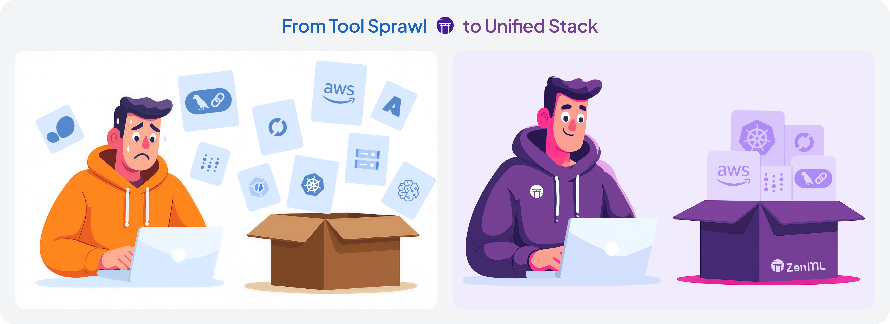

<div align="center">
  
  <h1 align="center">The Orchestration & Observability Layer for Production AI</h1>
  <h3 align="center">ZenML brings battle-tested MLOps practices to all your AI applications – from traditional ML to the latest LLMs – handling evaluation, monitoring, and deployment at scale.</h3>
</div>

<div align="center">

  <!-- PROJECT LOGO -->
  <br />
    <a href="https://zenml.io">
      
    </a>
  <br />

  [![PyPi][pypi-shield]][pypi-url]
  [![PyPi][pypiversion-shield]][pypi-url]
  [![PyPi][downloads-shield]][downloads-url]
  [![Contributors][contributors-shield]][contributors-url]
  [![License][license-shield]][license-url]

</div>

<!-- MARKDOWN LINKS & IMAGES -->
[pypi-shield]: https://img.shields.io/pypi/pyversions/zenml?color=281158
[pypi-url]: https://pypi.org/project/zenml/
[pypiversion-shield]: https://img.shields.io/pypi/v/zenml?color=361776
[downloads-shield]: https://img.shields.io/pypi/dm/zenml?color=431D93
[downloads-url]: https://pypi.org/project/zenml/
[contributors-shield]: https://img.shields.io/github/contributors/zenml-io/zenml?color=7A3EF4
[contributors-url]: https://github.com/zenml-io/zenml/graphs/contributors
[license-shield]: https://img.shields.io/github/license/zenml-io/zenml?color=9565F6
[license-url]: https://github.com/zenml-io/zenml/blob/main/LICENSE

---

## 🚨 The Problem: Production AI is 10x Harder Than Your POC

You've built an impressive POC. Your LangGraph RAG demo works perfectly. Your sklearn model shows 95% accuracy in notebooks. But now what?



**For ML Engineers & Data Scientists:** You're stuck managing experiment sprawl, debugging production failures without lineage, and manually promoting models. Every deployment is a custom script. Every retrain is a prayer.

**For Platform Teams:** You're drowning in tool proliferation. Data scientists use 5 different experiment trackers, models are scattered across S3 buckets, and you have no idea which model is actually running in production. Compliance is asking for model lineage documentation you can't provide.

**For Engineering Leaders:** Your ML team velocity has cratered. What should take days takes weeks. Models that worked in development fail mysteriously in production. You're hemorrhaging cloud costs from orphaned resources and can't answer basic questions like "which data was used to train the production model?"

This is where 90% of AI projects fail – not because the models are bad, but because the path from prototype to production is broken.

## 💡 The Solution: Production-Ready from Day One

ZenML provides the orchestration and observability layer that makes your AI systems production-ready from the start. One framework that handles both traditional ML and modern LLM workloads, with minimal code changes and maximum flexibility.


**Write once, run anywhere.** Your pipeline code works identically on your laptop and in production. No more "works on my machine" problems.

**Automatic versioning of everything.** Models, data, prompts, embeddings, configurations – all versioned and linked automatically. Full lineage for debugging and compliance.

**Your tools, unified.** Keep using PyTorch, Hugging Face, LangChain, or whatever you prefer. ZenML connects them all without lock-in.

**From POC to production in hours, not months.** Deploy your first production pipeline today, not next quarter.

Instead of stitching together different solutions for traditional ML and LLM workloads, ZenML provides a unified approach. Your `scikit-learn` training pipeline and your RAG ingestion pipeline can share the same infrastructure, monitoring, and deployment practices. Write portable code that works locally for quick iteration and scales seamlessly to production without changes.

## 🚀 Quickstart (2 minutes to your first pipeline)

[Install ZenML](https://docs.zenml.io/getting-started/installation) via [PyPI](https://pypi.org/project/zenml/). Python 3.9 - 3.12 is required:

```bash
pip install zenml
```

Create a simple `run.py` file with a basic workflow:

```python
from zenml import step, pipeline

@step
def basic_step() -> str:
    return "Hello World!"

@pipeline
def basic_pipeline():
    basic_step()

if __name__ == "__main__":
    basic_pipeline()
```

And then run it with, seeing how ZenML automatically tracks the execution and stores artifacts:

```bash
python run.py
```

## 🎯 Why ZenML?

### For Hands-on Builders: Ship Faster with Less Pain

**Gradual Adoption** - Start with your existing notebooks and scripts. Wrap them in `@step` decorators when ready. No big rewrites required.

```python
# Your existing code
def train_model(data):
    model = RandomForestClassifier()
    model.fit(data)
    return model

# Make it production-ready with one decorator
from zenml import step

@step
def train_model(data):
    model = RandomForestClassifier()
    model.fit(data)
    return model
```

**First-Class LLM Support** - Version prompts, track costs, manage embeddings. Everything you need for modern AI applications.

```python
@step
def generate_response(prompt_template: str, context: str) -> dict:
    # Prompts are automatically versioned
    response = llm.complete(prompt_template.format(context=context))
    
    # Generate embeddings for the response
    embedding = embedding_model.encode(response.content)
    
    # Track costs and metrics including embeddings
    log_metadata({
        "prompt_version": prompt_template.version,
        "token_count": response.usage.total_tokens,
        "cost_usd": response.usage.total_tokens * 0.0001,
        "embedding_model": "text-embedding-3-small",
        "embedding_dimension": len(embedding),
        "embedding_cost_usd": len(response.content) * 0.00001
    })
    
    return {
        "response": response.content,
        "embedding": embedding,
        "metadata": response.usage
    }
```

**Framework Agnostic** - Use TensorFlow, PyTorch, Hugging Face, LangChain, LangGraph – or all of them together. 60+ integrations available.

_[Placeholder: Grid of framework logos showing compatibility]_

### For Infrastructure Teams: Enterprise-Ready, DevOps-Friendly

**Use Your Existing Infrastructure** - BYO cloud. BYO Kubernetes. BYO everything. ZenML adapts to your setup, not the other way around.

```bash
# Install and Deploy ZenML with Helm
helm pull oci://public.ecr.aws/zenml/zenml --version <VERSION> --untar
helm -n <namespace> install zenml-server . --create-namespace --values custom-values.yaml
```

Use our Terraform provider to reproducibly provision your infrastructure
cross-cloud and manage your ZenML stacks.

```bash
# Register your existing infrastructure
zenml artifact-store register s3-store --flavor=s3 --path=s3://my-bucket
zenml container-registry register ecr --flavor=aws --uri=123456789.dkr.ecr.us-east-1.amazonaws.com
```


```hcl
terraform {
    required_providers {
        aws = {
            source  = "hashicorp/aws"
        }
        zenml = {
            source = "zenml-io/zenml"
        }
    }
}

module "zenml_stack" {
  source = "zenml-io/zenml-stack/<cloud-provider>"
  version = "x.y.z"

  # Optional inputs
  zenml_stack_name = "<your-stack-name>"
  orchestrator = "<your-orchestrator-type>" # e.g., "local", "sagemaker", "vertex", "azureml", "skypilot"
}
```

```bash
terraform init
terraform apply
```

**Security First** - Secrets management, RBAC, audit logs, air-gapped deployments. Everything your security team demands.

```bash
# Register secrets centrally
zenml secret create hf-creds --token=...
zenml secret create openai-api --api_key=...
```

```python
import openai
from transformers import AutoModel
from zenml import step
from zenml.client import Client

@step
def load_and_evaluate(dataset_id: str) -> dict:
    # Fetch secrets securely at runtime
    client = Client()
    hf_secret = client.get_secret("hf-creds")
    openai_secret = client.get_secret("openai-api")
    
    # Use HF token to access private models
    model = AutoModel.from_pretrained(
        "my-org/private-model",
        api_key=hf_secret.secret_values["token"]
    )
    
    # Use OpenAI API for evaluation
    openai.api_key = openai_secret.secret_values["api_key"]
    metrics = run_llm_evaluation(model, dataset_id)
    
    return metrics  # ZenML handles artifact storage automatically
```

## 💻 ZenML In Action: Building a Smart Customer Service Platform

See how ZenML orchestrates traditional ML and LLMs to create a comprehensive AI system that's production-ready and compliant.

### Traditional MLOps: Intelligent Ticket Routing

Lightning-fast classification and prioritization using classical ML, feeding insights to our LLM-powered response system.


```python
from zenml import pipeline, step, Model
from sklearn.ensemble import RandomForestClassifier

@step
def analyze_ticket_stream() -> pd.DataFrame:
    tickets = fetch_from_zendesk(last_hours=24)
    tickets["sentiment"] = quick_sentiment_analysis(tickets["message"])
    tickets["customer_tier"] = lookup_customer_value(tickets["customer_id"])
    return tickets

@step
def train_routing_model(tickets: pd.DataFrame) -> RandomForestClassifier:
    # Multi-class: billing, technical, feature_request, urgent
    X = engineer_features(tickets)  # TF-IDF + metadata
    model = RandomForestClassifier().fit(X, tickets["category"])
    log_metadata({"accuracy": 0.94, "daily_volume": len(tickets)})
    return model

@step
def predict_churn_risk(tickets: pd.DataFrame) -> pd.DataFrame:
    # Deep learning model identifies at-risk customers
    tickets["churn_risk"] = churn_model.predict(tickets)
    tickets["priority"] = calculate_priority(tickets)
    return tickets

@step(model=Model(name="ticket_intelligence"))
def deploy_insights(model: RandomForestClassifier, tickets: pd.DataFrame):
    # Export insights for LLM pipeline
    insights = {
        "high_churn_topics": extract_topics(tickets[tickets.churn_risk > 0.8]),
        "resolution_patterns": analyze_successful_resolutions(tickets)
    }
    save_to_feature_store(insights, "customer_intelligence")
    deploy_to_sagemaker(model)

@pipeline(schedule="0 */2 * * *")
def customer_intelligence_pipeline():
    tickets = analyze_ticket_stream()
    model = train_routing_model(tickets)
    enriched = predict_churn_risk(tickets)
    deploy_insights(model, enriched)
```

### LLMOps: RAG-Powered Response Generation

Combines ML insights with company knowledge for context-aware responses.


```python
@step
def sync_knowledge_sources() -> list[dict]:
    sources = []
    # Company knowledge
    sources.extend(fetch_from_confluence("support_docs"))
    sources.extend(parse_product_manuals())
    
    # Fresh ML insights
    ml_insights = load_from_feature_store("customer_intelligence")
    sources.append({
        "content": f"High-risk topics: {ml_insights['high_churn_topics']}"
    })
    return sources

@step  
def intelligent_chunking(documents: list[dict]) -> list[dict]:
    # Context-aware chunking
    chunks = []
    for doc in documents:
        if "support_article" in doc["type"]:
            chunks.extend(semantic_chunker(doc, preserve_qa_pairs=True))
        else:
            chunks.extend(standard_chunker(doc))
    return chunks

@step
def generate_embeddings(chunks: list[dict]) -> np.ndarray:
    # Multi-model strategy: CodeBERT for code, OpenAI for text
    embeddings = []
    for chunk in chunks:
        emb = code_embedder(chunk) if "code" in chunk else openai_embed(chunk)
        embeddings.append(emb)
    return np.array(embeddings)

@step(model=Model(name="smart_responder"))
def deploy_rag_system(embeddings: np.ndarray, chunks: list[dict]) -> str:
    # Build specialized indexes
    indexes = {
        "main": build_vector_db(embeddings, chunks),
        "urgent": build_filtered_index(chunks, filter="urgent")
    }
    
    if evaluate_quality(indexes["main"]) > 0.85:
        deploy_to_production({
            "indexes": indexes,
            "model": "claude-3-opus",
            "guardrails": ["no_pii", "professional_tone"]
        })
        return "deployed"

@pipeline(enable_cache=False)
def smart_response_pipeline():
    knowledge = sync_knowledge_sources()
    chunks = intelligent_chunking(knowledge)
    embeddings = generate_embeddings(chunks)
    deploy_rag_system(embeddings, chunks)
```

### Compliance & Monitoring: EU AI Act Compliance

Unified monitoring across ML and LLM systems for regulatory compliance.


```python
from zenml import pipeline, step, Model
from zenml.config.schedule import Schedule

@step
def collect_unified_metrics() -> dict:
    return {
        "ml_metrics": {
            "routing_accuracy": fetch_model_performance("ticket-router"),
            "prediction_fairness": calculate_demographic_parity()
        },
        "llm_metrics": {
            "hallucination_rate": analyze_fact_checking_results(),
            "response_relevance": fetch_rag_quality_scores()
        },
        "system_metrics": {
            "human_escalation_rate": track_human_handoffs(),
            "resolution_success": measure_satisfaction()
        }
    }

@step
def detect_bias_and_fairness(metrics: dict) -> dict:
    # Check both ML and LLM for bias
    bias_report = {
        "routing_bias": analyze_protected_attributes(metrics["ml_metrics"]),
        "response_bias": analyze_llm_fairness(sample_n=1000)
    }
    
    if bias_report["routing_bias"]["disparity"] > 0.2:
        alert_compliance_team("Bias threshold exceeded")
    
    return bias_report

@step(model=Model(name="compliance_monitor", tags=["eu-ai-act"]))
def generate_compliance_report(metrics: dict, bias_report: dict) -> dict:
    compliance_package = {
        "risk_level": "limited_risk",  # Customer service = limited risk
        "technical_documentation": {
            "performance": metrics,
            "bias_mitigation": bias_report,
            "human_oversight": verify_human_in_loop()
        },
        "transparency": {
            "ai_disclosure": "AI-assisted responses",
            "opt_out_available": True
        }
    }
    
    # Immutable audit trail
    store_audit_record(compliance_package, retention_years=5)
    create_compliance_dashboard(compliance_package)
    
    return compliance_package

@pipeline
def ai_compliance_pipeline():
    metrics = collect_unified_metrics()
    bias_report = detect_bias_and_fairness(metrics)
    compliance = generate_compliance_report(metrics, bias_report)
    
    if requires_immediate_action(compliance):
        notify_compliance_team(compliance)

# Create a schedule for daily compliance monitoring
compliance_schedule = Schedule(
    name="daily-compliance-monitoring",
    cron_expression="0 0 * * *"  # Run daily at midnight
)

# Apply the schedule to the pipeline and execute
scheduled_compliance_pipeline = ai_compliance_pipeline.with_options(
    schedule=compliance_schedule
)
scheduled_compliance_pipeline()
```

## 📚 Learn More

### 🖼️ Getting Started Resources

The best way to learn about ZenML is through our comprehensive documentation and tutorials:

- **[Starter Guide](https://docs.zenml.io/user-guides/starter-guide)** - From zero to production in 30 minutes
- **[LLMOps Guide](https://docs.zenml.io/user-guides/llmops-guide)** - Specific patterns for LLM applications
- **[SDK Reference](https://sdkdocs.zenml.io/)** - Complete API documentation

For visual learners, start with this 11-minute introduction:

[](https://www.youtube.com/watch?v=wEVwIkDvUPs)

### 📖 Production Examples

1. **[E2E Batch Inference](examples/e2e/)** - Complete MLOps pipeline with feature engineering
2. **[LLM RAG Pipeline](https://github.com/zenml-io/zenml-projects/tree/main/llm-complete-guide)** - Production RAG with evaluation loops
3. **[Agentic Workflow (Deep Research)](https://github.com/zenml-io/zenml-projects/tree/main/deep_research)** - Orchestrate your agents with ZenML
4. **[Fine-tuning Pipeline](https://github.com/zenml-io/zenml-projects/tree/main/gamesense)** - Fine-tune and deploy LLMs

### 🏢 Deployment Options

**For Teams:**
- **[Self-hosted](https://docs.zenml.io/getting-started/deploying-zenml)** - Deploy on your infrastructure with Helm/Docker
- **[ZenML Pro](https://cloud.zenml.io/?utm_source=readme)** - Managed service with enterprise support (free trial)

**Infrastructure Requirements:**
- Kubernetes cluster (or local Docker)
- Object storage (S3/GCS/Azure)
- PostgreSQL database
- _[Complete requirements](https://docs.zenml.io/getting-started/deploying-zenml/deploy-with-helm)_

### 🎓 Books & Resources

<div align="center">
  <a href="https://www.amazon.com/LLM-Engineers-Handbook-engineering-production/dp/1836200072">
    
  </a>&nbsp;&nbsp;&nbsp;&nbsp;
  <a href="https://www.amazon.com/-/en/Andrew-McMahon/dp/1837631964">
    
  </a>
</div>

ZenML is featured in these comprehensive guides to production AI systems.

### 🤝 Community & Support

**Get Help:**
- 💬 [Slack Community](https://zenml.io/slack) - 3000+ practitioners, <2hr response time
- 📧 [Enterprise Support](https://zenml.io/pro) - SLAs, dedicated support, professional services
- 🐛 [GitHub Issues](https://github.com/zenml-io/zenml/issues) - Bug reports and feature requests

**Contribute:**
- 🌟 [Star us on GitHub](https://github.com/zenml-io/zenml/stargazers) - Help others discover ZenML
- 🤝 [Contributing Guide](CONTRIBUTING.md) - Start with [`good-first-issue`](https://github.com/issues?q=is%3Aopen+is%3Aissue+archived%3Afalse+user%3Azenml-io+label%3A%22good+first+issue%22)
- 💻 [Write Integrations](https://docs.zenml.io/how-to/stack-deployment/implement-a-custom-integration) - Add your favorite tools

**Stay Updated:**
- 🗺 [Public Roadmap](https://zenml.io/roadmap) - See what's coming next
- 📰 [Blog](https://zenml.io/blog) - Best practices and case studies
- 🎙 [Podcast](https://zenml.io/podcast) - Interviews with ML practitioners

### 🛠 VS Code Extension

Manage pipelines directly from your editor:

<details>
  <summary>🖥️ VS Code Extension in Action!</summary>
  <div align="center">
  
</div>
</details>

Install from [VS Code Marketplace](https://marketplace.visualstudio.com/items?itemName=ZenML.zenml-vscode).

---

<div align="center">
<p>
    <a href="https://zenml.io/features">Features</a> •
    <a href="https://zenml.io/roadmap">Roadmap</a> •
    <a href="https://github.com/zenml-io/zenml/issues">Report Bug</a> •
    <a href="https://zenml.io/pro">Sign up for ZenML Pro</a> •
    <a href="https://www.zenml.io/blog">Blog</a> •
    <a href="https://zenml.io/podcast">Podcast</a>
    <br />
    🎉 Version 0.83.1 is out. Check out the <a href="https://github.com/zenml-io/zenml/releases">release notes</a>.
</p>
</div>

## 📜 License

ZenML is distributed under the terms of the Apache License Version 2.0. See
[LICENSE](LICENSE) for details.
