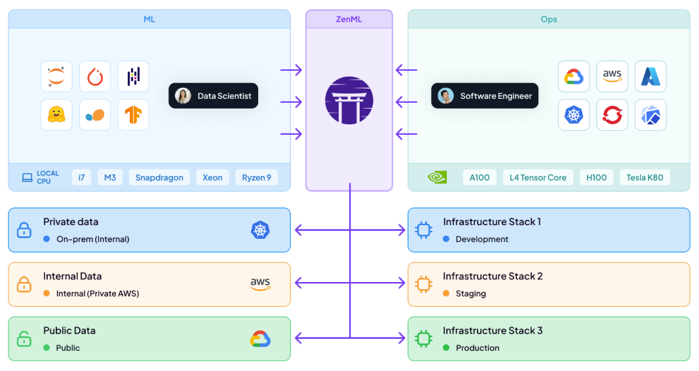
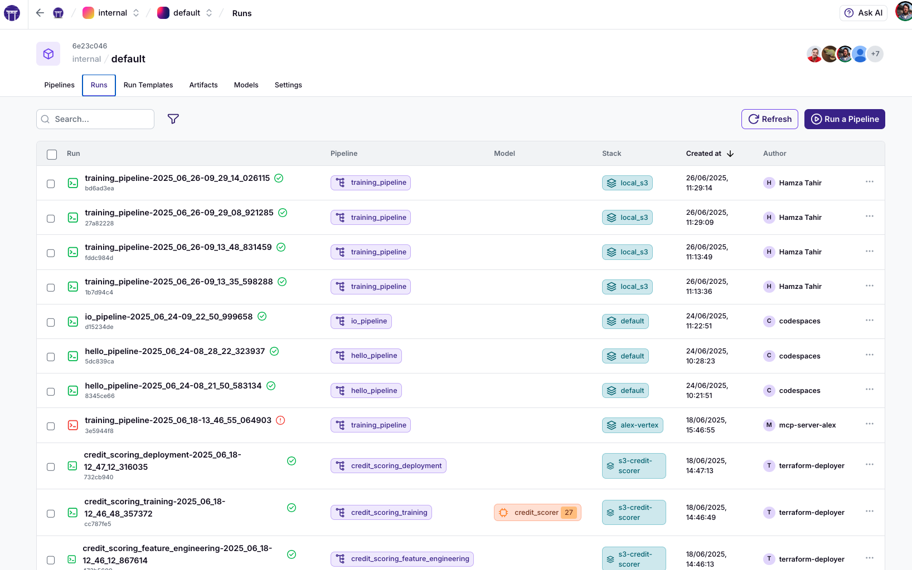
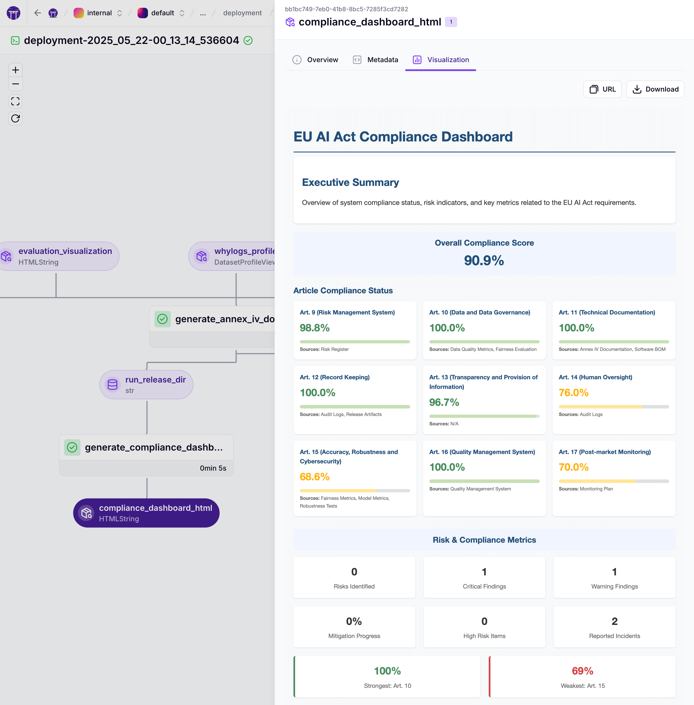

<div align="center">
  
  <h1 align="center">The Orchestration & Observability Layer for Production AI</h1>
  <h3 align="center">ZenML brings battle-tested MLOps practices to all your AI applications – from traditional ML to the latest LLMs – handling evaluation, monitoring, and deployment at scale.</h3>
</div>

<div align="center">

  <!-- PROJECT LOGO -->
  <br />
    <a href="https://zenml.io">
      
    </a>
  <br />

  [![PyPi][pypi-shield]][pypi-url]
  [![PyPi][pypiversion-shield]][pypi-url]
  [![PyPi][downloads-shield]][downloads-url]
  [![Contributors][contributors-shield]][contributors-url]
  [![License][license-shield]][license-url]

</div>

<!-- MARKDOWN LINKS & IMAGES -->
[pypi-shield]: https://img.shields.io/pypi/pyversions/zenml?color=281158
[pypi-url]: https://pypi.org/project/zenml/
[pypiversion-shield]: https://img.shields.io/pypi/v/zenml?color=361776
[downloads-shield]: https://img.shields.io/pypi/dm/zenml?color=431D93
[downloads-url]: https://pypi.org/project/zenml/
[contributors-shield]: https://img.shields.io/github/contributors/zenml-io/zenml?color=7A3EF4
[contributors-url]: https://github.com/zenml-io/zenml/graphs/contributors
[license-shield]: https://img.shields.io/github/license/zenml-io/zenml?color=9565F6
[license-url]: https://github.com/zenml-io/zenml/blob/main/LICENSE

---

## 🚨 The Problem: Production AI is 10x Harder Than Your POC

You've built an impressive POC. Your LangGraph RAG demo works perfectly. Your sklearn model shows 95% accuracy in notebooks. But now what?


**For ML Engineers & Data Scientists:** You're stuck managing experiment sprawl, debugging production failures without lineage, and manually promoting models. Every deployment is a custom script. Every retrain is a prayer.

**For Platform Teams:** You're drowning in tool proliferation. Data scientists use 5 different experiment trackers, models are scattered across S3 buckets, and you have no idea which model is actually running in production. Compliance is asking for model lineage documentation you can't provide.

**For Engineering Leaders:** Your ML team velocity has cratered. What should take days takes weeks. Models that worked in development fail mysteriously in production. You're hemorrhaging cloud costs from orphaned resources and can't answer basic questions like "which data was used to train the production model?"

This is where 90% of AI projects fail – not because the models are bad, but because the path from prototype to production is broken.

## 💡 The Solution: Production-Ready from Day One

ZenML provides the orchestration and observability layer that makes your AI systems production-ready from the start. One framework that handles both traditional ML and modern LLM workloads, with minimal code changes and maximum flexibility.



**Write once, run anywhere.** Your pipeline code works identically on your laptop and in production. No more "works on my machine" problems.

**Automatic versioning of everything.** Models, data, prompts, embeddings, configurations – all versioned and linked automatically. Full lineage for debugging and compliance.

**Your tools, unified.** Keep using PyTorch, Hugging Face, LangChain, or whatever you prefer. ZenML connects them all without lock-in.

**From POC to production in hours, not months.** Deploy your first production pipeline today, not next quarter.

## 🚀 Quickstart (2 minutes to your first pipeline)

[Install ZenML](https://docs.zenml.io/getting-started/installation) via [PyPI](https://pypi.org/project/zenml/). Python 3.9 - 3.12 is required:

```bash
pip install zenml
```

Create a simple `run.py` file with a basic workflow:

```python
from zenml import step, pipeline

@step
def basic_step() -> str:
    return "Hello World!"

@pipeline
def basic_pipeline():
    basic_step()

if __name__ == "__main__":
    basic_pipeline()
```

And then run it with, seeing how ZenML automatically tracks the execution and stores artifacts:

```bash
python run.py
```

## 🎯 Why ZenML?

### For Hands-on Builders: Ship Faster with Less Pain

**Gradual Adoption** - Start with your existing notebooks and scripts. Wrap them in `@step` decorators when ready. No big rewrites required.

```python
# Your existing code
def train_model(data):
    model = RandomForestClassifier()
    model.fit(data)
    return model

# Make it production-ready with one decorator
from zenml import step

@step
def train_model(data):
    model = RandomForestClassifier()
    model.fit(data)
    return model
```

**First-Class LLM Support** - Version prompts, track costs, manage embeddings. Everything you need for modern AI applications.

```python
@step
def generate_response(prompt_template: str, context: str) -> dict:
    # Prompts are automatically versioned
    response = llm.complete(prompt_template.format(context=context))
    
    # Generate embeddings for the response
    embedding = embedding_model.encode(response.content)
    
    # Track costs and metrics including embeddings
    log_metadata({
        "prompt_version": prompt_template.version,
        "token_count": response.usage.total_tokens,
        "cost_usd": response.usage.total_tokens * 0.0001,
        "embedding_model": "text-embedding-3-small",
        "embedding_dimension": len(embedding),
        "embedding_cost_usd": len(response.content) * 0.00001
    })
    
    return {
        "response": response.content,
        "embedding": embedding,
        "metadata": response.usage
    }
```

**Framework Agnostic** - Use TensorFlow, PyTorch, Hugging Face, LangChain, LangGraph – or all of them together. 60+ integrations available.

_[Placeholder: Grid of framework logos showing compatibility]_

### For Infrastructure Teams: Enterprise-Ready, DevOps-Friendly

**Use Your Existing Infrastructure** - BYO cloud. BYO Kubernetes. BYO everything. ZenML adapts to your setup, not the other way around.

```bash
# Register your existing infrastructure
zenml artifact-store register s3-store --flavor=s3 --path=s3://my-bucket
zenml container-registry register ecr --flavor=aws --uri=123456789.dkr.ecr.us-east-1.amazonaws.com
```


```hcl
terraform {
    required_providers {
        aws = {
            source  = "hashicorp/aws"
        }
        zenml = {
            source = "zenml-io/zenml"
        }
    }
}

provider "zenml" {
    # server_url = <taken from the ZENML_SERVER_URL environment variable if not set here>
    # For ZenML Pro users, this should be your Workspace URL from the dashboard
    # api_key = <taken from the ZENML_API_KEY environment variable if not set here>
}

module "zenml_stack" {
  source = "zenml-io/zenml-stack/<cloud-provider>"
  version = "x.y.z"

  # Optional inputs
  zenml_stack_name = "<your-stack-name>"
  orchestrator = "<your-orchestrator-type>" # e.g., "local", "sagemaker", "vertex", "azureml", "skypilot"
}
```

```bash
# Or deploy a new stack on AWS
terraform init
terraform apply

# Or install with Helm
helm pull oci://public.ecr.aws/zenml/zenml --version <VERSION> --untar
helm -n <namespace> install zenml-server . --create-namespace --values custom-values.yaml
```

**Security First** - Secrets management, RBAC, audit logs, air-gapped deployments. Everything your security team demands.

```python
# Secrets managed automatically
@step(secrets=["aws", "huggingface"])
def train_secure(data):
    # Credentials injected at runtime
    model = download_from_hf()  # Uses HF secret
    save_to_s3(model)  # Uses AWS secret
```

**Zero Maintenance** - Managed metadata store, automatic garbage collection, built-in monitoring. Set it and forget it.

### For Decision Makers: Measurable ROI, Minimal Risk

**10x Faster Time-to-Production** - Teams ship production pipelines in days, not months. Concrete example: Rivian reduced model deployment time by 75%.

**No Vendor Lock-in** - Open source, cloud-agnostic, tool-agnostic. Switch providers anytime. Your code stays the same.

**Enterprise Support Available** - SLAs, dedicated support, and professional services when you need them. Trusted by Rivian, Playtika, and Leroy Merlin.

| **Capability** | **Value Delivered** | **Without ZenML** |
|----------------|---------------------|-------------------|
| **Experiment Tracking** | Automatic versioning of all experiments | Manual tracking in spreadsheets |
| **Model Registry** | Central model management with lineage | Models scattered across S3 buckets |
| **Pipeline Orchestration** | Run anywhere without code changes | Rewrite for each environment |
| **Compliance & Audit** | Full lineage for every prediction | Scramble during audits |
| **Team Collaboration** | Shared pipelines and artifacts | "Works on my machine" chaos |
| **Resource Optimization** | Automatic cleanup and right-sizing | Orphaned resources burning money |

## 💻 Use Cases: From Classic ML to Cutting-Edge LLMs

### Traditional MLOps: Fraud Detection Pipeline

End-to-end pipeline with automatic model promotion based on performance. From
notebook to production in hours.


```python
from zenml import pipeline, step, Model
from sklearn.ensemble import RandomForestClassifier
import pandas as pd

@step
def load_and_validate_data() -> pd.DataFrame:
    df = pd.read_parquet("s3://data/transactions.parquet")
    assert df.shape[0] > 10000, "Insufficient data"
    return df

@step
def train_classifier(data: pd.DataFrame) -> RandomForestClassifier:
    X, y = data.drop("is_fraud", axis=1), data["is_fraud"]
    model = RandomForestClassifier(n_estimators=100)
    model.fit(X, y)
    return model

@step
def evaluate_model(model: RandomForestClassifier, data: pd.DataFrame) -> float:
    X_test, y_test = data.drop("is_fraud", axis=1), data["is_fraud"]
    return model.score(X_test, y_test)

@step(model=Model(name="fraud_detector", tags=["production"]))
def promote_if_better(model: RandomForestClassifier, accuracy: float) -> str:
    if accuracy > 0.95:
        # Auto-promotion to production
        deploy_to_sagemaker(model)
        return "promoted"
    return "held_back"

@pipeline(schedule="0 2 * * *")  # Run nightly
def fraud_detection_pipeline():
    data = load_and_validate_data()
    model = train_classifier(data)
    accuracy = evaluate_model(model, data)
    status = promote_if_better(model, accuracy)
```

### LLMOps: Production RAG with Continuous Improvement

Build a RAG system that automatically reindexes documents and tracks quality
metrics.


```python
from zenml import pipeline, step
from typing_extensions import Annotated
import numpy as np

@step
def ingest_documents() -> list[dict]:
    # Connect to your document sources
    docs = []
    for source in ["confluence", "notion", "drive"]:
        docs.extend(fetch_from_source(source))
    log_metadata({"total_documents": len(docs)})
    return docs

@step  
def smart_chunking(documents: list[dict]) -> list[dict]:
    chunks = []
    for doc in documents:
        # Semantic chunking with overlap
        doc_chunks = semantic_chunker(
            doc["content"], 
            max_chunk_size=512,
            overlap=50
        )
        chunks.extend(doc_chunks)
    return chunks

@step
def generate_embeddings(chunks: list[dict]) -> Annotated[np.ndarray, "embeddings"]:
    # Generate embeddings with fallback providers
    try:
        embeddings = openai_embed(chunks)
    except RateLimitError:
        embeddings = cohere_embed(chunks)  # Automatic fallback
    
    log_metadata({
        "embedding_model": "text-embedding-3-small",
        "total_cost_usd": len(chunks) * 0.00002
    })
    return embeddings

@step
def build_index(embeddings: np.ndarray, chunks: list[dict]) -> str:
    # Create versioned vector index
    index = ChromaDB(dimension=embeddings.shape[1])
    index.add(embeddings, metadatas=chunks)
    
    # Version your index
    index_version = f"v{datetime.now().strftime('%Y%m%d_%H%M%S')}"
    index.persist(f"indexes/rag_{index_version}")
    return index_version

@pipeline(enable_cache=False)  # Always fresh embeddings
def rag_indexing_pipeline():
    docs = ingest_documents()
    chunks = smart_chunking(docs)
    embeddings = generate_embeddings(chunks)
    index_version = build_index(embeddings, chunks)
    
    # Auto-deploy if quality improves
    if evaluate_retrieval_quality(index_version) > 0.85:
        deploy_index_to_production(index_version)
```

### Continuous LLM Monitoring & Evaluation

Monitor production LLM applications for quality, cost, and compliance.



```python
from zenml import pipeline, step, alerter

@step
def collect_production_traces() -> list[dict]:
    # Fetch last 24h of production LLM calls
    return fetch_from_langsmith(
        project="production",
        last_hours=24
    )

@step
def evaluate_quality(traces: list[dict]) -> dict:
    metrics = {
        "hallucination_rate": run_hallucination_detector(traces),
        "relevance_score": calculate_relevance(traces),
        "refusal_rate": count_refusals(traces) / len(traces),
        "avg_latency_ms": np.mean([t["latency"] for t in traces]),
        "total_cost_usd": sum(t["cost"] for t in traces),
        "pii_leaks": scan_for_pii(traces)
    }
    return metrics

@step
def check_sla_compliance(metrics: dict) -> Annotated[bool, "compliant"]:
    violations = []
    if metrics["hallucination_rate"] > 0.05:
        violations.append("Hallucination rate exceeds 5%")
    if metrics["avg_latency_ms"] > 2000:
        violations.append("Latency exceeds 2s SLA")
    if metrics["pii_leaks"] > 0:
        violations.append("PII detected in responses!")
    
    if violations:
        alerter.send(f"SLA Violations: {violations}")
        return False
    return True

@pipeline(schedule="*/30 * * * *")  # Every 30 minutes
def llm_monitoring_pipeline():
    traces = collect_production_traces()
    metrics = evaluate_quality(traces)
    compliant = check_sla_compliance(metrics)
    
    # Auto-rollback if critical issues
    if not compliant and metrics["pii_leaks"] > 0:
        rollback_to_previous_version()
```

## 📚 Learn More

### 🖼️ Getting Started Resources

The best way to learn about ZenML is through our comprehensive documentation and tutorials:

- **[Starter Guide](https://docs.zenml.io/user-guide/starter-guide)** - From zero to production in 30 minutes
- **[Migration Guide](https://docs.zenml.io/how-to/migration-guide)** - Migrate from notebooks/scripts to ZenML
- **[LLMOps Guide](https://docs.zenml.io/user-guide/llmops-guide)** - Specific patterns for LLM applications
- **[SDK Reference](https://sdkdocs.zenml.io/)** - Complete API documentation

For visual learners, start with this 11-minute introduction:

[](https://www.youtube.com/watch?v=wEVwIkDvUPs)

### 📖 Production Examples

1. **[E2E Batch Inference](examples/e2e/)** - Complete MLOps pipeline with feature engineering
2. **[LLM RAG Pipeline](https://github.com/zenml-io/zenml-projects/tree/main/llm-complete-guide)** - Production RAG with evaluation loops
3. **[LangGraph + ZenML](https://github.com/zenml-io/zenml-projects/tree/main/langgraph-agent)** - Orchestrate LangGraph agents
4. **[Fine-tuning Pipeline](https://github.com/zenml-io/zenml-projects/tree/main/llm-lora-finetuning)** - Fine-tune and deploy LLMs

### 🏢 Deployment Options

**For Teams:**
- **[Self-hosted](https://docs.zenml.io/getting-started/deploying-zenml)** - Deploy on your infrastructure with Helm/Docker
- **[ZenML Pro](https://cloud.zenml.io/?utm_source=readme)** - Managed service with enterprise support (free trial)

**Infrastructure Requirements:**
- Kubernetes cluster (or local Docker)
- Object storage (S3/GCS/Azure)
- PostgreSQL database
- _[Complete requirements](https://docs.zenml.io/getting-started/deploying-zenml/deploy-with-helm)_

### 🎓 Books & Resources

<div align="center">
  <a href="https://www.amazon.com/LLM-Engineers-Handbook-engineering-production/dp/1836200072">
    
  </a>&nbsp;&nbsp;&nbsp;&nbsp;
  <a href="https://www.amazon.com/-/en/Andrew-McMahon/dp/1837631964">
    
  </a>
</div>

ZenML is featured in these comprehensive guides to production AI systems.

### 🤝 Community & Support

**Get Help:**
- 💬 [Slack Community](https://zenml.io/slack) - 3000+ practitioners, <2hr response time
- 📧 [Enterprise Support](https://zenml.io/pro) - SLAs, dedicated support, professional services
- 🐛 [GitHub Issues](https://github.com/zenml-io/zenml/issues) - Bug reports and feature requests

**Contribute:**
- 🌟 [Star us on GitHub](https://github.com/zenml-io/zenml/stargazers) - Help others discover ZenML
- 🤝 [Contributing Guide](CONTRIBUTING.md) - Start with [`good-first-issue`](https://github.com/issues?q=is%3Aopen+is%3Aissue+archived%3Afalse+user%3Azenml-io+label%3A%22good+first+issue%22)
- 💻 [Write Integrations](https://docs.zenml.io/how-to/stack-deployment/implement-a-custom-integration) - Add your favorite tools

**Stay Updated:**
- 🗺 [Public Roadmap](https://zenml.io/roadmap) - See what's coming next
- 📰 [Blog](https://zenml.io/blog) - Best practices and case studies
- 🎙 [Podcast](https://zenml.io/podcast) - Interviews with ML practitioners

### 🛠 VS Code Extension

Manage pipelines directly from your editor:

<details>
  <summary>🖥️ VS Code Extension in Action!</summary>
  <div align="center">
  
</div>
</details>

Install from [VS Code Marketplace](https://marketplace.visualstudio.com/items?itemName=ZenML.zenml-vscode).

---

<div align="center">
<p>
    <a href="https://zenml.io/features">Features</a> •
    <a href="https://zenml.io/roadmap">Roadmap</a> •
    <a href="https://github.com/zenml-io/zenml/issues">Report Bug</a> •
    <a href="https://zenml.io/pro">Sign up for ZenML Pro</a> •
    <a href="https://www.zenml.io/blog">Blog</a> •
    <a href="https://zenml.io/podcast">Podcast</a>
    <br />
    🎉 Version 0.83.1 is out. Check out the <a href="https://github.com/zenml-io/zenml/releases">release notes</a>.
</p>
</div>

## 📜 License

ZenML is distributed under the terms of the Apache License Version 2.0. See
[LICENSE](LICENSE) for details.
