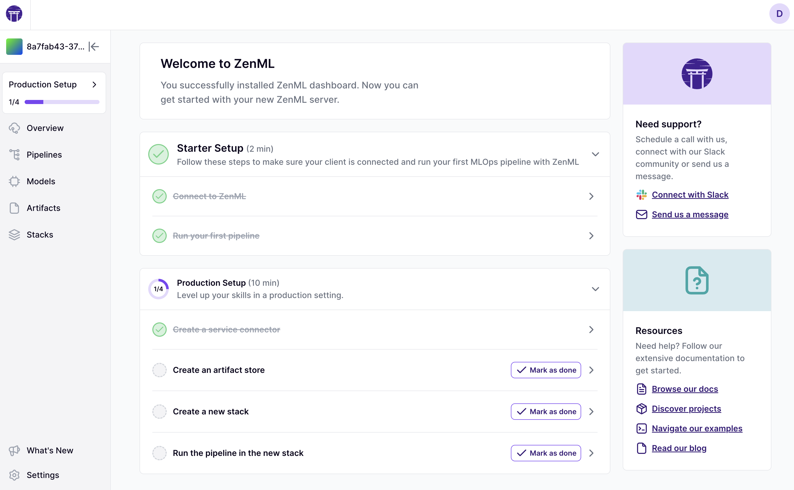
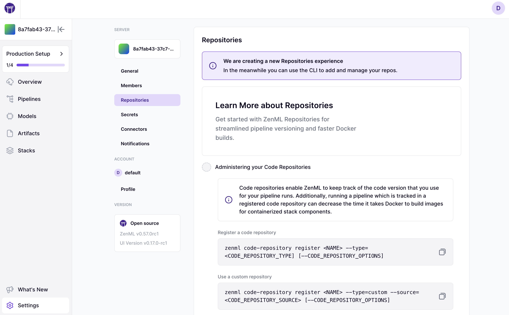
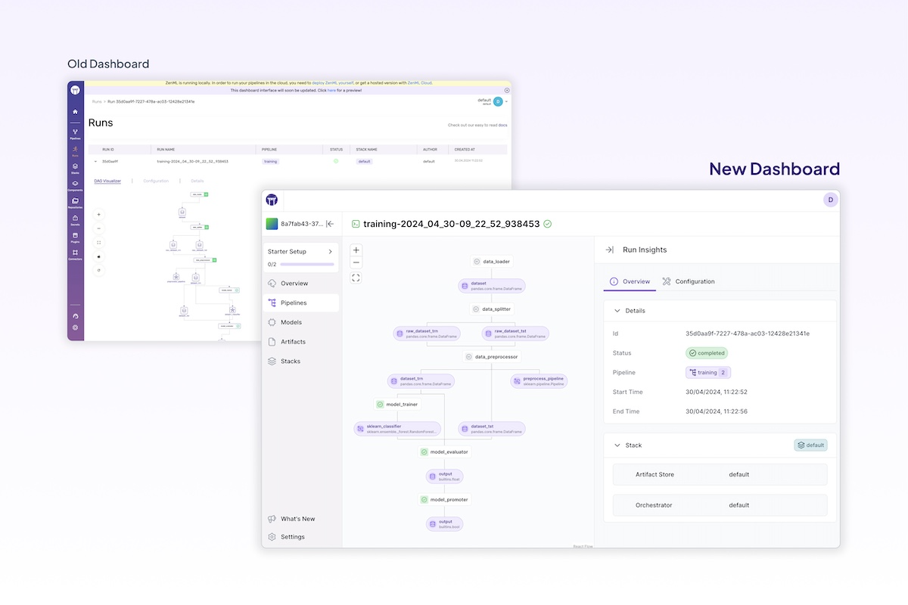

<!-- markdown-link-check-disable -->

# 0.70.0

The **ZenML 0.70.0** release includes a significant number of database schema changes and migrations, which means upgrading to this version will require extra caution. As always, please make sure to make a copy of your production database before upgrading.

## Key Changes

* **Artifact Versioning Improvements**: The handling of artifact versions has been improved, including the API improvements like the ability to batch artifact version requests to improve the execution times and more types for the step input/output artifacts, including multiple versions of the same artifact (e.g. model checkpoints), to improve the UX using ZenML UI or while working directly with the API.
* **Scalability Enhancements**: Various scalability improvements have been made, such as reducing unnecessary server requests and incrementing artifact versions server-side. These enhancements are expected to provide significant speed and scale improvements for ZenML users.
* **Metadata management**: Now, all the metadata-creating functions are gathered under one method called `log_metadata`. It is possible to call this method with different inputs to log run metadata for artifact versions, model versions, steps, and runs.
* **The oneof filtering**: This allows to filter entities using a new operator called `oneof`. You can use this with IDs (UUID type) or tags (or other string-typed attributes) like this `PipelineRunFilter(tag='oneof:["cats", "dogs"]')`.
* **Documentation Improvements**: The ZenML documentation has been restructured and expanded, including the addition of new sections on [finetuning](https://docs.zenml.io/user-guide/llmops-guide/finetuning-llms) and [LLM/ML engineering](https://docs.zenml.io/user-guide/llmops-guide/evaluation) resources.
* **Bug Fixes**: This release includes several bug fixes, including issues with in-process main module source loading, and more.

## Caution: Make sure to back up your data before upgrading!
While this release brings many valuable improvements, the database schema changes and migrations pose a potential risk to users. It is strongly recommended that users:

* **Test the upgrade on a non-production environment**: Before upgrading a production system, test the upgrade process in a non-production environment to identify and address any issues.
* **Back up your data**: Ensure that you have a reliable backup of your ZenML data before attempting the upgrade.

## What's Changed
* Optimizing the CI workflows by @bcdurak in https://github.com/zenml-io/zenml/pull/3145
* Adding 0.68.0 to the migration tests by @bcdurak in https://github.com/zenml-io/zenml/pull/3144
* Move step durations to body by @schustmi in https://github.com/zenml-io/zenml/pull/3046
* Docs on ZenML setup by @strickvl in https://github.com/zenml-io/zenml/pull/3100
* Remove wrongly set Model.was_created_in_this_run attribute by @schustmi in https://github.com/zenml-io/zenml/pull/3129
* Allow specifying run tags in pipeline configuration by @schustmi in https://github.com/zenml-io/zenml/pull/3130
* Fix materializer type compatibility check during loading by @schustmi in https://github.com/zenml-io/zenml/pull/3105
* [docs] Add icons to headers in docs by @wjayesh in https://github.com/zenml-io/zenml/pull/3149
* fix icons and remove redundant file by @wjayesh in https://github.com/zenml-io/zenml/pull/3150
* Merge 0.68.1 release into develop by @schustmi in https://github.com/zenml-io/zenml/pull/3153
* Allow filtering pipeline runs by stack component by @schustmi in https://github.com/zenml-io/zenml/pull/3142
* Allow artifact response as step input by @schustmi in https://github.com/zenml-io/zenml/pull/3134
* Filter component by user name by @schustmi in https://github.com/zenml-io/zenml/pull/3126
* [docs] Restructure how-to section to make it more readable by @wjayesh in https://github.com/zenml-io/zenml/pull/3147
* ZenML Pro web login implementation by @stefannica in https://github.com/zenml-io/zenml/pull/3141
* Scalability improvements: Reduce misc/hydration server requests by @schustmi in https://github.com/zenml-io/zenml/pull/3093
* Fix in-process main module source loading by @schustmi in https://github.com/zenml-io/zenml/pull/3119
* Catch assertion in GH library by @schustmi in https://github.com/zenml-io/zenml/pull/3160
* Enable cache precomputation for run templates by @schustmi in https://github.com/zenml-io/zenml/pull/3156
* Add LLM and ML engineering books to README by @htahir1 in https://github.com/zenml-io/zenml/pull/3159
* Add helper method to quickly create run template from pipeline by @schustmi in https://github.com/zenml-io/zenml/pull/3155
* Add CLI command to export stack requirements by @schustmi in https://github.com/zenml-io/zenml/pull/3158
* Scalability improvements: Increment artifact version server side by @schustmi in https://github.com/zenml-io/zenml/pull/3095
* Update OpenAI integration by @safoinme in https://github.com/zenml-io/zenml/pull/3163
* Remove deprecated torch version constraint by @safoinme in https://github.com/zenml-io/zenml/pull/3166
* vLLM model deployer by @dudeperf3ct in https://github.com/zenml-io/zenml/pull/3032
* Don't initialize client during flavor sync by @schustmi in https://github.com/zenml-io/zenml/pull/3168
* Cleanup materializer temporary directories after step execution by @schustmi in https://github.com/zenml-io/zenml/pull/3162
* Fix langchain in API docs by @avishniakov in https://github.com/zenml-io/zenml/pull/3171
* Finetuning guide by @strickvl in https://github.com/zenml-io/zenml/pull/3157
* Fix mypy issue vllm evidently by @safoinme in https://github.com/zenml-io/zenml/pull/3169
* Add artifact version batch request by @schustmi in https://github.com/zenml-io/zenml/pull/3164
* Add missing section links by @strickvl in https://github.com/zenml-io/zenml/pull/3172
* Fix uvloop mypy by @avishniakov in https://github.com/zenml-io/zenml/pull/3174
* Multiple output versions for a step outputs by @avishniakov in https://github.com/zenml-io/zenml/pull/3072
* Simplify Metadata handling by @AlexejPenner in https://github.com/zenml-io/zenml/pull/3096
* assign value to component_name in preset stack registration by @hirekk in https://github.com/zenml-io/zenml/pull/3178
* Updating the template versions with `zenml login` by @bcdurak in https://github.com/zenml-io/zenml/pull/3177
* Better input artifacts typing by @avishniakov in https://github.com/zenml-io/zenml/pull/3099
* Refactor environment setup and caching by @safoinme in https://github.com/zenml-io/zenml/pull/3077
* Fix spelling errors by @safoinme in https://github.com/zenml-io/zenml/pull/3181
* Prevent some race conditions by @schustmi in https://github.com/zenml-io/zenml/pull/3167
* Update stack deployments with latest features by @stefannica in https://github.com/zenml-io/zenml/pull/3183
* Terraform best practices by @htahir1 in https://github.com/zenml-io/zenml/pull/3131
* Fix sagemaker pipeline URLs by @stefannica in https://github.com/zenml-io/zenml/pull/3176
* Fix lightning orchestrator for multi-step pipelines by @wjayesh in https://github.com/zenml-io/zenml/pull/3170
* Port bugfixes from #2497 by @avishniakov in https://github.com/zenml-io/zenml/pull/3179
* Removing the `enable_cache` from the config files  by @bcdurak in https://github.com/zenml-io/zenml/pull/3184
* Don't pass tags to step config by @schustmi in https://github.com/zenml-io/zenml/pull/3186
* New `log_metadata` function, new `oneof` filtering, additional `run_metadata` filtering by @bcdurak in https://github.com/zenml-io/zenml/pull/3182

## New Contributors
* @hirekk made their first contribution in https://github.com/zenml-io/zenml/pull/3178

**Full Changelog**: https://github.com/zenml-io/zenml/compare/0.68.1...0.70.0


# 0.68.1

Fixes an issue with some partially cached pipelines running on remote orchestrators.

## What's Changed
* Remove unavailable upstream steps during cache precomputation by @schustmi in https://github.com/zenml-io/zenml/pull/3146

**Full Changelog**: https://github.com/zenml-io/zenml/compare/0.68.0...0.68.1

# 0.68.0

## Highlights

- **Stack Components on the Dashboard:** We're bringing back stack components. 
With this release you will get access to the list of your stack components on 
the ZenML dashboard. More functionality is going to follow in the next releases.
- **Client-Side Caching:** Implemented client-side computation for cached steps, 
significantly reducing time and costs associated with remote orchestrator 
spin-up.
- **Streamlined Onboarding Process:** Unified the starter and production setup 
into a single sequential flow, providing a more intuitive user experience.
- **BentoML Integration:** Updated to version 1.3.5 with enhanced 
containerization support.
- **Artifact Management:** Introduced `register_artifact` function enabling 
direct linking of existing data in the artifact store, particularly useful 
for tools like PyTorch-Lightning that manage their own checkpoints.
- **Enhanced Error Handling:** Added Error Boundary to visualization components 
for improved reliability and user experience.

## Additional Features and Improvements

- Added multiple access points for deleting pipeline runs
- Improved pipeline detail view functionality
- Improved service account handling for Kaniko image builder

## Breaking Changes and Deprecations

- Discontinued Python 3.8 support
- Removed legacy pipeline and step interface
- Removed legacy post execution workflow
- Removed legacy dashboard option
- Removed `zenml stack up/down` CLI commands
- Removed `zenml deploy` and `zenml <stack-component> deploy`
- Removed `StepEnvironment` class
- Removed `ArtifactConfig` class for model version specification
- Removed `ExternalArtifact` class
- Deprecated `Client.list_runs` in favor of `Client.list_pipeline_runs`
- Deprecated `ArtifactVersionResponse.read` in favor of `ArtifactVersionResponse.load`

## Documentation Updates

Added new guides for the following topics:

- Kubernetes per-pod configuration
- Factory generation of artifact names
- Common stacks best practices
- Azure 1-click dashboard deployment
- ZenML server upgrade best practices
- Custom Dataset classes and Materializers
- Comprehensive ZenML Pro documentation
- Image building optimization during pipeline runs
- Enhanced BentoML integration documentation

## What's Changed
* Release 0.67.0 migration testing by @bcdurak in https://github.com/zenml-io/zenml/pull/3050
* Prevent too large requests by @avishniakov in https://github.com/zenml-io/zenml/pull/3048
* Fix Neptune linting after 1.12.0 release by @avishniakov in https://github.com/zenml-io/zenml/pull/3055
* Fix Lightning Orchestrator (remove -y from pip install) by @wjayesh in https://github.com/zenml-io/zenml/pull/3058
* Fix artifact pruning endpoint path by @schustmi in https://github.com/zenml-io/zenml/pull/3052
* Update python versioning in docs by @avishniakov in https://github.com/zenml-io/zenml/pull/3059
* Fix infinite loop while fetching artifact store in logs storage class by @avishniakov in https://github.com/zenml-io/zenml/pull/3061
* Make sync a setting for sagemaker/azureml orchestrator by @schustmi in https://github.com/zenml-io/zenml/pull/3062
* Remove some deprecated features by @schustmi in https://github.com/zenml-io/zenml/pull/2926
* Fix MySQL warning when filtering pipelines by latest run by @schustmi in https://github.com/zenml-io/zenml/pull/3051
* Remove more deprecated stuff by @schustmi in https://github.com/zenml-io/zenml/pull/3063
* Remove log versions from versioned buckets in S3 by @avishniakov in https://github.com/zenml-io/zenml/pull/3060
* add docs on k8s per pod settings by @wjayesh in https://github.com/zenml-io/zenml/pull/3066
* Remove Python 3.8 support by @strickvl in https://github.com/zenml-io/zenml/pull/3034
* `register_artifact ` function by @avishniakov in https://github.com/zenml-io/zenml/pull/3053
* Fix bad link in docs by @avishniakov in https://github.com/zenml-io/zenml/pull/3069
* Fix model linkage for the lazy loading scenarios by @avishniakov in https://github.com/zenml-io/zenml/pull/3054
* Updating template versions after the Python 3.8 changes by @bcdurak in https://github.com/zenml-io/zenml/pull/3070
* Add UUID materializer by @htahir1 in https://github.com/zenml-io/zenml/pull/3073
* Fix pipeline and model URLs for ZenML Pro on-prem deployments by @stefannica in https://github.com/zenml-io/zenml/pull/3083
* Update bentoml integration to 1.3.5 and add containerization by @wjayesh in https://github.com/zenml-io/zenml/pull/3045
* Fix mlflow linting by @schustmi in https://github.com/zenml-io/zenml/pull/3085
* Add docs for factory generation of artifact names by @strickvl in https://github.com/zenml-io/zenml/pull/3084
* Remove unnecessary metadata fields in UUID materializer test by @htahir1 in https://github.com/zenml-io/zenml/pull/3088
* Client-side computation of cached steps by @schustmi in https://github.com/zenml-io/zenml/pull/3068
* Fix Kaniko image builder service account passing by @schustmi in https://github.com/zenml-io/zenml/pull/3081
* Bugfix in GitLab Code Repository integration by @4gt-104 in https://github.com/zenml-io/zenml/pull/3076
* Add docs on common stacks best practices by @strickvl in https://github.com/zenml-io/zenml/pull/3092
* [docs] Update stacks page and add azure 1-click from dashboard docs by @wjayesh in https://github.com/zenml-io/zenml/pull/3082
* Local development how-to section by @strickvl in https://github.com/zenml-io/zenml/pull/3090
* [docs] best practices for upgrading zenml server by @wjayesh in https://github.com/zenml-io/zenml/pull/3087
* Fix S3 ArtifactStore auth issue by @avishniakov in https://github.com/zenml-io/zenml/pull/3086
* Reduce migration testing runtime by @avishniakov in https://github.com/zenml-io/zenml/pull/3078
* [docs] Dedicated docs on how to skip building an image on pipeline run by @wjayesh in https://github.com/zenml-io/zenml/pull/3079
* Fix filtering by tag for pipeline runs by @schustmi in https://github.com/zenml-io/zenml/pull/3097
* Remove deprecated features: `zenml deploy` and `zenml <stack-component> deploy` by @stefannica in https://github.com/zenml-io/zenml/pull/3089
* Do not tag model via `Model` class on creation by @avishniakov in https://github.com/zenml-io/zenml/pull/3098
* Sagemaker add pipeline tags by @htahir1 in https://github.com/zenml-io/zenml/pull/3080
* [docs] Add custom Dataset classes and Materializers in ZenML by @htahir1 in https://github.com/zenml-io/zenml/pull/3091
* Delete Scarf related scripts and workflow files by @htahir1 in https://github.com/zenml-io/zenml/pull/3103
* Add more detailed docs for ZenML Pro by @wjayesh in https://github.com/zenml-io/zenml/pull/3065
* Add missing code hash filter in client method by @schustmi in https://github.com/zenml-io/zenml/pull/3094
* Remove lineage graph and legacy dashboard support by @schustmi in https://github.com/zenml-io/zenml/pull/3064
* Add unittest to cover gitlab CR regex. by @4gt-104 in https://github.com/zenml-io/zenml/pull/3102
* Automating the release process using Github workflows by @bcdurak in https://github.com/zenml-io/zenml/pull/3101
* Bugfix for release automation by @bcdurak in https://github.com/zenml-io/zenml/pull/3107
* Bugfix for new version in the release automation by @bcdurak in https://github.com/zenml-io/zenml/pull/3108
* using the right parent image name by @bcdurak in https://github.com/zenml-io/zenml/pull/3109
* Making the new release automation scripts executable by @bcdurak in https://github.com/zenml-io/zenml/pull/3110
* Fixing the env variables for the release automation by @bcdurak in https://github.com/zenml-io/zenml/pull/3111
* Adding the right Github configuration before using the `gh` CLI to fetch the version by @bcdurak in https://github.com/zenml-io/zenml/pull/3112
* Fixing the outputs of the first step in the release automation by @bcdurak in https://github.com/zenml-io/zenml/pull/3113
* Handling github auth and release notes for release automation by @bcdurak in https://github.com/zenml-io/zenml/pull/3114
* Fixing the cloudbuild call for release automation by @bcdurak in https://github.com/zenml-io/zenml/pull/3116
* Fixing the update tenant call in the script by @bcdurak in https://github.com/zenml-io/zenml/pull/3118
* Release automation with the new redeploy logic by @bcdurak in https://github.com/zenml-io/zenml/pull/3120
* Fixing the automation triggers for other branches by @bcdurak in https://github.com/zenml-io/zenml/pull/3125
* Update link for `llm-complete-guide` repository.- Updated link to poi… by @htahir1 in https://github.com/zenml-io/zenml/pull/3128
* Fixing the migration testing for the release branches by @bcdurak in https://github.com/zenml-io/zenml/pull/3127
* Update pipeline deletion docs by @strickvl in https://github.com/zenml-io/zenml/pull/3123
* Disabling the cache for the quickstart tests by @bcdurak in https://github.com/zenml-io/zenml/pull/3133
* Update Argilla integration for v2.x SDK by @sdiazlor in https://github.com/zenml-io/zenml/pull/2915
* Using pip instead of `gh` CLI in the migration tests by @bcdurak in https://github.com/zenml-io/zenml/pull/3136
* Adapting tags to work with older versions of Sagemaker by @bcdurak in https://github.com/zenml-io/zenml/pull/3135
* Manual trigger for the `release_finalize` workflow by @bcdurak in https://github.com/zenml-io/zenml/pull/3137
* Fixing the prepare trigger for the release automation by @bcdurak in https://github.com/zenml-io/zenml/pull/3138

## New Contributors
* @4gt-104 made their first contribution in https://github.com/zenml-io/zenml/pull/3076
* @sdiazlor made their first contribution in https://github.com/zenml-io/zenml/pull/2915

**Full Changelog**: https://github.com/zenml-io/zenml/compare/0.67.0...0.68.0


# 0.67.0

## Highlights

- **Improved Sagemaker Orchestrator:** Now supports warm pools for AWS Sagemaker, enhancing performance and reducing startup times for TrainingJobs.
- **New DAG Visualizer:** Shipped major enhancements to the DAG Visualizer for Pipeline Runs:
  - Preview of the actual DAG before pipeline completion
  - Visual adjustments for improved clarity
  - Real-time updates during pipeline execution
- **Environment Variable References in Configurations:** Introduced the ability to reference environment variables in both code and configuration files using the syntax ${ENV_VARIABLE_NAME}, increasing flexibility in setups.
- **Enhanced UX for Major Cloud Providers:** Displaying direct pipeline/log URL when working with major cloud platforms.
- **Skypilot with Kubernetes Support:** Added compatibility for running Skypilot orchestrator on Kubernetes clusters.
- **Updated Deepchecks Integration:** The Deepchecks integration has been refreshed with the latest features and improvements.


## Features and Improvements

- **AWS Integration:**
  - Added permissions to workflow to enable assuming AWS role.
  - Fixed expired credentials error when using the docker service connector.
- **Error Handling:** Improved error messages for stack components of uninstalled integrations.
- **API Key Management:** Added an option to write API keys to a file instead of using the CLI.

## Pipeline Execution:

- Implemented fixes for executing steps as single step pipelines.
- Added filter option for templatable runs.
- Added additional filtering options for pipeline runs.
- MLflow Integration: Linked registered models in MLflow with the corresponding MLflow run.
- Analytics: Added missing analytics event to improve user insights.

## Documentation Updates

- Updated documentation for various integrations including:
  - Lightning AI orchestrator
  - Kubeflow
  - Comet experiment tracker
  - Neptune
  - Hugging Face deployer
  - Weights & Biases (wandb)
- Added documentation for run templates.
- Fixed incorrect method name in Pigeon docs.
- Various small documentation fixes and improvements.

## Bug Fixes

- Fixed YAML formatting issues.
- Resolved RBAC issues for subpages in response models.
- Fixed step output annotation in Discord test.
- Addressed MLFlow integration requirements duplication.
- Fixed Lightning orchestrator functionality.

## What's Changed
* Error message for stack components of uninstalled integrations by @bcdurak in https://github.com/zenml-io/zenml/pull/2996
* Enable migration testing for version 0.66.0 by @schustmi in https://github.com/zenml-io/zenml/pull/2998
* Add permissions to workflow to enable assuming AWS role by @schustmi in https://github.com/zenml-io/zenml/pull/2999
* Add option to write api key to file instead of CLI by @schustmi in https://github.com/zenml-io/zenml/pull/3001
* Fix yaml formatting by @schustmi in https://github.com/zenml-io/zenml/pull/3004
* Update ZenML Pro links for consistency.- Update ZenML Pro links for c… by @htahir1 in https://github.com/zenml-io/zenml/pull/3007
* Fix incorrect method name in Pigeon docs by @strickvl in https://github.com/zenml-io/zenml/pull/3008
* Fixes for executing steps as single step pipelines by @schustmi in https://github.com/zenml-io/zenml/pull/3006
* Add filter option for templatable runs by @schustmi in https://github.com/zenml-io/zenml/pull/3000
* Add missing analytics event by @schustmi in https://github.com/zenml-io/zenml/pull/3009
* Fix expired credentials error when using the docker service connector by @schustmi in https://github.com/zenml-io/zenml/pull/3002
* Fix Lightning docs by @strickvl in https://github.com/zenml-io/zenml/pull/3013
* Remove image builder warning by @htahir1 in https://github.com/zenml-io/zenml/pull/3014
* Fixed kubeflow docs by @AlexejPenner in https://github.com/zenml-io/zenml/pull/3018
* Update Comet experiment tracker docs by @htahir1 in https://github.com/zenml-io/zenml/pull/3019
* Small docs fixes by @strickvl in https://github.com/zenml-io/zenml/pull/3022
* Feature/cleanup unused file by @AlexejPenner in https://github.com/zenml-io/zenml/pull/3023
* MLFlow integration requirements duplicate fix by @bcdurak in https://github.com/zenml-io/zenml/pull/3011
* Fix Neptune docs by @htahir1 in https://github.com/zenml-io/zenml/pull/3026
* Fix huggingface deployer docs by @htahir1 in https://github.com/zenml-io/zenml/pull/3024
* Fix step output annotation in Discord test by @wjayesh in https://github.com/zenml-io/zenml/pull/3029
* Fix RBAC for subpages in response models by @schustmi in https://github.com/zenml-io/zenml/pull/3031
* Allow env variable placeholders in configurations by @schustmi in https://github.com/zenml-io/zenml/pull/3003
* Leverage warm pools for AWS Sagemaker by @avishniakov in https://github.com/zenml-io/zenml/pull/3027
* Updated wandb docs by @htahir1 in https://github.com/zenml-io/zenml/pull/3030
* Add hyperlint by @htahir1 in https://github.com/zenml-io/zenml/pull/3035
* Bump NLP template by @avishniakov in https://github.com/zenml-io/zenml/pull/3036
* Add additional filtering options by @schustmi in https://github.com/zenml-io/zenml/pull/2951
* Bump starter template version by @schustmi in https://github.com/zenml-io/zenml/pull/3038
* Docs for run templates by @bcdurak in https://github.com/zenml-io/zenml/pull/3028
* Update Lightning AI orchestrator documentation by @strickvl in https://github.com/zenml-io/zenml/pull/3016
* Add default value for PipelineRun.is_templatable by @schustmi in https://github.com/zenml-io/zenml/pull/3040
* Use a generic OAuth2 client credentials flow to login to the Cloud API by @stefannica in https://github.com/zenml-io/zenml/pull/3041
* fix lightning orchestrator by @safoinme in https://github.com/zenml-io/zenml/pull/3010
* Linking registered models in MLflow with the corresponding MLflow run by @aiakide in https://github.com/zenml-io/zenml/pull/3020
* Bugfixing mlflow registry linting issue by @bcdurak in https://github.com/zenml-io/zenml/pull/3043
* Enhancing the orchestrator UX for major cloud providers by @bcdurak in https://github.com/zenml-io/zenml/pull/3005
* Skypilot with Kubernetes by @safoinme in https://github.com/zenml-io/zenml/pull/3033
* Update deepchecks integration by @wjayesh in https://github.com/zenml-io/zenml/pull/2987

## New Contributors
* @aiakide made their first contribution in https://github.com/zenml-io/zenml/pull/3020

**Full Changelog**: https://github.com/zenml-io/zenml/compare/0.66.0...0.67.0

# 0.66.0

## New Features and Improvements

### Python 3.12 support

This release adds support for Python 3.12, which means you can now develop your ZenML pipelines
with the latest python features.

### Easier way to specify component settings

Before this release, settings for stack components had to be specified with both the component type
as well as the flavor. We simplified this and it is now possible to specify settings just using the
component type:
```python
# Before
@pipeline(settings={"orchestrator.sagemaker": SagemakerOrchestratorSettings(...)})
def my_pipeline():
  ...

# Now
@pipeline(settings={"orchestrator": SagemakerOrchestratorSettings(...)})
def my_pipeline():
  ...
```

## Breaking changes

* In order to slim down the ZenML library, we removed the `numpy` and `pandas` libraries as dependencies of ZenML. If your
code uses these libraries, you have to make sure they're installed in your local environment as well as the Docker images that
get built to run your pipelines (Use `DockerSettings.requirements` or `DockerSettings.required_integrations`).

## What's Changed
* Add 0.65.0 to migration testing by @avishniakov in https://github.com/zenml-io/zenml/pull/2963
* Hotfix for release flow by @avishniakov in https://github.com/zenml-io/zenml/pull/2961
* Fix the one-click AWS and GCP stack deployments by @stefannica in https://github.com/zenml-io/zenml/pull/2964
* Fix wandb mypy error by @strickvl in https://github.com/zenml-io/zenml/pull/2967
* Fix accelerate docs for 0.65.0+ by @avishniakov in https://github.com/zenml-io/zenml/pull/2968
* Dynamic model version names docs by @avishniakov in https://github.com/zenml-io/zenml/pull/2970
* Logging nits by @avishniakov in https://github.com/zenml-io/zenml/pull/2972
* Fix excess Azure logging by @strickvl in https://github.com/zenml-io/zenml/pull/2965
* Fix typo in docs by @strickvl in https://github.com/zenml-io/zenml/pull/2976
* Pass code path to template run by @schustmi in https://github.com/zenml-io/zenml/pull/2973
* Prevent extra attributes in component configs by @schustmi in https://github.com/zenml-io/zenml/pull/2978
* Dependency cleanup and Python 3.12 support by @bcdurak in https://github.com/zenml-io/zenml/pull/2953
* Few nits in docs based on integrations review by @avishniakov in https://github.com/zenml-io/zenml/pull/2983
* Update slack alerter docs by @stefannica in https://github.com/zenml-io/zenml/pull/2981
* Update Kubeflow orchestrator docs by @stefannica in https://github.com/zenml-io/zenml/pull/2985
* Build docker images for python 3.12 by @schustmi in https://github.com/zenml-io/zenml/pull/2988
* Allow shortcut keys for component settings by @schustmi in https://github.com/zenml-io/zenml/pull/2957
* Remove references to workspaces from docs by @strickvl in https://github.com/zenml-io/zenml/pull/2991
* Added some adjustments for colab by @AlexejPenner in https://github.com/zenml-io/zenml/pull/2966
* Reverting the installation of `mlstacks` after its new release by @bcdurak in https://github.com/zenml-io/zenml/pull/2980
* Small dependency and docs updates by @strickvl in https://github.com/zenml-io/zenml/pull/2982


**Full Changelog**: https://github.com/zenml-io/zenml/compare/0.65.0...0.66.0

# 0.65.0

## New Features and Improvements

### New Quickstart Experience

This example demonstrates how ZenML streamlines the transition of machine learning workflows from local environments to 
cloud-scale operations.

### Run Single Step as a ZenML Pipeline

If you want to run just an individual step on your stack, you can simply call the step
as you would with a normal Python function. ZenML will internally create a pipeline with just your step
and run it on the active stack.

### Other improvements and fixes

* Updated AzureML Step Operator to work with SDKv2 and use Service Connectors
* Added timestamps to log messages
* Fixed issue with loading artifacts from artifact store outside of current active artifact store
* Support of templated names for Model Version (`{date}` and `{time}` are currently supported placeholders)
* `run_with_accelerate` step wrapper can be used as a Python Decorator on top of ZenML steps

## Breaking changes

* Workspace scoped POST endpoint `full-stack` was removed and merged with `stacks` POST endpoint


## What's Changed
* Remove broken JIRA sync workflow by @strickvl in https://github.com/zenml-io/zenml/pull/2924
* Fix Hugging Face Spaces permissions by @strickvl in https://github.com/zenml-io/zenml/pull/2925
* Fixes for `run_with_accelerate` by @avishniakov in https://github.com/zenml-io/zenml/pull/2935
* Bump azure skypilot to a stable 0.6.1 by @avishniakov in https://github.com/zenml-io/zenml/pull/2933
* Add Timestamps to Logs and Update Dashboard URL Message by @htahir1 in https://github.com/zenml-io/zenml/pull/2934
* Adding 0.64.0 to migration tests by @bcdurak in https://github.com/zenml-io/zenml/pull/2923
* Removed docker build docs + fixed CLI command for zenml pipeline build list by @htahir1 in https://github.com/zenml-io/zenml/pull/2938
* Throw an error when running integration installs when uv == False but pip is not installed by @mennoliefstingh in https://github.com/zenml-io/zenml/pull/2930
* Update AzureML step operator to SDK v2 and add service connector support by @stefannica in https://github.com/zenml-io/zenml/pull/2927
* Improving the AzureML orchestrator docs by @bcdurak in https://github.com/zenml-io/zenml/pull/2940
* Update mlflow docs by @htahir1 in https://github.com/zenml-io/zenml/pull/2941
* Tell users where they can import `DockerSettings` from by @strickvl in https://github.com/zenml-io/zenml/pull/2947
* Fail early when specifying invalid materializers by @schustmi in https://github.com/zenml-io/zenml/pull/2950
* Add GitHub Codespaces and VS Code Remote Container support by @htahir1 in https://github.com/zenml-io/zenml/pull/2949
* Automatically detect whether code download is necessary by @schustmi in https://github.com/zenml-io/zenml/pull/2946
* Enable running a single step on the active stack by @schustmi in https://github.com/zenml-io/zenml/pull/2942
* Dynamic (templated) names for model versions by @avishniakov in https://github.com/zenml-io/zenml/pull/2909
* Adding an orchestrator URL to the AzureML orchestrator by @bcdurak in https://github.com/zenml-io/zenml/pull/2952
* Update python version of latest docker image by @schustmi in https://github.com/zenml-io/zenml/pull/2954
* Make `run_with_accelerate` a pythonic decorator by @avishniakov in https://github.com/zenml-io/zenml/pull/2943
* Bugfix for artifacts coming from a different artifact store by @bcdurak in https://github.com/zenml-io/zenml/pull/2928
* Stack Request cleanup and improvements by @bcdurak in https://github.com/zenml-io/zenml/pull/2906
* Silence pydantic protected namespace warnings by @schustmi in https://github.com/zenml-io/zenml/pull/2955
* Update key for finished onboarding survey by @schustmi in https://github.com/zenml-io/zenml/pull/2956
* Extend notebook source replacement code to other objects apart from ZenML steps by @schustmi in https://github.com/zenml-io/zenml/pull/2919
* Fix stack register CLI command by @schustmi in https://github.com/zenml-io/zenml/pull/2958
* Lightening studio orchestrator by @safoinme in https://github.com/zenml-io/zenml/pull/2931
* Introduce new quickstart with a focus on Stack switching by @AlexejPenner in https://github.com/zenml-io/zenml/pull/2937
* Bugfix for the required prompts for the AzureML wizard by @bcdurak in https://github.com/zenml-io/zenml/pull/2959

## New Contributors
* @mennoliefstingh made their first contribution in https://github.com/zenml-io/zenml/pull/2930

**Full Changelog**: https://github.com/zenml-io/zenml/compare/0.64.0...0.65.0

# 0.64.0

## New Features and Improvements

### Notebook Integration

ZenML now supports running steps defined in notebook cells with remote 
orchestrators and step operators. This feature enhances the development 
workflow by allowing seamless transition from experimentation to production.

- **Details**: [Running remote pipelines from notebooks](https://docs.zenml.io/v/docs/how-to/run-remote-pipelines-from-notebooks)

### Reduced Docker Builds with Code Uploads

We've introduced an option to upload code to the artifact store, enabling 
Docker build reuse. This feature can significantly speed up iteration, 
especially when working with remote stacks.

- **Default**: Enabled
- **Configuration**: To disable, set `DockerSettings.allow_download_from_artifact_store=False` 
for steps or pipelines
- **Benefits**: 
  - Faster development cycles
  - No need to register a code repository to reuse builds
  - Builds only occur when requirements or DockerSettings change
- **Documentation**: [Which files are built into the image](https://docs.zenml.io/how-to/customize-docker-builds/which-files-are-built-into-the-image)

### AzureML Orchestrator Support

ZenML now supports [AzureML](https://azure.microsoft.com/en-gb/free/machine-learning) 
as an orchestrator, expanding our list of supported cloud platforms.

- **Full Azure Guide**: [Setting up an Azure stack](https://docs.zenml.io/how-to/popular-integrations/azure-guide)
- **Documentation**: [AzureML orchestrator](https://docs.zenml.io/stack-components/orchestrators/azureml)

### Terraform Modules

We've released new Terraform modules on the Hashicorp registry for 
provisioning complete MLOps stacks across major cloud providers.

- **Features**: 
  - Automate infrastructure setup for ZenML stack deployment
  - Handle registration of configurations to ZenML server
- **More Information**: [MLOps Terraform ZenML blog post](https://www.zenml.io/blog/mlops-terraform-zenml)

These updates aim to streamline the MLOps workflow, making it easier to 
develop, deploy, and manage machine learning pipelines with ZenML.

## What's Changed

* Add 0.63.0 to migration testing by @bcdurak in https://github.com/zenml-io/zenml/pull/2893
* Document terraform stack deployment modules by @stefannica in https://github.com/zenml-io/zenml/pull/2898
* README update by @htahir1 in https://github.com/zenml-io/zenml/pull/2901
* Enable `Databricks` Unity Catalog for MLflow by @safoinme in https://github.com/zenml-io/zenml/pull/2900
* Make urls pop out from the sea of purple/cyan in the logs by @AlexejPenner in https://github.com/zenml-io/zenml/pull/2894
* Add terraform as a supported stack deployment provider by @stefannica in https://github.com/zenml-io/zenml/pull/2902
* Fix `Model` imports in docs by @strickvl in https://github.com/zenml-io/zenml/pull/2907
* Remove hub references by @schustmi in https://github.com/zenml-io/zenml/pull/2905
* Bump NLP template by @avishniakov in https://github.com/zenml-io/zenml/pull/2912
* Updated step operator docs by @htahir1 in https://github.com/zenml-io/zenml/pull/2908
* Added lightning studio check by @htahir1 in https://github.com/zenml-io/zenml/pull/2910
* Upload code to artifact store by @schustmi in https://github.com/zenml-io/zenml/pull/2895
* AzureML orchestrator by @bcdurak in https://github.com/zenml-io/zenml/pull/2873
* Run steps defined in notebooks with remote orchestrators by @schustmi in https://github.com/zenml-io/zenml/pull/2899
* Fix broken / unparsable md docs file by @strickvl in https://github.com/zenml-io/zenml/pull/2916
* Bump mlflow to 2.15.0 by @christianversloot in https://github.com/zenml-io/zenml/pull/2896
* Remove extra button by @schustmi in https://github.com/zenml-io/zenml/pull/2918
* Added last timestamp to zenserver by @htahir1 in https://github.com/zenml-io/zenml/pull/2913
* A pipeline can't finish successfully in this case by @AlexejPenner in https://github.com/zenml-io/zenml/pull/2903
* Fix the GCP Workload Identity Federation support in the GCP Service Connector by @stefannica in https://github.com/zenml-io/zenml/pull/2914
* Embeddings finetuning guide for LLMOps guide by @strickvl in https://github.com/zenml-io/zenml/pull/2917

## 🥳 Community Contributions 🥳

We'd like to give a special thanks to @christianversloot who contributed to 
this release by bumping the `mlflow` version to 2.15.0

**Full Changelog**: https://github.com/zenml-io/zenml/compare/0.63.0...0.64.0

# 0.63.0

Moving forward from the last two releases, we have further improved the 
1-click deployment tool and the stack wizard by adding support for Azure.

Moreover, we implemented a new step operator that allows you to run individual 
steps of your pipeline in Kubernetes pods.

Lastly, we have simplified our pipeline models by removing their versions.

## What's Changed
* Enable cloud build service in GCP stack deployment by @stefannica in https://github.com/zenml-io/zenml/pull/2864
* Adding a `logo_url` and the of the `integration` to component responses by @bcdurak in https://github.com/zenml-io/zenml/pull/2866
* Use REST in Model tests by @avishniakov in https://github.com/zenml-io/zenml/pull/2834
* Add Azure stack wizard by @avishniakov in https://github.com/zenml-io/zenml/pull/2841
* Migration testing for 0.62.0 by @schustmi in https://github.com/zenml-io/zenml/pull/2860
* Fix RBAC in combination with lazy loaders by @schustmi in https://github.com/zenml-io/zenml/pull/2869
* Misc cleanup after release by @schustmi in https://github.com/zenml-io/zenml/pull/2861
* Disable notebook error for Kubernetes orchestrator by @strickvl in https://github.com/zenml-io/zenml/pull/2870
* Added ability to add labels to k8s pod by @htahir1 in https://github.com/zenml-io/zenml/pull/2872
* Fix zenml pro links by @schustmi in https://github.com/zenml-io/zenml/pull/2875
* Fix mlstacks docs typo by @begoechavarren in https://github.com/zenml-io/zenml/pull/2878
* Fix requests vulnerability by @stefannica in https://github.com/zenml-io/zenml/pull/2843
* Fixed some minor docs things i noticed by @htahir1 in https://github.com/zenml-io/zenml/pull/2881
* Serialize source as Any to keep subclass attributes by @schustmi in https://github.com/zenml-io/zenml/pull/2880
* Fix node selectors for Vertex orchestrator by @schustmi in https://github.com/zenml-io/zenml/pull/2876
* Kubernetes step operator by @schustmi in https://github.com/zenml-io/zenml/pull/2883
* Automatically populate GCP/azure path when using wizard from the frontend by @schustmi in https://github.com/zenml-io/zenml/pull/2886
* Remove pipeline versioning and add run templates by @schustmi in https://github.com/zenml-io/zenml/pull/2830
* Implement the Azure 1-click stack deployment by @stefannica in https://github.com/zenml-io/zenml/pull/2887
* Better error message sagemaker, better documentation server env vars by @AlexejPenner in https://github.com/zenml-io/zenml/pull/2885
* Azure Stack Wizard docs by @bcdurak in https://github.com/zenml-io/zenml/pull/2890
* Docs update mlflow deploy function call by @safoinme in https://github.com/zenml-io/zenml/pull/2863
* Fix databricks resource setting by @safoinme in https://github.com/zenml-io/zenml/pull/2889

## New Contributors
* @begoechavarren made their first contribution in https://github.com/zenml-io/zenml/pull/2878

**Full Changelog**: https://github.com/zenml-io/zenml/compare/0.62.0...0.63.0

# 0.62.0

Building on top of the last release, this release adds a new and easy way to deploy a GCP ZenML stack from the dashboard and the CLI. Give it a try by going to the `Stacks` section in the dashboard or running the `zenml stack deploy` command! For more information on this new feature, please do check out [the video and blog](https://www.zenml.io/blog/easy-mlops-pipelines) from our previous release.

We also [updated our Hugging Face integration](https://github.com/zenml-io/zenml/pull/2851) to support the automatic display of an embedded `datasets` preview pane in the ZenML Dashboard whenever you return a `Dataset` from a step. This was recently released by the Hugging Face datasets team and it allows you to easily visualize and inspect your data from the comfort of the dashboard.

## What's Changed

* Fix release action docker limit by @schustmi in https://github.com/zenml-io/zenml/pull/2837
* Upgrade ruff and yamlfix to latest versions before running formatting by @christianversloot in https://github.com/zenml-io/zenml/pull/2577
* Fixed edge-case where step run is stored incompletely by @AlexejPenner in https://github.com/zenml-io/zenml/pull/2827
* Docs for stack registration + deployment wizards by @htahir1 in https://github.com/zenml-io/zenml/pull/2814
* Make upgrade checks in formatting script optional by @avishniakov in https://github.com/zenml-io/zenml/pull/2839
* Enable migration testing for version 0.61.0 by @schustmi in https://github.com/zenml-io/zenml/pull/2836
* One-click GCP stack deployments by @stefannica in https://github.com/zenml-io/zenml/pull/2833
* Only login to docker for PRs with secret access by @schustmi in https://github.com/zenml-io/zenml/pull/2842
* Add GCP Stack creation Wizard (CLI) by @avishniakov in https://github.com/zenml-io/zenml/pull/2826
* Update onboarding by @schustmi in https://github.com/zenml-io/zenml/pull/2794
* Merged log files in Step Ops steps might be not available on main process, due to merge in the step op by @avishniakov in https://github.com/zenml-io/zenml/pull/2795
* Fix some broken links, copy paste commands, and made secrets more visible  by @htahir1 in https://github.com/zenml-io/zenml/pull/2848
* Update stack deployment docs and other small fixes by @stefannica in https://github.com/zenml-io/zenml/pull/2846
* Improved the `StepInterfaceError` message for missing inputs by @AlexejPenner in https://github.com/zenml-io/zenml/pull/2849
* add image pull secrets to k8s pod settings by @wjayesh in https://github.com/zenml-io/zenml/pull/2847
* Include apt installation of libgomp1 for docker images with lightgbm by @AlexejPenner in https://github.com/zenml-io/zenml/pull/2813
* Patch filter mflow by stage by @whoknowsB in https://github.com/zenml-io/zenml/pull/2798
* Bump mlflow to version 2.14.2 by @christianversloot in https://github.com/zenml-io/zenml/pull/2825
* Fix Accelerate string arguments passing by @avishniakov in https://github.com/zenml-io/zenml/pull/2845
* Fix CI by @schustmi in https://github.com/zenml-io/zenml/pull/2850
* Added some visualizations for the HF dataset by @htahir1 in https://github.com/zenml-io/zenml/pull/2851
* Fix skypilot versioning for the lambda integration by @wjayesh in https://github.com/zenml-io/zenml/pull/2853
* Improve custom visualization docs by @htahir1 in https://github.com/zenml-io/zenml/pull/2855
* Fix list typo by @htahir1 in https://github.com/zenml-io/zenml/pull/2856
* Endpoint to get existing and prospective resources for service connector by @avishniakov in https://github.com/zenml-io/zenml/pull/2854
* Databricks integrations by @safoinme in https://github.com/zenml-io/zenml/pull/2823

## New Contributors
* @whoknowsB made their first contribution in https://github.com/zenml-io/zenml/pull/2798

**Full Changelog**: https://github.com/zenml-io/zenml/compare/0.61.0...0.62.0

# 0.61.0

This release comes with a new and easy way to deploy an AWS ZenML stack from the dashboard and the CLI. Give it a try by going to the `Stacks` section in the dashboard or running the `zenml stack deploy` command!

We hope this makes it super easy for existing and new users to set up the infrastructure required to run ZenML pipelines on the cloud in one click.

Note: Only a simple AWS stack using Skypilot supported for now but GCP + Azure to come!

Additionally, this release includes improvements to our documentation and bugfixes for some integrations.

## What's Changed

* Add latest zenml version to migration testing scripts by @htahir1 in https://github.com/zenml-io/zenml/pull/2811
* Add service connector support for Google Artifact Registry by @stefannica in https://github.com/zenml-io/zenml/pull/2771
* Update order in which requirements are installed by @schustmi in https://github.com/zenml-io/zenml/pull/2341
* Add installation instructions for Macs running on Apple Silicon by @strickvl in https://github.com/zenml-io/zenml/pull/2774
* Added docs for trigger interface by @htahir1 in https://github.com/zenml-io/zenml/pull/2806
* Update triggers docs with information on previously-run pipelines by @strickvl in https://github.com/zenml-io/zenml/pull/2820
* Bump kfp version in GCP integration for pydantic2.0 by @wjayesh in https://github.com/zenml-io/zenml/pull/2824
* Use shared cloud connection to reduce M2M token usage by @schustmi in https://github.com/zenml-io/zenml/pull/2817
* Fail pipeline run if error happens during deployment by @schustmi in https://github.com/zenml-io/zenml/pull/2818
* Login to dockerhub to solve rate limiting by @schustmi in https://github.com/zenml-io/zenml/pull/2828
* Stack wizard CLI + Endpoints by @avishniakov in https://github.com/zenml-io/zenml/pull/2808
* In-browser assisted full cloud stack deployments by @stefannica in https://github.com/zenml-io/zenml/pull/2816
* Fix Kubeflow v2 integration  by @wjayesh in https://github.com/zenml-io/zenml/pull/2829
* fix skypilot jobs failing on VMs (sky bumped to 0.6.0) by @wjayesh in https://github.com/zenml-io/zenml/pull/2815
* Fix unicode decode errors in k8s pod logs read operation by @wjayesh in https://github.com/zenml-io/zenml/pull/2807
* Small improvements and bug fixes by @schustmi in https://github.com/zenml-io/zenml/pull/2821
* TF tests + various integration (un)install improvements by @avishniakov in https://github.com/zenml-io/zenml/pull/2791
* Fixed bug in the MacOS version check by @strickvl in https://github.com/zenml-io/zenml/pull/2819
* Remove prefix for analytics labels by @schustmi in https://github.com/zenml-io/zenml/pull/2831


**Full Changelog**: https://github.com/zenml-io/zenml/compare/0.60.0...0.61.0

# 0.60.0

ZenML now uses Pydantic v2. 🥳

This upgrade comes with a set of critical updates. While your user experience
mostly remains unaffected, you might see unexpected behavior due to the
changes in our dependencies. Moreover, since Pydantic v2 provides a slightly
stricter validation process, you might end up bumping into some validation
errors which was not caught before, but it is all for the better 🙂 If
you run into any other errors, please let us know either on
[GitHub](https://github.com/zenml-io/zenml) or on
our [Slack](https://zenml.io/slack-invite).

## Changes in some of the critical dependencies

- SQLModel is one of the core dependencies of ZenML and prior to this upgrade,
  we were utilizing version `0.0.8`. However, this version is relatively
  outdated and incompatible with Pydantic v2. Within the scope of this upgrade,
  we upgraded it to `0.0.18`.
- Due to the change in the SQLModel version, we also had to upgrade our
  SQLAlchemy dependency from V1 to v2. While this does not affect the way
  that you are using ZenML, if you are using SQLAlchemy in your environment,
  you might have to migrate your code as well. For a detailed list of changes,
  feel free to
  check [their migration guide](https://docs.sqlalchemy.org/en/20/changelog/migration_20.html).

## Changes in `pydantic`

Pydantic v2 brings a lot of new and exciting changes to the table. The core
logic now uses Rust, and it is much faster and more efficient in terms of
performance. On top of it, the main concepts like model design, configuration,
validation, or serialization now include a lot of new cool features. If you are
using `pydantic` in your workflow and are interested in the new changes, you can
check [the brilliant migration guide](https://docs.pydantic.dev/2.7/migration/)
provided by the `pydantic` team to see the full list of changes.

## Changes in our integrations changes

Much like ZenML, `pydantic` is an important dependency in many other Python
packages. That’s why conducting this upgrade helped us unlock a new version for
several ZenML integration dependencies. Additionally, in some instances, we had
to adapt the functionality of the integration to keep it compatible
with `pydantic`. So, if you are using any of these integrations, please go
through the changes.

### Airflow

As mentioned above upgrading our `pydantic` dependency meant we had to upgrade
our `sqlmodel` dependency. Upgrading our `sqlmodel` dependency meant we had to
upgrade our `sqlalchemy` dependency as well. Unfortunately, `apache-airflow`
is still using `sqlalchemy` v1 and is incompatible with pydantic v2. As a
solution, we have removed the dependencies of the `airflow` integration. Now,
you can use ZenML to create your Airflow pipelines and use a separate
environment to run them with Airflow. You can check the updated docs
[right here](https://docs.zenml.io/stack-components/orchestrators/airflow).

### AWS

Some of our integrations now require `protobuf` 4. Since our
previous `sagemaker` version (`2.117.0`) did not support `protobof` 4, we could
not pair it with these new integrations. Thankfully `sagemaker` started
supporting `protobuf` 4 with version `2.172.0` and relaxing its dependency
solved the compatibility issue.

### Evidently

The old version of our `evidently` integration was not compatible with Pydantic
v2. They started supporting it starting from version `0.4.16`. As their latest
version is `0.4.22`, the new dependency of the integration is limited between
these two versions.

### Feast

Our previous implementation of the `feast` integration was not compatible with
Pydantic v2 due to the extra `redis` dependency we were using. This extra
dependency is now removed and the `feast` integration is working as intended.

### GCP

The previous version of the Kubeflow dependency (`kfp==1.8.22`) in our GCP
integration required Pydantic V1 to be installed. While we were upgrading our
Pydantic dependency, we saw this as an opportunity and wanted to use this chance
to upgrade the `kfp` dependency to v2 (which has no dependencies on the Pydantic
library). This is why you may see some functional changes in the vertex step
operator and orchestrator. If you would like to go through the changes in
the `kfp` library, you can
find [the migration guide here](https://www.kubeflow.org/docs/components/pipelines/v2/migration/).

### Great Expectations

Great Expectations started supporting Pydantic v2 starting from
version `0.17.15` and they are closing in on their `1.0` release. Since this
release might include a lot of big changes, we adjusted the dependency in our
integration to `great-expectations>=0.17.15,<1.0`. We will try to keep it
updated in the future once they release the `1.0` version

### Kubeflow

Similar to the GCP integration, the previous version of the kubeflow
dependency (`kfp==1.8.22`) in our `kubeflow` integration required Pydantic V1 to
be installed. While we were upgrading our Pydantic dependency, we saw this as an
opportunity and wanted to use this chance to upgrade the `kfp` dependency to
v2 (which has no dependencies on the Pydantic library). If you would like to go
through the changes in the `kfp` library, you can
find [the migration guide here](https://www.kubeflow.org/docs/components/pipelines/v2/migration/). (
We also are considering adding an alternative version of this integration so our
users can keep using `kfp` V1 in their environment. Stay tuned for any updates.)

### MLflow

`mlflow` is compatible with both Pydantic V1 and v2. However, due to a known
issue, if you install `zenml` first and then
do `zenml integration install mlflow -y`, it downgrades `pydantic` to V1. This
is why we manually added the same duplicated `pydantic` requirement in the
integration definition as well. Keep in mind that the `mlflow` library is still
using some features of `pydantic` V1 which are deprecated. So, if the
integration is installed in your environment, you might run into some
deprecation warnings.

### Label Studio

While we were working on updating our `pydantic` dependency,
the `label-studio-sdk` has released its 1.0 version. In this new
version, `pydantic` v2 is also supported. The implementation and documentation
of our Label Studio integration have been updated accordingly.

### Skypilot

With the switch to `pydantic` v2, the implementation of our `skypilot`
integration mostly remained untouched. However, due to an incompatibility
between the new version `pydantic` and the `azurecli`, the `skypilot[azure]`
flavor can not be installed at the same time, thus our `skypilot_azure`
integration is currently deactivated. We are working on fixing this issue and if
you are using this integration in your workflows, we recommend staying on the
previous version of ZenML until we can solve this issue.

### Tensorflow

The new version of `pydantic` creates a drift between `tensorflow`
and  `typing_extensions`  packages and relaxing the dependencies here resolves
the issue. At the same time, the upgrade to `kfp` v2 (in integrations
like `kubeflow`, `tekton`, or `gcp`) bumps our `protobuf` dependency from `3.X`
to `4.X`. To stay compatible with this requirement, the installed version
of `tensorflow` needs to be `>=2.12.0`. While this change solves the dependency
issues in most settings, we have bumped into some errors while
using `tensorflow` 2.12.0 on Python 3.8 on Ubuntu. If you would like to use this
integration, please consider using a higher Python version.

### Tekton

Similar to the `gcp` and `kubeflow` integrations, the old version of
our `tekton` integration was not compatible with `pydantic` V1 due to its `kfp`
dependency. With the switch from `kfp` V1 to v2, we have adapted our
implementation to use the new version of `kfp` library and updated our
documentation accordingly.

## Additional Changes

* We have also released a new version of `mlstacks` with Pydantic v2 support. 
If you are using it in your development environment, you have to upgrade your 
`mlstacks` package as well.
* Added `zenml.integrations.huggingface.steps.run_with_accelerate` to enable running any step using [`accelerate`](https://huggingface.co/docs/accelerate/en/index). This function is supported by a utility that wraps any step function into a CLI script (which is required by most distributed training tools).
* Fixed a memory leak that was observed while using the ZenML dashboard to view pipeline logs or artifact visualizations logged through an S3 Artifact Store linked to an AWS Service Connector.
* Previously, we had an option called `build_options` that allowed users to pass arguments to the docker build command. However, these options were only applied when building the parent image. On macOS with ARM architecture, one needs to specify `platform=linux/amd64` to the build command to leverage local caching of Docker image layers. We have added a way to specify these build options for the "main" ZenML build as well, not just the parent image build. Additionally, users can now specify a `.dockerignore` file for the parent image build, which was previously not possible.

## What's Changed

* Extend migration testing by @avishniakov in https://github.com/zenml-io/zenml/pull/2768
* Add retry docs by @htahir1 in https://github.com/zenml-io/zenml/pull/2770
* Fix nightly Docker build by @strickvl in https://github.com/zenml-io/zenml/pull/2769
* Start CTA and Cloud -> Pro renaming by @AlexejPenner in https://github.com/zenml-io/zenml/pull/2773
* Add star CTA to `README` by @AlexejPenner in https://github.com/zenml-io/zenml/pull/2777
* Use build python version if available by @schustmi in https://github.com/zenml-io/zenml/pull/2775
* Introduced Legacy env var in docs by @AlexejPenner in https://github.com/zenml-io/zenml/pull/2783
* Fixing the nlp template for the upcoming pydantic upgrade by @bcdurak in https://github.com/zenml-io/zenml/pull/2778
* Full renaming away from cloud to pro by @AlexejPenner in https://github.com/zenml-io/zenml/pull/2782
* Adjust docs url for flavors by @AlexejPenner in https://github.com/zenml-io/zenml/pull/2772
* Fixed broken unit test on develop and fixed duplicate / by @AlexejPenner in https://github.com/zenml-io/zenml/pull/2785
* Added timeout by @AlexejPenner in https://github.com/zenml-io/zenml/pull/2786
* Bump NLP template by @avishniakov in https://github.com/zenml-io/zenml/pull/2787
* Raise error if Dockerfile does not exist by @schustmi in https://github.com/zenml-io/zenml/pull/2776
* Pin `numpy<2.0.0` by @avishniakov in https://github.com/zenml-io/zenml/pull/2789
* Fix partial logs loss in step operators with immutable FS in the backend by @avishniakov in https://github.com/zenml-io/zenml/pull/2788
* Upgrading to `pydantic` v2 by @bcdurak in https://github.com/zenml-io/zenml/pull/2543
* New CI/CD docs by @AlexejPenner in https://github.com/zenml-io/zenml/pull/2784
* Improvements for running pipelines from the dashboard by @schustmi in https://github.com/zenml-io/zenml/pull/2781
* Accelerate runner helper method by @avishniakov in https://github.com/zenml-io/zenml/pull/2746
* Add `--ignore-errors` flag for `zenml artifact prune` by @strickvl in https://github.com/zenml-io/zenml/pull/2780
* Enable running a pipeline through the client by @schustmi in https://github.com/zenml-io/zenml/pull/2736
* Accelerated template LLMs by @avishniakov in https://github.com/zenml-io/zenml/pull/2797
* Separate actions from triggers by @schustmi in https://github.com/zenml-io/zenml/pull/2700
* Fix hook type definition and improve code completion for pipeline decorator by @schustmi in https://github.com/zenml-io/zenml/pull/2793
* Allow specifying build options for main image build by @schustmi in https://github.com/zenml-io/zenml/pull/2749
* Small improvements for yaml config files by @schustmi in https://github.com/zenml-io/zenml/pull/2796
* Docs for the `pydantic` migration guide by @bcdurak in https://github.com/zenml-io/zenml/pull/2801
* Bump mlflow to v2.14.1 by @christianversloot in https://github.com/zenml-io/zenml/pull/2779
* Bugfix fixing the installation script to use the right mlstacks branch by @bcdurak in https://github.com/zenml-io/zenml/pull/2803
* Fix S3 artifact store memory leak and other improvements by @stefannica in https://github.com/zenml-io/zenml/pull/2802

## 🥳 Community Contributions 🥳

We'd like to give a special thanks to @christianversloot who contributed to 
this release by bumping the `mlflow` version to 2.14.1

**Full Changelog**: https://github.com/zenml-io/zenml/compare/0.58.2...0.60.0

# 0.58.2

The 0.58.2 minor release is packed with a set of improvements to the ZenML logging and ZenML Server.

With this release ZenML logging will:
- Offer pagination of the logs during fetching via REST API
- Store the full logs history on GCS Artifact Stores
- Be performant running logging-heavy tasks, like TQDM logging or logging of training in any Deep Learning framework (also TQDM-backed)

## What's Changed
* update test-migrations.sh with latest versions by @safoinme in https://github.com/zenml-io/zenml/pull/2757
* Fix overriding expiration date for api tokens by @schustmi in https://github.com/zenml-io/zenml/pull/2753
* Step logs pagination by @schustmi in https://github.com/zenml-io/zenml/pull/2731
* Fix broken links (round 2) by @strickvl in https://github.com/zenml-io/zenml/pull/2760
* Remove default system flag in docker UV by @avishniakov in https://github.com/zenml-io/zenml/pull/2764
* Another batch of small fixes and expansions by @AlexejPenner in https://github.com/zenml-io/zenml/pull/2762
* Server scalability improvements by @stefannica in https://github.com/zenml-io/zenml/pull/2752
* Add option to start parallel kubernetes steps with delay by @schustmi in https://github.com/zenml-io/zenml/pull/2758
* Move `thread_limiter` to app startup event by @avishniakov in https://github.com/zenml-io/zenml/pull/2765
* Logging performance improvements and GCP logging fix by @avishniakov in https://github.com/zenml-io/zenml/pull/2755


**Full Changelog**: https://github.com/zenml-io/zenml/compare/0.58.1...0.58.2

# 0.58.1

The 0.58.1 release brings a set of minor enhancement and bugfix to the ZenML framework, such as the ability to delete all versions of a pipeline using the Client/CLI, providing greater flexibility and control over pipeline management. Users can now specify Python package installer arguments. Furthermore, a fix has been implemented for the Sentencepiece tokenizer materializer.

We are also excited to announce the introduction of breadcrumbs to our dashboard to improve your navigation experience. This new feature allows you to easily visualize the path of your Pipelines, Models, and Artifacts, providing clear orientation, quick return to any section with a single click, and effortless navigation.

We’d like to give a special thanks to @eltociear for their first contribution.

## Docs re-work

We reworked the structure of our documentation pages to make it easier to find answers to your practical questions. Please do let us know if you have any feedback on the structure or the new style of the 'How To' section!

## What's Changed
* Add 0.58.0 to migration testing by @avishniakov in https://github.com/zenml-io/zenml/pull/2730
* Print step names in color, again by @avishniakov in https://github.com/zenml-io/zenml/pull/2728
* Workflow to create JIRA tickets when Github Issues are created by @strickvl in https://github.com/zenml-io/zenml/pull/2724
* Allow specifying python package installer args by @schustmi in https://github.com/zenml-io/zenml/pull/2727
* Send workflow dispatch event to Cloud Plugins repo on release by @wjayesh in https://github.com/zenml-io/zenml/pull/2633
* Fix Nightly Release by @safoinme in https://github.com/zenml-io/zenml/pull/2711
* Fix `zenml go` images visibility in notebook by @strickvl in https://github.com/zenml-io/zenml/pull/2742
* Handle error when using `zenml info` with missing dependencies by @strickvl in https://github.com/zenml-io/zenml/pull/2725
* Add Discord Alerter into TOC by @strickvl in https://github.com/zenml-io/zenml/pull/2735
* Allow deleting all versions of a pipeline using the Client/CLI by @schustmi in https://github.com/zenml-io/zenml/pull/2745
* Misc fixes by @schustmi in https://github.com/zenml-io/zenml/pull/2732
* Move full SQLite DB migration test to slow CI by @strickvl in https://github.com/zenml-io/zenml/pull/2743
* Add system flag as default for uv by @schustmi in https://github.com/zenml-io/zenml/pull/2748
* Add how-to section & restructure/update documentation by @AlexejPenner in https://github.com/zenml-io/zenml/pull/2705
* Fix typo in help text by @eltociear in https://github.com/zenml-io/zenml/pull/2750
* Add support for function types in source utils by @schustmi in https://github.com/zenml-io/zenml/pull/2738
* Fix Sentencepiece tokenizer materializer by @safoinme in https://github.com/zenml-io/zenml/pull/2751

## New Contributors
* @eltociear made their first contribution in https://github.com/zenml-io/zenml/pull/2750

**Full Changelog**: https://github.com/zenml-io/zenml/compare/0.58.0...0.58.1

# 0.58.0

## New Annotators
This release brings in three new integrations for our annotator stack component: [Prodigy](https://prodi.gy/), [Argilla](https://github.com/argilla-io/argilla) and [Pigeon](https://github.com/agermanidis/pigeon).
* Pigeon works within Jupyter notebooks and supports a limited feature set but is great for 
experimentation and demos.
* Argilla works both locally-deployed and when the annotation instance lives in the cloud 
(i.e. in the Hugging Face Spaces deployment which they recommend).
* Prodigy is a powerful closed-source annotation tool that allows for efficient data labeling. With this 
integration, users can now connect ZenML with Prodigy and leverage its annotation capabilities 
in their ML pipelines.

## Retry configuration for steps
This release also includes new `retry` configuration for the steps. The following parameters 
can be set:

- _**max_retries**_: The maximum number of times the step should be retried in case of failure.
- _**delay**_: The initial delay in seconds before the first retry attempt.
- _**backoff**_: The factor by which the delay should be multiplied after each retry attempt.

To use this in your code:

```python
from zenml.config.retry_config import StepRetryConfig

@step(retry=StepRetryConfig(max_retries=3, delay=10, backoff=2))
def step_3() -> None:
    # Step implementation
    raise Exception("This is a test exception")
```

or using a `config.yaml`:

```yaml
steps:
  my_step:
    retry:
      max_retries: 3
      delay: 10
      backoff: 2
 ```

In addition, this release includes a number of bug fixes and documentation updates, such
as a new LLM finetuning template powered by PEFT and BitsAndBytes and instructions for the
new annotators.


## Breaking changes
* The interface for the base class of the annotator stack component has been updated to 
account for the fact that not all annotators will launch with a specific URL. So there is 
no longer an url argument passed in.

## 🥳 Community Contributions 🥳

We'd like to give a special thanks to @christianversloot who contributed to this release 
by bumping the `mlflow` version to 2.12.2

## What's Changed
* Add more failure logs for code repositories and build reuse by @schustmi in https://github.com/zenml-io/zenml/pull/2697
* Prodigy annotator by @strickvl in https://github.com/zenml-io/zenml/pull/2655
* Bump mlflow support to version 2.12.2 by @christianversloot in https://github.com/zenml-io/zenml/pull/2693
* add 0.57.1 to migration test scripts by @safoinme in https://github.com/zenml-io/zenml/pull/2702
* Pigeon annotator by @strickvl in https://github.com/zenml-io/zenml/pull/2641
* Allow credentials expiry to be configured for service connectors by @stefannica in https://github.com/zenml-io/zenml/pull/2704
* Argilla annotator by @strickvl in https://github.com/zenml-io/zenml/pull/2687
* Add `MySQL` and `mariadb` migration tests to Slow CI by @safoinme in https://github.com/zenml-io/zenml/pull/2686
* Misc small fixes by @schustmi in https://github.com/zenml-io/zenml/pull/2712
* Allow resetting server and user metadata by @schustmi in https://github.com/zenml-io/zenml/pull/2666
* Fix Docker failures in the CI by @avishniakov in https://github.com/zenml-io/zenml/pull/2716
* Add note about helm dependencies by @strickvl in https://github.com/zenml-io/zenml/pull/2709
* Add retry config for failing steps by @safoinme in https://github.com/zenml-io/zenml/pull/2627
* Update pyparsing version by @strickvl in https://github.com/zenml-io/zenml/pull/2710
* New ruff issue by @avishniakov in https://github.com/zenml-io/zenml/pull/2718
* PEFT LLM Template by @avishniakov in https://github.com/zenml-io/zenml/pull/2719
* Add `model_version_id` as part of the Model config by @avishniakov in https://github.com/zenml-io/zenml/pull/2703
* Add more runners to fast CI by @safoinme in https://github.com/zenml-io/zenml/pull/2706
* Fail faster on notebook installation and only clone / download the branch we need for `zenml go` by @strickvl in https://github.com/zenml-io/zenml/pull/2721
* Make a clear separation between server and dashboard API in the server configuration by @stefannica in https://github.com/zenml-io/zenml/pull/2722
* Update pymysql to fix CVE-2024-36039 by @stefannica in https://github.com/zenml-io/zenml/pull/2714
* Allow specifying privileged mode for Kubernetes orchestrator containers by @schustmi in https://github.com/zenml-io/zenml/pull/2717
* Don't use pod resources/affinity for kubernetes orchestrator pod by @schustmi in https://github.com/zenml-io/zenml/pull/2707
* Extra test for artifact listing by @avishniakov in https://github.com/zenml-io/zenml/pull/2715
* Pipeline run not tracked in cached artifact version by @avishniakov in https://github.com/zenml-io/zenml/pull/2713


**Full Changelog**: https://github.com/zenml-io/zenml/compare/0.57.1...0.58.0


# 0.57.1

This a minor release that brings a variety of enhancements for
the new dashboard release, a new update to the LLMOps guide (covering the use of rerankers in RAG pipelines) and [an updated README](README.md). It also introduces some new improvement to the service connectors.

We'd like to give a special thanks to @ruvilonix for their first contribution.

## What's Changed
* Add new versions to migration testing by @avishniakov in https://github.com/zenml-io/zenml/pull/2663
* Resource settings import fix by @htahir1 in https://github.com/zenml-io/zenml/pull/2664
* Fix env variable for legacy dashboard by @schustmi in https://github.com/zenml-io/zenml/pull/2668
* Fix broken links in code examples by @strickvl in https://github.com/zenml-io/zenml/pull/2672
* Improve error message when trying to unpack a step artifact by @schustmi in https://github.com/zenml-io/zenml/pull/2674
* Prevent special whitespaces in the names of entities by @avishniakov in https://github.com/zenml-io/zenml/pull/2665
* Ensure extra flags aren't passed into `uv` integration install command by @strickvl in https://github.com/zenml-io/zenml/pull/2670
* `enable_cache` option shouldn't be set to `False` for one of the steps by @ruvilonix in https://github.com/zenml-io/zenml/pull/2574
* Add new dashboard links to create/deactivate CLI commands by @avishniakov in https://github.com/zenml-io/zenml/pull/2678
* Add reranking section to LLMOps guide by @strickvl in https://github.com/zenml-io/zenml/pull/2679
* Updated Readme by @AlexejPenner in https://github.com/zenml-io/zenml/pull/2675
* Added Thumbnail by @AlexejPenner in https://github.com/zenml-io/zenml/pull/2684
* [k8s orchestrator] Fix credentials refresh and don't use service connector for incluster auth by @wjayesh in https://github.com/zenml-io/zenml/pull/2671
* Prepare Release 0.57.1 by @safoinme in https://github.com/zenml-io/zenml/pull/2683
* Include email in event by @schustmi in https://github.com/zenml-io/zenml/pull/2692
* Set newsletter flag from email opted in by @schustmi in https://github.com/zenml-io/zenml/pull/2694
* Only report usage once pipeline run starts by @schustmi in https://github.com/zenml-io/zenml/pull/2680
* Reduced thumbnail size by @AlexejPenner in https://github.com/zenml-io/zenml/pull/2689
* Fix intermittent timeout issues with service connector sessions by @stefannica in https://github.com/zenml-io/zenml/pull/2690
* Include unique constraints in the database backup by @stefannica in https://github.com/zenml-io/zenml/pull/2695
* [k8s orch] Add option to specify separate service account for step pods by @wjayesh in https://github.com/zenml-io/zenml/pull/2688
* Update GCP registry docs by @safoinme in https://github.com/zenml-io/zenml/pull/2676
* Use service connector for boto session if possible by @schustmi in https://github.com/zenml-io/zenml/pull/2682
* Send missing user enriched events by @schustmi in https://github.com/zenml-io/zenml/pull/2696

## New Contributors
* @ruvilonix made their first contribution in https://github.com/zenml-io/zenml/pull/2574

**Full Changelog**: https://github.com/zenml-io/zenml/compare/0.57.0...0.57.1

# 0.57.0

We're excited to announce that we're open-sourcing our new and improved dashboard. This unifies the experience for OSS and cloud users, though OSS users will initially see some dashboard features unavailable in this launch release.

We're open-sourcing our dashboard for a few reasons:

- to ensure that the dashboard experience is consistent across all users, for both the open-source and cloud versions
- to make it easier for us to maintain and develop the dashboard, as we can share components between the two versions
- to allow OSS contributions (and self-hosting and modifications) to the new dashboard
- to open up possibilities for future features, particularly for our OSS users

New users of the ZenML in the dashboard will have a better experience thanks to a much-improved onboarding sequence:

<div align="center">
  
</div>

The dashboard will guide you through connecting to your server, setting up a stack, connecting to service connectors as well as running a pipeline.

We’ve also improved the ‘Settings’ section of the dashboard and this is the new home for configuration of your repositories, secrets, and connectors, along with some other options.

<div align="center">
  
</div>

## What It Means for You

If you're already a **cloud user**, not much will change for you. You're already using the new dashboard for pipelines, models and artifacts. Your experience won’t change and for the moment you’ll continue using the old dashboard for certain components (notably for stacks and components).

If you're an **open-source user**, the new dashboard is now available to you as part of our latest release (0.57.0). You'll notice a completely refreshed design and a new DAG visualizer.

<div align="center">
  
</div>

Unfortunately, some dashboard features are not yet ready so you'll see instructions on how to access them via the CLI. We hope to have these features returned into the product soon. (If you have a strong opinion as to which you'd like to see first, please let us know!) Specifically, secrets, stacks, and service connectors are not yet implemented in the new dashboard.

### How to use the legacy dashboard

The old dashboard is still available to you. To run with the legacy dashboard pass the `--legacy` flag when spinning it up:

```bash
zenml up --legacy
```

Note that you can’t use both the new and old dashboard at the same time.

If you’re self-hosting ZenML instead of using ZenML Pro, you can specify which dashboard you want to use by setting the `ZENML_SERVER_USE_LEGACY_DASHBOARD` environment variable pre-deployment. Specifying a boolean value for this variable will determine which dashboard gets served for your deployment. (There’s no dynamic switching between dashboards allowed, so if you wish to change which dashboard is used for a deployed server, you’ll need to redeploy the server after updating the environment variable.)

If you’re using [SaaS ZenML Pro](https://cloud.zenml.io/), your experience won’t change with this release and your use of the dashboard remains the same.

## What's Changed
* Add Comet to Experiment Trackers in TOC by @strickvl in https://github.com/zenml-io/zenml/pull/2637
* Fix Comet docs formatting by @strickvl in https://github.com/zenml-io/zenml/pull/2639
* ZenML Server activation and user on-boarding by @stefannica in https://github.com/zenml-io/zenml/pull/2630
* Slimmer and more secure Docker container images by @stefannica in https://github.com/zenml-io/zenml/pull/2617
* Add dashboard v2 source context by @schustmi in https://github.com/zenml-io/zenml/pull/2642
* Support New Dashboard release by @avishniakov in https://github.com/zenml-io/zenml/pull/2635
* Fix CI by @strickvl in https://github.com/zenml-io/zenml/pull/2645
* Misc/prepare release 0.57.0rc1 by @avishniakov in https://github.com/zenml-io/zenml/pull/2646
* Add rate limiting to user password reset operations by @stefannica in https://github.com/zenml-io/zenml/pull/2643
* Set zenml server name to default if not customized by @stefannica in https://github.com/zenml-io/zenml/pull/2647
* Docker release fix by @avishniakov in https://github.com/zenml-io/zenml/pull/2649
* Fix dashboard urls by @schustmi in https://github.com/zenml-io/zenml/pull/2648
* Enable analytics during db initialization if specified by @schustmi in https://github.com/zenml-io/zenml/pull/2652
* Better checks for user account updates to avoid Mass Assignment attacks by @stefannica in https://github.com/zenml-io/zenml/pull/2622
* Prepare 0.57.0-rc2 by @avishniakov in https://github.com/zenml-io/zenml/pull/2651
* Fix frontend analytics calls by @schustmi in https://github.com/zenml-io/zenml/pull/2653
* Label studio settings and optional port by @htahir1 in https://github.com/zenml-io/zenml/pull/2628
* Introduce default value fro enable_analytics by @AlexejPenner in https://github.com/zenml-io/zenml/pull/2654
* Fix helm chart notes syntax by @wjayesh in https://github.com/zenml-io/zenml/pull/2656
* Add server env variable to fix activation by @schustmi in https://github.com/zenml-io/zenml/pull/2657
* Respect analytic ENV in local servers by @avishniakov in https://github.com/zenml-io/zenml/pull/2658
* Small fixes in helm docs by @schustmi in https://github.com/zenml-io/zenml/pull/2659


**Full Changelog**: https://github.com/zenml-io/zenml/compare/0.56.4...0.57.0

# 0.56.4

This release brings a variety of bug fixes and enhancements, including a new
Comet Experiment Tracker integration, additional support for the `uv` package
installer for `zenml integration ...` commands which significantly improves
the speed of integration installations and dependency management, and a new
evaluation section in the LLMOps guide.

In addition, it includes a number of bug fixes and documentation updates, such
as a fix for cached artifacts produced via `save_artifact` inside steps linkage
to the MCP.

## 🥳 Community Contributions 🥳

We'd like to give a special thanks to @christianversloot who contributed to this release by bumping the `mlflow` version to 2.12.1


## What's Changed
* Fix mariadb test script by @avishniakov in https://github.com/zenml-io/zenml/pull/2599
* Disable CSP headers for the openAPI docs pages and fix API docs building by @stefannica in https://github.com/zenml-io/zenml/pull/2598
* Add short motivating example for RAG pipeline by @strickvl in https://github.com/zenml-io/zenml/pull/2596
* Fix DB backup and restore and add database upgrade testing improvements by @stefannica in https://github.com/zenml-io/zenml/pull/2607
* Fix for #2556 by @avishniakov in https://github.com/zenml-io/zenml/pull/2603
* Fix AWS service connector resource ID regexp by @stefannica in https://github.com/zenml-io/zenml/pull/2611
* Add dry run for docs CI by @avishniakov in https://github.com/zenml-io/zenml/pull/2612
* Completing and refining the CLI documentation by @bcdurak in https://github.com/zenml-io/zenml/pull/2605
* Allow DB backup failures if the database version is 0.56.3 or earlier by @stefannica in https://github.com/zenml-io/zenml/pull/2613
* Mixpanel grouping improvements by @schustmi in https://github.com/zenml-io/zenml/pull/2610
* Add support for `uv` package installer for `zenml integration ...` commands by @strickvl in https://github.com/zenml-io/zenml/pull/2609
* Add evaluation section to LLMOps guide by @strickvl in https://github.com/zenml-io/zenml/pull/2614
* Fix GCP commands in docs for `project_id` by @strickvl in https://github.com/zenml-io/zenml/pull/2616
* Minor fix for GitGuardian warnings. by @bcdurak in https://github.com/zenml-io/zenml/pull/2621
* Bump mlflow to version 2.12.1 by @christianversloot in https://github.com/zenml-io/zenml/pull/2618
* Updated security email by @htahir1 in https://github.com/zenml-io/zenml/pull/2625
* Add Comet Experiment Tracker integration by @strickvl in https://github.com/zenml-io/zenml/pull/2620
* Fix cached artifacts produced via `save_artifact` inside steps linkage to MCP by @avishniakov in https://github.com/zenml-io/zenml/pull/2619
* Update MCP instructions by @avishniakov in https://github.com/zenml-io/zenml/pull/2632
* Replace parse_obj by @AlexejPenner in https://github.com/zenml-io/zenml/pull/2623
* Fix imports in for `Model` in documentation by @strickvl in https://github.com/zenml-io/zenml/pull/2631
* Return up-to-date `PipelineRunResponse` from pipeline run by @avishniakov in https://github.com/zenml-io/zenml/pull/2624


**Full Changelog**: https://github.com/zenml-io/zenml/compare/0.56.3...0.56.4

# 0.56.3

This release comes with a number of bug fixes and enhancements.

With this release you can benefit from new Lambda Labs GPU orchestrator integration
in your pipelines. [Lambda Labs](https://lambdalabs.com/service/gpu-cloud) is a 
cloud provider that offers GPU instances for machine learning workloads.

In this release we have also implemented a few important security improvements to 
ZenML Server mostly around Content Security Policies. Also users are from now on
mandated to provide previous password during the password change process.

Also the documentation was significantly improved with [the new AWS Cloud guide](https://docs.zenml.io/user-guide/cloud-guide/aws-guide) and
[the LLMOps guide](https://docs.zenml.io/user-guide/llmops-guide) covering various aspects of the LLM lifecycle.

## 🥳 Community Contributions 🥳

We'd like to give a special thanks to @christianversloot who contributed to this release
by adding support for `Schedule.start_time` to the HyperAI orchestrator.

## What's Changed
* Really run migration testing by @avishniakov in https://github.com/zenml-io/zenml/pull/2562
* Interact with feature gate by @AlexejPenner in https://github.com/zenml-io/zenml/pull/2492
* Allow for logs to be unformatted / without colors by @strickvl in https://github.com/zenml-io/zenml/pull/2544
* Add VS Code extension to README / docs by @strickvl in https://github.com/zenml-io/zenml/pull/2568
* Allow loading of artifacts without needing to activate the artifact store (again) by @avishniakov in https://github.com/zenml-io/zenml/pull/2545
* Minor fix by @htahir1 in https://github.com/zenml-io/zenml/pull/2578
* [DOCS] Fix code block in Vertex docs by @wjayesh in https://github.com/zenml-io/zenml/pull/2580
* Added an AWS cloud guide by @htahir1 in https://github.com/zenml-io/zenml/pull/2570
* Update AWS cloud guide by @strickvl in https://github.com/zenml-io/zenml/pull/2581
* More docs fixes by @htahir1 in https://github.com/zenml-io/zenml/pull/2585
* Bugfix for the `pyyaml_include` version for `copier` by @bcdurak in https://github.com/zenml-io/zenml/pull/2586
* Update fastapi and orjson to fix python-multipart and orjson vulnerabilities by @stefannica in https://github.com/zenml-io/zenml/pull/2582
* Add security headers to the ZenML server by @stefannica in https://github.com/zenml-io/zenml/pull/2583
* Fix and update AWS cloud guide by @strickvl in https://github.com/zenml-io/zenml/pull/2591
* Add `start_time` support to HyperAI orchestrator scheduled pipelines by @christianversloot in https://github.com/zenml-io/zenml/pull/2572
* Make `secure` an optional import by @stefannica in https://github.com/zenml-io/zenml/pull/2592
* RAG guide for docs by @strickvl in https://github.com/zenml-io/zenml/pull/2525
* Update test-migrations scripts with new versions `0.56.2` by @safoinme in https://github.com/zenml-io/zenml/pull/2565
* Check old password during password change and add missing CLI commands by @stefannica in https://github.com/zenml-io/zenml/pull/2587
* Add a note about the `f` prefix being needed for template strings by @strickvl in https://github.com/zenml-io/zenml/pull/2593
* Skypilot: Lambda Edition by @safoinme in https://github.com/zenml-io/zenml/pull/2526
* Use the correct validity for EKS API tokens and handle long-running Kubernetes pipelines by @stefannica in https://github.com/zenml-io/zenml/pull/2589
* Catch missing jupyter installation for `zenml go` by @strickvl in https://github.com/zenml-io/zenml/pull/2571
* Allow resources required for the fastapi OpenAPI docs in the CSP header by @stefannica in https://github.com/zenml-io/zenml/pull/2595


**Full Changelog**: https://github.com/zenml-io/zenml/compare/0.56.2...0.56.3

# 0.56.2

This release replaces 0.56.0 and 0.56.1, and fixes the major migration bugs that were in
that yanked release. Please upgrade directly to 0.56.2 and avoid upgrading to  
0.56.0 to avoid unexpected migration issues.

Note that 0.56.0 and 0.56.1 were removed from PyPI due to an issue with the
alembic versions + migration which could affect the database state. This release
fixes that issue.
This release introduces a wide array of new features, enhancements, and bug fixes, with a strong emphasis on elevating the user experience and streamlining machine
learning workflows. Most notably, you can now deploy models using Hugging Face inference endpoints thanks for an open-source community contribution of this model deployer stack component!

This release also comes with a breaking change to the services
architecture.

## Breaking Change

A significant change in this release is the migration of the `Service` (ZenML's technical term for deployment)
registration and deployment from local or remote environments to the ZenML server.
This change will be reflected in an upcoming tab in the dashboard which will
allow users to explore and see the deployed models in the dashboard with their live
status and metadata. This architectural shift also simplifies the model deployer
abstraction and streamlines the model deployment process for users by moving from
limited built-in steps to a more documented and flexible approach.

Important note: If you have models that you previously deployed with ZenML, you might
want to redeploy them to have them stored in the ZenML server and tracked by ZenML,
ensuring they appear in the dashboard.

Additionally, the `find_model_server` method now retrieves models (services) from the
ZenML server instead of local or remote deployment environments. As a result, any
usage of `find_model_server` will only return newly deployed models stored in the server.

It is also no longer recommended to call service functions like `service.start()`.
Instead, use `model_deployer.start_model_server(service_id)`, which will allow ZenML
to update the changed status of the service in the server.

### Starting a service
**Old syntax:**
```python
from zenml import pipeline, 
from zenml.integrations.bentoml.services.bentoml_deployment import BentoMLDeploymentService

@step
def predictor(
    service: BentoMLDeploymentService,
) -> None:
    # starting the service
    service.start(timeout=10)
```

**New syntax:**
```python
from zenml import pipeline
from zenml.integrations.bentoml.model_deployers import BentoMLModelDeployer
from zenml.integrations.bentoml.services.bentoml_deployment import BentoMLDeploymentService

@step
def predictor(
    service: BentoMLDeploymentService,
) -> None:
    # starting the service
    model_deployer = BentoMLModelDeployer.get_active_model_deployer()
    model_deployer.start_model_server(service_id=service.service_id, timeout=10)
```

### Enabling continuous deployment

Instead of replacing the parameter that was used in the `deploy_model` method to replace the
existing service (if it matches the exact same pipeline name and step name without
taking into accounts other parameters or configurations), we now have a new parameter,
`continuous_deployment_mode`, that allows you to enable continuous deployment for
the service. This will ensure that the service is updated with the latest version
if it's on the same pipeline and step and the service is not already running. Otherwise,
any new deployment with different configurations will create a new service.

```python
from zenml import pipeline, step, get_step_context
from zenml.client import Client

@step
def deploy_model() -> Optional[MLFlowDeploymentService]:
    # Deploy a model using the MLflow Model Deployer
    zenml_client = Client()
    model_deployer = zenml_client.active_stack.model_deployer
    mlflow_deployment_config = MLFlowDeploymentConfig(
        name: str = "mlflow-model-deployment-example",
        description: str = "An example of deploying a model using the MLflow Model Deployer",
        pipeline_name: str = get_step_context().pipeline_name,
        pipeline_step_name: str = get_step_context().step_name,
        model_uri: str = "runs:/<run_id>/model" or "models:/<model_name>/<model_version>",
        model_name: str = "model",
        workers: int = 1
        mlserver: bool = False
        timeout: int = DEFAULT_SERVICE_START_STOP_TIMEOUT
    )
    service = model_deployer.deploy_model(mlflow_deployment_config, continuous_deployment_mode=True)
    logger.info(f"The deployed service info: {model_deployer.get_model_server_info(service)}")
    return service
```


## Major Features and Enhancements:

* A new `Huggingface Model Deployer` has been introduced, allowing you to seamlessly
deploy your Huggingface models using ZenML. (Thank you so much @dudeperf3ct for the contribution!)
* Faster Integration and Dependency Management ZenML now leverages the `uv` library,
significantly improving the speed of integration installations and dependency management,
resulting in a more streamlined and efficient workflow.
* Enhanced Logging and Status Tracking Logging have been improved, providing better
visibility into the state of your ZenML services.
* Improved Artifact Store Isolation: ZenML now prevents unsafe operations that access
data outside the scope of the artifact store, ensuring better isolation and security.
* Adding admin user notion for the user accounts and added protection to certain operations
performed via the REST interface to ADMIN-allowed only.
* Rate limiting for login API to prevent abuse and protect the server from potential
security threats.
* The LLM template is now supported in ZenML, allowing you to use the LLM template
for your pipelines.


## 🥳 Community Contributions 🥳

We'd like to give a special thanks to @dudeperf3ct he contributed to this release
by introducing the Huggingface Model Deployer. We'd also like to thank @moesio-f
for their contribution to this release by adding a new attribute to the `Kaniko` image builder.
Additionally, we'd like to thank @christianversloot for his contributions to this release.


## What's Changed
* Upgrading SQLModel to the latest version by @bcdurak in https://github.com/zenml-io/zenml/pull/2452
* Remove KServe integration by @safoinme in https://github.com/zenml-io/zenml/pull/2495
* Upgrade migration testing with 0.55.5 by @avishniakov in https://github.com/zenml-io/zenml/pull/2501
* Relax azure, gcfs and s3 dependencies by @strickvl in https://github.com/zenml-io/zenml/pull/2498
* Use HTTP forwarded headers to detect the real origin of client devices by @stefannica in https://github.com/zenml-io/zenml/pull/2499
* Update README.md for quickstart colab link by @strickvl in https://github.com/zenml-io/zenml/pull/2505
* Add sequential migration tests for MariaDB and MySQL by @strickvl in https://github.com/zenml-io/zenml/pull/2502
* Huggingface Model Deployer by @dudeperf3ct in https://github.com/zenml-io/zenml/pull/2376
* Use `uv` to speed up pip installs & the CI in general by @strickvl in https://github.com/zenml-io/zenml/pull/2442
* Handle corrupted or empty global configuration file by @stefannica in https://github.com/zenml-io/zenml/pull/2508
* Add admin users notion by @avishniakov in https://github.com/zenml-io/zenml/pull/2494
* Remove dashboard from gitignore by @safoinme in https://github.com/zenml-io/zenml/pull/2517
* Colima / Homebrew fix by @strickvl in https://github.com/zenml-io/zenml/pull/2512
* [HELM] Remove extra environment variable assignment by @wjayesh in https://github.com/zenml-io/zenml/pull/2518
* Allow installing packages using UV by @schustmi in https://github.com/zenml-io/zenml/pull/2510
* Additional fields for track events by @bcdurak in https://github.com/zenml-io/zenml/pull/2507
* Check if environment key is set before deleting in HyperAI orchestrator by @christianversloot in https://github.com/zenml-io/zenml/pull/2511
* Fix the pagination in the database backup by @stefannica in https://github.com/zenml-io/zenml/pull/2522
* Bump mlflow to version 2.11.1 by @christianversloot in https://github.com/zenml-io/zenml/pull/2524
* Add docs for uv installation by @schustmi in https://github.com/zenml-io/zenml/pull/2527
* Fix bug in HyperAI orchestrator depends_on parallelism by @christianversloot in https://github.com/zenml-io/zenml/pull/2523
* Upgrade pip in docker images by @schustmi in https://github.com/zenml-io/zenml/pull/2528
* Fix node selector and other fields for DB job in helm chart by @stefannica in https://github.com/zenml-io/zenml/pull/2531
* Revert "Upgrading SQLModel to the latest version" by @bcdurak in https://github.com/zenml-io/zenml/pull/2515
* Add `pod_running_timeout` attribute to `Kaniko` image builder  by @moesio-f in https://github.com/zenml-io/zenml/pull/2509
* Add test to install dashboard script by @strickvl in https://github.com/zenml-io/zenml/pull/2521
* Sort pipeline namespaces by last run by @schustmi in https://github.com/zenml-io/zenml/pull/2514
* Add support for LLM template by @schustmi in https://github.com/zenml-io/zenml/pull/2519
* Rate limiting for login API by @avishniakov in https://github.com/zenml-io/zenml/pull/2484
* Try/catch for Docker client by @christianversloot in https://github.com/zenml-io/zenml/pull/2513
* Fix config file in starter guide by @schustmi in https://github.com/zenml-io/zenml/pull/2534
* Log URL for pipelines and model versions when running a pipeline by @wjayesh in https://github.com/zenml-io/zenml/pull/2506
* Add security exclude by @schustmi in https://github.com/zenml-io/zenml/pull/2541
* Update error message around notebook use by @strickvl in https://github.com/zenml-io/zenml/pull/2536
* Cap `fsspec` for Huggingface integration by @avishniakov in https://github.com/zenml-io/zenml/pull/2542
* Fix integration materializers' URLs in docs by @strickvl in https://github.com/zenml-io/zenml/pull/2538
* Bug fix HyperAI orchestrator: Offload scheduled pipeline execution to bash script by @christianversloot in https://github.com/zenml-io/zenml/pull/2535
* Update `pip check` command to use `uv` by @strickvl in https://github.com/zenml-io/zenml/pull/2520
* Implemented bitbucket webhook event source by @AlexejPenner in https://github.com/zenml-io/zenml/pull/2481
* Add ZenMLServiceType and update service registration by @safoinme in https://github.com/zenml-io/zenml/pull/2471
* Prepare release 0.56.0 by @safoinme in https://github.com/zenml-io/zenml/pull/2546
* Fix formatting and release workflow by @strickvl in https://github.com/zenml-io/zenml/pull/2549
* Fix release workflow by @strickvl in https://github.com/zenml-io/zenml/pull/2550
* Fix pipelines and model links for the cloud dashboard by @wjayesh in https://github.com/zenml-io/zenml/pull/2554
* Make starlette non-must for client by @avishniakov in https://github.com/zenml-io/zenml/pull/2553
* Bump MLFlow to version 2.11.2 by @christianversloot in https://github.com/zenml-io/zenml/pull/2552
* Prepare release 0.56.1 by @avishniakov in https://github.com/zenml-io/zenml/pull/2555
* Updated neptune documentation by @SiddhantSadangi in https://github.com/zenml-io/zenml/pull/2548
* 0.56.0 and 0.56.1 in testing by @avishniakov in https://github.com/zenml-io/zenml/pull/2557
* Only install uv once by @schustmi in https://github.com/zenml-io/zenml/pull/2558
* Bump MLFlow to version 2.11.3 by @christianversloot in https://github.com/zenml-io/zenml/pull/2559
* Update docs with warning about pickle materializer insecurity by @avishniakov in https://github.com/zenml-io/zenml/pull/2561
* Add service table migration by @safoinme in https://github.com/zenml-io/zenml/pull/2563

## New Contributors
* @dudeperf3ct made their first contribution in https://github.com/zenml-io/zenml/pull/2376
* @moesio-f made their first contribution in https://github.com/zenml-io/zenml/pull/2509
* @SiddhantSadangi made their first contribution in https://github.com/zenml-io/zenml/pull/2548

**Full Changelog**: https://github.com/zenml-io/zenml/compare/0.55.5...0.56.2

# 0.55.5

This patch contains a number of bug fixes and security improvements.

We improved the isolation of artifact stores so that various artifacts 
cannot be stored or accessed outside of the configured artifact store scope.
Such unsafe operations are no longer allowed. This may have an
impact on existing codebases if you have used unsafe file operations in the past.
To illustrate such a side effect, let's consider a remote S3 
artifact store is configured for the path `s3://some_bucket/some_sub_folder`. 
and in the code you use 
`artifact_store.open("s3://some_bucket/some_other_folder/dummy.txt","w")` 
-> this operation is considered unsafe as it accesses the data outside the scope 
of the artifact store. If you really need this to achieve your goals, 
consider switching to `s3fs` or similar libraries for such cases.

Also with this release, the server global configuration is no longer stored on the 
server file system to prevent exposure of sensitive information.

User entities are now uniquely constrained to prevent the creation of duplicate 
users under certain race conditions.

## What's Changed
* Change runnerset name to ubuntu-runners by @safoinme in https://github.com/zenml-io/zenml/pull/2489
* Allow latest `ruff` versions by @strickvl in https://github.com/zenml-io/zenml/pull/2487
* Uniquely constrained users table by @avishniakov in https://github.com/zenml-io/zenml/pull/2483
* Add option to add base URL for zenml server (with support for cloud) by @wjayesh in https://github.com/zenml-io/zenml/pull/2464
* Improve Artifact Store isolation by @avishniakov in https://github.com/zenml-io/zenml/pull/2490
* Don't write the global config to file on server by @stefannica in https://github.com/zenml-io/zenml/pull/2491
* Add versions for DB migration testing by @strickvl in https://github.com/zenml-io/zenml/pull/2486


**Full Changelog**: https://github.com/zenml-io/zenml/compare/0.55.4...0.55.5

# 0.55.4

This release brings a host of enhancements and fixes across the board, including
significant improvements to our services logging and status, the integration of
model saving to the registry via CLI methods, and more robust handling of
parallel pipelines and database entities. We've also made strides in optimizing
MLflow interactions, enhancing our documentation, and ensuring our CI processes
are more robust.

Additionally, we've tackled several bug fixes and performance improvements,
making our platform even more reliable and user-friendly.

We'd like to give a special thanks to @christianversloot and @francoisserra for
their contributions.

## What's Changed
* Bump mlflow to 2.10.2 by @christianversloot in https://github.com/zenml-io/zenml/pull/2444
* Improve services logging and status by @safoinme in https://github.com/zenml-io/zenml/pull/2436
* Add `save models to registry` setting of a model to CLI methods by @avishniakov in https://github.com/zenml-io/zenml/pull/2447
* Parallel pipelines can create entities in DB by @avishniakov in https://github.com/zenml-io/zenml/pull/2446
* Fix MlFlow TF autlogging excessive warnings by @avishniakov in https://github.com/zenml-io/zenml/pull/2449
* Fix and improve integration deps checker by @stefannica in https://github.com/zenml-io/zenml/pull/2455
* Add migration test version + use self-hosted runners for release by @strickvl in https://github.com/zenml-io/zenml/pull/2450
* Enable running pipeline via REST by @schustmi in https://github.com/zenml-io/zenml/pull/2389
* Faster mlflow `list_model_versions` by @avishniakov in https://github.com/zenml-io/zenml/pull/2460
* Avoid exposure of tracking uri to metadata by @avishniakov in https://github.com/zenml-io/zenml/pull/2458
* Some important docs updates by @htahir1 in https://github.com/zenml-io/zenml/pull/2463
* Fix CI by @strickvl in https://github.com/zenml-io/zenml/pull/2467
* Fix local Airflow install + docs instructions by @strickvl in https://github.com/zenml-io/zenml/pull/2459
* Update `.coderabbit.yaml` by @strickvl in https://github.com/zenml-io/zenml/pull/2470
* Prevent templates update from formatting the whole codebase by @avishniakov in https://github.com/zenml-io/zenml/pull/2469
* Telemetry guarding for CI & editable installs by @strickvl in https://github.com/zenml-io/zenml/pull/2468
* Add Vertex Step Operator network parameter by @francoisserra in https://github.com/zenml-io/zenml/pull/2398
* Allow integration export to overwrite a pre-existing file by @strickvl in https://github.com/zenml-io/zenml/pull/2466
* Fix `log_model_metadata` with explicit name and version by @avishniakov in https://github.com/zenml-io/zenml/pull/2465
* Triggers, actions, event sources - base abstractions and github and pipeline run implementations by @AlexejPenner in https://github.com/zenml-io/zenml/pull/2312
* Mount zenml config path as empty dir by @stefannica in https://github.com/zenml-io/zenml/pull/2472
* Fix broken docs links by @strickvl in https://github.com/zenml-io/zenml/pull/2473
* Use `uv pip compile` for environment setup in CI by @strickvl in https://github.com/zenml-io/zenml/pull/2474
* MLflow fix for tests on Mac Python 3.9 and 3.10 by @strickvl in https://github.com/zenml-io/zenml/pull/2462
* Improve custom data types docs by @avishniakov in https://github.com/zenml-io/zenml/pull/2476
* Reflect env variables on global configuration by @safoinme in https://github.com/zenml-io/zenml/pull/2371
* Fix zenml deploy secret stores by @safoinme in https://github.com/zenml-io/zenml/pull/2454
* Don't fail when workload manager source fails to load by @schustmi in https://github.com/zenml-io/zenml/pull/2478
* Add analytics events for cloud onboarding by @schustmi in https://github.com/zenml-io/zenml/pull/2456
* Race condition on creating new users allows duplicate usernames by @avishniakov in https://github.com/zenml-io/zenml/pull/2479


**Full Changelog**: https://github.com/zenml-io/zenml/compare/0.55.3...0.55.4

# 0.55.3

This patch comes with a variety of bug fixes and documentation updates.

With this release you can now download files directly from artifact versions
that you get back from the client without the need to materialize them. If you
would like to bypass materialization entirely and just download the data or
files associated with a particular artifact version, you can use the
`download_files` method:

```python
from zenml.client import Client

client = Client()
artifact = client.get_artifact_version(name_id_or_prefix="iris_dataset")
artifact.download_files("path/to/save.zip")
```


## What's Changed
* Backport: Add HyperAI to TOC (#2406) by @strickvl in https://github.com/zenml-io/zenml/pull/2407
* Fix conditional statements in GitHub workflows by @strickvl in https://github.com/zenml-io/zenml/pull/2404
* Ensure proper spacing in error messages by @christianversloot in https://github.com/zenml-io/zenml/pull/2399
* Fix hyperai markdown table by @strickvl in https://github.com/zenml-io/zenml/pull/2426
* Upgrade Vertex integration `google-cloud-aiplatform` minimum required version to 1.34.0 by @francoisserra in https://github.com/zenml-io/zenml/pull/2428
* Close code block left open in the docs by @jlopezpena in https://github.com/zenml-io/zenml/pull/2432
* Simplify HF example and notify when cache is down by @safoinme in https://github.com/zenml-io/zenml/pull/2300
* Adding the latest version id and name to the artifact response by @bcdurak in https://github.com/zenml-io/zenml/pull/2430
* Adding the ID of the producer pipeline run to artifact versions by @bcdurak in https://github.com/zenml-io/zenml/pull/2431
* Add vulnerability notice to README by @strickvl in https://github.com/zenml-io/zenml/pull/2437
* REVERTED: Allow more recent `adlfs` and `s3fs` versions by @strickvl in https://github.com/zenml-io/zenml/pull/2402
* Add new property for filtering service account events by @strickvl in https://github.com/zenml-io/zenml/pull/2405
* Add `download_files` method for `ArtifactVersion` by @strickvl in https://github.com/zenml-io/zenml/pull/2434
* Fixing `update_model`s and revert #2402 by @bcdurak in https://github.com/zenml-io/zenml/pull/2440


**Full Changelog**: https://github.com/zenml-io/zenml/compare/0.55.2...0.55.3

# 0.55.2

This patch comes with a variety of new features, bug-fixes, and documentation updates.

Some of the most important changes include: 

- The ability to add tags to outputs through the step context
- Allowing the secret stores to utilize the implicit authentication method of AWS/GCP/Azure Service Connectors
- [Lazy loading client methods](https://docs.zenml.io/v/docs/user-guide/advanced-guide/data-management/late-materialization) in a pipeline context
- Updates on the Vertex orchestrator to switch to the native VertexAI scheduler
- The new [HyperAI](https://hyperai.ai) integration featuring a new orchestrator and service connector
- Bumping the mlflow version to 2.10.0

We'd like to give a special thanks to @christianversloot and @francoisserra for their contributions.

## What's Changed
* `0.55.1` in migration testing by @avishniakov in https://github.com/zenml-io/zenml/pull/2368
* Credential-less AWS/GCP/Azure Secrets Store support by @stefannica in https://github.com/zenml-io/zenml/pull/2365
* Small docs updates by @strickvl in https://github.com/zenml-io/zenml/pull/2359
* generic `Client()` getters lazy loading by @avishniakov in https://github.com/zenml-io/zenml/pull/2323
* Added slack settings OSSK-382 by @htahir1 in https://github.com/zenml-io/zenml/pull/2378
* Label triggered slow ci by @avishniakov in https://github.com/zenml-io/zenml/pull/2379
* Remove unused `is-slow-ci` input from fast and slow integration testing by @strickvl in https://github.com/zenml-io/zenml/pull/2382
* Add deprecation warning for `ExternalArtifact` non-value features by @avishniakov in https://github.com/zenml-io/zenml/pull/2375
* Add telemetry pipeline run ends by @htahir1 in https://github.com/zenml-io/zenml/pull/2377
* Updating the `update_model` decorator  by @bcdurak in https://github.com/zenml-io/zenml/pull/2136
* Mocked API docs building by @avishniakov in https://github.com/zenml-io/zenml/pull/2360
* Add outputs tags function by @avishniakov in https://github.com/zenml-io/zenml/pull/2383
* Bump mlflow to v2.10.0 by @christianversloot in https://github.com/zenml-io/zenml/pull/2374
* Fix sharing of model versions by @schustmi in https://github.com/zenml-io/zenml/pull/2380
* Fix GCP service connector login to overwrite existing valid credentials by @stefannica in https://github.com/zenml-io/zenml/pull/2392
* Update `has_custom_name` for legacy artifacts by @avishniakov in https://github.com/zenml-io/zenml/pull/2384
* Use native VertexAI scheduler capability instead of old GCP official workaround by @francoisserra in https://github.com/zenml-io/zenml/pull/2310
* HyperAI integration: orchestrator and service connector by @christianversloot in https://github.com/zenml-io/zenml/pull/2372

**Full Changelog**: https://github.com/zenml-io/zenml/compare/0.55.1...0.55.2

# 0.55.1

**If you are actively using the Model Control Plane features, we suggest that you directly upgrade to 0.55.1, bypassing 0.55.0.**

This is a patch release bringing backwards compatibility for breaking changes introduced in **0.55.0**, so that appropriate migration actions can be performed at desired pace. Please refer to [the 0.55.0 release notes](https://github.com/zenml-io/zenml/releases/tag/0.55.0) for specific information on breaking changes and how to update your code to align with the new way of doing things. We also have updated our documentation to serve you better and introduced `PipelineNamespace` models in our API.

Also this release is packed with Database recovery in case upgrade failed to migrate Database to a newer version of ZenML.

## What's Changed
* Update skypilot docs by @safoinme in https://github.com/zenml-io/zenml/pull/2344
* Fast CI / Slow CI by @strickvl in https://github.com/zenml-io/zenml/pull/2268
* Add repeating tests and instafail error logging to testing in CI by @strickvl in https://github.com/zenml-io/zenml/pull/2334
* Added more info about metadata by @htahir1 in https://github.com/zenml-io/zenml/pull/2346
* Use GitHub as trusted publisher for PyPI publication by @strickvl in https://github.com/zenml-io/zenml/pull/2343
* Fix code in docs/questions about MCP by @wjayesh in https://github.com/zenml-io/zenml/pull/2340
* Update release notes for 0.55.0 by @avishniakov in https://github.com/zenml-io/zenml/pull/2351
* Fixed metadata docs by @htahir1 in https://github.com/zenml-io/zenml/pull/2350
* Add generate test duration file cron by @safoinme in https://github.com/zenml-io/zenml/pull/2347
* CI comments for slow CI and more conditional membership checking by @strickvl in https://github.com/zenml-io/zenml/pull/2356
* Backward compatible `ModelVersion` by @avishniakov in https://github.com/zenml-io/zenml/pull/2357
* Add model version created to analytics by @avishniakov in https://github.com/zenml-io/zenml/pull/2352
* Make CI run on the appropriate branch by @strickvl in https://github.com/zenml-io/zenml/pull/2358
* Add MVP pipeline namespace support by @schustmi in https://github.com/zenml-io/zenml/pull/2353
* Apply docker run args to skypilot orchestrator VM by @schustmi in https://github.com/zenml-io/zenml/pull/2342
* 📝 Minor docs improvements (basic step example) by @plattenschieber in https://github.com/zenml-io/zenml/pull/2348
* Add DB backup and recovery during DB schema migrations by @wjayesh in https://github.com/zenml-io/zenml/pull/2158
* Fix CI issues by @strickvl in https://github.com/zenml-io/zenml/pull/2363

## New Contributors
* @plattenschieber made their first contribution in https://github.com/zenml-io/zenml/pull/2348

**Full Changelog**: https://github.com/zenml-io/zenml/compare/0.55.0...0.55.1

# 0.55.0

This release comes with a range of new features, bug fixes and documentation updates. The most notable changes are the ability to do lazy loading of Artifacts and their Metadata and Model and its Metadata inside the pipeline code using pipeline context object, and the ability to link Artifacts to Model Versions implicitly via the `save_artifact` function.

Additionally, we've updated the documentation to include a new starter guide on how to manage artifacts, and a new production guide that walks you through how to configure your pipelines to run in production.

## Breaking Change
The `ModelVersion` concept was renamed to `Model` going forward, which affects code bases using the Model Control Plane feature. **This change is not backward compatible with 0.55.0, but is backward compatible again in 0.55.1**.

### Pipeline decorator
`@pipeline(model_version=ModelVersion(...))` -> `@pipeline(model=Model(...))`

**Old syntax:**
```python
from zenml import pipeline, ModelVersion

@pipeline(model_version=ModelVersion(name="model_name",version="v42"))
def p():
  ...
```

**New syntax:**
```python
from zenml import pipeline, Model

@pipeline(model=Model(name="model_name",version="v42"))
def p():
  ...
```
### Step decorator
`@step(model_version=ModelVersion(...))` -> `@step(model=Model(...))`

**Old syntax:**
```python
from zenml import step, ModelVersion

@step(model_version=ModelVersion(name="model_name",version="v42"))
def s():
  ...
```

**New syntax:**
```python
from zenml import step, Model

@step(model=Model(name="model_name",version="v42"))
def s():
  ...
```

### Acquiring model configuration from pipeline/step context

**Old syntax:**
```python
from zenml import pipeline, step, ModelVersion, get_step_context, get_pipeline_context

@pipeline(model_version=ModelVersion(name="model_name",version="v42"))
def p():
  model_version = get_pipeline_context().model_version
  ...

@step(model_version=ModelVersion(name="model_name",version="v42"))
def s():
  model_version = get_step_context().model_version
  ...
```

**New syntax:**
```python
from zenml import pipeline, step, Model, get_step_context, get_pipeline_context

@pipeline(model=Model(name="model_name",version="v42"))
def p():
  model = get_pipeline_context().model
  ...

@step(model=Model(name="model_name",version="v42"))
def s():
  model = get_step_context().model
  ...
```

### Usage of model configuration inside pipeline YAML config file

**Old syntax:**
```yaml
model_version:
  name: model_name
  version: v42
  ...
```

**New syntax:**
```yaml
model:
  name: model_name
  version: v42
  ...
```

### `ModelVersion.metadata` -> `Model.run_metadata`

**Old syntax:**
```python
from zenml import ModelVersion

def s():
  model_version = ModelVersion(name="model_name",version="production")
  some_metadata = model_version.metadata["some_metadata"].value
  ... 
```

**New syntax:**
```python
from zenml import Model

def s():
  model = Model(name="model_name",version="production")
  some_metadata = model.run_metadata["some_metadata"].value
  ... 
```

## What's Changed
* Remove --name from service account creation in docs by @christianversloot in https://github.com/zenml-io/zenml/pull/2295
* Secrets store hot backup and restore by @stefannica in https://github.com/zenml-io/zenml/pull/2277
* Updating the README of the e2e template by @bcdurak in https://github.com/zenml-io/zenml/pull/2299
* Add missing docstring for Skypilot setting by @schustmi in https://github.com/zenml-io/zenml/pull/2305
* Update Manage artifacts starter guide docs by @JonathanLoscalzo in https://github.com/zenml-io/zenml/pull/2301
* Add some  tiny details and moved around a page by @htahir1 in https://github.com/zenml-io/zenml/pull/2297
* Model links lazy evaluation in pipeline code by @avishniakov in https://github.com/zenml-io/zenml/pull/2205
* Link artifact to MCP entity via function call or implicitly in `save_artifact` by @avishniakov in https://github.com/zenml-io/zenml/pull/2298
* Extend MCP/ACP listing capabilities by @avishniakov in https://github.com/zenml-io/zenml/pull/2285
* Add latest `zenml` version to migration testing scripts by @strickvl in https://github.com/zenml-io/zenml/pull/2294
* Remove Python 3.7 check for Langchain Integration by @strickvl in https://github.com/zenml-io/zenml/pull/2308
* Allow spellcheck to run for docs changes by @strickvl in https://github.com/zenml-io/zenml/pull/2307
* Add helper message for `zenml up --blocking` login by @strickvl in https://github.com/zenml-io/zenml/pull/2290
* Fix secret migration from external store in helm deployment by @stefannica in https://github.com/zenml-io/zenml/pull/2315
* Small docs fixes by @htahir1 in https://github.com/zenml-io/zenml/pull/2314
* Rename model version to a model by @avishniakov in https://github.com/zenml-io/zenml/pull/2267
* Updating the docs after the Skypilot tests by @bcdurak in https://github.com/zenml-io/zenml/pull/2311
* Remove unused Segment / Mixpanel generation workflow and script by @strickvl in https://github.com/zenml-io/zenml/pull/2319
* Add `log_step_metadata` utility function by @strickvl in https://github.com/zenml-io/zenml/pull/2322
* Add conditional checks to prevent scheduled actions running inside forked repositories by @strickvl in https://github.com/zenml-io/zenml/pull/2317
* RBAC resource sharing by @schustmi in https://github.com/zenml-io/zenml/pull/2320
* Fix typo in migration downgrade by @avishniakov in https://github.com/zenml-io/zenml/pull/2337
* Separate `skypilot` flavors into different folders by @safoinme in https://github.com/zenml-io/zenml/pull/2332
* Add warning for GCP integration when using Python >=3.11 by @strickvl in https://github.com/zenml-io/zenml/pull/2333

## New Contributors
* @JonathanLoscalzo made their first contribution in https://github.com/zenml-io/zenml/pull/2301

**Full Changelog**: https://github.com/zenml-io/zenml/compare/0.54.1...0.55.0

# 0.54.1

Release 0.54.1, includes a mix of updates and new additions and bug fixes. The most notable changes are the new production guide,
allowing multi step VMs for the Skypilot orchestrator which allows you to configure a step to run on a specific VM or run the entire pipeline on a single VM,
and some improvements to the Model Control Plane.

## What's Changed
* Bump aquasecurity/trivy-action from 0.16.0 to 0.16.1 by @dependabot in https://github.com/zenml-io/zenml/pull/2244
* Bump crate-ci/typos from 1.16.26 to 1.17.0 by @dependabot in https://github.com/zenml-io/zenml/pull/2245
* Add YAML formatting standardization to formatting & linting scripts by @strickvl in https://github.com/zenml-io/zenml/pull/2224
* Remove text annotation by @strickvl in https://github.com/zenml-io/zenml/pull/2246
* Add MariaDB migration testing by @strickvl in https://github.com/zenml-io/zenml/pull/2170
* Delete artifact links from model version via Client, ModelVersion and API by @avishniakov in https://github.com/zenml-io/zenml/pull/2191
* Default/Non-Default step params produce conflict with yaml ones as defaults are set in code by @avishniakov in https://github.com/zenml-io/zenml/pull/2247
* Prune of unused artifacts links via client by @avishniakov in https://github.com/zenml-io/zenml/pull/2192
* Rename nlp example by @safoinme in https://github.com/zenml-io/zenml/pull/2221
* Support refreshing service connector credentials in the Vertex step operator to support long-running jobs by @stefannica in https://github.com/zenml-io/zenml/pull/2198
* Refactor secrets stores to store all secret metadata in the DB by @stefannica in https://github.com/zenml-io/zenml/pull/2193
* Add `latest_version_id` to the `ModelResponse` by @avishniakov in https://github.com/zenml-io/zenml/pull/2266
* Remove `link_artifact` from docs for MCP by @strickvl in https://github.com/zenml-io/zenml/pull/2272
* Improve action by adding advice to KeyError when configured steps are not present in pipeline by @christianversloot in https://github.com/zenml-io/zenml/pull/2265
* Allow multi step configuration for skypilot by @safoinme in https://github.com/zenml-io/zenml/pull/2166
* Reworking the examples by @bcdurak in https://github.com/zenml-io/zenml/pull/2259
* A docs update for incorrect import in docs/book/user-guide/starter-guide/track-ml-models.md by @yo-harsh in https://github.com/zenml-io/zenml/pull/2279
* Allow `sklearn` versions > 1.3 by @Vishal-Padia in https://github.com/zenml-io/zenml/pull/2271
* Free `sklearn` dependency to allow all versions by @strickvl in https://github.com/zenml-io/zenml/pull/2281
* Misc CI bugfixes by @strickvl in https://github.com/zenml-io/zenml/pull/2260
* Fix `yamlfix` script to use `--no-yamlfix` flag by @strickvl in https://github.com/zenml-io/zenml/pull/2280
* Fix dependabot settings autoformatting by `yamlfix` by @strickvl in https://github.com/zenml-io/zenml/pull/2282
* Add advice for next step to error on AuthorizationException by @christianversloot in https://github.com/zenml-io/zenml/pull/2264
* Allow skypilot to configure step or run full pipeline in one VM by @safoinme in https://github.com/zenml-io/zenml/pull/2276
* A docs update with production guide + restructured advanced guide by @htahir1 in https://github.com/zenml-io/zenml/pull/2232

## New Contributors
* @yo-harsh made their first contribution in https://github.com/zenml-io/zenml/pull/2279
* @Vishal-Padia made their first contribution in https://github.com/zenml-io/zenml/pull/2271

**Full Changelog**: https://github.com/zenml-io/zenml/compare/0.54.0...0.54.1


# 0.54.0

This release brings a range of new features, bug fixes and documentation
updates. The Model Control Plane has received a number of small bugfixes and
improvements, notably the ability to change model and model version names.

We've also added a whole new starter guide that walks you through
how to get started with ZenML, from creating your first pipeline to fetching
objects once your pipelines have run and much more. Be sure to [check it out](https://docs.zenml.io/user-guide/starter-guide) if
you're new to ZenML!

Speaking of documentation improvements, the Model Control Plane now has [its own
dedicated documentation section](https://docs.zenml.io/user-guide/advanced-guide/data-management/model-management) introducing the concepts and features of the
Model Control Plane.

As always, this release comes with number of bug fixes, docs additions and
smaller improvements to our internal processes.

## Breaking Change

This PR introduces breaking changes in the areas of the REST API concerning secrets and tags. As a consequence, the ZenML Client running the previous ZenML version is no longer compatible with a ZenML Server running the new version and vice-versa. To address this, simply ensure that all your ZenML clients use the same version as the server(s) they connect to.

## 🥳 Community Contributions 🥳

We'd like to give a special thanks to @christianversloot for two PRs he
contributed to this release. One of them [fixes a bug](https://github.com/zenml-io/zenml/pull/2195) that prevented ZenML from
running on Windows and the other one [adds a new materializer for the Polars library](https://github.com/zenml-io/zenml/pull/2229).

Also many thanks to @sean-hickey-wf for his contribution of [an improvement to
the Slack Alerter stack component](https://github.com/zenml-io/zenml/pull/2153)
which allows you to define custom blocks for the Slack message.

## What's Changed
* Completing the hydration story with the remaining models by @bcdurak in https://github.com/zenml-io/zenml/pull/2151
* Remove secrets manager flavors from DB by @stefannica in https://github.com/zenml-io/zenml/pull/2182
* Prepare 0.53.1 release by @stefannica in https://github.com/zenml-io/zenml/pull/2183
* Update package name for nightly build by @strickvl in https://github.com/zenml-io/zenml/pull/2172
* Remove space saver action + upgrade other actions by @strickvl in https://github.com/zenml-io/zenml/pull/2174
* mutable names in Model and MV by @avishniakov in https://github.com/zenml-io/zenml/pull/2185
* Fix image building for nightly container builds by @strickvl in https://github.com/zenml-io/zenml/pull/2189
* Test that artifacts not get linked to model version not from context by @avishniakov in https://github.com/zenml-io/zenml/pull/2188
* Warn if Model(Version) config fluctuates from DB state by @avishniakov in https://github.com/zenml-io/zenml/pull/2144
* Add blocks field to SlackAlerterParameters for custom slack blocks by @sean-hickey-wf in https://github.com/zenml-io/zenml/pull/2153
* Model control plane technical documentation by @strickvl in https://github.com/zenml-io/zenml/pull/2111
* Alembic branching issue fix by @avishniakov in https://github.com/zenml-io/zenml/pull/2197
* Bump github/codeql-action from 2 to 3 by @dependabot in https://github.com/zenml-io/zenml/pull/2201
* Bump google-github-actions/get-gke-credentials from 0 to 2 by @dependabot in https://github.com/zenml-io/zenml/pull/2202
* Bump google-github-actions/auth from 1 to 2 by @dependabot in https://github.com/zenml-io/zenml/pull/2203
* Bump aws-actions/amazon-ecr-login from 1 to 2 by @dependabot in https://github.com/zenml-io/zenml/pull/2200
* Bump crate-ci/typos from 1.16.25 to 1.16.26 by @dependabot in https://github.com/zenml-io/zenml/pull/2207
* Fix unreliable test behavior when using hypothesis by @strickvl in https://github.com/zenml-io/zenml/pull/2208
* Added more pod spec properties for k8s orchestrator by @htahir1 in https://github.com/zenml-io/zenml/pull/2097
* Fix API docs environment setup by @strickvl in https://github.com/zenml-io/zenml/pull/2190
* Use placeholder runs to show pipeline runs in the dashboard without delay by @schustmi in https://github.com/zenml-io/zenml/pull/2048
* Update README and CONTRIBUTING.md docs with links to good first issues for contribution by @strickvl in https://github.com/zenml-io/zenml/pull/2220
* Bump supported `mlstacks` version to 0.8.0 by @strickvl in https://github.com/zenml-io/zenml/pull/2196
* Misc cleanup by @schustmi in https://github.com/zenml-io/zenml/pull/2126
* Refactor pipeline run updates by @schustmi in https://github.com/zenml-io/zenml/pull/2117
* Rename log_model_version_metadata to log_model_metadata by @htahir1 in https://github.com/zenml-io/zenml/pull/2215
* Update starter and create new production guide by @htahir1 in https://github.com/zenml-io/zenml/pull/2143
* Fix typo by @strickvl in https://github.com/zenml-io/zenml/pull/2223
* Consolidate Custom Filter Logic by @fa9r in https://github.com/zenml-io/zenml/pull/2116
* Force forward slashes when saving artifacts by @christianversloot in https://github.com/zenml-io/zenml/pull/2195
* Temporarily disable two MLflow tests for MacOS with Python 3.9 and 3.10 by @strickvl in https://github.com/zenml-io/zenml/pull/2186
* Disable template updates for forked repositories by @strickvl in https://github.com/zenml-io/zenml/pull/2222
* Remove Label Studio text annotation example by @strickvl in https://github.com/zenml-io/zenml/pull/2225
* Add scarf checker script and CI workflow by @strickvl in https://github.com/zenml-io/zenml/pull/2227
* Add `mlstacks` installation instructions to docs by @strickvl in https://github.com/zenml-io/zenml/pull/2228
* Adding the `hydrate` flag to the client methods by @bcdurak in https://github.com/zenml-io/zenml/pull/2120
* Fixing the remaining docs pages for `run_metadata` by @bcdurak in https://github.com/zenml-io/zenml/pull/2230
* Fix CI check to disallow template testing on forked repositories by @strickvl in https://github.com/zenml-io/zenml/pull/2231
* Fix fork check syntax by @strickvl in https://github.com/zenml-io/zenml/pull/2237
* Add missing annotations section to zenml service account by @wjayesh in https://github.com/zenml-io/zenml/pull/2234
* Allow filtering artifacts with/without custom names by @schustmi in https://github.com/zenml-io/zenml/pull/2226
* Adjust migration settings based on database engine by @strickvl in https://github.com/zenml-io/zenml/pull/2236
* Added one more chapter to starter guide by @htahir1 in https://github.com/zenml-io/zenml/pull/2238
* Add Polars materializer by @christianversloot in https://github.com/zenml-io/zenml/pull/2229

## New Contributors
* @sean-hickey-wf made their first contribution in https://github.com/zenml-io/zenml/pull/2153
* @dependabot 🤖 made their first contribution in https://github.com/zenml-io/zenml/pull/2201

**Full Changelog**: https://github.com/zenml-io/zenml/compare/0.53.1...0.54.0

# 0.53.1

This minor release contains a hot fix for a bug that was introduced in 0.53.0
where the secrets manager flavors were not removed from the database
properly. This release fixes that issue.

## What's Changed
* Remove secrets manager flavors from DB by @stefannica in https://github.com/zenml-io/zenml/pull/2182

**Full Changelog**: https://github.com/zenml-io/zenml/compare/0.53.0...0.53.1

# 0.53.0

This release is packed with a deeply reworked quickstart example and starter template, the removal of secret manager stack component, improved experience with Cloud Secret Stores, support for tags and metadata directly in Model Versions, some breaking changes for Model Control Plane and a few bugfixes.

## Breaking changes

### Secret Manager stack components sunset

Upon upgrading, all Secrets Manager stack components will be removed from the Stacks that still contain them and from the database. This also implies that access to any remaining secrets managed through Secrets Manager stack components will be lost. If you still have secrets configured and managed through Secrets Manager stack components, please consider migrating all your existing secrets to the centralized secrets store *before upgrading* by means of the `zenml secrets-manager secret migrate` CLI command. Also see the `zenml secret --help` command for more information.

### Renaming "endpoints" to "deployments" in Model Control Plane

This is just a renaming to provide better alignment with industry standards. Though, it will affect:
- `ArtifactConfig(..., is_endpoint_artifact=True)` now is `ArtifactConfig(..., is_deployment_artifact=True)`
- CLI command `zenml model endpoint_artifacts ...` now is `zenml model deployment_artifacts ...`
- `Client().list_model_version_artifact_links(..., only_endpoint_artifacts=True)` now is `Client().list_model_version_artifact_links(..., only_deployment_artifacts=True)`
- `ModelVersion(...).get_endpoint_artifact(...)` now is `ModelVersion(...).get_deployment_artifact(...)`

## Major bugfixes
* Fix various bugs by @stefannica in https://github.com/zenml-io/zenml/pull/2147
* Adding a link from pipeline runs to code repositories by @bcdurak in https://github.com/zenml-io/zenml/pull/2146
* Fix Client doesn't recover from remote connection resets by @avishniakov in https://github.com/zenml-io/zenml/pull/2129
* Bugfix: `run_metadata` value returns string instead of other types by @avishniakov in https://github.com/zenml-io/zenml/pull/2149
* `KubernetesSparkStepOperator` imports fails by @avishniakov in https://github.com/zenml-io/zenml/pull/2159
* Fix `get_pipeline_context().model_version.get_artifact(...)` flow by @avishniakov in https://github.com/zenml-io/zenml/pull/2162

## What's Changed
* Model Versions are taggable by @avishniakov in https://github.com/zenml-io/zenml/pull/2102
* Adding a condition to the PR template by @bcdurak in https://github.com/zenml-io/zenml/pull/2140
* trying local caching for custom runners by @safoinme in https://github.com/zenml-io/zenml/pull/2148
* make template tests runs on ubuntu latest instead of custom runners by @safoinme in https://github.com/zenml-io/zenml/pull/2150
* Fix various bugs by @stefannica in https://github.com/zenml-io/zenml/pull/2147
* Fix `importlib` calling to `importlib.metadata` by @safoinme in https://github.com/zenml-io/zenml/pull/2160
* Debugging `zenml clean` by @bcdurak in https://github.com/zenml-io/zenml/pull/2119
* Add metadata to model versions by @avishniakov in https://github.com/zenml-io/zenml/pull/2109
* Adding a link from pipeline runs to code repositories by @bcdurak in https://github.com/zenml-io/zenml/pull/2146
* Moving tags to the body for artifacts and artifact versions by @bcdurak in https://github.com/zenml-io/zenml/pull/2138
* Fix MLFlow test by @avishniakov in https://github.com/zenml-io/zenml/pull/2161
* Fix Client doesn't recover from remote connection resets by @avishniakov in https://github.com/zenml-io/zenml/pull/2129
* Bugfix: `run_metadata` value returns string instead of other types by @avishniakov in https://github.com/zenml-io/zenml/pull/2149
* `KubernetesSparkStepOperator` imports fails by @avishniakov in https://github.com/zenml-io/zenml/pull/2159
* Endpoint artifacts rename to deployment artifacts by @avishniakov in https://github.com/zenml-io/zenml/pull/2134
* Fix `get_pipeline_context().model_version.get_artifact(...)` flow by @avishniakov in https://github.com/zenml-io/zenml/pull/2162
* Add CodeRabbit config to repo base by @strickvl in https://github.com/zenml-io/zenml/pull/2165
* Feature: use service connectors to authenticate secrets stores. by @stefannica in https://github.com/zenml-io/zenml/pull/2154
* Add dependabot updates for Github Actions on CI by @strickvl in https://github.com/zenml-io/zenml/pull/2087
* Run DB migration testing using MySQL alongside SQLite by @strickvl in https://github.com/zenml-io/zenml/pull/2113
* Remove `precommit` by @strickvl in https://github.com/zenml-io/zenml/pull/2164
* Remove support for secrets managers by @stefannica in https://github.com/zenml-io/zenml/pull/2163
* Add MariaDB test harnesses by @christianversloot in https://github.com/zenml-io/zenml/pull/2155
* Feature/update quickstart from template by @AlexejPenner in https://github.com/zenml-io/zenml/pull/2157
* Bump MLFlow to 2.9.2 by @christianversloot in https://github.com/zenml-io/zenml/pull/2156


**Full Changelog**: https://github.com/zenml-io/zenml/compare/0.52.0...0.53.0

# 0.52.0

This adds the ability to pass in pipeline parameters as YAML configuration and fixes a couple of minor issues affecting the W&B integration and the way expiring credentials are refreshed when service connectors are used.

## Breaking Change

The current pipeline YAML configurations are now being validated to ensure that configured parameters match what is available in the code. This means that if you have a pipeline that is configured with a parameter that has a different value that what is provided through code, the pipeline will fail to run. This is a breaking change, but it is a good thing as it will help you catch errors early on.

This is an example of a pipeline configuration that will fail to run:

```yaml
parameters:
    some_param: 24

steps:
  my_step:
    parameters:
      input_2: 42
```

```python
# run.py
@step
def my_step(input_1: int, input_2: int) -> None:
    pass

@pipeline
def my_pipeline(some_param: int):
    # here an error will be raised since `input_2` is
    # `42` in config, but `43` was provided in the code
    my_step(input_1=42, input_2=43)

if __name__=="__main__":
    # here an error will be raised since `some_param` is
    # `24` in config, but `23` was provided in the code
    my_pipeline(23)
```

## What's Changed
* Passing pipeline parameters as yaml config by @avishniakov in https://github.com/zenml-io/zenml/pull/2058
* Side-effect free tests by @avishniakov in https://github.com/zenml-io/zenml/pull/2065
* Fix various bugs by @stefannica in https://github.com/zenml-io/zenml/pull/2124

**Full Changelog**: https://github.com/zenml-io/zenml/compare/0.51.0...0.52.0

# 0.51.0

This release comes with a breaking change to the model version model, a new use-case example for NLP, and a range of bug fixes and enhancements to the artifact management and pipeline run management features. 

## Breaking Change
* Artifact Version Table + Artifact Tagging by @fa9r in https://github.com/zenml-io/zenml/pull/2081
* Converting model models to use the new hydration paradigm by @bcdurak in https://github.com/zenml-io/zenml/pull/2101

## New Example
* NLP Template Example is a new example that demonstrates how to use ZenML for NLP tasks. by @safoinme in https://github.com/zenml-io/zenml/pull/2070


## What's Changed
* Updated to one quickstart again by @htahir1 in https://github.com/zenml-io/zenml/pull/2092
* Fix Nightly Build workflow files by @strickvl in https://github.com/zenml-io/zenml/pull/2090
* Make PyPi release depend on DB migration tests passing by @strickvl in https://github.com/zenml-io/zenml/pull/2088
* Bump `mlstacks` version in ZenML extra by @strickvl in https://github.com/zenml-io/zenml/pull/2091
* Fix SQL schema imports by @stefannica in https://github.com/zenml-io/zenml/pull/2098
* Fix migration for unowned stacks/components by @schustmi in https://github.com/zenml-io/zenml/pull/2099
* Polymorthic `run_metadata` by @avishniakov in https://github.com/zenml-io/zenml/pull/2064
* Update ruff formatter (for bugfixes) by @strickvl in https://github.com/zenml-io/zenml/pull/2106
* Lock in airflow version as higher versions will fail by @AlexejPenner in https://github.com/zenml-io/zenml/pull/2108
* Swap contents for HTMLString and MarkdownString in docs by @christianversloot in https://github.com/zenml-io/zenml/pull/2110
* Fix secrets list with cloud secrets stores and RBAC by @stefannica in https://github.com/zenml-io/zenml/pull/2107
* More track events by @htahir1 in https://github.com/zenml-io/zenml/pull/2112
* Fix pipeline run cascade deletion by @fa9r in https://github.com/zenml-io/zenml/pull/2104
* Take integrations tests out of unit tests folder by @safoinme in https://github.com/zenml-io/zenml/pull/2100
* Allow extra values when dehydrating response models by @schustmi in https://github.com/zenml-io/zenml/pull/2114
* Request optimizations by @schustmi in https://github.com/zenml-io/zenml/pull/2103
* Pagination in model versions by @avishniakov in https://github.com/zenml-io/zenml/pull/2115
* Add `StepContext.inputs` property by @fa9r in https://github.com/zenml-io/zenml/pull/2105


**Full Changelog**: https://github.com/zenml-io/zenml/compare/0.50.0...0.51.0


# 0.50.0

In this release, we introduce key updates aimed at improving user experience and security.
The `ModelConfig` object has been renamed to `ModelVersion` for a more intuitive interface.
Additionally, the release features enhancements such as optimized model hydration for better performance,
alongside a range of bug fixes and contributions from both new and returning community members.

## Breaking Change
- We have renamed the `ModelConfig` object to `ModelVersion` with other related changes to the model control plane,
  the goal of this is to bring a simplified user-interface experience, so once ModelVersion is configured in
  @pipeline or @step it will travel into all other user-facing places: step context, client, etc. by @avishniakov in [#2044](https://github.com/zenml-io/zenml/pull/2044)
- introducing RBAC for server endpoints, ensuring users have appropriate permissions for actions on resources.
  Additionally, it improves data handling by dehydrating response models to redact inaccessible information, while
  service accounts retain full permissions due to current database constraints. by @schustmi in [#1999](https://github.com/zenml-io/zenml/pull/1999)

## Enhancements
- Optimizing model hydration by @bcdurak in [#1971](https://github.com/zenml-io/zenml/pull/1971)
- Improve alembic migration safety by @fa9r in [#2073](https://github.com/zenml-io/zenml/pull/2073)
- Model Link Filtering by Artifact / Run Name by @fa9r in [#2074](https://github.com/zenml-io/zenml/pull/2074)

## Bug Fixes
- Fix tag<>resource ID generator to fix the issue of manipulating migrated tags properly [#2056](https://github.com/zenml-io/zenml/pull/2056)
- Fixes for `k3d` deployments via `mlstacks` using the ZenML CLI wrapper [#2059](https://github.com/zenml-io/zenml/pull/2059)
- Fix some filter options for pipeline runs by @schustmi [#2078](https://github.com/zenml-io/zenml/pull/2078)
- Fix Label Studio image annotation example by @strickvl [#2010](https://github.com/zenml-io/zenml/pull/2010)
- Alembic migration fix for databases with scheduled pipelines with 2+ runs by @bcdurak [#2072](https://github.com/zenml-io/zenml/pull/2072)
- Model version endpoint fixes by @schustmi in [#2060](https://github.com/zenml-io/zenml/pull/2060)

## ZenML Helm Chart Changes
- Make helm chart more robust to accidental secret deletions by @stefannica in [#2053](https://github.com/zenml-io/zenml/pull/2053)
- Separate helm hook resources from regular resources by @stefannica in [#2055](https://github.com/zenml-io/zenml/pull/2055)

## Other Changes
* Connectors docs small fixes by @strickvl in https://github.com/zenml-io/zenml/pull/2050
* Feature/configurable service account for seldon predictor service by @Johnyz21 in https://github.com/zenml-io/zenml/pull/1725
* Adding NLP Template Example by @safoinme in https://github.com/zenml-io/zenml/pull/2051
* Fix CI by @fa9r in https://github.com/zenml-io/zenml/pull/2069
* Depaginate step runs to allow running pipelines with arbitrary step count by @schustmi in https://github.com/zenml-io/zenml/pull/2068
* Remove user name from orchestrator run name by @schustmi in https://github.com/zenml-io/zenml/pull/2067
* Artifacts Tab by @fa9r in https://github.com/zenml-io/zenml/pull/1943
* Add warnings/updates to Huggingface Spaces deployment docs by @strickvl in https://github.com/zenml-io/zenml/pull/2052
* Nightly builds by @strickvl in https://github.com/zenml-io/zenml/pull/2031
* Allow for custom disk size and type when using VertexAI Step Operator by @strickvl in https://github.com/zenml-io/zenml/pull/2054
* Set nightly builds to run at half-past the hour by @strickvl in https://github.com/zenml-io/zenml/pull/2077
* Set DCP template tag by @avishniakov in https://github.com/zenml-io/zenml/pull/2076
* Add missing dehydration in get_service_connector endpoint by @schustmi in https://github.com/zenml-io/zenml/pull/2080
* Replace `black` with `ruff format` / bump `mypy` by @strickvl in https://github.com/zenml-io/zenml/pull/2082
* ModelVersion in pipeline context to pass in steps by @avishniakov in https://github.com/zenml-io/zenml/pull/2079
* Pin `bcrypt` by @strickvl in https://github.com/zenml-io/zenml/pull/2083

## New Contributors
* @Johnyz21 made their first contribution in https://github.com/zenml-io/zenml/pull/1725

**Full Changelog**: https://github.com/zenml-io/zenml/compare/0.47.0...0.50.0


# 0.47.0
This release fixes a bug that was introduced in 0.46.1 where the default user 
was made inaccessible and was inadvertently duplicated. This release rescues 
the original user and renames the duplicate.

## What's Changed
* Create tags table by @avishniakov in https://github.com/zenml-io/zenml/pull/2036
* Bring dashboard back to the release by @avishniakov in https://github.com/zenml-io/zenml/pull/2046
* Fix duplicate default user by @stefannica in https://github.com/zenml-io/zenml/pull/2045


**Full Changelog**: https://github.com/zenml-io/zenml/compare/0.46.1...tmp

# 0.46.1

The 0.46.1 release introduces support for Service Accounts and API Keys that
can be used to authenticate with the ZenML server from environments that do not
support the web login flow, such as CI/CD environments, for example.

Also included in this release are some documentation updates and bug fixes,
notably moving the database migration logic deployed with the Helm chart out of
the init containers and into a Kubernetes Job, which makes it possible to scale
out the ZenML server deployments without the risk of running into database
migration conflicts.

## What's Changed
* Small improvements to Hub docs page by @strickvl in https://github.com/zenml-io/zenml/pull/2015
* Pin OpenAI integration to `<1.0.0` by @strickvl in https://github.com/zenml-io/zenml/pull/2027
* Make error message nicer for when two artifacts that share a prefix are found by @strickvl in https://github.com/zenml-io/zenml/pull/2023
* Move db-migration to `job` instead of `init-container` to allow replicas by @safoinme in https://github.com/zenml-io/zenml/pull/2021
* Fix stuck/broken CI by @strickvl in https://github.com/zenml-io/zenml/pull/2032
* Increase `step.source_code` Cut-Off Limit by @fa9r in https://github.com/zenml-io/zenml/pull/2025
* Improve artifact linkage logging in MCP by @avishniakov in https://github.com/zenml-io/zenml/pull/2016
* Upgrade feast so apidocs don't fail no mo by @AlexejPenner in https://github.com/zenml-io/zenml/pull/2028
* Remove NumPy Visualizations for 2D Arrays by @fa9r in https://github.com/zenml-io/zenml/pull/2033
* Fix user activation bug by @stefannica in https://github.com/zenml-io/zenml/pull/2037
* Remove `create_new_model_version` arg of `ModelConfig` by @avishniakov in https://github.com/zenml-io/zenml/pull/2030
* Extend the wait period in between PyPi package publication and Docker image building for releases by @strickvl in https://github.com/zenml-io/zenml/pull/2029
* Make `zenml up` prefill username when launching dashboard by @strickvl in https://github.com/zenml-io/zenml/pull/2024
* Add warning when artifact store cannot be loaded by @strickvl in https://github.com/zenml-io/zenml/pull/2011
* Add extra config to `Kaniko` docs by @safoinme in https://github.com/zenml-io/zenml/pull/2019
* ZenML API Keys and Service Accounts by @stefannica in https://github.com/zenml-io/zenml/pull/1840


**Full Changelog**: https://github.com/zenml-io/zenml/compare/0.46.0..0.46.1


# 0.46.0

This release brings some upgrades, documentation updates and bug fixes. Notably,
our `langchain` integration now supports more modern versions and has been
upgraded to a new version at the lower edge of supported packages on account of
a security vulnerability.

Other fixes related to the Model Control Plane which was updated to support the
deletion of model versions via the CLI, for example.

## Breaking Change

We removed the `llama_index` integration in this release. This related to
unsolvable dependency clashes that relate to `sqlmodel` and our database. We
expect these clashes to be resolved in the future and then we will add our
integration back in. If you were using the `llama_index` materializer that was
part of the integration, you will have to use a custom materializer in the
meanwhile. We apologize for the inconvenience.

## What's Changed
* MCP-driven E2E template by @avishniakov in https://github.com/zenml-io/zenml/pull/2004
* Model scoped endpoints by @avishniakov in https://github.com/zenml-io/zenml/pull/2003
* Delete model version in cli by @avishniakov in https://github.com/zenml-io/zenml/pull/2006
* Add latest version to model list response by @avishniakov in https://github.com/zenml-io/zenml/pull/2007
* Fix `gcs bucket` docs error message by @safoinme in https://github.com/zenml-io/zenml/pull/2018
* Fix `Skypilot` docs configuration by @safoinme in https://github.com/zenml-io/zenml/pull/2017
* Bump `langchain`, disable `llama_index`, and fix Vector Store materializer by @strickvl in https://github.com/zenml-io/zenml/pull/2013
* Fix Build Options of `GCPImageBuilder` by @fa9r in https://github.com/zenml-io/zenml/pull/1992
* Fix the stack component describe CLI output by @stefannica in https://github.com/zenml-io/zenml/pull/2001


**Full Changelog**: https://github.com/zenml-io/zenml/compare/0.45.6...0.46.0

# 0.45.6

This release brings an array of enhancements and refinements. Notable improvements include 
allowing for `disconnecting` service connectors from stack components, adding connector support to the
sagemaker step operator, turning synchronous mode on by default for all orchestrators, and enabling
server-side component config validation. 

## What's Changed
* Updating `README.md` and update images by @znegrin in https://github.com/zenml-io/zenml/pull/1986
* Always set the active workspace to be the default workspace server side by @stefannica in https://github.com/zenml-io/zenml/pull/1989
* Update outdated CLI docs by @strickvl in https://github.com/zenml-io/zenml/pull/1990
* Turn synchronous mode on by default for all orchestrators by @stefannica in https://github.com/zenml-io/zenml/pull/1991
* Use docker credentials in the skypilot orchestrator by @stefannica in https://github.com/zenml-io/zenml/pull/1983
* Add missing space to `@step` warning message by @strickvl in https://github.com/zenml-io/zenml/pull/1994
* Fix sagemaker orchestrator and step operator env vars and other minor bugs  by @stefannica in https://github.com/zenml-io/zenml/pull/1993
* fix: `BasePyTorchMaterliazer` -> `Materializer` by @cameronraysmith in https://github.com/zenml-io/zenml/pull/1969
* allow calling old base pytorch materilizzer by @safoinme in https://github.com/zenml-io/zenml/pull/1997
* Add connector support to sagemaker step operator. by @stefannica in https://github.com/zenml-io/zenml/pull/1996
* Server-Side Component Config Validation by @fa9r in https://github.com/zenml-io/zenml/pull/1988
* Allow disconnecting service-connector from stack component by @safoinme in https://github.com/zenml-io/zenml/pull/1864

## New Contributors
* @znegrin made their first contribution in https://github.com/zenml-io/zenml/pull/1986

**Full Changelog**: https://github.com/zenml-io/zenml/compare/0.45.5...0.45.6


# 0.45.5

This minor release contains bugfixes and documentation improvements. Notably,
our `sqlmodel` dependency has been pinned to 0.0.8 which fixes installation
errors following the release of 0.0.9.

## What's Changed
* Add a 'how do I...' section into docs by @strickvl in https://github.com/zenml-io/zenml/pull/1953
* Bump `mypy`, `ruff` and `black` by @strickvl in https://github.com/zenml-io/zenml/pull/1963
* Fix double slashes in weblogin by @schustmi in https://github.com/zenml-io/zenml/pull/1972
* SQLModel docs backport fixes by @strickvl in https://github.com/zenml-io/zenml/pull/1975
* Updated quickstart command in cloud quickstart by @AlexejPenner in https://github.com/zenml-io/zenml/pull/1977
* Make sure vertex job id is only lower case letter, number or dash by @AlexejPenner in https://github.com/zenml-io/zenml/pull/1978
* Fix DB initialization when using external authentication by @schustmi in https://github.com/zenml-io/zenml/pull/1965
* Pin SQLModel dependency to `0.0.8` by @strickvl in https://github.com/zenml-io/zenml/pull/1973

**Full Changelog**: https://github.com/zenml-io/zenml/compare/0.45.4...0.45.5

# 0.45.4

This minor update fixes a database migration bug that you could potentially
encounter while upgrading your ZenML version and relates to use of the
`ExternalArtifact` object. 
If you are upgrading from <0.45.x version, this is the recommended release.

**PROBLEMS?**: If you upgraded to ZenML v0.45.2 or v0.45.3 and are experiencing
issues with your database, please consider upgrading to v0.45.4 instead.

## What's Changed
* Increase reuse of `ModelConfig` by @avishniakov in https://github.com/zenml-io/zenml/pull/1954
* resolve alembic branches by @avishniakov in https://github.com/zenml-io/zenml/pull/1964
* Fix corrupted migration for old dbs by @avishniakov in https://github.com/zenml-io/zenml/pull/1966

**Full Changelog**: https://github.com/zenml-io/zenml/compare/0.45.3...0.45.4

# 0.45.3

This minor update fixes a database migration bug that you could potentially
encounter while upgrading your ZenML version and relates to use of the
`ExternalArtifact` object.

**PROBLEMS?**: If you upgraded to ZenML v0.45.2 and are experiencing
issues with your database, please either [reach out to us on Slack directly](https://zenml.io/slack-invite/) or
feel free to [use this migration
script](https://gist.github.com/strickvl/2178d93c8693f068768a82587fd4db75) that will
manually fix the issue.

This release also includes a bugfix from @cameronraysmith relating to the
resolution of our Helm chart OCI location. Thank you!

## What's Changed
* fix: match chart name in docs to publish workflow by @cameronraysmith in https://github.com/zenml-io/zenml/pull/1942
* Evaluate YAML based config early + OSS-2511 by @avishniakov in https://github.com/zenml-io/zenml/pull/1876
* Fixing nullable parameter to avoid extra migrations by @bcdurak in https://github.com/zenml-io/zenml/pull/1955
* Pin Helm version to avoid 400 Bad Request error by @wjayesh in https://github.com/zenml-io/zenml/pull/1958
* `external_input_artifact` backward compatibility with alembic by @avishniakov in https://github.com/zenml-io/zenml/pull/1957

## New Contributors
* @cameronraysmith made their first contribution in https://github.com/zenml-io/zenml/pull/1942

**Full Changelog**: https://github.com/zenml-io/zenml/compare/0.45.2...0.45.3

# 0.45.2

This release replaces 0.45.0 and 0.45.1, and fixes the major migration bugs that were in
that yanked release. Please upgrade directly to 0.45.2 and avoid upgrading to
0.45.0 to avoid unexpected migration issues.

Note that 0.45.0 and 0.45.1 were removed from PyPI due to an issue with the
alembic versions + migration which could affect the database state. This release
fixes that issue.

If you have already upgraded to 0.45.0 please [let us know in Slack](https://zenml.io/slack-invite/) and we'll happy to assist in rollback and recovery.

This release introduces a major upgrade to ZenML, featuring a new authentication mechanism, performance improvements, the introduction of the model control plane, and internal enhancements.

## New Authentication Mechanism (#4303)

Our improved authentication mechanism offers a more secure way of connecting to the ZenML server. It initiates a device flow that prompts you to log in via the browser dashboard:

```
zenml connect --url <YOUR_SERVER_URL>
```

This eliminates the need for explicit credential input. The previous method (`zenml connect --url <URL> --username <USERNAME> --password <PASSWORD>`) remains operational but is less recommended due to security concerns. 

**Critical** This change disrupts existing pipeline schedules. After upgrading, manually cancel and reschedule pipelines using the updated version of ZenML.

For more information, read about the device flow in our [documentation](https://docs.zenml.io/user-guide/starter-guide/switch-to-production).

## Performance enhancements (#3207)

Internal API adjustments have reduced the footprint of ZenML API objects by up to 35%. This will particularly benefit users with large step and pipeline configurations. Further reductions will be implemented in our next release. 

## Model Control Plane debut (#5648)

ZenML now includes a preliminary version of the model control plane, a feature for registering models and their metadata on a single ZenML dashboard view. Future releases will provide more details. To test this early version, follow this [example](https://github.com/zenml-io/zenml-plugins/tree/main/model_control_plane).

## Breaking Changes

- Environment variables `ZENML_AUTH_TYPE` and `ZENML_JWT_SECRET_KEY` have been renamed to `ZENML_SERVER_AUTH_SCHEME` and `ZENML_SERVER_JWT_SECRET_KEY`, respectively.
- All ZenML server-issued JWT tokens now include an issuer and an audience. After the server update, current scheduled pipelines become invalidated. Reset your schedules and reconnect all clients to the server to obtain new tokens.
- `UnmaterializedArtifact` has been relocated to `zenml.artifacts`. Change your import statement from `from zenml.materializers import UnmaterializedArtifact` to `from zenml.artifacts.unmaterialized_artifact import UnmaterializedArtifact`.

## Deprecations

- `zenml.steps.external_artifact.ExternalArtifact` has moved to `zenml.artifacts.external_artifact.ExternalArtifact`.


## And the rest:

* Discord alerter integration by @bhatt-priyadutt in https://github.com/zenml-io/zenml/pull/1818. Huge shoutout to you priyadutt - we're sending some swag your way!
* Update Neptune dependency: `neptune-client` > `neptune` by @fa9r in https://github.com/zenml-io/zenml/pull/1837
* Disable codeql on pushes to `develop` by @strickvl in https://github.com/zenml-io/zenml/pull/1842
* Template not updating due to git diff misuse by @avishniakov in https://github.com/zenml-io/zenml/pull/1844
* Bump feast version to fix api docs generation by @fa9r in https://github.com/zenml-io/zenml/pull/1845
* CI Fixes / Improvements by @fa9r in https://github.com/zenml-io/zenml/pull/1848
* Fix MLflow registry methods with empty metadata by @fa9r in https://github.com/zenml-io/zenml/pull/1843
* Use configured template REF in CI by @avishniakov in https://github.com/zenml-io/zenml/pull/1851
* Fix template REF in CI by @avishniakov in https://github.com/zenml-io/zenml/pull/1852
* Fix AWS service connector installation requirements by @stefannica in https://github.com/zenml-io/zenml/pull/1850
* [Docs] Improvements to custom flavor and custom orchestrator pages by @htahir1 in https://github.com/zenml-io/zenml/pull/1747
* Optimizing the performance through database changes by @bcdurak in https://github.com/zenml-io/zenml/pull/1835
* Add `README` for `examples` folder by @strickvl in https://github.com/zenml-io/zenml/pull/1860
* Free up disk space in CI by @strickvl in https://github.com/zenml-io/zenml/pull/1863
* Make Terraform Optional Again by @fa9r in https://github.com/zenml-io/zenml/pull/1855
* Model watchtower becomes Model control plane by @strickvl in https://github.com/zenml-io/zenml/pull/1868
* Update documentation by @VishalKumar-S in https://github.com/zenml-io/zenml/pull/1872
* Fix CI by freeing up space on runner by @strickvl in https://github.com/zenml-io/zenml/pull/1866
* Allow for `user` param to be specified (successfully) in `DockerSettings` by @strickvl in https://github.com/zenml-io/zenml/pull/1857
* Add `get_pipeline_context` by @avishniakov in https://github.com/zenml-io/zenml/pull/1870
* [Helm] Use GCP creds directly instead of a file. by @wjayesh in https://github.com/zenml-io/zenml/pull/1874
* External authenticator support, authorized devices and web login by @stefannica in https://github.com/zenml-io/zenml/pull/1814
* Connect to Service-connector at component registration by @safoinme in https://github.com/zenml-io/zenml/pull/1858
* Fixing the `upgrade` migration script after the database changes by @bcdurak in https://github.com/zenml-io/zenml/pull/1877
* [Model Control Plane] v0.1 mega-branch by @avishniakov in https://github.com/zenml-io/zenml/pull/1816
* Update to templates by @htahir1 in https://github.com/zenml-io/zenml/pull/1878
* Docs for orgs, rbac and sso by @AlexejPenner in https://github.com/zenml-io/zenml/pull/1875
* Convert network_config dict to NetworkConfig object in SageMaker orchestrator by @christianversloot in https://github.com/zenml-io/zenml/pull/1873
* Add missing Docker build options for GCP image builder by @strickvl in https://github.com/zenml-io/zenml/pull/1856
* Solve alembic branching issue by @avishniakov in https://github.com/zenml-io/zenml/pull/1879
* Fix typo for 0.45 release by @strickvl in https://github.com/zenml-io/zenml/pull/1881
* Only import ipinfo when necessary by @schustmi in https://github.com/zenml-io/zenml/pull/1888
* [Model Control Plane] Suppress excessive logging in model control plane by @avishniakov in https://github.com/zenml-io/zenml/pull/1885
* Add warning generation scripts for Gitbook docs by @strickvl in https://github.com/zenml-io/zenml/pull/1929
* Fix calling `click` decorator in model CLI command by @safoinme in https://github.com/zenml-io/zenml/pull/1932
* Lightweight template CI by @avishniakov in https://github.com/zenml-io/zenml/pull/1930
* Update `Skypilot` orchestrator setting docs section by @safoinme in https://github.com/zenml-io/zenml/pull/1931

### New Contributors
* @VishalKumar-S made their first contribution in https://github.com/zenml-io/zenml/pull/1872

**Full Changelog**: https://github.com/zenml-io/zenml/compare/0.44.3...0.45.0


# 0.44.3

## New Orchestrator: SkyPilot (#1765)

This release introduces a new orchestrator called SkyPilot. SkyPilot is a VM orchestrator
that can be used to run ZenML pipelines on a VM of choice in one of the three supported
cloud providers. It is a great choice for users who want to run ZenML pipelines on a GPU
instance, but don't want to use Kubernetes or serverless orchestrators like SageMaker.

## Fixes and Improvements

This release fixes several bugs and improves the user experience of the CLI and the
documentation. The most notable changes are:
* The new `connect` command that allows connecting all stack components within a stack to a
service connector with a single command.
* Adding an interactive flow to the `zenml stack deploy` command that allows users to
configure their stack in a guided manner.
* Add documentation on how to debug the SageMaker orchestrator, how to get started with
a quick cloud stack on GCP, and documentation on the use of service connectors with
enabled MFA.

## What's Changed
* Add support for empty API token in Kubernetes service connector. by @stefannica in https://github.com/zenml-io/zenml/pull/1808
* Use the container registry credentials to build images with the local image builder by @stefannica in https://github.com/zenml-io/zenml/pull/1804
* Fix CI by @fa9r in https://github.com/zenml-io/zenml/pull/1809
* Add documentation on how to debug the SageMaker orchestrator by @fa9r in https://github.com/zenml-io/zenml/pull/1810
* Bump `rich` and `uvicorn` by @jlopezpena in https://github.com/zenml-io/zenml/pull/1750
* SageMaker: Enable configuring authentication credentials explicitly by @fa9r in https://github.com/zenml-io/zenml/pull/1805
* Fix: ZenML DB migrations don't run if zenml is installed in path with spaces by @stefannica in https://github.com/zenml-io/zenml/pull/1815
* Fix mlflow 'run_name' variable overwriting by @iraadit in https://github.com/zenml-io/zenml/pull/1821
* Add `SECURITY.md` file for vulnerability disclosures. by @strickvl in https://github.com/zenml-io/zenml/pull/1824
* Add MFA limitation to service-connectors docs by @safoinme in https://github.com/zenml-io/zenml/pull/1827
* Improve `zenml stack describe` to show `mlstacks` outputs by @strickvl in https://github.com/zenml-io/zenml/pull/1826
* Documentation to get started with a quick cloud stack on GCP by @AlexejPenner in https://github.com/zenml-io/zenml/pull/1807
* Fix missing text in git repo docs by @strickvl in https://github.com/zenml-io/zenml/pull/1831
* Handle irregular plural of `code_repository` for error message by @strickvl in https://github.com/zenml-io/zenml/pull/1832
* Connect stack to a service account by @safoinme in https://github.com/zenml-io/zenml/pull/1828
* SkyPilot Integration with VM Orchestrators by @htahir1 in https://github.com/zenml-io/zenml/pull/1765
* Add interactive CLI flow for `zenml stack deploy` by @strickvl in https://github.com/zenml-io/zenml/pull/1829
* Add `README` file for helm chart by @strickvl in https://github.com/zenml-io/zenml/pull/1830
* Fix slack environment variable in in `generative_chat` example README by @bhatt-priyadutt in https://github.com/zenml-io/zenml/pull/1836

## New Contributors
* @iraadit made their first contribution in https://github.com/zenml-io/zenml/pull/1821

**Full Changelog**: https://github.com/zenml-io/zenml/compare/0.44.2...0.44.3


# 0.44.2

This release contains updates for some of the most popular integrations, as well as several bug fixes and documentation improvements. 

## Minor Default Behavior Changes
* The default page size for `zenml list` commands was reduced to 20 (from 50) to speed up the runtime of such commands.
* Simultaneous connection to local and remote ZenML servers is no longer possible since this caused several unexpected behaviors in the past.

## Integration Updates
- The `mlflow` integration now supports the newest MLflow version `2.6.0`.
- The `evidently` integration now supports the latest Evidently version `0.4.4`.
- The SageMaker orchestrator of the `aws` integration now supports authentication via service connectors.

## What's Changed

* Add `bandit` to CI for security linting by @strickvl in https://github.com/zenml-io/zenml/pull/1775
* Add `mlstacks` compatibility check to CI by @strickvl in https://github.com/zenml-io/zenml/pull/1767
* extend `StepContext` visibility to materializers by @avishniakov in https://github.com/zenml-io/zenml/pull/1769
* Revert GH changes to fix colima bug in macos gh by @safoinme in https://github.com/zenml-io/zenml/pull/1779
* Reduce CI runner count by @strickvl in https://github.com/zenml-io/zenml/pull/1777
* Add E2E template as example by @avishniakov in https://github.com/zenml-io/zenml/pull/1766
* Fix CI step names by @avishniakov in https://github.com/zenml-io/zenml/pull/1784
* Add vulnerability scanner by @strickvl in https://github.com/zenml-io/zenml/pull/1776
* Stop CI from running on push to `develop` by @strickvl in https://github.com/zenml-io/zenml/pull/1788
* Skip update templates outside PR by @avishniakov in https://github.com/zenml-io/zenml/pull/1786
* Fix azure service connector docs by @stefannica in https://github.com/zenml-io/zenml/pull/1778
* fix: use k8s V1CronJob instead of V1beta1CronJob (#1781) by @francoisserra in https://github.com/zenml-io/zenml/pull/1787
* Page limit adjustment by @bcdurak in https://github.com/zenml-io/zenml/pull/1791
* Prevent simultaneous connection to local and remote servers by @fa9r in https://github.com/zenml-io/zenml/pull/1792
* Update `MLflow` version to allow support for 2.6.0 by @safoinme in https://github.com/zenml-io/zenml/pull/1782
* Improve `ConnectionError` error message by @fa9r in https://github.com/zenml-io/zenml/pull/1783
* Stop old MLflow services when deploying new ones by @fa9r in https://github.com/zenml-io/zenml/pull/1793
* Prevent adding private components into shared stacks by @fa9r in https://github.com/zenml-io/zenml/pull/1794
* Publish server helm chart as part of CI by @wjayesh in https://github.com/zenml-io/zenml/pull/1740
* Docs on the use of ZenML-specific environment variables by @strickvl in https://github.com/zenml-io/zenml/pull/1796
* Add support for newer Evidently versions by @fa9r in https://github.com/zenml-io/zenml/pull/1780
* Link E2E example to docs by @avishniakov in https://github.com/zenml-io/zenml/pull/1790
* Copy step instance before applying configuration by @schustmi in https://github.com/zenml-io/zenml/pull/1798
* Fix AWS container registry image pushing with service connectors by @fa9r in https://github.com/zenml-io/zenml/pull/1797
* Make Sagemaker orchestrator work with connectors by @fa9r in https://github.com/zenml-io/zenml/pull/1799
* Add rebase Pre-requisite to PRs template by @safoinme in https://github.com/zenml-io/zenml/pull/1801

**Full Changelog**: https://github.com/zenml-io/zenml/compare/0.44.1...0.44.2

# 0.44.1

This release brings various improvements over the previous version, mainly 
focusing on the usage of newly refactored `mlstacks` package, ZenML's `logging` 
module and the changes in our analytics.

**Note:** *0.44.0 was removed from pypi due to an issue with the alembic versions which could affect the database state. A branch occurred in the versions: 0.42.1 -> [0.43.0, e1d66d91a099] -> 0.44.0. This release fixes the issue.<br>
The primary issue arises when deploying version 0.44.0 using a MySQL backend. Although the alembic migration executes all tasks up to 0.44.0, the alembic version represented in the database remains at 0.43.0. This issue persists irrespective of the measures taken, including trying various versions after 0.43.0.<br>
This imbalance leads to failure when running a second replica migration because the database's state is at 0.44.0 while the alembic version remains at 0.43.0. Similarly, attempts to run a second replica or restart the pod fail as the alembic tries to migrate from 0.43.0 to 0.44.0, which is not possible because these changes already exist in the database.<br>
Please note: If you encounter this problem, we recommend that you rollback to previous versions and then upgrade to 0.43.0. If you still experience difficulties, please join our Slack community at https://zenml.io/slack. We're ready to help you work through this issue.*

## What's Changed

* Remove e2e example and point to templates by @avishniakov in https://github.com/zenml-io/zenml/pull/1752
* Add cloud architecture docs by @htahir1 in https://github.com/zenml-io/zenml/pull/1751
* Update docs/docstrings following `mlstacks` repo name change by @strickvl in https://github.com/zenml-io/zenml/pull/1754
* Update Cloud deployment scenarios by @stefannica in https://github.com/zenml-io/zenml/pull/1757
* Fixing the logging message regarding caching by @bcdurak in https://github.com/zenml-io/zenml/pull/1748
* Improvements to the step logs storage functionality by @bcdurak in https://github.com/zenml-io/zenml/pull/1733
* Fix `qemu`/`colima` Github Actions bug by @safoinme in https://github.com/zenml-io/zenml/pull/1760
* Bump `ruff` and `mypy` by @strickvl in https://github.com/zenml-io/zenml/pull/1762
* Add Template Testing in Core by @avishniakov in https://github.com/zenml-io/zenml/pull/1745
* Removing analytics v1 and optimizing v2 by @bcdurak in https://github.com/zenml-io/zenml/pull/1753
* Update publish script to take a token by @strickvl in https://github.com/zenml-io/zenml/pull/1758
* Update variable name for release publication token by @strickvl in https://github.com/zenml-io/zenml/pull/1764
* Lock `MYSQL` Database during DB migrations  by @safoinme in https://github.com/zenml-io/zenml/pull/1763
* `mlstacks` integration (and deprecation of old deployment logic) by @strickvl in https://github.com/zenml-io/zenml/pull/1721
* Upgrade typing extensions within api docs build workflow by @AlexejPenner in https://github.com/zenml-io/zenml/pull/1741
* Fix branching alembic history by @AlexejPenner in https://github.com/zenml-io/zenml/pull/1772
* Remove pinned `zenml` version specified in TOC for SDK docs by @strickvl in https://github.com/zenml-io/zenml/pull/1770
* Modified the track metadata for the opt-in event by @bcdurak in https://github.com/zenml-io/zenml/pull/1774
* Check alembic branch divergence in CI by @strickvl in https://github.com/zenml-io/zenml/pull/1773
* Remove the DB lock by @safoinme in https://github.com/zenml-io/zenml/pull/1771
**Full Changelog**: https://github.com/zenml-io/zenml/compare/0.43.0...0.44.1


# 0.44.0

This release brings various improvements over the previous version, mainly 
focusing on the usage of newly refactored `mlstacks` package, ZenML's `logging` 
module and the changes in our analytics.

## What's Changed

* Remove e2e example and point to templates by @avishniakov in https://github.com/zenml-io/zenml/pull/1752
* Add cloud architecture docs by @htahir1 in https://github.com/zenml-io/zenml/pull/1751
* Update docs/docstrings following `mlstacks` repo name change by @strickvl in https://github.com/zenml-io/zenml/pull/1754
* Update Cloud deployment scenarios by @stefannica in https://github.com/zenml-io/zenml/pull/1757
* Fixing the logging message regarding caching by @bcdurak in https://github.com/zenml-io/zenml/pull/1748
* Improvements to the step logs storage functionality by @bcdurak in https://github.com/zenml-io/zenml/pull/1733
* Fix `qemu`/`colima` Github Actions bug by @safoinme in https://github.com/zenml-io/zenml/pull/1760
* Bump `ruff` and `mypy` by @strickvl in https://github.com/zenml-io/zenml/pull/1762
* Add Template Testing in Core by @avishniakov in https://github.com/zenml-io/zenml/pull/1745
* Removing analytics v1 and optimizing v2 by @bcdurak in https://github.com/zenml-io/zenml/pull/1753
* Update publish script to take a token by @strickvl in https://github.com/zenml-io/zenml/pull/1758
* Update variable name for release publication token by @strickvl in https://github.com/zenml-io/zenml/pull/1764
* Lock `MYSQL` Database during DB migrations  by @safoinme in https://github.com/zenml-io/zenml/pull/1763
* `mlstacks` integration (and deprecation of old deployment logic) by @strickvl in https://github.com/zenml-io/zenml/pull/1721

**Full Changelog**: https://github.com/zenml-io/zenml/compare/0.43.0...0.44.0

# 0.43.0

This release brings limited support for Python 3.11, 
improves quickstart experience with the fully reworked flow, 
enhances the user experience while dealing with ZenML docs, 
offers new extended templates for projects, 
and fixes GCP connector creation issue.

## Limited support for Python 3.11
This release adds limited support for Python 3.11.
The following integrations are currently not supported with Python 3.11:
- gcp
- kubeflow
- tekton

This is because:
- GCP packages that support Python 3.11 are not compatible with KFP 1
- Upgrade to KFP 2 is blocked by the fact that Tekton doesn't have any release compatible with KFP 2 yet (https://github.com/zenml-io/zenml/pull/1697) 

## Breaking Changes

A minor breaking change in CLI for `zenml init`:
- previously supported flag `--starter`
- new flag `--template-with-defaults`
- behavior remains the same - flag is responsible for usage of default settings in the template

## What's Changed
* Disable implicit auth methods for service connectors by default by @stefannica in https://github.com/zenml-io/zenml/pull/1704
* New quickstart by @strickvl in https://github.com/zenml-io/zenml/pull/1692
* Set `MLflow` configuration as environment variables before deployment subprocess by @safoinme in https://github.com/zenml-io/zenml/pull/1705
* Fix Migration Guide Links by @fa9r in https://github.com/zenml-io/zenml/pull/1706
* Improve Input Validation Error Message by @fa9r in https://github.com/zenml-io/zenml/pull/1712
* Update link in cloudpickle_materializer.py by @duarteocarmo in https://github.com/zenml-io/zenml/pull/1713
* catch exceptions in `list_model_versions` by @avishniakov in https://github.com/zenml-io/zenml/pull/1703
* Rename `transition_model_stage` to `transition_model_version_stage` by @avishniakov in https://github.com/zenml-io/zenml/pull/1707
* pandas input to `predict` by @avishniakov in https://github.com/zenml-io/zenml/pull/1715
* Small fixes to global config docs page by @schustmi in https://github.com/zenml-io/zenml/pull/1714
* Allow specifying extra hosts for LocalDockerOrchestrator by @schustmi in https://github.com/zenml-io/zenml/pull/1709
* Flexible use of `ignore_cols` in `evidently_report_step` by @avishniakov in https://github.com/zenml-io/zenml/pull/1711
* Add external artifacts and direct links to run DAG by @fa9r in https://github.com/zenml-io/zenml/pull/1718
* E2E flow example for templates by @avishniakov in https://github.com/zenml-io/zenml/pull/1710
* Fix bug in service connector, Closes #1720 by @soubenz in https://github.com/zenml-io/zenml/pull/1726
* Document the namespace and service account k8s orchestrator settings by @stefannica in https://github.com/zenml-io/zenml/pull/1722
* Refactoring done and reduced some functions complexity and work-time by @thanseefpp in https://github.com/zenml-io/zenml/pull/1719
* Update custom orchestrator guide by @schustmi in https://github.com/zenml-io/zenml/pull/1728
* Improve error message when passing non-json serializable parameter by @schustmi in https://github.com/zenml-io/zenml/pull/1729
* Bump `ruff` to 0.0.282 by @strickvl in https://github.com/zenml-io/zenml/pull/1730
* Docs and README update for ZenML Cloud by @bcdurak in https://github.com/zenml-io/zenml/pull/1723
* bump `MLflow` to 2.5.0 by @safoinme in https://github.com/zenml-io/zenml/pull/1708
* Move Examples to Tests by @fa9r in https://github.com/zenml-io/zenml/pull/1673
* Add Error Handling for Empty Pipelines by @fa9r in https://github.com/zenml-io/zenml/pull/1734
* Revert "Add Error Handling for Empty Pipelines" by @fa9r in https://github.com/zenml-io/zenml/pull/1735
* Changing the links to the public roadmap by @bcdurak in https://github.com/zenml-io/zenml/pull/1737
* Add Error Handling for Empty Pipelines by @fa9r in https://github.com/zenml-io/zenml/pull/1736
* Revisit `init --template` CLI for new templates by @avishniakov in https://github.com/zenml-io/zenml/pull/1731
* Add Python 3.11 Support by @fa9r in https://github.com/zenml-io/zenml/pull/1702
* fix error on scheduled pipelines with KubernetesOrchestrator by @francoisserra in https://github.com/zenml-io/zenml/pull/1738
* Bugfix for identify calls with empty email strings by @bcdurak in https://github.com/zenml-io/zenml/pull/1739

## New Contributors
* @duarteocarmo made their first contribution in https://github.com/zenml-io/zenml/pull/1713
* @thanseefpp made their first contribution in https://github.com/zenml-io/zenml/pull/1719

**Full Changelog**: https://github.com/zenml-io/zenml/compare/0.42.0...0.43.0

# 0.42.1

This is a minor release that fixes a couple of minor issues and improves the
quickstart example.

## Breaking Changes

### Disable Implicit Auth Methods for Service Connectors by Default

The implicit authentication methods supported by cloud Service Connectors method
may constitute a security risk, because they can give users access to the same
cloud resources and services that the ZenML Server itself is allowed to access.

For this reason, the default behavior of ZenML Service Connectors has been
changed to disable implicit authentication methods by default. If you try to
configure any of the AWS, GCP or Azure Service Connectors using the implicit
authentication method, you will now receive an error message.

To enable implicit authentication methods, you have to set the
`ZENML_ENABLE_IMPLICIT_AUTH_METHODS` environment variable or the ZenML helm
chart `enableImplicitAuthMethods` configuration option to `true`.

## What's Changed
* Disable implicit auth methods for service connectors by default by @stefannica in https://github.com/zenml-io/zenml/pull/1704
* New quickstart by @strickvl in https://github.com/zenml-io/zenml/pull/1692
* Set `MLflow` configuration as environment variables before deployment subprocess by @safoinme in https://github.com/zenml-io/zenml/pull/1705
* Fix Migration Guide Links by @fa9r in https://github.com/zenml-io/zenml/pull/1706


**Full Changelog**: https://github.com/zenml-io/zenml/compare/0.42.0...0.42.1

# 0.42.0

This release brings major user experience improvements to how ZenML logs are
managed and displayed, removes Python 3.7 support, and fixes the Python 3.10 
PyYAML issues caused by the Cython 3.0 release.

## Improved Logging UX

The log messages written by ZenML when running pipelines or executing ZenML CLI
commands are now more concise and easier to digest and the log message colors
were adjusted to be more intuitive. Additionally, all log messages, including 
custom prints to stdout, now show up as step logs in the dashboard.

## Breaking Changes

### Python 3.7 Support Dropped
Python 3.7 reached its end of life on on June 27th, 2023. Since then, several 
MLOps tools have stopped supporting Python 3.7. To prevent dependency issues 
with our integrations and other open-source packages, ZenML will also no longer
support Python 3.7 starting from this release.

### Dependency and Integration Version Updates
ZenML now requires PyYAML 6 since older versions are broken under Python 3.10. 
Subsequently, the following integrations now require a higher package version:
- Kubeflow now requires `kfp==1.8.22`
- Tekton now requires `kfk-tekton==1.7.1`
- Evidently now requires `evidently==0.2.7` or `evidently==0.2.8`

## What's Changed
* Add missing quote in docs by @schustmi in https://github.com/zenml-io/zenml/pull/1674
* Update Local Docker orchestrator docs by @strickvl in https://github.com/zenml-io/zenml/pull/1676
* Relax `fastapi` dependency version by @fa9r in https://github.com/zenml-io/zenml/pull/1675
* Improve flavor registration error message by @schustmi in https://github.com/zenml-io/zenml/pull/1671
* Simplified Page Iteration by @fa9r in https://github.com/zenml-io/zenml/pull/1679
* Document how to deploy ZenML with custom Docker image by @fa9r in https://github.com/zenml-io/zenml/pull/1672
* Document the ZenML Client and Models by @fa9r in https://github.com/zenml-io/zenml/pull/1678
* Add Label Studio text classification integration and example by @adamwawrzynski in https://github.com/zenml-io/zenml/pull/1658
* Improve yaml config docs page by @schustmi in https://github.com/zenml-io/zenml/pull/1680
* Catch correct exception when trying to access step context by @schustmi in https://github.com/zenml-io/zenml/pull/1681
* Add option to only export requirements for installed integrations by @schustmi in https://github.com/zenml-io/zenml/pull/1682
* Fix copy-paste error (Seldon / KServe docstring) by @strickvl in https://github.com/zenml-io/zenml/pull/1687
* Add avishniakov to `teams.yaml` by @avishniakov in https://github.com/zenml-io/zenml/pull/1688
* [NEW PR] Set contains_code to 1 instead of True by @kobiche in https://github.com/zenml-io/zenml/pull/1685
* Misc slack fixes by @schustmi in https://github.com/zenml-io/zenml/pull/1686
* Docs: Migration Guide by @fa9r in https://github.com/zenml-io/zenml/pull/1691
* fix: :card_file_box: Extend pipeline spec storage length by @francoisserra in https://github.com/zenml-io/zenml/pull/1694
* Make the workspace statistics endpoint more performant by @AlexejPenner in https://github.com/zenml-io/zenml/pull/1689
* Deprecate examples CLI by @avishniakov in https://github.com/zenml-io/zenml/pull/1693
* Add cloud server deployment type by @schustmi in https://github.com/zenml-io/zenml/pull/1699
* Fix Python 3.10 PyYAML Installation Issues by @fa9r in https://github.com/zenml-io/zenml/pull/1695
* Remove Python 3.7 Support by @fa9r in https://github.com/zenml-io/zenml/pull/1652
* Improved logs for pipeline execution and CLI usage by @bcdurak in https://github.com/zenml-io/zenml/pull/1664
* Docs: Restructure Advanced Guide by @fa9r in https://github.com/zenml-io/zenml/pull/1698

## New Contributors
* @adamwawrzynski made their first contribution in https://github.com/zenml-io/zenml/pull/1658
* @avishniakov made their first contribution in https://github.com/zenml-io/zenml/pull/1688
* @kobiche made their first contribution in https://github.com/zenml-io/zenml/pull/1685

**Full Changelog**: https://github.com/zenml-io/zenml/compare/0.41.0...0.42.0


# 0.41.0

ZenML release 0.41.0 comes with a second round of updates to the pipeline and
step interface with major changes in how step outputs are defined, how 
information about previous runs can be fetched programmatically, and how
information about the current run can be obtained.

See [this docs page](https://docs.zenml.io/user-guide/migration-guide/migration-zero-forty)
for an overview of all pipeline interface changes introduced since release
0.40.0 and for more information on how to migrate your existing ZenML pipelines 
to the latest syntax.

## Fetching Runs Programmatically (#1635)
The entire syntax of fetching previous runs programmatically was majorly
redesigned. While the overall user flow is still almost identical, the new 
approach does not contain pipeline-versioning-related inconsistencies, has a 
more intuitive syntax, and is also easier for users to learn since the new 
syntax uses the ZenML Client and response models natively instead of requiring 
the `zenml.post_execution` util functions and corresponding `...View` wrapper 
classes.

## Accessing Current Run Information (#1648)
How to fetch information about the current pipeline run from within the run has
been majorly redesigned:
- Instead of being an argument of the step function, the `StepContext` is now a 
singleton that can be accessed via the new `zenml.get_step_context()` function.
- The `StepContext` is now decoupled from the `StepEnvironment` and the 
`StepEnvironment` is deprecated.
- The `StepContext` now contains the full `PipelineRunResponseModel` and 
`StepRunResponseModel` so all information about the run is accessible, not 
just the name / id / params.

## Defining Step Outputs (#1653)
Instead of using the `zenml.steps.Output` class to annotate steps with multiple
outputs, ZenML can now handle `Tuple` annotations natively and output names can
now be assigned to any step output using `typing_extensions.Annotated`.

## What's Changed
* Remove remaining BaseParameters references by @schustmi in https://github.com/zenml-io/zenml/pull/1625
* Fix the s3 integration dependencies by @stefannica in https://github.com/zenml-io/zenml/pull/1641
* Don't run whylogs example on windows by @stefannica in https://github.com/zenml-io/zenml/pull/1644
* Adding the missing pages to our docs by @bcdurak in https://github.com/zenml-io/zenml/pull/1640
* Connectors startup guide and stack component references by @stefannica in https://github.com/zenml-io/zenml/pull/1632
* Fixing the listing functionality of several objects in our CLI by @bcdurak in https://github.com/zenml-io/zenml/pull/1616
* Revamp Post Execution by @fa9r in https://github.com/zenml-io/zenml/pull/1635
* Fix run configuration parameter merging by @schustmi in https://github.com/zenml-io/zenml/pull/1638
* Simplify email opt-in telemetry by @AlexejPenner in https://github.com/zenml-io/zenml/pull/1637
* Fix Step Logs on Windows by @fa9r in https://github.com/zenml-io/zenml/pull/1645
* Improve config section of containerization docs page by @schustmi in https://github.com/zenml-io/zenml/pull/1649
* Validating slack alerter by @bhatt-priyadutt in https://github.com/zenml-io/zenml/pull/1609
* Added some error handling in gcp cloud function scheduling by @htahir1 in https://github.com/zenml-io/zenml/pull/1634
* CI: Disable Python 3.7 Mac Runners by @fa9r in https://github.com/zenml-io/zenml/pull/1650
* Redesign `StepContext` by @fa9r in https://github.com/zenml-io/zenml/pull/1648
* Fix output of dashboard url on pipeline run by @strickvl in https://github.com/zenml-io/zenml/pull/1629
* fix: use k8s orchestrator service account in step pod's manifest by @francoisserra in https://github.com/zenml-io/zenml/pull/1654
* Fix Image Builder Warning Message by @fa9r in https://github.com/zenml-io/zenml/pull/1659
* New step output annotations by @schustmi in https://github.com/zenml-io/zenml/pull/1653
* Add Python 3.10 to listed versions supported via PyPi by @strickvl in https://github.com/zenml-io/zenml/pull/1662
* Add DatabricksShell on list of notebooks allowed to show dashboard by @lucasbissaro in https://github.com/zenml-io/zenml/pull/1643
* Fixing broken links in our examples folder by @bcdurak in https://github.com/zenml-io/zenml/pull/1661
* Feature/frw 2013 docs by @AlexejPenner in https://github.com/zenml-io/zenml/pull/1639
* Update Pipeline Migration Page by @fa9r in https://github.com/zenml-io/zenml/pull/1667
* Fix/set env variables before installing packages by @lopezco in https://github.com/zenml-io/zenml/pull/1665
* Fix the `zenml deploy` story by @wjayesh in https://github.com/zenml-io/zenml/pull/1651
* Always keep link to API docs pointed at the version of the release branch by @AlexejPenner in https://github.com/zenml-io/zenml/pull/1636
* Fix BentoML deployer by @safoinme in https://github.com/zenml-io/zenml/pull/1647
* Corrected all mentions in docs from API docs to SDK docs. by @AlexejPenner in https://github.com/zenml-io/zenml/pull/1669
* Update outdated docs by @schustmi in https://github.com/zenml-io/zenml/pull/1668

## New Contributors
* @lucasbissaro made their first contribution in https://github.com/zenml-io/zenml/pull/1643
* @lopezco made their first contribution in https://github.com/zenml-io/zenml/pull/1665

**Full Changelog**: https://github.com/zenml-io/zenml/compare/0.40.3...0.41.0

# 0.40.3

This is a minor ZenML release that introduces a couple of new features:

* the [Azure Service Connector](https://docs.zenml.io/stacks-and-components/auth-management/azure-service-connector) is now available in addition to the AWS and GCP ones. It can be used to connect ZenML and Stack Components to Azure cloud infrastructure resources like Azure Blob Storage, Azure Container Registry and Azure Kubernetes Service.
* Service Connectors can now also be managed through the ZenML Dashboard
* adds `zenml secret export` CLI command to export secrets from the ZenML Secret Store to a local file
* adds the ability to create/update ZenML secrets from JSON/YAML files or command line arguments (courtesy of @bhatt-priyadutt)

In addition to that, this release also contains a couple of bug fixes and improvements, including:

* better documentation and fixes for the ZenML [Vertex AI Orchestrator](https://docs.zenml.io/stack-components/orchestrators/vertex) and [Vertex AI Step Operator](https://docs.zenml.io/stack-components/step-operators/vertex)
* adjust Seldon and BentoML Steps and Examples to new pipeline interface

## What's Changed
* Add option to list all resources when verifying service connector config by @stefannica in https://github.com/zenml-io/zenml/pull/1573
* Fix sandbox time limit by @schustmi in https://github.com/zenml-io/zenml/pull/1602
* Secrets input structure change method by @bhatt-priyadutt in https://github.com/zenml-io/zenml/pull/1547
* Implement Azure service connector by @stefannica in https://github.com/zenml-io/zenml/pull/1589
* Adding the ability to tag the source of an event for the analytics by @bcdurak in https://github.com/zenml-io/zenml/pull/1599
* Move all the logic into the script to make it as easy as possible to … by @AlexejPenner in https://github.com/zenml-io/zenml/pull/1605
* Only set mysql session variables when necessary by @schustmi in https://github.com/zenml-io/zenml/pull/1568
* Bug in creating upstream_steps by @sidsaurb in https://github.com/zenml-io/zenml/pull/1601
* Added logs endpoint to display on the dashboard by @htahir1 in https://github.com/zenml-io/zenml/pull/1526
* Fix CI by @fa9r in https://github.com/zenml-io/zenml/pull/1612
* Fix Azure Integration Imports and Improve Flavor Registration Error Handling by @fa9r in https://github.com/zenml-io/zenml/pull/1615
* Deprecation Cleanup by @fa9r in https://github.com/zenml-io/zenml/pull/1608
* Cleanup Local Logging Temp Files by @fa9r in https://github.com/zenml-io/zenml/pull/1621
* Add cloud orchestrator warning message by @strickvl in https://github.com/zenml-io/zenml/pull/1418
* Update custom code run in sandbox docs by @safoinme in https://github.com/zenml-io/zenml/pull/1610
* Remove the GH Actions review reminder bot by @strickvl in https://github.com/zenml-io/zenml/pull/1624
* Automatically optimize image sizes on PR creation by @strickvl in https://github.com/zenml-io/zenml/pull/1626
* Deprecation Warning Improvements by @fa9r in https://github.com/zenml-io/zenml/pull/1620
* Fix ZenML Installation when FastAPI is not Installed by @fa9r in https://github.com/zenml-io/zenml/pull/1627
* Fix unnecessary / extra deprecation warnings by @strickvl in https://github.com/zenml-io/zenml/pull/1630
* Add `zenml secret export` CLI command by @fa9r in https://github.com/zenml-io/zenml/pull/1607
* Missing pipeline features docs by @schustmi in https://github.com/zenml-io/zenml/pull/1619
* Fix for valid secret name by @bhatt-priyadutt in https://github.com/zenml-io/zenml/pull/1617
* Fix and document Vertex AI orchestrator and step operator by @stefannica in https://github.com/zenml-io/zenml/pull/1606
* Deprecate KServe Integration by @fa9r in https://github.com/zenml-io/zenml/pull/1631
* Adjust Seldon Steps and Examples to New Pipeline Interface by @fa9r in https://github.com/zenml-io/zenml/pull/1560
* Adjust BentoML Steps and Example to New Pipeline Interface by @fa9r in https://github.com/zenml-io/zenml/pull/1614
* Moved kubernetes imports to inner function to avoid module not found error by @htahir1 in https://github.com/zenml-io/zenml/pull/1622

## New Contributors
* @sidsaurb made their first contribution in https://github.com/zenml-io/zenml/pull/1601

**Full Changelog**: https://github.com/zenml-io/zenml/compare/0.40.2...test

# 0.40.2

Documentation and example updates.

## What's Changed
* Update Example for sandbox by @safoinme in https://github.com/zenml-io/zenml/pull/1576
* Document `zenml show` by @fa9r in https://github.com/zenml-io/zenml/pull/1570
* Clean up for the new docs by @bcdurak in https://github.com/zenml-io/zenml/pull/1575
* Add orchestrator outputs for sandbox examples by @strickvl in https://github.com/zenml-io/zenml/pull/1579
* Docs: Added some adjustments to the code repository page. by @bcdurak in https://github.com/zenml-io/zenml/pull/1582
* Sandbox documentation (and other docs updates) by @strickvl in https://github.com/zenml-io/zenml/pull/1574
* Minor README update regarding the sandbox. by @bcdurak in https://github.com/zenml-io/zenml/pull/1586
* Fix failing `mlflow_tracking` example test by @strickvl in https://github.com/zenml-io/zenml/pull/1581
* Bump `ruff` and `mypy` by @strickvl in https://github.com/zenml-io/zenml/pull/1590
* Remove `config.yaml` references in example docs by @strickvl in https://github.com/zenml-io/zenml/pull/1585
* update mlflow tracking example and reduce number of epochs by @safoinme in https://github.com/zenml-io/zenml/pull/1598
* Improve error message when requirements file does not exist by @schustmi in https://github.com/zenml-io/zenml/pull/1596
* Fix build reuse for integrations with apt packages by @schustmi in https://github.com/zenml-io/zenml/pull/1594
* make the `Github` repo token optional by @safoinme in https://github.com/zenml-io/zenml/pull/1593


**Full Changelog**: https://github.com/zenml-io/zenml/compare/0.40.1...0.40.2

# 0.40.1

Small bug and docs fixes following the 0.40.0 release.

## What's Changed
* Convert dict to tuple in ArtifactConfiguration validator by @schustmi in https://github.com/zenml-io/zenml/pull/1571
* Docs cleanup by @schustmi in https://github.com/zenml-io/zenml/pull/1569
* Fix `boto3<=1.24.59`  by @safoinme in https://github.com/zenml-io/zenml/pull/1572


**Full Changelog**: https://github.com/zenml-io/zenml/compare/0.40.0...0.40.1

# 0.40.0

ZenML release 0.40.0 introduces two big updates: a fresh and more flexible pipeline interface and a new way to connect and authenticate with external services in ZenML Connectors. See below for full details on these two major new sets of functionality.

The release also contains many bug fixes and quality-of-life improvements. Specifically, we reworked our documentation from the ground up with particular attention to the structure to help you find what you need. Our [Label Studio integration example](https://github.com/zenml-io/zenml/tree/main/examples/label_studio_annotation) is now working again and allows you to use more recent versions of the `label-studio` package that backs it.

## A Fresh Pipeline Interface

This release introduces a completely reworked interface for developing your ZenML steps and pipelines:

* Increased flexibility when defining steps: Steps can now have `Optional`, `Union`, and `Any` type annotations for their inputs and outputs. Additionally, default values are allowed for step inputs.

```python
@step
def trainer(data: pd.Dataframe, start_model: Union[svm.SVC, svm.SVR], coef0: Optional[int] = None) -> Any:
    pass
```

* You can now easily run a step outside of a pipeline, making it easier to test and debug your code:

```python
trainer(data=pd.Dataframe(...), start_model=svc.SVC(...))
```

* External artifacts can be used to pass values to steps that are not produced by an upstream step. This provides more flexibility when working with external data or models:

```python
from zenml.steps.external_artifact import ExternalArtifact

@pipeline
def my_pipeline(lr: float):
    data = process_data()
    trainer(data=data, start_model=ExternalArtifact(svc.SVC(...)))
```

* You can now call steps multiple times inside a pipeline, allowing you to create more complex workflows and reuse steps with different parameters:

```python
@pipeline
def my_pipeline(step_count: int) -> None:
    data = load_data_step()
    after = []
    for i in range(step_count):
        train_step(data, learning_rate=i * 0.0001, id=f"train_step_{i}")
        after.append(f"train_step_{i}")
    model = select_model_step(..., after=after)
```

* Pipelines can now define inputs and outputs, providing a clearer interface for working with data and dependencies between pipelines:

```python
@pipeline(enable_cache=False)
def subpipeline(pipeline_param: int):
    out = step_1(k=None)
    step_2(a=3, b=pipeline_param)
    return 17
```

* You can now call pipelines within other pipelines. This currently does not execute the inner pipeline but instead adds its steps to the parent pipeline, allowing you to create modular and reusable workflows:

```python
@pipeline(enable_cache=False)
def my_pipeline(a: int = 1):
    p1_output = subpipeline(pipeline_param=22)
    step_2(a=a, b=p1_output)
```

To get started, simply import the new `@step` and `@pipeline` decorator and check out our new [starter guide](https://docs.zenml.io/user-guide/starter-guide) for more information.

```python
from zenml import step, pipeline

@step
def my_step(...):
    ...

@pipeline
def my_pipeline(...):
    ...
```

The old pipeline and step interface is still working using the imports from previous ZenML releases but is deprecated and will be removed in the future.

## 'Connectors' for authentication

In this update, we're pleased to present a new feature to ZenML: Service Connectors. The intention behind these connectors is to offer a reliable and more user-friendly method for integrating ZenML with external resources and services. We aim to simplify processes such as validating, storing, and generating security-sensitive data, along with the authentication and authorization of access to external services. We believe ZenML Service Connectors will be a useful tool to alleviate some of the common challenges in managing pipeline across various Stack Components.

Regardless of your background in infrastructure management - whether you're a beginner looking for quick cloud stack integration, or an experienced engineer focused on maintaining robust infrastructure security practices - our Service Connectors are designed to assist your work while maintaining high security standards.

Here are just a few ways you could use ZenML Service Connectors:

- Easy utilization of cloud resources: With ZenML's Service Connectors, you can use resources from AWS, GCP, and Azure without the need for extensive knowledge of cloud infrastructure or environment configuration. All you'll need is a ZenML Service Connector and a few Python libraries.
- Assisted setup with security in mind: Our Service Connectors come with features for configuration validation and verification, the generation of temporary, low-privilege credentials, and pre-authenticated and pre-configured clients for Python libraries.
- Easy local configuration transfer: ZenML's Service Connectors aim to resolve the reproducibility issue in ML pipelines. They do this by automatically transferring authentication configurations and credentials from your local machine, storing them securely, and allowing for effortless sharing across different environments.

[Visit our documentation pages](https://docs.zenml.io/stacks-and-components/auth-management) to learn more about ZenML Connectors and how you can use them in a way that supports your ML workflows.

## What's Changed

* Cleanup remaining references of `zenml.artifacts` by @fa9r in https://github.com/zenml-io/zenml/pull/1534
* Upgrading the `black` version by @bcdurak in https://github.com/zenml-io/zenml/pull/1535
* Remove dev breakpoints by @strickvl in https://github.com/zenml-io/zenml/pull/1540
* Removing old option command from contribution doc by @bhatt-priyadutt in https://github.com/zenml-io/zenml/pull/1544
* Improve CLI help text for `zenml integration install -i ...` by @strickvl in https://github.com/zenml-io/zenml/pull/1545
* Fix RestZenStore error handling for list responses by @fa9r in https://github.com/zenml-io/zenml/pull/1539
* Simplify Dashboard UX via `zenml.show()` by @fa9r in https://github.com/zenml-io/zenml/pull/1511
* Removed hardcoded variable by @bhatt-priyadutt in https://github.com/zenml-io/zenml/pull/1543
* Revert Quickstart Changes by @fa9r in https://github.com/zenml-io/zenml/pull/1546
* Deprecate some long overdue functions by @AlexejPenner in https://github.com/zenml-io/zenml/pull/1541
* ZenML Connectors by @stefannica in https://github.com/zenml-io/zenml/pull/1514
* Fix automatic dashboard opening after `zenml up` by @fa9r in https://github.com/zenml-io/zenml/pull/1551
* Update Neptune README by @strickvl in https://github.com/zenml-io/zenml/pull/1554
* Update example READMEs following deployment PR by @strickvl in https://github.com/zenml-io/zenml/pull/1555
* Fix and update Label Studio example by @strickvl in https://github.com/zenml-io/zenml/pull/1542
* Fix linter errors by @stefannica in https://github.com/zenml-io/zenml/pull/1557
* Add Vertex as orchestrator and step operator to deploy CLI by @wjayesh in https://github.com/zenml-io/zenml/pull/1559
* Fix dashboard secret references by @stefannica in https://github.com/zenml-io/zenml/pull/1561
* New pipeline and step interface by @schustmi in https://github.com/zenml-io/zenml/pull/1466
* Major Documentation Rehaul by @AlexejPenner in https://github.com/zenml-io/zenml/pull/1562
* Easy CSV Visualization by @fa9r in https://github.com/zenml-io/zenml/pull/1556

## New Contributors
* @bhatt-priyadutt made their first contribution in https://github.com/zenml-io/zenml/pull/1544

**Full Changelog**: https://github.com/zenml-io/zenml/compare/0.39.1...0.40

# 0.39.1

Minor hotfix release for running ZenML in Google Colab environments.

## What's Changed
* Fix Source Resolving in Colab by @fa9r in https://github.com/zenml-io/zenml/pull/1530

**Full Changelog**: https://github.com/zenml-io/zenml/compare/0.39.0...0.39.1

# 0.39.0

ZenML release 0.39.0 introduces several big new features:
- The `zenml stack recipe` CLI commands now support fine-grained handling of
individual stack components.
- Artifacts are now automatically visualized in the dashboard.
- Materializers received an overhaul: a new `cloudpickle` default materializer
was added that works for arbitrary objects, and a `pycaret` materializer
that can handle various modeling frameworks in a unified format.

The release also contains many bug fixes and quality-of-life improvements, such 
as new settings options for the SageMaker and Kubernetes orchestrators.

## Individual Stack Component Deployment

In this release, we've enhanced the ZenML stack recipe CLI to support 
conditional deployment, destruction, and configuration of individual stack 
components. Users can now quickly deploy and destroy components with options for 
each flavor, and pass a config file for custom variables. The new `output` CLI 
command allows users to retrieve outputs from their recipes. Overall, this 
update streamlines deploying and managing stack components by providing a more 
efficient and user-friendly experience.

## Artifact Visualization

Artifact visualizations are now automatically extracted by ZenML and embedded in
the ZenML dashboard. Visualizations can now be defined by overriding the 
`save_visualizations` method of the materializer that handles an artifact. 
These visualizations are then automatically shown in the dashboard and can also 
be displayed in Jupyter notebooks using the new `visualize` post-execution 
method.

## Default Cloudpickle Materializer

ZenML now uses `cloudpickle` under the hood to save/load artifacts that other 
materializers cannot handle. This makes it even easier to get started with 
ZenML since you no longer need to define custom materializers if you just
want to experiment with some new data types.

## What's Changed
* Docs/zenml hub documentation by @bcdurak in https://github.com/zenml-io/zenml/pull/1490
* Sort integration list before display by @strickvl in https://github.com/zenml-io/zenml/pull/1494
* Update docs to surface CLI filtering syntax by @strickvl in https://github.com/zenml-io/zenml/pull/1496
* ZenML Hub Tests & CLI Improvements by @fa9r in https://github.com/zenml-io/zenml/pull/1495
* Delete Legacy Docs  by @fa9r in https://github.com/zenml-io/zenml/pull/1497
* Improve the REST API error handling by @stefannica in https://github.com/zenml-io/zenml/pull/1451
* Fix circular import of PipelineRunConfiguration by @schustmi in https://github.com/zenml-io/zenml/pull/1501
* Delete Deprecated Artifacts and Materializer Code by @fa9r in https://github.com/zenml-io/zenml/pull/1498
* Allow filtering runs by code repo id by @schustmi in https://github.com/zenml-io/zenml/pull/1499
* Add example to docs for passing stack component specific settings by @christianversloot in https://github.com/zenml-io/zenml/pull/1506
* Increase step run field lengths by @schustmi in https://github.com/zenml-io/zenml/pull/1503
* Fix Sagemaker orchestrator pipeline name bug by @strickvl in https://github.com/zenml-io/zenml/pull/1508
* Generate unique SageMaker training job name based on pipeline and ste… by @christianversloot in https://github.com/zenml-io/zenml/pull/1505
* [CI Fix] Pin Llama Index Version by @fa9r in https://github.com/zenml-io/zenml/pull/1516
* Basic PyCaret integration and materializer by @christianversloot in https://github.com/zenml-io/zenml/pull/1512
* Specify line endings for different operating systems by @strickvl in https://github.com/zenml-io/zenml/pull/1513
* Extend SageMakerOrchestratorSettings with processor_args enabling step level configuration by @christianversloot in https://github.com/zenml-io/zenml/pull/1509
* Fix post execution `get_pipeline()` and `pipeline.get_runs()` by @fa9r in https://github.com/zenml-io/zenml/pull/1510
* Default `cloudpickle` Materializer & Materializer Inheritance by @fa9r in https://github.com/zenml-io/zenml/pull/1507
* Artifact Visualization by @fa9r in https://github.com/zenml-io/zenml/pull/1472
* Add Kubernetes Orchestrator Settings by @fa9r in https://github.com/zenml-io/zenml/pull/1518
* Bump `ruff` to 0.0.265 by @strickvl in https://github.com/zenml-io/zenml/pull/1520
* feat: Set cloud function service account to the one defined in Vertex… by @francoisserra in https://github.com/zenml-io/zenml/pull/1519
* Fix Kubernetes Orchestrator Config Loading by @fa9r in https://github.com/zenml-io/zenml/pull/1523
* Resolve path during module resolving by @schustmi in https://github.com/zenml-io/zenml/pull/1521
* Fix `SO_REUSEPORT` issue by @fa9r in https://github.com/zenml-io/zenml/pull/1524
* Add individual stack component deployment through recipes by @wjayesh in https://github.com/zenml-io/zenml/pull/1328
* Raise 501 for Unauthenticated Artifact Stores by @fa9r in https://github.com/zenml-io/zenml/pull/1522
* Fix Duplicate Step Error by @fa9r in https://github.com/zenml-io/zenml/pull/1527
* Fix pulling of stack recipes on `zenml init` by @wjayesh in https://github.com/zenml-io/zenml/pull/1528
* Store dockerfile and requirements for builds by @schustmi in https://github.com/zenml-io/zenml/pull/1525

**Full Changelog**: https://github.com/zenml-io/zenml/compare/0.38.0...0.39.0

# 0.38.0

The 0.38.0 ZenML release is a major milestone for the ZenML project. It marks
the introduction of the ZenML Hub, a central platform that enables our users to
search, share and discover community-contributed code, such as stack component
flavors, materializers, and pipeline steps. The ZenML Hub allows our users to
extend their ZenML experience by leveraging the community's diverse range of
implementations and MLOps best practices.

If you're interested in learning more about our motivation for implementing the 
ZenML Hub and our plans for its future, we invite you to read 
[our new blog post](https://blog.zenml.io/zenml-hub-launch). In addition to 
this technical documentation, the blog post provides a comprehensive overview 
of the ZenML Hub's goals and objectives, as well as the features that 
we plan to introduce in the future.

Aside from this major new feature, the release also includes a number of small
improvements and bug fixes.

## What's Changed
* Fix broken ENV variable by @strickvl in https://github.com/zenml-io/zenml/pull/1458
* fix screenshot size in code repo by @safoinme in https://github.com/zenml-io/zenml/pull/1467
* Fix CI (Deepchecks integration tests) by @fa9r in https://github.com/zenml-io/zenml/pull/1470
* chore: update teams.yml by @Cahllagerfeld in https://github.com/zenml-io/zenml/pull/1459
* Fix `BuiltInContainerMaterializer` for subtypes and non-built-in types by @fa9r in https://github.com/zenml-io/zenml/pull/1464
* Kubernetes Orchestrator Improvements by @fa9r in https://github.com/zenml-io/zenml/pull/1460
* Fix flaky CLI tests by @schustmi in https://github.com/zenml-io/zenml/pull/1465
* Fix circular import during type checking by @schustmi in https://github.com/zenml-io/zenml/pull/1463
* Allow secret values replacement in REST API PUT by @stefannica in https://github.com/zenml-io/zenml/pull/1471
* Fix two steps race condition by @safoinme in https://github.com/zenml-io/zenml/pull/1473
* Downgrading ZenML Version in global config by @safoinme in https://github.com/zenml-io/zenml/pull/1474
* Revert "Downgrading ZenML Version in global config" by @safoinme in https://github.com/zenml-io/zenml/pull/1476
* Add metadata to stack components by @wjayesh in https://github.com/zenml-io/zenml/pull/1416
* remove modules from the list output for stack recipes by @wjayesh in https://github.com/zenml-io/zenml/pull/1480
* Pin `openai` integration to `>0.27.0` by @strickvl in https://github.com/zenml-io/zenml/pull/1461
* Apply formatting fixes to `/scripts` by @strickvl in https://github.com/zenml-io/zenml/pull/1462
* Move import outside of type checking by @schustmi in https://github.com/zenml-io/zenml/pull/1482
* Delete extra word from `bentoml` docs by @strickvl in https://github.com/zenml-io/zenml/pull/1484
* Remove top-level config from recommended repo structure by @schustmi in https://github.com/zenml-io/zenml/pull/1485
* Bump `mypy` and `ruff` by @strickvl in https://github.com/zenml-io/zenml/pull/1481
* ZenML Version Downgrade - Silence Warning by @safoinme in https://github.com/zenml-io/zenml/pull/1477
* Update ZenServer recipes to include secret stores by @wjayesh in https://github.com/zenml-io/zenml/pull/1483
* Fix alembic order by @schustmi in https://github.com/zenml-io/zenml/pull/1487
* Fix source resolving for classes in notebooks by @schustmi in https://github.com/zenml-io/zenml/pull/1486
* fix: use pool_pre_ping to discard invalid SQL connections when borrow… by @francoisserra in https://github.com/zenml-io/zenml/pull/1489

## New Contributors
* @Cahllagerfeld made their first contribution in https://github.com/zenml-io/zenml/pull/1459
* @francoisserra made their first contribution in https://github.com/zenml-io/zenml/pull/1489

**Full Changelog**: https://github.com/zenml-io/zenml/compare/0.37.0...0.38.0

# 0.37.0

In this ZenML release, we are pleased to introduce a compelling new feature:
[ZenML Code Repositories](https://docs.zenml.io/starter-guide/production-fundamentals/code-repositories).
This innovative addition formalizes the principles of code versioning and
tracking while consolidating their pivotal role in executing pipelines and
caching pipeline steps. With Code Repositories, ZenML is equipped to maintain an
accurate record of the code version employed in your pipeline runs. Furthermore,
executing a pipeline that is monitored by a registered code repository can
significantly accelerate the Docker image building process for containerized
stack components.

As is the case with everything ZenML, we designed the ZenML Code Repository
concept as a highly extensible abstraction. The update defines the basic Code
Repository interface an includes two implementations integrating ZenML with
two popular code repository flavors: GitHub and GitLab.

## Other Enhancements

We've updated the `pytorch-lightning` integration to support the `2.0` version.
We also updated the `mlflow` integration to support the `2.2.2` version.

**IMPORTANT**: it is not recommended to continue using MLflow older than `2.2.1`
as a model registry with ZenML, as [it is vulnerable to a security issue](https://github.com/advisories/GHSA-xg73-94fp-g449). 

Last but not least, two stellar additions from our community members:

* `zenml stack delete` now supports a `--recursive` flag to delete all
  components in a stack. Many thanks to @KenmogneThimotee for the contribution!
* the ZenML Sagemaker step operator has been expanded to support S3 input data
  and additional input arguments. Many thanks to @christianversloot for the
  contribution!

## Breaking Changes

The ZenML GitHub Orchestrator and GitHub Secrets Manager have been removed in
this release. Given that their concerns overlapped with the new ZenML GitHub
Code Repository and they didn't provide sufficient value on their own, we
decided to discontinue them. If you were using these components, you can
continue to use GitHub Actions to run your pipelines, in combination with the
ZenML GitHub Code Repository.

## What's Changed
* Test integration for seldon example by @safoinme in https://github.com/zenml-io/zenml/pull/1285
* Update `pytorch-lightning` to support `2.0` by @safoinme in https://github.com/zenml-io/zenml/pull/1425
* Code repository by @schustmi in https://github.com/zenml-io/zenml/pull/1344
* Bump `ruff` to 0.259 by @strickvl in https://github.com/zenml-io/zenml/pull/1439
* Change `pipeline_run_id` to `run_name` by @safoinme in https://github.com/zenml-io/zenml/pull/1390
* Update `mypy>=1.1.1` and fix new errors by @safoinme in https://github.com/zenml-io/zenml/pull/1432
* Add `--upgrade` option to ZenML integration install by @safoinme in https://github.com/zenml-io/zenml/pull/1435
* Bump `MLflow` to 2.2.2  by @safoinme in https://github.com/zenml-io/zenml/pull/1441
* HuggingFace Spaces server deployment option by @strickvl in https://github.com/zenml-io/zenml/pull/1427
* Bugfix for server import by @bcdurak in https://github.com/zenml-io/zenml/pull/1442
* Fix HF Spaces URL by @strickvl in https://github.com/zenml-io/zenml/pull/1444
* Remove all `zenml.cli` imports outside of `zenml.cli` by @fa9r in https://github.com/zenml-io/zenml/pull/1447
* Add recursive deletion of components for `zenml stack delete` by @KenmogneThimotee in https://github.com/zenml-io/zenml/pull/1437
* Temporarily disable primary key requirement for newer mysql versions by @schustmi in https://github.com/zenml-io/zenml/pull/1450
* Add step name suffix for sagemaker job name by @schustmi in https://github.com/zenml-io/zenml/pull/1452
* Code repo docs by @schustmi in https://github.com/zenml-io/zenml/pull/1448
* Allow resource settings for airflow kubernetes pod operators by @schustmi in https://github.com/zenml-io/zenml/pull/1378
* SageMaker step operator: expand input arguments and add support for S3 input data by @christianversloot in https://github.com/zenml-io/zenml/pull/1381
* Add Screenshots to Code Repo Token by @safoinme in https://github.com/zenml-io/zenml/pull/1454

## New Contributors
* @KenmogneThimotee made their first contribution in https://github.com/zenml-io/zenml/pull/1437
* @christianversloot made their first contribution in https://github.com/zenml-io/zenml/pull/1381

**Full Changelog**: https://github.com/zenml-io/zenml/compare/0.36.1...0.37.0

# 0.36.1

This minor release contains some small fixes and improvements.

- We fixed a bug with the way hooks were being parsed, which was causing
  pipelines to fail.
- We brought various parts of the documentation up to date with features that
  had previously been added, notably the new image building functionality.
- We added a failure hook that connects to OpenAI's ChatGPT API to allow you to
  receive a message when a pipeline fails that includes suggestions on how to
  fix the failing step.
- We added a new integration with `langchain` and `llama_hub` to allow you to
  build on top of those libraries as part of a more robust MLOps workflow.
- We made the first some bigger changes to our analytics system to make it more
  robust and secure. This release begins that migration. Users should expect no
  changes in behavior and all telemetry-related preferences will be preserved.

## What's Changed
* Fix hook parser by @strickvl in https://github.com/zenml-io/zenml/pull/1428
* Fix some pipeline bugs by @schustmi in https://github.com/zenml-io/zenml/pull/1426
* Add image builders to Examples by @safoinme in https://github.com/zenml-io/zenml/pull/1434
* ZenML Failure Hook for OpenAI ChatGPT fixes by @strickvl in https://github.com/zenml-io/zenml/pull/1430
* Integrations with `langchain` and `llama_hub` by @fa9r in https://github.com/zenml-io/zenml/pull/1404
* Add basic tests for the server and recipes CLI by @wjayesh in https://github.com/zenml-io/zenml/pull/1306
* Add to our alembic migration guide by @strickvl in https://github.com/zenml-io/zenml/pull/1423
* Analytics 2.0 by @bcdurak in https://github.com/zenml-io/zenml/pull/1411
* Improve Slack Alerter by adding message blocks by @soubenz in https://github.com/zenml-io/zenml/pull/1402
* Add HF deployment type by @strickvl in https://github.com/zenml-io/zenml/pull/1438

## New Contributors
* @soubenz made their first contribution in https://github.com/zenml-io/zenml/pull/1402

**Full Changelog**: https://github.com/zenml-io/zenml/compare/0.36.0...0.36.1

# 0.36.0

Our latest release adds hooks to ZenML pipelines to handle custom logic that
occurs on pipeline failure or success. This is a powerful feature that allows
you to easily receive custom alerts, for example, when a pipeline fails or
succeeds. (Check out our video showcasing the feature
[here](https://www.youtube.com/watch?v=KUW2G3EsqF8).)

The release is also packed with bug fixes and documentation updates. Some
smaller improvements include an increase of the `step_configurations` column
size in the database to accommodate really large configurations and the ability
to click through to orchestrator logs for the Sagemaker orchestrator directly
from the ZenML dashboard.

## Breaking Changes

Secrets are now handled internally by ZenML. This changes some behaviors that
you may have become used to with the (now-deprecated) Secrets Manager stack
component. The default behavior for the KServe and Seldon Core Model Deployer if
explicit credentials are not configured through the secret stack component
attribute has changed. Now, the model deployer will attempt to reuse credentials
configured for the Artifact Store in the same stack and may, in some cases, fail
if it cannot use them. In most cases, if credentials are not configured for the
active Artifact Store, the model deployer will assume some form of implicit
in-cloud authentication is configured for the Kubernetes cluster where KServe /
Seldon Core is installed and default to using that.

## What's Changed

* Add CLI utils tests by @strickvl in https://github.com/zenml-io/zenml/pull/1383
* Don't use docker client when building images remotely by @schustmi in https://github.com/zenml-io/zenml/pull/1394
* Fix zenml-quickstart-model typo by @safoinme in https://github.com/zenml-io/zenml/pull/1397
* Ignore starting quotes from Artifact store path by @safoinme in https://github.com/zenml-io/zenml/pull/1388
* CI speed improvements by @stefannica in https://github.com/zenml-io/zenml/pull/1384
* Fix stack recipe link by @strickvl in https://github.com/zenml-io/zenml/pull/1393
* Switch FastAPI response class to orjson so `NaN` values don't break the server by @fa9r in https://github.com/zenml-io/zenml/pull/1395
* Numpy materializer metadata for arrays with strings by @safoinme in https://github.com/zenml-io/zenml/pull/1392
* Fix last remaining runs index by @stefannica in https://github.com/zenml-io/zenml/pull/1399
* Add failure (and success hooks) by @htahir1 in https://github.com/zenml-io/zenml/pull/1361
* Replace `pyspelling` with `typos` by @strickvl in https://github.com/zenml-io/zenml/pull/1400
* Fix the download nltk param for report step by @wjayesh in https://github.com/zenml-io/zenml/pull/1409
* Add `build_timeout` attribute to `GCPImageBuilderConfig` by @gabrielmbmb in https://github.com/zenml-io/zenml/pull/1408
* Bump `ruff` to v0.255 by @strickvl in https://github.com/zenml-io/zenml/pull/1403
* Update title of deployment docs page by @strickvl in https://github.com/zenml-io/zenml/pull/1412
* Changed to debug log by @htahir1 in https://github.com/zenml-io/zenml/pull/1406
* Fix incorrect `--sort_by` help text by @strickvl in https://github.com/zenml-io/zenml/pull/1413
* Document CLI filtering query language by @strickvl in https://github.com/zenml-io/zenml/pull/1414
* Fix GitHub pip download cache key by @stefannica in https://github.com/zenml-io/zenml/pull/1405
* Add orchestrator logs link for Sagemaker by @strickvl in https://github.com/zenml-io/zenml/pull/1375
* Phase out secrets managers from other stack components. by @stefannica in https://github.com/zenml-io/zenml/pull/1401
* Add MLflow UI message to quickstart example and fix autolog spillage by @stefannica in https://github.com/zenml-io/zenml/pull/1421
* Add tests for the model registry by @safoinme in https://github.com/zenml-io/zenml/pull/1415
* Remove Aspell installation by @strickvl in https://github.com/zenml-io/zenml/pull/1419
* Increase `step_configurations` column size to 2^24 by @strickvl in https://github.com/zenml-io/zenml/pull/1422
* Add help text for `enable_service` option in recipe sub-command by @safoinme in https://github.com/zenml-io/zenml/pull/1424


**Full Changelog**: https://github.com/zenml-io/zenml/compare/0.35.1...test

# 0.35.1

**Note:** *This release replaces the previous 0.35.0 release that was yanked from
PyPI due to a bug. If you already installed 0.35.0 and are experiencing issues,
we recommend you downgrade to 0.34.0 before installing and upgrading to 0.35.1.*

This release is packed with big features as well as documentation updates and
some bug fixes.

The 0.35.1 release puts models front and center in ZenML with the addition of
the **Model Registry** abstraction and Stack Component. You can now register,
version and manage models as first class citizens in ZenML. This is a major
milestone for ZenML and we are excited to see what you build with it!
The introduction of Model Registries greatly simplifies the journey that the
model takes from training to deployment and extends the ZenML ecosystem to
include model registry tools and libraries. The first Model Registry integration
included in this release is MLFlow, with many more to come in the future.

This release also continues the deprecation of Secrets Managers and the
introduction of Secret Stores. You now have the option of configuring the ZenML
server to use AWS, GCP, Azure or Hashicorp Vault directly as a centralized
secrets store back-end. This is meant to replace all Secrets Manager flavors
which were previously used to store secrets using the same cloud services.

Please be reminded that all Secrets Managers are now deprecated and will be
removed in the near future. We recommend that you migrate all your secrets from
the Secrets Manager stack components to the centralized secrets store by means
of the included `zenml secrets-manager secret migrate` CLI command.

Last but not least, this release includes an updated Evidently integration that
is compatible with the latest and greatest features from Evidently: reports and
test suites. Check out the updated example to get a feel for the new features.

## Breaking Changes

This release introduces a few breaking changes. Please update your code to
reflect the changes below:

* the order of pipelines and runs in the post-execution results has been
reversed. This means that the most recent pipeline and pipeline run can be
accessed using the first index of the respective lists instead of the last
index. This change was made to make the post-execution results more intuitive
and to allow returning multi-page results in the future. This is a code snippet
outlining the changes that you need to make in your post-execution code:

    ```python
    from zenml.post_execution import get_pipelines, get_unlisted_runs

    pipelines = get_pipelines()

    # instead of calling this to get the pipeline last created
    latest_pipeline = pipelines[-1]

    # you now have to call this
    latest_pipeline = pipelines[0]

    # and instead of calling this to get the latest run of a pipeline
    latest_pipeline_run = latest_pipeline.get_runs()[-1]
    # or
    latest_pipeline_run = latest_pipeline.runs[-1]
    
    # you now have to call this
    latest_pipeline_run = latest_pipeline.get_runs()[0]
    # or
    latest_pipeline_run = latest_pipeline.runs[0]

    # the same applies to the unlisted runs; instead of
    last_unlisted_run = get_unlisted_runs()[-1]

    # you now have to call this
    last_unlisted_run = get_unlisted_runs()[0]
    ```

* if you were using the `StepEnvironment` to fetch the name of the active step
in your step implementation, this name no longer reflects the name of the step
function. Instead, it now reflects the name of the step used in the pipeline
DAG, similar to what you would see in the ZenML dashboard when visualizing the
pipeline. This is also implicitly reflected in the output of `zenml model-deployer model`
CLI commands.

## What's Changed
* Upgrade dev dependencies by @strickvl in https://github.com/zenml-io/zenml/pull/1334
* Add warning when attempting server connection without user permissions by @strickvl in https://github.com/zenml-io/zenml/pull/1314
* Keep CLI help text for `zenml pipeline` to a single line by @strickvl in https://github.com/zenml-io/zenml/pull/1338
* Rename page attributes by @schustmi in https://github.com/zenml-io/zenml/pull/1266
* Add missing docs for pipeline build by @schustmi in https://github.com/zenml-io/zenml/pull/1341
* Sagemaker orchestrator docstring and example update by @strickvl in https://github.com/zenml-io/zenml/pull/1350
* Fix `secret create` docs error for secret store by @strickvl in https://github.com/zenml-io/zenml/pull/1355
* Update README for test environment provisioning by @strickvl in https://github.com/zenml-io/zenml/pull/1336
* Disable name prefix matching when updating/deleting entities by @schustmi in https://github.com/zenml-io/zenml/pull/1345
* Add Kubeflow Pipeline UI Port to deprecated config by @safoinme in https://github.com/zenml-io/zenml/pull/1358
* Small clarifications for slack alerter by @htahir1 in https://github.com/zenml-io/zenml/pull/1365
* update Neptune integration for v1.0 compatibility by @AleksanderWWW in https://github.com/zenml-io/zenml/pull/1335
* Integrations conditional requirements by @safoinme in https://github.com/zenml-io/zenml/pull/1255
* Fix fetching versioned pipelines in post execution by @schustmi in https://github.com/zenml-io/zenml/pull/1363
* Load artifact store before loading artifact to register filesystem by @schustmi in https://github.com/zenml-io/zenml/pull/1367
* Remove poetry from CI by @schustmi in https://github.com/zenml-io/zenml/pull/1346
* Fix Sagemaker example readme by @strickvl in https://github.com/zenml-io/zenml/pull/1370
* Update evidently to include reports and tests by @wjayesh in https://github.com/zenml-io/zenml/pull/1283
* Fix neptune linting error on `develop` (and bump ruff) by @strickvl in https://github.com/zenml-io/zenml/pull/1372
* Add pydantic materializer by @htahir1 in https://github.com/zenml-io/zenml/pull/1371
* Registering GIFs added by @htahir1 in https://github.com/zenml-io/zenml/pull/1368
* Refresh CLI cheat sheet by @strickvl in https://github.com/zenml-io/zenml/pull/1347
* Add dependency resolution docs by @strickvl in https://github.com/zenml-io/zenml/pull/1337
* [BUGFIX] Fix error while using an existing SQL server with GCP ZenServer by @wjayesh in https://github.com/zenml-io/zenml/pull/1353
* Update step name assignment with the parameter name by @strickvl in https://github.com/zenml-io/zenml/pull/1310
* Copy huggingface data directory to local before loading in materializers by @TimovNiedek in https://github.com/zenml-io/zenml/pull/1351
* Update huggingface token classification example by @strickvl in https://github.com/zenml-io/zenml/pull/1369
* Use the most specialized materializer based on MRO by @schustmi in https://github.com/zenml-io/zenml/pull/1376
* Update Kserve to support 0.10.0 by @safoinme in https://github.com/zenml-io/zenml/pull/1373
* Add more examples to integration tests by @schustmi in https://github.com/zenml-io/zenml/pull/1245
* Fix order of runs and order of pipelines in post-execution by @stefannica in https://github.com/zenml-io/zenml/pull/1380
* Add Cloud Secrets Store back-ends by @stefannica in https://github.com/zenml-io/zenml/pull/1348
* Model Registry Stack Component + MLFlow integration by @safoinme in https://github.com/zenml-io/zenml/pull/1309
* Fix broken docs URLs and add SDK docs url by @strickvl in https://github.com/zenml-io/zenml/pull/1349
* Fix label studio `dataset delete` command by @strickvl in https://github.com/zenml-io/zenml/pull/1377
* Add missing links to Quickstart by @strickvl in
  https://github.com/zenml-io/zenml/pull/1379
* Fix PyPI readme logo display by @strickvl in https://github.com/zenml-io/zenml/pull/1382
* Fixed broken migration for flavors by @AlexejPenner in https://github.com/zenml-io/zenml/pull/1386
* Add debug mode flag for `zenml info` by @strickvl in https://github.com/zenml-io/zenml/pull/1374
* Update issue creation for bugs by @strickvl in https://github.com/zenml-io/zenml/pull/1387
* Integration sdk docs generated correctly now by @AlexejPenner in https://github.com/zenml-io/zenml/pull/1389

**Full Changelog**: https://github.com/zenml-io/zenml/compare/0.34.0...0.35.0

# 0.35.0 (YANKED)

This release is packed with big features as well as documentation updates and
some bug fixes.

The 0.35.0 release puts models front and center in ZenML with the addition of
the **Model Registry** abstraction and Stack Component. You can now register,
version and manage models as first class citizens in ZenML. This is a major
milestone for ZenML and we are excited to see what you build with it!
The introduction of Model Registries greatly simplifies the journey that the
model takes from training to deployment and extends the ZenML ecosystem to
include model registry tools and libraries. The first Model Registry integration
included in this release is MLFlow, with many more to come in the future. 

This release also continues the deprecation of Secrets Managers and the
introduction of Secret Stores. You now have the option of configuring the ZenML
server to use AWS, GCP, Azure or Hashicorp Vault directly as a centralized
secrets store back-end. This is meant to replace all Secrets Manager flavors
which were previously used to store secrets using the same cloud services.

Please be reminded that all Secrets Managers are now deprecated and will be
removed in the near future. We recommend that you migrate all your secrets from
the Secrets Manager stack components to the centralized secrets store by means
of the included `zenml secrets-manager secret migrate` CLI command.

Last but not least, this release includes an updated Evidently integration that
is compatible with the latest and greatest features from Evidently: reports and
test suites. Check out the updated example to get a feel for the new features.

## Breaking Changes

This release introduces a few breaking changes. Please update your code to
reflect the changes below:

* the order of pipelines and runs in the post-execution results has been
reversed. This means that the most recent pipeline and pipeline run can be
accessed using the first index of the respective lists instead of the last
index. This change was made to make the post-execution results more intuitive
and to allow returning multi-page results in the future. This is a code snippet
outlining the changes that you need to make in your post-execution code:

    ```python
    from zenml.post_execution import get_pipelines, get_unlisted_runs

    pipelines = get_pipelines()

    # instead of calling this to get the pipeline last created
    latest_pipeline = pipelines[-1]

    # you now have to call this
    latest_pipeline = pipelines[0]

    # and instead of calling this to get the latest run of a pipeline
    latest_pipeline_run = latest_pipeline.get_runs()[-1]
    # or
    latest_pipeline_run = latest_pipeline.runs[-1]
    
    # you now have to call this
    latest_pipeline_run = latest_pipeline.get_runs()[0]
    # or
    latest_pipeline_run = latest_pipeline.runs[0]

    # the same applies to the unlisted runs; instead of
    last_unlisted_run = get_unlisted_runs()[-1]

    # you now have to call this
    last_unlisted_run = get_unlisted_runs()[0]
    ```

* if you were using the `StepEnvironment` to fetch the name of the active step
in your step implementation, this name no longer reflects the name of the step
function. Instead, it now reflects the name of the step used in the pipeline
DAG, similar to what you would see in the ZenML dashboard when visualizing the
pipeline. This is also implicitly reflected in the output of `zenml model-deployer model`
CLI commands.

## What's Changed
* Upgrade dev dependencies by @strickvl in https://github.com/zenml-io/zenml/pull/1334
* Add warning when attempting server connection without user permissions by @strickvl in https://github.com/zenml-io/zenml/pull/1314
* Keep CLI help text for `zenml pipeline` to a single line by @strickvl in https://github.com/zenml-io/zenml/pull/1338
* Rename page attributes by @schustmi in https://github.com/zenml-io/zenml/pull/1266
* Add missing docs for pipeline build by @schustmi in https://github.com/zenml-io/zenml/pull/1341
* Sagemaker orchestrator docstring and example update by @strickvl in https://github.com/zenml-io/zenml/pull/1350
* Fix `secret create` docs error for secret store by @strickvl in https://github.com/zenml-io/zenml/pull/1355
* Update README for test environment provisioning by @strickvl in https://github.com/zenml-io/zenml/pull/1336
* Disable name prefix matching when updating/deleting entities by @schustmi in https://github.com/zenml-io/zenml/pull/1345
* Add Kubeflow Pipeline UI Port to deprecated config by @safoinme in https://github.com/zenml-io/zenml/pull/1358
* Small clarifications for slack alerter by @htahir1 in https://github.com/zenml-io/zenml/pull/1365
* update Neptune integration for v1.0 compatibility by @AleksanderWWW in https://github.com/zenml-io/zenml/pull/1335
* Integrations conditional requirements by @safoinme in https://github.com/zenml-io/zenml/pull/1255
* Fix fetching versioned pipelines in post execution by @schustmi in https://github.com/zenml-io/zenml/pull/1363
* Load artifact store before loading artifact to register filesystem by @schustmi in https://github.com/zenml-io/zenml/pull/1367
* Remove poetry from CI by @schustmi in https://github.com/zenml-io/zenml/pull/1346
* Fix Sagemaker example readme by @strickvl in https://github.com/zenml-io/zenml/pull/1370
* Update evidently to include reports and tests by @wjayesh in https://github.com/zenml-io/zenml/pull/1283
* Fix neptune linting error on `develop` (and bump ruff) by @strickvl in https://github.com/zenml-io/zenml/pull/1372
* Add pydantic materializer by @htahir1 in https://github.com/zenml-io/zenml/pull/1371
* Registering GIFs added by @htahir1 in https://github.com/zenml-io/zenml/pull/1368
* Refresh CLI cheat sheet by @strickvl in https://github.com/zenml-io/zenml/pull/1347
* Add dependency resolution docs by @strickvl in https://github.com/zenml-io/zenml/pull/1337
* [BUGFIX] Fix error while using an existing SQL server with GCP ZenServer by @wjayesh in https://github.com/zenml-io/zenml/pull/1353
* Update step name assignment with the parameter name by @strickvl in https://github.com/zenml-io/zenml/pull/1310
* Copy huggingface data directory to local before loading in materializers by @TimovNiedek in https://github.com/zenml-io/zenml/pull/1351
* Update huggingface token classification example by @strickvl in https://github.com/zenml-io/zenml/pull/1369
* Use the most specialized materializer based on MRO by @schustmi in https://github.com/zenml-io/zenml/pull/1376
* Update Kserve to support 0.10.0 by @safoinme in https://github.com/zenml-io/zenml/pull/1373
* Add more examples to integration tests by @schustmi in https://github.com/zenml-io/zenml/pull/1245
* Fix order of runs and order of pipelines in post-execution by @stefannica in https://github.com/zenml-io/zenml/pull/1380
* Add Cloud Secrets Store back-ends by @stefannica in https://github.com/zenml-io/zenml/pull/1348
* Model Registry Stack Component + MLFlow integration by @safoinme in https://github.com/zenml-io/zenml/pull/1309
* Fix broken docs URLs and add SDK docs url by @strickvl in https://github.com/zenml-io/zenml/pull/1349
* Fix label studio `dataset delete` command by @strickvl in https://github.com/zenml-io/zenml/pull/1377
* Add missing links to Quickstart by @strickvl in https://github.com/zenml-io/zenml/pull/1379

**Full Changelog**: https://github.com/zenml-io/zenml/compare/0.34.0...0.35.0

# 0.34.0

This release comes with major upgrades to the python library as well as the dashboard:
- You can now store you secrets in a centralized way instead of having them
tied to a secrets manager stack component. The secrets manager component is deprecated but will still
work while we continue migrating all secrets manager flavors to be available as a backend to store centralized
secrets. Check out [the docs](https://docs.zenml.io/starter-guide/production-fundamentals/secrets-management)
for more information.
- Pipelines are now versioned: ZenML detects changes to your steps and structure of your pipelines and
automatically creates new pipeline versions for you.
- You can now build the required Docker images for your pipeline without actually running it with
the `zenml pipeline build` command. This build can later be used to run the pipeline using the
`zenml pipeline run` command or by passing it to `pipeline.run()` in python.
- Metadata for runs and artifacts is now displayed in the dashboard: When viewing a pipeline run in the dashboard,
click on a step or artifact to get useful metadata like the endpoint where your model is deployed or
statistics about your training data.


## What's Changed
* Move inbuilt Flavors into the Database by @AlexejPenner in https://github.com/zenml-io/zenml/pull/1187
* Bump `ruff` version to 241 by @strickvl in https://github.com/zenml-io/zenml/pull/1289
* Add docs for run name templates by @schustmi in https://github.com/zenml-io/zenml/pull/1290
* Remove excess help text for `zenml connect` command by @strickvl in https://github.com/zenml-io/zenml/pull/1291
* Increase default service timeout to 60 by @safoinme in https://github.com/zenml-io/zenml/pull/1294
* increase timeout on quickstart example by @safoinme in https://github.com/zenml-io/zenml/pull/1296
* Add warning about MacOS not being supported by @strickvl in https://github.com/zenml-io/zenml/pull/1303
* Always include .zen in docker builds by @schustmi in https://github.com/zenml-io/zenml/pull/1292
* Add warning and docs update for `label_studio` installation issue by @strickvl in https://github.com/zenml-io/zenml/pull/1299
* Loosen version requirements for Great Expectations integration by @strickvl in https://github.com/zenml-io/zenml/pull/1302
* Change zenml init --template to optionally prompt and track email by @stefannica in https://github.com/zenml-io/zenml/pull/1298
* Update docs for Neptune experiment tracker integration by @strickvl in https://github.com/zenml-io/zenml/pull/1307
* Fix the destroy function on the stack recipe CLI by @wjayesh in https://github.com/zenml-io/zenml/pull/1301
* Add missing flavor migrations, make workspace ID optional by @schustmi in https://github.com/zenml-io/zenml/pull/1315
* Bump ruff 246 by @strickvl in https://github.com/zenml-io/zenml/pull/1316
* Remove tag from image name in gcp image builder by @schustmi in https://github.com/zenml-io/zenml/pull/1317
* Fix docs typo by @strickvl in https://github.com/zenml-io/zenml/pull/1318
* Fix step parameter merging by @schustmi in https://github.com/zenml-io/zenml/pull/1320
* Increase timeout for mlflow deployment example by @strickvl in https://github.com/zenml-io/zenml/pull/1308
* Workspace/projects fix for dashboard URL output when running pipeline by @strickvl in https://github.com/zenml-io/zenml/pull/1322
* Component Metadata Tracking Docs by @fa9r in https://github.com/zenml-io/zenml/pull/1319
* Add user environment `zenml info` command to CLI for debugging by @strickvl in https://github.com/zenml-io/zenml/pull/1312
* Added caching to quickstart by @htahir1 in https://github.com/zenml-io/zenml/pull/1321
* Renovation of the zenstore tests by @AlexejPenner in https://github.com/zenml-io/zenml/pull/1275
* Fixes GCP docs typo by @luckri13 in https://github.com/zenml-io/zenml/pull/1327
* Remove deprecated CLI options by @strickvl in https://github.com/zenml-io/zenml/pull/1325
* GCP Image Builder network  by @gabrielmbmb in https://github.com/zenml-io/zenml/pull/1323
* improved flavor docs by @htahir1 in https://github.com/zenml-io/zenml/pull/1324
* Commands to register, build and run pipelines from the CLI by @schustmi in https://github.com/zenml-io/zenml/pull/1293
* Validate kserve model name by @strickvl in https://github.com/zenml-io/zenml/pull/1304
* Fix post-execution run sorting by @schustmi in https://github.com/zenml-io/zenml/pull/1332
* Secrets store with SQL back-end by @stefannica in https://github.com/zenml-io/zenml/pull/1313

## New Contributors
* @luckri13 made their first contribution in https://github.com/zenml-io/zenml/pull/1327

**Full Changelog**: https://github.com/zenml-io/zenml/compare/0.33.0...0.34.0

# 0.33.0

This release introduces several big new features:
- Docker images can now be built in GCP using the new 
[Google Cloud Image Builder](https://docs.zenml.io/component-gallery/image-builders/gcloud-build)
integration. Special shoutout to @gabrielmbmb for this amazing contribution!
- Getting started with ZenML has been made even easier. You can now use one of
the new [ZenML Project Templates](https://github.com/zenml-io/zenml-project-templates)
to initialize your ZenML repository with a basic project structure including a
functional pipeline and basic scaffolding for materializers, parameters, and
other classes you might want to extend.
- Orchestrating runs on local Kubernetes has been made easier: The KubeFlow, 
Kubernetes, and Tekton orchestrators have been redesigned to be compatible with 
the [K3D modular stack recipe](https://github.com/zenml-io/mlops-stacks/tree/main/k3d-modular)
that lets you spin up a local K3D Kubernetes cluster with a single line of code!
- The MLflow integration has been updated and can now be used with the new 
MLflow 2.x!
- You can now specify parameters and resources for your Seldon model deployers
thanks to @d-lowl!

Furthermore, the internal `project` concept has been renamed to `workspace` to
avoid confusion with the [zenml-projects](https://github.com/zenml-io/zenml-projects) 
repository. This should only be relevant to you if you have custom applications
that are interacting with the REST API of the ZenML server directly since all 
models sent from/to the server need to contain a `workspace` instead of a 
`project` now.

## What's Changed
* Renaming Project to Workspace by @AlexejPenner in https://github.com/zenml-io/zenml/pull/1254
* Integration tests for post execution functions by @fa9r in https://github.com/zenml-io/zenml/pull/1264
* Introduce `post_execution.BaseView` by @fa9r in https://github.com/zenml-io/zenml/pull/1238
* Make `/cloud` point to enterprise page by @strickvl in https://github.com/zenml-io/zenml/pull/1268
* update mlflow to version greater than 2.0 by @safoinme in https://github.com/zenml-io/zenml/pull/1249
* Store run start time by @schustmi in https://github.com/zenml-io/zenml/pull/1271
* Relax pydantic dependency by @jlopezpena in https://github.com/zenml-io/zenml/pull/1262
* Fix failing filter on stacks by component id by @AlexejPenner in https://github.com/zenml-io/zenml/pull/1276
* Track server version by @schustmi in https://github.com/zenml-io/zenml/pull/1265
* Bump ruff, drop `autoflake`, add `darglint` back by @strickvl in https://github.com/zenml-io/zenml/pull/1279
* Fixed startswith and endswith by @AlexejPenner in https://github.com/zenml-io/zenml/pull/1278
* Fix workspace scoping on `list_workspace_... endpoints` again by @fa9r in https://github.com/zenml-io/zenml/pull/1284
* Custom Metadata Tracking by @fa9r in https://github.com/zenml-io/zenml/pull/1151
* Bug: local ZenML server ignores ip-address CLI argument by @stefannica in https://github.com/zenml-io/zenml/pull/1282
* Configure the zenml-server docker image and helm chart to run as non-privileged user by @stefannica in https://github.com/zenml-io/zenml/pull/1273
* GCP Image Builder by @gabrielmbmb in https://github.com/zenml-io/zenml/pull/1270
* Disentangle K3D code from ZenML by @safoinme in https://github.com/zenml-io/zenml/pull/1185
* Rework params / artifact docs by @strickvl in https://github.com/zenml-io/zenml/pull/1277
* Always add active user to analytics by @stefannica in https://github.com/zenml-io/zenml/pull/1286
* Fix step and pipeline run metadata in LineageGraph by @fa9r in https://github.com/zenml-io/zenml/pull/1288
* add validator to endpoint url to replace hostname with k3d or docker … by @safoinme in https://github.com/zenml-io/zenml/pull/1189
* Add option to use project templates to initialize a repository by @stefannica in https://github.com/zenml-io/zenml/pull/1287
* Add example for Hyperparameter Tuning with ZenML by @nitay93 in https://github.com/zenml-io/zenml/pull/1206
* Add seldon deployment predictor parameters and resource requirements by @d-lowl in https://github.com/zenml-io/zenml/pull/1280

## New Contributors
* @jlopezpena made their first contribution in https://github.com/zenml-io/zenml/pull/1262
* @nitay93 made their first contribution in https://github.com/zenml-io/zenml/pull/1206
* @d-lowl made their first contribution in https://github.com/zenml-io/zenml/pull/1280

**Full Changelog**: https://github.com/zenml-io/zenml/compare/0.32.1...0.33.0

# 0.32.1

This release resolves several minor bugs and inconveniences introduced during 
the filtering and pagination overhaul in the last release. Additionally, the 
release includes new integration tests to improve future stability.

## What's Changed
* Update and improve docker and helm deployment docs by @stefannica in https://github.com/zenml-io/zenml/pull/1246
* Fixed broken link returned form pipeline runs by @AlexejPenner in https://github.com/zenml-io/zenml/pull/1257
* Fix project scoping on `list_project_...` endpoints by @fa9r in https://github.com/zenml-io/zenml/pull/1256
* Orchestrator tests by @schustmi in https://github.com/zenml-io/zenml/pull/1258
* Add integration tests for lineage graph creation by @fa9r in https://github.com/zenml-io/zenml/pull/1253
* Always instantiate a zen_store before startup. by @AlexejPenner in https://github.com/zenml-io/zenml/pull/1261
* Fix post execution run fetching by @schustmi in https://github.com/zenml-io/zenml/pull/1263
* Implemented the option to choose between ascending and descending on list calls by @AlexejPenner in https://github.com/zenml-io/zenml/pull/1260
* Fix logger warning message by @strickvl in https://github.com/zenml-io/zenml/pull/1267

**Full Changelog**: https://github.com/zenml-io/zenml/compare/0.32.0...0.32.1

# 0.32.0

Release 0.32.0 introduces two big new features:
* A new stack component, the "image builder", with a corresponding new Kaniko
integration.
* Logic for filtering and pagination of list requests.

## Image Builder Abstraction and Kaniko Integration
ZenML stacks can now contain an image builder as additional optional stack 
component. The image builder defines how the Docker images are built that are
required by many of the other stack components such as Airflow or Kubeflow.
Previously, all image building was handled implicitly by ZenML using local
Docker, which has now been refactored into the "local" image builder flavor.
As an alternative, you can now install the new "kaniko" integration to build
your images in Kubernetes using Kaniko.

## Filtering and Pagination
All list commands in ZenML are now capable of advanced filtering such as
`zenml stack list --created="gt:22-12-04 17:00:00" --name contains:def`.

Additionally, list commands now return pages of results, which significantly
improves performance for power ZenML users that have already created many runs
or other entities.

## What's Changed
* UserResponseModel contains roles, block recursion properly on more Models, reduce amount of Runs on a PipelineResponseModel by @AlexejPenner in https://github.com/zenml-io/zenml/pull/1180
* Bump ruff version by @strickvl in https://github.com/zenml-io/zenml/pull/1232
* Zenfile becomes project by @strickvl in https://github.com/zenml-io/zenml/pull/1235
* Fix class resolution in notebooks under Python>=3.10 by @fa9r in https://github.com/zenml-io/zenml/pull/1234
* Fix Sagemaker README images & pipeline addition by @strickvl in https://github.com/zenml-io/zenml/pull/1239
* Step/Pipeline configuration tests by @schustmi in https://github.com/zenml-io/zenml/pull/1233
* Removed gRPC from diagrams by @AlexejPenner in https://github.com/zenml-io/zenml/pull/1242
* Fix MLflow tracking example bug for Macs by @strickvl in https://github.com/zenml-io/zenml/pull/1237
* Fix copy function to copyfile in registered filesystem by @safoinme in https://github.com/zenml-io/zenml/pull/1243
* Image builder abstraction by @schustmi in https://github.com/zenml-io/zenml/pull/1198
* Add support for modular recipes to the recipe CLI by @wjayesh in https://github.com/zenml-io/zenml/pull/1247
* Add docs on upgrading and troubleshooting zenml server by @wjayesh in https://github.com/zenml-io/zenml/pull/1244
* Improve Seldon and Kserve Docs by @wjayesh in https://github.com/zenml-io/zenml/pull/1236
* Add Pagination to all List commands by @AlexejPenner in https://github.com/zenml-io/zenml/pull/1113

**Full Changelog**: https://github.com/zenml-io/zenml/compare/0.31.1...0.32.0

# 0.31.1

This release includes several bug fixes and new additions under the hood such as 
testing for various internal utility functions. This should help keep ZenML more 
stable over time. Additionally, we added the ability to customize default 
materializers for custom artifact stores, and the ability to track system info 
and the Python version of pipeline runs (both where pipelines are initially 
executed as well as wherever they eventually run). We added better support for 
pipeline scheduling (particularly from within the CLI) and tracking of the 
source code of steps. The release also includes the addition of information 
about whether the pipeline is running on a stack created by the active user, and
the ability to specify Kubernetes container resource requests and limits. 
Finally, we addressed issues with caching such that caching is enabled for steps
that have explicit enable_cache=True specified (even when pipelines have it 
turned off).


## What's Changed
* Test for `enum_utils` by @strickvl in https://github.com/zenml-io/zenml/pull/1209
* Add missing space in Azure docs by @strickvl in https://github.com/zenml-io/zenml/pull/1218
* Test for `dashboard_utils` by @strickvl in https://github.com/zenml-io/zenml/pull/1202
* Cloud version gets love by @htahir1 in https://github.com/zenml-io/zenml/pull/1219
* ZenFiles to ZenML Projects by @htahir1 in https://github.com/zenml-io/zenml/pull/1220
* Track System Info and Python Version of Pipeline Runs by @fa9r in https://github.com/zenml-io/zenml/pull/1215
* Tests for `pydantic_utils` by @strickvl in https://github.com/zenml-io/zenml/pull/1207
* Customizing Default Materializers for Custom Artifact Stores by @safoinme in https://github.com/zenml-io/zenml/pull/1224
* Test `typed_model` utilities by @strickvl in https://github.com/zenml-io/zenml/pull/1208
* Enable Airflow<2.4 by @schustmi in https://github.com/zenml-io/zenml/pull/1222
* Fix `alembic_start` migration if tables exist by @fa9r in https://github.com/zenml-io/zenml/pull/1214
* Tests for `network_utils` by @strickvl in https://github.com/zenml-io/zenml/pull/1201
* Tests for `io_utils` and removal of duplicate code by @strickvl in https://github.com/zenml-io/zenml/pull/1199
* Use `ruff` to replace our linting suite by @strickvl in https://github.com/zenml-io/zenml/pull/1211
* Test `materializer` utilities by @safoinme in https://github.com/zenml-io/zenml/pull/1221
* Add information whether pipeline is running on a stack created by the active user by @schustmi in https://github.com/zenml-io/zenml/pull/1229
* Test `daemon` util functions by @strickvl in https://github.com/zenml-io/zenml/pull/1210
* Test `filesync_model` utils by @strickvl in https://github.com/zenml-io/zenml/pull/1230
* Track Source Code of Steps by @fa9r in https://github.com/zenml-io/zenml/pull/1216
* Track Pipeline Run Schedules by @fa9r in https://github.com/zenml-io/zenml/pull/1227
* Tests for analytics by @bcdurak in https://github.com/zenml-io/zenml/pull/1228
* Allow specifying Kubernetes container resource requests and limits by @schustmi in https://github.com/zenml-io/zenml/pull/1223
* Enable cache for all steps that have explicit `enable_cache=True` by @fa9r in https://github.com/zenml-io/zenml/pull/1217
* Make shared stacks visible again by @AlexejPenner in https://github.com/zenml-io/zenml/pull/1225


**Full Changelog**: https://github.com/zenml-io/zenml/compare/0.31.0...0.31.1


# 0.31.0

The highlights of this release are:

* our Materializers have been redesigned to be more flexible and easier to use
* we have added a new integration test framework
* the SageMaker orchestrator has been added to our list of supported orchestrators
* pipeline runs and artifacts can now be deleted from the ZenML database via the CLI
or the Client API
* some integrations have been updated to a more recent version: Kubeflow, Seldon
Core and Tekton

This release also includes a few bug fixes and other minor improvements to
existing features.

## What's Changed
* Fix installation instructions in readme and docs by @schustmi in https://github.com/zenml-io/zenml/pull/1167
* Fix broken TOC for scheduling docs by @strickvl in https://github.com/zenml-io/zenml/pull/1169
* Ensure model string fields have a max length by @strickvl in https://github.com/zenml-io/zenml/pull/1136
* Integration test framework by @stefannica in https://github.com/zenml-io/zenml/pull/1099
* Check if all ZenML server dependencies are installed for local zenml deployment using `zenml up` by @dnth in https://github.com/zenml-io/zenml/pull/1144
* Persist the server ID in the database by @stefannica in https://github.com/zenml-io/zenml/pull/1173
* Tiny docs improvements by @strickvl in https://github.com/zenml-io/zenml/pull/1179
* Changing some interactions with analytics fields by @bcdurak in https://github.com/zenml-io/zenml/pull/1174
* Fix `PyTorchDataLoaderMaterializer` for older torch versions by @fa9r in https://github.com/zenml-io/zenml/pull/1178
* Redesign Materializers by @fa9r in https://github.com/zenml-io/zenml/pull/1154
* Fixing the error messages when fetching entities by @bcdurak in https://github.com/zenml-io/zenml/pull/1171
* Moved the active_user property onto the client, implemented get_myself as zenstore method by @AlexejPenner in https://github.com/zenml-io/zenml/pull/1161
* Bugfix/bump evidently version by @AlexejPenner in https://github.com/zenml-io/zenml/pull/1183
* Alembic migration to update size of flavor config schema by @fa9r in https://github.com/zenml-io/zenml/pull/1181
* Deleting pipeline runs and artifacts by @fa9r in https://github.com/zenml-io/zenml/pull/1164
* Signer email checked before setting in google cloud scheduler by @htahir1 in https://github.com/zenml-io/zenml/pull/1184
* Fix zenml helm chart to not leak analytics events by @stefannica in https://github.com/zenml-io/zenml/pull/1190
* Tests for `dict_utils` by @strickvl in https://github.com/zenml-io/zenml/pull/1196
* Adding exception tracking to `zeml init` by @bcdurak in https://github.com/zenml-io/zenml/pull/1192
* Prevent crashes during Airflow server forking on MacOS by @schustmi in https://github.com/zenml-io/zenml/pull/1186
* add alpha as server deployment type by @wjayesh in https://github.com/zenml-io/zenml/pull/1197
* Bugfix for custom flavor registration by @bcdurak in https://github.com/zenml-io/zenml/pull/1195
* Tests for `uuid_utils` by @strickvl in https://github.com/zenml-io/zenml/pull/1200
* Sagemaker orchestrator integration by @strickvl in https://github.com/zenml-io/zenml/pull/1177
* Fix Pandas Materializer Index by @safoinme in https://github.com/zenml-io/zenml/pull/1193
* Add support for deploying custom stack recipes using the ZenML CLI by @wjayesh in https://github.com/zenml-io/zenml/pull/1188
* Add cloud CI environments by @stefannica in https://github.com/zenml-io/zenml/pull/1176
* Fix project scoping for artifact list through ZenServer by @fa9r in https://github.com/zenml-io/zenml/pull/1203


**Full Changelog**: https://github.com/zenml-io/zenml/compare/0.30.0...0.31.0

# 0.30.0

In this release, ZenML finally adds Mac M1 support, Python 3.10 support and much
greater flexibility and configurability under the hood by deprecating some 
large dependencies like `ml-pipelines-sdk`.

## Scheduling

Based on some community feedback around scheduling, this release comes with
improved docs concerning scheduling in general. Additionally, the Vertex AI
orchestrator now also supports scheduling.

## Slimmer Dependencies

By removing dependencies on some of the packages that ZenML was built on, this 
version of ZenML is slimmer, faster and more configurable than ever. This also
finally makes ZenML run natively on Macs with M1 processors without the need for
Rosetta. This also finally enables ZenML to run on Python 3.10.

## Breaking Changes

* The removal of `ml-pipelines-sdk` and `tfx` leads to some larger changes in 
the database that is tracking your pipeline runs and artifacts. **Note**: There
is an automatic migration to upgrade this automatically, However, please note
that downgrading back down to 0.23.0 is not supported.
* The CLI commands to export and import pipeline runs have been deprecated. 
Namely: `zenml pipeline runs export` and `zenml pipeline runs import`
These commands were meant for migrating from `zenml<0.20.0` to 
`0.20.0<=zenml<0.30.0`. 
* The `azure-ml` integration dependency on `azureml-core` has been upgraded 
from `1.42` to `1.48`


## What's Changed
* Remove stack extra from installation, enable re-running the quickstart by @schustmi in https://github.com/zenml-io/zenml/pull/1133
* Secrets manager support to experiment trackers docs  by @safoinme in https://github.com/zenml-io/zenml/pull/1137
* Updating the README files of our examples by @bcdurak in https://github.com/zenml-io/zenml/pull/1128
* Prevent running with local ZenStore and remote code execution by @schustmi in https://github.com/zenml-io/zenml/pull/1134
* Remove `ml-pipelines-sdk` dependency by @schustmi in https://github.com/zenml-io/zenml/pull/1103
* Fix Huggingface dataset materializer by @safoinme in https://github.com/zenml-io/zenml/pull/1142
* Disallow alembic downgrades for 0.30.0 release by @fa9r in https://github.com/zenml-io/zenml/pull/1140
* Fix Client flavor-related methods by @schustmi in https://github.com/zenml-io/zenml/pull/1153
* Replace User Password with Token in docker images by @safoinme in https://github.com/zenml-io/zenml/pull/1147
* Remove zenml pipeline runs export / import CLI commands by @fa9r in https://github.com/zenml-io/zenml/pull/1150
* Context manager to track events by @bcdurak in https://github.com/zenml-io/zenml/pull/1149
* Made explicit `is not None` calls to allow for empty pwd again by @AlexejPenner in https://github.com/zenml-io/zenml/pull/1159
* Add Neptune exp tracker into flavors table by @dnth in https://github.com/zenml-io/zenml/pull/1156
* Fix step operators by @schustmi in https://github.com/zenml-io/zenml/pull/1155
* Display correct name when updating a stack component by @schustmi in https://github.com/zenml-io/zenml/pull/1160
* Update mysql database creation by @schustmi in https://github.com/zenml-io/zenml/pull/1152
* Adding component conditions to experiment tracker examples and adding to the environmental variable docs by @bcdurak in https://github.com/zenml-io/zenml/pull/1162
* Increase dependency range for protobuf by @schustmi in https://github.com/zenml-io/zenml/pull/1163
* Scheduling documentation by @strickvl in https://github.com/zenml-io/zenml/pull/1158
* Adding scheduling for Vertex Pipelines by @htahir1 in https://github.com/zenml-io/zenml/pull/1148
* Fix alembic migration for sqlite<3.25 by @fa9r in https://github.com/zenml-io/zenml/pull/1165
* Fix pandas Series materializer by @jordandelbar in https://github.com/zenml-io/zenml/pull/1146

## New Contributors
* @jordandelbar made their first contribution in https://github.com/zenml-io/zenml/pull/1146

**Full Changelog**: https://github.com/zenml-io/zenml/compare/0.23.0...0.30.0

# 0.23.0

This release comes with a brand-new Neptune integration to track your ML experiments
as well as lots of performance improvements!

## Neptune integration

The new [Neptune integration](https://github.com/zenml-io/zenml/tree/main/examples/neptune_tracking)
includes a Neptune experiment tracker component that allows you to track your machine learning experiments
using Neptune.

## Performance Optimization

The 0.20.0 release introduced our new server but brought with it a few performance and scalability issues.
Since then, we've made many improvements to it, and this release is the final and biggest boost in performance. We reduced the amount of server calls needed for almost all CLI commands and greatly improved the speed of the dashboard as well.

## PyArrow dependency removal

We've removed PyArrow as a dependency of the `zenml` python package.
As a consequence of that, our NumPy and Pandas materializer no
longer read and write their artifacts using PyArrow but instead use
native formats instead. If you still want to use PyArrow to serialize
your NumPy arrays and Pandas dataframes, you'll need to install it manually
like this: `pip install pyarrow`

In future releases we'll get rid of other unnecessary dependencies to
further slim down the `zenml` package.

## Breaking Changes

The following changes introduces with this release may require some manual
intervention to update your current installations:

- If your code calls some methods of our `Client` class, it might need to be
updated to the new model classes introduced by the performance optimization changes
explained above
- The CLI command to remove an attribute from a stack component now takes no more dashes
in front of the attribute names:
`zenml stack-component remove-attribute <COMPONENT_NAME> <ATTRIBUTE_NAME>`
- If you're using a custom stack component and have overridden the `cleanup_step_run` method,
you'll need to update the method signature to include a `step_failed` parameter.

## What's Changed
* Docs regarding roles and permissions by @AlexejPenner in https://github.com/zenml-io/zenml/pull/1081
* Add global config dir to `zenml status` by @schustmi in https://github.com/zenml-io/zenml/pull/1084
* Remove  source pins and ignore source pins during step spec comparisons by @schustmi in https://github.com/zenml-io/zenml/pull/1083
* Docs/links for roles permissions by @AlexejPenner in https://github.com/zenml-io/zenml/pull/1091
* Bugfix/eng 1485 fix api docs build by @AlexejPenner in https://github.com/zenml-io/zenml/pull/1089
* fix bento builder step parameters to match bentoml by @safoinme in https://github.com/zenml-io/zenml/pull/1096
* Add bentoctl to BentoML docs and example by @safoinme in https://github.com/zenml-io/zenml/pull/1094
* Fix BaseParameters sample code in docs by @jcarlosgarcia in https://github.com/zenml-io/zenml/pull/1098
* zenml <stack-component> logs defaults to active stack without name_or_id by @AlexejPenner in https://github.com/zenml-io/zenml/pull/1101
* Fixed evidently docs by @htahir1 in https://github.com/zenml-io/zenml/pull/1111
* Update sagemaker default instance type by @schustmi in https://github.com/zenml-io/zenml/pull/1112
* The ultimate optimization for performance by @bcdurak in https://github.com/zenml-io/zenml/pull/1077
* Update stack exporting and importing by @schustmi in https://github.com/zenml-io/zenml/pull/1114
* Fix readme by @schustmi in https://github.com/zenml-io/zenml/pull/1116
* Remove Pyarrow dependency by @safoinme in https://github.com/zenml-io/zenml/pull/1109
* Bugfix for listing the runs filtered by a name by @bcdurak in https://github.com/zenml-io/zenml/pull/1118
* Neptune.ai integration by @AleksanderWWW in https://github.com/zenml-io/zenml/pull/1082
* Add YouTube video explaining Stack Components Settings vs Config by @dnth in https://github.com/zenml-io/zenml/pull/1120
* Add failed Status to component when step fails by @safoinme in https://github.com/zenml-io/zenml/pull/1115
* Add architecture diagrams to docs by @AlexejPenner in https://github.com/zenml-io/zenml/pull/1119
* Remove local orchestrator restriction from step operator docs by @schustmi in https://github.com/zenml-io/zenml/pull/1122
* Validate Stack Before Provision by @safoinme in https://github.com/zenml-io/zenml/pull/1110
* Bugfix/fix endpoints for dashboard development by @AlexejPenner in https://github.com/zenml-io/zenml/pull/1125
* Skip kubeflow UI daemon provisioning if a hostname is configured by @schustmi in https://github.com/zenml-io/zenml/pull/1126
* Update Neptune Example by @safoinme in https://github.com/zenml-io/zenml/pull/1124
* Add debugging guide to docs by @dnth in https://github.com/zenml-io/zenml/pull/1097
* Fix stack component attribute removal CLI command by @schustmi in https://github.com/zenml-io/zenml/pull/1127
* Improving error messages when fetching entities by @bcdurak in https://github.com/zenml-io/zenml/pull/1117
* Introduce username and password to kubeflow for more native multi-tenant support by @htahir1 in https://github.com/zenml-io/zenml/pull/1123
* Add support for Label Studio OCR config generation by @shivalikasingh95 in https://github.com/zenml-io/zenml/pull/1062
* Misc doc updates by @schustmi in https://github.com/zenml-io/zenml/pull/1131
* Fix Neptune run cleanup by @safoinme in https://github.com/zenml-io/zenml/pull/1130

## New Contributors
* @jcarlosgarcia made their first contribution in https://github.com/zenml-io/zenml/pull/1098
* @AleksanderWWW made their first contribution in https://github.com/zenml-io/zenml/pull/1082
* @shivalikasingh95 made their first contribution in https://github.com/zenml-io/zenml/pull/1062

**Full Changelog**: https://github.com/zenml-io/zenml/compare/0.22.0...0.23.0

# 0.22.0

The 0.22.0 release comes with a new BentoML integration as well as a reworked
Airflow orchestrator. Additionally, it greatly improves the server performance
as well as other small fixes and updates to our docs!

## BentoML integration

The new [BentoML integration](https://github.com/zenml-io/zenml/tree/main/examples/bentoml_deployment)
includes a BentoML model deployer component that allows you to deploy
your models from any of the major machine learning frameworks on your local machine.
## Airflow orchestrator v2

The previous Airflow orchestrator was limited to running locally and had many
additional unpleasant constraints that made it hard to work with. This 
release includes a completely rewritten, new version of the Airflow orchestrator
that now relies on Docker images to run your pipelines and works both locally
and with remote Airflow deployments.

## Notable bugfixes

- Further improvements to the synchronization that transfers pipeline run information from
the MLMD database to the ZenML Server.
- The ZenML Label Studio integration can now be used with non-local (i.e.
deployed) instances. For more information see [the Label Studiodocs](https://docs.zenml.io/component-gallery/annotators/label-studio).
- The Spark example is fixed and now works again end-to-end.

## Breaking Changes

The following changes introduces with this release may require some manual
intervention to update your current installations:

* the Airflow orchestrator now requires a newer version of Airflow
(run `zenml integration install airflow` to upgrade) and Docker installed
to work.

## What's Changed
* Fix bug when running non-local annotator instance. by @sheikhomar in https://github.com/zenml-io/zenml/pull/1045
* Introduce Permissions, Link Permissions to Roles, Restrict Access to endpoints based on Permission by @AlexejPenner in https://github.com/zenml-io/zenml/pull/1007
* Fix copy-pasted log message for annotator by @strickvl in https://github.com/zenml-io/zenml/pull/1049
* Add warning message for client server version mismatch by @schustmi in https://github.com/zenml-io/zenml/pull/1047
* Fix path to ingress values in ZenServer recipes by @wjayesh in https://github.com/zenml-io/zenml/pull/1053
* Prevent deletion/update of default entities by @stefannica in https://github.com/zenml-io/zenml/pull/1046
* Fix Publish API docs workflow by @AlexejPenner in https://github.com/zenml-io/zenml/pull/1054
* Fix multiple alembic heads warning by @fa9r in https://github.com/zenml-io/zenml/pull/1051
* Fix Null Step Configuration/Parameters Error by @fa9r in https://github.com/zenml-io/zenml/pull/1050
* Fix role permission migration by @schustmi in https://github.com/zenml-io/zenml/pull/1056
* Made role assignment/revokation possible through zen_server by @AlexejPenner in https://github.com/zenml-io/zenml/pull/1059
* Bugfix/make role assignment work with enum by @AlexejPenner in https://github.com/zenml-io/zenml/pull/1063
* Manually set scoped for each endpoint by @AlexejPenner in https://github.com/zenml-io/zenml/pull/1064
* Add run args to local docker orchestrator settings by @schustmi in https://github.com/zenml-io/zenml/pull/1060
* Docker ZenML deployment improvements and docs by @stefannica in https://github.com/zenml-io/zenml/pull/1061
* Bugfix Mlflow service cleanup configuration by @safoinme in https://github.com/zenml-io/zenml/pull/1067
* Rename DB Tables and Fix Foreign Keys by @fa9r in https://github.com/zenml-io/zenml/pull/1058
* Paginate secrets in `AWSSecretsManager` by @chiragjn in https://github.com/zenml-io/zenml/pull/1057
* Add explicit dashboard docs by @strickvl in https://github.com/zenml-io/zenml/pull/1052
* Added GA and Gitlab to envs by @htahir1 in https://github.com/zenml-io/zenml/pull/1068
* Add Inference Server Predictor to KServe and Seldon Docs by @safoinme in https://github.com/zenml-io/zenml/pull/1048
* Rename project table to workspace by @fa9r in https://github.com/zenml-io/zenml/pull/1073
* Airflow orchestrator v2 by @schustmi in https://github.com/zenml-io/zenml/pull/1042
* Add get_or_create_run() ZenStore method by @fa9r in https://github.com/zenml-io/zenml/pull/1070
* Fix the flaky fileio tests by @schustmi in https://github.com/zenml-io/zenml/pull/1072
* BentoML Deployer Integration by @safoinme in https://github.com/zenml-io/zenml/pull/1044
* Sync Speedup by @fa9r in https://github.com/zenml-io/zenml/pull/1055
* Fixed broken links in docs and examples. by @dnth in https://github.com/zenml-io/zenml/pull/1076
* Make additional stack component config options available as a setting by @schustmi in https://github.com/zenml-io/zenml/pull/1069
* Rename `step_run_artifact` table to `step_run_input_artifact` by @fa9r in https://github.com/zenml-io/zenml/pull/1075
* Update Spark Example to ZenML post 0.20.0 by @safoinme in https://github.com/zenml-io/zenml/pull/1071
* Always set caching to false for all Kubeflow based orchestrators by @schustmi in https://github.com/zenml-io/zenml/pull/1079
* Feature/eng 1402 consolidate stack sharing by @AlexejPenner in https://github.com/zenml-io/zenml/pull/1036

## New Contributors
* @sheikhomar made their first contribution in https://github.com/zenml-io/zenml/pull/1045
* @chiragjn made their first contribution in https://github.com/zenml-io/zenml/pull/1057

**Full Changelog**: https://github.com/zenml-io/zenml/compare/0.21.1...0.22.0

# 0.21.1

This is an ad-hoc release to fix some bugs introduced the 0.21.0 release that
made the local ZenML dashboard unusable.

## What's Changed
* Include latest (not oldest) three runs in HydratedPipelineModel by @schustmi in https://github.com/zenml-io/zenml/pull/1039
* Update docs to use `pip install [server]` by @strickvl in https://github.com/zenml-io/zenml/pull/1037
* Docs fix for Deepchecks by @strickvl in https://github.com/zenml-io/zenml/pull/1040
* Fix the pipeline run sync on sqlite and the --blocking zenml server deployment by @stefannica in https://github.com/zenml-io/zenml/pull/1041

**Full Changelog**: https://github.com/zenml-io/zenml/compare/0.21.0...0.21.1

# 0.21.0

This release primarily fixes a number of bugs that were introduced as part of
the 0.20.0 ZenServer release. These significantly improve the stability when
using ZenML with the ZenML Server.

Notable fixes include:

- Improved the synchronization that transfers pipeline run information from
the MLMD database to the ZenML Server. This helps fix a number of issues with
missing steps in the post-execution workflow, model deployment steps and other
issues.
- The Label Studio example is fixed and now works again end-to-end.
- The ZenML Label Studio integration can now be used with non-local (i.e.
deployed) instances. For more information see [the Label Studiodocs](https://docs.zenml.io/component-gallery/annotators/label-studio).

New features and other improvements:

- ZenML now uses [alembic](https://alembic.sqlalchemy.org/en/latest/) for
automated database migrations. The migrations happen automatically after every
ZenML update.
- New `zenml pipeline runs export / import / migrate` CLI commands are now
available to export, import and migrate pipeline runs from older, pre-0.20.0
versions of ZenML. The ZenML server now also automatically picks up older
pipeline runs that have been logged in the metadata store by ZenML prior to
0.20.0.
- An MLMD gRPC service can now be deployed with the ZenML Helm chart to act
as a proxy between clients, orchestrators and the MySQL database. This
significantly reduces the time it takes to run pipelines locally.
- You can now specify affinity and tolerations and node selectors to all
Kubernetes based orchestrators with the new Kubernetes Pod settings feature.


## Breaking Changes

The following changes introduces with this release may require some manual
intervention to update your current installations:

* the zenml server helm chart `values.yaml` file has been restructured to make
  it easier to configure and to clearly distinguish between the zenml server
  component and the newly introduced gRPC service component. Please update your
  `values.yaml` copies accordingly.
* the Azure integration dependency versions have been updated. Please run
  `zenml integration install azure` to update your current installation, if
  you're using Azure.


## What's Changed
* Implement automatic alembic migration by @AlexejPenner in https://github.com/zenml-io/zenml/pull/990
* Fix GCP Artifact Store listdir empty path by @safoinme in https://github.com/zenml-io/zenml/pull/998
* Add flavors mini-video to docs by @strickvl in https://github.com/zenml-io/zenml/pull/999
* Remove the Client() warning when used inside a step by @stefannica in https://github.com/zenml-io/zenml/pull/1000
* Fix broken links caused by updated  by @AlexejPenner in https://github.com/zenml-io/zenml/pull/1002
* Fix `FileNotFoundError` with remote path in HuggingFace Dataset materializer by @gabrielmbmb in https://github.com/zenml-io/zenml/pull/995
* Add `zenml pipeline runs export / import / migrate` CLI commands by @fa9r in https://github.com/zenml-io/zenml/pull/977
* Log message when activating a stack as part of registration by @schustmi in https://github.com/zenml-io/zenml/pull/1005
* Minor fixes in Migration to 0.20.0 documentation by @alvarobartt in https://github.com/zenml-io/zenml/pull/1009
* Doc updates by @htahir1 in https://github.com/zenml-io/zenml/pull/1006
* Fixing broken links in docs by @dnth in https://github.com/zenml-io/zenml/pull/1018
* Label Studio example fix by @strickvl in https://github.com/zenml-io/zenml/pull/1021
* Docs for using CUDA-enabled docker images by @strickvl in https://github.com/zenml-io/zenml/pull/1010
* Add social media heading on docs page by @dnth in https://github.com/zenml-io/zenml/pull/1020
* Add executing custom command for getting requirements by @gabrielmbmb in https://github.com/zenml-io/zenml/pull/1012
* Delay user instruction in dockerfile generation by @schustmi in https://github.com/zenml-io/zenml/pull/1004
* Update link checker configs for faster, more accurate checks by @dnth in https://github.com/zenml-io/zenml/pull/1022
* Add `pip install zenml[server]` to relevant examples by @dnth in https://github.com/zenml-io/zenml/pull/1027
* Add Tolerations and NodeAffinity to Kubernetes executor by @wefner in https://github.com/zenml-io/zenml/pull/994
* Support pydantic subclasses in BaseParameter attributes by @schustmi in https://github.com/zenml-io/zenml/pull/1023
* Unify run names across orchestrators by @schustmi in https://github.com/zenml-io/zenml/pull/1025
* Add gRPC metadata service to the ZenML helm chart by @stefannica in https://github.com/zenml-io/zenml/pull/1026
* Make the MLMD pipeline run information transfer synchronous by @stefannica in https://github.com/zenml-io/zenml/pull/1032
* Add console spinner back by @strickvl in https://github.com/zenml-io/zenml/pull/1034
* Fix Azure CLI auth problem by @wjayesh in https://github.com/zenml-io/zenml/pull/1035
* Allow non-local Label Studio instances for annotation by @strickvl in https://github.com/zenml-io/zenml/pull/1033
* Before deleting the global zen_server files, spin it down by @AlexejPenner in https://github.com/zenml-io/zenml/pull/1029
* Adding zenserver integration to stack recipe CLI  by @wjayesh in https://github.com/zenml-io/zenml/pull/1017
* Add support for Azure ZenServer by @wjayesh in https://github.com/zenml-io/zenml/pull/1024
* Kubernetes Pod settings by @schustmi in https://github.com/zenml-io/zenml/pull/1008

## New Contributors
* @alvarobartt made their first contribution in https://github.com/zenml-io/zenml/pull/1009
* @wefner made their first contribution in https://github.com/zenml-io/zenml/pull/994

**Full Changelog**: https://github.com/zenml-io/zenml/compare/0.20.5...0.21.0

# 0.20.5

ZenML 0.20.5 fixes another series of minor bugs, significantly improves the performance of the CLI, and adds an option to specify APT packages in Docker images.

## What's Changed
* Fix accessing local zen store and artifact store in containers by @stefannica in https://github.com/zenml-io/zenml/pull/976
* K3d local registry pod spec updated by @wjayesh in https://github.com/zenml-io/zenml/pull/972
* Update readme page by @dnth in https://github.com/zenml-io/zenml/pull/985
* Remove beam dependency by @schustmi in https://github.com/zenml-io/zenml/pull/986
* Fix error message when registering secret without secrets manager by @schustmi in https://github.com/zenml-io/zenml/pull/981
* Update cheat sheet up to `zenml==0.20.4` by @dnth in https://github.com/zenml-io/zenml/pull/987
* Example fixes (part 2) by @strickvl in https://github.com/zenml-io/zenml/pull/971
* Allow duplicate step classes inside a pipeline by @schustmi in https://github.com/zenml-io/zenml/pull/989
* Include deployment in azureml docker build by @schustmi in https://github.com/zenml-io/zenml/pull/984
* Automatically open browser upon `zenml up` command by @dnth in https://github.com/zenml-io/zenml/pull/978
* Add a `just_mine` flag for `zenml stack list` by @strickvl in https://github.com/zenml-io/zenml/pull/979
* Add option to specify apt packages by @schustmi in https://github.com/zenml-io/zenml/pull/982
* Replace old flavor references, fix the windows local ZenML server and other fixes by @stefannica in https://github.com/zenml-io/zenml/pull/988
* Improve docker and k8s detection by @schustmi in https://github.com/zenml-io/zenml/pull/991
* Update GH actions example by @schustmi in https://github.com/zenml-io/zenml/pull/993
* Update `MissingStepParameterError` exception message by @gabrielmbmb in https://github.com/zenml-io/zenml/pull/996
* Separated code docs into `core` and `integration` docs by @AlexejPenner in https://github.com/zenml-io/zenml/pull/983
* Add docs/mkdocstrings_helper.py to format script sources by @fa9r in https://github.com/zenml-io/zenml/pull/997
* Further CLI optimization by @bcdurak in https://github.com/zenml-io/zenml/pull/992

**Full Changelog**: https://github.com/zenml-io/zenml/compare/0.20.4...0.20.5


# 0.20.4

This release fixes another series of minor bugs that were introduced in 0.20.0.

## What's Changed
* Detect failed executions by @schustmi in https://github.com/zenml-io/zenml/pull/964
* Only build docker images for custom deployments by @schustmi in https://github.com/zenml-io/zenml/pull/960
* M1 Mac Installation Tutorial by @fa9r in https://github.com/zenml-io/zenml/pull/966
* Update ZenBytes links in docs by @fa9r in https://github.com/zenml-io/zenml/pull/968
* Fix the API docs builder by @stefannica in https://github.com/zenml-io/zenml/pull/967
* Fix `gpu_limit` condition in `VertexOrchestrator` by @gabrielmbmb in https://github.com/zenml-io/zenml/pull/963
* Add simple node affinity configurations by @schustmi in https://github.com/zenml-io/zenml/pull/973
* First iteration of the CLI optimization by @bcdurak in https://github.com/zenml-io/zenml/pull/962

**Full Changelog**: https://github.com/zenml-io/zenml/compare/0.20.3...0.20.4

# 0.20.3

This release fixes another series of minor bugs that were introduced in 0.20.0.

## What's Changed
* Fixed GitHub/Colab JSON formatting error on quickstart. by @fa9r in https://github.com/zenml-io/zenml/pull/947
* Update YAML config template by @htahir1 in https://github.com/zenml-io/zenml/pull/952
* correct code from merge and fix import by @wjayesh in https://github.com/zenml-io/zenml/pull/950
* Check for active component using id instead of name by @schustmi in https://github.com/zenml-io/zenml/pull/956
* Tekton fix by @htahir1 in https://github.com/zenml-io/zenml/pull/955
* Improve zenml up/down UX and other fixes by @stefannica in https://github.com/zenml-io/zenml/pull/957
* Update kubeflow docs for multi-tenant deployments by @htahir1 in https://github.com/zenml-io/zenml/pull/958
* Update kubeflow.md by @abohmeed in https://github.com/zenml-io/zenml/pull/959
* Add additional stack validation for step operators by @schustmi in https://github.com/zenml-io/zenml/pull/954
* Fix pipeline run dashboard URL for unlisted runs by @fa9r in https://github.com/zenml-io/zenml/pull/951
* Support subclasses of registered types in recursive materialization by @fa9r in https://github.com/zenml-io/zenml/pull/953

## New Contributors
* @abohmeed made their first contribution in https://github.com/zenml-io/zenml/pull/959

**Full Changelog**: https://github.com/zenml-io/zenml/compare/0.20.2...0.20.3

# 0.20.2

After a successful release of the new ZenML server and dashboard paradigm, we set to ironing out some bugs that slipped through.

## What's Changed
* Capitalize all docs page titles. by @fa9r in https://github.com/zenml-io/zenml/pull/937
* Increase field sizes for docstrings and step parameters. by @fa9r in https://github.com/zenml-io/zenml/pull/940
* Fixing the bug in the registration of custom flavors by @bcdurak in https://github.com/zenml-io/zenml/pull/938
* Implemented `docstring` Attribute of StepModel by @fa9r in https://github.com/zenml-io/zenml/pull/936
* Fix shared stack emoji by @strickvl in https://github.com/zenml-io/zenml/pull/941
* Fix shared stacks not being allowed to be set as active. by @fa9r in https://github.com/zenml-io/zenml/pull/943
* Typo fix by @strickvl in https://github.com/zenml-io/zenml/pull/944
* Update Kubernetes Orchestrator Example by @fa9r in https://github.com/zenml-io/zenml/pull/942
* Add code and instructions to run quickstart on Colab. by @fa9r in https://github.com/zenml-io/zenml/pull/939
* Fixing the interaction in getting stacks/components by @bcdurak in https://github.com/zenml-io/zenml/pull/945
* Fix Kubeflow run name by @safoinme in https://github.com/zenml-io/zenml/pull/946
* `VertexOrchestrator` apply node selector constraint if `gpu_limit > 0` by @gabrielmbmb in https://github.com/zenml-io/zenml/pull/935

**Full Changelog**: https://github.com/zenml-io/zenml/compare/0.20.1...0.20.2

# 0.20.0 / 0.20.1

The ZenML 0.20.0 release brings a number of big changes to its architecture and
a lot of cool new features, some of which are not backwards compatible with
previous versions.

These changes are only covered briefly in the release notes. For a detailed
view on what happened and how you can get the most out of the 0.20.0 release,
please head over to [our "ZenML 0.20.0: Our Biggest Release Yet" blog post](https://blog.zenml.io/zenml-revamped).

## Warning: Breaking Changes

Updating to ZenML 0.20.0 needs to be followed by a migration of your existing
ZenML Stacks and you may also need to make changes to your current ZenML
pipeline code. Please read [the migration guide](https://docs.zenml.io/guidelines/migration-zero-twenty) carefully and follow the
instructions to ensure a smooth transition. The guide walks you through these
changes and offers instructions on how to migrate your existing ZenML stacks and 
pipelines to the new version with minimal effort and disruption to your existing
workloads.

If you have updated to ZenML 0.20.0 by mistake or are experiencing issues with
the new version, you can always go back to the previous version by using
`pip install zenml==0.13.2` instead of `pip install zenml` when installing
ZenML manually or in your scripts.

## Overview of Changes

* [ZenML takes over the Metadata Store](https://docs.zenml.io/guidelines/migration-zero-twenty#zenml-takes-over-the-metadata-store-role)
role. All information about your ZenML Stacks, pipelines, and artifacts is now
tracked by ZenML itself directly. If you are currently using remote Metadata
Stores (e.g. deployed in cloud) in your stacks, you will probably need to
replace them with [ZenML cloud deployments](https://docs.zenml.io/guidelines/migration-zero-twenty/getting-started/deploying-zenml/deploying-zenml.md).
* the [new ZenML Dashboard](https://docs.zenml.io/guidelines/migration-zero-twenty#the-zenml-dashboard-is-now-available) is now
available with all ZenML deployments.
* [ZenML Profiles have been removed](https://docs.zenml.io/guidelines/migration-zero-twenty#removal-of-profiles-and-the-local-yaml-database)
in favor of ZenML Projects. You need to
[manually migrate your existing ZenML Profiles](https://docs.zenml.io/guidelines/migration-zero-twenty#how-to-migrate-your-profiles)
after the update.
* the [configuration of Stack Components is now decoupled from their implementation](https://docs.zenml.io/guidelines/migration-zero-twenty#decoupling-stack-component-configuration-from-implementation).
If you extended ZenML with custom stack component implementations, you may need
to update the way they are registered in ZenML.
* the updated ZenML server provides a new and improved collaborative experience.
When connected to a ZenML server, you can now [share your ZenML Stacks and Stack Components](https://docs.zenml.io/guidelines/migration-zero-twenty#shared-zenml-stacks-and-stack-components) with other users. If you were
previously using the ZenML Profiles or the ZenML server to share your ZenML
Stacks, you should switch to the new ZenML server and Dashboard and update your
existing workflows to reflect the new features.

## What's Changed
* Fix error in checking Great Expectations results when exit_on_error=True by @TimovNiedek in https://github.com/zenml-io/zenml/pull/889
* feat(user-dockerfile): Add user argument to DockerConfiguration by @cjidboon94 in https://github.com/zenml-io/zenml/pull/892
* Minor doc updates for backporting by @htahir1 in https://github.com/zenml-io/zenml/pull/894
* Removed feature request and replaced with hellonext board by @htahir1 in https://github.com/zenml-io/zenml/pull/897
* Unit tests for (some) integrations by @strickvl in https://github.com/zenml-io/zenml/pull/880
* Fixed integration installation command by @edshee in https://github.com/zenml-io/zenml/pull/900
* Pipeline configuration and intermediate representation by @schustmi in https://github.com/zenml-io/zenml/pull/898
* [Bugfix] Fix bug in auto-import of stack after recipe deploy by @wjayesh in https://github.com/zenml-io/zenml/pull/901
* Update TOC on CONTRIBUTING.md by @strickvl in https://github.com/zenml-io/zenml/pull/907
* ZenServer by @fa9r in https://github.com/zenml-io/zenml/pull/879
* Update `kserve` README by @strickvl in https://github.com/zenml-io/zenml/pull/912
* Confirmation prompts were not working by @htahir1 in https://github.com/zenml-io/zenml/pull/917
* Stacks can be registered in `Click<8.0.0` now by @AlexejPenner in https://github.com/zenml-io/zenml/pull/920
* Made Pipeline and Stack optional on the HydratedPipelineRunModel by @AlexejPenner in https://github.com/zenml-io/zenml/pull/919
* Renamed all references from ZenServer to ZenML Server in logs and comments by @htahir1 in https://github.com/zenml-io/zenml/pull/915
* Prettify pipeline runs list CLI output. by @fa9r in https://github.com/zenml-io/zenml/pull/921
* Warn when registering non-local component with local ZenServer by @strickvl in https://github.com/zenml-io/zenml/pull/904
* Fix duplicate results in pipeline run lists and unlisted flag. by @fa9r in https://github.com/zenml-io/zenml/pull/922
* Fix error log by @htahir1 in https://github.com/zenml-io/zenml/pull/916
* Update cli docs by @AlexejPenner in https://github.com/zenml-io/zenml/pull/913
* Fix Pipeline Run Status by @fa9r in https://github.com/zenml-io/zenml/pull/923
* Change the CLI emoji for whether a stack is shared or not. by @fa9r in https://github.com/zenml-io/zenml/pull/926
* Fix running pipelines from different locations. by @fa9r in https://github.com/zenml-io/zenml/pull/925
* Fix zenml stack-component describe CLI command. by @fa9r in https://github.com/zenml-io/zenml/pull/929
* Update custom deployment to use ArtifactModel  by @safoinme in https://github.com/zenml-io/zenml/pull/928
* Fix the CI unit test and integration test failures by @stefannica in https://github.com/zenml-io/zenml/pull/924
* Add gcp zenserver recipe by @wjayesh in https://github.com/zenml-io/zenml/pull/930
* Extend Post Execution Class Properties by @fa9r in https://github.com/zenml-io/zenml/pull/931
* Fixes for examples by @strickvl in https://github.com/zenml-io/zenml/pull/918
* Update cheat sheet by @dnth in https://github.com/zenml-io/zenml/pull/932
* Fix the docstring attribute of pipeline models. by @fa9r in https://github.com/zenml-io/zenml/pull/933
* New docs post ZenML Server by @htahir1 in https://github.com/zenml-io/zenml/pull/927

## New Contributors
* @TimovNiedek made their first contribution in https://github.com/zenml-io/zenml/pull/889
* @cjidboon94 made their first contribution in https://github.com/zenml-io/zenml/pull/892
* @edshee made their first contribution in https://github.com/zenml-io/zenml/pull/900

**Full Changelog**: https://github.com/zenml-io/zenml/compare/0.13.2...0.20.0

# 0.13.2

ZenML 0.13.2 comes with a new local Docker orchestrator and many other improvements and fixes:
* You can now run your pipelines locally in isolated Docker containers per step
* @gabrielmbmb updated our MLFlow experiment tracker to work with Databricks deployments 🎉
* Documentation updates for cloud deployments and multi-tenancy Kubeflow support

## What's Changed
* Update GitHub Actions by @fa9r in https://github.com/zenml-io/zenml/pull/864
* Raise zenml exception when cyclic graph is detected by @schustmi in https://github.com/zenml-io/zenml/pull/866
* Add source to segment identify call by @htahir1 in https://github.com/zenml-io/zenml/pull/868
* Use default local paths/URIs for the local artifact and metadata stores by @stefannica in https://github.com/zenml-io/zenml/pull/873
* Implement local docker orchestrator by @schustmi in https://github.com/zenml-io/zenml/pull/862
* Update cheat sheet with latest CLI commands from 0.13.0 by @dnth in https://github.com/zenml-io/zenml/pull/867
* Add a note about importing proper DockerConfiguration module by @jsuchome in https://github.com/zenml-io/zenml/pull/877
* Bugfix/misc by @schustmi in https://github.com/zenml-io/zenml/pull/878
* Fixed bug in tfx by @htahir1 in https://github.com/zenml-io/zenml/pull/883
* Mlflow Databricks connection by @gabrielmbmb in https://github.com/zenml-io/zenml/pull/882
* Refactor cloud guide to stack deployment guide by @wjayesh in https://github.com/zenml-io/zenml/pull/861
* Add cookie consent by @strickvl in https://github.com/zenml-io/zenml/pull/871
* Stack recipe CLI improvements by @wjayesh in https://github.com/zenml-io/zenml/pull/872
* Kubeflow workaround added by @htahir1 in https://github.com/zenml-io/zenml/pull/886


**Full Changelog**: https://github.com/zenml-io/zenml/compare/0.13.1...0.13.2

# 0.13.1

ZenML 0.13.1 is here and it comes with several quality of life improvements:

* You can now specify the exact order in which your pipelines steps should be
executed, e.g., via `step_b.after(step_a)`
* TensorBoard was moved to a separate integration so you can use it with Pytorch
and other modeling frameworks
* You can now configure the Evidently integration to ignore specific columns in 
your datasets. 

This release also contains a lot of documentation on how to deploy
custom code (like preprocessing and postprocessing code) with our KServe and
Seldon integrations.

## What's Changed
* Fix flag info on recipes in docs by @wjayesh in https://github.com/zenml-io/zenml/pull/854
* Fix some materializer issues by @schustmi in https://github.com/zenml-io/zenml/pull/852
* Add ignore columns for evidently drift detection by @SangamSwadiK in https://github.com/zenml-io/zenml/pull/851
* TensorBoard Integration by @fa9r in https://github.com/zenml-io/zenml/pull/850
* Add option to specify task dependencies by @schustmi in https://github.com/zenml-io/zenml/pull/858
* Custom code readme and docs by @safoinme in https://github.com/zenml-io/zenml/pull/853

## New Contributors
* @SangamSwadiK made their first contribution in https://github.com/zenml-io/zenml/pull/851

**Full Changelog**: https://github.com/zenml-io/zenml/compare/0.13.0...0.13.1


# 0.13.0

ZenML version 0.13.0 is chock-full with exciting features. 

[Custom Code Deployment](https://github.com/zenml-io/zenml/tree/main/examples/custom_code_deployment) is the
continuation of the Model Deployment story that we have been working on over the last few releases. Now
it is possible to deploy custom code along with your models using Kserve or Seldon.

With [Spark](https://github.com/zenml-io/zenml/tree/main/examples/spark_distributed_programming) this 
release also brings distributed processing into the ZenML toolkit.

Spinning up and configuring infrastructure is a difficult part of the MLOps journey 
and can easily become a barrier to entry. Using our [mlops-stacks](https://github.com/zenml-io/mlops-stacks)
repository, it is now possible to spin up perfectly configured infrastructure with
the corresponding ZenML stack using the ZenML CLI.

As always, we've also included various bug fixes and lots of improvements to the documentation and our examples.

## Breaking Changes

This release introduces a breaking change to the CLI by adjusting the access to
the stack component specific resources for `secret-managers` and 
`model-deployers` to be more explicitly linked to the component. Here is how:

```bash
# `zenml secret register ...` becomes 
zenml secrets-manager secret register ...

# `zenml served_models list` becomes 
zenml model-deployer models list
```

## What's Changed
* Link checker by @dnth in https://github.com/zenml-io/zenml/pull/818
* Update Readme with latest info from docs page by @dnth in https://github.com/zenml-io/zenml/pull/810
* Typo on Readme by @dnth in https://github.com/zenml-io/zenml/pull/821
* Update kserve installation to 0.9 on kserve deployment example by @safoinme in https://github.com/zenml-io/zenml/pull/823
* Allow setting caching via the `config.yaml` by @strickvl in https://github.com/zenml-io/zenml/pull/827
* Handle file-io with context manager by @aliabbasjaffri in https://github.com/zenml-io/zenml/pull/825
* Add automated link check github actions by @dnth in https://github.com/zenml-io/zenml/pull/828
* Fix the SQL zenstore to work with MySQL by @stefannica in https://github.com/zenml-io/zenml/pull/829
* Improve label studio error messages if secrets are missing or of wrong schema by @schustmi in https://github.com/zenml-io/zenml/pull/832
* Add secret scoping to the Azure Key Vault by @stefannica in https://github.com/zenml-io/zenml/pull/830
* Unify CLI concepts (removing `secret`, `feature` and `served-models`) by @strickvl in https://github.com/zenml-io/zenml/pull/833
* Put link checker as part of CI by @dnth in https://github.com/zenml-io/zenml/pull/838
* Add missing requirement for step operators by @schustmi in https://github.com/zenml-io/zenml/pull/834
* Fix broken links from link checker results by @dnth in https://github.com/zenml-io/zenml/pull/835
* Fix served models logs formatting error by @safoinme in https://github.com/zenml-io/zenml/pull/836
* New Docker build configuration by @schustmi in https://github.com/zenml-io/zenml/pull/811
* Secrets references on stack component attributes by @schustmi in https://github.com/zenml-io/zenml/pull/817
* Misc bugfixes by @schustmi in https://github.com/zenml-io/zenml/pull/842
* Pillow Image materializer by @strickvl in https://github.com/zenml-io/zenml/pull/820
* Add Tekton orchestrator by @schustmi in https://github.com/zenml-io/zenml/pull/844
* Put Slack call to action at the top of README page. by @dnth in https://github.com/zenml-io/zenml/pull/846
* Change Quickstart to Use Tabular Data by @fa9r in https://github.com/zenml-io/zenml/pull/843
* Add sleep before docker builds in release GH action by @schustmi in https://github.com/zenml-io/zenml/pull/849
* Implement Recursive Built-In Container Materializer by @fa9r in https://github.com/zenml-io/zenml/pull/812
* Custom deployment with KServe and Seldon Core by @safoinme in https://github.com/zenml-io/zenml/pull/841
* Spark Integration by @bcdurak in https://github.com/zenml-io/zenml/pull/837
* Add zenml stack recipe CLI commands by @wjayesh in https://github.com/zenml-io/zenml/pull/807

## New Contributors
* @aliabbasjaffri made their first contribution in https://github.com/zenml-io/zenml/pull/825

**Full Changelog**: https://github.com/zenml-io/zenml/compare/0.12.0...0.13.0


# 0.12.0

The 0.12.0 release comes with the third implementation of the ZenML Model Deployer abstraction: 
The [KServe](https://github.com/zenml-io/zenml/tree/main/examples/kserve_deployment) 
integration allows you to deploy any PyTorch, TensorFlow or SKLearn from within your ZenML pipelines!

We also added functionality to specify hardware resources on a step level to control the amount of memory, CPUs and GPUs that
each ZenML step has access to. This is currently limited to the Kubeflow and Vertex orchestrator but will be expanded in upcoming releases.

Additionally, we've added support for scoped secrets in our AWS, GCP and Vault Secrets Managers. These updated Secrets Managers allow
you to configure a scope which determines if secrets are shared with other ZenML Secrets Managers using the same backend.

As always, we've also included various bug fixes and lots of improvements to the documentation and our examples.

## What's Changed
* Fix Links on the examples by @safoinme in https://github.com/zenml-io/zenml/pull/782
* Fix broken links in source code by @schustmi in https://github.com/zenml-io/zenml/pull/784
* Invalidating artifact/metadata store if there is a change in one of them by @bcdurak in https://github.com/zenml-io/zenml/pull/719
* Fixed broken link in README by @htahir1 in https://github.com/zenml-io/zenml/pull/785
* Embed Cheat Sheet in a separate docs page by @fa9r in https://github.com/zenml-io/zenml/pull/790
* Add data validation documentation by @stefannica in https://github.com/zenml-io/zenml/pull/789
* Add local path for mlflow experiment tracker by @schustmi in https://github.com/zenml-io/zenml/pull/786
* Improve Docker build logs. by @fa9r in https://github.com/zenml-io/zenml/pull/793
* Allow standard library types in steps  by @stefannica in https://github.com/zenml-io/zenml/pull/799
* Added small description by @AlexejPenner in https://github.com/zenml-io/zenml/pull/801
* Replace the restriction to use Repository inside step with a warning by @stefannica in https://github.com/zenml-io/zenml/pull/792
* Adjust quickstart to data validators by @fa9r in https://github.com/zenml-io/zenml/pull/797
* Add utility function to deprecate pydantic attributes by @schustmi in https://github.com/zenml-io/zenml/pull/778
* Fix the mismatch KFP version between Kubeflow and GCP integration by @safoinme in https://github.com/zenml-io/zenml/pull/796
* Made mlflow more verbose by @htahir1 in https://github.com/zenml-io/zenml/pull/802
* Fix links by @dnth in https://github.com/zenml-io/zenml/pull/798
* KServe model deployer integration by @stefannica in https://github.com/zenml-io/zenml/pull/655
* retrieve pipeline requirement within running step by @safoinme in https://github.com/zenml-io/zenml/pull/805
* Fix `--decouple_stores` error message by @strickvl in https://github.com/zenml-io/zenml/pull/814
* Support subscripted generic step output types by @fa9r in https://github.com/zenml-io/zenml/pull/806
* Allow empty kubeconfig when using local kubeflow orchestrator by @schustmi in https://github.com/zenml-io/zenml/pull/809
* fix the secret register command in kserve docs page by @safoinme in https://github.com/zenml-io/zenml/pull/815
* Annotation example (+ stack component update) by @strickvl in https://github.com/zenml-io/zenml/pull/813
* Per-step resource configuration by @schustmi in https://github.com/zenml-io/zenml/pull/794
* Scoped secrets by @stefannica in https://github.com/zenml-io/zenml/pull/803
* Adjust examples and docs to new pipeline and step fetching syntax by @fa9r in https://github.com/zenml-io/zenml/pull/795


**Full Changelog**: https://github.com/zenml-io/zenml/compare/0.11.0...0.12.0


# 0.11.0

Our 0.11.0 release contains our new annotation workflow and stack component. We've been blogging about this for a few weeks, and even started maintaining our own repository of open-source annotation tools. With ZenML 0.11.0 you can bring data labeling into your MLOps pipelines and workflows as a first-class citizen. We've started our first iteration of this functionality by integrating with [Label Studio](https://labelstud.io/), a leader in the open-source annotation tool space.

This release also includes a ton of updates to our documentation. (Seriously, go check them out! We added tens of thousands of words since the last release.) We continued the work on our data validation story from the previous release: [Deepchecks](https://deepchecks.com/) is the newest data validator we support, and we updated our Evidently and Whylogs integrations to include all the latest and greatest from those tools.

Beyond this, as usual we included a number of smaller bugfixes and documentation changes to cumulatively improve experience of using ZenML as a user. For a detailed look at what's changed, give [our full release notes](https://github.com/zenml-io/zenml/releases/tag/0.11.0) a glance.

## Breaking Changes

The 0.11.0 release remodels the Evidently and whylogs integrations as Data Validator stack components, in an effort to converge all data profiling and validation libraries around the same abstraction. As a consequence, you now need to configure and add a Data Validator stack component to your stack if you wish to use Evidently or whylogs in your pipelines:

* for Evidently:

    ```shell
    zenml data-validator register evidently -f evidently
    zenml stack update -dv evidently
    ```

* for whylogs:

    ```shell
    zenml data-validator register whylogs -f whylogs
    zenml stack update -dv whylogs
    ```

In this release, we have also upgraded the Evidently and whylogs libraries to their latest and greatest versions (whylogs 1.0.6 and evidently 0.1.52). These versions introduce non-backwards compatible changes that are also reflected in the ZenML integrations:

* Evidently profiles are now materialized using their original `evidently.model_profile.Profile ` data type and the builtin `EvidentlyProfileStep` step now also returns a `Profile` instance instead of the previous dictionary representation. This may impact your existing pipelines as you may have to update your steps to take in `Profile` artifact instances instead of dictionaries.

* the whylogs `whylogs.DatasetProfile` data type was replaced by `whylogs.core.DatasetProfileView` in the builtin whylogs materializer and steps. This may impact your existing pipelines as you may have to update your steps to return and take in `whylogs.core.DatasetProfileView` artifact instances instead of `whylogs.DatasetProfile` objects.

* the whylogs library has gone through a major transformation that completely removed the session concept. As a result, the `enable_whylogs` step decorator was replaced by an `enable_whylabs` step decorator. You only need to use the step decorator if you wish to log your profiles to the Whylabs platform.

Pleaser refer to the examples provided for Evidently and whylogs to learn more about how to use the new integration versions:

* [Evidently](https://github.com/zenml-io/zenml/tree/main/examples/evidently_drift_detection)
* [whylogs/Whylabs](https://github.com/zenml-io/zenml/tree/main/examples/whylogs_data_profiling)

## What's Changed
* Changed PR template to reflect integrations flow by @htahir1 in https://github.com/zenml-io/zenml/pull/732
* Fix broken Feast integration by @strickvl in https://github.com/zenml-io/zenml/pull/737
* Describe args run.py application actually supports by @jsuchome in https://github.com/zenml-io/zenml/pull/740
* Update kubernetes_orchestration example by @fa9r in https://github.com/zenml-io/zenml/pull/743
* Fix some example links by @schustmi in https://github.com/zenml-io/zenml/pull/744
* Fix broken links for docs and examples by @safoinme in https://github.com/zenml-io/zenml/pull/747
* Update CONTRIBUTING.md by @strickvl in https://github.com/zenml-io/zenml/pull/748
* Fix references to types when registering secrets managers by @strickvl in https://github.com/zenml-io/zenml/pull/738
* Make examples conform to best practices guidance by @AlexejPenner in https://github.com/zenml-io/zenml/pull/734
* API Docs with Cookies and Milk by @AlexejPenner in https://github.com/zenml-io/zenml/pull/758
* Use correct region when trying to fetch ECR repositories by @schustmi in https://github.com/zenml-io/zenml/pull/761
* Encode azure secrets manager secret names by @schustmi in https://github.com/zenml-io/zenml/pull/760
* Add nested mlflow option to enable_mlflow decorator by @Val3nt-ML in https://github.com/zenml-io/zenml/pull/742
* Combine all MLMD contexts by @schustmi in https://github.com/zenml-io/zenml/pull/759
* Prevent extra attributes when initializing StackComponents by @schustmi in https://github.com/zenml-io/zenml/pull/763
* New Docker images by @schustmi in https://github.com/zenml-io/zenml/pull/757
* Fix facets magic display in Google Colab by @fa9r in https://github.com/zenml-io/zenml/pull/765
* Allow fetching secrets from within a step by @schustmi in https://github.com/zenml-io/zenml/pull/766
* Add notebook to great expectation example by @stefannica in https://github.com/zenml-io/zenml/pull/768
* Module resolving and path fixes by @schustmi in https://github.com/zenml-io/zenml/pull/735
* Fix step operator entrypoint by @schustmi in https://github.com/zenml-io/zenml/pull/771
* Docs Revamp by @fa9r in https://github.com/zenml-io/zenml/pull/769
* Allow fetching pipeline/step by name, class or instance by @AlexejPenner in https://github.com/zenml-io/zenml/pull/733
* Data Validator abstraction and Deepchecks integration by @htahir1 in https://github.com/zenml-io/zenml/pull/553
* rolling back seldon deployment example by @safoinme in https://github.com/zenml-io/zenml/pull/774
* Added changes from 1062 and 1061 into the updated docs by @AlexejPenner in https://github.com/zenml-io/zenml/pull/775
* Refresh Examples on `zenml examples pull` by @fa9r in https://github.com/zenml-io/zenml/pull/776
* Annotation stack component and Label Studio integration by @strickvl in https://github.com/zenml-io/zenml/pull/764
* Add optional machine specs to vertex orchestrator by @felixthebeard in https://github.com/zenml-io/zenml/pull/762

## New Contributors
* @jsuchome made their first contribution in https://github.com/zenml-io/zenml/pull/740
* @Val3nt-ML made their first contribution in https://github.com/zenml-io/zenml/pull/742
* @felixthebeard made their first contribution in https://github.com/zenml-io/zenml/pull/762

**Full Changelog**: https://github.com/zenml-io/zenml/compare/0.10.0...0.11.0

# 0.10.0

The 0.10.0 release continues our streak of extending ZenML with support for new
orchestrators, this time by adding
[the Kubernetes Native Orchestrator](https://github.com/zenml-io/zenml/tree/main/examples/kubernetes_orchestration).
This orchestrator is a lightweight alternative to other distributed orchestrators
like Airflow or Kubeflow that gives our users the ability to run pipelines in any
Kubernetes cluster without having to install and manage additional tools or
components. 

This release features another integration that we are really excited about: the
popular data profiling and validation library [Great Expectations](https://greatexpectations.io/)
is our first Data Validator, a new category of stack components that we are in
the process of standardizing, that will make data quality a central feature of
ZenML. [The ZenML Great Expectations integration](https://github.com/zenml-io/zenml/tree/main/examples/great_expectations_data_validation)
eliminates the complexity associated with configuring the store backends for
Great Expectations by reusing our Artifact Store concept for that purpose and
gives ZenML users immediate access to Great Expectations in both local and cloud
settings.

Last but not least, the release also includes a new secrets manager implementation,
courtesy of our contributor @karimhabush, that integrates ZenML with the
[Hashicorp Vault Server](https://www.vaultproject.io) as well as a few other bug
fixes and improvements.

## What's Changed
* Fix broken link by @strickvl in https://github.com/zenml-io/zenml/pull/707
* Add stack component copy command by @schustmi in https://github.com/zenml-io/zenml/pull/705
* Remove `force` flag from secrets managers' implementation by @strickvl in https://github.com/zenml-io/zenml/pull/708
* Fixed wrong example README by @AlexejPenner in https://github.com/zenml-io/zenml/pull/712
* Fix dead links in integrations docs. by @fa9r in https://github.com/zenml-io/zenml/pull/710
* Fixing link to guide by @chethanuk-plutoflume in https://github.com/zenml-io/zenml/pull/716
* Adding azure-keyvault-secrets to azure integration dependencies by @safoinme in https://github.com/zenml-io/zenml/pull/717
* Fix MLflow repeated deployment error by @fa9r in https://github.com/zenml-io/zenml/pull/715
* Replace alerter standard steps by Slack-specific steps to fix config issue. by @fa9r in https://github.com/zenml-io/zenml/pull/714
* Fix broken links on README by @dnth in https://github.com/zenml-io/zenml/pull/722
* Invalidate cache by @strickvl in https://github.com/zenml-io/zenml/pull/724
* Skip Cleaning Trace on tests by @safoinme in https://github.com/zenml-io/zenml/pull/725
* Kubernetes orchestrator by @fa9r in https://github.com/zenml-io/zenml/pull/688
* Vault Secrets Manager integration - KV Secrets Engine by @karimhabush in https://github.com/zenml-io/zenml/pull/689
* Add missing help text for CLI commands  by @safoinme in https://github.com/zenml-io/zenml/pull/723
* Misc bugfixes by @schustmi in https://github.com/zenml-io/zenml/pull/713
* Great Expectations integration for data validation by @strickvl in https://github.com/zenml-io/zenml/pull/555
* Fix GCP artifact store by @schustmi in https://github.com/zenml-io/zenml/pull/730

## New Contributors
* @chethanuk-plutoflume made their first contribution in https://github.com/zenml-io/zenml/pull/716
* @dnth made their first contribution in https://github.com/zenml-io/zenml/pull/722
* @karimhabush made their first contribution in https://github.com/zenml-io/zenml/pull/689

**Full Changelog**: https://github.com/zenml-io/zenml/compare/0.9.0...0.10.0

# 0.9.0

It's been a couple of weeks, so it's time for a new release! 0.9.0 brings two whole new orchestrators, one of which was contributed by a community member just one day after we unveiled new documentation for orchestrator extensibility! The release also includes a new secrets manager, a Slack integration and a bunch of other smaller changes across the codebase. (Our new orchestrators are exciting enough that they'll get their own blog posts to showcase their strengths in due course.)

Beyond this, as usual we included a number of smaller bugfixes and documentation changes to cumulatively improve experience of using ZenML as a user.

## What's Changed
* Pass secret to release linting workflow by @schustmi in https://github.com/zenml-io/zenml/pull/642
* Fix typo in example by @anencore94 in https://github.com/zenml-io/zenml/pull/644
* Added `SecretExistsError` in `register_secret()` method by @hectorLop in https://github.com/zenml-io/zenml/pull/648
* Fix broken GCP Secrets example CLI command by @strickvl in https://github.com/zenml-io/zenml/pull/649
* Upgrade to `ml-pipelines-sdk` v1.8.0 by @strickvl in https://github.com/zenml-io/zenml/pull/651
* Fix example list CLI command name by @schustmi in https://github.com/zenml-io/zenml/pull/647
* Fix README by @strickvl in https://github.com/zenml-io/zenml/pull/657
* Fix broken links in docs by @safoinme in https://github.com/zenml-io/zenml/pull/652
* Add `VertexOrchestrator` implementation by @gabrielmbmb in https://github.com/zenml-io/zenml/pull/640
* Fix index page links and Heading links. by @safoinme in https://github.com/zenml-io/zenml/pull/661
* Add docstring checks to `pre-commit` script by @strickvl in https://github.com/zenml-io/zenml/pull/481
* Pin MLflow to <1.26.0 to prevent issues when matplotlib is not installed by @fa9r in https://github.com/zenml-io/zenml/pull/666
* Making `utils` more consistent by @strickvl in https://github.com/zenml-io/zenml/pull/658
* Fix linting failures on `develop` by @strickvl in https://github.com/zenml-io/zenml/pull/669
* Add docstrings for `config` module by @strickvl in https://github.com/zenml-io/zenml/pull/668
* Miscellaneous bugfixes by @schustmi in https://github.com/zenml-io/zenml/pull/660
* Make ZenServer dependencies optional by @schustmi in https://github.com/zenml-io/zenml/pull/665
* Implement Azure Secrets Manager integration by @strickvl in https://github.com/zenml-io/zenml/pull/654
* Replace `codespell` with `pyspelling` by @strickvl in https://github.com/zenml-io/zenml/pull/663
* Add Community Event to README by @htahir1 in https://github.com/zenml-io/zenml/pull/674
* Fix failing integration tests by @strickvl in https://github.com/zenml-io/zenml/pull/677
* Add `io` and `model_deployers` docstring checks by @strickvl in https://github.com/zenml-io/zenml/pull/675
* Update `zenml stack down` to use --force flag by @schustmi in https://github.com/zenml-io/zenml/pull/673
* Fix class resolving on windows by @schustmi in https://github.com/zenml-io/zenml/pull/678
* Added `pipelines` docstring checks by @strickvl in https://github.com/zenml-io/zenml/pull/676
* Docstring checks for `cli` module by @strickvl in https://github.com/zenml-io/zenml/pull/680
* Docstring fixes for `entrypoints` and `experiment_trackers` modules by @strickvl in https://github.com/zenml-io/zenml/pull/672
* Clearer Contributing.md by @htahir1 in https://github.com/zenml-io/zenml/pull/681
* How to access secrets within step added to docs by @AlexejPenner in https://github.com/zenml-io/zenml/pull/653
* FIX: Log a warning instead of raising an `AssertionError` by @ketangangal in https://github.com/zenml-io/zenml/pull/628
* Reviewer Reminder by @htahir1 in https://github.com/zenml-io/zenml/pull/683
* Fix some docs phrasings and headers by @strickvl in https://github.com/zenml-io/zenml/pull/670
* Implement `SlackAlerter.ask()` by @fa9r in https://github.com/zenml-io/zenml/pull/662
* Extending Alerters Docs by @fa9r in https://github.com/zenml-io/zenml/pull/690
* Sane defaults for MySQL by @htahir1 in https://github.com/zenml-io/zenml/pull/691
* pd.Series materializer by @Reed-Schimmel in https://github.com/zenml-io/zenml/pull/684
* Add docstrings for `materializers` and `metadata_stores` by @strickvl in https://github.com/zenml-io/zenml/pull/694
* Docstrings for the `integrations` module(s) by @strickvl in https://github.com/zenml-io/zenml/pull/692
* Add remaining docstrings by @strickvl in https://github.com/zenml-io/zenml/pull/696
* Allow enabling mlflow/wandb/whylogs with the class-based api by @schustmi in https://github.com/zenml-io/zenml/pull/697
* GitHub Actions orchestrator by @schustmi in https://github.com/zenml-io/zenml/pull/685
* Created MySQL docs, Vertex AI docs, and step.entrypoint() by @AlexejPenner in https://github.com/zenml-io/zenml/pull/698
* Update ignored words by @strickvl in https://github.com/zenml-io/zenml/pull/701
* Stack Component registering made easier by @AlexejPenner in https://github.com/zenml-io/zenml/pull/695
* Cleaning up the docs after the revamp by @bcdurak in https://github.com/zenml-io/zenml/pull/699
* Add model deployer to CLI docs by @safoinme in https://github.com/zenml-io/zenml/pull/702
* Merge Cloud Integrations and create a Vertex AI Example by @AlexejPenner in https://github.com/zenml-io/zenml/pull/693
* GitHub actions orchestrator example by @schustmi in https://github.com/zenml-io/zenml/pull/703

## New Contributors
* @anencore94 made their first contribution in https://github.com/zenml-io/zenml/pull/644
* @hectorLop made their first contribution in https://github.com/zenml-io/zenml/pull/648
* @gabrielmbmb made their first contribution in https://github.com/zenml-io/zenml/pull/640
* @ketangangal made their first contribution in https://github.com/zenml-io/zenml/pull/628
* @Reed-Schimmel made their first contribution in https://github.com/zenml-io/zenml/pull/684

**Full Changelog**: https://github.com/zenml-io/zenml/compare/0.8.1...0.9.0

# 0.8.1

ZenML 0.8.1 is here and it comes with support for Python 3.9 🎉. It also includes major updates to our 
documentation, fixes some broken links in our examples and improves the `zenml go` command which helps 
you get started with ZenML.

## What's Changed
* Hotfix/fix failing release by @AlexejPenner in https://github.com/zenml-io/zenml/pull/611
* Remove autocomplete + alerter from documentation by @strickvl in https://github.com/zenml-io/zenml/pull/612
* Support Python 3.9 by @htahir1 in https://github.com/zenml-io/zenml/pull/605
* Revert README by @htahir1 in https://github.com/zenml-io/zenml/pull/624
* Don't build cuda image on release by @schustmi in https://github.com/zenml-io/zenml/pull/623
* Update quickstart for `zenml go` by @fa9r in https://github.com/zenml-io/zenml/pull/625
* Improve kubeflow manual setup logs by @schustmi in https://github.com/zenml-io/zenml/pull/622
* Added missing space to error message by @AlexejPenner in https://github.com/zenml-io/zenml/pull/614
* Added --set flag to register stack command by @AlexejPenner in https://github.com/zenml-io/zenml/pull/613
* Fixes for multiple examples by @schustmi in https://github.com/zenml-io/zenml/pull/626
* Bring back the `served_model` format to the keras materializer by @stefannica in https://github.com/zenml-io/zenml/pull/629
* Fix broken example links by @schustmi in https://github.com/zenml-io/zenml/pull/630
* FAQ edits by @strickvl in https://github.com/zenml-io/zenml/pull/634
* Fix version parsing by @schustmi in https://github.com/zenml-io/zenml/pull/633
* Completed Best Practices Page by @AlexejPenner in https://github.com/zenml-io/zenml/pull/635
* Comments on Issues should no longer trigger gh actions by @AlexejPenner in https://github.com/zenml-io/zenml/pull/636
* Revise `CONTRIBUTING.md` by @strickvl in https://github.com/zenml-io/zenml/pull/615
* Alerter Component for Slack Integration by @fa9r in https://github.com/zenml-io/zenml/pull/586
* Update `zenml go` to open quickstart/notebooks. by @fa9r in https://github.com/zenml-io/zenml/pull/631
* Update examples by @schustmi in https://github.com/zenml-io/zenml/pull/638
* More detailed instructions on creating an integration by @AlexejPenner in https://github.com/zenml-io/zenml/pull/639
* Added publish api docs to release workflow by @AlexejPenner in https://github.com/zenml-io/zenml/pull/641
* Added *.md to ignore paths by @AlexejPenner in https://github.com/zenml-io/zenml/pull/637
* Update README and Docs with new messaging and fix broken links by @htahir1 in https://github.com/zenml-io/zenml/pull/632

**Full Changelog**: https://github.com/zenml-io/zenml/compare/0.8.0...0.8.1

# 0.8.0

## 🧘‍♀️ Extensibility is our middle name

* The ability to register custom stack component flavors (and renaming types to
  flavor (Registering custom stack component flavors by @bcdurak in
  https://github.com/zenml-io/zenml/pull/541)
* The ability to easily extend orchestrators
* Documentation for stacks, stack components and flavors by @bcdurak in
  https://github.com/zenml-io/zenml/pull/607
* Allow configuration of s3fs by @schustmi in
  https://github.com/zenml-io/zenml/pull/532
* Ability to use SSL to connect to MySQL clients (That allows for connecting to
  Cloud based MYSQL deployments)
* New MySQL metadata stores by @bcdurak in
  https://github.com/zenml-io/zenml/pull/580!
* Docs and messaging change
* Make Orchestrators more extensible and simplify the interface by @AlexejPenner
  in https://github.com/zenml-io/zenml/pull/581
* S3 Compatible Artifact Store and materializers file handling by @safoinme in
  https://github.com/zenml-io/zenml/pull/598

## Manage your stacks

* Update stack and stack components via the CLI by @strickvl in
  https://github.com/zenml-io/zenml/pull/497
* Add `stack delete` confirmation prompt by @strickvl in
  https://github.com/zenml-io/zenml/pull/548
* Add `zenml stack export` and `zenml stack import` commands by @fa9r in
  https://github.com/zenml-io/zenml/pull/560

## Collaboration

* User management by @schustmi in https://github.com/zenml-io/zenml/pull/500

## CLI improvements

* CLI speed improvement by @bcdurak in
  https://github.com/zenml-io/zenml/pull/567
* Ensure `rich` CLI displays full text and wraps table text by @strickvl in
  https://github.com/zenml-io/zenml/pull/577
* Add CLI command to remove stack component attribute by @strickvl in
  https://github.com/zenml-io/zenml/pull/590
* Beautify CLI by grouping commands list into tags by @safoinme in
  https://github.com/zenml-io/zenml/pull/546

## New integrations:

* Add PyTorch example by @htahir1 in https://github.com/zenml-io/zenml/pull/559
* Added GCP as secret manager by @AlexejPenner in
  https://github.com/zenml-io/zenml/pull/556

## Documentation / ZenBytes etc

* ZenBytes update (and ZenML Projects)
* Beautification of Examples by @AlexejPenner in
  https://github.com/zenml-io/zenml/pull/491
* Document global configuration and repository by @stefannica in
  https://github.com/zenml-io/zenml/pull/579
* ZenML Collaboration docs by @stefannica in
  https://github.com/zenml-io/zenml/pull/597

## ➕ Other Updates, Additions and Fixes

* Experiment tracker stack components by @htahir1 in
  https://github.com/zenml-io/zenml/pull/530
* Secret Manager improvements and Seldon Core secret passing by @stefannica in
  https://github.com/zenml-io/zenml/pull/529
* Pipeline run tracking by @schustmi in
  https://github.com/zenml-io/zenml/pull/601
* Stream model deployer logs through CLI by @stefannica in
  https://github.com/zenml-io/zenml/pull/557
* Fix various usability bugs by @stefannica in
  https://github.com/zenml-io/zenml/pull/561
* Replace `-f` and `--force` with `-y` and `--yes` by @strickvl in
  https://github.com/zenml-io/zenml/pull/566
* Make it easier to submit issues by @htahir1 in
  https://github.com/zenml-io/zenml/pull/571
* Sync the repository and local store with the disk configuration files and
  other fixes by @stefannica in https://github.com/zenml-io/zenml/pull/588
* Add ability to give in-line pip requirements for pipeline by @strickvl in
  https://github.com/zenml-io/zenml/pull/583
* Fix evidently visualizer on Colab by @fa9r in
  https://github.com/zenml-io/zenml/pull/592

## 🙌 Community Contributions

* @Ankur3107 made their first contribution in
  https://github.com/zenml-io/zenml/pull/467
* @MateusGheorghe made their first contribution in
  https://github.com/zenml-io/zenml/pull/523
* Added support for scipy sparse matrices by @avramdj in
  https://github.com/zenml-io/zenml/pull/534

# 0.7.3

## 📊 Experiment Tracking Components

[PR #530](https://github.com/zenml-io/zenml/pull/530) adds a new stack component to ZenMLs ever-growing list:  `experiment_trackers` allows users to configure your experiment tracking tools with ZenML. Examples of experiment tracking tools are [Weights&Biases](https://wandb.ai), [mlflow](https://mlflow.org), [Neptune](https://neptune.ai), amongst others.

Existing users might be confused, as ZenML has had MLflow and wandb support for a while now without such a component. However, this component allows uses more control over the configuration of MLflow and wandb with the new `MLFlowExperimentTracker` and 
 `WandbExperimentTracker` components. This allows these tools to work in more scenarios than the currently limiting local use-cases.

## 🔎 XGBoost and LightGBM support

[XGBoost](https://xgboost.readthedocs.io/en/stable/) and [LightGBM](https://lightgbm.readthedocs.io/) are one of the most widely used boosting algorithm libraries out there. This release adds materializers for native objects for each library.

Check out [both examples here](https://github.com/zenml-io/zenml/tree/main/examples) and PR's [#544](https://github.com/zenml-io/zenml/pull/544) and [#538](https://github.com/zenml-io/zenml/pull/538) for more details.

## 📂 Parameterized S3FS support to enable non-AWS S3 storage (minio, ceph)

A big complaint of the [S3 Artifact Store](https://github.com/zenml-io/zenml/blob/main/src/zenml/integrations/s3/artifact_stores/s3_artifact_store.py) integration was that it was hard to parameterize it in a way that it supports non-AWS S3 storage like [minio](https://min.io/) and [ceph](https://docs.ceph.com/en/latest/radosgw/s3/). The latest release 
 made this super simple! When you want to register an S3ArtifactStore from the CLI, you can now pass in  `client_kwargs`, `config_kwargs` or `s3_additional_kwargs` as a JSON string. For example:

```shell
zenml artifact-store register my_s3_store --type=s3 --path=s3://my_bucket \
    --client_kwargs='{"endpoint_url": "http://my-s3-endpoint"}'
```

See PR [#532](https://github.com/zenml-io/zenml/pull/532) for more details.

## 🧱 New CLI commands to update stack components

We added functionality to allow users to update stacks that already exist. This shows the basic workflow:

```shell
zenml orchestrator register local_orchestrator2 -t local
zenml stack update default -o local_orchestrator2
zenml stack describe default
zenml container-registry register local_registry --type=default --uri=localhost:5000
zenml container-registry update local --uri='somethingelse.com'
zenml container-registry rename local local2
zenml container-registry describe local2
zenml stack rename default new_default
zenml stack update new_default -c local2
zenml stack describe new_default
zenml stack remove-component -c
```
More details are in the [CLI docs](https://apidocs.zenml.io/0.7.3/cli/). 
Users can add new stack components to a pre-existing stack, or they can modify 
already-present stack components. They can also rename their stack and individual stack components.

## 🐛 Seldon Core authentication through ZenML secrets

The Seldon Core Model Deployer stack component was updated in this release to allow the configuration of ZenML secrets with credentials that authenticate Seldon to access the Artifact Store. The Seldon Core integration provides 3 different secret schemas for the 3 flavors of Artifact Store: AWS, GCP, and Azure, but custom secrets can be used as well. For more information on how to use this feature please refer to our [Seldon Core deployment example](https://github.com/zenml-io/zenml/tree/main/examples/seldon_deployment).

Lastly, we had numerous other changes such as ensuring the PyTorch materializer works across all artifact stores 
and the Kubeflow Metadata Store can be easily queried locally.

## Detailed Changelog
* Fix caching & `mypy` errors by @strickvl in https://github.com/zenml-io/zenml/pull/524
* Switch unit test from local_daemon to multiprocessing by @jwwwb in https://github.com/zenml-io/zenml/pull/508
* Change Pytorch materializer to support remote storage by @safoinme in https://github.com/zenml-io/zenml/pull/525
* Remove TODO from Feature Store `init` docstring by @strickvl in https://github.com/zenml-io/zenml/pull/527
* Fixed typo predicter -> predictor by @MateusGheorghe in https://github.com/zenml-io/zenml/pull/523
* Fix mypy errors by @strickvl in https://github.com/zenml-io/zenml/pull/528
* Replaced old local_* logic by @htahir1 in https://github.com/zenml-io/zenml/pull/531
* capitalize aws username in ECR docs by @wjayesh in https://github.com/zenml-io/zenml/pull/533
* Build docker base images quicker after release by @schustmi in https://github.com/zenml-io/zenml/pull/537
* Allow configuration of s3fs by @schustmi in https://github.com/zenml-io/zenml/pull/532
* Update contributing and fix ci badge to main by @htahir1 in https://github.com/zenml-io/zenml/pull/536
* Added XGboost integration by @htahir1 in https://github.com/zenml-io/zenml/pull/538
* Added fa9r to .github/teams.yml. by @fa9r in https://github.com/zenml-io/zenml/pull/539
* Secret Manager improvements and Seldon Core secret passing by @stefannica in https://github.com/zenml-io/zenml/pull/529
* User management by @schustmi in https://github.com/zenml-io/zenml/pull/500
* Update stack and stack components via the CLI by @strickvl in https://github.com/zenml-io/zenml/pull/497
* Added lightgbm integration by @htahir1 in https://github.com/zenml-io/zenml/pull/544
* Fix the Kubeflow metadata store and other stack management improvements by @stefannica in https://github.com/zenml-io/zenml/pull/542
* Experiment tracker stack components by @htahir1 in https://github.com/zenml-io/zenml/pull/530

## New Contributors
* @MateusGheorghe made their first contribution in https://github.com/zenml-io/zenml/pull/523
* @fa9r made their first contribution in https://github.com/zenml-io/zenml/pull/539

**Full Changelog**: https://github.com/zenml-io/zenml/compare/0.7.2...0.7.3
**Blog Post**: https://blog.zenml.io/zero-seven-two-three-release/

# 0.7.2

0.7.2 is a minor release which quickly patches some bugs found in the last
release to do with Seldon and Mlflow deployment.

This release also features initial versions of two amazing new integrations:
[HuggingFace](https://huggingface.co/) and [Weights&Biases](https://wandb.ai/site)!

- HuggingFace models are now supported to be passed through ZenML pipelines!
- You can now track your pipeline runs with Weights&Biases with the new
`enable_wandb` decorator!

Continuous model deployment with MLflow has been improved with ZenML 0.7.2. A new
MLflow Model Deployer Stack component is now available and needs to be part of
your stack to be able to deploy models:

```bash
zenml integration install mlflow
zenml model-deployer register mlflow --type=mlflow
zenml stack register local_with_mlflow -m default -a default -o default -d mlflow
zenml stack set local_with_mlflow
```

The MLflow Model Deployer is yet another addition to the list of Model Deployers
available in ZenML. You can read more on deploying models to production with MLflow
in our [Continuous Training and Deployment documentation section](https://docs.zenml.io/advanced-guide/practical/deploying-models) and 
our [MLflow deployment example](https://github.com/zenml-io/zenml/tree/main/examples/mlflow_deployment).

## What's Changed
* Fix the seldon deployment example by @htahir1 in https://github.com/zenml-io/zenml/pull/511
* Create base deployer and refactor MLflow deployer implementation by @wjayesh in https://github.com/zenml-io/zenml/pull/489
* Add nlp example by @Ankur3107 in https://github.com/zenml-io/zenml/pull/467
* Fix typos by @strickvl in https://github.com/zenml-io/zenml/pull/515
* Bugfix/hypothesis given does not work with fixture by @jwwwb in https://github.com/zenml-io/zenml/pull/513
* Bug: fix long Kubernetes labels in Seldon deployments by @stefannica in https://github.com/zenml-io/zenml/pull/514
* Change prediction_uri to prediction_url in MLflow deployer by @stefannica in https://github.com/zenml-io/zenml/pull/516
* Simplify HuggingFace Integration by @AlexejPenner in https://github.com/zenml-io/zenml/pull/517
* Weights & Biases Basic Integration by @htahir1 in https://github.com/zenml-io/zenml/pull/518

## New Contributors
* @Ankur3107 made their first contribution in https://github.com/zenml-io/zenml/pull/467

**Full Changelog**: https://github.com/zenml-io/zenml/compare/0.7.1...0.7.2

# 0.7.1

The release introduces the [Seldon Core](https://github.com/SeldonIO/seldon-core) ZenML integration, featuring the
*Seldon Core Model Deployer* and a *Seldon Core standard model deployer step*.
The [*Model Deployer*](https://docs.zenml.io/component-gallery/model-deployers/model-deployers)
is a new type of stack component that enables you to develop continuous
model deployment pipelines that train models and continuously deploy them to an
external model serving tool, service or platform. You can read more on deploying models
to production with Seldon Core in our
[Continuous Training and Deployment documentation section](https://docs.zenml.io/component-gallery/model-deployers/model-deployers) and our [Seldon Core deployment example](https://github.com/zenml-io/zenml/tree/main/examples/seldon_deployment).

We also see two new integrations with [Feast](https://feast.dev) as ZenML's first feature store integration. Feature stores allow data teams to serve data via an offline store and an online low-latency store where data is kept in sync between the two. It also offers a centralized registry where features (and feature schemas) are stored for use within a team or wider organization. ZenML now supports connecting to a Redis-backed Feast feature store as a stack component integration. Check out the [full example](https://github.com/zenml-io/zenml/tree/release/0.7.1/examples/feature_store) to see it in action! 

0.7.1 also brings  an addition to ZenML training library integrations with [NeuralProphet](https://neuralprophet.com/html/index.html). Check out the new [example](https://github.com/zenml-io/zenml/tree/main/examples) for more details, and the [docs](https://docs.zenml.io) for more further detail on all new features!

## What's Changed
* Add linting of examples to `pre-commit` by @strickvl in https://github.com/zenml-io/zenml/pull/490
* Remove dev-specific entries in `.gitignore` by @strickvl in https://github.com/zenml-io/zenml/pull/488
* Produce periodic mocked data for Segment/Mixpanel by @AlexejPenner in https://github.com/zenml-io/zenml/pull/487
* Abstractions for artifact stores by @bcdurak in https://github.com/zenml-io/zenml/pull/474
* enable and disable cache from runtime config by @AlexejPenner in https://github.com/zenml-io/zenml/pull/492
* Basic Seldon Core Deployment Service by @stefannica in https://github.com/zenml-io/zenml/pull/495
* Parallelize our test suite and make errors more readable by @alex-zenml in https://github.com/zenml-io/zenml/pull/378
* Provision local zenml service by @jwwwb in https://github.com/zenml-io/zenml/pull/496
* bugfix/optional-secrets-manager by @safoinme in https://github.com/zenml-io/zenml/pull/493
* Quick fix for copying folders by @bcdurak in https://github.com/zenml-io/zenml/pull/501
* Pin exact ml-pipelines-sdk version by @schustmi in https://github.com/zenml-io/zenml/pull/506
* Seldon Core model deployer stack component and standard step by @stefannica in https://github.com/zenml-io/zenml/pull/499
* Fix datetime test / bug by @strickvl in https://github.com/zenml-io/zenml/pull/507
* Added NeuralProphet integration by @htahir1 in https://github.com/zenml-io/zenml/pull/504
* Feature Store (Feast with Redis) by @strickvl in https://github.com/zenml-io/zenml/pull/498


# 0.7.0

With ZenML 0.7.0, a lot has been revamped under the hood about how things are stored. Importantly what this means is that ZenML now has system-wide profiles that let you register stacks to share across several of your projects! If you still want to manage your stacks for each project folder individually, profiles still let you do that as well.

Most projects of any complexity will require passwords or tokens to access data and infrastructure, and for this purpose ZenML 0.7.0 introduces [the Secrets Manager](https://docs.zenml.io/component-gallery/secrets-managers/secrets-managers) stack component to seamlessly pass around these values to your steps. Our AWS integration also allows you to use AWS Secrets Manager as a backend to handle all your secret persistence needs.

Finally, in addition to the new AzureML and Sagemaker Step Operators that version 0.6.3 brought, this release also adds the ability to [run individual steps on GCP's Vertex AI](https://docs.zenml.io/component-gallery/step-operators/gcloud-vertexai).

Beyond this, some smaller bugfixes and documentation changes combine to make ZenML 0.7.0 a more pleasant user experience.

## What's Changed
* Added quick mention of how to use dockerignore by @AlexejPenner in https://github.com/zenml-io/zenml/pull/468
* Made rich traceback optional with ENV variable by @htahir1 in https://github.com/zenml-io/zenml/pull/472
* Separate stack persistence from repo implementation by @jwwwb in https://github.com/zenml-io/zenml/pull/462
* Adding safoine username to github team by @safoinme in https://github.com/zenml-io/zenml/pull/475
* Fix `zenml stack describe` bug by @strickvl in https://github.com/zenml-io/zenml/pull/476
* ZenProfiles and centralized ZenML repositories by @stefannica in https://github.com/zenml-io/zenml/pull/471
* Add `examples` folder to linting script by @strickvl in https://github.com/zenml-io/zenml/pull/482
* Vertex AI integration and numerous other changes by @htahir1 in https://github.com/zenml-io/zenml/pull/477
* Fix profile handing in the Azure ML step operator by @stefannica in https://github.com/zenml-io/zenml/pull/483
* Copy the entire stack configuration into containers by @stefannica in https://github.com/zenml-io/zenml/pull/480
* Improve some things with the Profiles CLI output by @stefannica in https://github.com/zenml-io/zenml/pull/484
* Secrets manager stack component and interface by @AlexejPenner in https://github.com/zenml-io/zenml/pull/470
* Update schedule.py (#485) by @avramdj in https://github.com/zenml-io/zenml/pull/485 

## New Contributors
* @avramdj in https://github.com/zenml-io/zenml/pull/485 

**Full Changelog**: https://github.com/zenml-io/zenml/compare/0.6.3...0.7.0rc


# 0.6.3

With ZenML 0.6.3, you can now run your ZenML steps on Sagemaker and AzureML! It's normal to have certain steps that require specific hardware on which to run model training, for example, and this latest release gives you the power to switch out hardware for individual steps to support this.

We added a new Tensorboard visualization that you can make use of when using our Kubeflow Pipelines integration. We handle the background processes needed to spin up this interactive web interface that you can use to visualize your model's performance over time.

Behind the scenes we gave our integration testing suite a massive upgrade, fixed a number of smaller bugs and made documentation updates. For a detailed look at what's changed, give [our full release notes](https://github.com/zenml-io/zenml/releases/tag/0.6.3) a glance.

## What's Changed
* Fix typo by @wjayesh in https://github.com/zenml-io/zenml/pull/432
* Remove tabulate dependency (replaced by rich) by @jwwwb in https://github.com/zenml-io/zenml/pull/436
* Fix potential issue with local integration tests by @schustmi in https://github.com/zenml-io/zenml/pull/428
* Remove support for python 3.6 by @schustmi in https://github.com/zenml-io/zenml/pull/437
* Create clean test repos in separate folders by @michael-zenml in https://github.com/zenml-io/zenml/pull/430
* Copy explicit materializers before modifying, log correct class by @schustmi in https://github.com/zenml-io/zenml/pull/434
* Fix typo in mysql password parameter by @pafpixel in https://github.com/zenml-io/zenml/pull/438
* Pytest-fixture for separate virtual environments for each integration test by @AlexejPenner in https://github.com/zenml-io/zenml/pull/405
* Bugfix/fix failing tests due to comments step by @AlexejPenner in https://github.com/zenml-io/zenml/pull/444
* Added --use-virtualenvs option to allow choosing envs to run by @AlexejPenner in https://github.com/zenml-io/zenml/pull/445
* Log whether a step was cached by @strickvl in https://github.com/zenml-io/zenml/pull/435
* Added basic integration tests for remaining examples by @strickvl in https://github.com/zenml-io/zenml/pull/439
* Improve error message when provisioning local kubeflow resources with a non-local container registry. by @schustmi in https://github.com/zenml-io/zenml/pull/442
* Enable generic step inputs and outputs by @schustmi in https://github.com/zenml-io/zenml/pull/440
* Removed old reference to a step that no longer exists by @AlexejPenner in https://github.com/zenml-io/zenml/pull/452
* Correctly use custom kubernetes context if specified by @schustmi in https://github.com/zenml-io/zenml/pull/451
* Fix CLI stack component describe/list commands by @schustmi in https://github.com/zenml-io/zenml/pull/450
* Ignore type of any tfx proto file by @schustmi in https://github.com/zenml-io/zenml/pull/453
* Another boyscout pr on the gh actions by @AlexejPenner in https://github.com/zenml-io/zenml/pull/455
* Upgrade TFX to 1.6.1 by @jwwwb in https://github.com/zenml-io/zenml/pull/441
* Added ZenML Projects to README by @htahir1 in https://github.com/zenml-io/zenml/pull/457
* Upgrade `rich` from 11.0 to 12.0 by @strickvl in https://github.com/zenml-io/zenml/pull/458
* Add Kubeflow tensorboard viz and fix tensorflow file IO for cloud back-ends by @stefannica in https://github.com/zenml-io/zenml/pull/447
* Implementing the `explain` subcommand by @bcdurak in https://github.com/zenml-io/zenml/pull/460
* Implement AzureML and Sagemaker step operators by @schustmi in https://github.com/zenml-io/zenml/pull/456

## New Contributors
* @pafpixel made their first contribution in https://github.com/zenml-io/zenml/pull/438

# 0.6.2

ZenML 0.6.2 brings you the ability to serve models using MLflow deployments as well as an updated CLI interface! For a real continuous deployment cycle, we know that ZenML pipelines should be able to handle everything — from pre-processing to training to serving to monitoring and then potentially re-training and re-serving. The interfaces we created in this release are the foundation on which all of this will build.

We also improved how you interact with ZenML through the CLI. Everything looks so much smarter and readable now with the popular `rich` library integrated into our dependencies.

Smaller changes that you'll notice include updates to our cloud integrations and bug fixes for Windows users. For a detailed look at what's changed, see below.

## What's Changed

* Updated notebook for quickstart by @htahir1 in https://github.com/zenml-io/zenml/pull/398
* Update tensorflow base image by @schustmi in https://github.com/zenml-io/zenml/pull/396
* Add cloud specific deployment guide + refactoring by @wjayesh in https://github.com/zenml-io/zenml/pull/400
* add cloud sub page to toc.md by @wjayesh in https://github.com/zenml-io/zenml/pull/401
* fix tab indent by @wjayesh in https://github.com/zenml-io/zenml/pull/402
* Bugfix for workflows failing due to modules not being found by @bcdurak in https://github.com/zenml-io/zenml/pull/390
* Improve github workflows by @schustmi in https://github.com/zenml-io/zenml/pull/406
* Add plausible script to docs.zenml.io pages by @alex-zenml in https://github.com/zenml-io/zenml/pull/414
* Add orchestrator and ECR docs by @wjayesh in https://github.com/zenml-io/zenml/pull/413
* Richify the CLI by @alex-zenml in https://github.com/zenml-io/zenml/pull/392
* Allow specification of required integrations for a pipeline by @schustmi in https://github.com/zenml-io/zenml/pull/408
* Update quickstart in docs to conform to examples by @htahir1 in https://github.com/zenml-io/zenml/pull/410
* Updated PR template with some more details by @htahir1 in https://github.com/zenml-io/zenml/pull/411
* Bugfix on the CLI to work without a git installation by @bcdurak in https://github.com/zenml-io/zenml/pull/412
* Added Ayush's Handle by @ayush714 in https://github.com/zenml-io/zenml/pull/417
* Adding an info message on Windows if there is no application associated to .sh files by @bcdurak in https://github.com/zenml-io/zenml/pull/419
* Catch `matplotlib` crash when running IPython in terminal by @strickvl in https://github.com/zenml-io/zenml/pull/416
* Automatically activate integrations when unable to find stack component by @schustmi in https://github.com/zenml-io/zenml/pull/420
* Fix some code inspections by @halvgaard in https://github.com/zenml-io/zenml/pull/422
* Prepare integration tests on kubeflow by @schustmi in https://github.com/zenml-io/zenml/pull/423
* Add concepts back into glossary by @strickvl in https://github.com/zenml-io/zenml/pull/425
* Make guide easier to follow by @wjayesh in https://github.com/zenml-io/zenml/pull/427
* Fix httplib to 0.19 and pyparsing to 2.4 by @jwwwb in https://github.com/zenml-io/zenml/pull/426
* Wrap context serialization in try blocks by @jwwwb in https://github.com/zenml-io/zenml/pull/397
* Track stack configuration when registering and running a pipeline by @schustmi in https://github.com/zenml-io/zenml/pull/429
* MLflow deployment integration by @stefannica in https://github.com/zenml-io/zenml/pull/415

# 0.6.1

ZenML 0.6.1 is out and it's all about the cloud ☁️! We have improved AWS integration and a brand-new [Azure](https://github.com/zenml-io/zenml/tree/0.6.1/src/zenml/integrations/azure) integration! Run your pipelines on AWS and Azure now and let us know how it went on our [Slack](https://zenml.io/slack-invite).

Smaller changes that you'll notice include much-awaited updates and fixes, including the first iterations of scheduling pipelines and tracking more reproducibility-relevant data in the metadata store.

For a detailed look at what's changed, see below.

## What's changed

* Add MVP for scheduling by @htahir1 in https://github.com/zenml-io/zenml/pull/354
* Add S3 artifact store and filesystem by @schustmi in https://github.com/zenml-io/zenml/pull/359
* Update 0.6.0 release notes by @alex-zenml in https://github.com/zenml-io/zenml/pull/362
* Fix cuda-dev base container image by @stefannica in https://github.com/zenml-io/zenml/pull/361
* Mark ZenML as typed package by @schustmi in https://github.com/zenml-io/zenml/pull/360
* Improve error message if ZenML repo is missing inside kubeflow container entrypoint by @schustmi in https://github.com/zenml-io/zenml/pull/363
* Spell whylogs and WhyLabs correctly in our docs by @stefannica in https://github.com/zenml-io/zenml/pull/369
* Feature/add readme for mkdocs by @AlexejPenner in https://github.com/zenml-io/zenml/pull/372
* Cleaning up the assets pushed by gitbook automatically by @bcdurak in https://github.com/zenml-io/zenml/pull/371
* Turn codecov off for patch updates by @htahir1 in https://github.com/zenml-io/zenml/pull/376
* Minor changes and fixes by @schustmi in https://github.com/zenml-io/zenml/pull/365
* Only include python files when building local docs by @schustmi in https://github.com/zenml-io/zenml/pull/377
* Prevent access to repo during step execution by @schustmi in https://github.com/zenml-io/zenml/pull/370
* Removed duplicated Section within docs by @AlexejPenner in https://github.com/zenml-io/zenml/pull/379
* Fixing the materializer registry to spot sub-classes of defined types by @bcdurak in https://github.com/zenml-io/zenml/pull/368
* Computing hash of step and materializer works in notebooks by @htahir1 in https://github.com/zenml-io/zenml/pull/375
* Sort requirements to improve docker build caching by @schustmi in https://github.com/zenml-io/zenml/pull/383
* Make sure the s3 artifact store is registered when the integration is activated by @schustmi in https://github.com/zenml-io/zenml/pull/382
* Make MLflow integration work with kubeflow and scheduled pipelines by @stefannica in https://github.com/zenml-io/zenml/pull/374
* Reset _has_been_called to False ahead of pipeline.connect by @AlexejPenner in https://github.com/zenml-io/zenml/pull/385
* Fix local airflow example by @schustmi in https://github.com/zenml-io/zenml/pull/366
* Improve and extend base materializer error messages by @schustmi in https://github.com/zenml-io/zenml/pull/380
* Windows CI issue by @schustmi in https://github.com/zenml-io/zenml/pull/389
* Add the ability to attach custom properties to the Metadata Store by @bcdurak in https://github.com/zenml-io/zenml/pull/355
* Handle case when return values do not match output by @AlexejPenner in https://github.com/zenml-io/zenml/pull/386
* Quickstart code in docs fixed by @AlexejPenner in https://github.com/zenml-io/zenml/pull/387
* Fix mlflow tracking example by @stefannica in https://github.com/zenml-io/zenml/pull/393
* Implement azure artifact store and fileio plugin by @schustmi in https://github.com/zenml-io/zenml/pull/388
* Create todo issues with separate issue type by @schustmi in https://github.com/zenml-io/zenml/pull/394
* Log that steps are cached while running pipeline by @alex-zenml in https://github.com/zenml-io/zenml/pull/381
* Schedule added to context for all orchestrators by @AlexejPenner in https://github.com/zenml-io/zenml/pull/391

# 0.6.0

ZenML 0.6.0 is out now. We've made some big changes under the hood, but our biggest public-facing addition is our new integration to support all your data logging needs: [`whylogs`](https://github.com/whylabs/whylogs). Our core architecture was [thoroughly reworked](https://github.com/zenml-io/zenml/pull/305) and is now in a much better place to support our ongoing development needs.


Smaller changes that you'll notice include extensive documentation additions, updates and fixes. For a detailed look at what's changed, see below.

## 📊 Whylogs logging

[Whylogs](https://github.com/whylabs/whylogs) is an open source library that analyzes your data and creates statistical summaries called whylogs profiles. Whylogs profiles can be visualized locally or uploaded to the WhyLabs platform where more comprehensive analysis can be carried out.

ZenML integrates seamlessly with Whylogs and [WhyLabs](https://whylabs.ai/). This example shows how easy it is to enhance steps in an existing ML pipeline with Whylogs profiling features. Changes to the user code are minimal while ZenML takes care of all aspects related to Whylogs session initialization, profile serialization, versioning and persistence and even uploading generated profiles to [Whylabs](https://whylabs.ai/).


With our `WhylogsVisualizer`, as described in [the associated example notes](https://github.com/zenml-io/zenml/tree/0.6.0/examples/whylogs), you can visualize Whylogs profiles generated as part of a pipeline.

## ⛩ New Core Architecture

We implemented [some fundamental changes](https://github.com/zenml-io/zenml/pull/305) to the core architecture to solve some of the issues we previously had and provide a more extensible design to support quicker implementations of different stack components and integrations. The main change was to refactor the `Repository`, `Stack` and `StackComponent` architectures. These changes had a pretty wide impact so involved changes in many files throughout the codebase, especially in the CLI which makes calls to all these pieces.

We've already seen how it helps us move faster in building integrations and we hope it helps making contributions as pain-free as possible!

## 🗒 Documentation and Example Updates

As the codebase and functionality of ZenML grows, we always want to make sure our documentation is clear, up-to-date and easy to use. We made a number of changes in this release that will improve your experience in this regard:

- added a number of new explainers on key ZenML concepts and how to use them in your code, notably on [how to create a custom materializer](https://docs.zenml.io/v/0.6.0/guides/index/custom-materializer) and [how to fetch historic pipeline runs](https://docs.zenml.io/v/0.6.0/guides/index/historic-runs) using the `StepContext`
- fixed a number of typos and broken links
- [added versioning](https://github.com/zenml-io/zenml/pull/336) to our API documentation so you can choose to view the reference appropriate to the version that you're using. We now use `mkdocs` for this so you'll notice a slight visual refresh as well.
- added new examples highlighting specific use cases and integrations:
	- how to create a custom materializer ([example](https://github.com/zenml-io/zenml/tree/0.6.0/examples/custom_materializer))
	- how to fetch historical pipeline runs ([example](https://github.com/zenml-io/zenml/tree/0.6.0/examples/fetch_historical_runs))
	- how to use standard interfaces for common ML patterns ([example](https://github.com/zenml-io/zenml/tree/0.6.0/examples/standard_interfaces))
	- `whylogs` logging ([example](https://github.com/zenml-io/zenml/tree/0.6.0/examples/whylogs))

## ➕ Other updates, additions and fixes

As with most releases, we made a number of small but significant fixes and additions. The most import of these were that you can now [access the metadata store](https://github.com/zenml-io/zenml/pull/338) via the step context. This enables a number of new possible workflows and pipeline patterns and we're really excited to have this in the release.

We [added in](https://github.com/zenml-io/zenml/pull/315) a markdown parser for the `zenml example info …` command, so now when you want to use our CLI to learn more about specific examples you will see beautifully parsed text and not markdown markup.

We improved a few of our error messages, too, like for when the return type of a step function [doesn’t match the expected type](https://github.com/zenml-io/zenml/pull/322), or if [step is called twice](https://github.com/zenml-io/zenml/pull/353). We hope this makes ZenML just that little bit easier to use.

# 0.5.7

ZenML 0.5.7 is here  :100:  and it brings not one, but :fire:TWO:fire: brand new integrations :rocket:! ZenML now support [MLFlow](https://www.mlflow.org/docs/latest/tracking.html) for tracking pipelines as experiments and [Evidently](https://github.com/evidentlyai/evidently) for detecting drift in your ML pipelines in production!

## New Features
* Introducing the [MLFlow Tracking](https://www.mlflow.org/docs/latest/tracking.html) Integration, a first step towards 
our complete MLFlow Integration as described in the [#115 poll](https://github.com/zenml-io/zenml/discussions/115). 
Full example found [here](https://github.com/zenml-io/zenml/tree/0.5.7/examples/mlflow).
* Introducing the [Evidently](https://github.com/evidentlyai/evidently) integration. Use the standard 
[Evidently drift detection step](https://github.com/zenml-io/zenml/blob/0.5.7/src/zenml/integrations/evidently/steps/evidently_profile.py) 
to calculate drift automatically in your pipeline. Full example found [here](https://github.com/zenml-io/zenml/tree/0.5.7/examples/drift_detection).

## Bugfixes
* Prevent KFP install timeouts during `stack up` by @stefannica in https://github.com/zenml-io/zenml/pull/299
* Prevent naming parameters same name as inputs/outputs to prevent kwargs-errors by @bcdurak in https://github.com/zenml-io/zenml/pull/300


## What's Changed
* Force pull overwrites local examples without user confirmation by @AlexejPenner in https://github.com/zenml-io/zenml/pull/278
* Updated README with latest features by @htahir1 in https://github.com/zenml-io/zenml/pull/280
* Integration test the examples within ci pipeline by @AlexejPenner in https://github.com/zenml-io/zenml/pull/282
* Add exception for missing system requirements by @kamalesh0406 in https://github.com/zenml-io/zenml/pull/281
* Examples are automatically pulled if not present before any example command is run by @AlexejPenner in https://github.com/zenml-io/zenml/pull/279
* Add pipeline error for passing the same step object twice by @kamalesh0406 in https://github.com/zenml-io/zenml/pull/283
* Create pytest fixture to use a temporary zenml repo in tests by @htahir1 in https://github.com/zenml-io/zenml/pull/287
* Additional example run implementations for standard interfaces, functional and class based api by @AlexejPenner in https://github.com/zenml-io/zenml/pull/286
* Make pull_request.yaml actually use os.runner instead of ubuntu by @htahir1 in https://github.com/zenml-io/zenml/pull/288
* In pytest return to previous workdir before tearing down tmp_dir fixture by @AlexejPenner in https://github.com/zenml-io/zenml/pull/289
* Don't raise an exception during integration installation if system requirement is not installed by @schustmi in https://github.com/zenml-io/zenml/pull/291
* Update starting page for the API docs by @alex-zenml in https://github.com/zenml-io/zenml/pull/294
* Add `stack up` failure prompts by @alex-zenml in https://github.com/zenml-io/zenml/pull/290
* Spelling fixes by @alex-zenml in https://github.com/zenml-io/zenml/pull/295
* Remove instructions to git init from docs by @bcdurak in https://github.com/zenml-io/zenml/pull/293
* Fix the `stack up` and `orchestrator up` failure prompts by @stefannica in https://github.com/zenml-io/zenml/pull/297
* Prevent KFP install timeouts during `stack up` by @stefannica in https://github.com/zenml-io/zenml/pull/299
* Add stefannica to list of internal github users by @stefannica in https://github.com/zenml-io/zenml/pull/303
* Improve KFP UI daemon error messages by @schustmi in https://github.com/zenml-io/zenml/pull/292
* Replaced old diagrams with new ones in the docs by @AlexejPenner in https://github.com/zenml-io/zenml/pull/306
* Fix broken links & text formatting in docs by @alex-zenml in https://github.com/zenml-io/zenml/pull/302
* Run KFP container as local user/group if local by @stefannica in https://github.com/zenml-io/zenml/pull/304
* Add james to github team by @jwwwb in https://github.com/zenml-io/zenml/pull/308
* Implement integration of mlflow tracking by @AlexejPenner in https://github.com/zenml-io/zenml/pull/301
* Bugfix integration tests on windows by @jwwwb in https://github.com/zenml-io/zenml/pull/296
* Prevent naming parameters same name as inputs/outputs to prevent kwargs-errors by @bcdurak in https://github.com/zenml-io/zenml/pull/300
* Add tests for `fileio` by @alex-zenml in https://github.com/zenml-io/zenml/pull/298
* Evidently integration (standard steps and example) by @alex-zenml in https://github.com/zenml-io/zenml/pull/307
* Implemented evidently integration by @stefannica in https://github.com/zenml-io/zenml/pull/310
* Make mlflow example faster by @AlexejPenner in https://github.com/zenml-io/zenml/pull/312

## New Contributors
* @kamalesh0406 made their first contribution in https://github.com/zenml-io/zenml/pull/281
* @stefannica made their first contribution in https://github.com/zenml-io/zenml/pull/297
* @jwwwb made their first contribution in https://github.com/zenml-io/zenml/pull/308


**Full Changelog**: https://github.com/zenml-io/zenml/compare/0.5.6...0.5.7
# 0.5.6

        )                    *      (     
     ( /(                  (  `     )\ )  
     )\())    (            )\))(   (()/(  
    ((_)\    ))\    (     ((_)()\   /(_)) 
     _((_)  /((_)   )\ )  (_()((_) (_))   
    |_  /  (_))    _(_/(  |  \/  | | |    
     / /   / -_)  | ' \)) | |\/| | | |__  
    /___|  \___|  |_||_|  |_|  |_| |____| 

This release fixes some known bugs from previous releases and especially 0.5.5. Therefore, upgrading to 0.5.6 is a **breaking change**. You must do the following in order to proceed with this version:

```
cd zenml_enabled_repo
rm -rf .zen/
```

And then start again with ZenML init:

```
pip install --upgrade zenml
zenml init
```

## New Features
* Added `zenml example run [EXAMPLE_RUN_NAME]` feature: The ability to run an example with one command. In order to run this, do `zenml example pull` first and see all examples available by running `zenml example list`.
* Added ability to specify a `.dockerignore` file before running pipelines on Kubeflow.
* Kubeflow Orchestrator is now leaner and faster. 
* Added the `describe` command group to the CLI for groups `stack`, `orchestrator`, `artifact-store`, and `metadata-store`. E.g. `zenml stack describe`

## Bug fixes and minor improvements
* Adding `StepContext` to a branch now invalidates caching by default. Disable explicitly with `enable_cache=True`.
* Docs updated to reflect minor changes in CLI commands.
* CLI `list` commands now mentions active component. Try `zenml stack list` to check this out.
* `zenml version` now has cooler art.

## What's Changed
* Delete blog reference from release notes by @alex-zenml in https://github.com/zenml-io/zenml/pull/228
* Docs updates by @alex-zenml in https://github.com/zenml-io/zenml/pull/229
* Update kubeflow guide by @schustmi in https://github.com/zenml-io/zenml/pull/230
* Updated quickstart to reflect newest zenml version by @alexej-zenml in https://github.com/zenml-io/zenml/pull/231
* Add KFP GCP example readme by @schustmi in https://github.com/zenml-io/zenml/pull/233
* Baris/update docs with class api by @bcdurak in https://github.com/zenml-io/zenml/pull/232
* fixing a small typo [ci skip] by @bcdurak in https://github.com/zenml-io/zenml/pull/236
* Hamza/docs last min updates by @htahir1 in https://github.com/zenml-io/zenml/pull/234
* fix broken links by @alex-zenml in https://github.com/zenml-io/zenml/pull/237
* added one more page for standardized artifacts [ci skip] by @bcdurak in https://github.com/zenml-io/zenml/pull/238
* Unified use of cli_utils.print_table for all table format cli printouts by @AlexejPenner in https://github.com/zenml-io/zenml/pull/240
* Remove unused tfx kubeflow code by @schustmi in https://github.com/zenml-io/zenml/pull/239
* Relaxed typing requirements for cli_utils.print_table by @AlexejPenner in https://github.com/zenml-io/zenml/pull/241
* Pass input artifact types to kubeflow container entrypoint by @schustmi in https://github.com/zenml-io/zenml/pull/242
* Catch duplicate run name error and throw custom exception by @schustmi in https://github.com/zenml-io/zenml/pull/243
* Improved logs by @htahir1 in https://github.com/zenml-io/zenml/pull/244
* CLI active component highlighting by @alex-zenml in https://github.com/zenml-io/zenml/pull/245
* Baris/eng 244 clean up by @bcdurak in https://github.com/zenml-io/zenml/pull/246
* CLI describe command by @alex-zenml in https://github.com/zenml-io/zenml/pull/248
* Alexej/eng 35 run examples from cli by @AlexejPenner in https://github.com/zenml-io/zenml/pull/253
* CLI argument and option flag consistency improvements by @alex-zenml in https://github.com/zenml-io/zenml/pull/250
* Invalidate caching when a step requires a step context by @schustmi in https://github.com/zenml-io/zenml/pull/252
* Implement better error messages for custom step output artifact types by @schustmi in https://github.com/zenml-io/zenml/pull/254
* Small improvements by @schustmi in https://github.com/zenml-io/zenml/pull/251
* Kubeflow dockerignore by @schustmi in https://github.com/zenml-io/zenml/pull/249
* Rename container registry folder to be consistent with the other stack components by @schustmi in https://github.com/zenml-io/zenml/pull/257
* Update todo script by @schustmi in https://github.com/zenml-io/zenml/pull/256
* Update docs following CLI change by @alex-zenml in https://github.com/zenml-io/zenml/pull/255
* Bump mypy version by @schustmi in https://github.com/zenml-io/zenml/pull/258
* Kubeflow Windows daemon alternative by @schustmi in https://github.com/zenml-io/zenml/pull/259
* Run pre commit in local environment by @schustmi in https://github.com/zenml-io/zenml/pull/260
* Hamza/eng 269 move beam out by @htahir1 in https://github.com/zenml-io/zenml/pull/262
* Update docs by @alex-zenml in https://github.com/zenml-io/zenml/pull/261
* Hamza/update readme with contribitions by @htahir1 in https://github.com/zenml-io/zenml/pull/271
* Hamza/eng 256 backoff analytics by @htahir1 in https://github.com/zenml-io/zenml/pull/270
* Add spellcheck by @alex-zenml in https://github.com/zenml-io/zenml/pull/264
* Using the pipeline run name to explicitly access when explaining the … by @AlexejPenner in https://github.com/zenml-io/zenml/pull/263
* Import user main module in kubeflow entrypoint to make sure all components are registered by @schustmi in https://github.com/zenml-io/zenml/pull/273
* Fix cli version command by @schustmi in https://github.com/zenml-io/zenml/pull/272
* User is informed of version mismatch and example pull defaults to cod… by @AlexejPenner in https://github.com/zenml-io/zenml/pull/274
* Hamza/eng 274 telemetry by @htahir1 in https://github.com/zenml-io/zenml/pull/275
* Update docs with right commands and events by @htahir1 in https://github.com/zenml-io/zenml/pull/276
* Fixed type annotation for some python versions by @AlexejPenner in https://github.com/zenml-io/zenml/pull/277

**Full Changelog**: https://github.com/zenml-io/zenml/compare/0.5.5...0.5.6

# 0.5.5

ZenML 0.5.5 is jam-packed with new features to take your ML pipelines to the next level. Our three biggest new features: Kubeflow Pipelines, CLI support for our integrations and Standard Interfaces. That’s right, Standard Interfaces are back!

## What's Changed
* Implement base component tests by @schustmi in https://github.com/zenml-io/zenml/pull/211
* Add chapter names by @alex-zenml in https://github.com/zenml-io/zenml/pull/212
* Fix docstring error by @alex-zenml in https://github.com/zenml-io/zenml/pull/213
* Hamza/add caching example by @htahir1 in https://github.com/zenml-io/zenml/pull/214
* Update readme by @alex-zenml in https://github.com/zenml-io/zenml/pull/216
* Hamza/add small utils by @htahir1 in https://github.com/zenml-io/zenml/pull/219
* Update docs by @alex-zenml in https://github.com/zenml-io/zenml/pull/220
* Docs fixes by @alex-zenml in https://github.com/zenml-io/zenml/pull/222
* Baris/eng 182 standard interfaces by @bcdurak in https://github.com/zenml-io/zenml/pull/209
* Fix naming error by @alex-zenml in https://github.com/zenml-io/zenml/pull/221
* Remove framework design by @alex-zenml in https://github.com/zenml-io/zenml/pull/224
* Alexej/eng 234 zenml integration install by @alexej-zenml in https://github.com/zenml-io/zenml/pull/223
* Fix deployment section order by @alex-zenml in https://github.com/zenml-io/zenml/pull/225
* the readme of the example by @bcdurak in https://github.com/zenml-io/zenml/pull/227
* Kubeflow integration by @schustmi in https://github.com/zenml-io/zenml/pull/226

## New Contributors
* @alexej-zenml made their first contribution in https://github.com/zenml-io/zenml/pull/223

**Full Changelog**: https://github.com/zenml-io/zenml/compare/0.5.4...0.5.5

# 0.5.4

0.5.4 adds a [lineage tracking](https://github.com/zenml-io/zenml/tree/main/examples/lineage) integration to visualize lineage of pipeline runs! It also includes numerous bug fixes and optimizations.

## What's Changed
* Fix typos by @alex-zenml in https://github.com/zenml-io/zenml/pull/192
* Fix Apache Beam bug by @alex-zenml in https://github.com/zenml-io/zenml/pull/194
* Fix apache beam logging bug by @alex-zenml in https://github.com/zenml-io/zenml/pull/195
* Add step context by @schustmi in https://github.com/zenml-io/zenml/pull/196
* Init docstrings by @alex-zenml in https://github.com/zenml-io/zenml/pull/197
* Hamza/small fixes by @htahir1 in https://github.com/zenml-io/zenml/pull/199
* Fix writing to metadata store with airflow orchestrator by @schustmi in https://github.com/zenml-io/zenml/pull/198
* Use pipeline parameter name as step name in post execution by @schustmi in https://github.com/zenml-io/zenml/pull/200
* Add error message when step name is not in metadata store by @schustmi in https://github.com/zenml-io/zenml/pull/201
* Add option to set repo location using an environment variable by @schustmi in https://github.com/zenml-io/zenml/pull/202
* Run cloudbuild after pypi publish by @schustmi in https://github.com/zenml-io/zenml/pull/203
* Refactor component generation by @schustmi in https://github.com/zenml-io/zenml/pull/204
* Removed unnecessary panel dependency by @htahir1 in https://github.com/zenml-io/zenml/pull/206
* Updated README to successively install requirements by @AlexejPenner in https://github.com/zenml-io/zenml/pull/205
* Store active stack in local config by @schustmi in https://github.com/zenml-io/zenml/pull/208
* Hamza/eng 125 lineage tracking vis by @htahir1 in https://github.com/zenml-io/zenml/pull/207

## New Contributors
* @AlexejPenner made their first contribution in https://github.com/zenml-io/zenml/pull/205

**Full Changelog**: https://github.com/zenml-io/zenml/compare/0.5.3...0.5.4

# 0.5.3

Version 0.5.3 adds [statistics visualizations](https://github.com/zenml-io/zenml/blob/main/examples/visualizers/statistics/README.md), greatly improved speed for CLI commands as well as lots of small improvements to the pipeline and step interface. 

## What's Changed
* Make tests run in a random order by @alex-zenml in https://github.com/zenml-io/zenml/pull/160
* Connect steps using *args by @schustmi in https://github.com/zenml-io/zenml/pull/162
* Move location of repobeats image by @alex-zenml in https://github.com/zenml-io/zenml/pull/163
* Hamza/add sam by @htahir1 in https://github.com/zenml-io/zenml/pull/165
* Pipeline initialization with *args by @schustmi in https://github.com/zenml-io/zenml/pull/164
* Improve detection of third party modules during class resolving by @schustmi in https://github.com/zenml-io/zenml/pull/167
* Merge path_utils into fileio & refactor what was left by @alex-zenml in https://github.com/zenml-io/zenml/pull/168
* Update docker files by @schustmi in https://github.com/zenml-io/zenml/pull/169
* Hamza/deploy api reference by @htahir1 in https://github.com/zenml-io/zenml/pull/171
* API Reference by @schustmi in https://github.com/zenml-io/zenml/pull/172
* Add color back into our github actions by @alex-zenml in https://github.com/zenml-io/zenml/pull/176
* Refactor tests not raising by @alex-zenml in https://github.com/zenml-io/zenml/pull/177
* Improve step and pipeline interface by @schustmi in https://github.com/zenml-io/zenml/pull/175
* Alex/eng 27 windows bug again by @htahir1 in https://github.com/zenml-io/zenml/pull/178
* Automated todo tracking by @schustmi in https://github.com/zenml-io/zenml/pull/173
* Fix mypy issues related to windows by @schustmi in https://github.com/zenml-io/zenml/pull/179
* Include Github URL to TODO comment in issue by @schustmi in https://github.com/zenml-io/zenml/pull/181
* Create Visualizers logic by @htahir1 in https://github.com/zenml-io/zenml/pull/182
* Add README for visualizers examples by @alex-zenml in https://github.com/zenml-io/zenml/pull/184
* Allow None as default value for BaseStep configs by @schustmi in https://github.com/zenml-io/zenml/pull/185
* Baris/eng 37 standard import check by @bcdurak in https://github.com/zenml-io/zenml/pull/183
* Replace duplicated code by call to source_utils.resolve_class by @schustmi in https://github.com/zenml-io/zenml/pull/186
* Remove unused base enum cases by @schustmi in https://github.com/zenml-io/zenml/pull/187
* Testing mocks for CLI `examples` command by @alex-zenml in https://github.com/zenml-io/zenml/pull/180
* Set the correct module for steps created using our decorator by @schustmi in https://github.com/zenml-io/zenml/pull/188
* Fix some cli commands by @schustmi in https://github.com/zenml-io/zenml/pull/189
* Tag jira issues for which the todo was deleted by @schustmi in https://github.com/zenml-io/zenml/pull/190
* Remove deadlinks by @alex-zenml in https://github.com/zenml-io/zenml/pull/191


**Full Changelog**: https://github.com/zenml-io/zenml/compare/0.5.2...0.5.3

# 0.5.2

0.5.2 brings an improved post-execution workflow and lots of minor changes and upgrades for the developer experience when 
creating pipelines. It also improves the Airflow orchestrator logic to accommodate for more real world scenarios. 

## What's Changed
* Fix autocomplete for step and pipeline decorated functions by @schustmi in https://github.com/zenml-io/zenml/pull/144
* Add reference docs for CLI example functionality by @alex-zenml in https://github.com/zenml-io/zenml/pull/145
* Fix mypy integration by @schustmi in https://github.com/zenml-io/zenml/pull/147
* Improve Post-Execution Workflow by @schustmi in https://github.com/zenml-io/zenml/pull/146
* Fix CLI examples bug by @alex-zenml in https://github.com/zenml-io/zenml/pull/148
* Update quickstart example notebook by @alex-zenml in https://github.com/zenml-io/zenml/pull/150
* Add documentation images by @alex-zenml in https://github.com/zenml-io/zenml/pull/151
* Add prettierignore to gitignore by @alex-zenml in https://github.com/zenml-io/zenml/pull/154
* Airflow orchestrator improvements by @schustmi in https://github.com/zenml-io/zenml/pull/153
* Google colab added by @htahir1 in https://github.com/zenml-io/zenml/pull/155
* Tests for `core` and `cli` modules by @alex-zenml in https://github.com/zenml-io/zenml/pull/149
* Add Paperspace environment check by @alex-zenml in https://github.com/zenml-io/zenml/pull/156
* Step caching by @schustmi in https://github.com/zenml-io/zenml/pull/157
* Add documentation for pipeline step parameter and run name configuration by @schustmi in https://github.com/zenml-io/zenml/pull/158
* Automatically disable caching if the step function code has changed by @schustmi in https://github.com/zenml-io/zenml/pull/159


**Full Changelog**: https://github.com/zenml-io/zenml/compare/0.5.1...0.5.2

# 0.5.1
0.5.1 builds on top of Slack of the 0.5.0 release with quick bug updates.


## Overview

* Pipeline can now be run via a YAML file. #132
* CLI now let's you pull directly from GitHub examples folder. :fire: Amazing @alex-zenml with #141!
* ZenML now has full [mypy](http://mypy-lang.org/) compliance. :tada: Thanks @schustmi for #140!
* Numerous bugs and performance improvements. #136, @bcdurak great job with #142
* Added new docs with a low level API guide. #143

[Our roadmap](https://zenml.hellonext.co/roadmap) goes into further detail on the timeline. Vote on the [next features now](https://github.com/zenml-io/zenml/discussions).

We encourage every user (old or new) to start afresh with this release. Please go over our latest [docs](https://docs.zenml.io) and [examples](examples) to get a hang of the new system.


# 0.5.0
This long-awaited ZenML release marks a seminal moment in the project's history. We present to you a complete 
revamp of the internals of ZenML, with a fresh new design and API. While these changes are significant, and have been months 
in the making, the original vision of ZenML has not wavered. We hope that the ZenML community finds the new 
design choices easier to grasp and use, and we welcome feedback on the [issues board](https://github.com/zenml-io/zenml/issues).

## Warning
0.5.0 is a complete API change from the previous versions of ZenML, and is a *breaking* upgrade. Fundamental 
concepts have been changed, and therefore backwards compatibility is not maintained. Please use only this version 
with fresh projects.

With such significant changes, we expect this release to also be breaking. Please report any bugs in the issue board, and 
they should be addressed in upcoming releases.

## Overview

* Introducing a new functional API for creating pipelines and steps. This is now the default mechanism for building ZenML pipelines. [read more](https://docs.zenml.io/starter-guide/pipelines/pipelines)
* Steps now use Materializers to handle artifact serialization/deserialization between steps. This is a powerful change, and will be expanded upon in the future. [read more](https://docs.zenml.io/pipelines/materializers)
* Introducing the new `Stack` paradigm: Easily transition from one MLOps stack to the next with a few CLI commands [read more](https://docs.zenml.io/starter-guide/stacks/stacks)
* Introducing a new `Artifact`, `Typing`, and `Annotation` system, with `pydantic` (and `dataclasses`) support [read more](https://docs.zenml.io/getting-started/core-concepts)
* Deprecating the `pipelines_dir`: Now individual pipelines will be stored in their metadata stores, making the metadata store a single source of truth. [read more](https://docs.zenml.io/getting-started/core-concepts)
* Deprecating the YAML config file: ZenML no longer natively compiles to an intermediate YAML-based representation. Instead, it compiles and deploys directly into the selected orchestrator's 
representation. While we do plan to support running pipelines directly through YAML in the future, it will no longer be
the default route through which pipelines are run. [read more about orchestrators here](https://docs.zenml.io/component-gallery/orchestrators/orchestrators)

## Technical Improvements
* A completely new system design, please refer to the [docs](https://docs.zenml.io/getting-started/core-concepts).
* Better type hints and docstrings.
* Auto-completion support.
* Numerous performance improvements and bug fixes, including a smaller dependency footprint.

## What to expect in the next weeks and the new ZenML
Currently, this release is bare bones. We are missing some basic features which used to be part of ZenML 0.3.8 (the previous release):

* Standard interfaces for `TrainingPipeline`.
* Individual step interfaces like `PreprocessorStep`, `TrainerStep`, `DeployerStep` etc. need to be rewritten from within the new paradigm. They should
be included in the non-RC version of this release.
* A proper production setup with an orchestrator like Airflow.
* A post-execution workflow to analyze and inspect pipeline runs.
* The concept of `Backends` will evolve into a simple mechanism of transitioning individual steps into different runners.
* Support for `KubernetesOrchestrator`, `KubeflowOrchestrator`, `GCPOrchestrator` and `AWSOrchestrator` are also planned.
* Dependency management including Docker support is planned.

[Our roadmap](https://zenml.hellonext.co/roadmap) goes into further detail on the timeline.

We encourage every user (old or new) to start afresh with this release. Please go over our latest [docs](https://docs.zenml.io) 
and [examples](examples) to get a hang of the new system.

Onwards and upwards to 1.0.0!

# 0.5.0rc2
This long-awaited ZenML release marks a seminal moment in the project's history. We present to you a complete 
revamp of the internals of ZenML, with a fresh new design and API. While these changes are significant, and have been months 
in the making, the original vision of ZenML has not wavered. We hope that the ZenML community finds the new 
design choices easier to grasp and use, and we welcome feedback on the [issues board](https://github.com/zenml-io/zenml/issues).

## Warning
0.5.0rc0 is a complete API change from the previous versions of ZenML, and is a *breaking* upgrade. Fundamental 
concepts have been changed, and therefore backwards compatibility is not maintained. Please use only this version 
with fresh projects.

With such significant changes, we expect this release to also be breaking. Please report any bugs in the issue board, and 
they should be addressed in upcoming releases.

## Overview

* Introducing a new functional API for creating pipelines and steps. This is now the default mechanism for building ZenML pipelines. [read more](https://docs.zenml.io/starter-guide/pipelines/pipelines)
* Introducing the new `Stack` paradigm: Easily transition from one MLOps stack to the next with a few CLI commands [read more](https://docs.zenml.io/starter-guide/stacks/stacks)
* Introducing a new `Artifact`, `Typing`, and `Annotation` system, with `pydantic` (and `dataclasses`) support [read more](https://docs.zenml.io/getting-started/core-concepts)
* Deprecating the `pipelines_dir`: Now individual pipelines will be stored in their metadata stores, making the metadata store a single source of truth. [read more](https://docs.zenml.io/starter-guide/stacks/stacks)
* Deprecating the YAML config file: ZenML no longer natively compiles to an intermediate YAML-based representation. Instead, it compiles and deploys directly into the selected orchestrator's 
representation. While we do plan to support running pipelines directly through YAML in the future, it will no longer be
the default route through which pipelines are run. [read more about orchestrators here](https://docs.zenml.io/core/stacks)

## Technical Improvements
* A completely new system design, please refer to the [docs](https://docs.zenml.io/component-gallery/orchestrators/orchestrators).
* Better type hints and docstrings.
* Auto-completion support.
* Numerous performance improvements and bug fixes, including a smaller dependency footprint.

## What to expect in the next weeks and the new ZenML
Currently, this release is bare bones. We are missing some basic features which used to be part of ZenML 0.3.8 (the previous release):

* Standard interfaces for `TrainingPipeline`.
* Individual step interfaces like `PreprocessorStep`, `TrainerStep`, `DeployerStep` etc. need to be rewritten from within the new paradigm. They should
be included in the non-RC version of this release.
* A proper production setup with an orchestrator like Airflow.
* A post-execution workflow to analyze and inspect pipeline runs.
* The concept of `Backends` will evolve into a simple mechanism of transitioning individual steps into different runners.
* Support for `KubernetesOrchestrator`, `KubeflowOrchestrator`, `GCPOrchestrator` and `AWSOrchestrator` are also planned.
* Dependency management including Docker support is planned.

[Our roadmap](https://zenml.hellonext.co/roadmap) goes into further detail on the timeline.

We encourage every user (old or new) to start afresh with this release. Please go over our latest [docs](https://docs.zenml.io) 
and [examples](examples) to get a hang of the new system.

Onwards and upwards to 1.0.0!

# 0.3.7.1
This release fixes some known bugs from previous releases and especially 0.3.7. Same procedure as always, please delete existing pipelines, metadata, and artifact stores.

```
cd zenml_enabled_repo
rm -rf pipelines/
rm -rf .zenml/
```

And then another ZenML init:

```
pip install --upgrade zenml
cd zenml_enabled_repo
zenml init
```

## New Features
* Introduced new `zenml example` CLI sub-group: Easily pull examples via zenml to check it out.

```bash
zenml example pull # pulls all examples in `zenml_examples` directory
zenml example pull EXAMPLE_NAME  # pulls specific example
zenml example info EXAMPLE_NAME  # gives quick info regarding example
```  
Thanks Michael Xu for the suggestion!

* Updated examples with new `zenml examples` paradigm for examples.

## Bug Fixes + Refactor

* ZenML now works on Windows -> Thank you @Franky007Bond for the heads up.
* Updated numerous bugs in examples directory. Also updated README's.
* Fixed remote orchestration logic -> Now remote orchestration works.
* Changed datasource `to_config` to include reference to backend, metadata, and artifact store.


# 0.3.7
0.3.7 is a much-needed, long-awaited, big refactor of the Datasources paradigm of ZenML. There are also bug fixes, improvements, and more!

For those upgrading from an older version of ZenML, we ask to please delete their old `pipelines` dir and `.zenml` folders and start afresh with a `zenml init`.

If only working locally, this is as simple as:

```
cd zenml_enabled_repo
rm -rf pipelines/
rm -rf .zenml/
```

And then another ZenML init:

```
pip install --upgrade zenml
cd zenml_enabled_repo
zenml init
```

## New Features
* The inner-workings of the `BaseDatasource` have been modified along with the concrete implementations. Now, there is no relation between a `DataStep` and a `Datasource`: A `Datasource` holds all the logic to version and track itself via the new `commit` paradigm.

* Introduced a new interface for datasources, the `process` method which is responsible for ingesting data and writing to TFRecords to be consumed by later steps.

* Datasource versions (snapshots) can be accessed directly via the `commits` paradigm: Every commit is a new version of data.

* Added `JSONDatasource` and `TFRecordsDatasource`.

## Bug Fixes + Refactor
A big thanks to our new contributor @aak7912 for the help in this release with issue #71 and PR #75.

* Added an example for [regression](https://github.com/zenml-io/zenml/tree/main/examples/regression).
* `compare_training_runs()` now takes an optional `datasource` parameter to filter by datasource.
* `Trainer` interface refined to focus on `run_fn` rather than other helper functions.
* New docs released with a streamlined vision and coherent storyline: https://docs.zenml.io
* Got rid of unnecessary Torch dependency with base ZenML version.


# 0.3.6
0.3.6 is a more inwards-facing release as part of a bigger effort to create a more flexible ZenML. As a first step, ZenML now supports arbitrary splits for all components natively, freeing us from the `train/eval` split paradigm. Here is an overview of changes:

## New Features
* The inner-workings of the `BaseTrainerStep`, `BaseEvaluatorStep` and the `BasePreprocessorStep` have been modified along with their respective components to work with the new split_mapping. Now, users can define arbitrary splits (not just train/eval). E.g. Doing a `train/eval/test` split is possible.

* Within the instance of a `TrainerStep`, the user has access to `input_patterns` and `output_patterns` which provide the required uris with respect to their splits for the input and output(test_results) examples.

* The built-in trainers are modified to work with the new changes.

## Bug Fixes + Refactor
A big thanks to our new super supporter @zyfzjsc988 for most of the feedback that led to bug fixes and enhancements for this release: 

* #63: Now one can specify which ports ZenML opens its add-on applications.
* #64 Now there is a way to list integrations with the following code:
```
from zenml.utils.requirements_utils import list_integrations.
list_integrations()
```
* Fixed #61: `view_anomalies()` breaking in the quickstart.
* Analytics is now `opt-in` by default, to get rid of the unnecessary prompt at `zenml init`. Users can still freely `opt-out` by using the CLI:

```
zenml config analytics opt-out
```

Again, the telemetry data is fully anonymized and just used to improve the product. Read more [here](https://docs.zenml.io/misc/usage-analytics)

# 0.3.5

## New Features
* Added a new interface into the trainer step called [`test_fn`]() which is utilized to produce model predictions and save them as test results

* Implemented a new evaluator step called [`AgnosticEvaluator`]() which is designed to work regardless of the model type as long as you run the `test_fn` in your trainer step

* The first two changes allow torch trainer steps to be followed by an agnostic evaluator step, see the example [here]().

* Proposed a new naming scheme, which is now integrated into the built-in steps, in order to make it easier to handle feature/label names

* Implemented a new adapted version of 2 TFX components, namely the [`Trainer`]() and the [`Evaluator`]() to allow the aforementioned changes to take place

* Modified the [`TorchFeedForwardTrainer`]() to showcase how to use TensorBoard in conjunction with PyTorch


## Bug Fixes + Refactor
* Refactored how ZenML treats relative imports for custom steps. Now:
```python

```

* Updated the [Scikit Example](https://github.com/zenml-io/zenml/tree/main/examples/scikit), [PyTorch Lightning Example](https://github.com/zenml-io/zenml/tree/main/examples/pytorch_lightning), [GAN Example](https://github.com/zenml-io/zenml/tree/main/examples/gan) accordingly. Now they should work according to their README's.

Big shout out to @SarahKing92 in issue #34 for raising the above issues!


# 0.3.4
This release is a big design change and refactor. It involves a significant change in the Configuration file structure, meaning this is a **breaking upgrade**. 
For those upgrading from an older version of ZenML, we ask to please delete their old `pipelines` dir and `.zenml` folders and start afresh with a `zenml init`.

If only working locally, this is as simple as:

```
cd zenml_enabled_repo
rm -rf pipelines/
rm -rf .zenml/
```

And then another ZenML init:

```
pip install --upgrade zenml
cd zenml_enabled_repo
zenml init
```

## New Features
* Introduced another higher-level pipeline: The [NLPPipeline](https://github.com/zenml-io/zenml/blob/main/zenml/pipelines/nlp_pipeline.py). This is a generic 
  NLP pipeline for a text-datasource based training task. Full example of how to use the NLPPipeline can be found [here](https://github.com/zenml-io/zenml/tree/main/examples/nlp)
* Introduced a [BaseTokenizerStep](https://github.com/zenml-io/zenml/blob/main/zenml/steps/tokenizer/base_tokenizer.py) as a simple mechanism to define how to train and encode using any generic 
tokenizer (again for NLP-based tasks).

## Bug Fixes + Refactor
* Significant change to imports: Now imports are way simpler and user-friendly. E.g. Instead of:
```python
from zenml.core.pipelines.training_pipeline import TrainingPipeline
```

A user can simply do:

```python
from zenml.pipelines import TrainingPipeline
```

The caveat is of course that this might involve a re-write of older ZenML code imports.

Note: Future releases are also expected to be breaking. Until announced, please expect that upgrading ZenML versions may cause older-ZenML 
generated pipelines to behave unexpectedly. 
<!--  -->
