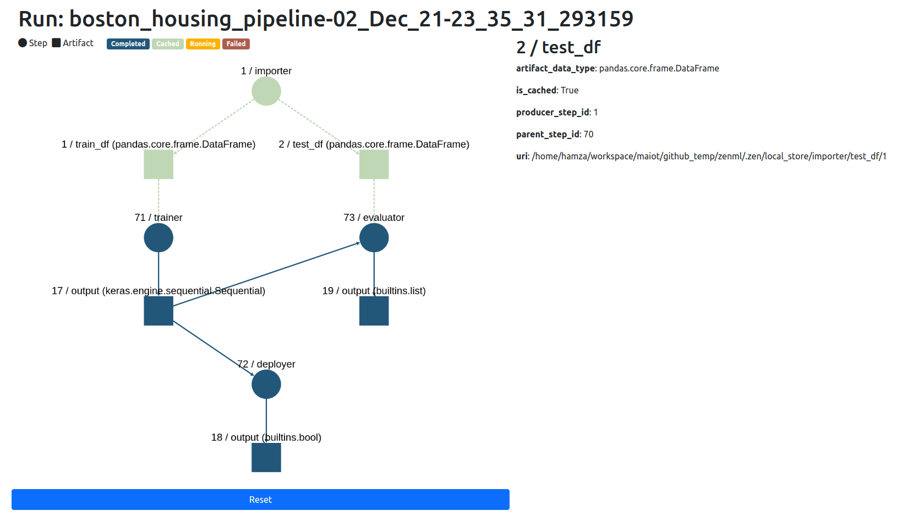

# Visualizers

## What is a visualizer?

Sometimes it makes sense in
the [post-execution workflow](../../developer-guide/post-execution-workflow.md) to
actually visualize step
outputs. ZenML has a standard, extensible interface for all visualizers:

```python
from abc import abstractmethod
from typing import Any


class BaseVisualizer:
    """Base class for all ZenML Visualizers."""

    @abstractmethod
    def visualize(self, object: Any, *args: Any, **kwargs: Any) -> None:
        """Method to visualize objects."""
```

The `object` can currently be a `StepView`, a `PipelineRunView` , or
a `PipelineView`. (These are all different
post-execution objects.)

## Examples of visualizations

### Lineage with [`dash`](https://plotly.com/dash/)

```python
from zenml.repository import Repository
from zenml.integrations.dash.visualizers.pipeline_run_lineage_visualizer import (
    PipelineRunLineageVisualizer,
)

repo = Repository()
latest_run = repo.get_pipelines()[-1].runs[-1]
PipelineRunLineageVisualizer().visualize(latest_run)
```

It produces the following visualization:



### Statistics with [`facets`](https://github.com/PAIR-code/facets)

```python
from zenml.integrations.facets.visualizers.facet_statistics_visualizer import (
    FacetStatisticsVisualizer,
)

FacetStatisticsVisualizer().visualize(output)
```

It produces the following visualization:


### Distributions with [`whylogs`](https://github.com/whylabs/whylogs)

```python
from zenml.integrations.whylogs.visualizers import WhylogsVisualizer
from zenml.repository import Repository
repo = Repository()
pipe = repo.get_pipelines()[-1]
whylogs_outputs = pipe.runs[-1].get_step(name=step_name)
WhylogsVisualizer().visualize(whylogs_outputs)
```

It produces the following visualization:


### Drift with [`evidently`](https://github.com/evidentlyai/evidently)

```python
from zenml.integrations.evidently.visualizers import EvidentlyVisualizer
from zenml.repository import Repository

repo = Repository()
pipe = repo.get_pipelines()[-1]
evidently_outputs = pipe.runs[-1].get_step(name="drift_detector")
EvidentlyVisualizer().visualize(evidently_outputs)
```

It produces the following visualization:

