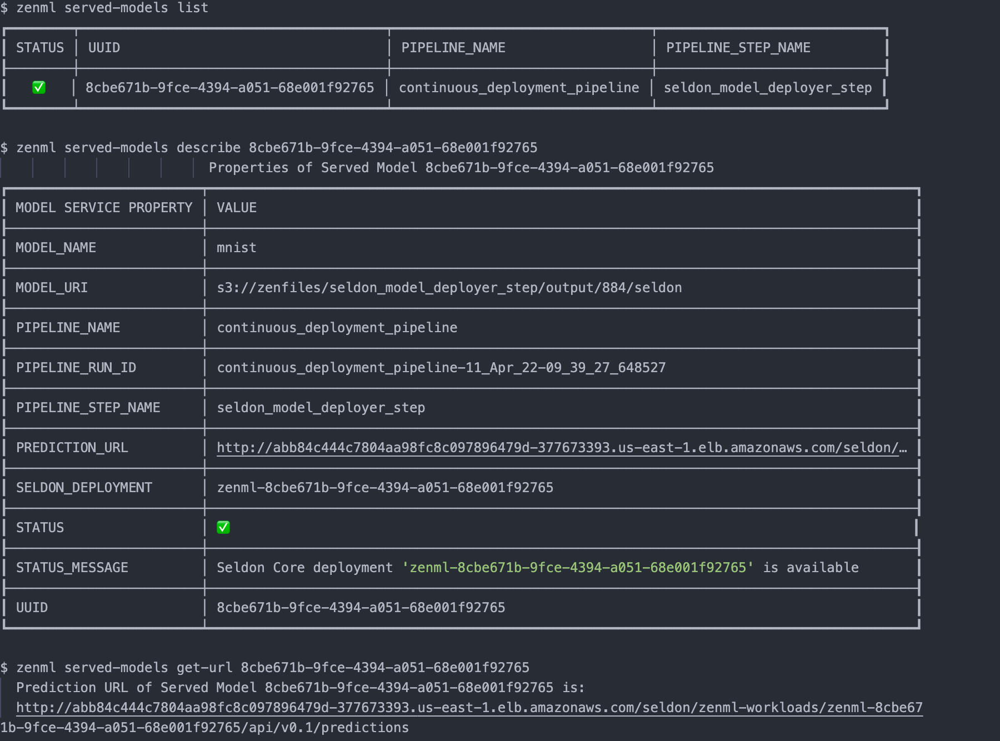


This is an older version of the ZenML documentation. To read and view the latest version please [visit this up-to-date URL](https://docs.zenml.io).



As MLOps gains more attention and organizations start growing their own
understanding of [the MLOps maturity model](https://blog.zenml.io/mlops-maturity-models/), the terms Continuous Integration,
Continuous Training and Continuous Deployment (CI/CT/CD) become more relevant
since MLOps is all about applying DevOps principles to ML systems.

We do this by automating the model preparation, model training and model
deployment. With the built-in functionalities like Schedules, Model Deployers
and Services you can create end-to-end ML workflows with Continuous Training and
Deployment that deploys your model in a local environment with MLFlow
integration or even in a production-grade environment like Kubernetes with our
Seldon Core or kserve integrations.

Model Deployers integrate with external tools, services or platforms responsible for online model serving. And by online serving we mean the process of hosting and loading machine-learning models as part of a managed web service and providing access to the models through an API endpoint like HTTP or GRPC. ZenML understands there are some scenarios where data scientists training the models may not be experienced software developers with a background in service-oriented design or in Kubernetes. The ZenML abstraction for Model Deployers handles the functionality concerning the life-cycle management and tracking of external model deployment servers (e.g. processes, containers, Kubernetes deployments and so on.).

MLFlow, Seldon Core and Kserve are three examples of Model Deployers already provided by
ZenML as an integration, with others to follow. All users have to
do is run pipelines with the appropriate and easy-to-use configuration, and
models get deployed instantly.


To achieve this end, model deployers play three major roles as stack components:

1. They hold all the stack-related configuration attributes required to interact with the remote model serving tool, service or platform (e.g. hostnames, URLs, references to credentials, other client-related configuration parameters)

```shell
#MLFlow model deployer as a stack component
zenml integration install mlflow
zenml model-deployer register mlflow --type=mlflow
zenml stack register local_with_mlflow -m default -a default -o default -d mlflow
zenml stack set local_with_mlflow

# Seldon core model deployer as a stack component
zenml integration install seldon
zenml model-deployer register seldon --type=seldon \
--kubernetes_context=zenml-eks --kubernetes_namespace=zenml-workloads \
--base_url=http://some-id.us-east-1.elb.amazonaws.com
...
zenml stack register seldon_stack -m default -a aws -o default -d seldon
 ```

2. They implement the Continuous Deployment logic necessary to deploy models in a
 way that updates an existing model server that is already serving a previous
 version of the same model instead of creating a new model server for every new
 model version. Every model server that the Model Deployer provisions externally
 to deploy a model is represented internally as a Service object that may be
 accessed for visibility and control over a single model deployment. This
 functionality can be consumed directly from ZenML pipeline steps, but it can
 also be used outside of the pipeline to deploy ad-hoc models.

```python
from zenml.environment import Environment
from zenml.integrations.seldon.model_deployers import SeldonModelDeployer
from zenml.integrations.seldon.services.seldon_deployment import (
    SeldonDeploymentConfig,
    SeldonDeploymentService,
)
from zenml.steps import (
    STEP_ENVIRONMENT_NAME,
    BaseStepConfig,
    StepEnvironment,
    step,
)

@step(enable_cache=True)
def seldon_model_deployer_step(
    context: StepContext,
    model: ModelArtifact,
) -> SeldonDeploymentService:
    model_deployer = SeldonModelDeployer.get_active_model_deployer()

    # get pipeline name, step name and run id
    step_env = Environment()[STEP_ENVIRONMENT_NAME])

    service_config=SeldonDeploymentConfig(
        model_uri=model.uri,
        model_name="my-model",
        replicas=1,
        implementation="TENSORFLOW_SERVER",
        secret_name="seldon-secret",
        pipeline_name = step_env.pipeline_name,
        run_name = step_env.run_name,
        pipeline_step_name = step_env.step_name,
    )

    service = model_deployer.deploy_model(
        service_config, replace=True, timeout=300
    )

    print(
        f"Seldon deployment service started and reachable at:\n"
        f"    {service.prediction_url}\n"
    )

    return service
```

The Model Deployer acts as a registry for all services that represent remote model servers. External model deployment servers can be listed and filtered using a variety of criteria, such as the name of the model or the names of the pipeline and the step that was used to deploy the model. The service objects returned by the Model Deployer can be used to interact with the remote model server, e.g. to get the operational status of a model server, the prediction URI that it exposes, or to stop or delete a model server.

```python
from zenml.integrations.seldon.model_deployers import SeldonModelDeployer

model_deployer = SeldonModelDeployer.get_active_model_deployer()
services = model_deployer.find_model_server(
    pipeline_name="continuous-deployment-pipeline",
    pipeline_step_name="seldon_model_deployer_step",
    model_name="my-model",
)
if services:
    if services[0].is_running:
        print(
            f"Seldon deployment service started and reachable at:\n"
            f"    {service.prediction_url}\n"
        )
    elif services[0].is_failed:
        print(
            f"Seldon deployment service is in a failure state. "
            f"The last error message was: {service.status.last_error}"
        )
    else:
        print(f"Seldon deployment service is not running")

        # start the service
        services[0].start(timeout=100)

    # delete the service
    model_deployer.delete_service(services[0].uuid, timeout=100, force=False)
```

And with the ZenML CLI we can interact with list of served models, start, stop or delete deployments that the active model deployer is responsible for.




To read a more detailed guide about how Model Deployers function in ZenML,
[click here](../../component-gallery/model-deployers/model-deployers.md).
