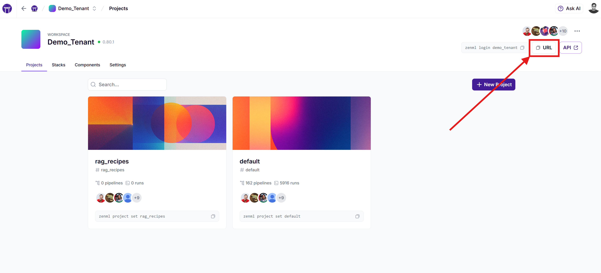

# Getting Started

The ZenML Pro API extends the open-source API with additional features designed for enterprise users, including:

* Enhanced team collaboration features
* Advanced role-based access control
* Enterprise-grade security features

Whether you're using the [SaaS version](https://zenml.io/pro) or a self-hosted ZenML Pro instance, you can leverage the API to manage workspaces, organizations, users, roles, and more.

## Understanding the Two APIs in ZenML Pro

ZenML Pro includes two distinct APIs:

1. **Workspace API**: This is similar to the [OSS API](../../oss-api/oss-api/) but includes additional endpoints like Run Templates. Each workspace in ZenML Pro has its own API.
2. **ZenML Pro API**: This is the management API for ZenML Pro and handles organization-level resources like workspaces, users, and roles.

### Server URL

For Pro users, the `server_url` for the Workspace API is the URL of your workspace, which can be found in the ZenML Pro dashboard:

**Note:** The workspace URL can be found in the ZenML Pro dashboard and typically looks like `https://1bfe8d94-zenml.cloudinfra.zenml.io`.



The SaaS version of ZenML Pro API is hosted at [https://cloudapi.zenml.io](https://cloudapi.zenml.io).

## API Overview

The ZenML Pro API is a RESTful API that follows OpenAPI 3.1.0 specifications. It provides endpoints for various resources and operations, including:

* Workspace management
* Organization management
* Project management
* User management
* Role-based access control (RBAC)
* Authentication and authorization

## Authentication

To use the ZenML Pro API, you need to authenticate your requests. If you are logged in to your ZenML Pro account, you can use the same browser window to authenticate requests to your ZenML Pro API, directly in the OpenAPI docs.

For example, for the SaaS variant, you can access the docs here: [https://cloudapi.zenml.io](https://cloudapi.zenml.io). 

### Programmatic access with short-lived API tokens

Similar to [short-lived tokens for OSS and Workspace servers](../../oss-api/oss-api/#using-a-short-lived-api-token), API tokens provide a way to authenticate with the ZenML Pro API for temporary automation tasks. These tokens are scoped to your user account and are valid for 1 hour by default. You can use the generated API tokens for programmatic access to the ZenML Pro REST API.

To generate a new API token for the ZenML Pro API:

1. Navigate to the organization settings page in your ZenML Pro dashboard
2.  Select "API Tokens" from the left sidebar

    
3.  Click the "Create new token" button. Once generated, you'll see a dialog showing your new API token.

    
4. Simply use the API token as the bearer token in your HTTP requests. For example, you can use the following command to check your current user:
   *   using curl:

       ```bash
       curl -H "Authorization: Bearer YOUR_API_TOKEN" https://cloudapi.zenml.io/users/me
       ```
   *   using wget:

       ```bash
       wget -qO- --header="Authorization: Bearer YOUR_API_TOKEN" https://cloudapi.zenml.io/users/me
       ```
   *   using python:

       ```python
       import requests

       response = requests.get(
         "https://cloudapi.zenml.io/users/me",
         headers={"Authorization": f"Bearer YOUR_API_TOKEN"}
       )
       print(response.json())
       ```


**Important Notes**

* API tokens expire after 1 hour and cannot be retrieved after initial generation
* Tokens are scoped to your user account and inherit your permissions
* As an alternative to API tokens, you can use [service accounts and API keys](./#programmatic-access-with-service-accounts-and-api-keys) for long-term access.


### Programmatic access with service accounts and API keys


**Deprecation of workspace level service accounts and API keys**

* ZenML Pro workspace level service accounts and API keys are deprecated and will be removed in a future version.
* Please use ZenML Pro organization level service accounts and API keys instead (see [Service Accounts](https://docs.zenml.io/pro/core-concepts/service-accounts))
* Follow the migration guide in [Migration of workspace level service accounts](https://docs.zenml.io/pro/core-concepts/service-accounts#migration-of-workspace-level-service-accounts) to learn how to migrate from your existing service accounts.


Organization‑level service accounts and API keys can be used to authenticate to the ZenML Pro API and to obtain short‑lived tokens for the Workspace API across all workspaces. See [Service Accounts](https://docs.zenml.io/pro/core-concepts/service-accounts) for setup and examples.


Which credentials should you use?

- For organization/workspace/user management on the Pro management API (`cloudapi.zenml.io`), use short‑lived Pro API tokens (no service accounts).
- For pipeline/run‑template operations on your Workspace API (your workspace URL), use temporary user tokens or—recommended for automation—service accounts + API keys.

See the high‑level overview: [Connect to a server](https://docs.zenml.io/how-to/manage-zenml-server/connecting-to-zenml#choose-how-to-connect).


## Workspace API Authentication

The **Workspace API** is different from the ZenML Pro API and supports different authentication methods. This is the API you'll use for triggering run templates and other pipeline operations.

### When to Use Which API

| Task | Use This API | Authentication Method |
|------|-------------|----------------------|
| Managing organizations, workspaces, users | **ZenML Pro API** (cloudapi.zenml.io) | Short-lived API tokens from organization settings |
| Accessing the ZenML Pro API programmatically from external systems | **ZenML Pro API** (cloudapi.zenml.io) | Service accounts + API keys (recommended for automation) |
| Triggering run templates, pipeline operations | **Workspace API** (your workspace URL) | Service accounts + API keys (recommended for automation) |
| Pipeline development, artifact management | **Workspace API** (your workspace URL) | Temporary API tokens or service accounts |

### Workspace API Authentication Methods

Programmatic access to the ZenML Pro workspace API is achieved mostly the same way as the ZenML OSS server API. This is because the Workspace API in ZenML Pro is an extension of the OSS API with some additional endpoints like Run Templates. The only exception is that workspace level service accounts and API keys are disabled and organization level service accounts and API keys are used instead (see [Service Accounts](https://docs.zenml.io/pro/core-concepts/service-accounts)).

You can use one of these two methods to authenticate with your workspace API:

* [Generate and use temporary API tokens](../../oss-api/oss-api/#using-a-short-lived-api-token) (good for development and short-term tasks)
* [Create a ZenML Pro service account and use its API key](https://docs.zenml.io/pro/core-concepts/service-accounts) (recommended for production automation and run template triggering)

When making requests to the Workspace API, make sure to use your workspace URL as the base URL. This is different from the ZenML Pro API URL (cloudapi.zenml.io), which is used for organization-level operations.

Please consult the indicated sections for more information.

## Key API Endpoints

Here are some important endpoints you can use with ZenML Pro:

### ZenML Pro API Endpoints

These endpoints are available at the ZenML Pro API (e.g., https://cloudapi.zenml.io):

#### Organization Management

* List organizations: `GET /organizations`
* Create an organization: `POST /organizations`
* Get organization details: `GET /organizations/{organization_id}`
* Update an organization: `PATCH /organizations/{organization_id}`

#### Workspace Management

* List workspaces: `GET /workspaces`
* Create a workspace: `POST /workspaces`
* Get workspace details: `GET /workspaces/{workspace_id}`
* Update a workspace: `PATCH /workspaces/{workspace_id}`

#### User Management

* List users: `GET /users`
* Get current user: `GET /users/me`
* Update user: `PATCH /users/{user_id}`

#### Role-Based Access Control

* Create a role: `POST /roles`
* Assign a role: `POST /roles/{role_id}/assignments`
* Check permissions: `GET /permissions`

Remember to refer to the complete API documentation available at [https://cloudapi.zenml.io](https://cloudapi.zenml.io) for detailed information about all available endpoints, request/response schemas, and additional features.

### Workspace API Endpoints

The Workspace API includes all OSS API endpoints plus some additional Pro-specific endpoints. These are available at your workspace URL at the `/docs` path (e.g., https://1bfe8d94-zenml.cloudinfra.zenml.io/docs):

#### Run Templates (Pro-specific)

Run Templates allow you to trigger pipeline runs from external systems using HTTP requests.

* List run templates: `GET /run_templates`
* Create a run template: `POST /run_templates`
* Get run template details: `GET /run_templates/{template_id}`
* Update a run template: `PATCH /run_templates/{template_id}`
* **Trigger a run template: `POST /run_templates/{template_id}/runs`**


**For Run Template Automation**

When triggering run templates from external systems or CI/CD pipelines, we strongly recommend using **service accounts with API keys** rather than temporary tokens. Service accounts provide:

* Long-term credentials that don't expire hourly
* Dedicated authentication for automation (not tied to individual users)
* Consistent access even when team members leave

See the [service account documentation](../../oss-api/oss-api/#using-a-service-account-and-an-api-key) for setup instructions.


For a complete list of API endpoints available in the Workspace API, refer to the [OSS API documentation](../../oss-api/oss-api/).

## Error Handling

The API uses standard HTTP status codes to indicate the success or failure of requests. In case of errors, the response body will contain more details about the error, including a message and sometimes additional information.

## Rate Limiting

Be aware that the ZenML Pro API may have rate limiting in place to ensure fair usage. If you exceed the rate limit, you may receive a 429 (Too Many Requests) status code. Implement appropriate backoff and retry logic in your applications to handle this scenario.

## Troubleshooting Authentication

### "Which API and credentials should I use?"

Use this decision tree to determine the right approach:

| **What do you want to do?** | **Which API?** | **Authentication Method** | **Why?** |
|------------------------------|----------------|---------------------------|----------|
| Trigger run templates from CI/CD or external systems | **Workspace API** (your workspace URL) | Service account + API key | Long-lived, automation-friendly, not tied to users |
| Manage organizations, create workspaces, invite users | **ZenML Pro API** (cloudapi.zenml.io) | Short-lived API tokens from org settings | Administrative operations need user-level permissions |
| Access the ZenML Pro API programmatically from external systems | **ZenML Pro API** (cloudapi.zenml.io) | Service accounts + API keys (recommended for automation) | Long-lived, automation-friendly, not tied to users |
| Develop pipelines, explore artifacts | **Workspace API** (your workspace URL) | Temporary API tokens or service accounts | Flexible for development needs |
| One-off pipeline operations | **Workspace API** (your workspace URL) | Temporary API tokens | Quick and easy for manual tasks |

### Common Issues

**"My API calls are getting 401 Unauthorized"**
- ✅ Check that you're using the correct API URL (workspace URL vs cloudapi.zenml.io)
- ✅ Verify your token hasn't expired (user tokens expire after 1 hour)
- ✅ Ensure you're using `Bearer <token>` format in the Authorization header

**"My automation keeps failing after an hour"**
- ✅ Switch from temporary API tokens to service account API keys
- ✅ Service account tokens don't expire automatically like user tokens

**"I can't find the run template endpoints"**
- ✅ Run templates are only available on the **Workspace API**, not the ZenML Pro API
- ✅ Use your workspace URL + `/docs` to see the full API documentation
