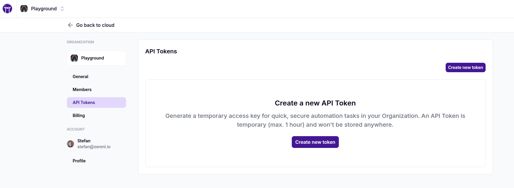

# Getting Started

The ZenML Pro API extends the open-source API with additional features designed for enterprise users, including:

* Enhanced team collaboration features
* Advanced role-based access control
* Enterprise-grade security features

Whether you're using the [SaaS version](https://cloud.zenml.io) or a self-hosted ZenML Pro instance, you can leverage the API to manage workspaces, organizations, users, roles, and more.

## Understanding the Two APIs in ZenML Pro

ZenML Pro includes two distinct APIs:

1. **Workspace API**: This is similar to the [OSS API](../../oss-api/oss-api/) but includes additional endpoints like Run Templates. Each workspace in ZenML Pro has its own API.
2. **ZenML Pro API**: This is the management API for ZenML Pro and handles organization-level resources like workspaces, users, and roles.

### Server URLs

* **For OSS users**: The `server_url` is the root URL of your ZenML server deployment.
* **For Pro users**: The `server_url` for the Workspace API is the URL of your workspace, which can be found in the ZenML Pro dashboard:

**Note:** The workspace URL can be found in the ZenML Pro dashboard and typically looks like `https://1bfe8d94-zenml.cloudinfra.zenml.io`.


The SaaS version of ZenML Pro API is hosted at [https://cloudapi.zenml.io](https://cloudapi.zenml.io).

## API Overview

The ZenML Pro API is a RESTful API that follows OpenAPI 3.1.0 specifications. It provides endpoints for various resources and operations, including:

* Workspace management
* Organization management
* User management
* Role-based access control (RBAC)
* Authentication and authorization

## Authentication

To use the ZenML Pro API, you need to authenticate your requests. If you are logged in to your ZenML Pro account, you can use the same browser window to authenticate requests to your ZenML Pro API, directly in the OpenAPI docs.

For example, for the SaaS variant, you can access the docs here: [https://cloudapi.zenml.io](https://cloudapi.zenml.io). You can make requests by being logged into ZenML Pro at [https://cloud.zenml.io](https://cloud.zenml.io).

### Programmatic access with API tokens

Similar to [short-lived tokens for OSS and Workspace servers](../../oss-api/oss-api/#using-a-short-lived-api-token), API tokens provide a way to authenticate with the ZenML Pro API for temporary automation tasks. These tokens are scoped to your user account and are valid for 1 hour by default. You can use the generated API tokens for programmatic access to the ZenML Pro REST API.

To generate a new API token for the ZenML Pro API:

1. Navigate to the organization settings page in your ZenML Pro dashboard
2.  Select "API Tokens" from the left sidebar

    
3.  Click the "Create new token" button. Once generated, you'll see a dialog showing your new API token.

    
4. Simply use the API token as the bearer token in your HTTP requests. For example, you can use the following command to check your current user:
   *   using curl:

       ```bash
       curl -H "Authorization: Bearer YOUR_API_TOKEN" https://cloudapi.zenml.io/users/me
       ```
   *   using wget:

       ```bash
       wget -qO- --header="Authorization: Bearer YOUR_API_TOKEN" https://cloudapi.zenml.io/users/me
       ```
   *   using python:

       ```python
       import requests

       response = requests.get(
         "https://cloudapi.zenml.io/users/me",
         headers={"Authorization": f"Bearer YOUR_API_TOKEN"}
       )
       print(response.json())
       ```


**Important Notes**

* API tokens expire after 1 hour and cannot be retrieved after initial generation
* Tokens are scoped to your user account and inherit your permissions
* Currently, there is no "service account" concept for the ZenML Pro API.


### Workspace programmatic access

Programmatic access to the ZenML Pro workspace API is achieved essentially the same way as the ZenML OSS server API. This is because the Workspace API in ZenML Pro is an extension of the OSS API with some additional endpoints like Run Templates.

You can use one of these two methods to authenticate with your workspace API:

* [Generate and use temporary API tokens](../../oss-api/oss-api/#using-a-short-lived-api-token)
* [Create a service account and use its API key](../../oss-api/oss-api/#using-a-service-account-and-an-api-key)

When making requests to the Workspace API, make sure to use your workspace URL as the base URL. This is different from the ZenML Pro API URL (cloudapi.zenml.io), which is used for organization-level operations.

Please consult the indicated sections for more information.

## Key API Endpoints

Here are some important endpoints you can use with ZenML Pro:

### ZenML Pro API Endpoints

These endpoints are available at the ZenML Pro API (e.g., https://cloudapi.zenml.io):

#### Organization Management

* List organizations: `GET /organizations`
* Create an organization: `POST /organizations`
* Get organization details: `GET /organizations/{organization_id}`
* Update an organization: `PATCH /organizations/{organization_id}`

#### Workspace Management

* List workspaces: `GET /workspaces`
* Create a workspace: `POST /workspaces`
* Get workspace details: `GET /workspaces/{workspace_id}`
* Update a workspace: `PATCH /workspaces/{workspace_id}`

#### User Management

* List users: `GET /users`
* Get current user: `GET /users/me`
* Update user: `PATCH /users/{user_id}`

#### Role-Based Access Control

* Create a role: `POST /roles`
* Assign a role: `POST /roles/{role_id}/assignments`
* Check permissions: `GET /permissions`

Remember to refer to the complete API documentation available at [https://cloudapi.zenml.io](https://cloudapi.zenml.io) for detailed information about all available endpoints, request/response schemas, and additional features.

### Workspace API Endpoints

The Workspace API includes all OSS API endpoints plus some additional Pro-specific endpoints. These are available at your workspace URL at the `/docs` path (e.g., https://1bfe8d94-zenml.cloudinfra.zenml.io/docs):

#### Run Templates (Pro-specific)

* List run templates: `GET /run_templates`
* Create a run template: `POST /run_templates`
* Get run template details: `GET /run_templates/{template_id}`
* Update a run template: `PATCH /run_templates/{template_id}`

For a complete list of API endpoints available in the Workspace API, refer to the [OSS API documentation](../../oss-api/oss-api/).

## Error Handling

The API uses standard HTTP status codes to indicate the success or failure of requests. In case of errors, the response body will contain more details about the error, including a message and sometimes additional information.

## Rate Limiting

Be aware that the ZenML Pro API may have rate limiting in place to ensure fair usage. If you exceed the rate limit, you may receive a 429 (Too Many Requests) status code. Implement appropriate backoff and retry logic in your applications to handle this scenario.
