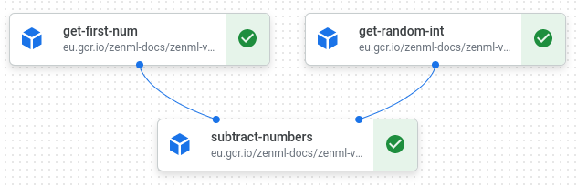

# GCP Setup Guide

To get started using ZenML on the cloud, you need some basic infrastructure up 
and running that you can then make more complicated depending on your use-case. 
This guide sets up the easiest MLOPs stack that we can run on GCP with ZenML. 


This guide represents **one** of many ways to create a cloud stack on GCP. 
Every component could be replaced by a different implementation. Feel free to 
take this as your starting point.


## Prerequisites 

For this to work you need to have ZenML installed locally with all GCP 
requirements.

```bash
pip install zenml
zenml integration install gcp
```

Additionally, you will need Docker installed on your system. 

## The cloud stack

A full cloud stack will necessarily contain these five stack components:

* An **artifact store** to save all step output artifacts, in this guide we will
use a GCP bucket for this purpose
* A **metadata store** that keeps track of the relationships between artifacts, 
runs and parameters. In our case we will opt for a MySQL database on GCP
Cloud SQL.
* The **orchestrator** to run the pipelines. Here we will opt for a Vertex AI
pipelines orchestrator. This is a serverless GCP specific offering with minimal
hassle.
* A **container registry** for pushing and pulling the pipeline image.
* Finally, the **secrets Manager** to store passwords and SSL certificates.

## Set Up `gcloud` CLI

Install the `gcloud` CLI on your machine. 
[Here](https://cloud.google.com/sdk/docs/install) is a guide on how to install 
it.

```shell
gcloud auth
```

## Set up a GCP project (Optional)

 


As a first step it might make sense to 
[create](https://console.cloud.google.com/projectcreate) 
a separate GCP project for your ZenML resources. However, this step is 
completely optional, and you can also move forward within an existing project. 
If some resources already exist, feel free to skip their creation step and 
simply note down the relevant information.

For simplicity, just open up a terminal on the side and save relevant values 
as we go along. You will use these when we set up the ZenML stack.
ZenML will use your project number at a later stage to connect to some 
resources, so let's it. You'll most probably find it right 
[here](https://console.cloud.google.com/welcome).

```shell
PROJECT_NUMBER=<PROJECT_NUMBER> # for example '492014921912'
GCP_LOCATION=<GCP_LOCATION> # for example 'europe-west3'
```



```shell
PARENT_ORG_ID=<PARENT_ORG_ID> # for example 3928562984638
PROJECT_NAME=<PROJECT_NAME> # for example zenml-vertex-prj
GCP_LOCATION=<GCP_LOCATION> # for example 'europe-west3'

gcloud projects create $PROJECT_NAME --organization=$PARENT_ORG_ID
gcloud config set project $PROJECT_NAME
PROJECT_NUMBER=$(gcloud projects describe $PROJECT_NAME --format="value(projectNumber)")
```




## Enable billing

Before moving on, you'll have to make sure you attach a billing account to 
your project. In case you do not have the permissions to do so, you'll have to
ask an organization administrator.
 

[Here](https://console.cloud.google.com/billing/projects) is a relevant page.




In case you don't have permissions on your companies billing account you might 
need to ask your admin to do this for you.

```shell
BILLING_ACC=<BILLING_ACC>
```

```shell
gcloud beta billing projects link $PROJECT_NAME --billing-account $BILLING_ACC
```




## Enable Vertex AI
Vertex AI pipelines is at the heart of our GCP stack. As the orchestrator 
Vertex AI will run your pipelines and use all the other stack components. 



All you'll need to do at this stage is enable Vertex AI
[here](https://console.cloud.google.com/vertex-ai).



```shell
gcloud services enable aiplatform.googleapis.com
```



## Enable Secrets Manager

The Secrets Manager will be needed so that the orchestrator will have secure
access to the other resources. 

 

[Here](https://console.cloud.google.com/marketplace/product/google/secretmanager.googleapis.com)
is where you'll be able to enable the secrets manager.



```shell
gcloud services enable secretmanager.googleapis.com
```



## Enable Container Registry

The Vertex AI orchestrator uses Docker Images containing your pipeline code
for pipeline orchestration. 

 

For this to work you'll need to enable the GCP Docker registry 
[here](https://console.cloud.google.com/marketplace/product/google/containerregistry.googleapis.com).

In order to use the container registry at a later point you will need to 
set the container registry URI. This is how it is usually constructed:
`gcr.io/<PROJECT_ID>`. 


The container registry has four options: `gcr.io` , `us.gcr.io`, `eu.gcr.io `, 
or `asia.gcr.io`. Choose the one appropriate for you. 


```bash
CONTAINER_REGISTRY_URI=<CONTAINER_REGISTRY_URI> # for example 'eu.gcr.io/zenml-project'
```



```shell
CONTAINER_REGISTRY_REGION=<CONTAINER_REGISTRY_REGION> # can be 'eu', 'us', 'asia'
gcloud services enable containerregistry.googleapis.com
CONTAINER_REGISTRY_URI=$CONTAINER_REGISTRY_REGION".gcr.io/"$PROJECT_NAME
```



## Set up Cloud Storage as Artifact Store

Storing of step artifacts is an important part of reproducible MLOps. 

 

Create a bucket [here](https://console.cloud.google.com/storage/create-bucket).

Within the configuration of the newly created bucket you can find the 
gsutil URI which you will need at a later point. It's usually going to look like 
this: `gs://<bucket-name>`

```bash
GSUTIL_URI=<GSUTIL_URI> # for example 'gs://zenml_vertex_storage'
```



```shell
GSUTIL_URI=gs://<BUCKET-NAME>
gsutil mb -p $PROJECT_NAME $GSUTIL_URI
```



## Set up a Cloud SQL instance as Metadata Store

One of the most complex resources that you'll need to manage is the MySQL
database. 

 

To start, we [create](https://console.cloud.google.com/sql/instances/create;engine=MySQLe)
a MySQL database. Once created, it will take some time for the database to be 
set up. 

Once it is set up you can find the IP-address. The password you set during 
creation of the instance is the root password. The default port for MySQL is 
3306. 

```bash
DB_HOST=<DB_HOST> # for example '35.137.24.15'
DB_PWD=<DB_PWD> # for example 'secure_root_pwd'
```

Time to set up the connections to our database. To do this you'll need to go 
into the `Connections` menu. Under the `Networking` tab you'll need to add 
**0.0.0.0/0** to the authorized networks, thereby allowing all incoming traffic 
from everywhere. (Feel free to restrict this to your outgoing IP address)

For security reasons, it is also recommended to configure your database to only 
accept SSL connections. You'll find the relevant setting in the **Security** 
tab. Select **SSL Connections only** in order to encrypt all traffic with your 
database.

Now **Create Client Certificate** and download all three files. Save the paths 
to these three files as follows.

```bash
SSL_CA=<SSL_CA> # for example /home/zen/Downloads/server-ca.pem
SSL_CERT=<SSL_CERT> # for example /home/zen/Downloads/client-cert.pem
SSL_KEY=<SSL_KEY> # for example /home/zen/Downloads/client-key.pem
```


Note the **@** sign in front of these three variables. The **@** sign tells the 
secret manager that these are file paths to be loaded from.


Finally, head on over to the `Databases` submenu and create your database and
save its name. 

```bash
DB_NAME=<DB_NAME> # for example zenml_db
```



We have set some sensible defaults here, feel free to replace these with
names of your own.
```shell
DB_INSTANCE=zenml-inst
DB_NAME=zenml_metadata_store_db # make sure this contains no '-'
CERT_NAME=zenml-cert
CLIENT_KEY_PATH=$PROJECT_NAME"client-key.pem"
CLIENT_CERT_PATH=$PROJECT_NAME"client-cert.pem"
SERVER_CERT_PATH=$PROJECT_NAME"server-ca.pem"
```

```shell
# Enable the sql api for database creation
gcloud services enable sqladmin.googleapis.com
# Create the db instance
gcloud sql instances create $DB_INSTANCE --tier=db-f1-micro \
    --region=$GCP_LOCATION --authorized-networks 0.0.0.0/0
```
Make sure the instance is fully set up before continuing.

```shell
DB_HOST=$(gcloud sql instances describe $DB_INSTANCE --format='get(ipAddresses[0].ipAddress)')
gcloud sql users set-password root --host=% --instance $DB_INSTANCE --password $DB_PASSWORD

# Create Client certificate and download all three 
gcloud sql instances patch $DB_INSTANCE --require-ssl
```

This might take some time to finish again.

```shell
gcloud sql ssl client-certs create $CERT_NAME $CLIENT_KEY_PATH \
    --instance $DB_INSTANCE
gcloud sql ssl client-certs describe $CERT_NAME --instance=$DB_INSTANCE \
    --format="value(cert)" > $CLIENT_CERT_PATH
gcloud sql instances describe $DB_INSTANCE \
    --format="value(serverCaCert.cert)" > $SERVER_CERT_PATH

gcloud sql databases create $DB_NAME --instance=$DB_INSTANCE \
    --collation=utf8_general_ci --charset=utf8
```



## Create a Service Account

All the resources are created. Now we need to make sure the instance performing 
the compute engine (Vertex AI) needs to have the relevant permissions to access 
the other resources. For this you'll need to go
 

[here](https://console.cloud.google.com/iam-admin/serviceaccounts/create) to 
create a service account. Give it a relevant name and allow access to the
following roles:

* Vertex AI Custom Code Service Agent
* Vertex AI Service Agent
* Container Registry Service Agent
* Secret Manager Admin

Also give your user access to the service account. This is the service account 
that will be used by the Vertex AI compute engine.

```bash
SERVICE_ACCOUNT=<SERVICE_ACCOUNT> # for example zenml-vertex-sa@zenml-project.iam.gserviceaccount.com
```



```shell
SERVICE_ACCOUNT_ID=zenml-vertex-sa
USER_EMAIL=<USER_EMAIL> # for example user@zenml.io
SERVICE_ACCOUNT=${SERVICE_ACCOUNT_ID}"@"${PROJECT_NAME}".iam.gserviceaccount.com"
```

```shell
gcloud iam service-accounts create $SERVICE_ACCOUNT_ID \
    --display-name="zenml-vertex-sa" \
    --description="Service account for running Vertex Ai workflows from ZenML." 
gcloud projects add-iam-policy-binding ${PROJECT_NAME} \
    --role="roles/aiplatform.customCodeServiceAgent" \
    --member="serviceAccount:"${SERVICE_ACCOUNT}
gcloud projects add-iam-policy-binding ${PROJECT_NAME} \
    --role="roles/aiplatform.serviceAgent" \
    --member="serviceAccount:"${SERVICE_ACCOUNT}
gcloud projects add-iam-policy-binding ${PROJECT_NAME} \
    --role="roles/containerregistry.ServiceAgent" \
    --member="serviceAccount:"${SERVICE_ACCOUNT}
gcloud projects add-iam-policy-binding ${PROJECT_NAME} \
    --role="roles/secretmanager.admin" \
    --member="serviceAccount:"${SERVICE_ACCOUNT}
gcloud iam service-accounts add-iam-policy-binding $SERVICE_ACCOUNT \
    --member="user:"${USER_EMAIL} --role="roles/iam.serviceAccountUser"
```



## ZenML Stack

Everything on the GCP side is set up, you're ready to set up the ZenML stack 
components now. 

Copy-paste this into your terminal and press enter.

```bash
zenml orchestrator register vertex_orchestrator --flavor=vertex \
      --project=$PROJECT_NUMBER --location=$GCP_LOCATION \
      --workload_service_account=$SERVICE_ACCOUNT
zenml secrets-manager register gcp_secrets_manager \
      --flavor=gcp_secrets_manager --project_id=$PROJECT_NUMBER
zenml container-registry register gcp_registry --flavor=gcp \
      --uri=$CONTAINER_REGISTRY_URI
zenml artifact-store register gcp_artifact_store --flavor=gcp \
      --path=$GSUTIL_URI
zenml metadata-store register gcp_metadata_store --flavor=mysql \
      --host=$DB_HOST --port=3306 --database=$DB_NAME \
      --secret=mysql_secret
zenml stack register gcp_vertex_stack -m gcp_metadata_store \
      -a gcp_artifact_store -o vertex_orchestrator -c gcp_registry \
      -x gcp_secrets_manager --set
zenml secret register mysql_secret --schema=mysql \
      --user=root --password=$DB_PASSWORD \
      --ssl_ca="@"$SERVER_CERT_PATH --ssl_cert="@"$CLIENT_CERT_PATH \
      --ssl_key="@"$CLIENT_KEY_PATH
```

This is where your ZenML stack is created and connected to the GCP cloud 
resources. If you now run `zenml stack describe` you should see this:

```bash
            Stack Configuration             
┏━━━━━━━━━━━━━━━━━━━━┯━━━━━━━━━━━━━━━━━━━━━┓
┃ COMPONENT_TYPE     │ COMPONENT_NAME      ┃
┠────────────────────┼─────────────────────┨
┃ ARTIFACT_STORE     │ gcp_artifact_store  ┃
┠────────────────────┼─────────────────────┨
┃ CONTAINER_REGISTRY │ gcp_registry        ┃
┠────────────────────┼─────────────────────┨
┃ METADATA_STORE     │ gcp_metadata_store  ┃
┠────────────────────┼─────────────────────┨
┃ ORCHESTRATOR       │ vertex_orchestrator ┃
┠────────────────────┼─────────────────────┨
┃ SECRETS_MANAGER    │ gcp_secrets_manager ┃
┗━━━━━━━━━━━━━━━━━━━━┷━━━━━━━━━━━━━━━━━━━━━┛
     'gcp_vertex_stack' stack (ACTIVE)  
```

## Run your pipeline in the cloud

With your ZenML stack set up and active, you are now ready to run your ZenML
pipeline on Vertex AI. 

For example, you could pull the ZenML Vertex AI example and run it.

```bash
zenml example pull vertex_ai_orchestration
cd zenml_examples/vertex_ai_orchestration/
python run.py
```


Your first run might fail as one of the service accounts is only created once 
vertex is run for the first time. This service account will need to be given
appropriate rights after the first run fails.


At the end of the logs you should be seeing a link to the Vertex AI dashboard. 
It should look something like this:



In case you get an error message like this:
```shell
Failed to create pipeline job. Error: Vertex AI Service Agent 
'service-...@gcp-sa-aiplatform-cc.iam.gserviceaccount.com' should be 
granted access to the image eu.gcr.io/...
```

You will need to follow these instructions:

 


On the IAM page you will need to give permissions to the service account
of the custom code workers. 

For this, head over to your IAM 
[configurations](https://console.cloud.google.com/iam-admin/iam), click on 
**Include Google-provided role grants** on the top right and find the 
**<project_number>@gcp-sa-aiplatform-cc.iam.gserviceaccount.com** service
account. 

Now give this one the **Container Registry Service Agent** role on top of its 
existing role.



```shell
gcloud projects add-iam-policy-binding ${PROJECT_NAME} --role="roles/aiplatform.customCodeServiceAgent" \
    --member="serviceAccount:service-"${PROJECT_NUMBER}"@gcp-sa-aiplatform-cc.iam.gserviceaccount.com"
gcloud projects add-iam-policy-binding ${PROJECT_NAME} --role="roles/containerregistry.ServiceAgent" \
    --member="serviceAccount:service-"${PROJECT_NUMBER}"@gcp-sa-aiplatform-cc.iam.gserviceaccount.com"
```



Now rerun your pipeline, it should work now.

## Conclusion

Within this guide you have set up and used a stack on GCP using the Vertex AI
orchestrator. For more guides on different cloud set-ups, check out the 
[Kubeflow](https://docs.zenml.io/advanced-guide/execute-pipelines-in-cloud) and 
[Kubernetes](https://blog.zenml.io/k8s-orchestrator/) orchestrators 
respectively and find out if these are a better fit for you.


## One Shot Setup
<details>
    <summary>Quick setup commands</summary>
Set these parameters:

```shell
USER_EMAIL=<USER_EMAIL>  # for example user@zenml.io
PARENT_ORG_ID=<PARENT_ORG_ID> # for example 294710374920
BILLING_ACC=<BILLING_ACC> # for example 20CIW7-183916-8GA18Z
PROJECT_NAME=<PROJECT_NAME>
CONTAINER_REGISTRY_REGION=eu # can be 'eu', 'us', 'asia'
GCP_LOCATION=<GCP_LOCATION> # for example europe-west3 
DB_PASSWORD=<DB_PASSWORD> # for example auk(/194
```

And run this (make sure all the commands worked):
```shell
# Create a project and attach it to the specified billing account
gcloud projects create $PROJECT_NAME --organization=$PARENT_ORG_ID
gcloud config set project $PROJECT_NAME
gcloud beta billing projects link $PROJECT_NAME --billing-account $BILLING_ACC 
PROJECT_NUMBER=$(gcloud projects describe $PROJECT_NAME --format="value(projectNumber)")

# Enable the three APIs for vertex ai, the container registry and the 
gcloud services enable aiplatform.googleapis.com
gcloud services enable secretmanager.googleapis.com
gcloud services enable containerregistry.googleapis.com

CONTAINER_REGISTRY_URI=$CONTAINER_REGISTRY_REGION".gcr.io/"$PROJECT_NAME

# Create a storage bucket
GSUTIL_URI=gs://${PROJECT_NAME}-bucket
gsutil mb -p $PROJECT_NAME $GSUTIL_URI

# Enable the sql api for database creation
gcloud services enable sqladmin.googleapis.com

# Create the db instance
DB_INSTANCE=zenml-inst
gcloud sql instances create $DB_INSTANCE --tier=db-f1-micro --region=$GCP_LOCATION --authorized-networks 0.0.0.0/0

DB_HOST=$(gcloud sql instances describe $DB_INSTANCE --format='get(ipAddresses[0].ipAddress)')
gcloud sql users set-password root --host=% --instance $DB_INSTANCE --password $DB_PASSWORD

# Create Client certificate and download all three 
CERT_NAME=zenml-cert
CLIENT_KEY_PATH=$PROJECT_NAME"client-key.pem"
CLIENT_CERT_PATH=$PROJECT_NAME"client-cert.pem"
SERVER_CERT_PATH=$PROJECT_NAME"server-ca.pem"
gcloud sql instances patch $DB_ISTANCE --require-ssl
gcloud sql ssl client-certs create $CERT_NAME $CLIENT_KEY_PATH --instance $DB_INSTANCE
gcloud sql ssl client-certs describe $CERT_NAME --instance=$DB_INSTANCE --format="value(cert)" > $CLIENT_CERT_PATH
gcloud sql instances describe $DB_INSTANCE --format="value(serverCaCert.cert)" > $SERVER_CERT_PATH

DB_NAME=zenml_metadata_store_db # make sure this contains no '-' as this will fail
gcloud sql databases create $DB_NAME --instance=$DB_INSTANCE --collation=utf8_general_ci --charset=utf8

# Configure the service accounts
SERVICE_ACCOUNT_ID=zenml-vertex-sa
SERVICE_ACCOUNT=${SERVICE_ACCOUNT_ID}"@"${PROJECT_NAME}".iam.gserviceaccount.com"

gcloud iam service-accounts create $SERVICE_ACCOUNT_ID --display-name="zenml-vertex-sa" \
    --description="Service account for running Vertex Ai workflows from ZenML." 
gcloud projects add-iam-policy-binding ${PROJECT_NAME} --role="roles/aiplatform.customCodeServiceAgent" \
    --member="serviceAccount:"${SERVICE_ACCOUNT}
gcloud projects add-iam-policy-binding ${PROJECT_NAME} --role="roles/aiplatform.serviceAgent" \
    --member="serviceAccount:"${SERVICE_ACCOUNT}
gcloud projects add-iam-policy-binding ${PROJECT_NAME} --role="roles/containerregistry.ServiceAgent" \
    --member="serviceAccount:"${SERVICE_ACCOUNT}
gcloud projects add-iam-policy-binding ${PROJECT_NAME} --role="roles/secretmanager.admin" \
    --member="serviceAccount:"${SERVICE_ACCOUNT}
gcloud iam service-accounts add-iam-policy-binding $SERVICE_ACCOUNT \
    --member="user:"${USER_EMAIL} --role="roles/iam.serviceAccountUser"

ORCHESTRATOR_NAME=$PROJECT_NAME"-gcp_vo"
ARTIFACT_STORE_NAME=$PROJECT_NAME"-gcp_as"
METADATA_STORE_NAME=$PROJECT_NAME"-gcp_ms"
CONTAINER_REGISTRY_NAME=$PROJECT_NAME"-gcp_cr"
SECRET_MANAGER_NAME=$PROJECT_NAME"-gcp_sm"
STACK_NAME=$PROJECT_NAME"-gcp_stack"

zenml orchestrator delete $ORCHESTRATOR_NAME
zenml artifact-store delete $ARTIFACT_STORE_NAME
zenml metadata-store delete $METADATA_STORE_NAME
zenml container-registry delete $CONTAINER_REGISTRY_NAME
zenml secrets-manager delete $SECRET_MANAGER_NAME

zenml orchestrator register $ORCHESTRATOR_NAME --flavor=vertex \
      --project=$PROJECT_NUMBER --location=$GCP_LOCATION \
      --workload_service_account=$SERVICE_ACCOUNT
zenml container-registry register $CONTAINER_REGISTRY_NAME --flavor=gcp \
      --uri=$CONTAINER_REGISTRY_URI
zenml secrets-manager register $SECRET_MANAGER_NAME \
      --flavor=gcp_secrets_manager --project_id=$PROJECT_NUMBER
zenml artifact-store register $ARTIFACT_STORE_NAME --flavor=gcp \
      --path=$GSUTIL_URI
zenml metadata-store register $METADATA_STORE_NAME --flavor=mysql \
      --host=$DB_HOST --port=3306 --database=$DB_NAME \
      --secret=mysql_secret
      
zenml stack register $STACK_NAME -o $ORCHESTRATOR_NAME \
      -c $CONTAINER_REGISTRY_NAME -x $SECRET_MANAGER_NAME \
      -a $ARTIFACT_STORE_NAME -m $METADATA_STORE_NAME --set
      
zenml secret register mysql_secret --schema=mysql \
      --user=root --password=$DB_PASSWORD \
      --ssl_ca="@"$SERVER_CERT_PATH --ssl_cert="@"$CLIENT_CERT_PATH --ssl_key="@"$CLIENT_KEY_PATH
```
If the first pipeline run fails:
```shell
gcloud projects add-iam-policy-binding ${PROJECT_NAME} --role="roles/aiplatform.customCodeServiceAgent" \
    --member="serviceAccount:service-"${PROJECT_NUMBER}"@gcp-sa-aiplatform-cc.iam.gserviceaccount.com"
gcloud projects add-iam-policy-binding ${PROJECT_NAME} --role="roles/containerregistry.ServiceAgent" \
    --member="serviceAccount:service-"${PROJECT_NUMBER}"@gcp-sa-aiplatform-cc.iam.gserviceaccount.com"
```
</details>