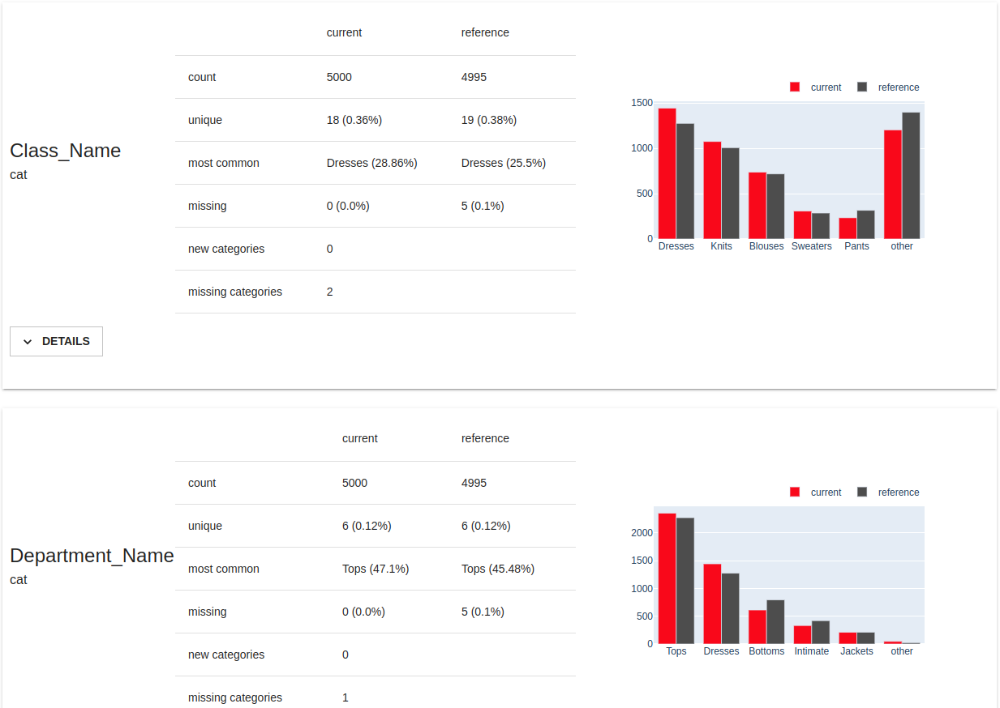
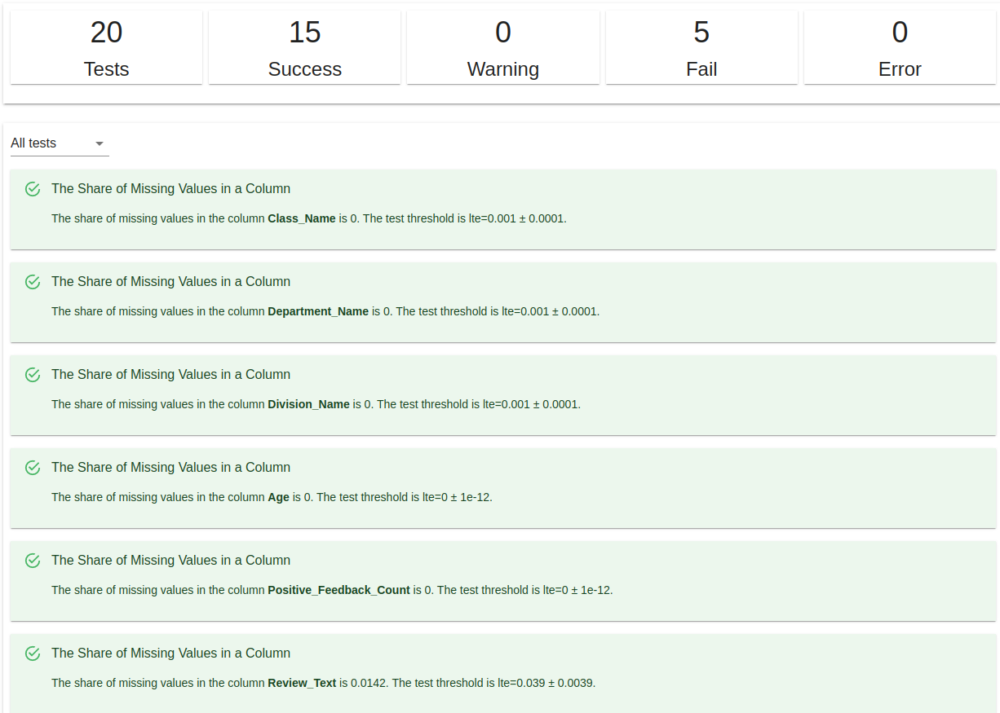


This is an older version of the ZenML documentation. To read and view the latest version please [visit this up-to-date URL](https://docs.zenml.io).



The Evidently [Data Validator](./data-validators.md) flavor
provided with the ZenML integration uses [Evidently](https://evidentlyai.com/)
to perform data quality, data drift, model drift and model performance analyses,
to generate reports and run checks. The reports and check results can be used to
implement automated corrective actions in your pipelines or to render
interactive representations for further visual interpretation, evaluation and
documentation.

## When would you want to use it?

[Evidently](https://evidentlyai.com/) is an open-source library that you can use
to monitor and debug machine learning models by analyzing the data that they
use through a powerful set of data profiling and visualization features, or
to run a variety of data and model validation reports and tests, from data
integrity tests that work with a single dataset to model evaluation tests to
data drift analyses and model performance comparison tests. All this can be done
with minimal configuration input from the user, or customized with specialized
conditions that the validation tests should perform.

Evidently currently works with tabular data in `pandas.DataFrame` or CSV file
formats and can handle both regression and classification tasks.

You should use the Evidently Data Validator when you need the following data
and/or model validation features that are possible with Evidently:

* [Data Quality](https://docs.evidentlyai.com/presets/data-quality) reports and tests:
provides detailed feature statistics and a feature behavior overview for a
single dataset. It can also compare any two datasets. E.g. you can use it to
compare train and test data, reference and current data, or two subgroups of one
dataset.

* [Data Drift](https://docs.evidentlyai.com/presets/data-drift) reports and tests:
helps detects and explore feature distribution changes in the input data by
comparing two datasets with identical schema.

* [Target Drift](https://docs.evidentlyai.com/presets/target-drift) reports and tests:
helps detect and explore changes in the target function and/or model predictions
by comparing two datasets where the target and/or prediction columns are available.

* [Regression Performance](https://docs.evidentlyai.com/presets/reg-performance) or
[Classification Performance](https://docs.evidentlyai.com/presets/class-performance) reports and tests:
evaluate the performance of a model by analyzing a single dataset where both the
target and prediction columns are available. It can also compare it to the past
performance of the same model, or the performance of an alternative model by
providing a second dataset.

You should consider one of the other [Data Validator flavors](./data-validators.md#data-validator-flavors)
if you need a different set of data validation features.

## How do you deploy it?

The Evidently Data Validator flavor is included in the Evidently ZenML
integration, you need to install it on your local machine to be able to register
an Evidently Data Validator and add it to your stack:

```shell
zenml integration install evidently -y
```

The Data Validator stack component does not have any configuration parameters.
Adding it to a stack is as simple as running e.g.:

```shell
# Register the Evidently data validator
zenml data-validator register evidently_data_validator --flavor=evidently

# Register and set a stack with the new data validator
zenml stack register custom_stack -dv evidently_data_validator ... --set
```

## How do you use it?

### Data Profiling

Evidently's profiling functions take in a `pandas.DataFrame` dataset or a pair
of datasets and generate results in the form of a `Report` object.

One of Evidently's notable characteristics is that it only requires datasets as
input. Even when running model performance comparison analyses, no model
needs to be present. However, that does mean that the input data needs to
include additional `target` and `prediction` columns for some profiling reports
and, you have to include additional information about the dataset columns in the
form of [column mappings](https://docs.evidentlyai.com/user-guide/tests-and-reports/column-mapping).
Depending on how your data is structured, you may also need to include additional
steps in your pipeline before the data validation step to insert the additional
`target` and `prediction` columns into your data. This may also require
interacting with one or more models.

There are three ways you can use Evidently to generate data reports in your
ZenML pipelines that allow different levels of flexibility:

* instantiate, configure and insert [the standard Evidently report step](#the-evidently-report-step)
shipped with ZenML into your pipelines. This is the easiest way and the
recommended approach.
* call the data validation methods provided by [the Evidently Data Validator](#the-evidently-data-validator)
in your custom step implementation. This method allows for more flexibility
concerning what can happen in the pipeline step.
* [use the Evidently library directly](#call-evidently-directly) in
your custom step implementation. This gives you complete freedom in how you are
using Evidently's features.

You can [visualize Evidently reports](#visualizing-evidently-reports) in Jupyter 
notebooks or view them directly in the ZenML dashboard by clicking on the 
respective artifact in the pipeline run DAG.

#### The Evidently Report step

ZenML wraps the Evidently data profiling functionality in the form of a standard
Evidently report pipeline step that you can simply instantiate and insert in
your pipeline. Here you can see how instantiating and configuring the standard
Evidently report step can be done using our included `evidently_report_step`
utility function:

```python
from zenml.integrations.evidently.metrics import EvidentlyMetricConfig
from zenml.integrations.evidently.steps import (
    EvidentlyColumnMapping,
    EvidentlyReportParameters,
    evidently_report_step,
)

text_data_report = evidently_report_step(
    step_name="text_data_report",
    params=EvidentlyReportParameters(
        column_mapping=EvidentlyColumnMapping(
            target="Rating",
            numerical_features=["Age", "Positive_Feedback_Count"],
            categorical_features=[
                "Division_Name",
                "Department_Name",
                "Class_Name",
            ],
            text_features=["Review_Text", "Title"],
        ),
        metrics=[
            EvidentlyMetricConfig.metric("DataQualityPreset"),
            EvidentlyMetricConfig.metric(
                "TextOverviewPreset", column_name="Review_Text"
            ),
            EvidentlyMetricConfig.metric_generator(
                "ColumnRegExpMetric",
                columns=["Review_Text", "Title"],
                reg_exp=r"[A-Z][A-Za-z0-9 ]*",
            ),
        ],
        # We need to download the NLTK data for the TextOverviewPreset
        download_nltk_data=True,
    ),
)
```

The configuration shown in the example is the equivalent of running the
following Evidently code inside the step:

```python
from evidently.metrics import ColumnRegExpMetric
from evidently.metric_preset import DataQualityPreset, TextOverviewPreset
from evidently import ColumnMapping
from evidently.report import Report
from evidently.metrics.base_metric import generate_column_metrics
import nltk

nltk.download("words")
nltk.download("wordnet")
nltk.download("omw-1.4")

column_mapping = ColumnMapping(
    target="Rating",
    numerical_features=["Age", "Positive_Feedback_Count"],
    categorical_features=[
        "Division_Name",
        "Department_Name",
        "Class_Name",
    ],
    text_features=["Review_Text", "Title"],
)

report = Report(
    metrics=[
        DataQualityPreset(),
        TextOverviewPreset(column_name="Review_Text"),
        generate_column_metrics(
            ColumnRegExpMetric,
            columns=["Review_Text", "Title"],
            parameters={"reg_exp": r"[A-Z][A-Za-z0-9 ]*"}
        )
    ]
)

# The datasets are those that are passed to the Evidently step
# as input artifacts
report.run(
    current_data=current_dataset,
    reference_data=reference_dataset,
    column_mapping=column_mapping,
)
```

Let's break this down...

The `EvidentlyReportParameters` class is used to configure the report step and
contains all the parameters that you would normally pass to the Evidently
`Report` object to
[configure and run an Evidently report](https://docs.evidentlyai.com/user-guide/tests-and-reports/custom-report). It consists of the following fields:

* `column_mapping`: This is an `EvidentlyColumnMapping` object that is the
exact equivalent of [the `ColumnMapping` object in Evidently](https://docs.evidentlyai.com/user-guide/input-data/column-mapping). It is used to describe the columns in the dataset and how they should be treated (e.g. as categorical, numerical, or text features).

* `metrics`: This is a list of `EvidentlyMetricConfig` objects that are used to
configure the metrics that should be used to generate the report in a
declarative way. This is the same as configuring the `metrics` that go in the
Evidently `Report`.

* `download_nltk_data`: This is a boolean that is used to indicate whether the
NLTK data should be downloaded. This is only needed if you are using Evidently
reports that handle text data, which require the NLTK data to be downloaded
ahead of time.

There are several ways you can reference the Evidently metrics when configuring
`EvidentlyMetricConfig` items:

* by class name: this is the easiest way to reference an Evidently metric. You
can use the name of a metric or metric preset class as it appears in the Evidently
documentation (e.g.`"DataQualityPreset"`, `"DatasetDriftMetric"`).
* by full class path: you can also use the full Python class path of the metric
or metric preset class (e.g. `"evidently.metric_preset.DataQualityPreset"`,
`"evidently.metrics.DatasetDriftMetric"`). This is useful if you want to use
metrics or metric presets that are not included in Evidently library.
* by passing in the class itself: you can also import and pass in an Evidently
metric or metric preset class itself, e.g.:

    ```python
    from evidently.metrics import DatasetDriftMetric

    ...
    
    step_params = EvidentlyReportParameters(
        metrics = [EvidentlyMetricConfig.metric(DatasetDriftMetric)]
    )
    ```

As can be seen in the example, there are two basic ways of adding metrics to
your Evidently report step configuration:

  * to add a single metric or metric preset: call `EvidentlyMetricConfig.metric` with
  an Evidently metric or metric preset class name (or class path or class). The
  rest of the parameters are the same ones that you would usually pass to the
  Evidently metric or metric preset class constructor.

  * to generate multiple metrics, similar to calling
  [the Evidently column metric generator](https://docs.evidentlyai.com/user-guide/tests-and-reports/test-metric-generator#column-metric-generator): call `EvidentlyMetricConfig.metric_generator` with an Evidently metric or metric preset class name (or class path or class) and a
  list of column names. The rest of the parameters are the same ones that you
  would usually pass to the Evidently metric or metric preset class constructor.


The ZenML Evidently report step can then be inserted into your pipeline where it
can take in two datasets and outputs the Evidently report generated in both JSON
and HTML formats, e.g.:

```python
@pipeline(enable_cache=False, settings={"docker": docker_settings})
def text_data_report_pipeline(
    data_loader,
    data_splitter,
    text_report,
):
    """Links all the steps together in a pipeline."""
    data = data_loader()
    reference_dataset, comparison_dataset = data_splitter(data)
    json_report, html_report = text_report(
        reference_dataset=reference_dataset,
        comparison_dataset=comparison_dataset,
    )

pipeline_instance = text_data_report_pipeline(
    data_loader=data_loader(),
    data_splitter=data_splitter(),
    text_report=text_data_report,
)

pipeline_instance.run()
```

For a version of the same step that takes in a single dataset, pass in the
`single_dataset` flag to the `evidently_report_step` function:

```python
text_data_report = evidently_report_step(
    step_name="text_data_report",
    params=EvidentlyReportParameters(
        ...
    ),
    single_dataset=True,
)
```

You should consult [the official Evidently documentation](https://docs.evidentlyai.com/reference/all-metrics)
for more information on what each metric is useful for and what data columns it requires as input.


The `EvidentlyReportParameters` step configuration also allows for additional Report [options](https://docs.evidentlyai.com/user-guide/customization) to be passed to the `Report` constructor e.g.:


```python
from zenml.integrations.evidently.steps import (
    EvidentlyColumnMapping,
    EvidentlyReportParameters,
)

config=EvidentlyReportParameters(
    ...
    report_options = [
        (
            "evidently.options.ColorOptions",{
                "primary_color": "#5a86ad",
                "fill_color": "#fff4f2",
                "zero_line_color": "#016795",
                "current_data_color": "#c292a1",
                "reference_data_color": "#017b92",
            }
        ),
    ],
)
```

You can view [the complete list of configuration parameters](https://apidocs.zenml.io/latest/integration_code_docs/integrations-evidently/#zenml.integrations.evidently.steps.evidently_report.EvidentlyReportParameters) in the API
docs.

You can also check out our examples pages for working examples that use the
Evidently standard step:

- [Data validation with Evidently](https://github.com/zenml-io/zenml/tree/main/examples/evidently_data_validation)


### Data Validation

Aside from data profiling, Evidently can also be used to configure and run
automated data validation tests on your data.

Similar to using Evidently through ZenML to run data profiling, there are three
ways you can use Evidently to run data validation tests in your ZenML pipelines
that allow different levels of flexibility:

* instantiate, configure and insert [the standard Evidently test step](#the-evidently-test-step)
shipped with ZenML into your pipelines. This is the easiest way and the
recommended approach.
* call the data validation methods provided by [the Evidently Data Validator](#the-evidently-data-validator)
in your custom step implementation. This method allows for more flexibility
concerning what can happen in the pipeline step.
* [use the Evidently library directly](#call-evidently-directly) in
your custom step implementation. This gives you complete freedom in how you are
using Evidently's features.

You can [visualize Evidently reports](#visualizing-evidently-reports) in Jupyter 
notebooks or view them directly in the ZenML dashboard by clicking on the 
respective artifact in the pipeline run DAG.

#### The Evidently Test step

ZenML wraps the Evidently data validation functionality in the form of a standard
Evidently test pipeline step that you can simply instantiate and insert in
your pipeline. Here you can see how instantiating and configuring the standard
Evidently test step can be done using our included `evidently_test_step`
utility function:

```python
from zenml.integrations.evidently.steps import (
    EvidentlyColumnMapping,
    EvidentlyTestParameters,
    evidently_test_step,
)
from zenml.integrations.evidently.tests import EvidentlyTestConfig

text_data_test = evidently_test_step(
    step_name="text_data_test",
    params=EvidentlyTestParameters(
        column_mapping=EvidentlyColumnMapping(
            target="Rating",
            numerical_features=["Age", "Positive_Feedback_Count"],
            categorical_features=[
                "Division_Name",
                "Department_Name",
                "Class_Name",
            ],
            text_features=["Review_Text", "Title"],
        ),
        tests=[
            EvidentlyTestConfig.test("DataQualityTestPreset"),
            EvidentlyTestConfig.test_generator(
                "TestColumnRegExp",
                columns=["Review_Text", "Title"],
                reg_exp=r"[A-Z][A-Za-z0-9 ]*",
            ),
        ],
        # We need to download the NLTK data for the TestColumnRegExp test
        download_nltk_data=True,
    ),
)
```

The configuration shown in the example is the equivalent of running the
following Evidently code inside the step:

```python
from evidently.tests import TestColumnRegExp
from evidently.test_preset import DataQualityTestPreset
from evidently import ColumnMapping
from evidently.test_suite import TestSuite
from evidently.tests.base_test import generate_column_tests
import nltk

nltk.download("words")
nltk.download("wordnet")
nltk.download("omw-1.4")

column_mapping = ColumnMapping(
    target="Rating",
    numerical_features=["Age", "Positive_Feedback_Count"],
    categorical_features=[
        "Division_Name",
        "Department_Name",
        "Class_Name",
    ],
    text_features=["Review_Text", "Title"],
)

test_suite = TestSuite(
    tests=[
        DataQualityTestPreset(),
        generate_column_tests(
            TestColumnRegExp,
            columns=["Review_Text", "Title"],
            parameters={"reg_exp": r"[A-Z][A-Za-z0-9 ]*"}
        )
    ]
)

# The datasets are those that are passed to the Evidently step
# as input artifacts
test_suite.run(
    current_data=current_dataset,
    reference_data=reference_dataset,
    column_mapping=column_mapping,
)
```

Let's break this down...

The `EvidentlyTestParameters` class is used to configure the test step and
contains all the parameters that you would normally pass to the Evidently
`TestSuite` object to
[configure and run an Evidently test suite](https://docs.evidentlyai.com/user-guide/tests-and-reports/custom-test-suite). It consists of the following fields:

* `column_mapping`: This is an `EvidentlyColumnMapping` object that is the
exact equivalent of [the `ColumnMapping` object in Evidently](https://docs.evidentlyai.com/user-guide/input-data/column-mapping). It is used to describe the columns in the dataset and how they should be treated (e.g. as categorical, numerical, or text features).

* `tests`: This is a list of `EvidentlyTestConfig` objects that are used to
configure the tests that will be run as part of your test suite in a
declarative way. This is the same as configuring the `tests` that go in the
Evidently `TestSuite`.

* `download_nltk_data`: This is a boolean that is used to indicate whether the
NLTK data should be downloaded. This is only needed if you are using Evidently
tests or test presets that handle text data, which require the NLTK data to be downloaded
ahead of time.

There are several ways you can reference the Evidently tests when configuring
`EvidentlyTestConfig` items, similar to how you reference them in an
`EvidentlyMetricConfig` object:

* by class name: this is the easiest way to reference an Evidently test. You
can use the name of a test or test preset class as it appears in the Evidently
documentation (e.g.`"DataQualityTestPreset"`, `"TestColumnRegExp"`).
* by full class path: you can also use the full Python class path of the test
or test preset class (e.g. `"evidently.test_preset.DataQualityTestPreset"`,
`"evidently.tests.TestColumnRegExp"`). This is useful if you want to use
tests or test presets that are not included in Evidently library.
* by passing in the class itself: you can also import and pass in an Evidently
test or test preset class itself, e.g.:

    ```python
    from evidently.tests import TestColumnRegExp

    ...
    
    step_params = EvidentlyTestParameters(
        tests = [EvidentlyTestConfig.test(TestColumnRegExp)]
    )
    ```

As can be seen in the example, there are two basic ways of adding tests to
your Evidently test step configuration:

  * to add a single test or test preset: call `EvidentlyTestConfig.test` with
  an Evidently test or test preset class name (or class path or class). The
  rest of the parameters are the same ones that you would usually pass to the
  Evidently test or test preset class constructor.

  * to generate multiple tests, similar to calling
  [the Evidently column test generator](https://docs.evidentlyai.com/user-guide/tests-and-reports/test-metric-generator#column-test-generator): call `EvidentlyTestConfig.test_generator` with an Evidently test or test preset class name (or class path or class) and a
  list of column names. The rest of the parameters are the same ones that you
  would usually pass to the Evidently test or test preset class constructor.


The ZenML Evidently test step can then be inserted into your pipeline where it
can take in two datasets and outputs the Evidently test suite results generated
in both JSON and HTML formats, e.g.:

```python
@pipeline(enable_cache=False, settings={"docker": docker_settings})
def text_data_test_pipeline(
    data_loader,
    data_splitter,
    text_test,
):
    """Links all the steps together in a pipeline."""
    data = data_loader()
    reference_dataset, comparison_dataset = data_splitter(data)
    json_report, html_report = text_test(
        reference_dataset=reference_dataset,
        comparison_dataset=comparison_dataset,
    )

pipeline_instance = text_data_test_pipeline(
    data_loader=data_loader(),
    data_splitter=data_splitter(),
    text_test=text_data_test,
)

pipeline_instance.run()
```

For a version of the same step that takes in a single dataset, pass in the
`single_dataset` flag to the `evidently_test_step` function:

```python
text_data_test = evidently_test_step(
    step_name="text_data_test",
    params=EvidentlyTestParameters(
        ...
    ),
    single_dataset=True,
)
```

You should consult [the official Evidently documentation](https://docs.evidentlyai.com/reference/all-tests)
for more information on what each test is useful for and what data columns it requires as input.

The `EvidentlyTestParameters` step configuration also allows for additional Test [options](https://docs.evidentlyai.com/user-guide/customization) to be passed to the `TestSuite` constructor e.g.:


```python
from zenml.integrations.evidently.steps import (
    EvidentlyColumnMapping,
    EvidentlyTestParameters,
)

config=EvidentlyTestParameters(
    ...
    test_options = [
        (
            "evidently.options.ColorOptions",{
                "primary_color": "#5a86ad",
                "fill_color": "#fff4f2",
                "zero_line_color": "#016795",
                "current_data_color": "#c292a1",
                "reference_data_color": "#017b92",
            }
        ),
    ],
)
```

You can view [the complete list of configuration parameters](https://apidocs.zenml.io/latest/integration_code_docs/integrations-evidently/#zenml.integrations.evidently.steps.evidently_test.EvidentlyTestParameters) in the API
docs.

You can also check out our examples pages for working examples that use the
Evidently standard step:

- [Data validation with Evidently](https://github.com/zenml-io/zenml/tree/main/examples/evidently_data_validation)


### The Evidently Data Validator

The Evidently Data Validator implements the same interface as do all Data
Validators, so this method forces you to maintain some level of compatibility
with the overall Data Validator abstraction, which guarantees an easier
migration in case you decide to switch to another Data Validator.

All you have to do is call the Evidently Data Validator methods when you need
to interact with Evidently to generate data reports or to run test suites, e.g.:

```python

import pandas as pd
from evidently.pipeline.column_mapping import ColumnMapping
from zenml.integrations.evidently.data_validators import EvidentlyDataValidator
from zenml.integrations.evidently.metrics import EvidentlyMetricConfig
from zenml.integrations.evidently.tests import EvidentlyTestConfig
from zenml.steps import Output, step


@step
def data_profiling(
    reference_dataset: pd.DataFrame,
    comparison_dataset: pd.DataFrame,
) -> Output(
    report_json=str, report_html=str
):
    """Custom data profiling step with Evidently

    Args:
        reference_dataset: a Pandas DataFrame
        comparison_dataset: a Pandas DataFrame of new data you wish to
            compare against the reference data

    Returns:
        The Evidently report rendered in JSON and HTML formats.
    """

    # pre-processing (e.g. dataset preparation) can take place here

    data_validator = EvidentlyDataValidator.get_active_data_validator()
    report = data_validator.data_profiling(
        dataset=reference_dataset,
        comparison_dataset=comparison_dataset,
        profile_list=[
            EvidentlyMetricConfig.metric("DataQualityPreset"),
            EvidentlyMetricConfig.metric(
                "TextOverviewPreset", column_name="Review_Text"
            ),
            EvidentlyMetricConfig.metric_generator(
                "ColumnRegExpMetric",
                columns=["Review_Text", "Title"],
                reg_exp=r"[A-Z][A-Za-z0-9 ]*",
            ),
        ]
        column_mapping=ColumnMapping(
            target="Rating",
            numerical_features=["Age", "Positive_Feedback_Count"],
            categorical_features=[
                "Division_Name",
                "Department_Name",
                "Class_Name",
            ],
            text_features=["Review_Text", "Title"],
        ),
        download_nltk_data=True,
    )

    # post-processing (e.g. interpret results, take actions) can happen here

    return report.json(), report.show(mode="inline").data


@step
def data_validation(
    reference_dataset: pd.DataFrame,
    comparison_dataset: pd.DataFrame,
) -> Output(
    test_json=str, test_html=str
):
    """Custom data validation step with Evidently

    Args:
        reference_dataset: a Pandas DataFrame
        comparison_dataset: a Pandas DataFrame of new data you wish to
            compare against the reference data

    Returns:
        The Evidently test suite results rendered in JSON and HTML formats.
    """

    # pre-processing (e.g. dataset preparation) can take place here

    data_validator = EvidentlyDataValidator.get_active_data_validator()
    test_suite = data_validator.data_validation(
        dataset=reference_dataset,
        comparison_dataset=comparison_dataset,
        check_list=[
            EvidentlyTestConfig.test("DataQualityTestPreset"),
            EvidentlyTestConfig.test_generator(
                "TestColumnRegExp",
                columns=["Review_Text", "Title"],
                reg_exp=r"[A-Z][A-Za-z0-9 ]*",
            ),
        ]
        column_mapping=ColumnMapping(
            target="Rating",
            numerical_features=["Age", "Positive_Feedback_Count"],
            categorical_features=[
                "Division_Name",
                "Department_Name",
                "Class_Name",
            ],
            text_features=["Review_Text", "Title"],
        ),
        download_nltk_data=True,
    )

    # post-processing (e.g. interpret results, take actions) can happen here

    return test_suite.json(), test_suite.show(mode="inline").data
```

Have a look at [the complete list of methods and parameters available in the `EvidentlyDataValidator` API](https://apidocs.zenml.io/latest/integration_code_docs/integrations-evidently/#zenml.integrations.evidently.data_validators.evidently_data_validator.EvidentlyDataValidator) in the API docs.

### Call Evidently directly

You can use the Evidently library directly in your custom pipeline steps, e.g.:

```python

import pandas as pd
from evidently.report import Report
import evidently.metric_preset as metric_preset
from evidently.test_suite import TestSuite
import evidently.test_preset as test_preset
from evidently.pipeline.column_mapping import ColumnMapping
from zenml.steps import step

@step
def data_profiler(
    dataset: pd.DataFrame,
) -> Output(
    report_json=str, report_html=str
):
    """Custom data profiler step with Evidently

    Args:
        dataset: a Pandas DataFrame

    Returns:
        Evidently report generated for the dataset in JSON and HTML format.
    """

    # pre-processing (e.g. dataset preparation) can take place here

    report = Report(metrics=[metric_preset.DataQualityPreset])
    report.run(
        reference_data=dataset,
    )

    # post-processing (e.g. interpret results, take actions) can happen here

    return report.json(), report.show(mode="inline").data


@step
def data_tester(
    dataset: pd.DataFrame,
) -> Output(
    test_json=str, test_html=str
):
    """Custom data tester step with Evidently

    Args:
        dataset: a Pandas DataFrame

    Returns:
        Evidently test results generated for the dataset in JSON and HTML format.
    """

    # pre-processing (e.g. dataset preparation) can take place here

    test_suite = TestSuite(metrics=[test_preset.DataQualityTestPreset])
    report.run(
        reference_data=dataset,
    )

    # post-processing (e.g. interpret results, take actions) can happen here

    return test_suite.json(), test_suite.show(mode="inline").data
```

### Visualizing Evidently Reports

You can view visualizations of the Evidently reports generated by your pipeline
steps directly in the ZenML dashboard by clicking on the respective artifact in
the pipeline run DAG.

Alternatively, if you are running inside a Jupyter notebook, you can load and 
render the reports using
[post-execution artifact visualization](../../starter-guide/pipelines/fetching-pipelines.md#visualizing-artifacts),
e.g.:

```python
from zenml.post_execution import get_pipeline

def visualize_results(pipeline_name: str, step_name: str) -> None:
    pipeline = get_pipeline(pipeline=pipeline_name)
    evidently_step = pipeline.runs[0].get_step(step=step_name)
    evidently_step.visualize()

if __name__ == "__main__":
    visualize_results("text_data_report_pipeline", "text_report")
    visualize_results("text_data_test_pipeline", "text_test")
```



