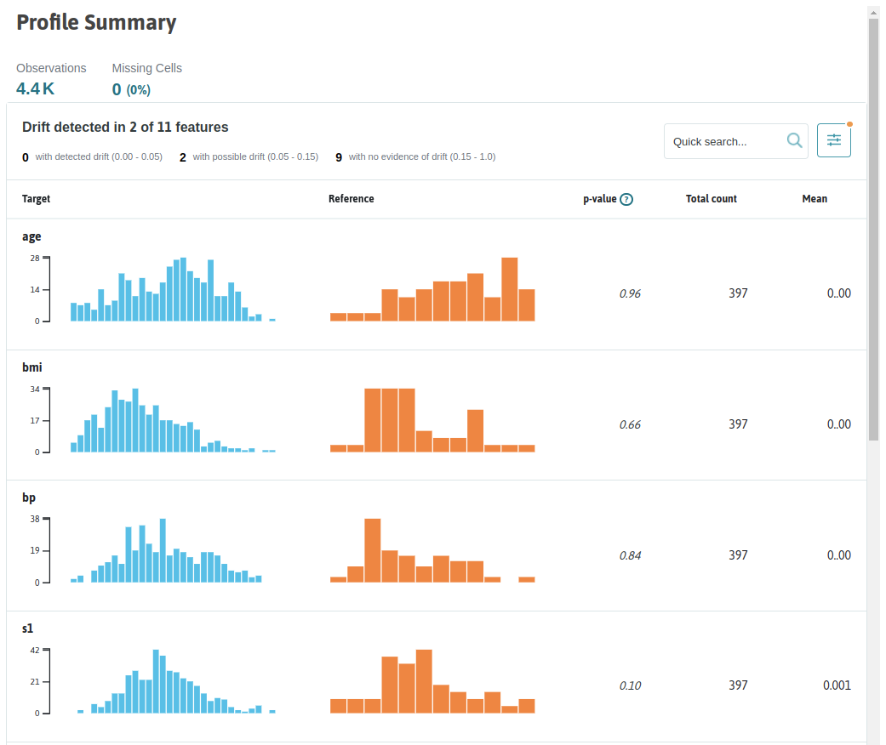
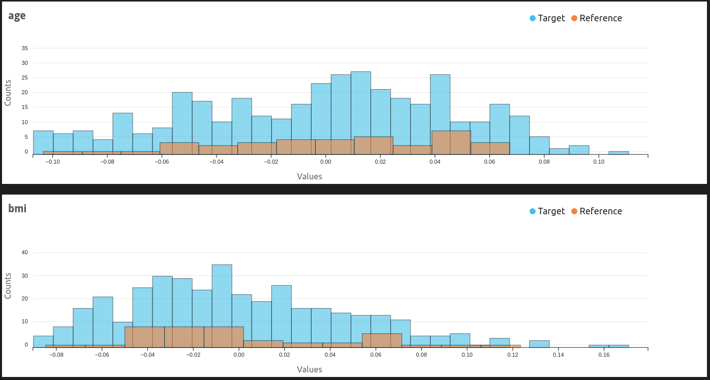


This is an older version of the ZenML documentation. To read and view the latest version please [visit this up-to-date URL](https://docs.zenml.io).



The whylogs/WhyLabs [Data Validator](./data-validators.md)
flavor provided with the ZenML integration uses [whylogs](https://whylabs.ai/whylogs)
and [WhyLabs](https://whylabs.ai) to generate and track data profiles, highly
accurate descriptive representations of your data. The profiles can be used to
implement automated corrective actions in your pipelines, or to render
interactive representations for further visual interpretation, evaluation and
documentation.

## When would you want to use it?

[Whylogs](https://whylabs.ai/whylogs) is an open-source library that analyzes
your data and creates statistical summaries called whylogs profiles. Whylogs
profiles can be processed in your pipelines and visualized locally or uploaded
to the [WhyLabs platform](https://whylabs.ai/), where more in depth analysis
can be carried out. Even though [whylogs also supports other data types](https://github.com/whylabs/whylogs#data-types),
the ZenML whylogs integration currently only works with tabular data in
`pandas.DataFrame` format.

You should use the whylogs/WhyLabs Data Validator when you need the following
data validation features that are possible with whylogs and WhyLabs:

* Data Quality: validate data quality in model inputs or in a data pipeline
* Data Drift: detect data drift in model input features
* Model Drift: Detect training-serving skew, concept drift, and model
performance degradation

You should consider one of the other [Data Validator flavors](./data-validators.md#data-validator-flavors)
if you need a different set of data validation features.

## How do you deploy it?

The whylogs Data Validator flavor is included in the whylogs ZenML
integration, you need to install it on your local machine to be able to register
a whylogs Data Validator and add it to your stack:

```shell
zenml integration install whylogs -y
```

If you don't need to connect to the WhyLabs platform to upload and store the
generated whylogs data profiles, the Data Validator stack component does not
require any configuration parameters. Adding it to a stack is as simple as
running e.g.:

```shell
# Register the whylogs data validator
zenml data-validator register whylogs_data_validator --flavor=whylogs

# Register and set a stack with the new data validator
zenml stack register custom_stack -dv whylogs_data_validator ... --set
```

Adding WhyLabs logging capabilities to your whylogs Data Validator is just
slightly more complicated, as you also require a [Secrets Manager](../secrets-managers/secrets-managers.md)
in your stack to store the sensitive WhyLabs authentication information in a
secure location. The WhyLabs credentials are configured as a ZenML secret that
is referenced in the Data Validator configuration, e.g.:

```shell
# Register the whylogs data validator
zenml data-validator register whylogs_data_validator --flavor=whylogs \
    --authentication_secret=whylabs_secret

# Register a secrets manager
zenml secrets-manager register secrets_manager \
    --flavor=<FLAVOR_OF_YOUR_CHOICE> ...

# Register and set a stack with the new data validator and secrets manager
zenml stack register custom_stack -dv whylogs_data_validator -x secrets_manager ... --set

# Create the secret referenced in the data validator
zenml secrets-manager secret register whylabs_secret -s whylogs \
    --whylabs_default_org_id=<YOUR-WHYLOGS-ORGANIZATION-ID> \
    --whylabs_api_key=<YOUR-WHYLOGS-API-KEY>
```

You'll also need to enable whylabs logging for your custom pipeline steps if
you want to upload the whylogs data profiles that they return as artifacts
to the WhyLabs platform. This is enabled by default for the standard whylogs 
step.

## How do you use it?

Whylogs's profiling functions take in a `pandas.DataFrame` dataset generate
a `DatasetProfileView` object containing all the relevant information extracted
from the dataset.

There are three ways you can use whylogs in your ZenML pipelines that allow
different levels of flexibility:

* instantiate, configure and insert [the standard `WhylogsProfilerStep`](#the-whylogs-standard-step)
shipped with ZenML into your pipelines. This is the easiest way and the
recommended approach, but can only be customized through the supported step
configuration parameters.
* call the data validation methods provided by [the whylogs Data Validator](#the-whylogs-data-validator)
in your custom step implementation. This method allows for more flexibility
concerning what can happen in the pipeline step, but you are still limited to the
functionality implemented in the Data Validator.
* [use the whylogs library directly](#call-whylogs-directly) in
your custom step implementation. This gives you complete freedom in how you are
using whylogs's features.

Outside the pipeline workflow, you can use [the ZenML whylogs visualizer](#the-whylogs-zenml-visualizer)
to display the whylogs dashboards generated by your pipelines. 

### The whylogs standard step

ZenML wraps the whylogs/WhyLabs functionality in the form of a standard
`WhylogsProfilerStep` step. The only field in the step config is a
`dataset_timestamp` attribute which is only relevant when you upload the
profiles to WhyLabs that uses this field to group and merge together profiles
belonging to the same dataset. The helper function `whylogs_profiler_step`
used to create an instance of this standard step takes in an optional
`dataset_id` parameter that is also used only in the context of WhyLabs
upload to identify the model in the context of which the profile is uploaded, 
e.g.:

```python
from zenml.integrations.whylogs.steps import (
    WhylogsProfilerParameters,
    whylogs_profiler_step,
)

train_data_profiler = whylogs_profiler_step(
    step_name="train_data_profiler",
    params=WhylogsProfilerParameters(),
    dataset_id="model-2",
)
test_data_profiler = whylogs_profiler_step(
    step_name="test_data_profiler",
    params=WhylogsProfilerParameters(),
    dataset_id="model-3",
)
```

The step can then be inserted into your pipeline where it can take in a 
`pandas.DataFrame` dataset, e.g.:

```python
from zenml.pipelines import pipeline

@pipeline
def data_profiling_pipeline(
    data_loader,
    data_splitter,
    train_data_profiler,
    test_data_profiler,
):
    data, _ = data_loader()
    train, test = data_splitter(data)
    train_data_profiler(train)
    test_data_profiler(test)

p = data_profiling_pipeline(
    data_loader=data_loader(),
    data_splitter=data_splitter(),
    train_data_profiler=train_data_profiler,
    test_data_profiler=test_data_profiler,
)

p.run()
```

As can be seen from the [step definition](https://apidocs.zenml.io/latest/api_docs/integration_code_docs/integrations-whylogs/#zenml.integrations.whylogs.steps.whylogs_profiler.WhylogsProfilerStep),
the step takes in a dataset and returns a whylogs `DatasetProfileView` object:

```python
class WhylogsProfilerStep(BaseAnalyzerStep):
    """Generates a whylogs data profile from a given pd.DataFrame."""

    @staticmethod
    def entrypoint(  # type: ignore[override]
        dataset: pd.DataFrame,
        params: WhylogsProfilerParameters,
    ) -> DatasetProfileView:
        ...
```

You should consult [the official whylogs documentation](https://whylogs.readthedocs.io/en/latest/index.html)
for more information on what you can do with the collected profiles.

You can view [the complete list of configuration parameters](https://apidocs.zenml.io/latest/api_docs/integration_code_docs/integrations-whylogs/#zenml.integrations.whylogs.steps.whylogs_profiler.WhylogsProfilerConfig) in the API
docs.

You can also check out our examples pages for working examples that use the
whylogs standard step:

- [Data Profiling with whylogs](https://github.com/zenml-io/zenml/tree/main/examples/whylogs_data_profiling)

### The whylogs Data Validator

The whylogs Data Validator implements the same interface as do all Data
Validators, so this method forces you to maintain some level of compatibility
with the overall Data Validator abstraction, which guarantees an easier
migration in case you decide to switch to another Data Validator.

All you have to do is call the whylogs Data Validator methods when you need
to interact with whylogs to generate data profiles. You may optionally enable
whylabs logging to automatically upload the returned whylogs
profile to WhyLabs, e.g.:

```python

import pandas as pd
from whylogs.core import DatasetProfileView
from zenml.integrations.whylogs.data_validators.whylogs_data_validator import (
    WhylogsDataValidator,
)
from zenml.integrations.whylogs.flavors.whylogs_data_validator_flavor import (
    WhylogsDataValidatorSettings,
)
from zenml.steps import step

whylogs_settings = WhylogsDataValidatorSettings(
    enable_whylabs=True, dataset_id="<WHYLABS_DATASET_ID>"
)

@step(
    settings = {
        "data_validator.whylogs": whylogs_settings
    }
)
def data_profiler(
    dataset: pd.DataFrame,
) -> DatasetProfileView:
    """Custom data profiler step with whylogs

    Args:
        dataset: a Pandas DataFrame

    Returns:
        Whylogs profile generated for the data
    """

    # validation pre-processing (e.g. dataset preparation) can take place here

    data_validator = WhylogsDataValidator.get_active_data_validator()
    profile = data_validator.data_profiling(
        dataset,
    )
    # optionally upload the profile to WhyLabs, if WhyLabs credentials are configured
    data_validator.upload_profile_view(profile)

    # validation post-processing (e.g. interpret results, take actions) can happen here

    return profile
```

Have a look at [the complete list of methods and parameters available in the `WhylogsDataValidator` API](https://apidocs.zenml.io/latest/api_docs/integration_code_docs/integrations-whylogs/#zenml.integrations.whylogs.data_validators.whylogs_data_validator.WhylogsDataValidator) in the API docs.

### Call whylogs directly

You can use the whylogs library directly in your custom pipeline steps, and
only leverage ZenML's capability of serializing, versioning and storing the
`DatasetProfileView` objects in its Artifact Store. You may optionally enable
whylabs logging to automatically upload the returned whylogs profile to WhyLabs, e.g.:

```python

import pandas as pd
from whylogs.core import DatasetProfileView
import whylogs as why
from zenml.steps import step
from zenml.integrations.whylogs.flavors.whylogs_data_validator_flavor import (
    WhylogsDataValidatorSettings,
)

whylogs_settings = WhylogsDataValidatorSettings(
    enable_whylabs=True, dataset_id="<WHYLABS_DATASET_ID>"
)

@step(
    settings = {
        "data_validator.whylogs": whylogs_settings
    }
)
def data_profiler(
    dataset: pd.DataFrame,
) -> DatasetProfileView:
    """Custom data profiler step with whylogs

    Args:
        dataset: a Pandas DataFrame

    Returns:
        Whylogs Profile generated for the dataset
    """

    # validation pre-processing (e.g. dataset preparation) can take place here

    results = why.log(dataset)
    profile = results.profile()

    # validation post-processing (e.g. interpret results, take actions) can happen here

    return profile.view()
```

### Using the whylogs ZenML Visualizer

In the [post-execution workflow](../../starter-guide/pipelines/fetching-pipelines.md),
you can load and render the whylogs profiles generated and returned by your
pipeline steps by means of the ZenML whylogs Visualizer. The visualizer can
take in a single step view, or two separate step views. In the first case,
a visualization of a single data profile is rendered, in the second you will
get a data drift report, e.g.:

```python
from zenml.integrations.whylogs.visualizers import WhylogsVisualizer
from zenml.post_execution import get_pipeline

def visualize_statistics(
    step_name: str, reference_step_name: Optional[str] = None
) -> None:
    """Helper function to visualize whylogs statistics from step artifacts.

    Args:
        step_name: step that generated and returned a whylogs profile
        reference_step_name: an optional second step that generated a whylogs
            profile to use for data drift visualization where two whylogs
            profiles are required.
    """
    pipe = get_pipeline(pipeline="data_profiling_pipeline")
    whylogs_step = pipe.runs[-1].get_step(step=step_name)
    whylogs_reference_step = None
    if reference_step_name:
        whylogs_reference_step = pipe.runs[-1].get_step(
            name=reference_step_name
        )

    WhylogsVisualizer().visualize(
        whylogs_step,
        reference_step_view=whylogs_reference_step,
    )

if __name__ == "__main__":
    visualize_statistics("data_loader")
    visualize_statistics("train_data_profiler", "test_data_profiler")
```

The whylogs profile will be displayed as a new tab in your browser, or rendered
inline in your Jupyter notebook, depending on where you are running the code:



