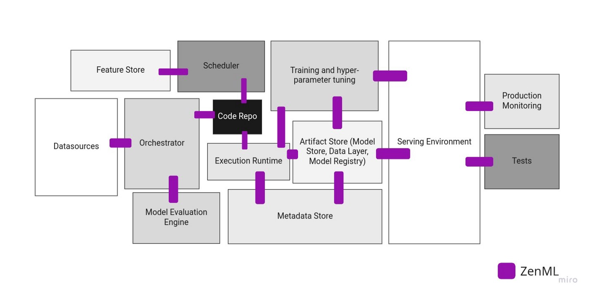


This is an older version of the ZenML documentation. To read and view the latest version please [visit this up-to-date URL](https://docs.zenml.io).



# 📜 Overview

If you are new to the world of MLOps, it is often daunting to be immediately faced with a sea of tools that seemingly all promise and do the same things. It is useful in this case to try to categorize tools in various groups in order to understand their value in your toolchain in a more precise manner.

ZenML tackles this problem by introducing the concept of [Stacks and Stack Components](../user-guide/production-guide/understand-stacks.md). These stack components represent categories, each of which has a particular function in your MLOps pipeline. ZenML realizes these stack components as base abstractions that standardize the entire workflow for your team. In order to then realize the benefit, one can write a concrete implementation of the [abstraction](../how-to/stack-deployment/implement-a-custom-stack-component.md), or use one of the many built-in [integrations](README.md) that implement these abstractions for you.

Here is a full list of all stack components currently supported in ZenML, with a description of the role of that component in the MLOps process:

| **Type of Stack Component**                                                         | **Description**                                                   |
| ----------------------------------------------------------------------------------- | ----------------------------------------------------------------- |
| [Orchestrator](orchestrators/orchestrators.md)              | Orchestrating the runs of your pipeline                           |
| [Artifact Store](artifact-stores/artifact-stores.md)          | Storage for the artifacts created by your pipelines               |
| [Container Registry](container-registries/container-registries.md) | Store for your containers                                         |
| [Data Validator](data-validators/data-validators.md)          | Data and model validation                                         |
| [Experiment Tracker](experiment-trackers/experiment-trackers.md)  | Tracking your ML experiments                                      |
| [Model Deployer](model-deployers/model-deployers.md)          | Services/platforms responsible for online model serving           |
| [Step Operator](step-operators/step-operators.md)            | Execution of individual steps in specialized runtime environments |
| [Alerter](alerters/alerters.md)                        | Sending alerts through specified channels                         |
| [Image Builder](image-builders/image-builders.md)            | Builds container images.                                          |
| [Annotator](annotators/annotators.md)                    | Labeling and annotating data                                      |
| [Model Registry](model-registries/model-registries.md)         | Manage and interact with ML Models                                |
| [Feature Store](feature-stores/feature-stores.md)            | Management of your data/features                                  |

Each pipeline run that you execute with ZenML will require a **stack** and each **stack** will be required to include at least an orchestrator and an artifact store. Apart from these two, the other components are optional and to be added as your pipeline evolves in MLOps maturity.

## Writing custom component flavors

You can take control of how ZenML behaves by creating your own components. This is done by writing custom component `flavors`. To learn more, head over to [the general guide on writing component flavors](../how-to/stack-deployment/implement-a-custom-stack-component.md), or read more specialized guides for specific component types (e.g. the [custom orchestrator guide](orchestrators/custom.md)).

## Integrations

Categorizing the MLOps stack is a good way to write abstractions for an MLOps pipeline and standardize your processes. But ZenML goes further and also provides concrete implementations of these categories by **integrating** with various tools for each category. Once code is organized into a ZenML pipeline, you can supercharge your ML workflows with the best-in-class solutions from various MLOps areas.

For example, you can orchestrate your ML pipeline workflows using [Airflow](orchestrators/airflow.md) or [Kubeflow](orchestrators/kubeflow.md), track experiments using [MLflow Tracking](experiment-trackers/mlflow.md) or [Weights & Biases](experiment-trackers/wandb.md), and transition seamlessly from a local [MLflow deployment](model-deployers/mlflow.md) to a deployed model on Kubernetes using [Seldon Core](model-deployers/seldon.md).

There are lots of moving parts for all the MLOps tooling and infrastructure you require for ML in production and ZenML brings them all together and enables you to manage them in one place. This also allows you to delay the decision of which MLOps tool to use in your stack as you have no vendor lock-in with ZenML and can easily switch out tools as soon as your requirements change.



### Available integrations

We have a [dedicated webpage](https://zenml.io/integrations) that indexes all supported ZenML integrations and their categories.

Another easy way of seeing a list of integrations is to see the list of directories in the [integrations directory](https://github.com/zenml-io/zenml/tree/main/src/zenml/integrations) on our GitHub.

### Installing ZenML integrations

Before you can use integrations, you first need to install them using `zenml integration install`, e.g., you can install [Kubeflow](orchestrators/kubeflow.md), [MLflow Tracking](experiment-trackers/mlflow.md), and [Seldon Core](model-deployers/seldon.md), using:

```
zenml integration install kubeflow mlflow seldon -y
```

Under the hood, this simply installs the preferred versions of all integrations using pip, i.e., it executes in a sub-process call:

```
pip install kubeflow==<PREFERRED_VERSION> mlflow==<PREFERRED_VERSION> seldon==<PREFERRED_VERSION>
```


* The `-y` flag confirms all `pip install` commands without asking you for

You can run `zenml integration --help` to see a full list of CLI commands that ZenML provides for interacting with integrations.


Note, that you can also install your dependencies directly, but please note that there is no guarantee that ZenML internals with work with any arbitrary version of any external library.

#### Experimental: Use `uv` for package installation

You can use [`uv`](https://github.com/astral-sh/uv) as a package manager if you want. Simply pass the `--uv` flag to the `zenml integration ...` command and it'll use `uv` for installation, upgrades and uninstallations. Note that `uv` must be installed for this to work. This is an experimental option that we've added for users wishing to use `uv` but given that it is relatively new as an option there might be certain packages that don't work well with `uv`. We will monitor how this performs and update as `uv` becomes more stable.

### Upgrade ZenML integrations

You can upgrade all integrations to their latest possible version using:

```bash
zenml integration upgrade mlflow pytorch -y
```


* The `-y` flag confirms all `pip install --upgrade` commands without asking you for confirmation.
* If no integrations are specified, all installed integrations will be upgraded.


### Help us with integrations!

There are countless tools in the ML / MLOps field. We have made an initial prioritization of which tools to support with integrations that are visible on our public [roadmap](https://zenml.io/roadmap).

We also welcome community contributions. Check our [Contribution Guide](https://github.com/zenml-io/zenml/blob/main/CONTRIBUTING.md) and [External Integration Guide](https://github.com/zenml-io/zenml/blob/main/src/zenml/integrations/README.md) for more details on how to best contribute to new integrations.

<figure><figcaption></figcaption></figure>
