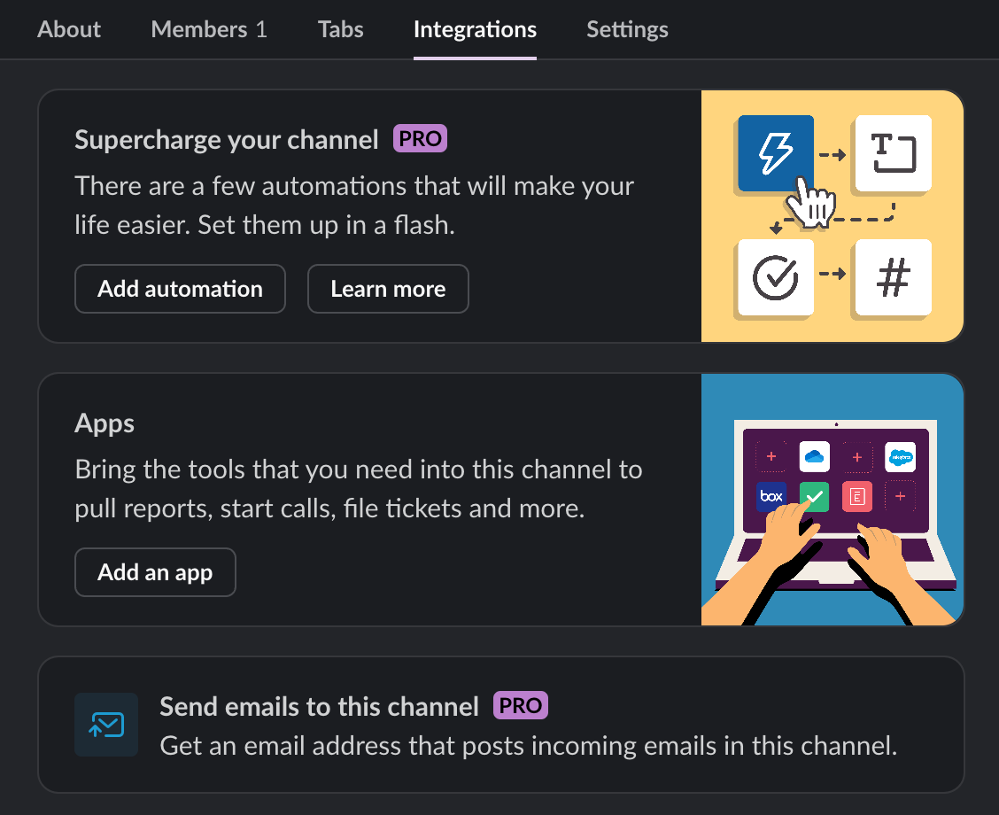

# Slack Alerter

The `SlackAlerter` enables you to send messages or ask questions within a 
dedicated Slack channel directly from within your ZenML pipelines and steps.

## How to Create

### Set up a Slack app

In order to use the `SlackAlerter`, you first need to have a Slack workspace 
set up with a channel that you want your pipelines to post to.

Then, you need to [create a Slack App](https://api.slack.com/apps?new\_app=1) 
with a bot in your workspace. Make sure to give it the following permissions in 
the `OAuth & Permissions` tab under `Scopes`:

* `chat:write`,
* `channels:read`
* `channels:history`


In order to be able to use the `ask()` functionality, you need to invite the app 
to your channel. You can either use the `/invite` command directly in the 
desired channel or add it through the channel settings:




It might take some time for your app to register within your workspace and 
show up in the available list of applications.


### Registering a Slack Alerter in ZenML

To create a `SlackAlerter`, you first need to install ZenML's `slack` 
integration:

```shell
zenml integration install slack -y
```

Once the integration is installed, you can use the ZenML CLI to create a 
secret and register an alerter linked to the app you just created:

```shell
zenml secret create slack_token --oauth_token=<SLACK_TOKEN>
zenml alerter register slack_alerter \
    --flavor=slack \
    --slack_token={{slack_token.oauth_token}} \
    --slack_channel_id=<SLACK_CHANNEL_ID>
```

Here is where you can find the required parameters:

* `<SLACK_CHANNEL_ID>`: The channel ID can be found in the channel details.
It starts with `C....`.
* `<SLACK_TOKEN>`: This is the Slack token of your bot. You can find it in the 
Slack app settings under `OAuth & Permissions`.


After you have registered the `slack_alerter`, you can add it to your stack 
like this:

```shell
zenml stack register ... -al slack_alerter --set
```

## How to Use

In ZenML, you can use alerters in various ways.

### Use the `post()` and `ask()` directly

You can use the client to fetch the active alerter within your stack and 
use the `post` and `ask` methods directly:

```python
from zenml import pipeline, step
from zenml.client import Client


@step
def post_statement() -> None:
    Client().active_stack.alerter.post("Step finished!")

@step
def ask_question() -> bool:
    return Client().active_stack.alerter.ask("Should I continue?")


@pipeline(enable_cache=False)
def my_pipeline():
    # Step using alerter.post
    post_statement()

    # Step using alerter.ask
    ask_question()


if __name__ == "__main__":
    my_pipeline()
```


In case of an error, the output of the `ask()` method default to `False`.



### Use it with custom settings

The Slack alerter comes equipped with a set of options that you can set during 
runtime:

```python
from zenml import pipeline, step
from zenml.client import Client


# E.g, You can use a different channel ID through the settings. However, if you 
# want to use the `ask` functionality, make sure that you app is invited to 
# this channel first.
@step(settings={"alerter": {"slack_channel_id": <SLACK_CHANNEL_ID>}})
def post_statement() -> None:
    alerter = Client().active_stack.alerter
    alerter.post("Posting to another channel!")


@pipeline(enable_cache=False)
def my_pipeline():
    # Using alerter.post
    post_statement()


if __name__ == "__main__":
    my_pipeline()
```

## Use it with `SlackAlerterParameters` and `SlackAlerterPayload`

You can use these additional classes to further edit your messages:

```python
from zenml import pipeline, step, get_step_context
from zenml.client import Client
from zenml.integrations.slack.alerters.slack_alerter import (
    SlackAlerterParameters, SlackAlerterPayload
)


# Displaying pipeline info
@step
def post_statement() -> None:
    params = SlackAlerterParameters(
        payload=SlackAlerterPayload(
            pipeline_name=get_step_context().pipeline.name,
            step_name=get_step_context().step_run.name,
            stack_name=Client().active_stack.name,

        ),

    )
    Client().active_stack.alerter.post(
        message="This is a message with additional information about your pipeline.",
        params=params
    )


# Formatting with blocks
@step
def ask_question() -> bool:
    message = ":tada: Should I continue? (Y/N)"
    my_custom_block = [
        {
            "type": "header",
            "text": {
                "type": "plain_text",
                "text": message,
                "emoji": True
            }
        }
    ]
    params = SlackAlerterParameters(
        blocks=my_custom_block,
        approve_msg_options=["Y"],
        disapprove_msg_options=["N"],

    )
    return Client().active_stack.alerter.ask(question=message, params=params)


@pipeline(enable_cache=False)
def my_pipeline():
    post_statement()
    ask_question()


if __name__ == "__main__":
    my_pipeline()
```

### Use the predefined steps

If you want to only use it in a simple manner, you can also use the steps 
`slack_alerter_post_step` and `slack_alerter_ask_step`, that are built-in to 
the Slack integration of ZenML:

```python
from zenml import pipeline
from zenml.integrations.slack.steps.slack_alerter_post_step import (
    slack_alerter_post_step
)
from zenml.integrations.slack.steps.slack_alerter_ask_step import (
    slack_alerter_ask_step,
)


@pipeline(enable_cache=False)
def my_pipeline():
    slack_alerter_post_step("Posting a statement.")
    slack_alerter_ask_step("Asking a question. Should I continue?")


if __name__ == "__main__":
    my_pipeline()
```

For more information and a full list of configurable attributes of the Slack 
alerter, check out the [SDK Docs](https://sdkdocs.zenml.io/latest/integration_code_docs/integrations-slack.html#zenml.integrations.slack) .

<figure><figcaption></figcaption></figure>
