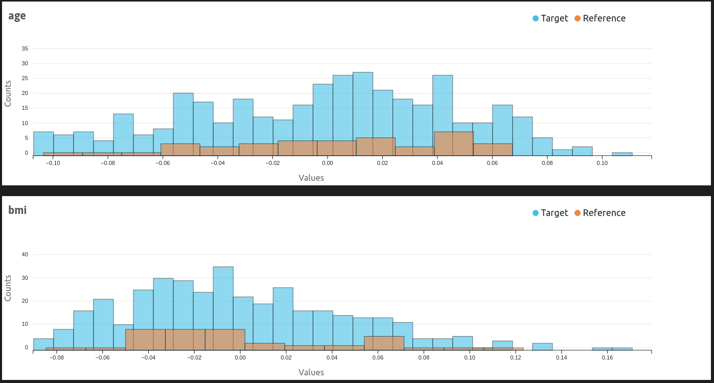

# Whylogs

The whylogs/WhyLabs [Data Validator](./data-validators.md) flavor provided with the ZenML integration uses [whylogs](https://whylabs.ai/whylogs) and [WhyLabs](https://whylabs.ai) to generate and track data profiles, highly accurate descriptive representations of your data. The profiles can be used to implement automated corrective actions in your pipelines, or to render interactive representations for further visual interpretation, evaluation and documentation.

### When would you want to use it?

[Whylogs](https://whylabs.ai/whylogs) is an open-source library that analyzes your data and creates statistical summaries called whylogs profiles. Whylogs profiles can be processed in your pipelines and visualized locally or uploaded to the [WhyLabs platform](https://whylabs.ai/), where more in depth analysis can be carried out. Even though [whylogs also supports other data types](https://github.com/whylabs/whylogs#data-types), the ZenML whylogs integration currently only works with tabular data in `pandas.DataFrame` format.

You should use the whylogs/WhyLabs Data Validator when you need the following data validation features that are possible with whylogs and WhyLabs:

* Data Quality: validate data quality in model inputs or in a data pipeline
* Data Drift: detect data drift in model input features
* Model Drift: Detect training-serving skew, concept drift, and model performance degradation

You should consider one of the other [Data Validator flavors](./data-validators.md#data-validator-flavors) if you need a different set of data validation features.

### How do you deploy it?

The whylogs Data Validator flavor is included in the whylogs ZenML integration, you need to install it on your local machine to be able to register a whylogs Data Validator and add it to your stack:

```shell
zenml integration install whylogs -y
```

If you don't need to connect to the WhyLabs platform to upload and store the generated whylogs data profiles, the Data Validator stack component does not require any configuration parameters. Adding it to a stack is as simple as running e.g.:

```shell
# Register the whylogs data validator
zenml data-validator register whylogs_data_validator --flavor=whylogs

# Register and set a stack with the new data validator
zenml stack register custom_stack -dv whylogs_data_validator ... --set
```

Adding WhyLabs logging capabilities to your whylogs Data Validator is just slightly more complicated, as you also need to create a [ZenML Secret](../../getting-started/deploying-zenml/secret-management.md) to store the sensitive WhyLabs authentication information in a secure location and then reference the secret in the Data Validator configuration. To generate a WhyLabs access token, you can follow [the official WhyLabs instructions documented here](https://docs.whylabs.ai/docs/whylabs-api/#creating-an-api-token) .

Then, you can register the whylogs Data Validator with WhyLabs logging capabilities as follows:

```shell
# Create the secret referenced in the data validator
zenml secret create whylabs_secret \
    --whylabs_default_org_id=<YOUR-WHYLOGS-ORGANIZATION-ID> \
    --whylabs_api_key=<YOUR-WHYLOGS-API-KEY>

# Register the whylogs data validator
zenml data-validator register whylogs_data_validator --flavor=whylogs \
    --authentication_secret=whylabs_secret
```

You'll also need to enable whylabs logging for your custom pipeline steps if you want to upload the whylogs data profiles that they return as artifacts to the WhyLabs platform. This is enabled by default for the standard whylogs step. For custom steps, you can enable WhyLabs logging by setting the `upload_to_whylabs` parameter to `True` in the step configuration, e.g.:

```python
from typing_extensions import Annotated  # or `from typing import Annotated on Python 3.9+
from typing import Tuple
import pandas as pd
import whylogs as why
from sklearn import datasets
from whylogs.core import DatasetProfileView

from zenml.integrations.whylogs.flavors.whylogs_data_validator_flavor import (
    WhylogsDataValidatorSettings,
)
from zenml import step


@step(
    settings={
        "data_validator": WhylogsDataValidatorSettings(
            enable_whylabs=True, dataset_id="model-1"
        )
    }
)
def data_loader() -> Tuple[
    Annotated[pd.DataFrame, "data"],
    Annotated[DatasetProfileView, "profile"]
]:
    """Load the diabetes dataset."""
    X, y = datasets.load_diabetes(return_X_y=True, as_frame=True)

    # merge X and y together
    df = pd.merge(X, y, left_index=True, right_index=True)

    profile = why.log(pandas=df).profile().view()
    return df, profile
```

### How do you use it?

Whylogs's profiling functions take in a `pandas.DataFrame` dataset generate a `DatasetProfileView` object containing all the relevant information extracted from the dataset.

There are three ways you can use whylogs in your ZenML pipelines that allow different levels of flexibility:

* instantiate, configure and insert [the standard `WhylogsProfilerStep`](whylogs.md#the-whylogs-standard-step) shipped with ZenML into your pipelines. This is the easiest way and the recommended approach, but can only be customized through the supported step configuration parameters.
* call the data validation methods provided by [the whylogs Data Validator](whylogs.md#the-whylogs-data-validator) in your custom step implementation. This method allows for more flexibility concerning what can happen in the pipeline step, but you are still limited to the functionality implemented in the Data Validator.
* [use the whylogs library directly](whylogs.md#call-whylogs-directly) in your custom step implementation. This gives you complete freedom in how you are using whylogs's features.

You can [visualize whylogs profiles](whylogs.md#visualizing-whylogs-profiles) in Jupyter notebooks or view them directly in the ZenML dashboard.

#### The whylogs standard step

ZenML wraps the whylogs/WhyLabs functionality in the form of a standard `WhylogsProfilerStep` step. The only field in the step config is a `dataset_timestamp` attribute which is only relevant when you upload the profiles to WhyLabs that uses this field to group and merge together profiles belonging to the same dataset. The helper function `get_whylogs_profiler_step` used to create an instance of this standard step takes in an optional `dataset_id` parameter that is also used only in the context of WhyLabs upload to identify the model in the context of which the profile is uploaded, e.g.:

```python
from zenml.integrations.whylogs.steps import get_whylogs_profiler_step


train_data_profiler = get_whylogs_profiler_step(dataset_id="model-2")
test_data_profiler = get_whylogs_profiler_step(dataset_id="model-3")
```

The step can then be inserted into your pipeline where it can take in a `pandas.DataFrame` dataset, e.g.:

```python
from zenml import pipeline

@pipeline
def data_profiling_pipeline():
    data, _ = data_loader()
    train, test = data_splitter(data)
    train_data_profiler(train)
    test_data_profiler(test)
    

data_profiling_pipeline()
```

As can be seen from the [step definition](https://sdkdocs.zenml.io/latest/integration\_code\_docs/integrations-whylogs/#zenml.integrations.whylogs.steps.whylogs\_profiler.whylogs\_profiler\_step) , the step takes in a dataset and returns a whylogs `DatasetProfileView` object:

```python
@step
def whylogs_profiler_step(
    dataset: pd.DataFrame,
    dataset_timestamp: Optional[datetime.datetime] = None,
) -> DatasetProfileView:
    ...
```

You should consult [the official whylogs documentation](https://whylogs.readthedocs.io/en/latest/index.html) for more information on what you can do with the collected profiles.

You can view [the complete list of configuration parameters](https://sdkdocs.zenml.io/latest/integration\_code\_docs/integrations-whylogs/#zenml.integrations.whylogs.steps.whylogs\_profiler.WhylogsProfilerConfig) in the SDK docs.

#### The whylogs Data Validator

The whylogs Data Validator implements the same interface as do all Data Validators, so this method forces you to maintain some level of compatibility with the overall Data Validator abstraction, which guarantees an easier migration in case you decide to switch to another Data Validator.

All you have to do is call the whylogs Data Validator methods when you need to interact with whylogs to generate data profiles. You may optionally enable whylabs logging to automatically upload the returned whylogs profile to WhyLabs, e.g.:

```python

import pandas as pd
from whylogs.core import DatasetProfileView
from zenml.integrations.whylogs.data_validators.whylogs_data_validator import (
    WhylogsDataValidator,
)
from zenml.integrations.whylogs.flavors.whylogs_data_validator_flavor import (
    WhylogsDataValidatorSettings,
)
from zenml import step

whylogs_settings = WhylogsDataValidatorSettings(
    enable_whylabs=True, dataset_id="<WHYLABS_DATASET_ID>"
)


@step(
    settings={
        "data_validator": whylogs_settings
    }
)
def data_profiler(
        dataset: pd.DataFrame,
) -> DatasetProfileView:
    """Custom data profiler step with whylogs

    Args:
        dataset: a Pandas DataFrame

    Returns:
        Whylogs profile generated for the data
    """

    # validation pre-processing (e.g. dataset preparation) can take place here

    data_validator = WhylogsDataValidator.get_active_data_validator()
    profile = data_validator.data_profiling(
        dataset,
    )
    # optionally upload the profile to WhyLabs, if WhyLabs credentials are configured
    data_validator.upload_profile_view(profile)

    # validation post-processing (e.g. interpret results, take actions) can happen here

    return profile
```

Have a look at [the complete list of methods and parameters available in the `WhylogsDataValidator` API](https://sdkdocs.zenml.io/latest/integration\_code\_docs/integrations-whylogs/#zenml.integrations.whylogs.data\_validators.whylogs\_data\_validator.WhylogsDataValidator) in the SDK docs.

#### Call whylogs directly

You can use the whylogs library directly in your custom pipeline steps, and only leverage ZenML's capability of serializing, versioning and storing the `DatasetProfileView` objects in its Artifact Store. You may optionally enable whylabs logging to automatically upload the returned whylogs profile to WhyLabs, e.g.:

```python

import pandas as pd
from whylogs.core import DatasetProfileView
import whylogs as why
from zenml import step
from zenml.integrations.whylogs.flavors.whylogs_data_validator_flavor import (
    WhylogsDataValidatorSettings,
)

whylogs_settings = WhylogsDataValidatorSettings(
    enable_whylabs=True, dataset_id="<WHYLABS_DATASET_ID>"
)


@step(
    settings={
        "data_validator": whylogs_settings
    }
)
def data_profiler(
        dataset: pd.DataFrame,
) -> DatasetProfileView:
    """Custom data profiler step with whylogs

    Args:
        dataset: a Pandas DataFrame

    Returns:
        Whylogs Profile generated for the dataset
    """

    # validation pre-processing (e.g. dataset preparation) can take place here

    results = why.log(dataset)
    profile = results.profile()

    # validation post-processing (e.g. interpret results, take actions) can happen here

    return profile.view()
```

### Visualizing whylogs Profiles

You can view visualizations of the whylogs profiles generated by your pipeline steps directly in the ZenML dashboard by clicking on the respective artifact in the pipeline run DAG.

Alternatively, if you are running inside a Jupyter notebook, you can load and render the whylogs profiles using the [artifact.visualize() method](../../how-to/visualize-artifacts/README.md), e.g.:

```python
from zenml.client import Client


def visualize_statistics(
    step_name: str, reference_step_name: Optional[str] = None
) -> None:
    """Helper function to visualize whylogs statistics from step artifacts.

    Args:
        step_name: step that generated and returned a whylogs profile
        reference_step_name: an optional second step that generated a whylogs
            profile to use for data drift visualization where two whylogs
            profiles are required.
    """
    pipe = Client().get_pipeline(pipeline="data_profiling_pipeline")
    whylogs_step = pipe.last_run.steps[step_name]
    whylogs_step.visualize()


if __name__ == "__main__":
    visualize_statistics("data_loader")
    visualize_statistics("train_data_profiler", "test_data_profiler")
```




<figure><figcaption></figcaption></figure>
