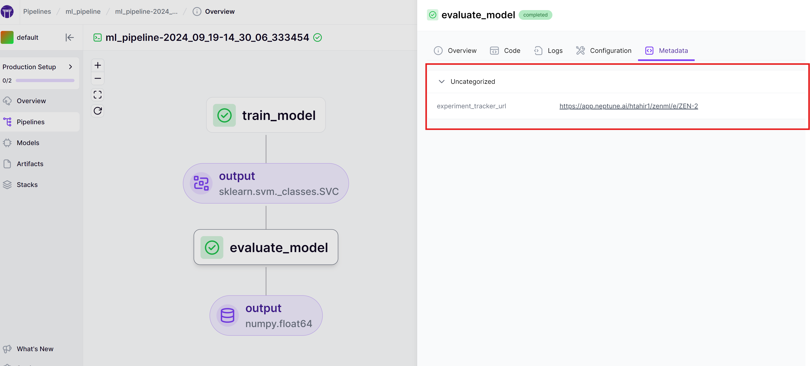
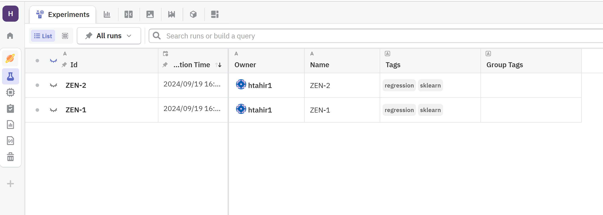
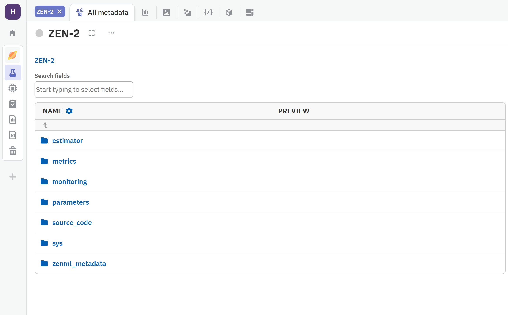

# Neptune

The Neptune Experiment Tracker is an [Experiment Tracker](./experiment-trackers.md) flavor provided with the Neptune-ZenML integration that uses [neptune.ai](https://neptune.ai/product/experiment-tracking) to log and visualize information from your pipeline steps (e.g. models, parameters, metrics).

### When would you want to use it?

[Neptune](https://neptune.ai/product/experiment-tracking) is a popular tool that you would normally use in the iterative ML experimentation phase to track and visualize experiment results or as a model registry for your production-ready models. Neptune can also track and visualize the results produced by your automated pipeline runs, as you make the transition towards a more production-oriented workflow.

You should use the Neptune Experiment Tracker:

* if you have already been using neptune.ai to track experiment results for your project and would like to continue doing so as you are incorporating MLOps workflows and best practices in your project through ZenML.
* if you are looking for a more visually interactive way of navigating the results produced from your ZenML pipeline runs (e.g. models, metrics, datasets)
* if you would like to connect ZenML to neptune.ai to share the artifacts and metrics logged by your pipelines with your team, organization, or external stakeholders

You should consider one of the other [Experiment Tracker flavors](./experiment-trackers.md#experiment-tracker-flavors) if you have never worked with neptune.ai before and would rather use another experiment tracking tool that you are more familiar with.

### How do you deploy it?

The Neptune Experiment Tracker flavor is provided by the Neptune-ZenML integration. You need to install it on your local machine to be able to register the Neptune Experiment Tracker and add it to your stack:

```shell
zenml integration install neptune -y
```

The Neptune Experiment Tracker needs to be configured with the credentials required to connect to Neptune using an API token.

### Authentication Methods

You need to configure the following credentials for authentication to Neptune:

* `api_token`: [API key token](https://docs.neptune.ai/setup/setting_api_token) of your Neptune account. You can create a free Neptune account [here](https://app.neptune.ai/register). If left blank, Neptune will attempt to retrieve the token from your environment variables.
* `project`: The name of the project where you're sending the new run, in the form "workspace-name/project-name". If the project is not specified, Neptune will attempt to retrieve it from your environment variables.



This method requires you to [configure a ZenML secret](../../how-to/project-setup-and-management/interact-with-secrets.md) to store the Neptune tracking service credentials securely.

You can create the secret using the `zenml secret create` command:

```shell
zenml secret create neptune_secret --api_token=<API_TOKEN>
```

Once the secret is created, you can use it to configure the `neptune` Experiment Tracker:

```shell
# Reference the project and api-token in our experiment tracker component
zenml experiment-tracker register neptune_experiment_tracker \
    --flavor=neptune \
    --project=<project_name> \
    --api_token={{neptune_secret.api_token}}
    ...


# Register and set a stack with the new experiment tracker
zenml stack register neptune_stack -e neptune_experiment_tracker ... --set
```


Read more about [ZenML Secrets](../../how-to/project-setup-and-management/interact-with-secrets.md) in the ZenML documentation.




This option configures the credentials for neptune.ai directly as stack component attributes.


This is not recommended for production settings as the credentials won't be stored securely and will be clearly visible in the stack configuration.


```shell
# Register the Neptune experiment tracker
zenml experiment-tracker register neptune_experiment_tracker --flavor=neptune \ 
    --project=<project_name> --api_token=<token>

# Register and set a stack with the new experiment tracker
zenml stack register neptune_stack -e neptune_experiment_tracker ... --set
```



For more, up-to-date information on the Neptune Experiment Tracker implementation and its configuration, you can have a look at [the SDK docs](https://sdkdocs.zenml.io/latest/integration_code_docs/integrations-neptune/#zenml.integrations.neptune.experiment_trackers.neptune_experiment_tracker) .

### How do you use it?

To log information from a ZenML pipeline step using the Neptune Experiment Tracker component in the active stack, you need to enable an experiment tracker using the `@step` decorator. Then fetch the [Neptune run object](https://docs.neptune.ai/api/run/) and use logging capabilities as you would normally do. For example:

```python
from zenml.integrations.neptune.experiment_trackers.run_state import (
    get_neptune_run
)
from neptune.utils import stringify_unsupported
from zenml import get_step_context
from sklearn.model_selection import train_test_split
from sklearn.svm import SVC
from sklearn.datasets import load_iris
from zenml import pipeline, step
from zenml.client import Client
from zenml.integrations.neptune.experiment_trackers import NeptuneExperimentTracker

# Get the experiment tracker from the active stack
experiment_tracker: NeptuneExperimentTracker = Client().active_stack.experiment_tracker

@step(experiment_tracker="neptune_experiment_tracker")
def train_model() -> SVC:
    iris = load_iris()
    X_train, _, y_train, _ = train_test_split(
        iris.data, iris.target, test_size=0.2, random_state=42
    )
    params = {
        "kernel": "rbf",
        "C": 1.0,
    }
    model = SVC(**params)
    
    model.fit(X_train, y_train)

    # Log the model to Neptune
    neptune_run = get_neptune_run()
    neptune_run["parameters"] = params

    return model
```


Instead of hardcoding an experiment tracker name, you can also use the [Client](../../reference/python-client.md) to dynamically use the experiment tracker of your active stack:

```python
from zenml.client import Client

experiment_tracker = Client().active_stack.experiment_tracker

@step(experiment_tracker=experiment_tracker.name)
def tf_trainer(...):
    ...
```


#### Logging ZenML pipeline and step metadata to the Neptune run

You can use the `get_step_context` method to log some ZenML metadata in your Neptune run:

```python
from zenml import get_step_context
from zenml.integrations.neptune.experiment_trackers.run_state import (
    get_neptune_run
)
from neptune.utils import stringify_unsupported

@step(experiment_tracker="neptune_tracker")
def my_step():
    neptune_run = get_neptune_run()
    context = get_step_context()

    neptune_run["pipeline_metadata"] = stringify_unsupported(
        context.pipeline_run.get_metadata().dict()
    )    
    neptune_run[f"step_metadata/{context.step_name}"] = stringify_unsupported(
        context.step_run.get_metadata().dict()
    )
    ...
```

#### Adding tags to your Neptune run

You can pass a set of tags to the Neptune run by using the `NeptuneExperimentTrackerSettings` class, like in the example below:

```python
import numpy as np

import tensorflow as tf

from zenml import step
from zenml.integrations.neptune.experiment_trackers.run_state import (
    get_neptune_run,
)
from zenml.integrations.neptune.flavors import NeptuneExperimentTrackerSettings

neptune_settings = NeptuneExperimentTrackerSettings(tags={"keras", "mnist"})


@step(
    experiment_tracker="<NEPTUNE_TRACKER_STACK_COMPONENT_NAME>",
    settings={
        "experiment_tracker": neptune_settings
    }
)
def my_step(
    x_test: np.ndarray,
    y_test: np.ndarray,
    model: tf.keras.Model,
) -> float:
    """Log metadata to Neptune run"""
    neptune_run = get_neptune_run()
    ...
```

Check out the [SDK docs](https://sdkdocs.zenml.io/latest/integration_code_docs/integrations-neptune/#zenml.integrations.neptune.flavors.neptune_experiment_tracker_flavor.NeptuneExperimentTrackerSettings) for a full list of available attributes

## Neptune UI

Neptune comes with a web-based UI that you can use to find further details about your tracked experiments. You can find the URL of the Neptune run linked to a specific ZenML run printed on the console whenever a Neptune run is initialized. You can also find it in the dashboard in the metadata tab of any step that has used the tracker:

<figure><figcaption><p>A pipeline with a Neptine run linked as metadata</p></figcaption></figure>

Each pipeline run will be logged as a separate experiment run in Neptune, which you can inspect in the Neptune UI.

<figure><figcaption><p>A list of Neptune runs from ZenML pipelines</p></figcaption></figure>

Clicking on one run will reveal further metadata logged within the step:

<figure><figcaption><p>Details of a Neptune run via a ZenML pipeline</p></figcaption></figure>

## Full Code Example

This section shows an end to end run with the ZenML Neptune integration.

<details>

<summary>Code Example of this Section</summary>

```python
from zenml.integrations.neptune.experiment_trackers.run_state import (
    get_neptune_run
)
from neptune.utils import stringify_unsupported
from zenml import get_step_context
from sklearn.model_selection import train_test_split
from sklearn.datasets import load_iris
from sklearn.svm import SVC
from sklearn.metrics import accuracy_score
from zenml import pipeline, step
from zenml.client import Client
from zenml.integrations.neptune.experiment_trackers import NeptuneExperimentTracker
import neptune.integrations.sklearn as npt_utils

# Get the experiment tracker from the active stack
experiment_tracker: NeptuneExperimentTracker = Client().active_stack.experiment_tracker


@step(experiment_tracker=experiment_tracker.name)
def train_model() -> SVC:
    iris = load_iris()
    X_train, _, y_train, _ = train_test_split(
        iris.data, iris.target, test_size=0.2, random_state=42
    )
    params = {
        "kernel": "rbf",
        "C": 1.0,
    }
    model = SVC(**params)
    
    model.fit(X_train, y_train)

    # Log parameters and model to Neptune
    neptune_run = get_neptune_run()
    neptune_run["parameters"] = params
    neptune_run["estimator/pickled-model"] = npt_utils.get_pickled_model(model)
    return model


@step(experiment_tracker=experiment_tracker.name)
def evaluate_model(model: SVC):
    iris = load_iris()
    _, X_test, _, y_test = train_test_split(
        iris.data, iris.target, test_size=0.2, random_state=42
    )
    y_pred = model.predict(X_test)
    accuracy = accuracy_score(y_test, y_pred)

    neptune_run = get_neptune_run()
    context = get_step_context()
    
    # Log metadata using Neptune
    neptune_run["zenml_metadata/pipeline_metadata"] = stringify_unsupported(
        context.pipeline_run.get_metadata().model_dump()
    )    
    neptune_run[f"zenml_metadata/{context.step_name}"] = stringify_unsupported(
        context.step_run.get_metadata().model_dump()
    )
    
    # Log accuracy metric to Neptune
    neptune_run["metrics/accuracy"] = accuracy

    return accuracy


@pipeline
def ml_pipeline():
    model = train_model()
    accuracy = evaluate_model(model)


if __name__ == "__main__":
    from zenml.integrations.neptune.flavors import NeptuneExperimentTrackerSettings

    neptune_settings = NeptuneExperimentTrackerSettings(
        tags={"regression", "sklearn"}
    )

    ml_pipeline.with_options(settings={"experiment_tracker": neptune_settings})()
```

</details>

## Further reading

Check [Neptune's docs](https://docs.neptune.ai/integrations/zenml/) for further information on how to use this integration and Neptune in general.

<figure><figcaption></figcaption></figure>
