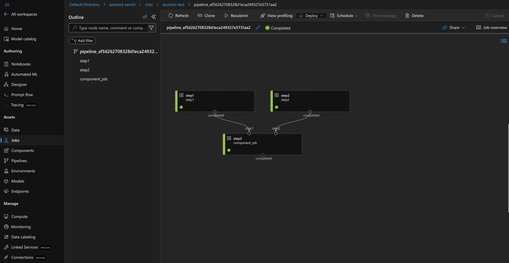

# AzureML Orchestrator

[AzureML](https://azure.microsoft.com/en-us/products/machine-learning) is a
cloud-based orchestration service provided by Microsoft, that enables 
data scientists, machine learning engineers, and developers to build, train, 
deploy, and manage machine learning models. It offers a comprehensive and 
integrated environment that supports the entire machine learning lifecycle, 
from data preparation and model development to deployment and monitoring.

## When to use it

You should use the AzureML orchestrator if:

* you're already using Azure.
* you're looking for a proven production-grade orchestrator.
* you're looking for a UI in which you can track your pipeline runs.
* you're looking for a managed solution for running your pipelines.

## How it works

The ZenML AzureML orchestrator implementation uses [the Python SDK v2 of 
AzureML](https://learn.microsoft.com/en-gb/python/api/overview/azure/ai-ml-readme?view=azure-python) 
to allow our users to build their Machine Learning pipelines. For each ZenML step,
it creates an AzureML `CommandComponent` and brings them together in a pipeline.

## How to deploy it


Would you like to skip ahead and deploy a full ZenML cloud stack already,
including an AzureML orchestrator? Check out the [in-browser stack deployment wizard](../../how-to/stack-deployment/deploy-a-cloud-stack.md),
the [stack registration wizard](../../how-to/stack-deployment/register-a-cloud-stack.md),
or [the ZenML Azure Terraform module](../../how-to/stack-deployment/deploy-a-cloud-stack-with-terraform.md)
for a shortcut on how to deploy & register this stack component.


In order to use an AzureML orchestrator, you need to first 
deploy [ZenML to the cloud](../../getting-started/deploying-zenml/README.md). 
It would be recommended to deploy ZenML in the same region as you plan on 
using for AzureML, but it is not necessary to do so. You must ensure that 
you are connected to the remote ZenML server before using this stack component.

## How to use it

In order to use the AzureML orchestrator, you need:

* The ZenML `azure` integration installed. If you haven't done so, run:

```shell
zenml integration install azure
```

* [Docker](https://www.docker.com) installed and running.
* A [remote artifact store](../artifact-stores/artifact-stores.md) as part of your stack.
* A [remote container registry](../container-registries/container-registries.md) as part of your stack.
* An [Azure resource group equipped with an AzureML workspace](https://learn.microsoft.com/en-us/azure/machine-learning/quickstart-create-resources?view=azureml-api-2) to run your pipeline on.

There are two ways of authenticating your orchestrator with AzureML:

1. **Default Authentication** simplifies the authentication process while 
developing your workflows that deploy to Azure by combining credentials used in 
Azure hosting environments and credentials used in local development.
2. **Service Principal Authentication (recommended)** is using the concept 
of service principals on Azure to allow you to connect your cloud components 
with proper authentication. For this method, you will need to [create a service 
principal on Azure](https://learn.microsoft.com/en-us/azure/developer/python/sdk/authentication-on-premises-apps?tabs=azure-portal), 
assign it the correct permissions and use it to [register a ZenML Azure Service 
Connector](https://docs.zenml.io/how-to/auth-management/azure-service-connector).
    ```bash
    zenml service-connector register <CONNECTOR_NAME> --type azure -i
    zenml orchestrator connect <ORCHESTRATOR_NAME> -c <CONNECTOR_NAME>
    ```

## Docker

For each pipeline run, ZenML will build a Docker image called 
`<CONTAINER_REGISTRY_URI>/zenml:<PIPELINE_NAME>` which includes your code 
and use it to run your pipeline steps in AzureML. Check out 
[this page](../../how-to/customize-docker-builds/README.md) if you want to 
learn more about how ZenML builds these images and how you can customize them.

## AzureML UI

Each AzureML workspace comes equipped with an Azure Machine Learning studio. 
Here you can inspect, manage, and debug your pipelines and steps.



Double-clicking any of the steps on this view will open up the overview page 
for that specific step. Here you can check the configuration of the component 
and its execution logs.

## Settings

The ZenML AzureML orchestrator comes with a dedicated class called 
`AzureMLOrchestratorSettings` for configuring its settings and it controls
the compute resources used for pipeline execution in AzureML.

Currently, it supports three different modes of operation.

### 1. Serverless Compute (Default)
- Set `mode` to `serverless`.
- Other parameters are ignored.

### 2. Compute Instance
- Set `mode` to `compute-instance`.
- Requires a `compute_name`.
  - If a compute instance with the same name exists, it uses the existing 
  compute instance and ignores other parameters.
  - If a compute instance with the same name doesn't exist, it creates a 
  new compute instance with the `compute_name`. For this process, you can 
  specify `compute_size` and `idle_type_before_shutdown_minutes`.

### 3. Compute Cluster
- Set `mode` to `compute-cluster`.
- Requires a `compute_name`.
  - If a compute cluster with the same name exists, it uses existing cluster, 
  ignores other parameters.
  - If a compute cluster with the same name doesn't exist, it creates a new 
  compute cluster. Additional parameters can be used for configuring this 
  process.

### Run pipelines on a schedule

The AzureML orchestrator supports running pipelines on a schedule using 
its `[JobSchedules](https://learn.microsoft.com/en-us/azure/templates/microsoft.automation/2023-11-01/automationaccounts/jobschedules?pivots=deployment-language-bicep)`. Both cron expression and intervals are supported.

```python
from zenml.config.schedule import Schedule

# Run a pipeline every 5th minute
pipeline.run(schedule=Schedule(cron_expression="*/5 * * * *"))
```

Once you run the pipeline with a schedule, you can find the schedule and 
the corresponding run under the `All Schedules` tab `Jobs` in the jobs page
on AzureML.

<!-- For scarf -->
<figure></figure>
