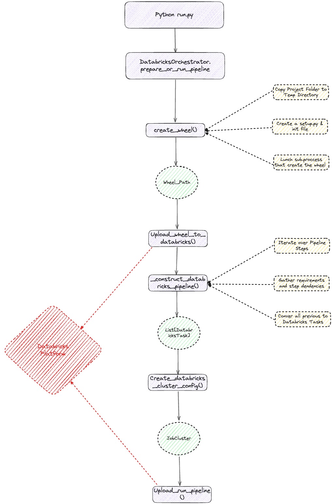
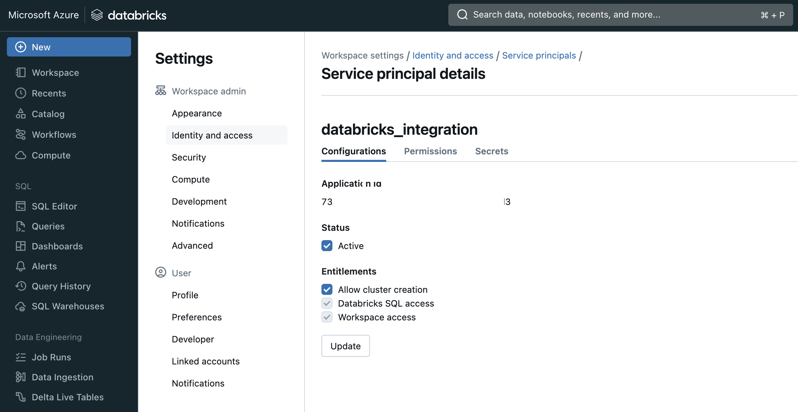
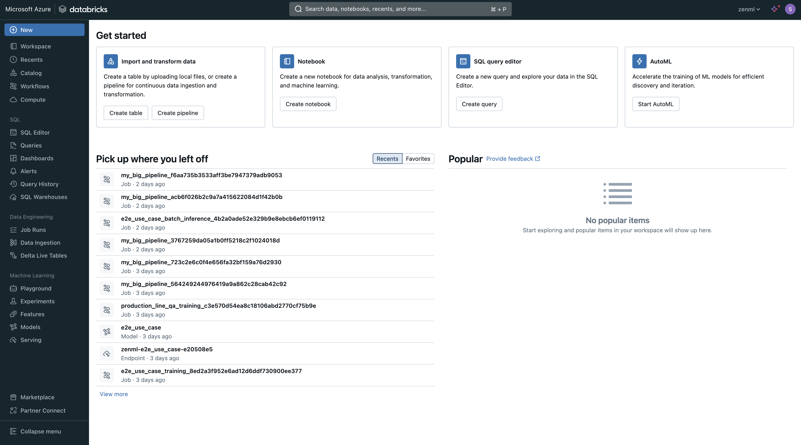
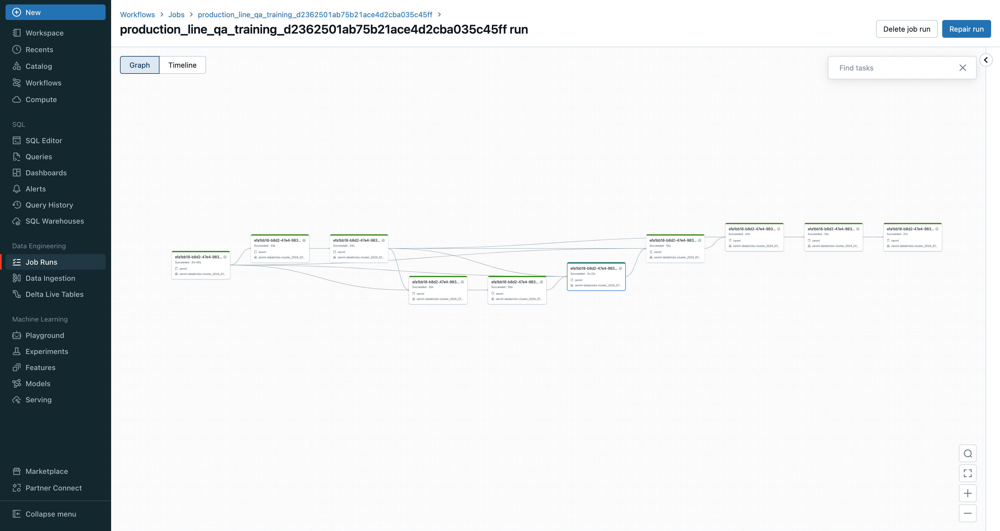

# Databricks Orchestrator

[Databricks](https://www.databricks.com/) is a unified data analytics platform that combines the best of data warehouses and data lakes to offer an integrated solution for big data processing and machine learning. It provides a collaborative environment for data scientists, data engineers, and business analysts to work together on data projects. Databricks offers optimized performance and scalability for big data workloads.

The Databricks orchestrator is an orchestrator flavor provided by the ZenML databricks integration that allows you to run your pipelines on Databricks. This integration enables you to leverage Databricks' powerful distributed computing capabilities and optimized environment for your ML pipelines within the ZenML framework.


The following features are currently in Alpha and may be subject to change. We recommend using them in a controlled environment and providing feedback to the ZenML team.


### When to use it

You should use the Databricks orchestrator if:

* you're already using Databricks for your data and ML workloads.
* you want to leverage Databricks' powerful distributed computing capabilities for your ML pipelines.
* you're looking for a managed solution that integrates well with other Databricks services.
* you want to take advantage of Databricks' optimization for big data processing and machine learning.

### Prerequisites

You will need to do the following to start using the Databricks orchestrator:

* An Active Databricks workspace, depends on the cloud provider you are using, you can find more information on how to create a workspace:
    * [AWS](https://docs.databricks.com/en/getting-started/onboarding-account.html)
    * [Azure](https://learn.microsoft.com/en-us/azure/databricks/getting-started/#--create-an-azure-databricks-workspace)
    * [GCP](https://docs.gcp.databricks.com/en/getting-started/index.html)
* Active Databricks account or service account with sufficient permission to create and run jobs

## How it works




The Databricks orchestrator in ZenML leverages the concept of Wheel Packages. When you run a pipeline with the Databricks orchestrator, ZenML creates a Python wheel package from your project. This wheel package contains all the necessary code and dependencies for your pipeline.

Once the wheel package is created, ZenML uploads it to Databricks. ZenML leverage Databricks SDK to create a job definition, This job definition includes information about the pipeline steps and ensures that each step is executed only after its upstream steps have successfully completed.

The Databricks job is also configured with the necessary cluster settings to run. This includes specifying the version of Spark to use, the number of workers, the node type, and other configuration options.

When the Databricks job is executed, it retrieves the wheel package from Databricks and runs the pipeline using the specified cluster configuration. The job ensures that the steps are executed in the correct order based on their dependencies.

Once the job is completed, ZenML retrieves the logs and status of the job and updates the pipeline run accordingly. This allows you to monitor the progress of your pipeline and view the logs of each step.


### How to use it

To use the Databricks orchestrator, you first need to register it and add it to your stack. Before registering the orchestrator, you need to install the Databricks integration by running the following command:

```shell
zenml integration install databricks
```

This command will install the necessary dependencies, including the `databricks-sdk` package, which is required for authentication with Databricks. Once the integration is installed, you can proceed with registering the orchestrator and configuring the necessary authentication details.

```shell
zenml integration install databricks
```

Then, we can register the orchestrator and use it in our active stack:

```shell
zenml orchestrator register databricks_orchestrator --flavor=databricks --host="https://xxxxx.x.azuredatabricks.net" --client_id={{databricks.client_id}} --client_secret={{databricks.client_secret}}
```


We recommend creating a Databricks service account with the necessary permissions to create and run jobs. You can find more information on how to create a service account [here](https://docs.databricks.com/dev-tools/api/latest/authentication.html). You can generate a client_id and client_secret for the service account and use them to authenticate with Databricks.




```shell
# Add the orchestrator to your stack
zenml stack register databricks_stack -o databricks_orchestrator ... --set
```

You can now run any ZenML pipeline using the Databricks orchestrator:

```shell
python run.py
```

### Databricks UI

Databricks comes with its own UI that you can use to find further details about your pipeline runs, such as the logs of your steps.



For any runs executed on Databricks, you can get the URL to the Databricks UI in Python using the following code snippet:

```python
from zenml.client import Client

pipeline_run = Client().get_pipeline_run("<PIPELINE_RUN_NAME>")
orchestrator_url = pipeline_run.run_metadata["orchestrator_url"].value
```




### Run pipelines on a schedule

The Databricks Pipelines orchestrator supports running pipelines on a schedule using its [native scheduling capability](https://docs.databricks.com/en/workflows/jobs/schedule-jobs.html).

**How to schedule a pipeline**

```python
from zenml.config.schedule import Schedule

# Run a pipeline every 5th minute
pipeline_instance.run(
    schedule=Schedule(
        cron_expression="*/5 * * * *"
    )
)
```


The Databricks orchestrator only supports the `cron_expression`, in the `Schedule` object, and will ignore all other parameters supplied to define the schedule.



The Databricks orchestrator requires Java Timezone IDs to be used in the `cron_expression`. You can find a list of supported timezones [here](https://docs.oracle.com/middleware/1221/wcs/tag-ref/MISC/TimeZones.html), the timezone ID must be set in the settings of the orchestrator (see below for more information how to set settings for the orchestrator).


**How to delete a scheduled pipeline**

Note that ZenML only gets involved to schedule a run, but maintaining the lifecycle of the schedule is the responsibility of the user.

In order to cancel a scheduled Databricks pipeline, you need to manually delete the schedule in Databricks (via the UI or the CLI).

### Additional configuration

For additional configuration of the Databricks orchestrator, you can pass `DatabricksOrchestratorSettings` which allows you to change the Spark version, number of workers, node type, autoscale settings, Spark configuration, Spark environment variables, and schedule timezone.

```python
from zenml.integrations.databricks.flavors.databricks_orchestrator_flavor import DatabricksOrchestratorSettings

databricks_settings = DatabricksOrchestratorSettings(
    spark_version="15.3.x-scala2.12",
    num_workers="3",
    node_type_id="Standard_D4s_v5",
    policy_id=POLICY_ID,
    autoscale=(2, 3),
    spark_conf={},
    spark_env_vars={},
    schedule_timezone="America/Los_Angeles" or "PST" # You can get the timezone ID from here: https://docs.oracle.com/middleware/1221/wcs/tag-ref/MISC/TimeZones.html
)
```

These settings can then be specified on either pipeline-level or step-level:

```python
# Either specify on pipeline-level
@pipeline(
    settings={
        "orchestrator": databricks_settings,
    }
)
def my_pipeline():
    ...
```

We can also enable GPU support for the Databricks orchestrator changing the `spark_version` and `node_type_id` to a GPU-enabled version and node type:

```python
from zenml.integrations.databricks.flavors.databricks_orchestrator_flavor import DatabricksOrchestratorSettings

databricks_settings = DatabricksOrchestratorSettings(
    spark_version="15.3.x-gpu-ml-scala2.12",
    node_type_id="Standard_NC24ads_A100_v4",
    policy_id=POLICY_ID,
    autoscale=(1, 2),
)
```

With these settings, the orchestrator will use a GPU-enabled Spark version and a GPU-enabled node type to run the pipeline on Databricks, next section will show how to enable CUDA for the GPU to give its full acceleration for your pipeline.

#### Enabling CUDA for GPU-backed hardware

Note that if you wish to use this orchestrator to run steps on a GPU, you will need to follow [the instructions on this page](../../how-to/advanced-topics/training-with-gpus/README.md) to ensure that it works. It requires adding some extra settings customization and is essential to enable CUDA for the GPU to give its full acceleration.

<figure><figcaption></figcaption></figure>


Check out the [SDK docs](https://sdkdocs.zenml.io/latest/integration\_code\_docs/integrations-databricks/#zenml.integrations.databricks.flavors.databricks\_orchestrator\_flavor.DatabricksOrchestratorSettings) for a full list of available attributes and [this docs page](../../how-to/pipeline-development/use-configuration-files/runtime-configuration.md) for more information on how to specify settings.

For more information and a full list of configurable attributes of the Databricks orchestrator, check out the [SDK Docs](https://sdkdocs.zenml.io/latest/integration\_code\_docs/integrations-databricks/#zenml.integrations.databricks.orchestrators.databricks\_orchestrator.DatabricksOrchestrator) .