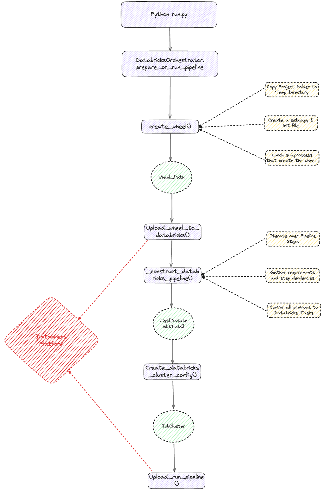
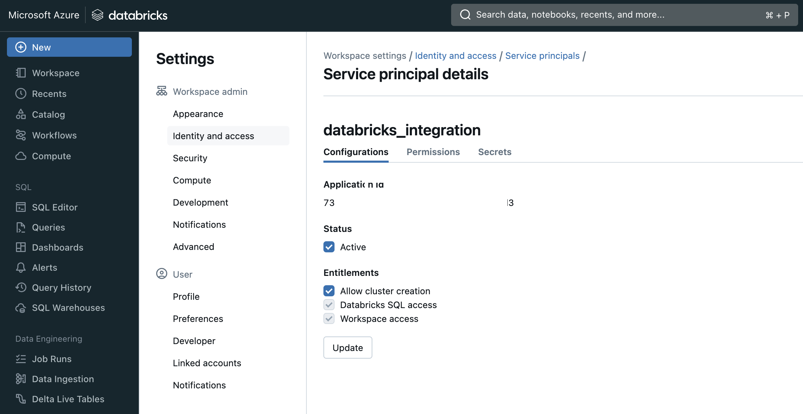
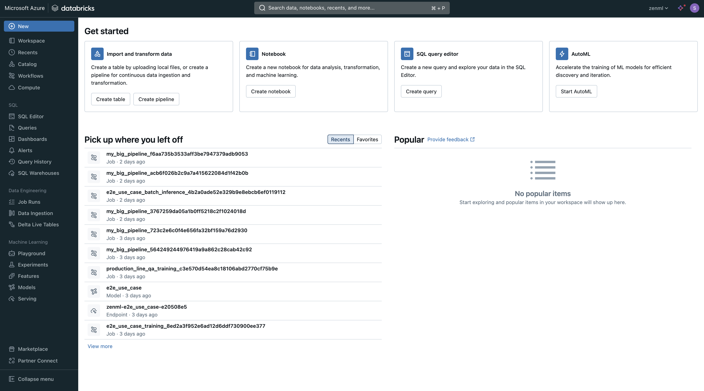
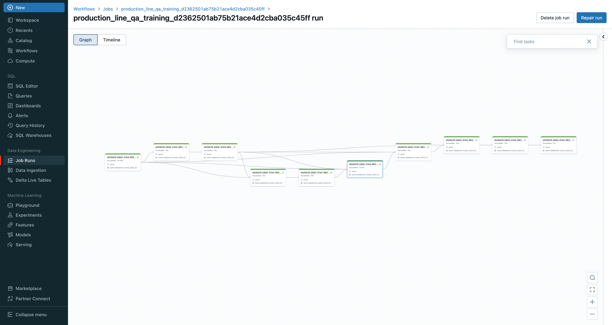


This is an older version of the ZenML documentation. To read and view the latest version please [visit this up-to-date URL](https://docs.zenml.io).



# Databricks Orchestrator

[Databricks](https://www.databricks.com/) is a unified data analytics platform that combines the best of data warehouses and data lakes to offer an integrated solution for big data processing and machine learning. It provides a collaborative environment for data scientists, data engineers, and business analysts to work together on data projects. Databricks offers optimized performance and scalability for big data workloads.

The Databricks orchestrator is an orchestrator flavor provided by the ZenML databricks integration that allows you to run your pipelines on Databricks. This integration enables you to leverage Databricks' powerful distributed computing capabilities and optimized environment for your ML pipelines within the ZenML framework.

If you only want to run selected steps on Databricks while keeping the overall pipeline on another orchestrator, use the [Databricks step operator](../step-operators/databricks.md) instead.


The following features are currently in Alpha and may be subject to change. We recommend using them in a controlled environment and providing feedback to the ZenML team.


### When to use it

You should use the Databricks orchestrator if:

* you're already using Databricks for your data and ML workloads.
* you want to leverage Databricks' powerful distributed computing capabilities for your ML pipelines.
* you're looking for a managed solution that integrates well with other Databricks services.
* you want to take advantage of Databricks' optimization for big data processing and machine learning.

### Prerequisites

You will need to do the following to start using the Databricks orchestrator:

* An active Databricks workspace. See the cloud-specific setup guides:
    * [AWS](https://docs.databricks.com/en/getting-started/onboarding-account.html)
    * [Azure](https://learn.microsoft.com/en-us/azure/databricks/getting-started/#--create-an-azure-databricks-workspace)
    * [GCP](https://docs.gcp.databricks.com/en/getting-started/index.html)
* A Databricks account or service account with permission to create and run jobs.

## How it works



When you run a pipeline with the Databricks orchestrator, ZenML builds a Python wheel from your project and uploads it to Databricks. ZenML then uses the Databricks SDK to create a job whose tasks mirror your pipeline steps and their upstream dependencies.

The job uses the cluster settings configured on the orchestrator, including Spark version, worker count or autoscaling, node type, and any Spark configuration. When Databricks starts the job, each task installs the uploaded wheel and executes the corresponding ZenML step entrypoint.


The orchestrator keeps uploaded wheel packages under `/Workspace/Shared/.zenml` after a successful job submission because Databricks job definitions, scheduled runs, and manual re-runs keep referencing those workspace files. Clean up old wheel directories from that workspace path according to your team's retention policy when you no longer need to re-run those jobs.



### How to use it

To use the Databricks orchestrator, you first need to register it and add it to your stack. Before registering the orchestrator, you need to install the Databricks integration by running the following command:

```shell
zenml integration install databricks
```

This installs the required dependencies, including `databricks-sdk`. Once the integration is installed, register the orchestrator and configure authentication:

```shell
zenml orchestrator register databricks_orchestrator --flavor=databricks --host="https://xxxxx.x.azuredatabricks.net" --client_id={{databricks.client_id}} --client_secret={{databricks.client_secret}}
```


We recommend creating a Databricks service account with the necessary permissions to create and run jobs. You can find more information on how to create a service account [here](https://docs.databricks.com/dev-tools/api/latest/authentication.html). You can generate a client_id and client_secret for the service account and use them to authenticate with Databricks.




```shell
# Add the orchestrator to your stack
zenml stack register databricks_stack -o databricks_orchestrator ... --set
```

You can now run any ZenML pipeline using the Databricks orchestrator:

```shell
python run.py
```

### Databricks UI

Databricks comes with its own UI that you can use to find further details about your pipeline runs, such as the logs of your steps.



For any runs executed on Databricks, you can get the URL to the Databricks UI in Python using the following code snippet:

```python
from zenml.client import Client

pipeline_run = Client().get_pipeline_run("<PIPELINE_RUN_NAME>")
orchestrator_url = pipeline_run.run_metadata["orchestrator_url"].value
```




### Run pipelines on a schedule

The Databricks orchestrator supports running pipelines on a schedule using its [native scheduling capability](https://docs.databricks.com/en/workflows/jobs/schedule-jobs.html).

**How to schedule a pipeline**

```python
from zenml.config.schedule import Schedule

# Run a pipeline every 5th minute
pipeline_instance.run(
    schedule=Schedule(
        cron_expression="*/5 * * * *"
    )
)
```


The Databricks orchestrator only supports the `cron_expression`, in the `Schedule` object, and will ignore all other parameters supplied to define the schedule.



The Databricks orchestrator requires an IANA timezone ID to be configured through `schedule_timezone` in the orchestrator settings (see below for more information on how to set orchestrator settings).


**How to delete a scheduled pipeline**

ZenML creates the Databricks schedule, but you manage its lifecycle in Databricks. To cancel a scheduled Databricks pipeline, delete the schedule in Databricks via the UI or CLI.

### Additional configuration

For additional configuration of the Databricks orchestrator, you can pass `DatabricksOrchestratorSettings` which allows you to change the Spark version, number of workers, node type, autoscale settings, Spark configuration, Spark environment variables, schedule timezone, init scripts, and Docker image settings. Init scripts must use DBFS paths that start with `dbfs:/`. If you configure Docker registry authentication, provide both `docker_image_username` and `docker_image_password`.

```python
from zenml.integrations.databricks.flavors.databricks_orchestrator_flavor import DatabricksOrchestratorSettings

databricks_settings = DatabricksOrchestratorSettings(
    spark_version="15.3.x-scala2.12",
    num_workers=3,
    node_type_id="Standard_D4s_v5",
    policy_id=POLICY_ID,
    spark_conf={},
    spark_env_vars={},
    init_scripts=["dbfs:/scripts/install_dependencies.sh"],
    schedule_timezone="America/Los_Angeles",
)
```

Use `num_workers` for fixed-size clusters. For autoscaling clusters, omit `num_workers` and set `autoscale`, for example `autoscale=(2, 3)`.

These settings can then be specified on either pipeline-level or step-level:

```python
# Either specify on pipeline-level
@pipeline(
    settings={
        "orchestrator": databricks_settings,
    }
)
def my_pipeline():
    ...
```

#### Tagging Databricks resources

You can apply tags to Databricks resources for cost allocation, governance, and project tracking using two settings:

* `custom_tags`: Applied to the underlying cluster resources (e.g., AWS EC2 instances, EBS volumes). Maximum 45 tags.
* `job_tags`: Applied to the Databricks job itself and forwarded as cluster tags. Maximum 25 tags.

By default, Databricks autoscaling uses `(0, 1)` worker bounds. This intentionally permits driver-only clusters while still allowing one worker when needed.

```python
from zenml.integrations.databricks.flavors.databricks_orchestrator_flavor import DatabricksOrchestratorSettings

databricks_settings = DatabricksOrchestratorSettings(
    spark_version="15.3.x-scala2.12",
    num_workers=3,
    node_type_id="Standard_D4s_v5",
    custom_tags={"cost_center": "ml-team", "environment": "production"},
    job_tags={"project": "recommendation-engine", "owner": "data-team"},
)
```

To use GPU-backed clusters, set `spark_version` and `node_type_id` to GPU-enabled values:

```python
from zenml.integrations.databricks.flavors.databricks_orchestrator_flavor import DatabricksOrchestratorSettings

databricks_settings = DatabricksOrchestratorSettings(
    spark_version="15.3.x-gpu-ml-scala2.12",
    node_type_id="Standard_NC24ads_A100_v4",
    policy_id=POLICY_ID,
    autoscale=(1, 2),
)
```

With these settings, the orchestrator uses a GPU-enabled Spark version and node type.

#### Enabling CUDA for GPU-backed hardware

If your steps need CUDA, follow the [distributed training guide](https://docs.zenml.io/user-guides/tutorial/distributed-training) to configure the required dependencies and runtime settings.

<figure><figcaption></figcaption></figure>

Check out the [SDK docs](https://sdkdocs.zenml.io/latest/integration_code_docs/integrations-databricks.html#zenml.integrations.databricks) for all configurable attributes and [this docs page](https://docs.zenml.io/concepts/steps_and_pipelines/configuration) for more information on how to specify settings.
