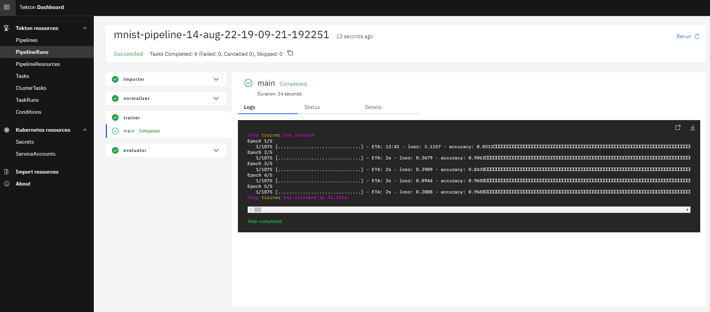


This is an older version of the ZenML documentation. To read and view the latest version please [visit this up-to-date URL](https://docs.zenml.io).



# Tekton Orchestrator

[Tekton](https://tekton.dev/) is a powerful and flexible open-source framework for creating CI/CD systems, allowing developers to build, test, and deploy across cloud providers and on-premise systems.


This component is only meant to be used within the context of a [remote ZenML deployment scenario](../../getting-started/deploying-zenml/README.md). Usage with a local ZenML deployment may lead to unexpected behavior!


### When to use it

You should use the Tekton orchestrator if:

* you're looking for a proven production-grade orchestrator.
* you're looking for a UI in which you can track your pipeline runs.
* you're already using Kubernetes or are not afraid of setting up and maintaining a Kubernetes cluster.
* you're willing to deploy and maintain Tekton Pipelines on your cluster.

### How to deploy it

You'll first need to set up a Kubernetes cluster and deploy Tekton Pipelines:



* A remote ZenML server. See the [deployment guide](../../getting-started/deploying-zenml/README.md) for more information.
* Have an existing AWS [EKS cluster](https://docs.aws.amazon.com/eks/latest/userguide/create-cluster.html) set up.
* Make sure you have the [AWS CLI](https://docs.aws.amazon.com/cli/latest/userguide/getting-started-install.html) set up.
*   Download and [install](https://kubernetes.io/docs/tasks/tools/) `kubectl` and [configure](https://aws.amazon.com/premiumsupport/knowledge-center/eks-cluster-connection/) it to talk to your EKS cluster using the following command:

    ```powershell
    aws eks --region REGION update-kubeconfig --name CLUSTER_NAME
    ```
* [Install](https://tekton.dev/docs/pipelines/install/) Tekton Pipelines onto your cluster.



* A remote ZenML server. See the [deployment guide](../../getting-started/deploying-zenml/README.md) for more information.
* Have an existing GCP [GKE cluster](https://cloud.google.com/kubernetes-engine/docs/quickstart) set up.
* Make sure you have the [Google Cloud CLI](https://cloud.google.com/sdk/docs/install-sdk) set up first.
*   Download and [install](https://kubernetes.io/docs/tasks/tools/) `kubectl` and [configure](https://cloud.google.com/kubernetes-engine/docs/how-to/cluster-access-for-kubectl) it to talk to your GKE cluster using the following command:

    ```powershell
    gcloud container clusters get-credentials CLUSTER_NAME
    ```
* [Install](https://tekton.dev/docs/pipelines/install/) Tekton Pipelines onto your cluster.



* A remote ZenML server. See the [deployment guide](../../getting-started/deploying-zenml/README.md) for more information.
* Have an existing [AKS cluster](https://azure.microsoft.com/en-in/services/kubernetes-service/#documentation) set up.
* Make sure you have the [`az` CLI](https://docs.microsoft.com/en-us/cli/azure/install-azure-cli) set up first.
*   Download and [install](https://kubernetes.io/docs/tasks/tools/) `kubectl` and it to talk to your AKS cluster using the following command:

    ```powershell
    az aks get-credentials --resource-group RESOURCE_GROUP --name CLUSTER_NAME
    ```
* [Install](https://tekton.dev/docs/pipelines/install/) Tekton Pipelines onto your cluster.




If one or more of the deployments are not in the `Running` state, try increasing the number of nodes in your cluster.



ZenML has only been tested with Tekton Pipelines >=0.38.3 and may not work with previous versions.


### How to use it

To use the Tekton orchestrator, we need:

*   The ZenML `tekton` integration installed. If you haven't done so, run

    ```shell
    zenml integration install tekton -y
    ```
* [Docker](https://www.docker.com) installed and running.
* Tekton pipelines deployed on a remote cluster. See the [deployment section](tekton.md#how-to-deploy-it) for more information.
* The name of your Kubernetes context which points to your remote cluster. Run `kubectl config get-contexts` to see a list of available contexts.
* A [remote artifact store](../artifact-stores/artifact-stores.md) as part of your stack.
* A [remote container registry](../container-registries/container-registries.md) as part of your stack.
* [kubectl](https://kubernetes.io/docs/tasks/tools/#kubectl) installed and the name of the Kubernetes configuration context which points to the target cluster (i.e. run`kubectl config get-contexts` to see a list of available contexts). This is optional (see below).


It is recommended that you set up [a Service Connector](../../how-to/auth-management/service-connectors-guide.md) and use it to connect ZenML Stack Components to the remote Kubernetes cluster, especially If you are using a Kubernetes cluster managed by a cloud provider like AWS, GCP or Azure, This guarantees that your Stack is fully portable on other environments and your pipelines are fully reproducible.


We can then register the orchestrator and use it in our active stack. This can be done in two ways:

1.  If you have [a Service Connector](../../how-to/auth-management/service-connectors-guide.md) configured to access the remote Kubernetes cluster, you no longer need to set the `kubernetes_context` attribute to a local `kubectl` context. In fact, you don't need the local Kubernetes CLI at all. You can [connect the stack component to the Service Connector](../../how-to/auth-management/service-connectors-guide.md#connect-stack-components-to-resources) instead:

    ```
    $ zenml orchestrator register <ORCHESTRATOR_NAME> --flavor tekton
    Running with active stack: 'default' (repository)
    Successfully registered orchestrator `<ORCHESTRATOR_NAME>`.

    $ zenml service-connector list-resources --resource-type kubernetes-cluster -e
    The following 'kubernetes-cluster' resources can be accessed by service connectors that you have configured:
    ┏━━━━━━━━━━━━━━━━━━━━━━━━━━━━━━━━━━━━━━┯━━━━━━━━━━━━━━━━━━━━━━━┯━━━━━━━━━━━━━━━━┯━━━━━━━━━━━━━━━━━━━━━━━┯━━━━━━━━━━━━━━━━━━━━━┓
    ┃             CONNECTOR ID             │ CONNECTOR NAME        │ CONNECTOR TYPE │ RESOURCE TYPE         │ RESOURCE NAMES      ┃
    ┠──────────────────────────────────────┼───────────────────────┼────────────────┼───────────────────────┼─────────────────────┨
    ┃ e33c9fac-5daa-48b2-87bb-0187d3782cde │ aws-iam-multi-eu      │ 🔶 aws         │ 🌀 kubernetes-cluster │ kubeflowmultitenant ┃
    ┃                                      │                       │                │                       │ zenbox              ┃
    ┠──────────────────────────────────────┼───────────────────────┼────────────────┼───────────────────────┼─────────────────────┨
    ┃ ed528d5a-d6cb-4fc4-bc52-c3d2d01643e5 │ aws-iam-multi-us      │ 🔶 aws         │ 🌀 kubernetes-cluster │ zenhacks-cluster    ┃
    ┠──────────────────────────────────────┼───────────────────────┼────────────────┼───────────────────────┼─────────────────────┨
    ┃ 1c54b32a-4889-4417-abbd-42d3ace3d03a │ gcp-sa-multi          │ 🔵 gcp         │ 🌀 kubernetes-cluster │ zenml-test-cluster  ┃
    ┗━━━━━━━━━━━━━━━━━━━━━━━━━━━━━━━━━━━━━━┷━━━━━━━━━━━━━━━━━━━━━━━┷━━━━━━━━━━━━━━━━┷━━━━━━━━━━━━━━━━━━━━━━━┷━━━━━━━━━━━━━━━━━━━━━┛

    $ zenml orchestrator connect <ORCHESTRATOR_NAME> --connector aws-iam-multi-us
    Running with active stack: 'default' (repository)
    Successfully connected orchestrator `<ORCHESTRATOR_NAME>` to the following resources:
    ┏━━━━━━━━━━━━━━━━━━━━━━━━━━━━━━━━━━━━━━┯━━━━━━━━━━━━━━━━━━┯━━━━━━━━━━━━━━━━┯━━━━━━━━━━━━━━━━━━━━━━━┯━━━━━━━━━━━━━━━━━━┓
    ┃             CONNECTOR ID             │ CONNECTOR NAME   │ CONNECTOR TYPE │ RESOURCE TYPE         │ RESOURCE NAMES   ┃
    ┠──────────────────────────────────────┼──────────────────┼────────────────┼───────────────────────┼──────────────────┨
    ┃ ed528d5a-d6cb-4fc4-bc52-c3d2d01643e5 │ aws-iam-multi-us │ 🔶 aws         │ 🌀 kubernetes-cluster │ zenhacks-cluster ┃
    ┗━━━━━━━━━━━━━━━━━━━━━━━━━━━━━━━━━━━━━━┷━━━━━━━━━━━━━━━━━━┷━━━━━━━━━━━━━━━━┷━━━━━━━━━━━━━━━━━━━━━━━┷━━━━━━━━━━━━━━━━━━┛

    # Register and activate a stack with the new orchestrator
    $ zenml stack register <STACK_NAME> -o <ORCHESTRATOR_NAME> ... --set
    ```
2.  if you don't have a Service Connector on hand and you don't want to [register one](../../how-to/auth-management/service-connectors-guide.md#register-service-connectors) , the local Kubernetes `kubectl` client needs to be configured with a configuration context pointing to the remote cluster. The `kubernetes_context` stack component must also be configured with the value of that context:

    ```shell
    zenml orchestrator register <ORCHESTRATOR_NAME> \
        --flavor=tekton \
        --kubernetes_context=<KUBERNETES_CONTEXT>

    # Register and activate a stack with the new orchestrator
    zenml stack register <STACK_NAME> -o <ORCHESTRATOR_NAME> ... --set
    ```


ZenML will build a Docker image called `<CONTAINER_REGISTRY_URI>/zenml:<PIPELINE_NAME>` which includes your code and use it to run your pipeline steps in Tekton. Check out [this page](../../how-to/customize-docker-builds/README.md) if you want to learn more about how ZenML builds these images and how you can customize them.


You can now run any ZenML pipeline using the Tekton orchestrator:

```shell
python file_that_runs_a_zenml_pipeline.py
```

#### Tekton UI

Tekton comes with its own UI that you can use to find further details about your pipeline runs, such as the logs of your steps.



To find the Tekton UI endpoint, we can use the following command:

```bash
kubectl get ingress -n tekton-pipelines  -o jsonpath='{.items[0].spec.rules[0].host}'
```

#### Additional configuration

For additional configuration of the Tekton orchestrator, you can pass `TektonOrchestratorSettings` which allows you to configure node selectors, affinity, and tolerations to apply to the Kubernetes Pods running your pipeline. These can be either specified using the Kubernetes model objects or as dictionaries.

```python
from zenml.integrations.tekton.flavors.tekton_orchestrator_flavor import TektonOrchestratorSettings
from kubernetes.client.models import V1Toleration

tekton_settings = TektonOrchestratorSettings(
    pod_settings={
        "affinity": {
            "nodeAffinity": {
                "requiredDuringSchedulingIgnoredDuringExecution": {
                    "nodeSelectorTerms": [
                        {
                            "matchExpressions": [
                                {
                                    "key": "node.kubernetes.io/name",
                                    "operator": "In",
                                    "values": ["my_powerful_node_group"],
                                }
                            ]
                        }
                    ]
                }
            }
        },
        "tolerations": [
            V1Toleration(
                key="node.kubernetes.io/name",
                operator="Equal",
                value="",
                effect="NoSchedule"
            )
        ]
    }
)
```

If your pipelines steps have certain hardware requirements, you can specify them as `ResourceSettings`:

```python
resource_settings = ResourceSettings(cpu_count=8, memory="16GB")
```

These settings can then be specified on either pipeline-level or step-level:

```python
# Either specify on pipeline-level
@pipeline(
    settings={
        "orchestrator": tekton_settings,
        "resources": resource_settings,
    }
)
def my_pipeline():
    ...

# OR specify settings on step-level
@step(
    settings={
        "orchestrator": tekton_settings,
        "resources": resource_settings,
    }
)
def my_step():
    ...
```

Check out the [SDK docs](https://sdkdocs.zenml.io/latest/integration\_code\_docs/integrations-tekton/#zenml.integrations.tekton.flavors.tekton\_orchestrator\_flavor.TektonOrchestratorSettings) for a full list of available attributes and [this docs page](../../how-to/use-configuration-files/runtime-configuration.md) for more information on how to specify settings.

For more information and a full list of configurable attributes of the Tekton orchestrator, check out the [SDK Docs](https://sdkdocs.zenml.io/latest/integration\_code\_docs/integrations-tekton/#zenml.integrations.tekton.orchestrators.tekton\_orchestrator.TektonOrchestrator) .

#### Enabling CUDA for GPU-backed hardware

Note that if you wish to use this orchestrator to run steps on a GPU, you will need to follow [the instructions on this page](../../how-to/training-with-gpus/training-with-gpus.md) to ensure that it works. It requires adding some extra settings customization and is essential to enable CUDA for the GPU to give its full acceleration.

<figure><figcaption></figcaption></figure>
