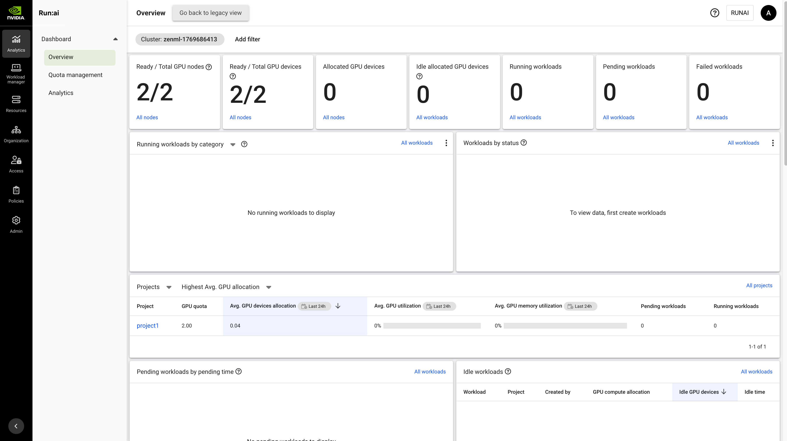

# Run:AI Step Operator

ZenML's Run:AI step operator allows you to submit individual steps to be run on [Run:AI](https://www.run.ai/) clusters as training workloads with support for fractional GPU allocation.

### When to use it

You should use the Run:AI step operator if:

* one or more steps of your pipeline require GPU resources that are not provided by your orchestrator.
* you need fractional GPU allocation (e.g., 0.5 GPU per step) to maximize resource utilization.
* you're already using Run:AI for workload management.
* you want to leverage Run:AI's scheduling and resource management features.

### Key Features

* **Fractional GPU Support**: Allocate portions of a GPU (e.g., 0.25, 0.5, 0.75) to maximize resource utilization
* **Training Workloads**: Submit individual ZenML steps as Run:AI training workloads
* **Dynamic Pipeline Support**: Supports asynchronous step submission and monitoring in dynamic pipelines
* **Project-based Resource Management**: Workloads are organized by Run:AI projects with quota policies
* **SaaS and Self-hosted**: Works with both Run:AI SaaS and self-hosted deployments



### How to deploy it

The Run:AI step operator requires access to a Run:AI cluster. You will need:

* Access to a Run:AI cluster (SaaS or self-hosted)
* A Run:AI project with sufficient resource quota
* Run:AI API credentials (client ID and secret):
  * Navigate to Run:AI control plane → Access → Service accounts (called "Settings → Applications" on older versions)
  * Create a new [service account to obtain client credentials](https://run-ai-docs.nvidia.com/self-hosted/infrastructure-setup/authentication/service-accounts)
  * Assign it an access rule with an appropriate role and scope (see [Run:AI service account permissions](#runai-service-account-permissions) below)

### Run:AI service account permissions

The `client_id` and `client_secret` you pass to the step operator authenticate as a Run:AI **service account** (formerly called "Application"). Run:AI uses RBAC of the form `<subject> is a <role> in a <scope>`, so giving the service account the right permissions means picking a role and a scope.

The ZenML integration only ever exercises a small set of Run:AI API operations under the hood, so it does not need a broad role. The full surface area is:

| Operation | Run:AI entity → action |
|---|---|
| Resolve project by name | Projects → View |
| Resolve cluster | Clusters (or Clusters minimal) → View |
| Submit training workload | Trainings → Create |
| Poll workload status | Trainings → View |
| Suspend on cancel/timeout | Trainings → Edit |
| Delete workload (only if `delete_on_failure=True`) | Trainings → Delete |

For basic usage, that's it. The integration constructs the full workload spec from your `RunAIStepOperatorSettings` and submits it directly, so it does **not** need access to Workspaces, Inferences, Environments, Compute resources, Policies, Users, Access rules, or Roles.

Some advanced settings require additional read permissions because they reference existing Run:AI assets:

| Advanced setting | Additional Run:AI entity → action |
|---|---|
| `workload_template_id` | Templates → View |
| S3 mounts backed by Run:AI-managed credentials or data sources | Credentials/Data sources → View |

PVC, ConfigMap, Secret, NFS, and HostPath mounts are passed as workload spec references. Run:AI and the underlying Kubernetes cluster validate whether the referenced objects are allowed for the project and namespace.

#### Recommended role by Run:AI version

**Run:AI self-hosted v2.24+ — use `AI practitioner` at project scope.** Run:AI 2.24 deprecated the legacy researcher/engineer roles in favor of `AI practitioner`, `Data and storage administrator`, and `Project administrator`. `AI practitioner` carries View/Edit/Create/Delete on Trainings and Workloads, View on Projects, and View on Clusters minimal and Node pools minimal — exactly matching what the integration needs. It is the smallest predefined role in 2.24 that fully covers the integration.

**Run:AI v2.23 and earlier (including older self-hosted clusters and SaaS tenants not yet on 2.24) — use `L1 researcher` at project scope.** `L1 researcher` has VECD on Trainings, Workloads, and Workspaces, plus View on Projects, Clusters, and Node pools — also a complete superset of what's needed. Avoid `L2 researcher` (no dashboard view, no real security gain over L1 for an automated submitter) and avoid `ML engineer` (has VECD on Inferences, not Trainings — the wrong direction for ZenML training-style workloads).

**Tightest least-privilege option (v2.24+) — build a custom role via the Roles API.** From v2.24 onward, administrators can compose custom roles from permission sets using `POST /api/v2/authorization/roles`. For the ZenML step operator the minimal custom role is:

* Trainings — View, Create, Edit (add Delete only if you intend to set `delete_on_failure=True`)
* Workloads — View (the status path returns the generic workload object too)
* Projects — View
* Clusters minimal — View
* Node pools minimal — View (only needed if you pass `node_pools` in step settings)

#### Scope: always use the Project scope

Run:AI scopes are Projects, Departments, Clusters, or Account. Always assign the role at the specific **Project** scope that matches the `project_name` in your `RunAIStepOperatorConfig`. Assigning the role at Department, Cluster, or Account scope would let the same client ID submit workloads into projects ZenML was never configured to use, which defeats the point of a per-stack service account. The "Clusters minimal" / "Node pools minimal" permission sets exist so a project-scoped role can still resolve cluster and node-pool identifiers without leaking full cluster visibility.

#### Quick setup

1. In the Run:AI control plane, go to **Access → Service accounts → + NEW SERVICE ACCOUNT**, name it (e.g., `zenml-step-operator`), and copy the client ID and client secret. The secret is only displayed once at creation time.
2. In **Access → Access rules → + ACCESS RULE**, set the subject to that service account, the role to `AI practitioner` (v2.24+) or `L1 researcher` (older), and the scope to the specific Run:AI project ZenML will submit into.
3. Confirm the project has sufficient GPU/CPU/memory quota on the relevant node pool — the workload will sit in `Pending` indefinitely (and eventually trip `pending_timeout`) if it doesn't.
4. If you use a private container registry, create a Docker-registry credential in the Run:AI project and pass its name as `image_pull_secret_name` when registering the step operator.

### How to use it

To use the Run:AI step operator, we need:

* The ZenML `runai` integration installed. If you haven't done so, run:

    ```shell
    zenml integration install runai
    ```

* A [remote artifact store](https://docs.zenml.io/stacks/artifact-stores/) as part of your stack. This is needed so that both your orchestration environment and Run:AI workloads can read and write step artifacts.

* A [remote container registry](https://docs.zenml.io/stacks/container-registries/) to store the Docker images that will be used to run your steps.

* An [image builder](https://docs.zenml.io/stacks/image-builders/) to build the Docker images.

We can then register the step operator, using [ZenML secrets](https://docs.zenml.io/concepts/secrets#python-sdk-3) to store the Run:AI client ID and secret:

```shell
zenml step-operator register <NAME> \
    --flavor=runai \
    --client_id={{runai_secret.client_id}} \
    --client_secret={{runai_secret.client_secret}} \
    --runai_base_url=<YOUR_RUNAI_URL> \
    --project_name=<YOUR_PROJECT_NAME>
```

We can then add the step operator to our active stack:

```shell
zenml stack update -s <NAME>
```

Once you added the step operator to your active stack, you can use it to execute individual steps of your pipeline by specifying it in the `@step` decorator:

```python
from zenml import step


@step(step_operator="<NAME>")
def trainer(...) -> ...:
    """Train a model on Run:AI."""
    ...
```


ZenML will build a Docker image which includes your code and use it to run your steps on Run:AI. Check out [this page](https://docs.zenml.io/how-to/customize-docker-builds/) if you want to learn more about how ZenML builds these images and how you can customize them.


You can use standard ZenML `DockerSettings` on the step or pipeline to control this image, for example to install additional Python requirements, set a parent image, or include extra files. These settings affect the image that Run:AI runs; Run:AI-specific settings such as storage mounts, security context, ports, and scheduling remain in `RunAIStepOperatorSettings`.

The Run:AI step operator uses asynchronous workload submission under the hood. ZenML stores the Run:AI workload metadata for each step run and uses it for status monitoring and cancellation.

### Configuring GPU resources

You can configure GPU allocation using step operator settings:

```python
from zenml import step
from zenml.integrations.runai.flavors import RunAIStepOperatorSettings

# Request half a GPU
runai_settings = RunAIStepOperatorSettings(
    gpu_devices_request=1,
    gpu_portion_request=0.5,  # 0.5 = half GPU
    gpu_request_type="portion",
    cpu_core_request=2.0,
    cpu_memory_request="4G",
)

@step(
    step_operator="runai",
    settings={"step_operator": runai_settings}
)
def train_model():
    # This step runs with half a GPU
    ...
```

#### CPU-only workload

```python
settings = RunAIStepOperatorSettings(
    gpu_devices_request=0,  # No GPU
    cpu_core_request=8.0,
    cpu_memory_request="32G",
)
```

### Configuration options

#### Step Operator Configuration (set during registration)

| Option | Type | Required | Description |
|--------|------|----------|-------------|
| `client_id` | str | Yes | Run:AI client ID for API authentication |
| `client_secret` | str | Yes | Run:AI client secret for API authentication |
| `runai_base_url` | str | Yes | Run:AI control plane URL (e.g., `https://org.run.ai`) |
| `project_name` | str | Yes | Run:AI project name for workload submission |
| `cluster_name` | str | No | Run:AI cluster name (uses project's cluster if not specified) |
| `image_pull_secret_name` | str | No | Name of Run:AI image pull secret for private registries |
| `monitoring_interval` | float | No | Interval in seconds to poll workload status (default: 30) |
| `workload_timeout` | int | No | Maximum time in seconds for workload completion |
| `delete_on_failure` | bool | No | Delete failed workloads (default: False). Set to True to clean up failed runs |

#### Step Settings (per-step configuration)

| Option | Type | Default | Description |
|--------|------|---------|-------------|
| `gpu_devices_request` | int | 1 | Number of GPUs to request |
| `gpu_portion_request` | float | 1.0 | Fractional GPU allocation (0.0-1.0) |
| `gpu_request_type` | str | "portion" | GPU allocation method: "portion" or "memory" |
| `gpu_memory_request` | str | None | GPU memory to request (e.g., "20Gi") when using memory type |
| `cpu_core_request` | float | 1.0 | Number of CPU cores to request |
| `cpu_memory_request` | str | "4G" | Memory to request (e.g., "4G", "8Gi") |
| `node_pools` | list | None | Ordered list of node pool names for scheduling |
| `node_type` | str | None | Node type label for GPU selection |
| `preemptibility` | str | None | "preemptible" or "non-preemptible" |
| `priority_class` | str | None | Kubernetes PriorityClass name |
| `tolerations` | list | None | Kubernetes tolerations (`RunAITolerationSettings`) for scheduling on tainted nodes |
| `large_shm_request` | bool | False | Request large /dev/shm for PyTorch DataLoader |
| `pvc_mounts` | list | None | PVC mounts (`RunAIPVCMountSettings`) |
| `config_map_mounts` | list | None | ConfigMap mounts (`RunAIConfigMapMountSettings`) |
| `secret_mounts` | list | None | Secret mounts (`RunAISecretMountSettings`) |
| `nfs_mounts` | list | None | NFS mounts (`RunAINFSMountSettings`) |
| `s3_mounts` | list | None | S3 mounts (`RunAIS3MountSettings`) |
| `host_path_mounts` | list | None | HostPath mounts (`RunAIHostPathMountSettings`) |
| `workload_template_id` | str | None | Existing Run:AI workload template ID |
| `security_context` | object | None | Run:AI security context (`RunAISecurityContextSettings`) |
| `ports` | list | None | Port declarations (`RunAIPortSettings`) |
| `external_urls` | list | None | External URL exposure (`RunAIExternalURLSettings`) |
| `parallelism` | int | None | Run:AI training workload parallelism |
| `completions` | int | None | Run:AI training workload completions |

Environment variables are configured through the standard ZenML `environment` settings on steps or pipelines; the Run:AI step operator does not introduce an additional environment-specific setting.

### Advanced training workload settings

The Run:AI step operator can also pass through advanced fields for **standard training workloads**. These settings are additive and optional; if you do not set them, the existing default behavior is unchanged.

Useful Run:AI references while configuring these settings:

* [Run:AI standard training workloads](https://run-ai-docs.nvidia.com/self-hosted/2.22/workloads-in-nvidia-run-ai/using-training/standard-training/train-models)
* [Run:AI data sources](https://run-ai-docs.nvidia.com/self-hosted/workloads-in-nvidia-run-ai/assets/datasources)
* [Run:AI workload templates](https://run-ai-docs.nvidia.com/self-hosted/2.22/workloads-in-nvidia-run-ai/workload-templates)
* [Run:AI CLI examples](https://run-ai-docs.nvidia.com/self-hosted/reference/cli/cli-examples)
* [Run:AI REST API overview](https://run-ai-docs.nvidia.com/api/2.22)

#### End-to-end advanced example

The following example combines the most common advanced settings: an existing PVC, a ConfigMap, a template ID, explicit UID/GID settings, a debugging port, and conservative retry/timeout behavior.

```python
from zenml import step
from zenml.integrations.runai.flavors import (
    RunAIConfigMapMountSettings,
    RunAIExternalURLSettings,
    RunAIPVCMountSettings,
    RunAIPortSettings,
    RunAISecurityContextSettings,
    RunAIStepOperatorSettings,
    RunAITolerationSettings,
)

runai_settings = RunAIStepOperatorSettings(
    # Compute and scheduling
    gpu_devices_request=1,
    gpu_request_type="memory",
    gpu_memory_request="20Gi",
    gpu_memory_limit="40Gi",
    cpu_core_request=8.0,
    cpu_core_limit=16.0,
    cpu_memory_request="32G",
    cpu_memory_limit="64G",
    node_pools=["a100-pool"],
    preemptibility="non-preemptible",
    priority_class="train",
    tolerations=[
        RunAITolerationSettings(
            key="nvidia.com/gpu",
            operator="Exists",
            effect="NoSchedule",
        )
    ],
    large_shm_request=True,
    # Existing Run:AI/Kubernetes assets mounted into the workload.
    pvc_mounts=[
        RunAIPVCMountSettings(
            claim_name="training-datasets",
            path="/mnt/datasets",
            read_only=True,
        )
    ],
    config_map_mounts=[
        RunAIConfigMapMountSettings(
            config_map="training-config",
            mount_path="/etc/training",
            default_mode="0644",
        )
    ],
    workload_template_id="550e8400-e29b-41d4-a716-446655440000",
    security_context=RunAISecurityContextSettings(
        uid_gid_source="custom",
        run_as_uid=1000,
        run_as_gid=1000,
        run_as_non_root=True,
        read_only_root_filesystem=True,
        seccomp_profile_type="RuntimeDefault",
        supplemental_groups=[1000, 2000],
    ),
    ports=[
        RunAIPortSettings(
            name="debug-ui",
            container=8888,
            service_type="ClusterIP",
            external=30088,
        )
    ],
    external_urls=[
        RunAIExternalURLSettings(
            name="debug-ui",
            container=8888,
            authorization_type="authenticatedUsers",
        )
    ],
    labels={"team": "ml-research"},
    annotations={"prometheus.io/scrape": "true"},
    backoff_limit=1,
    termination_grace_period_seconds=120,
    pending_timeout=900,
    workload_timeout=7200,
)

@step(step_operator="runai", settings={"step_operator": runai_settings})
def train_model():
    ...
```

#### Advanced settings reference

These fields map to the Run:AI training workload request body. ZenML validates the local shape where possible, then sends the request to Run:AI; Run:AI and the underlying Kubernetes cluster still decide whether referenced assets, security settings, and ingress configuration are allowed.

| ZenML setting | Run:AI concept | Notes |
|---|---|---|
| `pvc_mounts` | PVC data source / PVC volume | Existing or newly described PVC mount. `path` is the container mount path. |
| `config_map_mounts` | ConfigMap data source / volume | `config_map` is the existing ConfigMap name; `mount_path` is the container path. |
| `secret_mounts` | Secret data source / volume | Mounts a Secret as files. Use normal ZenML environment settings for non-secret environment variables. |
| `nfs_mounts` | NFS data source / volume | Requires `server`, exported `path`, and container `mount_path`. |
| `s3_mounts` | S3 data source | Use Run:AI/Kubernetes-managed credential references for private buckets. |
| `host_path_mounts` | HostPath data source / volume | Depends heavily on cluster policy and should be used sparingly. |
| `workload_template_id` | Workload template ID | Applies an existing Run:AI workload template. ZenML does not resolve template names. |
| `tolerations` | Kubernetes tolerations | Allows scheduling on tainted nodes with typed key/operator/value/effect settings. |
| `security_context` | Workload security block | UID/GID, non-root, seccomp, capabilities, and related pod security settings. |
| `ports` | Port declarations | Declares container ports and optional service ports. |
| `external_urls` | Exposed URLs | Requests Run:AI external URL exposure for long-running/debug endpoints. |
| `parallelism` / `completions` | Training workload parallelism | Runs multiple pods for the same training workload; see caveat below. |

#### Storage mounts

Use the typed mount settings to attach existing Kubernetes/Run:AI storage references to the training workload. Run:AI documents these as [data sources](https://run-ai-docs.nvidia.com/self-hosted/workloads-in-nvidia-run-ai/assets/datasources), including remote locations such as NFS and S3 and local Kubernetes resources such as PVC, ConfigMap, HostPath, and Secret.

Supported storage setting classes are `RunAIPVCMountSettings`, `RunAIConfigMapMountSettings`, `RunAISecretMountSettings`, `RunAINFSMountSettings`, `RunAIS3MountSettings`, and `RunAIHostPathMountSettings`. Mount paths must be absolute and unique within the workload. ConfigMap and Secret `default_mode` values must be four-character octal strings such as `"0644"` or `"0400"`. ZenML only passes references to Run:AI; it does not create PVCs, ConfigMaps, Secrets, buckets, or NFS exports.

| Setting class | Important fields |
|---|---|
| `RunAIPVCMountSettings` | `claim_name`, `path`, `existing_pvc`, `read_only`, `ephemeral`, `claim_info`, `data_sharing` |
| `RunAIConfigMapMountSettings` | `config_map`, `mount_path`, `sub_path`, `default_mode` |
| `RunAISecretMountSettings` | `secret`, `mount_path`, `default_mode` |
| `RunAINFSMountSettings` | `server`, `path`, `mount_path`, `read_only` |
| `RunAIS3MountSettings` | `bucket`, `path`, `url`, `access_key_secret`, `secret_key_of_access_key_id`, `secret_key_of_secret_key` |
| `RunAIHostPathMountSettings` | `path`, `mount_path`, `read_only`, `mount_propagation` |

HostPath mounts and Secret mounts can expose sensitive host or credential data. Use them only when your Run:AI/Kubernetes policies allow them for the project.

#### Workload templates

Pass an existing Run:AI workload template ID with `workload_template_id`:

```python
settings = RunAIStepOperatorSettings(workload_template_id="template-id")
```

Run:AI describes templates as reusable workload setups in the [workload templates documentation](https://run-ai-docs.nvidia.com/self-hosted/2.22/workloads-in-nvidia-run-ai/workload-templates). ZenML does not resolve template names or change Run:AI's template merge semantics. Run:AI workload requests use template IDs, so resolve template names before configuring ZenML.

#### Scheduling tolerations

Use `RunAITolerationSettings` to schedule workloads on Kubernetes nodes with matching taints:

```python
from zenml.integrations.runai.flavors import (
    RunAIStepOperatorSettings,
    RunAITolerationSettings,
)

settings = RunAIStepOperatorSettings(
    tolerations=[
        RunAITolerationSettings(
            key="nvidia.com/gpu",
            operator="Exists",
            effect="NoSchedule",
        )
    ]
)
```

Supported fields are `key`, `operator` (`"Equal"` or `"Exists"`), `value`, and `effect` (`"NoSchedule"`, `"PreferNoSchedule"`, or `"NoExecute"`). Run:AI and Kubernetes still decide whether the project may use the targeted nodes.

#### Security context

Use `RunAISecurityContextSettings` for UID/GID and related security fields:

```python
from zenml.integrations.runai.flavors import RunAISecurityContextSettings

settings = RunAIStepOperatorSettings(
    security_context=RunAISecurityContextSettings(
        uid_gid_source="custom",
        run_as_uid=1000,
        run_as_gid=1000,
        run_as_non_root=True,
        read_only_root_filesystem=True,
        seccomp_profile_type="RuntimeDefault",
        supplemental_groups=[1000, 2000],
    )
)
```

Run:AI's SDK uses `run_as_uid` and `run_as_gid` with `uid_gid_source="custom"` for explicit IDs. ZenML accepts `supplemental_groups` as a list of integers and serializes it to Run:AI's semicolon-separated format. Cluster admission policies still decide whether a security context is accepted.

| Security field | Values / type |
|---|---|
| `uid_gid_source` | `"custom"`, `"fromTheImage"`, or `"fromIdpToken"` |
| `run_as_uid`, `run_as_gid` | Non-negative integer UID/GID |
| `run_as_non_root` | Boolean |
| `supplemental_groups` | List of non-negative integer group IDs |
| `seccomp_profile_type` | `"RuntimeDefault"`, `"Unconfined"`, or `"Localhost"` |
| `allow_privilege_escalation`, `read_only_root_filesystem`, `host_ipc`, `host_network` | Boolean |
| `capabilities` | List of Linux capabilities to add |

#### Ports and external URLs

Use `RunAIPortSettings` for port declarations and `RunAIExternalURLSettings` for Run:AI external URL exposure. Run:AI CLI examples show the same concept with flags such as `--external-url container=8888` in the [CLI examples](https://run-ai-docs.nvidia.com/self-hosted/reference/cli/cli-examples).

```python
from zenml.integrations.runai.flavors import (
    RunAIExternalURLSettings,
    RunAIPortSettings,
)

settings = RunAIStepOperatorSettings(
    ports=[
        RunAIPortSettings(
            container=8888,
            service_type="ClusterIP",
            external=30088,
        )
    ],
    external_urls=[
        RunAIExternalURLSettings(
            container=8888,
            authorization_type="authenticatedUsers",
        )
    ],
)
```

The `container` value is the port inside the workload container. The optional `external` value is an integer service port exposed by Run:AI. The integration submits the exposure configuration but does not poll generated URLs or store them in ZenML metadata.

| Setting class | Important fields |
|---|---|
| `RunAIPortSettings` | `container`, `service_type`, `external`, `tool_type`, `tool_name`, `name` |
| `RunAIExternalURLSettings` | `container`, `url`, `authorization_type`, `authorized_users`, `authorized_groups`, `tool_type`, `tool_name`, `name` |

External URLs are mainly useful for workloads that keep a service alive during step execution, for example a temporary debugger, profiler, or notebook endpoint. A normal ZenML training step exits after producing artifacts, so there may be nothing to reach by the time you open the URL.

#### Parallelism and completions

`parallelism` and `completions` are passed to the Run:AI training workload spec. Run:AI CLI examples show the equivalent concept with `runai training submit --parallelism 2 --completions 2` in the [CLI examples](https://run-ai-docs.nvidia.com/self-hosted/reference/cli/cli-examples).

```python
settings = RunAIStepOperatorSettings(parallelism=2, completions=4)
```

Values greater than `1` can run the same ZenML step entrypoint multiple times for a single step run. This is useful only for explicitly idempotent workloads and is **not** distributed training support. Make sure artifact and metadata writes are safe before enabling it.

#### Workload type scope

Distributed training and inference workloads are separate Run:AI API resources (`DistributedCreationRequest` and `InferenceCreationRequest`) and are intentionally not modeled as extra fields on this training step operator. Distributed training needs a dedicated abstraction for worker roles, replica topology, rank/world-size coordination, and artifact writes. Inference workloads fit better in a model deployer or deployer-style abstraction because their lifecycle is service-oriented rather than step-run-oriented.

### Troubleshooting

#### Common Issues

**Issue: "Project not found in Run:AI"**
- Ensure the project name exactly matches your Run:AI project
- Verify the service account has at least View permission on Projects within the project's scope

**Issue: "Failed to submit Run:AI workload" / 403 errors**
- Check that your client ID and secret are correct
- Verify your Run:AI base URL is accessible
- Verify the service account has View/Edit/Create/Delete permissions (or at minimum View+Create+Edit) on Trainings within the project scope — see [Run:AI service account permissions](#runai-service-account-permissions)
- Ensure your project has sufficient resource quota

**Issue: Workload stays in `Pending` and eventually times out**
- The Run:AI project most likely doesn't have enough quota on the requested node pool. Increase quota or pick a node pool with capacity via `node_pools`/`node_type` settings

**Issue: "runapy package not found"**
- Install the Run:AI integration: `zenml integration install runai`

#### Viewing Logs

Run:AI workload logs can be viewed in the Run:AI control plane UI:
1. Navigate to your Run:AI control plane
2. Go to Workloads → Training
3. Find your step workload and click to view logs

<figure><figcaption></figcaption></figure>
