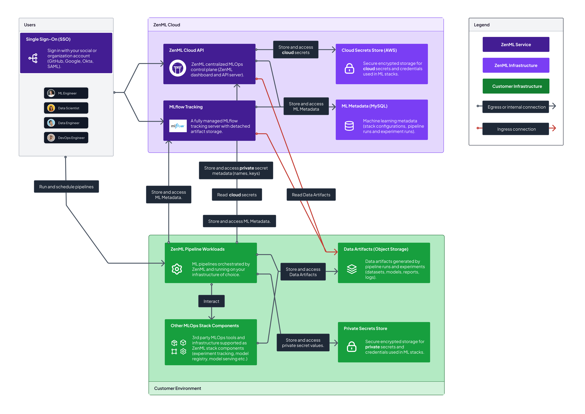

# ☁ Cloud Architecture


ZenML Cloud is currently in the beta phase, offering users the opportunity to host a managed ZenML instance and gain early access to the exciting new features mentioned above. Beta users will receive priority access to the enhanced functionalities and dedicated support to ensure a smooth onboarding experience. 

[Let us know on Slack](https://zenml.io/slack) if you would like to see other deployment scenarios with ZenML Cloud.


Machine learning often involves data that is sensitive and thus data security is a fundamental requirement. The ZenML Cloud is flexible enough to meet any security requirements, from easy installations to completely airgapped deployments.

The ZenML Cloud consists of the following moving pieces:

* ZenML Cloud API: This is a centralized MLOps control plane that includes a managed ZenML dashboard and a special ZenML server optimized for production MLOps workloads.

* MLflow Tracking Server: This is an optional add-on with ZenML Cloud that features a MLflow tracking server with detached artifact storage.

* ZenML Cloud Agent: This service is optionally deployed customer side, and interacts with customer MLOps stack components on behalf of the remote ZenML Cloud control plane.

The above three interact with other MLOps stack components, secrets, and data in varying scenarios described below.


In this phase, the scenarios below are experimental and subject to change. For now, Scenario 2a is used by default when you [sign up for ZenML Cloud](https://cloud.zenml.io). For other scenarios, [contact us on Slack](https://zenml.io/slack).


## Scenario 1: Fully SaaS

<figure><figcaption>
Scenario 1: Fully SaaS deployment
</figcaption></figure>

In this scenario, all services are hosted on the ZenML Cloud infrastructure. The ZenML Cloud API and MLflow Tracking store secrets and data on the ZenML side. The Cloud API interact with the customer cloud for certain actions like triggering pipelines, deploying models etc.

This scenario is meant for customers who want to get started quickly with ZenML Cloud and can to a certain extent expose ingress connections to an external SaaS provider. Importantly, the data and secrets are all stored on ZenML Cloud side.

## Scenario 2a: Hybrid SaaS with partial data on ZenML

<figure><figcaption>
Scenario 2a: Hybrid SaaS deployment
</figcaption></figure>

This scenario builds on top of Scenario 1, with the exception being that some "Data Artifacts" move over the customer cloud, specifically the data produced by ZenML itself. This can be set up quite easily by setting up an [artifact store](../../stacks-and-components/component-guide/artifact-stores/) with your MLOps stack. However, the data stored via MLflow is still stored on ZenML side (e.g. experiments, metadata, models).

This scenario is suitable for users who want the pipeline-centric data to be kept on their side, while they are less concerned about experiment data produced by MLflow.

## Scenario 2b: Hybrid SaaS with no data on ZenML side

<figure><figcaption>
Scenario 2b: Hybrid SaaS with no data on ZenML side

</figcaption></figure>

This scenario builds on top of Scenario 2b, with the exception being that **all** "Data Artifacts" move over the customer cloud, including the ones produced by MLflow.

In this scenario, the ZenML Cloud only stores metadata while the customer cloud keeps potentially sensitive customer data. However, if the customer wants access to special ZenML Cloud features like viewing artifacts on the dashboard, triggering pipeline runs, etc then they have to also provide [connectors](../../stacks-and-components/auth-management/service-connectors-guide.md) which are ultimately stored as secrets on the ZenML side. Therefore, while this scenario keeps the data on customer side, it still gives access to ZenML Cloud to trigger actions via an ingress connection over the internet into the customer cloud.

Note, that ZenML encrypts all customer secrets at transit and at rest.

## Scenario 2c: Hybrid SaaS with no data on ZenML side + Private Secret Store

<figure><figcaption>
Scenario 2c: Hybrid SaaS with no data on ZenML side + Private Secret Store
</figcaption></figure>

This is almost the same as Scenario 2b, however in this the customer brings their own secret store to keep sensitive information on customer side. This allows users to use the [secrets API](../../user-guide/advanced-guide/secret-management/) and ensure their secrets do not leave their environment.

The ZenML secret store still exists, and this is again to enable customers to create [connectors](../../stacks-and-components/auth-management/service-connectors-guide.md) to allow ZenML Cloud to triggers actions on their environment.

## Scenario 3: Agent Architecture

<figure><figcaption>
Scenario 3: ZenML Agent deployment
</figcaption></figure>

This scenario adds a new architectural component into the mix, called the ZenML Agent, which facilitates communication between the two clouds. The customer is responsible for deploying and maintaining the ZenML Agent in their environment.

The advantage of this deployment is that the ZenML Cloud does not need access to any sensitive secrets or need create any [connectors](../../stacks-and-components/auth-management/service-connectors-guide.md) to trigger actions customer side. Secrets and data remain on the customer environment, and only one secure ingress connection is exposed.

## Scenario 4: Fully On-prem

<figure><figcaption>
Scenario 4: Fully on-premises deployment
</figcaption></figure>

In this scenario, all services, data, and secrets are deployed on the customer cloud. This is the opposite of Scenario 1, and is meant for customers who require completely airgapped deployments, for the tightest security standards.

Are you interested in the ZenML Cloud? While in beta, we're looking for early adopters to talk to! [Sign up](https://cloud.zenml.io) and get access to Scenario 2a with a free 30 day trial now!