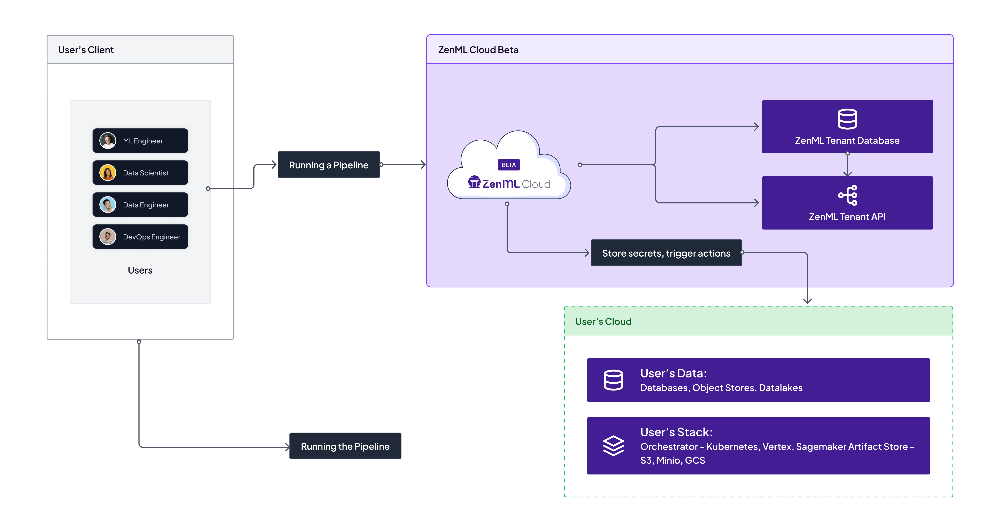

# ☁ Cloud Architecture

Machine learning often involves data that is sensitive and thus data security is a fundamental requirement. The ZenML Cloud is flexible enough to meet any security requirements, from easy installations to completely airgapped deployments.

The ZenML Cloud consists of the following moving pieces:

The ZenML Server: This is the part that the user interacts with through the UI, CLI or API. The application shows projects, experiments, deployments etc. in a human readable way.

The ZenML Agent: This is the part that turns user interactions into commands for the infrastructure. The queue spins up workers and logs these executions.

<figure><figcaption>
an architectural overview of the ZenML Cloud
</figcaption></figure>

