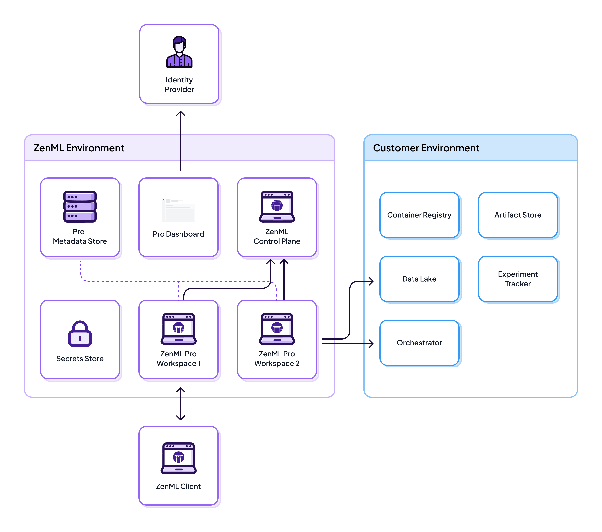

# Cloud Architecture


ZenML Cloud is currently in the beta phase. We are offering users the opportunity to host a managed ZenML instance and to gain early access to the exciting new features mentioned above. Beta users will receive priority access to the enhanced functionalities and dedicated support to ensure a smooth onboarding experience. 

[Let us know on Slack](https://zenml.io/slack) if you would like to see other deployment scenarios with ZenML Cloud.


Machine learning often involves data that is sensitive and thus data security is a fundamental requirement. The ZenML Cloud is flexible enough to meet your security requirements, from easy installations to completely airgapped deployments.

The ZenML Cloud consists of the following moving pieces:

* ZenML Cloud API: This is a centralized MLOps control plane that includes a managed ZenML dashboard and a special ZenML server optimized for production MLOps workloads.

* MLflow Tracking Server: This is an optional add-on with ZenML Cloud that features a MLflow tracking server that may also include artifact storage or be configured to connect to a customer artifact storage solution (e.g. an AWS S3 bucket or a GCS bucket).

* ZenML Cloud Agent: This service is optionally deployed customer-side, and interacts with customer MLOps stack components on behalf of the remote ZenML Cloud control plane.

The above three interact with other MLOps stack components, secrets, and data in varying scenarios described below.


In this phase, the scenarios below are experimental and subject to change. For now, Scenario 2a is used by default when you [sign up for ZenML Cloud](https://cloud.zenml.io). For other scenarios, [contact us on Slack](https://zenml.io/slack).


## Scenario 1: Fully SaaS

<figure><figcaption>
Scenario 1: Fully SaaS deployment
</figcaption></figure>

In this scenario, all services are hosted on the ZenML Cloud infrastructure. The ZenML Cloud API and MLflow Tracking Server store secrets and data on the ZenML side. The Cloud API interacts with the customer cloud for certain actions like triggering pipelines, deploying models etc.

This scenario is meant for customers who want to quickly get started with ZenML Cloud and can to a certain extent allow ingress connections into their infrastructure from an external SaaS provider. Importantly, the data and secrets are all stored on ZenML Cloud side.

## Scenario 2a: Hybrid SaaS with partial data on ZenML

<figure><figcaption>
Scenario 2a: Hybrid SaaS deployment
</figcaption></figure>

This scenario builds on top of Scenario 1, with the exception being that some "Data Artifacts" move over the customer cloud, specifically the data produced by ZenML itself. This can be set up quite easily by setting up an [artifact store](../../stacks-and-components/component-guide/artifact-stores/) with your MLOps stack. However, the data logged via MLflow is still stored on the ZenML side (e.g. experiments, metadata, models).

This scenario is suitable for users who want the pipeline-centric data to be kept on their side, while they are less concerned about experiment data produced by MLflow.

## Scenario 2b: Hybrid SaaS with all data stored on the customer side

<figure><figcaption>
Scenario 2b: Hybrid SaaS with all data stored on the customer side

</figcaption></figure>

This scenario builds on top of Scenario 2b, with the exception being that **all** "Data Artifacts" move over the customer cloud, including the ones produced by MLflow.

In this scenario, the ZenML Cloud only stores metadata while the customer cloud keeps potentially sensitive user data. However, if the customer wants access to special ZenML Cloud features like viewing artifacts on the dashboard, triggering pipeline runs, etc then they have to also configure credentials and [service connectors](../../stacks-and-components/auth-management/service-connectors-guide.md) required to access some customer infrastructure services. Ultimately, these credentials end up being stored as secrets on the ZenML side. Therefore, while this scenario keeps the data on customer side, it still gives access to ZenML Cloud to trigger actions via ingress connections over the internet into the customer cloud.

Note, that ZenML encrypts all customer secrets at transit and at rest.

## Scenario 3a: Hybrid SaaS with no data on ZenML side + Customer Secret Store managed by ZenML

<figure><figcaption>
Scenario 3a: Hybrid SaaS with no data on ZenML side + Customer Secret Store managed by ZenML
</figcaption></figure>

This scenario is a version of Scenario 2b modified to store all sensitive information on the customer side. In this case, the customer connects their own secret store directly to the ZenML Cloud. All ZenML secrets used by running pipelines to access infrastructure services and resources are stored in the customer secret store. This allows users to use [service connectors](../../stacks-and-components/auth-management/service-connectors-guide.md) and the [secrets API](../../user-guide/advanced-guide/secret-management/) to authenticate ZenML pipelines and the ZenML Cloud to 3rd party services and infrastructure while ensuring that credentials are always stored on the customer side.

Even though they are stored customer side, access to ZenML secrets is fully managed by the ZenML Cloud. The ZenML Cloud is also allowed to use some of those credentials to connect directly to customer infrastructure services to implement control plane features such as artifact visualization or triggering pipelines. This implies that the secret values are allowed to leave the customer environment to allow their access to be managed centrally by the ZenML Cloud and to enforce access control policies, but the ZenML users and pipelines never have direct access to the secret store.

## Scenario 3b: Hybrid SaaS with no data on ZenML side + Private Secret Store

<figure><figcaption>
Scenario 3b: Hybrid SaaS with no data on ZenML side + Private Secret Store
</figcaption></figure>

This is almost the same as Scenario 3a, with one important difference: customer secrets are isolated from the ZenML Cloud. This allows users to use [service connectors](../../stacks-and-components/auth-management/service-connectors-guide.md) and the [secrets API](../../user-guide/advanced-guide/secret-management/) to authenticate ZenML to 3rd party services and infrastructure while ensuring their secrets do not leave their environment.

The ZenML secret store still exists, and this is to still give customers the option to allow ZenML Cloud to connect to their environment to enable features such as visualizing artifacts and triggering actions from the ZenML Cloud dashboard.

## Scenario 4: Agent Architecture

<figure><figcaption>
Scenario 3: ZenML Agent deployment
</figcaption></figure>

This scenario adds a new architectural component into the mix, called the ZenML Agent, which facilitates communication between the two clouds. The customer is responsible for deploying and maintaining the ZenML Agent in their environment. The agent acts as an intermediate step for all operations and information that needs to be exchanged between ZenML cloud and other customer stack components, like the artifact store. This means that all features like visualizing data artifacts in the dashboard and triggering pipelines from the dashboard are fully available, but only the ZenML Agent has access to customer secrets and accesses the customer's infrastructure services. 

The advantage of this deployment is that the ZenML Cloud does not need direct access to any sensitive secrets to trigger actions customer-side. The ZenML Agent executes all operations that require access to secrets or customer infrastructure on behalf of the ZenML Cloud. Secrets and data remain on the customer environment, and only one secure ingress connection is established. 

Here is a concrete example of how this works:

* The ZenML Cloud API asks the agent to fetch an artifact for visualization.
* The agent connects to the S3 bucket directly with the credentials configured by the customer and stored in the customer secret store or via a service connector. 
* Credentials never have to leave the agent.
* The agent fetches the artifact and sends it back to the Cloud API.
* The Cloud API sends the visualization to the dashboard.

## Scenario 5: Fully On-prem

<figure><figcaption>
Scenario 4: Fully on-premises deployment
</figcaption></figure>

In this scenario, all services, data, and secrets are deployed on the customer cloud. This is the opposite of Scenario 1, and is meant for customers who require completely airgapped deployments, for the tightest security standards.

Are you interested in the ZenML Cloud? While in beta, we're looking for early adopters to talk to! [Sign up](https://cloud.zenml.io) and get access to Scenario 2a with a free 30 day trial now!

<figure><figcaption></figcaption></figure>