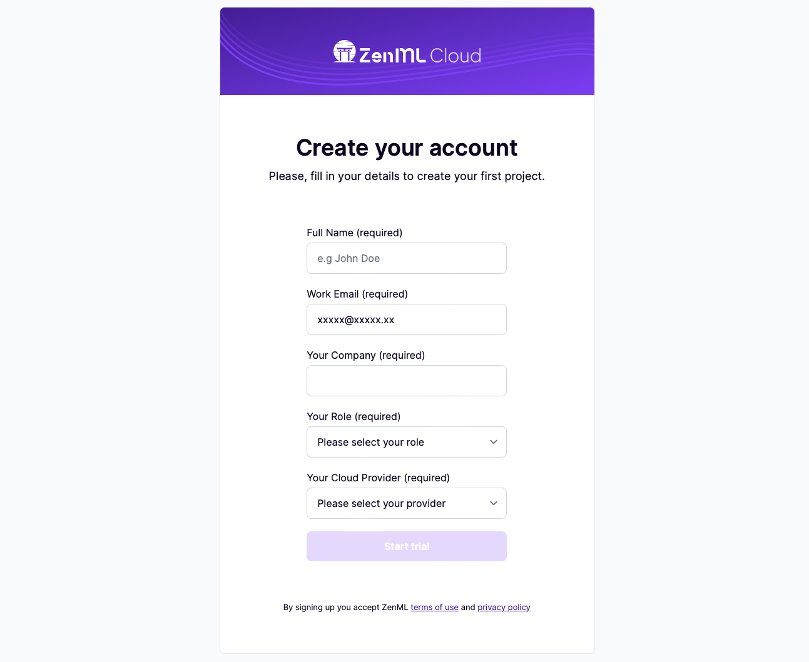
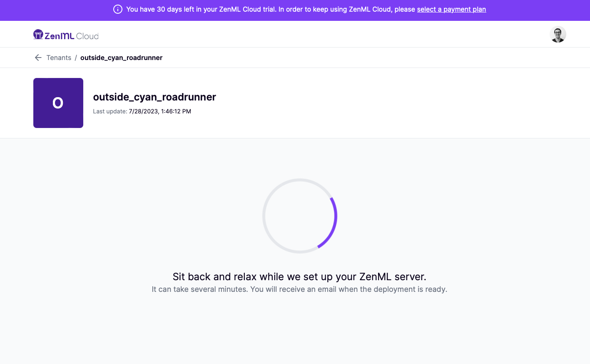
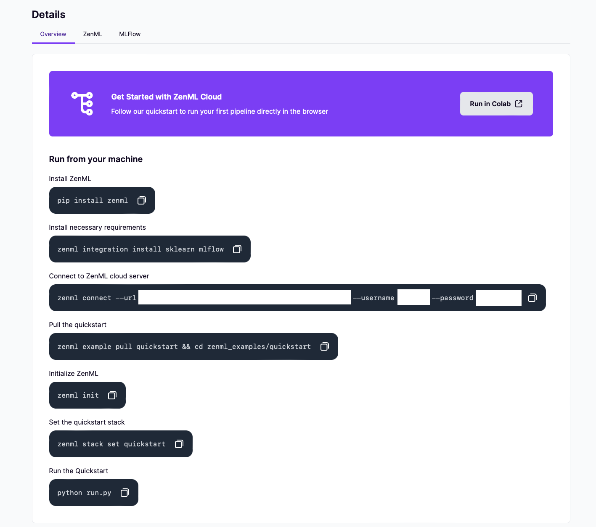


This is an older version of the ZenML documentation. To read and view the latest version please [visit this up-to-date URL](https://docs.zenml.io).


# Get started

This page will walk you through the simple steps to sign up for the ZenML Cloud and gain access to a managed ZenML server instance, called a tenant, with exciting new features.

<figure><figcaption></figcaption></figure>

## Step 1: Sign-Up

Visit [the ZenML website](https://www.zenml.io/home) and navigate to the ZenML Cloud sign-up page. You can find it in the top-right corner.

On the ZenML Cloud sign-up page, you will have the option to sign up using either your Google account or your GitHub account. Click on the respective button to proceed with your preferred sign-up method.

After successfully signing in with your Google or GitHub account, you will be asked to complete your ZenML Cloud profile. Provide any additional information required to set it up, such as your name, email address, and organization details.

<figure><figcaption></figcaption></figure>

## Step 2: Automatic tenant creation

Upon completing the sign-up process, you will gain access to a free trial period lasting for 30 days. You will have access to a ZenML tenant (automatically created for you behind the scenes) for the duration of this trial period. This setup process typically takes a few minutes to complete, and once it's ready you will receive an email notification. This will mark the beginning of your 30-day trial, allowing you to explore and experience the benefits of ZenML's features firsthand.

<figure><figcaption></figcaption></figure>

## Step 3: Run your first pipeline

Once your tenant is ready, you will be provided with a set of instructions. Following these instructions will guide you through the process of running your first pipeline, ensuring that your tenant is fully functional and operational.

<figure><figcaption></figcaption></figure>

Congratulations! You are now a part of the ZenML Cloud and have successfully set up your first managed ZenML instance. We appreciate your participation in the beta phase and value your feedback to improve the ZenML Cloud experience further. If you have any questions or need assistance, please don't hesitate to reach out to our dedicated support team.

<figure><figcaption></figcaption></figure>
