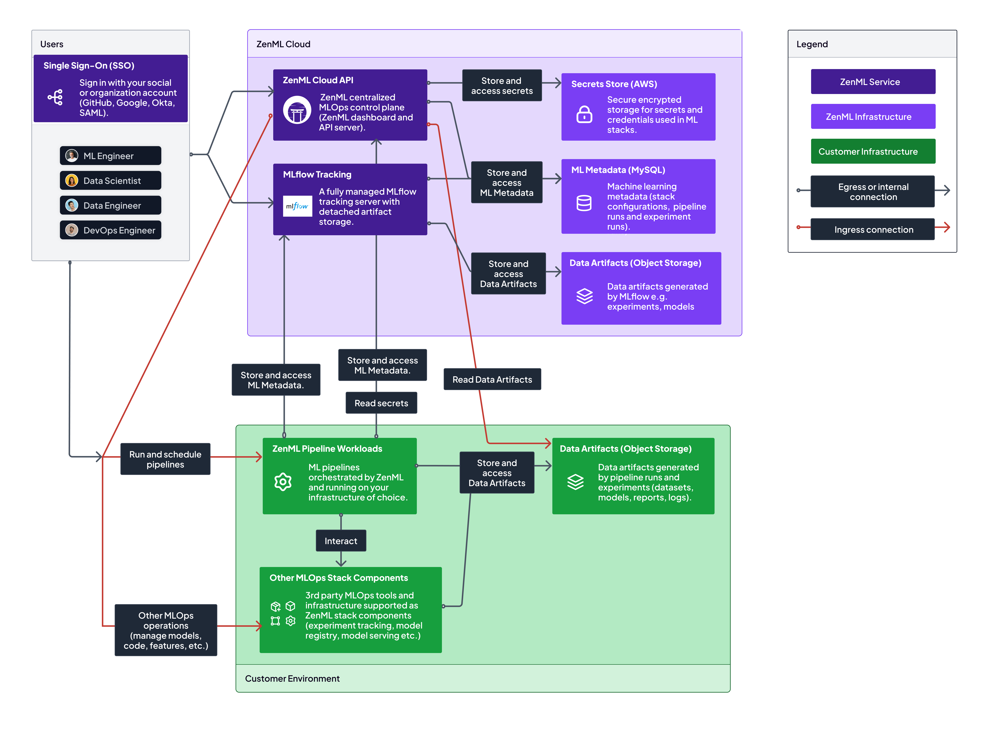

# ☁ ZenML Cloud

ZenML Cloud is a Software-as-a-Service (SaaS) platform that extends the capabilities of the open-source ZenML product. It provides you with a centralized control plane to effortlessly launch and manage their ZenML server instances. The core foundation of ZenML Cloud remains the powerful open-source offering, but with ZenML Cloud, you gain access to a host of additional features designed to streamline the machine learning workflow.

<figure><figcaption>
An architectural overview of the ZenML Cloud
</figcaption></figure>

## Key features

ZenML Cloud brings convenience to your machine learning workflows by allowing you to deploy a managed instance of ZenML servers with a single click. This means you can set up and manage your machine learning pipelines effortlessly without the hassle of dealing with infrastructure complexities. We take care of all the necessary upgrades and backups, ensuring that your system remains up-to-date and resilient while you focus on your core MLOps tasks. As a valued cloud customer, you'll also benefit from priority support, ensuring that you receive the assistance you need to make the most of our platform.

Data security and privacy are of utmost importance at ZenML Cloud. You can connect your infrastructure safely and securely and we track only metadata through an encrypted connection, ensuring that your sensitive information remains confidential. Our platform offers seamless integration with your cloud services through service connectors, making it easy to connect and utilize various cloud resources without compromising data security. Additionally, we store your secrets in a safe and secure isolated environment, providing an extra layer of protection for your valuable data.

As a ZenML Cloud user, you also gain early access to a powerful control plane that centralizes user management and streamlines your workflows. With centralized management of users, handling access and permissions becomes efficient and organized. Moreover, ZenML Cloud users enjoy exclusive access to a range of cloud-only features, providing you with a competitive edge and the opportunity to stay ahead in the rapidly evolving field of machine learning.


ZenML Cloud is currently in the beta phase, offering users the opportunity to host a managed ZenML instance and gain early access to the exciting new features mentioned above. Beta users will receive priority access to the enhanced functionalities and dedicated support to ensure a smooth onboarding experience.


## Coming soon...

<table data-card-size="large" data-view="cards" data-full-width="true"><thead><tr><th></th><th></th><th data-hidden data-card-target data-type="content-ref"></th></tr></thead><tbody><tr><td><mark style="color:purple;"><strong>CI/CD/CT with Triggers</strong></mark></td><td>Continuous Integration, Continuous Deployment, and Continuous Training are all integrated into your repository.</td><td><a href="https://zenml.io/cloud-features/continuous-integration-and-delivery-ci-cd">https://zenml.io/cloud-features/continuous-integration-and-delivery-ci-cd</a></td></tr><tr><td><mark style="color:purple;"><strong>ML Model Control Plane</strong></mark></td><td>All your models are conveniently gathered in one place. Up-to-date information about your training, deployments, and endpoints all within one view.</td><td><a href="https://zenml.io/cloud-features/ml-models-control-plane">https://zenml.io/cloud-features/ml-models-control-plane</a></td></tr><tr><td><mark style="color:purple;"><strong>Managed MLOps infrastructure</strong></mark></td><td>ZenML Cloud also includes hosted instances of support stack components like MLflow.</td><td><a href="https://zenml.io/cloud-features/managed-ml-ops-infrastructure">https://zenml.io/cloud-features/managed-ml-ops-infrastructure</a></td></tr><tr><td><mark style="color:purple;"><strong>Tenants and Workspaces</strong></mark></td><td>Create multiple ZenML tenants and workspaces within tenants to subdivide your team's efforts neatly.</td><td><a href="https://zenml.io/cloud-features/tenants-and-workspaces">https://zenml.io/cloud-features/tenants-and-workspaces</a></td></tr><tr><td><mark style="color:purple;"><strong>User Management</strong></mark></td><td>User permission management and project-specific configurations</td><td><a href="https://zenml.io/cloud-features/user-management">https://zenml.io/cloud-features/user-management</a></td></tr><tr><td><mark style="color:purple;"><strong>Role Based Access Control</strong></mark></td><td>Manage permissions and roles at an organizational level</td><td><a href="https://zenml.io/cloud-features/role-based-access-control">https://zenml.io/cloud-features/role-based-access-control</a></td></tr></tbody></table>

<figure><figcaption></figcaption></figure>
