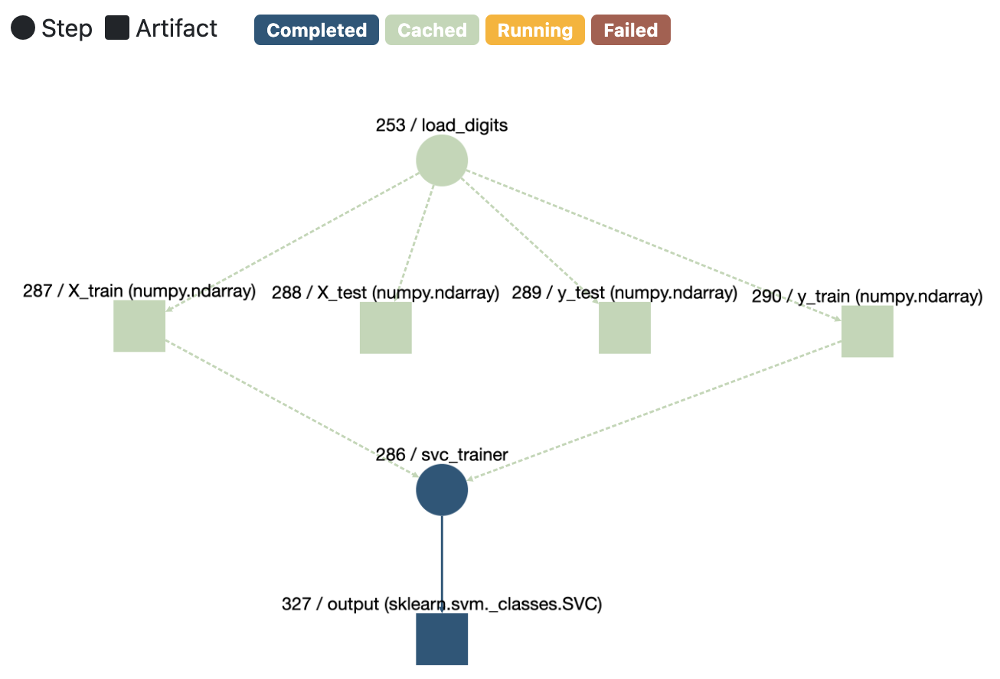
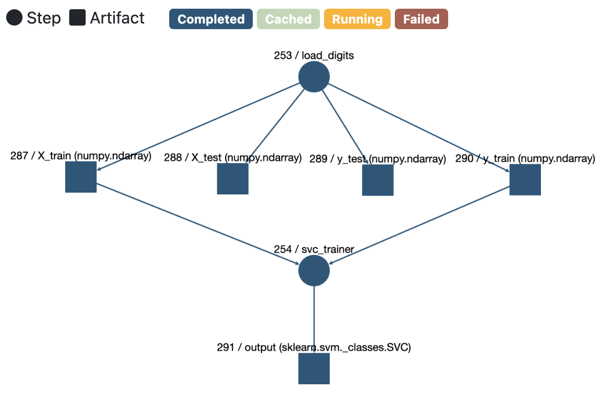
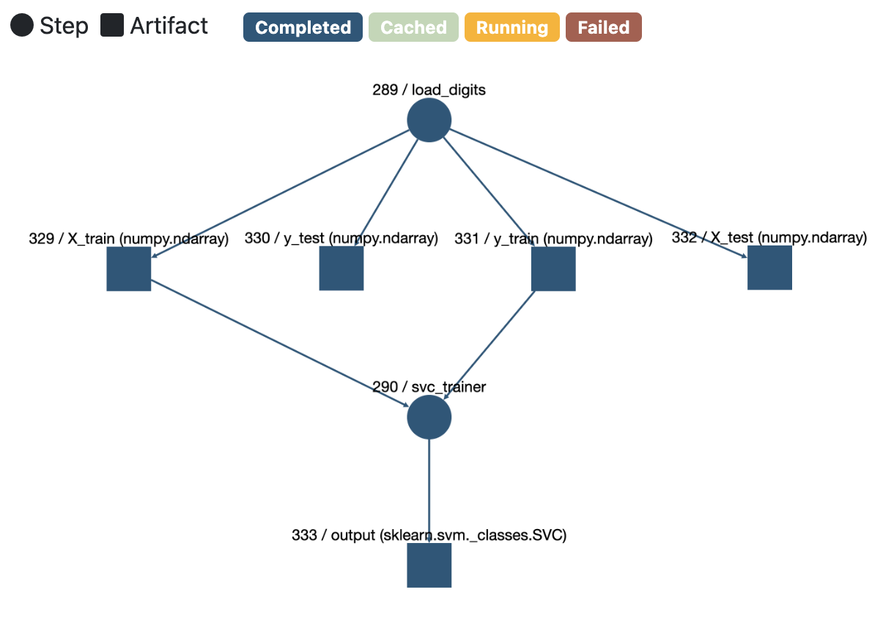


This is an older version of the ZenML documentation. To read and view the latest version please [visit this up-to-date URL](https://docs.zenml.io).



ZenML's **Dash** integration provides a `PipelineRunLineageVisualizer` that can
be used to visualize pipeline runs in your local browser, as shown below:



## Requirements

Before you can use the Dash visualizer, you first need to install ZenML's Dash
integration:

```shell
zenml integration install dash -y
```


See the [Integrations](../../mlops-stacks/integrations.md) page for more
details on ZenML integrations and how to install and use them.


## Visualizing Pipelines

After a pipeline run has been started, we can access it using the 
[Repository](../stacks-profiles-repositories/repository.md),
as you learned in the last section on 
[Inspecting Finished Pipeline Runs](./inspecting-pipeline-runs.md).

We can then visualize a run using the `PipelineRunLineageVisualizer` class:

```python
from zenml.integrations.dash.visualizers.pipeline_run_lineage_visualizer import (
    PipelineRunLineageVisualizer,
)
from zenml.repository import Repository


repo = Repository()
latest_run = repo.get_pipeline(<PIPELINE_NAME>).runs[-1]
PipelineRunLineageVisualizer().visualize(latest_run)
```

This will open an interactive visualization in your local browser at 
`http://127.0.0.1:8050/`, where squares represent your artifacts and circles
your pipeline steps. 


The different nodes are color-coded in the visualization, so if
your pipeline ever fails or runs for too long, you can find the responsible 
step at a glance, as it will be colored red or yellow respectively.


### Visualizing Caching

In addition to `Completed`, `Running`, and `Failed`, there is also a separate
`Cached` state. You already learned about caching in a previous section on
[Caching Pipeline Runs](./caching.md). Using the `PipelineRunLineageVisualizer`,
you can see at a glance which steps were cached (green) and which were rerun (blue).
See below for a detailed example.

## Code Example

In the following example we use the `PipelineRunLineageVisualizer` to visualize
the three pipeline runs from the [Caching Pipeline Runs Example](./caching.md#code-example):

<details>
<summary>Code Example of this Section</summary>

```python
import numpy as np
from sklearn.base import ClassifierMixin
from sklearn.svm import SVC

from zenml.integrations.sklearn.helpers.digits import get_digits
from zenml.steps import BaseStepConfig, Output, step
from zenml.pipelines import pipeline

from zenml.integrations.dash.visualizers.pipeline_run_lineage_visualizer import (
    PipelineRunLineageVisualizer,
)
from zenml.repository import Repository


@step
def load_digits() -> Output(
    X_train=np.ndarray, X_test=np.ndarray, y_train=np.ndarray, y_test=np.ndarray
):
    """Loads the digits dataset as normal numpy arrays."""
    X_train, X_test, y_train, y_test = get_digits()
    return X_train, X_test, y_train, y_test


class SVCTrainerStepConfig(BaseStepConfig):
    """Trainer params"""
    gamma: float = 0.001


@step(enable_cache=False)  # never cache this step, always retrain
def svc_trainer(
    config: SVCTrainerStepConfig,
    X_train: np.ndarray,
    y_train: np.ndarray,
) -> ClassifierMixin:
    """Train a sklearn SVC classifier."""
    model = SVC(gamma=config.gamma)
    model.fit(X_train, y_train)
    return model


@pipeline
def first_pipeline(step_1, step_2):
    X_train, X_test, y_train, y_test = step_1()
    step_2(X_train, y_train)


first_pipeline_instance = first_pipeline(
    step_1=load_digits(),
    step_2=svc_trainer()
)


# The pipeline is executed for the first time, so all steps are run.
first_pipeline_instance.run()
latest_run= first_pipeline_instance.get_runs()[-1]
PipelineRunLineageVisualizer().visualize(latest_run)

# Step one will use cache, step two will rerun due to the decorator config
first_pipeline_instance.run()
latest_run = first_pipeline_instance.get_runs()[-1]
PipelineRunLineageVisualizer().visualize(latest_run)

# The complete pipeline will be rerun
first_pipeline_instance.run(enable_cache=False)
latest_run = first_pipeline_instance.get_runs()[-1]
PipelineRunLineageVisualizer().visualize(latest_run)
```

### Expected Visualizations

#### Run 1:



#### Run 2:


#### Run 3:



</details>