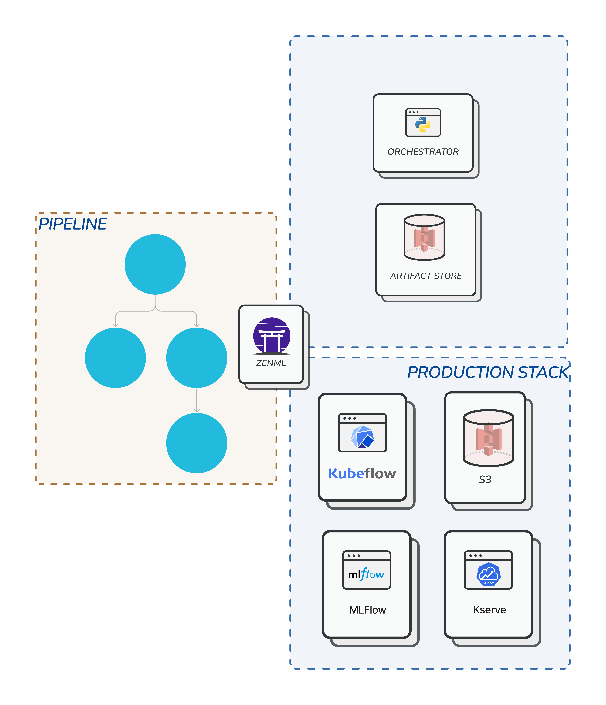
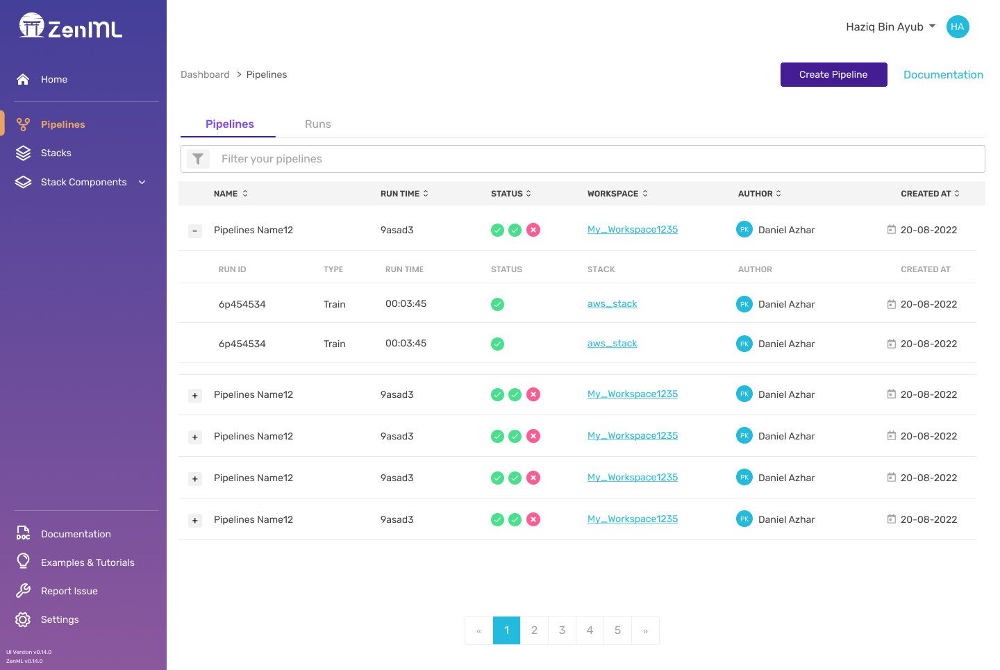


This is an older version of the ZenML documentation. To read and view the latest version please [visit this up-to-date URL](https://docs.zenml.io).


# Core Concepts

ZenML consists of a few components. This guide walks through the various pieces you'll encounter, starting from the basics to things you'll only encounter when deploying to the cloud. 

Here's a high-level overview of a typical ZenML workflow:

1. Writing a *[pipeline](../starter-guide/pipelines/pipelines.md)* to define what happens in your machine learning workflow.
2. Configuring a ZenML *[stack](../starter-guide/stacks/stacks.md)*.
3. Switching between *stacks* depending on needs.
4. Customizing your *stack* with different *[components](../starter-guide/stacks/registering-stacks.md)*.

So first, the basics.

## Pipelines and Steps

At its core, ZenML follows a pipeline-based workflow for your data projects.
A **pipeline** consists of a series of **steps**, organized in any order that makes sense for your use case. 

Below, you can see three **steps** running one after another in a **pipeline**. 

The steps might have dependencies between them. 
For example, a step might use the outputs from a previous step and thus must wait until the previous step completes before starting. This is something you can keep in mind when organizing your steps.

You can have multiple pipelines for different purposes. For example, a training pipeline to train and evaluate models and an inference pipeline to serve the model.

Pipelines and steps are defined in code using Python *[decorators](https://www.freecodecamp.org/news/python-decorators-explained-with-examples/)* or *classes*.
This is where the core business logic and
value of your work lives, and you will spend most of your time defining these two things. Your code lives inside a Repository, which is the main abstraction within which your project-specific pipelines should live.

When it comes to running your pipeline, ZenML offers an abstraction to handle how your pipeline gets run. This is where **Stacks** come into play.

## Stacks and Stack Components
A **Stack** is the configuration of the underlying infrastructure and choices around how your pipeline will be run. For example, you can choose to run your pipeline locally or on the cloud by changing the stack you use.

ZenML comes with a default stack that runs locally, as seen in the following diagram:

In any Stack, there **must** be at least two basic **Stack Components** - an *orchestrator* and an *artifact store*.

### Orchestrator

An **Orchestrator** is the workhorse that coordinates all the steps to run in a pipeline.

Since pipelines can be set up with complex combinations of steps with various asynchronous dependencies between them, the Orchestrator is the component that decides what steps to run, when, and how to pass data between the steps.

ZenML comes with a default *local orchestrator* designed to run on your local machine. This is useful especially during the exploration phase of your project. You don't have to rent a cloud instance just to try out basic things.

Once the pipeline is established you can switch to a full-fledged cloud stack that uses more sophisticated orchestrators like the Airflow or Kubeflow orchestrator. See the list of all orchestrators [here](../component-gallery/orchestrators/orchestrators.md).

### Artifact Store

An **Artifact Store** is a component that houses all data that pass through the pipeline.
Data in the artifact store are called *artifacts*.

These artifacts may have been produced by the pipeline steps, or they may be the
data ingested into a pipeline via an importer step.
The artifact store houses all intermediary pipeline step results.

The fact that all your data inputs and outputs are tracked
and versioned in the artifact store allows for extremely useful features
like data caching which speeds up your workflow. See the list of all supported artifact stores [here](../component-gallery/artifact-stores/artifact-stores.md).

### Other Stack Components

We've covered the two basic stack components that you will encounter most frequently. They work well on a local machine, but is rarely enough in production.

At some point, you might want to scale up your stack to run elsewhere, for example on a cloud with powerful GPUs for training or CPU's for deployment.

ZenML provides many other stack components to suit these use cases.
Having these components in your stack supercharges your pipeline for production.

For other stack components check out this [page](../component-gallery/categories.md).

## Switching Stacks to Scale Up

We've seen how to run a pipeline locally. But that is rarely enough in production machine learning which typically involves cloud infrastructure.

What's really cool with using ZenML is you can easily switch your stack from running on a local machine to running on the cloud with a single CLI command.

The rest of the code defining your steps and pipelines stays the same, whether it's running on a local machine or a cloud infrastructure of your choice.
The only change is in the stack and its components.

Below is an illustration showing how the same pipeline on a local machine can be scaled up to run on a full-fledged cloud infrastructure by switching stacks. You get all the benefits of using cloud infrastructures with minimal changes in your code.

## ZenML Server and Dashboard

In order to run *stack components* that are running on infrastructure on the cloud, ZenML itself needs to deployed to the cloud first, so that it can communicate with these stack components.

A **ZenML Server** keeps track of all the bits of metadata around a pipeline run. It allows you to fetch specific steps from your pipeline run and their output artifacts in a post-execution workflow. With a ZenML server, you are able to access all of your previous experiments with the associated details.
This is extremely helpful in troubleshooting.

The **ZenML Dashboard** also communicates with the ZenML Server to visualize your *pipelines*, *stacks*, and *stack components*. The dashboard serves as a visual interface to showcase collaboration with ZenML. You can invite *users*, and share your stacks with them.

When you start working with ZenML, you'll start with a local ZenML setup, and when you want to transition you will need to [deploy ZenML](./deploying-zenml/deploying-zenml.md). Don't worry though, there is a one-click way how to do it which we'll learn about [later](../starter-guide/collaborate/collaborate.md).

## Other Bits and Pieces

There are lots of different ways to use ZenML which will depend on your precise
use case. The following concepts and stack components are things you'll possibly
encounter further down the road while using ZenML.

- **Materializers** - ZenML stores the data inputs and outputs to your steps in the
  Artifact Store as we saw above. In order to store the data, it needs to
  serialize everything in a format that can fit into the Artifact Store. ZenML
  handles serialization (and deserialization) of the most common artifacts, but
  if you try to do something we haven't already thought of you'll need to write
  your own custom materializer. This isn't hard, but you should be aware that
  it's something you might need do to. The ZenML CLI will let you know with a
  clear error message when you need to do this.
- **Service** - A service is a longer-lived entity that extends the capabilities of
  ZenML beyond the run of a pipeline. For example, a service could be a
  prediction service that loads models for inference in a production setting.
- **Integrations** - ZenML ships with many [integrations](https://zenml.io/integrations) into many MLOps tools for various use-cases, usually in the form of pre-made *stack components* or *steps* .

There's a lot more detail to digest when it comes to ZenML, but with the above
you should be sufficiently armed to understand how the framework works and where
you might want to extend it.
