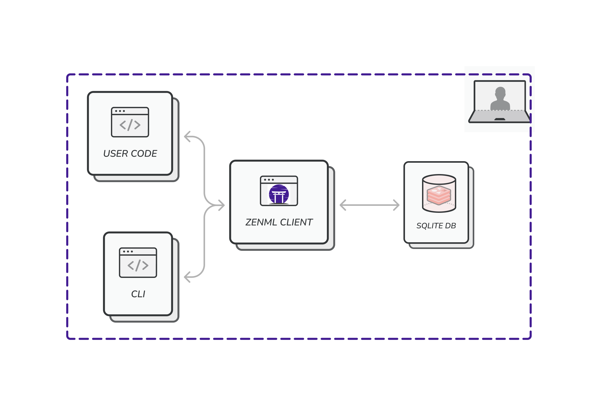
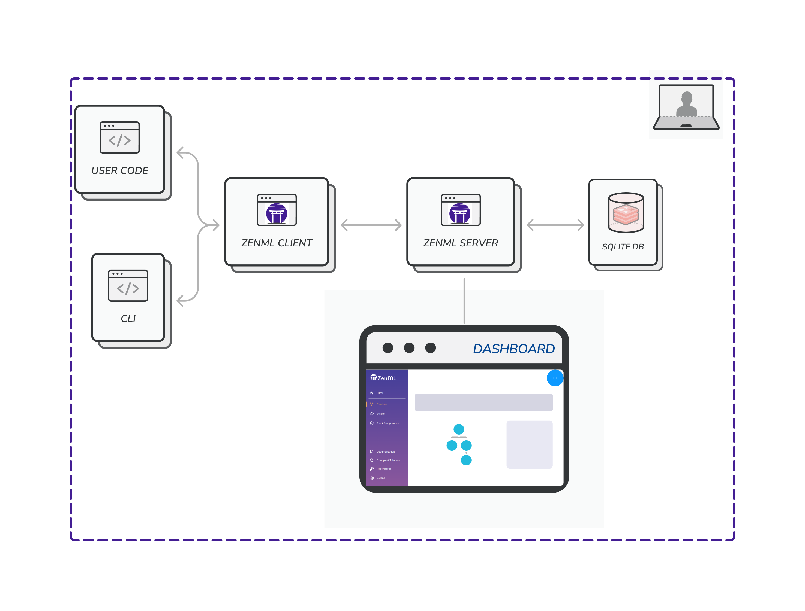
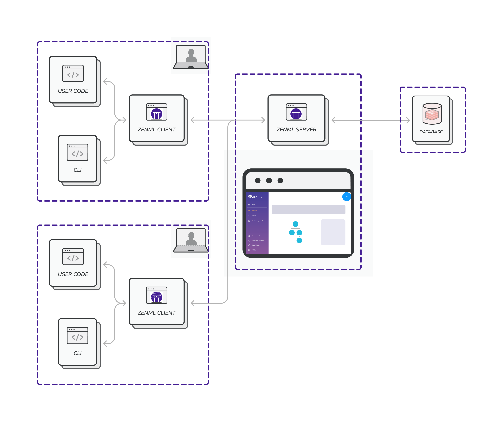

# 🤔 Deploying ZenML

Moving your ZenML Server to a production environment offers several benefits over staying local:

1. **Scalability**: Production environments are designed to handle large-scale workloads, allowing your models to process more data and deliver faster results.
2. **Reliability**: Production-grade infrastructure ensures high availability and fault tolerance, minimizing downtime and ensuring consistent performance.
3. **Collaboration**: A shared production environment enables seamless collaboration between team members, making it easier to iterate on models and share insights.

Despite these advantages, transitioning to production can be challenging due to
the complexities involved in setting up the needed infrastructure.

## Components

### ZenML Server

When you first get started with ZenML, it relies with the following architecture on your machine.

The SQLite database that you can see in this diagram is used to store information about pipelines, pipeline runs, stacks, and other configurations. Users can run the `zenml up` command to spin up a local REST server to serve the dashboard. The diagram for this looks as follows:


For the local REST server option, the `zenml up` command implicitly connects the client to the server.



Currently the ZenML server supports two versions of the dashboard: a legacy view
and a brand-new view. To use the legacy version simply use the following
command: `zenml up --legacy`.


In order to move into production, the ZenML server needs to be deployed somewhere centrally so that the different cloud stack components can read from and write to the server. Additionally, this also allows all your team members to connect to it and share stacks and pipelines.

TODO: MORE ON ZENML SERVER HERE

### ZenML Client

TODO: MORE ON ZENML CLIENT HERE

### Client-Server Interaction

TODO: MORE ON CLIENT-SERVER INTERACTION HERE

## Deploying a ZenML Server

Deploying the ZenML Server is a crucial step towards transitioning to a production-grade environment for your machine learning projects. By setting up a deployed ZenML Server instance, you gain access to powerful features, allowing you to use stacks with remote components, centrally track progress, collaborate effectively, and achieve reproducible results.

Currently, there are two main options to access a deployed ZenML server:

1. **SaaS:** With [ZenML Pro](../zenml-pro/zenml-pro.md) offering you can utilize a control plane to create ZenML servers, also known as tenants. These tenants are managed and maintained by ZenML's dedicated team, alleviating the burden of server management from your end. Importantly, your data remains securely within your stack, and ZenML's role is primarily to handle tracking of metadata and server maintenance.
2. **Self-hosted Deployment:** Alternatively, you have the ability to deploy ZenML on your own self-hosted environment. This can be achieved through various methods, including using [our CLI](deploy-with-zenml-cli.md), [Docker](../../component-guide/model-registries/model-registries.md), [Helm](deploy-with-helm.md), or [HuggingFace Spaces](deploy-using-huggingface-spaces.md). We also offer our Pro version for self-hosted deployments, so you can use our full paid feature-set while staying fully in control with an airgapped solution on your infrastructure.


Currently the ZenML server supports a legacy and a brand-new version of the dashboard. To use the legacy version which supports stack registration from the dashboard simply set the following environment variable in the deployment environment: `export ZEN_SERVER_USE_LEGACY_DASHBOARD=True`.


Both options offer distinct advantages, allowing you to choose the deployment approach that best aligns with your organization's needs and infrastructure preferences. Whichever path you select, ZenML facilitates a seamless and efficient way to take advantage of the ZenML Server and enhance your machine learning workflows for production-level success.

### How to deploy ZenML

Documentation for the various deployment strategies can be found in the following pages below (in our 'how-to' guides):

<table data-card-size="large" data-view="cards"><thead><tr><th></th><th></th><th data-hidden></th><th data-hidden data-type="content-ref"></th><th data-hidden data-card-target data-type="content-ref"></th></tr></thead><tbody><tr><td><mark style="color:purple;"><strong>Deploy with ZenML CLI</strong></mark></td><td>Deploying ZenML on cloud using the ZenML CLI.</td><td></td><td></td><td><a href="https://docs.zenml.io/getting-started/deploying-zenml/deploy-with-zenml-cli">deploy-with-zenml-cli.md</a></td></tr><tr><td><mark style="color:purple;"><strong>Deploy with Docker</strong></mark></td><td>Deploying ZenML in a Docker container.</td><td></td><td></td><td><a href="https://docs.zenml.io/getting-started/deploying-zenml/deploy-with-docker">deploy-with-docker.md</a></td></tr><tr><td><mark style="color:purple;"><strong>Deploy with Helm</strong></mark></td><td>Deploying ZenML in a Kubernetes cluster with Helm.</td><td></td><td></td><td><a href="https://docs.zenml.io/getting-started/deploying-zenml/deploy-with-helm">deploy-with-helm.md</a></td></tr><tr><td><mark style="color:purple;"><strong>Deploy with HuggingFace Spaces</strong></mark></td><td>Deploying ZenML to Hugging Face Spaces.</td><td></td><td></td><td><a href="https://docs.zenml.io/getting-started/deploying-zenml/deploy-using-huggingface-spaces">deploy-with-hugging-face-spaces.md</a></td></tr></tbody></table>

<figure><figcaption></figcaption></figure>
