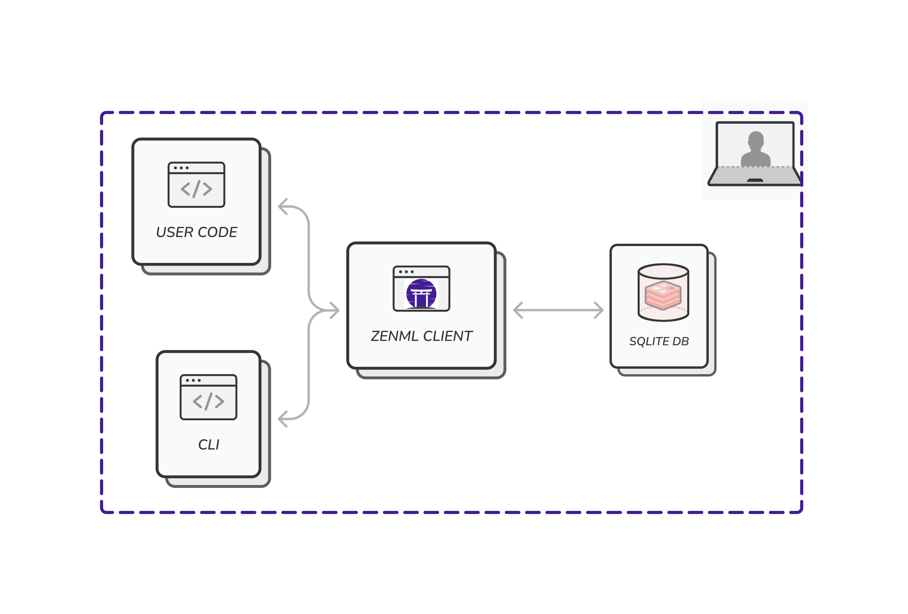
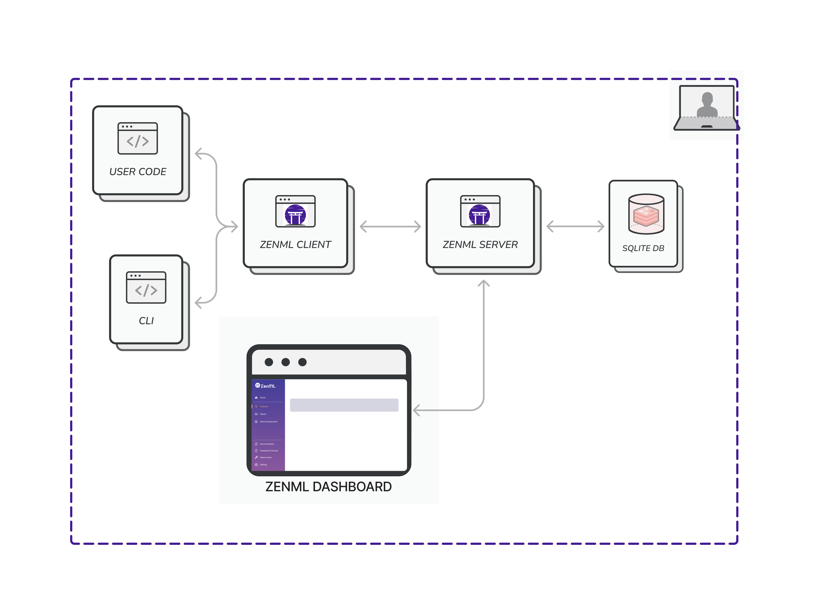
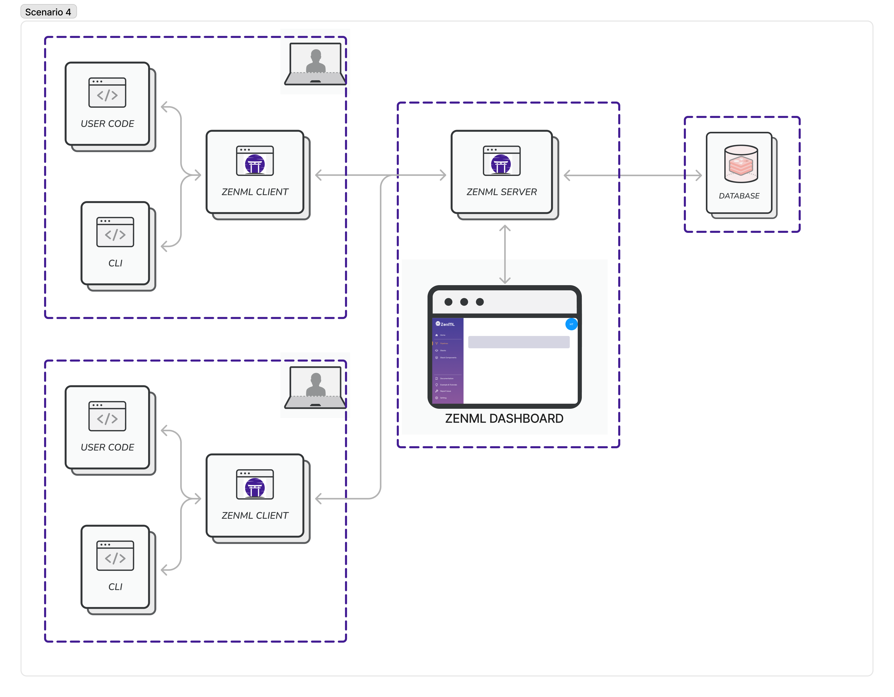
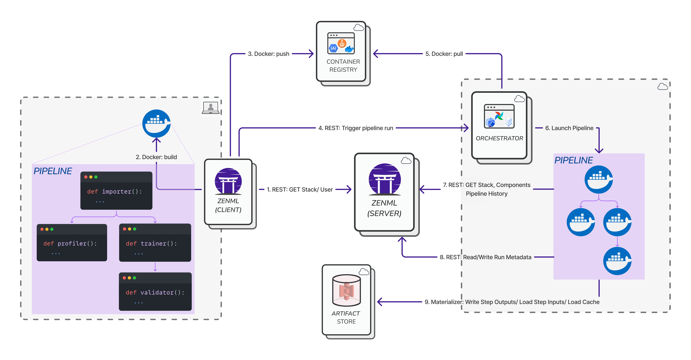


This is an older version of the ZenML documentation. To read and view the latest version please [visit this up-to-date URL](https://docs.zenml.io).


ZenML is designed to live at the interface between all the ingredients to your
machine learning development environment. As such there is a lot of configuration
and metadata to keep track of. This means that ZenML does not only give users an
easy-to-use abstraction layer on top of their infrastructure and environments,
but also needs to act as a collaborative metadata store. To get a complete overview of
the architecture of ZenML, read [here](../architecture-diagrams.md).

As with any other service, however, ZenML needs to be deployed first in order to be able
to use it. This section covers the various scenarios when it comes to deploying ZenML,
from starting locally to transitioning to the cloud.

**Tip**: In order to skip deploying ZenML completely, or if you just want to get up and running
quickly, you can use an early version of [ZenML Enterprise](https://zenml.io/pricing)
where we'll give you a free and managed ZenML server!

## The components of a ZenML Deployment

A ZenML deployment can consist of the following three components:
- The ZenML client.
- A SQL database.
- An optional FastAPI HTTP server that exposes a RESTful API as well as a UI.

ZenML relies on a SQLAlchemy-compatible database to store all its data: stack 
configurations, pipeline runs etc. The location and type of this database can be 
freely chosen by the user. By default, a SQLite database is stored on your local 
host (see [Scenario 1](#running-zenml-locally)).

ZenML can also be deployed with an HTTP REST interface between the client machine
and the database. This is also the interface used by the ZenML dashboard when 
loaded in your browser. Especially in multi-user settings, this is the recommended
configuration scenario.

## Running ZenML Locally

Running ZenML locally is an easy way to experiment with your pipelines and design 
proof-of-concepts. Scenarios 1 and 2 below deal with the local deployment of ZenML.
In these scenarios, the ZenML client and database are both located on the same machine.

### Scenario 1: Direct interaction with Local SQLite

This is likely the first experience that users will run into. Simply `pip install 
zenml` and dive right in without having to worry about a thing. Your stacks,
stack components and pipeline runs all are stored in a SQLite database located
in your global configuration directory (e.g. at
`~/.config/zenml/local_stores/default_zen_store/zenml.db` if you're running on
Linux). The ZenML client creates and directly connects to this database. You
don't need to worry about a thing.

Users that wish to be fancy about how they connect to the database can find
out how to configure a different location for the SQLite database, or even a
different database altogether [here](../../guidelines/global-config.md).

### Scenario 2: Local Deployment of the HTTP server

In this use-case, a local version of the ZenML HTTP server is running on your 
machine and is using the same database as your local client in Scenario 1. All 
client calls go through REST API endpoints instead of writing directly to the 
database. This option allows you to visualize and navigate your stacks and 
tracked pipeline information in the ZenML dashboard.

Switching from Scenario 1 to Scenario 2 and back is as simple as running 
`zenml up` and `zenml down`.

ZenML natively supports running the HTTP server and dashboard either as a 
process running in the background or as a Docker container. By default, the 
`zenml up` command starts the HTTP server as a local daemon process that uses 
the same database configuration as your local client. A URL is provided where
the ZenML Dashboard can be loaded to show your available stacks, pipeline runs 
and team settings among other things. If you need to use Docker containers 
instead, you can find out more about Docker deployments [here](./docker.md).

## Deploying ZenML in the Cloud: Remote Deployment of the HTTP server and Database

For a lot of use cases like sharing stacks and pipeline information with your 
team and for using cloud services to run your pipelines, you have to deploy ZenML in the cloud. 

Your ZenML code interacts with the server across different concerns. For example, 
- your local machine connects to the server to read and write the stack configurations to allow collaboration. 
- the individual orchestrators and step operators communicate with the server to write and track your pipeline run data. 
- the dashboard is served from the server to give a UI interface to all of your metadata.

As such, it is important that you deploy ZenML in a way that is accessible from
your machine as well as from all stack components that need access to the server.
> If you are looking for a quick deployment without having to worry about configuring 
> the right access, the [`zenml deploy` CLI command ](./cli.md) is the way to go!

### Scenario 3: Server and Database hosted on cloud

This is similar to Scenario 2, with the difference that both the HTTP server
and the database are running remotely rather than on your local machine. This 
is how you can unleash the real collaborative power of ZenML. With this type of 
deployment, stacks and pipeline runs can be shared with other users across larger 
teams and organizations. If you are using cloud, or shared on-premise services 
to run your pipelines, such as Kubeflow, GitHub, Spark, Vertex AI, AWS Sagemaker 
or AzureML, a centralized shared ZenML Server is also the recommended deployment
strategy for ZenML, because these services will need to communicate with the 
ZenML server.

The diagram below shows the architecture: both the server and database are 
remote and can be provisioned and managed independently. The server takes the 
connection details of the database as one of its inputs and that's how they
work together. You can refer to the deployment options pages, to see how it's
done in each case.
Using a cloud deployment enables you to collaborate with your team members by 
sharing stacks and having visibility into the pipelines run by your team. This
new paradigm will also evolve to include more advanced access control features 
that you can use to manage the roles and responsibilities of everyone in your 
team through the ZenML Server.

Such a remote deployment unlocks ZenML to its full potential as the MLOps hub 
within your production stacks. The diagram below visualizes how a pipeline is 
run through a deployed ZenML Server with a remote orchestrator, artifact store
and container registry. 

You can use any of the following ways to get started:
- The [`zenml deploy` CLI command](./cli.md) that provides an easy interface to deploy on Kubernetes in AWS, GCP or Azure.
- A [Docker image](./docker.md) that you can run in any environment of your choice.
- A [Helm chart](./helm.md) that can be deployed to any Kubernetes cluster (on-prem or managed).

In the following pages, we take a look at each of those options.
