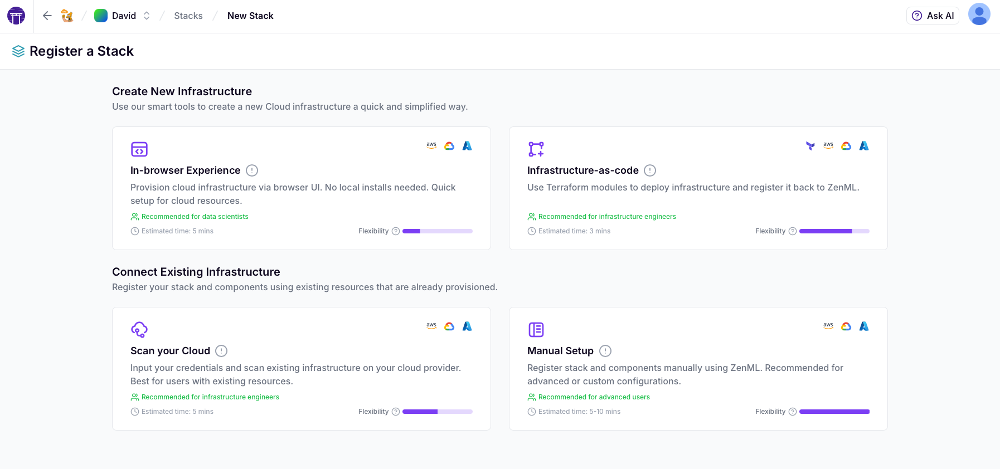
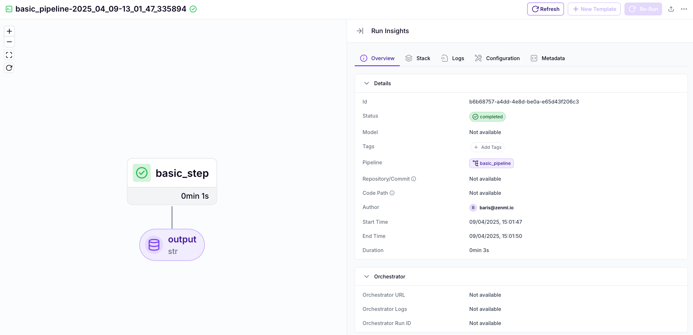

# Hello World

This guide will help you build and deploy your first ZenML pipeline, starting locally and then transitioning to the cloud without changing your code. The same principles you'll learn here apply whether you're building classical ML models or AI agents.



#### Install ZenML

Start by installing ZenML in a fresh Python environment:

```bash
pip install 'zenml[server]'
zenml login
```

This gives you access to both the ZenML Python SDK and CLI tools. It also surfaces the
ZenML dashboard + connects it to your local client.



#### Write your first pipeline

Create a simple `run.py` file with a basic workflow:

<pre class="language-python"><code class="lang-python">from zenml import step, pipeline


@step
def basic_step() -> str:
    """A simple step that returns a greeting message."""
    return "Hello World!"


@pipeline
def basic_pipeline():
    """A simple pipeline with just one step."""
    basic_step()


if __name__ == "__main__":
<strong>    basic_pipeline()
</strong></code></pre>


Run this pipeline locally with `python run.py`. ZenML automatically tracks the execution and stores artifacts.




#### Create your ZenML account

Create a [ZenML Pro account](https://zenml.io/pro) with a 14-day free trial (no payment information required). It will provide you with a dashboard to visualize pipelines, manage infrastructure, and collaborate with team members.

<figure><figcaption><p>The ZenML Pro Dashboard</p></figcaption></figure>

First-time users will need to set up a workspace and project. This process might take a few minutes. In the meanwhile, feel free to check out the [Core Concepts](core-concepts.md) page to get familiar with the main ideas ZenML is built on. Once ready, connect your local environment:

```bash
# Log in and select your workspace
zenml login

# Activate your project
zenml project set <PROJECT_NAME>
```



#### Create your first remote stack

A "stack" in ZenML represents the infrastructure where your pipelines run. Moving from local to cloud resources is where ZenML truly shines.

<figure><figcaption><p>Stack deployment options</p></figcaption></figure>

The fastest way to create a cloud stack is through the **Infrastructure-as-Code** option. This uses Terraform to deploy cloud resources and register them as a ZenML stack.

You'll need:

* [Terraform](https://developer.hashicorp.com/terraform/install) version 1.9+ installed locally
* Authentication configured for your preferred cloud provider (AWS, GCP, or Azure)
* Appropriate permissions to create resources in your cloud account

The deployment wizard will guide you through each step.



#### Run your pipeline on the remote stack

Now run your pipeline in the cloud without changing any code.

First, activate your new stack:

```bash
zenml stack set <NAME_OF_YOUR_NEW_STACK>
```

Then run the exact same script:

```bash
python run.py
```

ZenML handles packaging code, building containers, orchestrating execution, and tracking artifacts automatically.

<figure><figcaption><p>Your pipeline in the ZenML dashboard</p></figcaption></figure>



#### What's next?

Congratulations! You've just experienced the core value proposition of ZenML:

* **Write Once, Run Anywhere**: The same code runs locally during development and in the cloud for production
* **Unified Framework**: Use the same MLOps principles for both classical ML models and AI agents
* **Separation of Concerns**: Infrastructure configuration and ML code are completely decoupled, enabling independent 
evolution of each
* **Full Tracking**: Every run, artifact, and model is automatically versioned and tracked - whether it's a scikit-learn model or a multi-agent system

To continue your ZenML journey, explore these key topics:

**For All AI Workloads:**
* **Pipeline Development**: Discover advanced features like [scheduling](../how-to/steps-pipelines/advanced_features.md#scheduling) and [caching](../how-to/steps-pipelines/advanced_features.md#caching)
* **Artifact Management**: Learn how ZenML [stores, versions, and tracks your data](../how-to/artifacts/artifacts.md) automatically
* **Organization**: Use [tags](../how-to/tags/tags.md) and [metadata](../how-to/metadata/metadata.md) to keep your AI projects structured

**For LLMs and AI Agents:**
* **LLMOps Guide**: Write your [first AI pipeline](your-first-ai-pipeline.md) for agent development patterns
* **Agent Evaluation**: Learn to [systematically evaluate](https://github.com/zenml-io/zenml/tree/main/examples/agent_comparison) and compare different agent architectures
* **Prompt Management**: Version and track prompts, tools, and agent configurations as [artifacts](../how-to/artifacts/artifacts.md)

**Infrastructure & Deployment:**
* **Containerization**: Understand how ZenML [handles containerization](../how-to/containerization/containerization.md) for reproducible execution
* **Stacks & Infrastructure**: Explore the concepts behind [stacks](../how-to/stack-components/stack_components.md) and [service connectors](../how-to/stack-components/service_connectors.md) for authentication
* **Secrets Management**: Learn how to [handle sensitive information](../how-to/secrets/secrets.md) securely
* **Snapshots**: Create [reusable snapshots](../how-to/snapshots/snapshots.md) for standardized workflows


