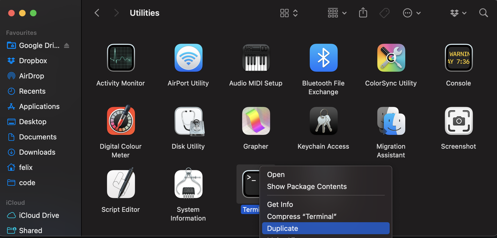
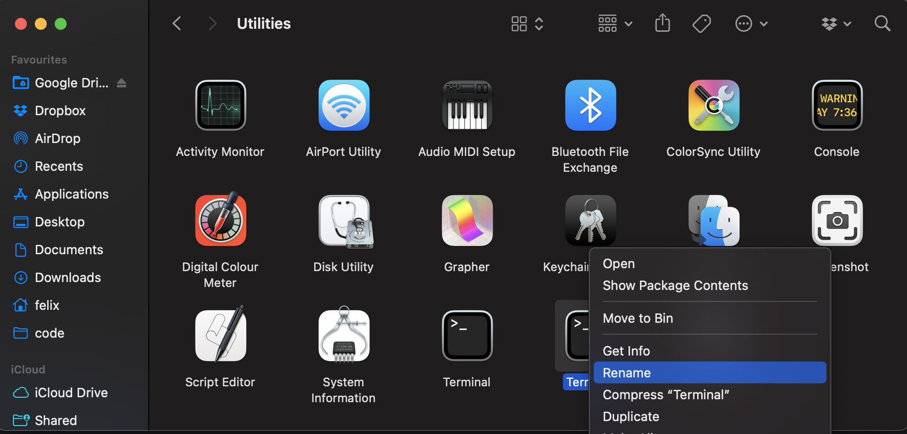

In order to run ZenML on Macs with M1 chips, you need to install Python under 
Rosetta 2. 
This issue arises because some of ZenML's dependencies aren’t fully compatible 
with the ARM64 Architecture.
The following step-by-step instructions will show you how you can install Python
and ZenML under Rosetta using the
[Homebrew (`brew`)](https://github.com/pyenv/pyenv) package manager and 
[`pyenv`](https://github.com/pyenv/pyenv) Python version manager.
The tutorial will assume that you are using the default 
[ZSH](https://www.zsh.org/) terminal.

## 1. Installing Rosetta

Depending on your machine, you might already have Rosetta installed. If not,
run the following command in your terminal to install it:

```
softwareupdate --install-rosetta
```

## 2. Running a Terminal under Rosetta

Next, you need a way to run your terminal under rosetta so you can install the
other dependencies later.

There are two ways how you can do this.

### Option 1: Start a Rosetta Terminal from Terminal

One option to start a Terminal under Rosetta is to execute the following command:

```
arch -x86_64 zsh -l
```

### Option 2: Add Rosetta Terminal to your Applications

Alternatively, you can add a Rosetta Terminal to your Applications folder by 
copying your existing Terminal application from `Applications/Utilities/Terminal`, renaming the copy, and setting the
`Open using Rosetta` checkbox as shown below:

#### 1. Go to Applications/Utilities


#### 2. Find 'Terminal'


#### 3. Copy 'Terminal'


#### 4. Rename the copy to 'Rosetta Terminal'


#### 5. Get Info on 'Rosetta Terminal'


#### 6. Check the 'Open using Rosetta' Checkbox


### Verifying whether you run under Rosetta

To check whether your terminal is running under Rosetta or not, use the `arch`
command:

```
arch
```

This should return `i386` if you are running under Rosetta.

### Using Rosetta Terminal in VSCode

If you are using VSCode, you can add a Rosetta terminal option by modifying
your `settings.json`. 
To do so, press `CMD + Shift + P`, search for 'Preferences: Open User Settings 
(JSON)', then add an entry into `terminal.integrated.profiles.osx` as shown
below.

```
"terminal.integrated.profiles.osx": {
    ...
    "rosetta": {
        "path": "arch",
        "args": ["-x86_64", "zsh", "-l"],
        "overrideName": true
    }
},
```

Optionally, you can also set Rosetta ZSH as the default terminal by setting
`terminal.integrated.defaultProfile.osx` accordingly:

```
"terminal.integrated.defaultProfile.osx": "rosetta",
```


## 3. Installing Homebrew under Rosetta

Next, we will install Homebrew under Rosetta and alias it to `brew86`.

To install Homebrew under Rosetta, use the following command:

```
arch -x86_64 /bin/bash -c "$(curl -fsSL https://raw.githubusercontent.com/Homebrew/install/master/install.sh)"
```

Then, run the following to create the `brew86` alias:

```
alias brew86="arch -x86_64 /usr/local/bin/brew"
```

## 4. Installing pyenv and pyenv-virtualenv under Rosetta with Brew

### Install Dependencies

To install pyenv, you first need to install its dependencies:

```
brew86 install openssl readline sqlite3 xz zlib tcl-tk
```

### Install pyenv

Then you can install pyenv under Rosetta via:

```
brew86 install pyenv
```

### Install pyenv-virtualenv

Similarly, you can install `pyenv-virtualenv` via:

```
brew86 install pyenv-virtualenv
```

### Create a pyenv86 Alias

Then we will again create an alias for running pyenv under Rosetta:

```
alias pyenv86="arch -x86_64 pyenv"
```

### Setting Environment Variables

Lastly, run the following lines to set the environment variables required by
pyenv in your `.zshrc`:

```
echo 'export PYENV_ROOT="$HOME/.pyenv"' >> ~/.zshrc
echo 'command -v pyenv >/dev/null || export PATH="$PYENV_ROOT/bin:$PATH"' >> ~/.zshrc
echo 'eval "$(pyenv init -)"' >> ~/.zshrc
```

Now you're all set and can run `pyenv86`

## 5. Installing Python under Rosetta with Pyenv

Now you're all set and can install the Python version of your choice via

```
pyenv86 install <PYTHON_VERSION>
```

E.g. to install the latest Python version that ZenML currently supports (3.9.14),
run:

```
pyenv86 install 3.9.14
```

## 6. Installing ZenML in a new virtual environment

Lastly, let's install ZenML in a new virtual environment.

### Create a Virtual Environment with pyenv-virtualenv

To create a new virtual environment called `zenml` based on Python 3.9.14, run:

```
pyenv virtualenv 3.9.14 zenml
```

### Activate a Virtual Environment with pyenv-virtualenv

You can then activate the virtual environment using

```
pyenv activate zenml
```

### Install ZenML

Finally, you can install ZenML in the virtual environment with pip:

```
pip install zenml
```

And that's it, you have successfully installed ZenML in Python 3.9 under Rosetta.

## Resources:
- [Installing Rosetta](https://osxdaily.com/2020/12/04/how-install-rosetta-2-apple-silicon-mac/)
- [Installing Python under Rosetta with Brew and Pyenv](http://sixty-north.com/blog/pyenv-apple-silicon.html)
- [Installing Python under Rosetta with Brew and Pipenv](https://medium.com/thinknum/how-to-install-python-under-rosetta-2-f98c0865e012)
- [Pyenv Installation with Homebrew](https://github.com/pyenv/pyenv#homebrew-in-macos)
- [Pyenv Shell Environment Setup](https://github.com/pyenv/pyenv#set-up-your-shell-environment-for-pyenv)
- [Rosetta Terminal in VSCode](https://blog.hao.dev/setting-up-zsh-with-vs-code-on-apple-silicon-mac-m1-chip)
