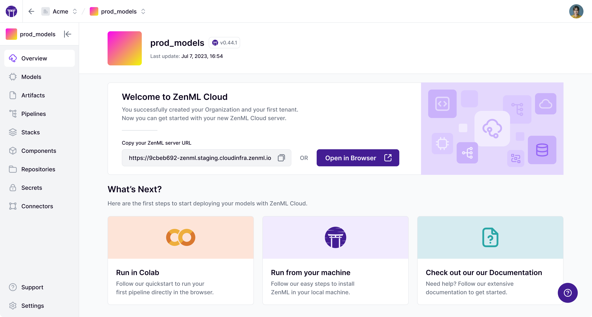

# For MLOps Platform Engineers

ZenML enables MLOps infrastructure experts to define, deploy, and manage sophisticated production environments that are easy to share with colleagues.

#### **ZenML Pro**

&#x20;[ZenML Pro](https://app.gitbook.com/o/-MCl1Hlw9oU4xibZ-ymf/s/oT4CiM88wQeSLTcwLU2J/) provides a control plane that allows you to deploy a managed ZenML instance and get access to exciting new features such as CI/CD, Model Control Plane, and RBAC.

<figure><figcaption></figcaption></figure>

#### **Self-hosted deployment**

ZenML can be deployed on any cloud provider and provides many Terraform-based utility functions to deploy other MLOps tools or even entire MLOps stacks:

```bash
# Connect cloud resources with a simple wizard
zenml stack register <STACK_NAME> --provider aws

# Deploy entire MLOps stacks at once
zenml stack deploy  --provider gcp
```

#### **Standardization**

With ZenML, you can standardize MLOps infrastructure and tooling across your organization. Simply register your staging and production environments as ZenML stacks and invite your colleagues to run ML workflows on them.

```bash
# Register MLOps tools and infrastructure
zenml orchestrator register kfp_orchestrator -f kubeflow

# Register your production environment
zenml stack register production --orchestrator kubeflow ...
```

* Registering your environments as ZenML stacks also enables you to browse and explore them in a convenient user interface.

#### **No Vendor Lock-In**

Since infrastructure is decoupled from code, ZenML gives you the freedom to switch to a different tooling stack whenever it suits you. By avoiding vendor lock-in, you have the flexibility to transition between cloud providers or services, ensuring that you receive the best performance and pricing available in the market at any time.

```bash
zenml stack set gcp
python run.py  # Run your ML workflows in GCP
zenml stack set aws
python run.py  # Now your ML workflow runs in AWS
```

***

#### :rocket: **Learn More**

Ready to deploy and manage your MLOps infrastructure with ZenML? Here is a collection of pages you can take a look at next:

<table data-view="cards"><thead><tr><th></th><th></th><th data-hidden data-card-target data-type="content-ref"></th><th data-hidden data-card-cover data-type="files"></th></tr></thead><tbody><tr><td><strong>Switch to production</strong></td><td>Set up and manage production-ready infrastructure with ZenML.</td><td><a href="https://docs.zenml.io/user-guides/starter-guide">https://docs.zenml.io/user-guides/starter-guide</a></td><td><a href="../../.gitbook/assets/production.png">production.png</a></td></tr><tr><td><strong>Component guide</strong></td><td>Explore the existing infrastructure and tooling integrations of ZenML.</td><td><a href="https://docs.zenml.io/stacks">https://docs.zenml.io/stacks</a></td><td><a href="../../.gitbook/assets/component-guide.png">component-guide.png</a></td></tr><tr><td><strong>FAQ</strong></td><td>Find answers to the most frequently asked questions.</td><td><a href="../../reference/faq.md">faq.md</a></td><td><a href="../../.gitbook/assets/faq.png">faq.png</a></td></tr></tbody></table>
