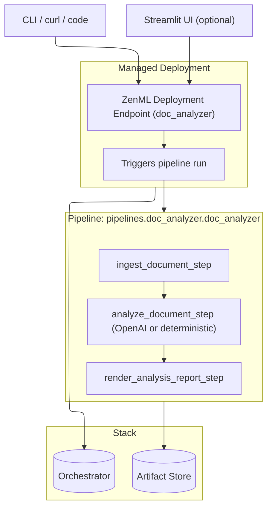
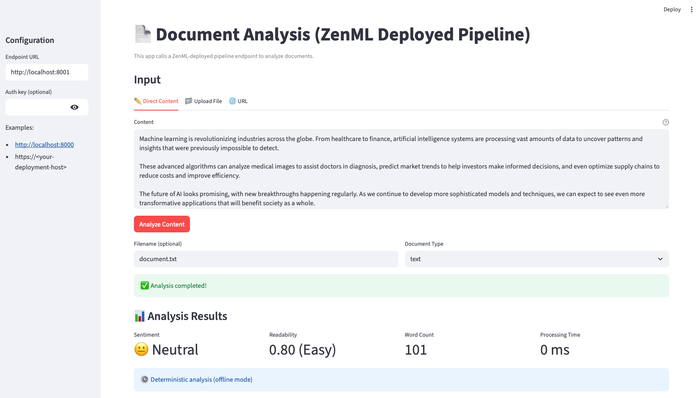
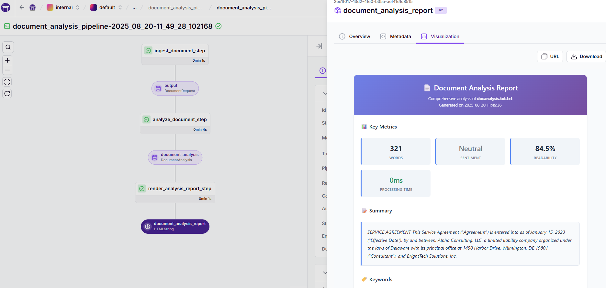

## Your First AI Pipeline

Build and deploy a real AI pipeline as a managed ZenML HTTP endpoint. You can invoke it via the ZenML CLI or `curl`, optionally use a Streamlit web UI, and it also runs fully offline with a deterministic analyzer when no OpenAI key is configured.


Why pipelines?
- **Reproducible & portable**: Run the same code locally or on the cloud by switching stacks.
- **One approach for models and agents**: Steps, pipelines, and artifacts work for sklearn and LLMs alike.
- **Observe by default**: Lineage and step metadata (e.g., tokens, latency) are tracked and visible in the dashboard.


Modeling agents as pipelines makes non-deterministic workflows debuggable and shippable: prompts, tools, and routing become explicit steps; runs produce versioned artifacts (including traces and metrics) you can compare and inspect. This is the same pattern you use for classical ML, so agents and models share the lifecycle and tooling.

### What you'll build
- **Document analysis pipeline deployed as an HTTP endpoint** managed by ZenML
- **OpenAI SDK with deterministic fallback**: Uses OpenAI when a key is set, otherwise runs offline via a rule-based analyzer
- **Tracked artifacts and metadata**: Summary, keywords, sentiment, readability score, plus latency and token usage
- **Optional Streamlit UI client** to call the deployment from your browser

### Architecture (at a glance)



### Prerequisites

```bash
pip install "zenml[server]"
zenml init
```

Optional (for LLM mode with the OpenAI Python SDK):
```bash
export OPENAI_API_KEY="your-key"
```

### Get the example

```bash
git clone --depth 1 https://github.com/zenml-io/zenml.git
cd zenml/examples/minimal_agent_production
pip install -r requirements.txt
```

Already have the repo? Just `cd examples/minimal_agent_production` and continue.


### Deploy the pipeline

Deploy the pipeline as a managed HTTP endpoint and get its URL:

```bash
zenml pipeline deploy pipelines.doc_analyzer.doc_analyzer
zenml deployment describe doc_analyzer
```

### Analyze a document

Use the ZenML CLI to invoke your deployment:

```bash
zenml deployment invoke doc_analyzer \
  --content="Artificial Intelligence is transforming how we work..." \
  --filename="ai-overview.txt" \
  --document_type="text"
```

Or call the HTTP endpoint directly with curl. Send a JSON body that wraps inputs under parameters:

```bash
ENDPOINT=http://localhost:8000   # replace with your deployment URL
curl -X POST "$ENDPOINT/invoke" \
  -H "Content-Type: application/json" \
  -d '{
    "parameters": {
      "content": "Your text here...",
      "filename": "document.txt",
      "document_type": "text"
    }
  }'
```

If your deployment requires auth, include an Authorization header:

```bash
-H "Authorization: Bearer <YOUR_KEY>"
```

Endpoint contract (summary):
- Method and path: POST {ENDPOINT}/invoke
- Parameters (any combination):
  - content: string
  - url: string
  - path: string
  - filename: string
  - document_type: string (e.g., text, markdown, report, article)
- Response: JSON with outputs.{document_analysis*} containing a DocumentAnalysis object with:
  - summary: string
  - keywords: string[]
  - sentiment: "positive" | "negative" | "neutral"
  - readability_score: number
  - word_count: number
  - model: string
  - latency_ms: number
  - tokens_prompt: number
  - tokens_completion: number
  - metadata: { analysis_method: "llm" | "deterministic_fallback", document_type: string, ... }
  - document: { filename: string, document_type: string, created_at: ISO8601, ... }
  - Note: The exact output key may be namespaced; look for a key containing "document_analysis".

### Use the web interface (optional)



Launch the Streamlit frontend:

```bash
streamlit run streamlit_app.py
```

Enter your deployment URL (defaults from the `DOCUMENT_ANALYSIS_ENDPOINT` environment variable) and optionally an auth key in the sidebar. The app wraps requests under parameters and POSTs to the `/invoke` endpoint.

### Inspect your pipeline runs

```bash
zenml login --local
```

In the dashboard, open the latest run to explore:
* **Steps** like `ingest_document_step`, `analyze_document_step`, `render_analysis_report_step`
* **Artifacts** including `document_analysis` (structured JSON result) and `document_analysis_report` (HTML report)
* **Metadata** such as `latency_ms`, `tokens_prompt`, `tokens_completion`, the model label, and the `analysis_method` used

Tip: Switch to the [Timeline view](../how-to/dashboard/dashboard-features.md#timeline-view) to compare step durations, spot bottlenecks, and understand parallel execution at a glance.

<figure>
  
  <figcaption>Document analysis pipeline DAG with step-level artifacts and metadata in the ZenML dashboard.</figcaption>
</figure>

### How it works (at a glance)

- The `doc_analyzer` pipeline orchestrates three steps: ingestion → analysis → report.
- The `analyze_document_step` uses the OpenAI Python SDK when `OPENAI_API_KEY` is set, and falls back to a deterministic analyzer when no key is available or if the API call fails. It records latency and token usage where available.
- The `render_analysis_report_step` produces an HTML report artifact you can view in the ZenML dashboard.

The pipeline is configured to inject your OpenAI key at build/deploy time:

```python
from zenml.config import DockerSettings

docker_settings = DockerSettings(
    requirements="requirements.txt",
    environment={
        "OPENAI_API_KEY": "${OPENAI_API_KEY}",
    },
)
```

And the pipeline definition wires together the three steps and returns the main analysis artifact:

```python
from typing import Annotated, Optional
from zenml import ArtifactConfig, pipeline

@pipeline(
    settings={"docker": docker_settings},
    enable_cache=False,
)
def doc_analyzer(
    content: Optional[str] = None,
    url: Optional[str] = None,
    path: Optional[str] = None,
    filename: Optional[str] = None,
    document_type: str = "text",
) -> Annotated[
    DocumentAnalysis,
    ArtifactConfig(name="document_analysis", tags=["analysis", "serving"]),
]:
    document = ingest_document_step(
        content=content,
        url=url,
        path=path,
        filename=filename,
        document_type=document_type,
    )
    analysis = analyze_document_step(document)
    render_analysis_report_step(analysis)
    return analysis
```

### Production next steps
- **Run remotely**: Configure a remote stack/orchestrator and deploy the same pipeline as a managed endpoint. See [Deploy](deploying-zenml/README.md).
- **Configure deployment settings**: Enable authentication and other deployer options via config:
  ```yaml
  # my_config.yaml
  settings:
    deployer:
      generate_auth_key: true
  ```
  Deploy with:
  ```bash
  zenml pipeline deploy pipelines.doc_analyzer.doc_analyzer --config my_config.yaml
  ```
- **Automate triggering**: [Create a run template](https://docs.zenml.io/user-guides/tutorial/trigger-pipelines-from-external-systems) (ZenML Pro) and trigger via API/webhooks from your app.
- **Future enhancement**: Add an evaluation pipeline to score outputs and render reports if you need automated quality checks.

### Extend it

- **Switch models** via the `DOC_ANALYSIS_LLM_MODEL` environment variable (see `constants.py`).
- **Adapt the LLM integration** by extending `perform_llm_analysis` to use other providers.
- **Add ingestion modes** (e.g., richer URL handling or PDF parsing) as new steps before analysis.
- **Add guardrails/validation** steps or enrich metadata captured during analysis.
- **Introduce retrieval/tooling** steps ahead of analysis for more advanced workflows.

Looking for the code? Browse the complete example at
[`examples/minimal_agent_production`](https://github.com/zenml-io/zenml/tree/main/examples/minimal_agent_production).
