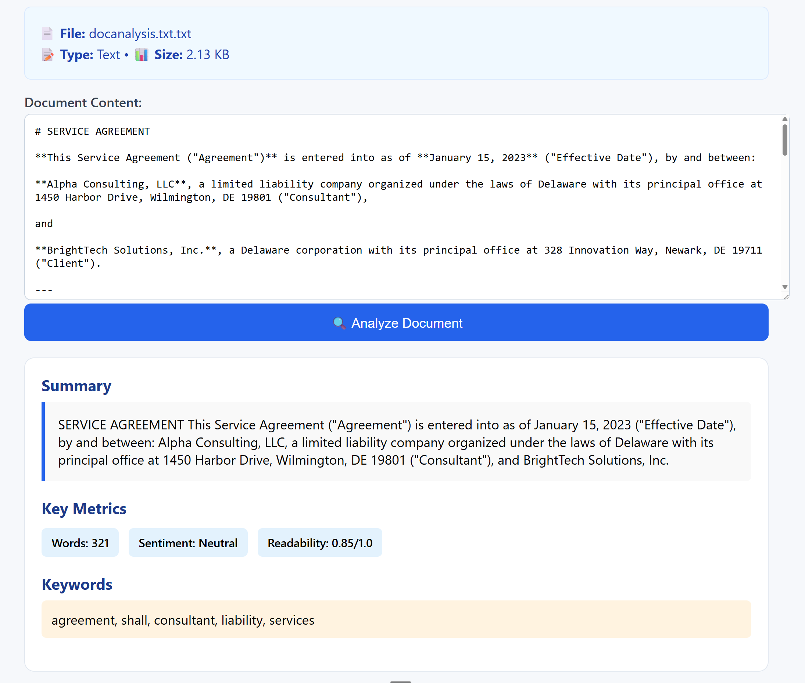
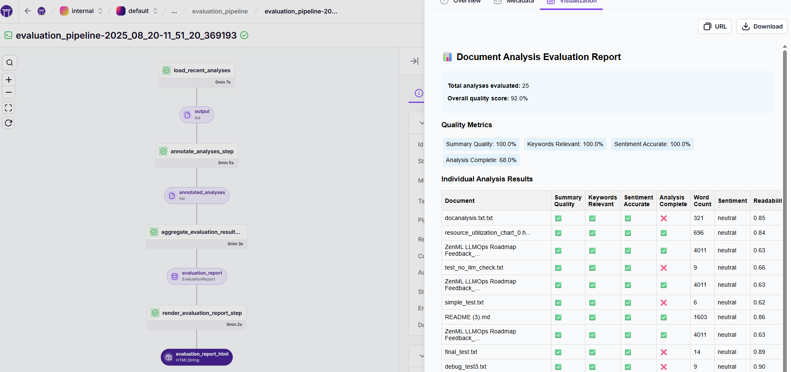

## Your First AI Pipeline

Build and evaluate a real AI service powered by a ZenML pipeline. This quickstart works out of the box with a deterministic fallback and upgrades seamlessly to LLMs when you add a provider API key.


Why pipelines?
- **Reproducible & portable**: Run the same code locally or on the cloud by switching stacks.
- **One approach for models and agents**: Steps, pipelines, and artifacts work for sklearn and LLMs alike.
- **Evaluate & observe by default**: Quality reports, lineage, and step metadata (tokens, latency) out of the box.


Modeling agents as pipelines makes non-deterministic workflows debuggable and shippable: prompts, tools, and routing become explicit steps; runs produce versioned artifacts (including traces and metrics) you can compare and evaluate. This is the same pattern you use for classical ML, so agents and models share the lifecycle and tooling.

### What you'll build
- **Document analysis service**: A FastAPI app that triggers a ZenML pipeline
- **LLM-first with fallback**: Uses [LiteLLM](https://github.com/BerriAI/litellm) if an API key is set, otherwise runs a deterministic analysis that doesn't require making an API request to an LLM service
- **Tracked artifacts**: Summary, keywords, sentiment, readability, and rich metadata
- **Quality evaluation**: A separate pipeline that annotates runs and generates an HTML report

### Architecture (at a glance)

```mermaid
---
config:
  layout: elk
  theme: mc
---


This is an older version of the ZenML documentation. To read and view the latest version please [visit this up-to-date URL](https://docs.zenml.io).


flowchart TB
 subgraph Evaluation["Evaluation Pipeline"]
        R1["load recent analyses"]
        R2["annotate and score"]
        R3["render evaluation HTML"]
  end
 subgraph s1["Document Analysis Pipeline"]
        S1["ingest_document_step"]
        S2["analyze_document_step LLM or fallback"]
        S3["render_report_step"]
  end
 subgraph s2["Stack"]
        O[("Orchestrator - local or remote")]
        AR["Artifact Store"]
  end
    U["User / Client"] --> A["FastAPI app"]
    A -- Triggers on document upload --> s1
    S1 --> S2
    S2 --> S3
    S3 -- DocumentAnalysisResult --> AR
    R1 --> R2
    R2 --> R3
    U -- Triggers to evaluate app --> Evaluation
    Evaluation -- Executes on --> O
    s1 -- Executes on --> O
    style s1 fill:#E1BEE7,stroke:#AA00FF
    style Evaluation fill:#E1BEE7,stroke:#AA00FF
```

### Prerequisites

```bash
pip install "zenml[server]"
zenml init
```

Optional (for LLM mode via LiteLLM, OpenAI shown):
```bash
export OPENAI_API_KEY="your-key"
```

### Get the example

```bash
git clone --depth 1 https://github.com/zenml-io/zenml.git
cd zenml/examples/minimal_agent_production
pip install -r requirements.txt
```

Already have the repo? Just `cd examples/minimal_agent_production` and continue.


### Run the service

```bash
uvicorn app.main:app --reload --port 8010
```

Open `http://localhost:8010` to use the UI, or call it programmatically:
```bash
curl -X POST http://localhost:8010/analyze \
  -H 'Content-Type: application/json' \
  -d '{
        "filename": "sample-report.txt",
        "content": "This is a sample document for analysis...",
        "document_type": "report",
        "analysis_type": "full"
      }'
```

The endpoint triggers a ZenML pipeline run that stores detailed results and metadata you can inspect in the dashboard.

<figure>
  
  <figcaption>The web UI served by uvicorn at <code>http://localhost:8010</code>.</figcaption>
</figure>

### Inspect your pipeline runs

```bash
zenml login --local
```

In the dashboard, open the latest run to explore:
- **Steps** like `ingest_document_step`, `analyze_document_step`, `render_report_step`
- **Artifacts** like `DocumentAnalysis` with summary, keywords, sentiment, readability score
- **Metadata** such as latency, token usage, and model name (when in LLM mode)

<figure>
  
  <figcaption>Document analysis pipeline DAG with step-level artifacts and metadata.</figcaption>
</figure>

### Evaluate quality

Generate a quality report across recent analyses:
```bash
python run_evaluation.py
```

Open the run in the dashboard and locate the HTML report artifact with per-item annotations (summary quality, keyword relevance, sentiment accuracy, completeness) and aggregated scores.

<figure>
  
  <figcaption>Evaluation pipeline producing an HTML report artifact with aggregated metrics.</figcaption>
</figure>

### How it works (at a glance)

- The FastAPI app forwards requests to the `document_analysis_pipeline` in `pipelines/production.py`
- The `analyze` step uses LiteLLM if an API key is configured, otherwise a deterministic analyzer
- Artifacts are versioned and traceable; evaluation runs read past analyses and render a report

Key files to explore:
- `examples/minimal_agent_production/pipelines/production.py`
- `examples/minimal_agent_production/steps/analyze.py`
- `examples/minimal_agent_production/run_evaluation.py`

### Production next steps
- **Run remotely**: Configure a remote stack/orchestrator and run the same pipeline on managed compute. See [Deploy](deploying-zenml/README.md)
- **Automate triggering**: [Create a run template](https://docs.zenml.io/user-guides/tutorial/trigger-pipelines-from-external-systems) (ZenML Pro) and trigger via API/webhooks from your app
- **Operationalize**: Add caching, retries, schedules, and CI/CD using concepts in the docs

### Extend it

- Swap LLMs/providers through LiteLLM without code changes
- Add guardrails/structured outputs via Pydantic models
- Add retrieval or additional steps for more advanced analysis

Looking for the code? Browse the complete example at `examples/minimal_agent_production`.