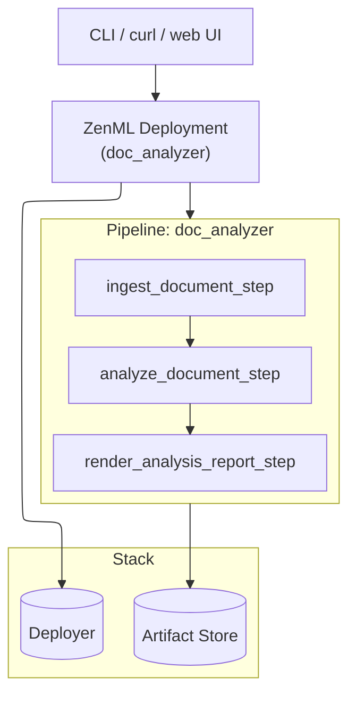
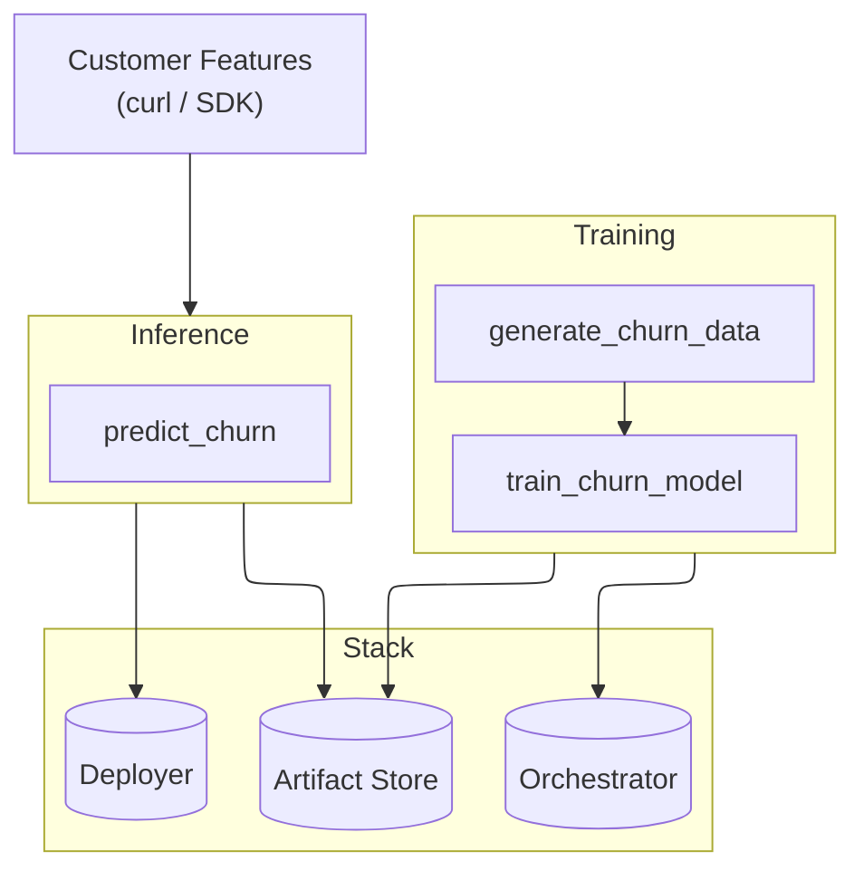
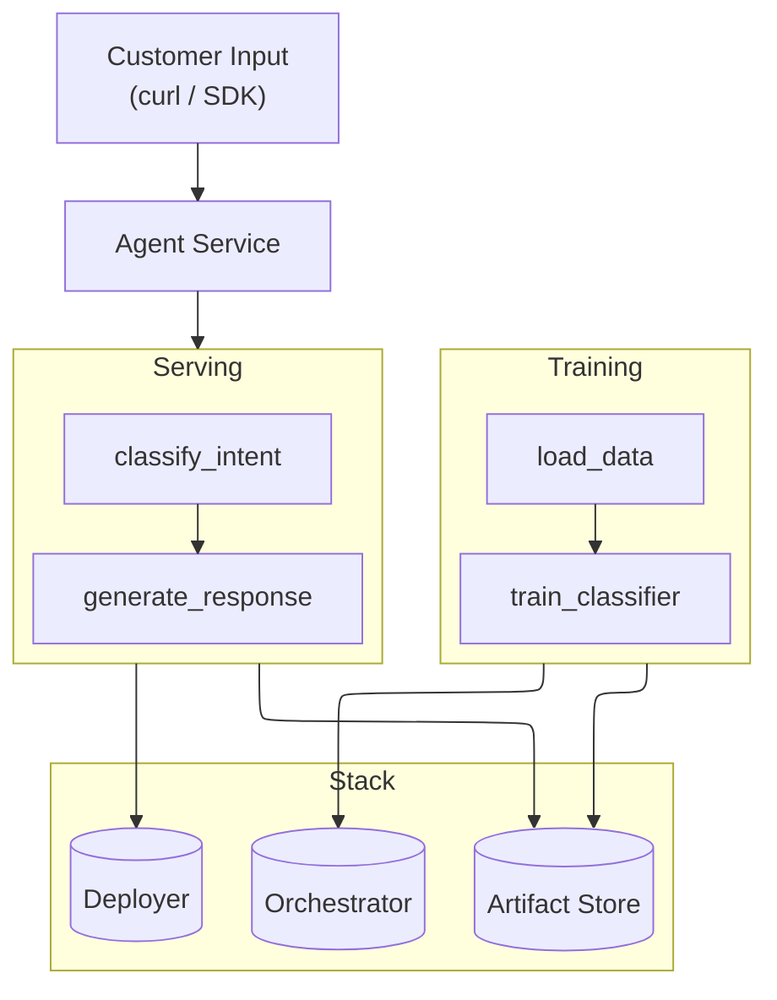

## Your First AI Pipeline

ZenML pipelines work the same for **classical ML**, **AI agents**, and **hybrid approaches**. Choose your path below to get started:


Why ZenML pipelines?
- **Reproducible & portable**: Run the same code locally or on the cloud by switching stacks.
- **One approach for models and agents**: Steps, pipelines, and artifacts work for sklearn, classical ML, and LLMs alike.
- **Observe by default**: Lineage and step metadata (e.g., latency, tokens, metrics) are tracked and visible in the dashboard.


---

## What do you want to build?

Choose one of the paths below. The same ZenML pipeline pattern works for all of them—the difference is in your steps and how you orchestrate them.

- **[Build AI Agents](#path-1-build-ai-agents)** - Use LLMs and tools to create autonomous agents
- **[Build Classical ML Pipelines](#path-2-build-classical-ml-pipelines)** - Train and serve ML models with scikit-learn, TensorFlow, or PyTorch
- **[Build Hybrid Systems](#path-3-build-hybrid-systems)** - Combine ML classifiers with agents

---

## Path 1: Build AI Agents

Use large language models, prompts, and tools to build intelligent autonomous agents that can reason, take action, and interact with your systems.

### Architecture example



<details>

<summary><strong>View Quick Start & Examples</strong></summary>

### Quick start

```bash
git clone --depth 1 https://github.com/zenml-io/zenml.git
cd zenml/examples/deploying_agent
uv pip install -r requirements.txt
```

Then follow the guide in [`examples/deploying_agent`](https://github.com/zenml-io/zenml/tree/main/examples/deploying_agent):

1. **Define your steps**: Use LLM APIs (OpenAI, Claude, etc.) to build reasoning steps
2. **Deploy as HTTP service**: Turn your agent into a managed endpoint
3. **Invoke and monitor**: Use the CLI, curl, or the embedded web UI to interact with your agent
4. **Inspect traces**: View agent reasoning, tool calls, and metadata in the ZenML dashboard

### Example output

- Automated document analysis (see `deploying_agent`)
- Multi-turn chatbots with context
- Autonomous workflows with tool integrations
- Agentic RAG systems with retrieval steps

### Related examples

- **[agent_outer_loop](https://github.com/zenml-io/zenml/tree/main/examples/agent_outer_loop)**: Combine ML classifiers with agents for hybrid intelligent systems
- **[agent_comparison](https://github.com/zenml-io/zenml/tree/main/examples/agent_comparison)**: Compare different agent architectures and LLM providers
- **[agent_framework_integrations](https://github.com/zenml-io/zenml/tree/main/examples/agent_framework_integrations)**: Integrate with popular agent frameworks
- **[llm_finetuning](https://github.com/zenml-io/zenml/tree/main/examples/llm_finetuning)**: Fine-tune LLMs for specialized tasks

</details>

---

## Path 2: Build Classical ML Pipelines

Use scikit-learn, TensorFlow, PyTorch, or other ML frameworks to build data processing, feature engineering, training, and inference pipelines.

### Architecture example



<details>

<summary><strong>View Quick Start & Examples</strong></summary>

### Quick start

```bash
git clone --depth 1 https://github.com/zenml-io/zenml.git
cd zenml/examples/deploying_ml_model
uv pip install -r requirements.txt
```

Then follow the guide in [`examples/deploying_ml_model`](https://github.com/zenml-io/zenml/tree/main/examples/deploying_ml_model):

1. **Build your pipeline**: Data loading → preprocessing → training → evaluation
2. **Deploy the model**: Serve your trained model as a real-time HTTP endpoint
3. **Monitor performance**: Track predictions, latency, and data drift in the dashboard
4. **Iterate**: Retrain and redeploy without code changes—just switch your orchestrator

### Example output

- Predictive models (regression, classification)
- Time series forecasting
- NLP pipelines (sentiment analysis, text classification)
- Computer vision workflows
- Model scoring and ranking systems

### Related examples

- **[e2e](https://github.com/zenml-io/zenml/tree/main/examples/e2e)**: End-to-end ML pipeline with data validation and model deployment
- **[e2e_nlp](https://github.com/zenml-io/zenml/tree/main/examples/e2e_nlp)**: Domain-specific NLP pipeline example
- **[mlops_starter](https://github.com/zenml-io/zenml/tree/main/examples/mlops_starter)**: Production-ready MLOps setup with monitoring and governance

</details>

---

## Path 3: Build Hybrid Systems

Combine classical ML models and AI agents in a single pipeline. For example, use a classifier to route requests to specialized agents, or use agents to augment ML predictions.

### Architecture example



<details>

<summary><strong>View Quick Start & Examples</strong></summary>

### Quick start

```bash
git clone --depth 1 https://github.com/zenml-io/zenml.git
cd zenml/examples/agent_outer_loop
uv pip install -r requirements.txt
```

Then follow the guide in [`examples/agent_outer_loop`](https://github.com/zenml-io/zenml/tree/main/examples/agent_outer_loop):

1. **Define both components**: Classical ML classifier + AI agent steps
2. **Wire them together**: Use the classifier output to influence agent behavior
3. **Deploy as one service**: The entire hybrid system becomes a single endpoint
4. **Monitor both**: Track ML metrics and agent traces in the same dashboard

### Example output

- Intent classification with specialized agent handling
- Upgrade paths: generic agent → train classifier → automatic routing
- Ensemble systems combining multiple models and agents
- Fact-checking pipelines with verification steps

### Related examples

- **[agent_outer_loop](https://github.com/zenml-io/zenml/tree/main/examples/agent_outer_loop)**: Full hybrid example with automatic intent detection
- **[deploying_agent](https://github.com/zenml-io/zenml/tree/main/examples/deploying_agent)**: Start here for the agent piece
- **[deploying_ml_model](https://github.com/zenml-io/zenml/tree/main/examples/deploying_ml_model)**: Start here for the ML piece

</details>

---


This is an older version of the ZenML documentation. To read and view the latest version please [visit this up-to-date URL](https://docs.zenml.io).



## Common Next Steps

Once you've chosen your path and gotten your first pipeline running:

### Deploy remotely

All three paths use the same deployment pattern. Configure a remote stack and deploy:

```bash
# Create a remote stack (e.g., AWS)
zenml stack register my-remote-stack \
  --orchestrator aws-sagemaker \
  --artifact-store s3-bucket \
  --deployer aws

# Set it and deploy—your code doesn't change
zenml stack set my-remote-stack
```

Run in batch mode with:

```bash
python run.py
```

Deploy as a real-time endpoint with:

```bash
zenml pipeline deploy pipelines.my_pipeline.my_pipeline --config deploy_config.yaml
```

See [Deploying ZenML](deploying-zenml/README.md) for cloud setup details.

### View the dashboard

Start the dashboard to explore your pipeline runs:

```bash
zenml login
```

In the dashboard, you'll see:
- **Pipeline DAGs**: Visual representation of your steps and data flow
- **Artifacts**: Versioned outputs from each step (models, reports, traces)
- **Metadata**: Latency, tokens, metrics, or custom metadata you track
- **Timeline view**: Compare step durations and identify bottlenecks

## Core Concepts Recap

Regardless of which path you choose:

- **[Pipelines](../how-to/steps-pipelines/steps_and_pipelines.md)** - Orchestrate your workflow steps with automatic tracking
- **[Steps](../how-to/steps-pipelines/steps_and_pipelines.md)** - Modular, reusable units (data loading, model training, LLM inference, etc.)
- **[Artifacts](../how-to/artifacts/artifacts.md)** - Versioned outputs (models, predictions, traces, reports) with automatic logging
- **[Stacks](../how-to/stack-components/stack_components.md)** - Switch execution environments (local, remote, cloud) without code changes
- **[Deployments](../how-to/deployment/deployment.md)** - Turn pipelines into HTTP services with built-in UIs and monitoring

For deeper dives, explore the [Concepts](../how-to/steps-pipelines/steps_and_pipelines.md) section in the docs.
