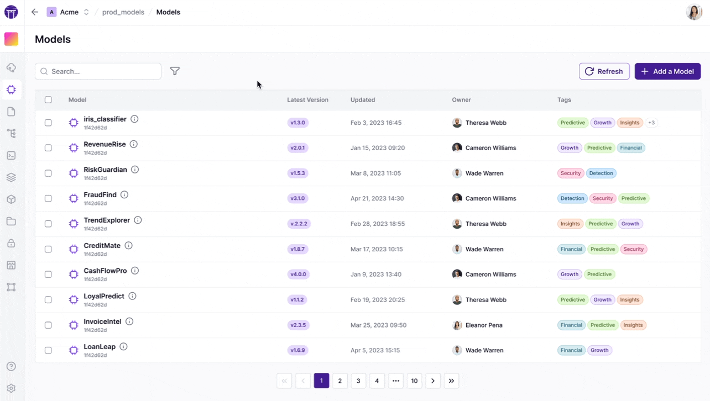

# Introduction

The [Pro version of ZenML](https://zenml.io/pro) extends the Open Source product with advanced features for enterprise-grade MLOps.


To get access to ZenML Pro, [book a call](https://www.zenml.io/book-your-demo).


## ZenML OSS vs Pro Feature Comparison

| Feature Category | ZenML OSS | ZenML Pro |
|-----------------|-----------|-----------|
| **User Management** | Single-user mode | Multi-user support with [SSO](self-hosted.md#identity-provider), [organizations](organization.md), and [teams](teams.md) |
| **Access Control** | No RBAC | Full [role-based access control](roles.md) with customizable permissions |
| **Multi-tenancy** | No workspaces/projects | [Workspaces](workspaces.md) and [projects](projects.md) for team and resource isolation |
| **ZenML Web UI** | Basic pipeline and run visualization | Pro UI with [Model Control Plane](https://docs.zenml.io/concepts/models), [Artifact Control Plane](https://docs.zenml.io/concepts/artifacts), and comparison views |
| **Pipeline Execution** | Run pipelines via SDK/CLI | Run pipelines from the UI, manage schedules through the UI, [triggers](https://docs.zenml.io/concepts/triggers) |
| **Stack Configuration** | User-managed stacks | Advanced stack configurations with workspace/project-level restrictions for platform teams |
| **Security** | Community updates | Prioritized security patches, SOC 2 and ISO 27001 certification |
| **Deployment** | Self-hosted only | [SaaS](#saas-deployment), [Hybrid SaaS](#hybrid-saas-deployment), or [Self-hosted](#self-hosted-deployment) options |
| **Support** | Community support | Professional support included (SaaS deployments) |
| **Reporting** | Basic run tracking | Advanced usage reports and analytics |
| **Core Features** | ✅ Run pipelines on stacks ✅ Full observability over runs ✅ Artifact tracking ✅ Model versioning | ✅ All OSS features ✅ [Run Snapshots](https://docs.zenml.io/concepts/snapshots) ✅ Enhanced filtering and search |

## Deployment Scenarios

ZenML Pro offers three flexible deployment options to match your organization's needs: **SaaS**, **Hybrid**, and **Self-hosted**.

[Explore all deployment scenarios →](deployments-overview.md)

## Security & Compliance

All ZenML Pro deployments include:

- ✅ **SOC 2 Type II** certification
- ✅ **ISO 27001** certification
- ✅ **Vulnerability Assessment Reports** available on request
- ✅ **Software Bill of Materials (SBOM)** available on request

## Pro Feature Details

<table data-view="cards"><thead><tr><th></th><th></th><th data-hidden data-card-cover data-type="files"></th><th data-hidden></th><th data-hidden data-type="content-ref"></th><th data-hidden data-card-target data-type="content-ref"></th></tr></thead><tbody><tr><td><strong>Workspaces</strong></td><td>Isolated environments for teams and projects</td><td><a href=".gitbook/assets/pro-workspaces.png">pro-workspaces.png</a></td><td></td><td></td><td><a href="workspaces.md">workspaces.md</a></td></tr><tr><td><strong>Organizations</strong></td><td>Top-level entity for managing users and teams</td><td><a href=".gitbook/assets/pro-organizations.png">pro-organizations.png</a></td><td></td><td></td><td><a href="organization.md">organization.md</a></td></tr><tr><td><strong>Teams</strong></td><td>Group users for simplified access management</td><td><a href=".gitbook/assets/pro-teams.png">pro-teams.png</a></td><td></td><td></td><td><a href="teams.md">teams.md</a></td></tr><tr><td><strong>Roles</strong></td><td>Customizable role-based access control</td><td><a href=".gitbook/assets/pro-roles.png">pro-roles.png</a></td><td></td><td></td><td><a href="roles.md">roles.md</a></td></tr><tr><td><strong>Projects</strong></td><td>Organize work within workspaces</td><td><a href=".gitbook/assets/pro-projects.png">pro-projects.png</a></td><td></td><td></td><td><a href="projects.md">projects.md</a></td></tr><tr><td><strong>Workload Managers</strong></td><td>Enable running pipelines from the ZenML Pro UI</td><td><a href=".gitbook/assets/pro-workload-managers.png">pro-workload-managers.png</a></td><td></td><td></td><td><a href="workload-managers.md">workload-managers.md</a></td></tr><tr><td><strong>Deployment Options</strong></td><td>SaaS, Hybrid, or Full On-Prem deployments</td><td><a href=".gitbook/assets/pro-self-host.png">pro-self-host.png</a></td><td></td><td></td><td><a href="self-hosted.md">self-hosted.md</a></td></tr></tbody></table>
