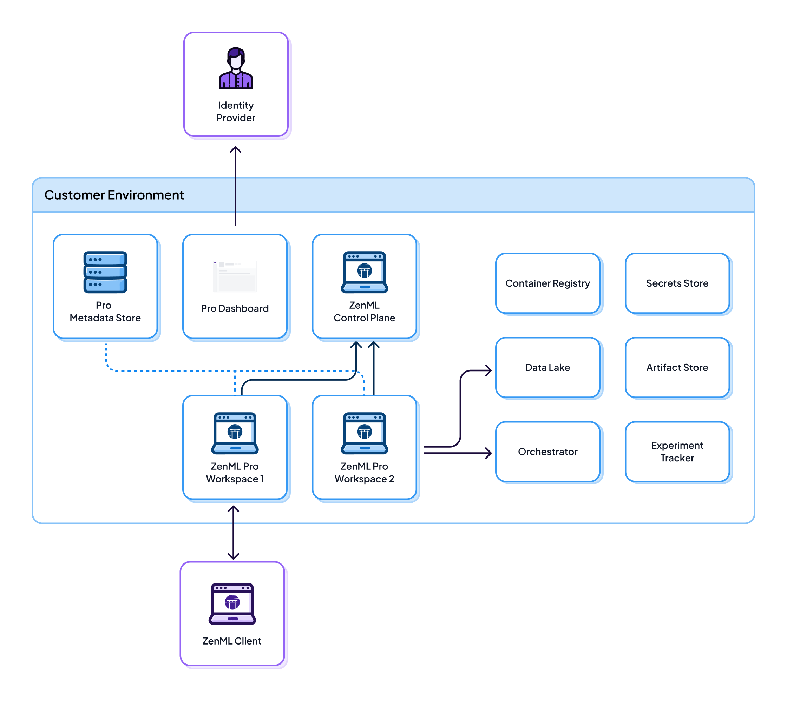

# Air-gapped Deployment

ZenML Pro Air-gapped deployment provides complete control and data sovereignty for organizations with the strictest security, compliance, or regulatory requirements. All ZenML components run entirely within your infrastructure with no external dependencies or internet connectivity required.


To learn more about Air-gapped deployment, [book a call](https://www.zenml.io/book-your-demo).


## Overview

In an air-gapped deployment, every component of ZenML Pro runs within your isolated network environment. This architecture is designed for organizations that must operate in completely disconnected environments or have regulatory requirements preventing any external communication.



## Architecture

### What Runs Where

| Component | Location | Purpose |
|-----------|----------|---------|
| **Pro Control Plane** | Your Infrastructure | Manages authentication, RBAC, and workspace coordination |
| **ZenML Server (Workspaces)** | Your Infrastructure | Handles pipeline orchestration and execution |
| **Pro Metadata Store** | Your Infrastructure | Stores user management, RBAC, and organizational data |
| **Workspace Metadata Store** | Your Infrastructure | Stores pipeline runs, model metadata, and tracking information |
| **Secrets Store** | Your Infrastructure | Stores all credentials and sensitive configuration |
| **Identity Provider** | Your Infrastructure | Handles authentication (OIDC/LDAP/SAML) |
| **Pro Dashboard** | Your Infrastructure | Web interface for all ZenML Pro features |
| **Compute Resources** | Your Infrastructure | Executes pipeline steps and training jobs |
| **Data & Artifacts** | Your Infrastructure | Stores datasets, models, and pipeline artifacts |

### Complete Isolation

```mermaid
flowchart TB
  subgraph infra["Your Infrastructure (Air-gapped)"]
    direction TB

    control_plane["<b>ZenML Pro Control Plane</b><br/>- Authentication & Authorization<br/>- RBAC Management<br/>- Workspace Coordination<br/>- Pro Metadata Store"]

    subgraph workspaces[" "]
      direction LR
      ws1["<b>Workspace 1</b><br/>- Server<br/>- Metadata<br/>- Secrets"]
      ws2["<b>Workspace 2</b><br/>- Server<br/>- Metadata<br/>- Secrets"]
      wsn["<b>...<br/>- Server<br/>- Metadata<br/>- Secrets</b>"]
    end

    compute["<b>Your Compute & Storage Resources</b><br/>- Kubernetes / VMs / Cloud<br/>- Artifact Stores<br/>- ML Data & Models"]
  end

  control_plane --> ws1
  control_plane --> ws2
  control_plane --> wsn
  ws1 --> compute
  ws2 --> compute
  wsn --> compute

  note[/"⚠️ No External Communication Required"/]
  infra --- note
```




**Complete data sovereignty**: Zero data leaves your environment. All components, metadata, and ML artifacts remain within your infrastructure boundaries.


### Data Flow

1. **Code Execution**: You write code and run pipelines with your client SDK using Python
2. **Authentication & Token Acquisition**:
   - Users authenticate via your internal identity provider (LDAP/AD/OIDC)
   - The ZenML Pro control plane (running in your infrastructure) handles authentication and RBAC
   - The ZenML client fetches short-lived tokens from your ZenML workspace for:
     - Pushing Docker images to your container registry
     - Communicating with your artifact store
     - Submitting workloads to your orchestrator
   - *Note: Your local Python environment needs the client libraries for your stack components*
3. **Authorization**: RBAC policies enforced by your control plane before token issuance
4. **Image & Workload Submission**: The client pushes Docker images (and optionally code if no code repository is configured) to your container registry, then submits the workload to your orchestrator
5. **Orchestrator Execution**: In the orchestrator environment within your infrastructure:
   - The Docker image is pulled from your container registry
   - Within the pipeline/step entrypoint, the necessary code is pulled in
   - A connection to your ZenML workspace is established
   - The relevant pipeline/step code is executed
6. **Runtime Data Flow**: During execution (all within your infrastructure):
   - Pipeline and step run metadata is logged to your ZenML workspace
   - Logs are streamed to your log backend
   - Artifacts are written to your artifact store
   - Metadata pointing to these artifacts is persisted in your workspace
7. **Observability**: The ZenML Pro dashboard (running in your infrastructure) connects to your workspace and uses all persisted metadata to provide you with a complete observability plane

**Key difference from other deployments**: All communication happens entirely within your infrastructure boundary with zero external dependencies or internet connectivity required.

## Key Benefits

### 🔒 Maximum Security & Control

- **Complete air-gap**: No internet connectivity required for operation
- **Zero external dependencies**: All components self-contained
- **Custom security policies**: Full control over all security configurations
- **Network isolation**: Operates within your security perimeter
- **Audit compliance**: Complete logging and monitoring within your infrastructure

### 🏛️ Regulatory Compliance

- **Data residency**: All data stays within your jurisdiction
- **ITAR/EAR compliance**: Suitable for controlled data environments
- **HIPAA/GDPR ready**: Meet healthcare and privacy regulations
- **Government/Defense**: Suitable for classified environments
- **Financial services**: Meet banking and financial regulations

### 🎯 Enterprise Control

- **Custom identity provider**: Integrate with your LDAP/AD/OIDC
- **Infrastructure flexibility**: Deploy on any infrastructure (cloud, on-prem, edge)
- **Version control**: Control update schedules and versions
- **Backup strategy**: Implement your own backup and DR policies
- **Resource optimization**: Full control over resource allocation and costs

### 🛡️ Certified & Documented

- **SOC 2 Type II certified**: Enterprise-grade security controls
- **ISO 27001 certified**: International security management standards
- **Vulnerability Assessment Reports**: Available on request
- **Software Bill of Materials (SBOM)**: Complete dependency inventory
- **Architecture documentation**: Comprehensive deployment guides

## Ideal Use Cases

Air-gapped deployment is essential for:

- **Government and defense** organizations with classified data requirements
- **Regulated industries** (healthcare, finance) with strict data residency requirements
- **Organizations in restricted regions** with limited or no internet connectivity
- **Research institutions** handling sensitive or proprietary research data
- **Critical infrastructure** operators requiring isolated systems
- **Companies with ITAR/EAR compliance** requirements
- **Enterprises with zero-trust policies** prohibiting external communication
- **Organizations requiring full control** over all aspects of their MLOps platform

## Deployment Options

### On-Premises Data Center

Deploy on your own hardware:
- Physical servers or private cloud
- Complete infrastructure control
- Integration with existing systems
- Custom hardware configurations

### Private Cloud (AWS, Azure, GCP)

Deploy in isolated cloud VPC:
- No internet gateway
- Private networking only
- Use cloud-native services
- Leverage cloud scalability within your boundary

### Hybrid Multi-Cloud

Deploy across multiple environments:
- On-premises + private cloud
- Multi-region for DR
- Edge + datacenter hybrid
- Maintain complete isolation across all environments

### Edge Deployments

Deploy at edge locations:
- Manufacturing facilities
- Remote research stations
- Mobile/tactical deployments
- Disconnected field operations

## Deployment Architecture

### Architecture Diagram


The diagram above illustrates a complete air-gapped ZenML Pro deployment with all components running within your organization's VPC. This architecture ensures zero external communication while providing full enterprise MLOps capabilities.

### Architecture Components

**Client SDK** (top center):
The ZenML Python SDK runs on developer laptops, CI/CD systems, or notebooks. It communicates with all layers to:
- Authenticate users via your Identity Provider
- Submit pipeline runs to workspaces
- Push Docker images to your Container Registry
- Access the Organization Platform Layer components

**Organization Platform Layer** (left, pink):
Your existing ML infrastructure components that ZenML integrates with:
- **Container Registry**: Store pipeline Docker images (AWS ECR, Dockerhub, Google Artifact Registry, Azure Container Registry)
- **Artifact Store**: Store ML artifacts, models, and datasets (S3, GCS, Azure Blob Storage, ADLS)
- **Code Repository**: Version control for pipeline code (GitHub Enterprise, GitLab, Bitbucket)
- **Orchestrator**: Execute pipeline workloads (Vertex AI, Sagemaker, AzureML, Kubernetes)

**Infrastructure Layer** (top, cyan):
Core infrastructure services:
- **Identity Provider**: LDAP, Active Directory, or OIDC provider for user authentication
- **Load Balancer**: Distributes traffic to ZenML services for high availability

**ZenML Control Plane** (center, blue):
The management layer running in Kubernetes:
- **ZenML FE**: React-based Pro dashboard for pipeline visualization and model management
- **ZenML Control Plane**: Coordinates workspaces, handles authentication/RBAC, manages organization settings

**ZenML Application Plane** (center, purple):
Individual workspace servers running in Kubernetes:
- **Multiple Workspaces**: Isolated environments for different teams (DS Team 1, DS Team 2, etc.)
- Each workspace has its own server instance, metadata database, and secrets store
- Workspaces are orchestrated by the Control Plane but run independently

**ZenML Storage Plane** (bottom, pink):
Persistent storage for ZenML services:
- **Secret Store**: Vault or cloud secrets manager for storing credentials securely
- **Database**: PostgreSQL or MySQL for storing workspace metadata, pipeline runs, and control plane data

### Data Flow

All arrows in the diagram represent communication flows that occur entirely within your VPC:
1. Client SDK authenticates with Identity Provider
2. Client SDK connects to ZenML Control Plane for workspace access
3. Control Plane manages and coordinates workspaces
4. Workspaces orchestrate pipeline execution on your Orchestrator
5. Pipelines write artifacts to your Artifact Store
6. Workspaces store metadata in the Database
7. All components access secrets from the Secret Store

**Key Security Feature**: The entire system operates without any external internet connectivity. All Docker images, dependencies, and updates are transferred to your environment through secure offline channels.

### High Availability Configuration

For mission-critical deployments:
- **Active-active** control plane for zero downtime
- **Database replication** for metadata stores
- **Load balancers** for workspace servers
- **Backup sites** for disaster recovery
- **Monitoring and alerting** for all components

## Setup Process

### 1. Pre-requisites

Before deployment, ensure you have:

#### Infrastructure Requirements
- Kubernetes cluster (recommended) or VM infrastructure
- PostgreSQL database(s) for metadata storage
- Object storage or NFS for artifacts
- Load balancer for HA configurations
- Identity provider (LDAP/AD/OIDC)

#### Network Requirements
- Internal DNS resolution
- SSL/TLS certificates (internal CA)
- Network connectivity between components
- Firewall rules for inter-component communication

#### Resource Requirements
```yaml
# Minimum requirements
Control Plane:
  CPU: 4 cores
  Memory: 16GB RAM
  Storage: 100GB

Per Workspace:
  CPU: 2 cores
  Memory: 8GB RAM
  Storage: 50GB + metadata

Database:
  CPU: 4 cores
  Memory: 16GB RAM
  Storage: 500GB (scalable)
```

### 2. Obtain ZenML Pro License

[Contact us](https://www.zenml.io/book-your-demo) to:
- Discuss your requirements
- Obtain air-gapped deployment license
- Receive deployment packages
- Schedule deployment support

### 3. Transfer Software Packages

ZenML provides all required components:

```bash
# Provided as offline bundle
zenml-pro-airgap-bundle/
├── docker-images/
│   ├── zenml-server.tar
│   ├── zenml-pro-control-plane.tar
│   ├── zenml-dashboard.tar
│   └── dependencies/
├── helm-charts/
│   ├── zenml-pro-control-plane/
│   └── zenml-workspace/
├── documentation/
├── sbom/
└── security-reports/
```

Transfer this bundle to your air-gapped environment using:
- Physical media (USB, portable drives)
- Approved file transfer mechanisms
- Your organization's software intake process

### 4. Load Docker Images

```bash
# Load images into your container registry
docker load < docker-images/zenml-server.tar
docker load < docker-images/zenml-pro-control-plane.tar
docker load < docker-images/zenml-dashboard.tar

# Tag for your internal registry
docker tag zenml-server your-registry.internal/zenml-server:latest
docker push your-registry.internal/zenml-server:latest
```

### 5. Deploy Control Plane

```bash
# Deploy using Helm
helm install zenml-pro-control-plane ./helm-charts/zenml-pro-control-plane \
  --set database.host=postgres.internal \
  --set database.name=zenml_pro \
  --set identityProvider.type=oidc \
  --set identityProvider.url=https://auth.internal \
  --set license.key=<your-license-key>
```

### 6. Configure Identity Provider

Integrate with your existing authentication:

```yaml
# OIDC Configuration
identityProvider:
  type: oidc
  issuerUrl: https://auth.internal
  clientId: zenml-pro
  clientSecret: <secret>

# LDAP Configuration
identityProvider:
  type: ldap
  server: ldap://ldap.internal
  baseDN: dc=company,dc=com

# SAML Configuration
identityProvider:
  type: saml
  metadataUrl: https://idp.internal/metadata
```

### 7. Deploy Workspaces

```bash
# Deploy workspace for each team
helm install workspace-team-a ./helm-charts/zenml-workspace \
  --set controlPlane.url=https://control-plane.internal \
  --set controlPlane.token=<workspace-token> \
  --set database.host=postgres.internal \
  --set image.repository=your-registry.internal/zenml-server
```

### 8. Deploy Dashboard

```bash
# Deploy Pro Dashboard
helm install zenml-dashboard ./helm-charts/zenml-dashboard \
  --set controlPlane.url=https://control-plane.internal \
  --set ingress.host=zenml.internal
```

### 9. Verify Deployment

```bash
# Check all components
kubectl get pods -n zenml-pro

# Verify control plane health
curl https://control-plane.internal/health

# Verify workspace connectivity
curl https://workspace-team-a.internal/health

# Test authentication
zenml connect --url https://zenml.internal
```

## Configuration Management

### Database Configuration

Each component requires PostgreSQL:

```yaml
# Control Plane Database
controlPlane:
  database:
    host: postgres-cp.internal
    port: 5432
    name: zenml_pro_control
    user: zenml_cp
    password: <secret>
    sslMode: require

# Workspace Database (per workspace)
workspace:
  database:
    host: postgres-ws.internal
    port: 5432
    name: zenml_workspace_team_a
    user: zenml_ws
    password: <secret>
    sslMode: require
```

### Secret Management

Configure your secrets backend:

```yaml
# AWS Secrets Manager (in VPC)
secretsStore:
  type: aws
  region: us-east-1
  endpoint: https://secretsmanager.vpc.internal

# HashiCorp Vault
secretsStore:
  type: vault
  url: https://vault.internal
  namespace: zenml

# Kubernetes Secrets
secretsStore:
  type: kubernetes
  namespace: zenml-secrets
```

### Artifact Storage

Configure artifact storage:

```yaml
# S3-compatible (MinIO, Ceph)
artifactStore:
  type: s3
  endpoint: https://s3.internal
  bucket: zenml-artifacts

# NFS
artifactStore:
  type: nfs
  server: nfs.internal
  path: /mnt/zenml-artifacts

# Azure Blob (in private network)
artifactStore:
  type: azure
  account: storageaccount
  container: artifacts
  endpoint: https://storage.internal
```

## Operations & Maintenance

### Updates & Upgrades

ZenML provides new versions as offline bundles:

1. **Receive new bundle**: Via your approved transfer method
2. **Review release notes**: Included in bundle documentation
3. **Test in staging**: Deploy to test environment first
4. **Backup current state**: Database and configuration backups
5. **Apply updates**: Using Helm upgrade commands
6. **Verify functionality**: Run health checks and tests
7. **Monitor**: Watch for any issues post-upgrade

### Backup Strategy

Implement comprehensive backups:

```bash
# Database backups (automated)
pg_dump -h postgres.internal zenml_pro_control > control-plane-backup.sql
pg_dump -h postgres.internal zenml_workspace_team_a > workspace-a-backup.sql

# Configuration backups
kubectl get configmap -n zenml-pro -o yaml > configmaps-backup.yaml
kubectl get secret -n zenml-pro -o yaml > secrets-backup.yaml

# Artifact store backups
# Implement per your storage solution
```

### Monitoring

Set up comprehensive monitoring:

```yaml
# Prometheus metrics
metrics:
  enabled: true
  endpoint: /metrics
  scrapeInterval: 30s

# Health checks
healthChecks:
  - name: control-plane
    url: https://control-plane.internal/health
    interval: 60s
  - name: workspace-team-a
    url: https://workspace-team-a.internal/health
    interval: 60s

# Log aggregation
logging:
  backend: elasticsearch
  endpoint: https://elastic.internal
```

### Disaster Recovery

Plan for disaster scenarios:

1. **Database replication**: PostgreSQL streaming replication to backup site
2. **Artifact replication**: Sync artifact stores to DR location
3. **Configuration backup**: Version-controlled infrastructure as code
4. **Runbook**: Document DR procedures
5. **Regular testing**: Test DR procedures quarterly

## Security Hardening

### Network Security

- **Network segmentation**: Isolate ZenML components in dedicated network segments
- **Firewall rules**: Restrict traffic to only required ports
- **TLS everywhere**: Encrypt all communication
- **Certificate management**: Use internal CA for certificate issuance

### Access Control

- **Principle of least privilege**: Grant minimal required permissions
- **MFA required**: Enforce multi-factor authentication
- **Service accounts**: Use dedicated accounts for automation
- **Audit logging**: Log all authentication and authorization events

### Container Security

- **Image scanning**: Scan all container images before deployment
- **Runtime security**: Monitor container behavior
- **Pod security policies**: Enforce security standards
- **Resource limits**: Prevent resource exhaustion attacks

## Support & Documentation

### What ZenML Provides

- **Deployment packages**: Complete offline installation bundles
- **Documentation**: Comprehensive setup and operation guides
- **SBOM**: Full software bill of materials for compliance
- **Vulnerability reports**: Security assessment documentation
- **Architecture consultation**: Pre-deployment planning support
- **Deployment assistance**: Guidance during initial setup
- **Update packages**: New versions as offline bundles

### What You Manage

- **Infrastructure**: Hardware, networking, storage
- **Day-to-day operations**: Monitoring, backups, user management
- **Security policies**: Firewall rules, access controls
- **Compliance**: Audit logs, security assessments
- **Updates**: Applying new versions using provided bundles

### Support Model

Contact [cloud@zenml.io](mailto:cloud@zenml.io) for:
- Pre-sales architecture consultation
- Deployment planning and sizing
- Security documentation requests
- Offline support packages
- Update and upgrade assistance

## Licensing

Air-gapped deployments use node-locked licenses:
- **License key**: Tied to your infrastructure
- **Offline activation**: No internet required
- **Flexible sizing**: License based on usage
- **Annual renewals**: Receive new license keys securely

## Security Documentation

Available on request for compliance and security reviews:

- ✅ **Vulnerability Assessment Reports**: Full security analysis
- ✅ **Software Bill of Materials (SBOM)**: Complete dependency list
- ✅ **Architecture security review**: Threat model and mitigations
- ✅ **Compliance mappings**: NIST, CIS, GDPR, HIPAA guidance
- ✅ **Security hardening guide**: Best practices for your deployment

## Comparison with Other Deployments

| Feature | SaaS | Hybrid SaaS | Air-gapped |
|---------|------|-------------|------------|
| Internet Required | Yes (metadata) | Yes (control plane) | **No** |
| Setup Time | Minutes | Hours/Days | Days/Weeks |
| Maintenance | Zero | Partial | **Full control** |
| Data Location | Mixed | Your infra | **100% yours** |
| User Management | ZenML | ZenML | **Your IDP** |
| Update Control | Automatic | Automatic CP | **You decide** |
| Customization | Limited | Moderate | **Complete** |
| Best For | Fast start | Balance | **Max security** |

[Compare all deployment options →](README.md#deployment-scenarios-comparison)

## Migration Path

### From ZenML OSS to Air-gapped Pro

1. **Plan migration**: Assess current usage and requirements
2. **Deploy Pro**: Set up air-gapped environment
3. **Migrate metadata**: Export from OSS, import to Pro
4. **Migrate pipelines**: Update connection configurations
5. **Train users**: On new Pro features
6. **Cutover**: Switch production traffic

### From Other Pro Deployments

If moving from SaaS or Hybrid to Air-gapped:
1. Export all metadata and artifacts
2. Transfer to air-gapped environment
3. Deploy air-gapped infrastructure
4. Import data
5. Reconfigure pipelines
6. Validate functionality

ZenML support team assists with migration planning and execution.

## Detailed Architecture Diagram

<details>

<summary>Detailed Air-gapped Deployment Architecture</summary>


</details>

## Related Resources

- [System Architecture Overview](../system-architectures.md#zenml-pro-self-hosted-architecture)
- [Self-hosted Deployment Guide](self-hosted.md)
- [SaaS Deployment](saas-deployment.md)
- [Hybrid SaaS Deployment](hybrid-deployment.md)
- [Security & Compliance](README.md#security--compliance)

## Get Started

Ready to deploy ZenML Pro in an air-gapped environment?

[Book a Demo](https://www.zenml.io/book-your-demo){ .md-button .md-button--primary }

Have questions? [Contact us](mailto:cloud@zenml.io) for detailed deployment planning.
