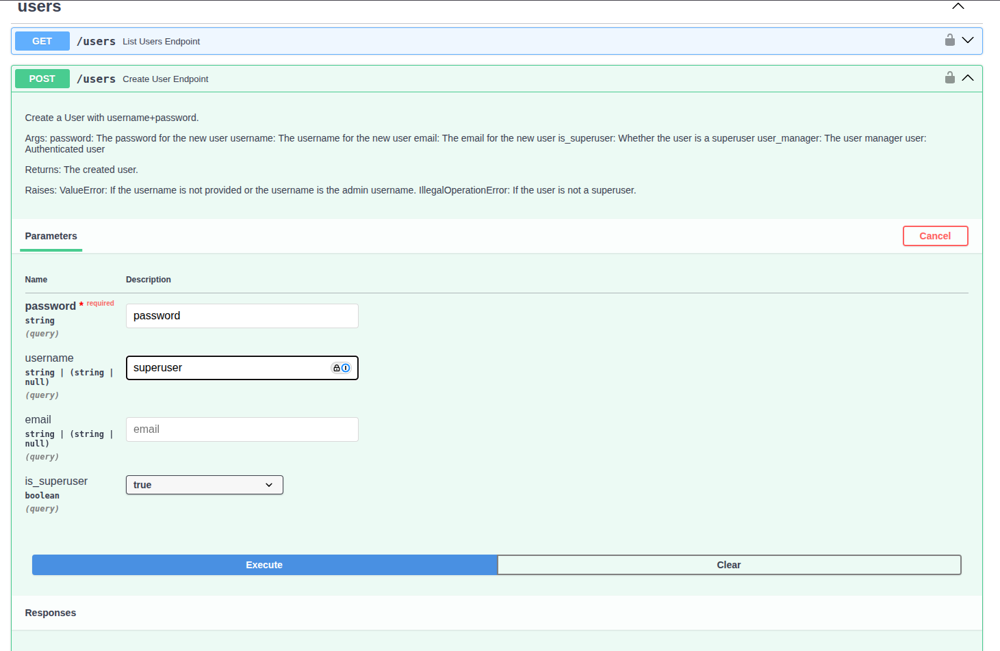

# Self-hosted Deployment on Kubernetes with Helm

This guide provides step-by-step instructions for deploying ZenML Pro on Kubernetes using Helm charts. All components run within your infrastructure with zero external dependencies.

## Deployment Architecture

All components run entirely within your Kubernetes cluster and infrastructure:


### Architecture Components

Client access includes browser-based access to the ZenML UI dashboard and connections from developer laptops or CI systems to workspaces.

The Kubernetes cluster provides the compute and services layer across several namespaces. The `zenml-controlplane-namespace` contains the UI Pod (hosting the ZenML Pro UI, connecting to the control plane and all workspaces) and the Control Plane Pod (API Server and User Management/RBAC). The `zenml-workspace-namespace` contains the Workspace Server Pod with the ZenML API Server, and Workload Manager that manages pipelines, stacks, and snapshots. The `zenml-runners-namespace` contains Runner Pods created on-demand for snapshots, and the `orchestrator-namespace` contains Orchestrator Pods for pipeline execution when using the Kubernetes orchestrator.

The data and storage layer includes a MySQL database for workspace and control plane metadata (TCP 3306), an optional secrets backend such as AWS Secrets Manager or Vault, an artifact store (S3, GCS, or Azure Blob) for models, datasets, and artifacts, and a container registry (AWS ECR, Google Artifact Registry, or Azure) for pipeline images.

## Prerequisites

Before starting, make sure you go through the [general prerequisites for self-hosted deployments](deploy-prerequisites.md) and have collected the necessary artifacts and information. Particular requirements for Kubernetes with Helm deployments are listed below.

**Infrastructure:**
- Kubernetes cluster (1.24+)

**Network:**
- Load balancer, network gateway or Ingress controllers etc. 
- Internal DNS resolution
- TLS certificates signed by your internal CA (or self-signed)
- Network connectivity between cluster components

**Tools (on a machine with internet access for initial setup):**
- Helm (3.0+)

## Install the ZenML Pro Control Plane

### Step 1: Create Kubernetes Secrets

If you are using an internal container registry, you may need to create a secret to allow the ZenML Pro control plane and workspace servers to pull the images. The following is an example of how to do this:

```bash
# Create namespace for ZenML Pro
kubectl create namespace zenml-pro

# Create secret for internal registry credentials (if needed)
kubectl -n zenml-pro create secret docker-registry image-pull-secret \
  --docker-server=internal-registry.mycompany.com \
  --docker-username=<your-username> \
  --docker-password=<your-password>
```

You'll use this secret in the next step when configuring the Helm values for the ZenML Pro control plane.

### Step 2: Configure Helm Values for the Control Plane

The example below is a basic configuration for the ZenML Pro control plane Helm chart. For a full list of configurable values and documentation, see the [ZenML Pro Helm chart reference](https://artifacthub.io/packages/helm/zenml-pro/zenml-pro).

```yaml
# Set up imagePullSecrets to authenticate to the container registry where the
# ZenML Pro container images are hosted, if necessary (see the previous step)
imagePullSecrets:
  - name: image-pull-secret

# ZenML Pro server related options.
zenml:

  image:
    api:
      # Change this to point to your own container repository
      repository: internal-registry.mycompany.com/zenml/zenml-pro-api
      # Or use this for direct GAR access:
      # repository: europe-west3-docker.pkg.dev/zenml-cloud/zenml-pro/zenml-pro-api
      # Or use this for direct AWS ECR access:
      # repository: 715803424590.dkr.ecr.eu-west-1.amazonaws.com/zenml-pro-api

      # Use this only to override the default image tag whose default value is
      # the same as the Helm chart appVersion.
      # tag: <ZENML_PRO_VERSION>
    dashboard:
      # Change this to point to your own container repository
      repository: internal-registry.mycompany.com/zenml/zenml-pro-dashboard
      # Or use this for direct GAR access:
      # repository: europe-west3-docker.pkg.dev/zenml-cloud/zenml-pro/zenml-pro-dashboard
      # Or use this for direct AWS ECR access:
      # repository: 715803424590.dkr.ecr.eu-west-1.amazonaws.com/zenml-pro-dashboard

      # Use this only to override the default image tag whose default value is
      # the same as the Helm chart appVersion.
      # tag: <ZENML_PRO_VERSION>

  # The external URL where the ZenML Pro control plane API and UI are reachable.
  #
  # This should be set to the hostname that is associated with the Ingress
  # controller, load balancer or any other network gateway.
  serverURL: https://zenml-pro.internal.mycompany.com

  # Database configuration.
  database:

    # Credentials to use to connect to an external Postgres or MySQL database.
    external:
      
      # The type of the external database service to use:
      # - postgres: use an external Postgres database service.
      # - mysql: use an external MySQL database service.
      type: mysql
    
      # The host of the external database service.
      host: mysql.internal.mycompany.com

      # The username to use to connect to the external database service.
      username: zenml_pro_user

      # The password to use to connect to the external database service.
      password: <secure-password>
      
      # The name of the database to use. Will be created on first run if it
      # doesn't exist.
      #
      # NOTE: if the database user doesn't have permissions to create this
      # database, the database should be created manually before installing
      # the helm chart.
      database: zenml_pro

  auth:
    sso:
      # Enable SSO authentication if you are using an external OIDC identity provider.
      enabled: true
      oidcConfigurationEndpoint: https://idp.example.com/.well-known/openid-configuration
      clientID: <your-oidc-client-id>
      clientSecret: <your-oidc-client-secret>

    password:
      # Enable password authentication if you are using local accounts.
      # An `admin` account and random password will be created after deployment.
      enabled: true

      # Customize the password of the default admin user that is created when
      # the ZenML Pro control plane is installed. If not specified, a random
      # password is generated.
      adminPassword:

  # Ingress configuration, if you are using an Ingress controller.
  ingress:
    enabled: true
    # Use the same hostname configured in `serverURL`
    host: zenml-pro.internal.mycompany.com
```

Minimum required settings:

* the database credentials (`zenml.database.external`)
* the URL (`zenml.serverURL`) where the ZenML Pro Control Plane API and UI will be reachable

In addition to the above, the following might also be relevant for you:

* configure container registry credentials (`imagePullSecrets`)
* injecting custom CA certificates (`zenml.certificates`), especially important if the TLS certificates used by the ZenML Pro services are signed by a custom Certificate Authority
* configure HTTP proxy settings (`zenml.proxy`)
* custom container image repository locations (`zenml.image.api` and `zenml.image.dashboard`)
* the username and password used for the default admin account (`zenml.auth.password`)
* additional Ingress settings (`zenml.ingress`)
* Kubernetes resources allocated to the pods (`resources`)
* If you set up a common DNS prefix that you plan on using for all the ZenML Pro services, you may configure the domain of the HTTP cookies used by the ZenML Pro dashboard to match it by setting `zenml.auth.authCookieDomain` to the DNS prefix (e.g. `.my.domain` instead of `zenml-pro.my-domain`)

### Step 3: Deploy the ZenML Pro Control Plane with Helm

Using the remote Helm chart, if you have access to the internet:

```bash
helm install zenml-pro oci://public.ecr.aws/zenml/zenml-pro \
  --namespace zenml-pro \
  --create-namespace \
  --values zenml-pro-values.yaml \
  --version <ZENML_PRO_VERSION>
```

Using the local Helm chart, if you have downloaded the chart previously:

```bash
helm install zenml-pro ./zenml-pro-<ZENML_PRO_VERSION>.tgz \
  --namespace zenml-pro \
  --create-namespace \
  --values zenml-pro-values.yaml
```

Verify deployment:

```bash
kubectl -n zenml-pro get pods
kubectl -n zenml-pro get svc
kubectl -n zenml-pro get ingress
```

Wait for all pods to be running and healthy.

### Step 4: Onboard the ZenML Pro Control Plane

The next step involves creating your first super-user user account.


Super-user accounts are special user accounts that are granted additional privileges and are able to bypass RBAC restrictions and create and manage other user accounts, organizations and workspace resources for the entire ZenML Pro instance. Super-user privileges can later on be granted to other users or revoked if no longer needed.


You will use this account to log in to the ZenML Pro UI to perform the following tasks that are part of onboarding your ZenML Pro instance:

1. Create one or more [organizations](organization.md)
2. Create user accounts and/or invite other users to join the organization(s)
3. Assign [roles and permissions](roles.md) to users or group them into [teams](teams.md)
4. [Enroll workspaces](enroll-workspace.md) in the organization(s)

Creating the initial super-user account is different depending on whether you are using SSO authentication or password authentication.

#### Option 1: Using SSO Authentication

If you are using SSO authentication, you can simply access the ZenML Pro UI and use the SSO login flow to authenticate with your identity provider.


The first account that logs in with SSO authentication will be automatically granted super-user privileges.


#### Option 2: Using Password Authentication

If you only enabled password authentication, a reserved admin account is available that can be used to create the first local super-user account. Instructions on how to access the admin account are provided in the Helm chart output after deployment:

```
You may access the ZenML Pro server at: https://zenml-pro.my.domain

Use the following credentials:

  Username: admin
  Password: fetch the password by running:

    kubectl get secret --namespace zenml-pro zenml-pro -o jsonpath="{.data.ZENML_CLOUD_ADMIN_PASSWORD}" | base64 --decode; echo
```


The ZenML Pro admin user should only be used for the initial onboarding and emergency administrative operations related to super-user account management: creating the first super-user account and granting super-user privileges to other users when needed. Use a regular user account for all other operations.


Creating and managing local user accounts is currently only supported through the ZenML Pro OpenAPI interface or programmatically accessing the ZenML Pro API. There is no support for this in the ZenML Pro UI yet.



To access the ZenML Pro OpenAPI interface, append the `/api/v1` path to the ZenML Pro server URL in your browser. For example: https://zenml-pro.my.domain/api/v1. Then use the OpenAPI UI to authenticate with the admin username and password.



Using the OpenAPI interface, you can manage local user accounts by making requests to the `/api/v1/users` endpoint. For example, to create a new super-user account:





First, obtain a bearer token by authenticating with the admin credentials:

```bash
# Fetch a bearer token using admin credentials
curl -X POST https://zenml-pro.my.domain/api/v1/auth/login \
  -H "Content-Type: application/x-www-form-urlencoded" \
  -d "username=admin&password=<admin-password>"
```

The response will contain an `access_token` field. Use this token to create a new super-user account:

```bash
# Create a new super-user account
curl -X POST "https://zenml-pro.my.domain/api/v1/users?username=superuser&password=password&is_superuser=true" \
  -H "Authorization: Bearer <access-token>"
```




### Step 5: Deploy and Enroll Workspaces

Now that the ZenML Pro control plane is onboarded, you can deploy and enroll one or more workspaces.

To deploy and enroll a workspace, you can use the process covered in the [Deploying Workspaces](./deploy-details/workspace-server) sections. Make sure to use the ZenML Pro control plane URLs you used for the self-hosted deployment:

* ZenML Pro control plane UI: https://zenml-pro.internal.mycompany.com
* ZenML Pro control plane API: https://zenml-pro.internal.mycompany.com/api/v1s

## Access the Workspaces from ZenML CLI

To login to a workspace with the ZenML CLI, you need to pass the custom ZenML Pro API URL:

```bash
zenml login --pro-api-url https://zenml-pro.internal.mycompany.com/api/v1
```

Alternatively, you can set the `ZENML_PRO_API_URL` environment variable:

```bash
export ZENML_PRO_API_URL=https://zenml-pro.internal.mycompany.com/api/v1
zenml login
```

## Day 2 Operations

For information on upgrading ZenML Pro components, see the [Upgrades & Updates](upgrades-updates.md) guide.

## Related Resources

- [Self-hosted Deployment Overview](self-hosted-deployment.md)
- [Kubernetes Documentation](https://kubernetes.io/docs/)
- [MySQL Documentation](https://dev.mysql.com/doc/)
- [Helm Documentation](https://helm.sh/docs/)

## Support

For self-hosted deployments, contact ZenML Support:
- Email: [cloud@zenml.io](mailto:cloud@zenml.io)
- Provide: Deployment status, configuration details and any error logs

Request from ZenML Support:
- Pre-deployment architecture consultation
- Offline support packages
- Update bundles and release notes
- Security documentation (SBOM, vulnerability reports)

