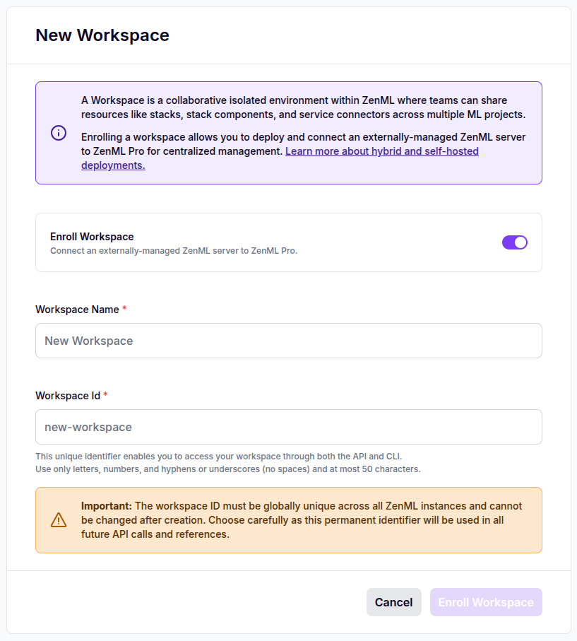
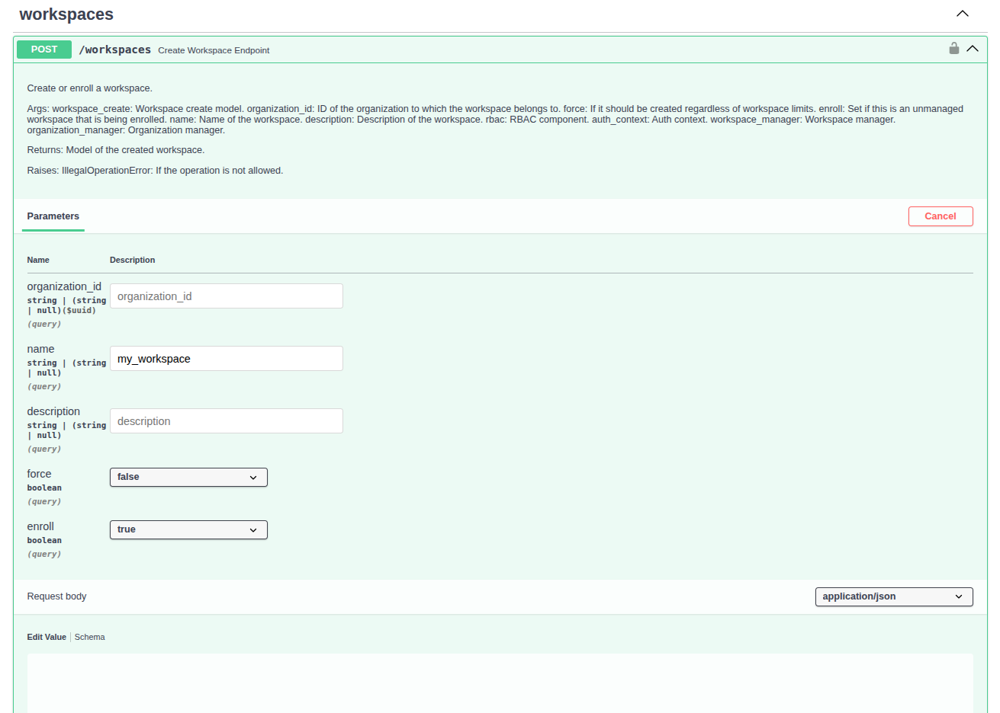

# Enroll a Workspace in the ZenML Pro Control Plane

Before deploying a self-hosted workspace, or when migrating an existing ZenML OSS server to ZenML Pro, you need to enroll the workspace in a ZenML Pro organization. The enrollment procedure creates a workspace placeholder in the organization and generate the necessary enrollment credentials. You will use these credentials (e.g. workspace ID, enrollment key) to configure the workspace server deployment.

To enroll a workspace, you simply use the "New Workspace" button in the ZenML Pro UI under your organization and toggle the "Enroll Workspace" switch.




Enrolling workspaces through the UI was not supported in ZenML Pro control plane versions 0.13.1 and earlier. If you're running an older version, you can still use the ZenML Pro OpenAPI interface or programmatically access the ZenML Pro API, as described below.




First, log in to the ZenML Pro UI as usual. Then, to access the ZenML Pro OpenAPI interface, append the `/api/v1` path to the ZenML Pro server URL in your browser. For example: https://zenml-pro.my.domain/api/v1s

Using the OpenAPI interface, you can manage local user accounts by making requests to the `/api/v1/workspaces` endpoint. For example, to create a new super-user account:





First, [create a personal access token (PAT)](personal-access-tokens.md) using the ZenML Pro UI. Then, use this PAT to enroll the workspace via curl:

```bash
# Create a new super-user account
curl -X POST "https://zenml-pro.my.domain/api/v1/workspaces?name=my-workspace&enroll=true" \
  -H "Authorization: Bearer <access-token>"
```




The workspace enrollment response will contain all the necessary enrollment credentials for the workspace that you will need to configure the workspace server during deployment:

* the workspace ID
* the enrollment key
* the organization ID
* the organization name
* the workspace name

These details will need to be passed to the workspace server container in the form of environment variables:

| Variable | Value |
|----------|-------|
| `ZENML_SERVER_DEPLOYMENT_TYPE` | `cloud` |
| `ZENML_SERVER_PRO_API_URL` | The URL where the ZenML Pro control plane API is reachable. |
| `ZENML_SERVER_PRO_DASHBOARD_URL` | The URL where the ZenML Pro control plane UI is reachable. |
| `ZENML_SERVER_PRO_ORGANIZATION_ID` | The ID of the organization the workspace belongs to. |
| `ZENML_SERVER_PRO_ORGANIZATION_NAME` | The name of the organization the workspace belongs to. |
| `ZENML_SERVER_PRO_WORKSPACE_ID` | The ID of the workspace. |
| `ZENML_SERVER_PRO_WORKSPACE_NAME` | The name of the workspace. |
| `ZENML_SERVER_PRO_OAUTH2_CLIENT_SECRET` | The enrollment key for the workspace. |

NOTE: in the case of Helm, these values are configurable as Helm values when deploying the workspace server:

```yaml
zenml:
  ...
  pro:
    enabled: true
    apiURL: https://zenml-pro.my.domain/api/v1
    dashboardURL: https://zenml-pro.my.domain
    enrollmentKey: <enrollment-key>
    organizationID: <organization-id>
    organizationName: <organization-name>
    workspaceID: <workspace-id>
    workspaceName: <workspace-name>
```
