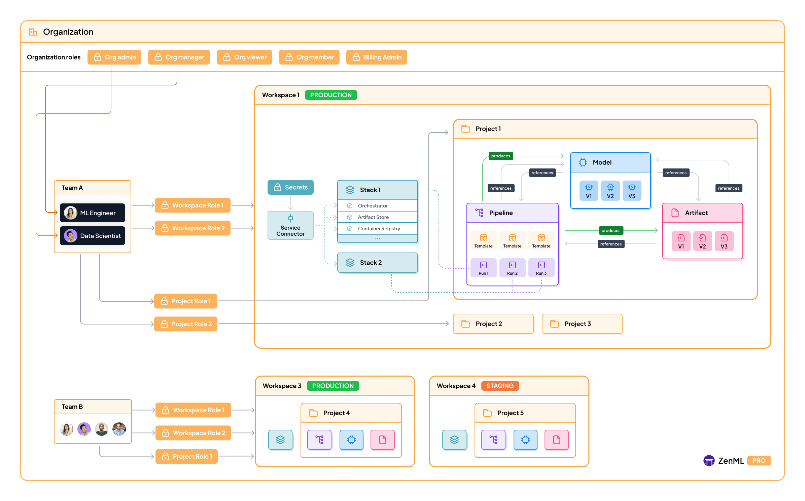

# Hierarchy

In ZenML Pro, there is a slightly different entity hierarchy as compared to the open-source ZenML\
framework. This document walks you through the key differences and new concepts that are only available for Pro users.

s
**Note**: Workspaces were previously called "Tenants" in earlier versions of ZenML Pro. We've updated the terminology to better reflect their role in organizing MLOps resources.


The image above shows the hierarchy of concepts in ZenML Pro.

* At the top level is your [**Organization**](organization.md). An organization is a collection of users, teams, and workspaces.
* Each [**Workspace**](workspaces.md) (formerly `tenant`) is an isolated deployment of a ZenML server (with some pro features). It contains multiple projects and their resources.
* Each [**Project**](projects.md) is a logical subdivision within a workspace that provides isolation for MLOps resources like pipelines, artifacts, and models. Projects have their own roles and access controls.
* [**Teams**](teams.md) are groups of users within an organization. They help in organizing users and managing access to resources at organization, workspace, and project levels.
* **Users** are single individual accounts on a ZenML Pro instance.
* [**Roles**](roles.md) exist at organization, workspace, and project levels to control what actions users can perform.
* [**Templates**](https://docs.zenml.io/how-to/trigger-pipelines) are pipeline runs that can be re-run with a different configuration.

More details about each of these concepts are available in their linked pages below:

<table data-card-size="large" data-view="cards"><thead><tr><th></th><th></th><th data-hidden data-card-target data-type="content-ref"></th><th data-hidden data-card-cover data-type="files"></th></tr></thead><tbody><tr><td><strong>Organizations</strong></td><td>Learn about managing organizations in ZenML Pro.</td><td><a href="organization.md">organization.md</a></td><td><a href=".gitbook/assets/pro-organizations.png">pro-organizations.png</a></td></tr><tr><td><strong>Workspaces</strong></td><td>Understand how to work with workspaces in ZenML Pro.</td><td><a href="workspaces.md">workspaces.md</a></td><td><a href=".gitbook/assets/pro-workspaces.png">pro-workspaces.png</a></td></tr><tr><td><strong>Projects</strong></td><td>Learn about managing projects and their resources.</td><td><a href="projects.md">projects.md</a></td><td><a href=".gitbook/assets/pro-projects.png">pro-projects.png</a></td></tr><tr><td><strong>Teams</strong></td><td>Explore team management in ZenML Pro.</td><td><a href="teams.md">teams.md</a></td><td><a href=".gitbook/assets/pro-teams.png">pro-teams.png</a></td></tr><tr><td><strong>Roles &#x26; Permissions</strong></td><td>Learn about role-based access control in ZenML Pro.</td><td><a href="roles.md">roles.md</a></td><td><a href=".gitbook/assets/pro-roles.png">pro-roles.png</a></td></tr></tbody></table>
