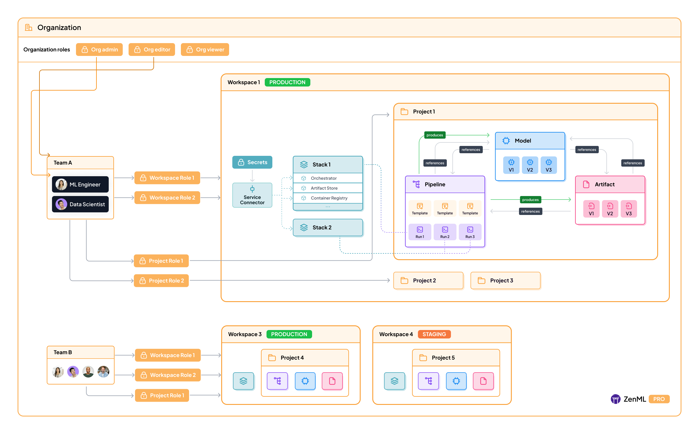

# Hierarchy of concepts in ZenML Pro

In ZenML Pro, there is a slightly different entity hierarchy as compared to the open-source ZenML
framework. This document walks you through the key differences and new concepts that are pro-only.

The image above shows the hierarchy of concepts in ZenML Pro.

- At the top level is your [Organization](../../../../docs/book/getting-started/zenml-pro/organization.md). An organization is a collection of users and tenants.
- Each [Tenant](../../../../docs/book/getting-started/zenml-pro/tenants.md) is an isolated deployment of ZenML Pro. It contains all the resources for your project or team.
- **Users** are people who have access to your ZenML Pro instance.
- [Roles](../../../../docs/book/getting-started/zenml-pro/roles.md) are used to control what actions users can perform within a tenant or inside an organization.

More details about each of these concepts are available in their linked pages.

<!-- For scarf -->
<figure></figure>
