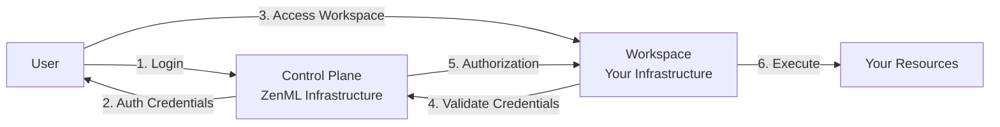
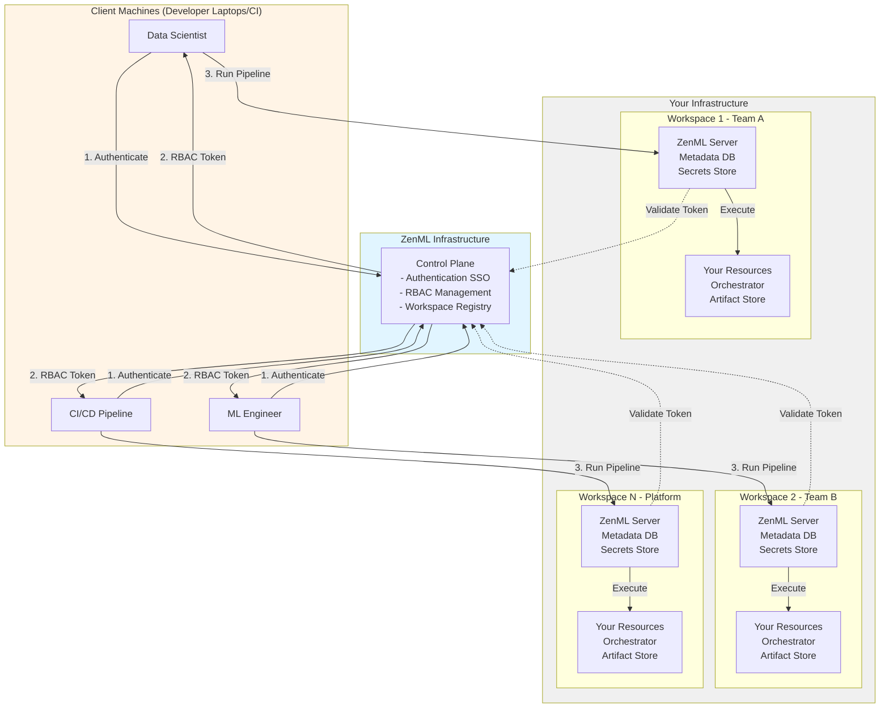
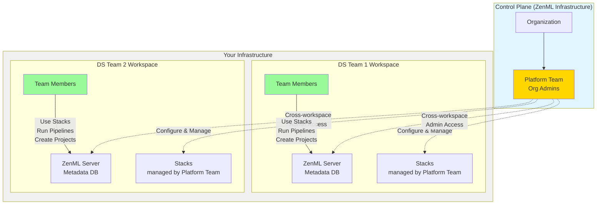

# Hybrid SaaS Deployment

ZenML Pro Hybrid SaaS offers the perfect balance between control and convenience. While ZenML manages user authentication and RBAC through a cloud-hosted control plane, all your data, metadata, and workspaces run securely within your own infrastructure.


To learn more about Hybrid SaaS deployment, [book a call](https://www.zenml.io/book-your-demo).


## Overview

The Hybrid deployment model is designed for organizations that need to keep sensitive data and metadata within their infrastructure boundaries while still benefiting from centralized user management and simplified operations.

## Architecture

### What Runs Where

| Component               | Location                                                           | Purpose                                                            |
| ----------------------- | ------------------------------------------------------------------ | ------------------------------------------------------------------ |
| **Pro Control Plane**   | ZenML Infrastructure                                               | Manages authentication, RBAC, and global workspace coordination    |
| **ZenML Pro Server(s)** | Your Infrastructure                                                | Handles pipeline orchestration and execution                       |
| **Metadata Store**      | Your Infrastructure                                                | Stores all pipeline runs, model metadata, and tracking information |
| **Secrets Store**       | Your Infrastructure                                                | Stores all credentials and sensitive configuration                 |
| **Compute Resources**   | Your infrastructure through [stacks](https://docs.zenml.io/stacks) | Executes pipeline steps and training jobs                          |
| **Data & Artifacts**    | Your infrastructure through [stacks](https://docs.zenml.io/stacks) | Stores datasets, models, and pipeline artifacts                    |

### Data Flow

For a detailed explanation of the common pipeline execution data flow across all deployment scenarios, see [Common Pipeline Execution Data Flow](deployments-overview.md#common-pipeline-execution-data-flow) in the Deployment Scenarios Overview.

In Hybrid deployment, users authenticate via ZenML-hosted control plane (SSO), and RBAC policies are enforced there before token issuance.


**Complete data sovereignty**: All metadata, secrets, and ML artifacts remain within your infrastructure. Only authentication and authorization data flows to ZenML control plane.


## Key Benefits

### 🔒 Enhanced Security & Compliance

* **Data sovereignty**: All metadata and artifacts stay within your infrastructure
* **Secret isolation**: Credentials never leave your environment
* **VPN/Firewall compatible**: Workspaces operate behind your security perimeter
* **Audit trails**: Complete logging within your infrastructure
* **SOC 2 & ISO 27001 certified software**: Meets enterprise security and compliance benchmarks for your peace of mind

### 🎯 Centralized Governance

* **Unified user management**: Single control plane for all workspaces
* **Consistent RBAC**: Centrally managed permissions across teams
* **SSO integration**: Connect with your identity provider once
* **Global visibility**: Platform teams see across all workspaces
* **Standardized policies**: Enforce organizational standards

### ⚖️ Balanced Control

* **Infrastructure control**: Full control over workspace configuration and resources
* **Reduced operational overhead**: ZenML manages the control plane
* **Customization freedom**: Configure workspaces to specific team needs
* **Network isolation**: Workspaces can be fully isolated per team/department
* **Cost optimization**: Pay only for what you use in your infrastructure

### 🚀 Production Ready

* **Automatic updates**: Control plane and UI maintained by ZenML
* **Professional support**: Direct access to ZenML experts

## Ideal Use Cases

Hybrid SaaS is perfect for:

* **Regulated industries** (finance, healthcare, government) with strict data residency requirements
* **Organizations with centralized MLOps teams** managing multiple business units
* **Companies with existing VPN/firewall policies** that restrict inbound connections
* **Enterprises requiring audit trails** of all data access within their infrastructure
* **Teams needing customization** while maintaining centralized user management
* **Organizations with compliance requirements** mandating on-premises metadata storage

## Architecture Details

### Network Security

#### Outbound-Only Connections

Workspaces initiate outbound-only connections to the control plane:

* No inbound connections required to your infrastructure
* Compatible with strict firewall policies

#### Multi-Workspace Isolation

Each workspace can be:

* Deployed in separate VPCs/networks
* Isolated per team or department or customer
* Configured with different security policies
* Managed independently by different teams

### Authentication & Authorization Flow

This is meant to serve as a simplification of the typical authentication and authorization flow. Not every request will follow this exact pattern.

1. User authenticates with ZenML control plane (SSO)
2. Control plane issues authentication credentials
3. User accesses workspace with credentials
4. Workspace validates credentials with control plane
5. Control plane confirms authentication and authorization (RBAC)
6. Workspace executes operations on your infrastructure

### Data Residency

| Data Type         | Storage Location    | Purpose                             |
| ----------------- | ------------------- | ----------------------------------- |
| User metadata     | Control Plane       | Authentication only                 |
| RBAC policies     | Control Plane       | Authorization decisions             |
| Pipeline metadata | Your Infrastructure | Run history, metrics, parameters    |
| Model metadata    | Your Infrastructure | Model versions, stages, annotations |
| Artifacts         | Your Infrastructure | Datasets, models, visualizations    |
| Secrets           | Your Infrastructure | Cloud credentials, API keys         |
| Logs              | Your Infrastructure | Step outputs, debug information     |

## Deployment Architecture

### Single Organization, Multiple Workspaces

### Multi-Region Support

Deploy workspaces across different regions while maintaining centralized control:

* Workspaces in US, EU, APAC regions
* Data residency compliance per region
* Centralized user management
* Consistent RBAC across regions

## Setup Process

### 1. Initial Configuration

[Book a demo](https://www.zenml.io/book-your-demo) to get started. The ZenML team will:

* Help set up your organization in the control plane
* Establish secure communication channels
* (optional) Configure SSO integration

### 2. Workspace Deployment

Deploy ZenML workspaces in your infrastructure. Workspaces can be deployed on:

**Supported Deployment Backends:**

* **Kubernetes** (Recommended) - EKS, GKE, AKS, or self-managed clusters
* **AWS ECS** - Elastic Container Service
* **Container orchestration alternatives** - Other Kubernetes distributions

**Requirements:**

* **Database**: MySQL or PostgreSQL database in your infrastructure
* **Network**: Egress access to `cloud.zenml.io` (for Control Plane communication)
* **Resources**: Compute resources for the ZenML server container

**Deployment Tools:**

* **Kubernetes**: We provide officially supported Helm charts
* **Non-Kubernetes environments**: We recommend using infrastructure-as-code tools like Terraform, Pulumi, or CloudFormation to manage server lifecycle

### 3. Configure Infrastructure Access

Once your workspace is deployed, configure access to your cloud resources using ZenML's infrastructure abstractions:

**Stack Components**: Individual infrastructure elements that your pipelines need to run - orchestrators (Kubernetes, Airflow, etc.), artifact stores (S3, GCS, Azure Blob), container registries, experiment trackers, model deployers, and more. Each component type has multiple "flavors" supporting different technologies.

**Stacks**: A stack is a named collection of components that define where and how your pipelines run. By combining different components into stacks, you can easily switch between environments (development, staging, production) or infrastructure providers without changing your pipeline code.

**Service Connectors**: Service connectors provide secure, reusable authentication to cloud providers and services. Instead of managing credentials manually in each component, connectors handle authentication centrally and can be shared across your team with appropriate access controls.

Learn more:

* [Stack Components Documentation](https://docs.zenml.io/stacks) - Available components and how to configure them
* [Stacks Documentation](https://docs.zenml.io/user-guide/production-guide/understand-stacks) - Complete guide to configuring and managing stacks
* [Service Connectors Documentation](https://docs.zenml.io/how-to/auth-management/service-connectors-guide) - How to set up authentication to cloud providers

### 4. Set Up Users & Teams

Manage users through the control plane:

* Invite team members via email
* Assign roles and permissions
* Create teams for different departments
* Configure workspace access

## Organizational Structure

### Recommended Hierarchy

**Access Model:**

* **Platform Team**: Organization admins with cross-workspace access. They configure and manage stacks, service connectors, and infrastructure across all workspaces
* **DS/ML Teams**: Limited workspace-level access. Can use pre-configured stacks to run pipelines, create projects, and manage workspace-level secrets, but cannot modify stack configurations or global settings
* **Workspace Isolation**: Each workspace runs independently in your infrastructure with its own ZenML server and metadata store

## Cost Considerations

### Infrastructure Costs

You control costs by managing:

* Compute resources (scale up/down as needed)
* Storage (artifact stores, databases)
* Networking (data transfer, load balancers)
* Backups and disaster recovery

### ZenML Costs

ZenML provides:

* Control plane management (included)
* Professional support (included)
* Regular updates and security patches
* Usage-based pricing per workspace

## Security Documentation

For software deployed on your infrastructure, ZenML provides:

* **Vulnerability Assessment Reports**: Comprehensive security analysis available on request
* **Software Bill of Materials (SBOM)**: Complete dependency inventory for compliance
* **Compliance documentation**: Support for your security audits and certifications
* **Architecture review**: Security team consultation for deployment planning

Contact [cloud@zenml.io](mailto:cloud@zenml.io) to request security documentation.

## Monitoring & Maintenance

### Control Plane (ZenML Managed)

* ✅ Automatic updates
* ✅ Security patches
* ✅ Uptime monitoring
* ✅ Backup and recovery

### Workspaces (Your Responsibility)

* Database maintenance and backups
* Workspace version updates (with ZenML guidance)
* Infrastructure scaling
* Resource monitoring

### Support Included

* Professional support with SLA
* Architecture consultation
* Migration assistance
* Security advisory updates

## Comparison with Other Deployments

| Feature           | SaaS           | Hybrid SaaS            | Self-hosted          |
| ----------------- | -------------- | ---------------------- | -------------------- |
| Setup Time        | Minutes        | Hours to Days          | Days to Weeks        |
| Metadata Location | ZenML Infra    | Your Infra             | Your Infra           |
| Secret Management | ZenML or Yours | Your Infra             | Your Infra           |
| User Management   | ZenML Managed  | ZenML Managed          | Self-Managed         |
| Maintenance       | Zero           | Workspace Only         | Full Stack           |
| Control           | Minimal        | Moderate               | Complete             |
| Best For          | Fast start     | Security + Convenience | Strictest compliance |

[Compare all deployment options →](./#deployment-scenarios)

## Migration Paths

### From ZenML OSS

1. Deploy a ZenML Pro-compatible workspace in your own infrastructure (you can start from your existing ZenML OSS workspace deployment).
   * **Update your Docker image**: Replace the OSS ZenML server image with the latest Pro Hybrid image provided by ZenML.
   * **Set required environment variables**: Add or update environment variables according to the ZenML Pro documentation (for example: `ZENML_PRO_CONTROL_PLANE_URL`, `ZENML_PRO_CONTROL_PLANE_CLIENT_ID`, secrets, and SSO configuration as instructed by ZenML).
   * **Restart your deployment** to apply these changes.
2. Migrate users and teams
3. Run `zenml login` to authenticate via [cloud.zenml.io](https://cloud.zenml.io) and connect your SDK clients to the new workspace

### From SaaS to Hybrid

If you're interested in migrating from the ZenML Pro SaaS deployment to a Hybrid SaaS setup, we're here to help guide you through every step of the process. Because migration paths can vary depending on your organization’s size, data residency requirements, and current ZenML setup, we recommend discussing your plans with a ZenML solutions architect.

**Next steps:**

* [Book a migration consultation →](https://www.zenml.io/book-your-demo)
* Or email us at [cloud@zenml.io](mailto:cloud@zenml.io)

Your ZenML representative will provide you with a tailored migration checklist, technical documentation, and direct support to ensure a smooth transition with minimal downtime.

### Between Workspaces

A workspace deep copy feature for migrating pipelines and artifacts between workspaces is coming soon.

## Detailed Architecture Diagram

## Related Resources

* [System Architecture Overview](../system-architectures.md#zenml-pro-hybrid-saas)
* [Deployment Scenarios Overview](deployments-overview.md)
* [SaaS Deployment](saas-deployment.md)
* [Self-hosted Deployment](self-hosted-deployment.md)
* [Workload Managers](workload-managers.md)
* [Self-hosted Deployment Guide](self-hosted.md)
* [Workspaces](workspaces.md)
* [Organizations](organization.md)

## Get Started

Ready to deploy ZenML Pro in Hybrid mode?

[Book a Demo](https://www.zenml.io/book-your-demo){ .md-button .md-button--primary }

Have questions? [Contact us](mailto:cloud@zenml.io) or check out our [documentation](https://docs.zenml.io).
