# Full On-Prem Deployment

ZenML Pro Full On-Prem deployment provides complete control and data sovereignty for organizations with the strictest security, compliance, or regulatory requirements. All ZenML components run entirely within your infrastructure with no external dependencies or internet connectivity required.


To learn more about Full On-Prem deployment, [book a call](https://www.zenml.io/book-your-demo).


## Overview

In a Full On-Prem deployment, every component of ZenML Pro runs within your isolated network environment. This architecture is designed for organizations that must operate in completely disconnected environments or have regulatory requirements preventing any external communication.


## Architecture

### What Runs Where

| Component | Location | Purpose |
|-----------|----------|---------|
| **Pro Control Plane** | Your Infrastructure | Manages authentication, RBAC, and workspace coordination |
| **ZenML Server (Workspaces)** | Your Infrastructure | Handles pipeline orchestration and execution |
| **Pro Metadata Store** | Your Infrastructure | Stores user management, RBAC, and organizational data |
| **Workspace Metadata Store** | Your Infrastructure | Stores pipeline runs, model metadata, and tracking information |
| **Secrets Store** | Your Infrastructure | Stores all credentials and sensitive configuration |
| **Identity Provider** | Your Infrastructure | Handles authentication (OIDC/LDAP/SAML) |
| **Pro Dashboard** | Your Infrastructure | Web interface for all ZenML Pro features |
| **Compute Resources** | Your infrastructure through [stacks](https://docs.zenml.io/stacks) | Executes pipeline steps and training jobs |
| **Data & Artifacts** | Your infrastructure through [stacks](https://docs.zenml.io/stacks) | Stores datasets, models, and pipeline artifacts |

### Complete Isolation

```mermaid
flowchart TB
  subgraph infra["Your Infrastructure (Full On-Prem)"]
    direction TB

    control_plane["<b>ZenML Pro Control Plane</b><br/>- Authentication & Authorization<br/>- RBAC Management<br/>- Workspace Coordination<br/>- Pro Metadata Store"]

    subgraph workspaces[" "]
      direction LR
      ws1["<b>Workspace 1</b><br/>- Server<br/>- Metadata<br/>- Secrets"]
      ws2["<b>Workspace 2</b><br/>- Server<br/>- Metadata<br/>- Secrets"]
      wsn["<b>...<br/>- Server<br/>- Metadata<br/>- Secrets</b>"]
    end

    compute["<b>Your Compute & Storage Resources</b><br/>- Kubernetes / VMs / Cloud<br/>- Artifact Stores<br/>- ML Data & Models"]
  end

  control_plane --> ws1
  control_plane --> ws2
  control_plane --> wsn
  ws1 --> compute
  ws2 --> compute
  wsn --> compute

  note[/"⚠️ No External Communication Required"/]
  infra --- note
```




**Complete data sovereignty**: Zero data leaves your environment. All components, metadata, and ML artifacts remain within your infrastructure boundaries.


### Data Flow

For a detailed explanation of the common pipeline execution data flow across all deployment scenarios, see [Common Pipeline Execution Data Flow](deployments-overview.md#common-pipeline-execution-data-flow) in the Deployment Scenarios Overview.

In Full On-Prem deployment, users authenticate via your internal identity provider (LDAP/AD/OIDC), and the control plane (running in your infrastructure) handles both authentication and RBAC. All communication happens entirely within your infrastructure boundary with zero external dependencies or internet connectivity required.

## Key Benefits

### 🔒 Maximum Security & Control

- **Complete air-gap**: No internet connectivity required for operation
- **Zero external dependencies**: All components self-contained
- **Custom security policies**: Full control over all security configurations
- **Network isolation**: Operates within your security perimeter
- **Audit compliance**: Complete logging and monitoring within your infrastructure

### 🏛️ Regulatory Compliance

- **Data residency**: All data stays within your jurisdiction
- **ITAR/EAR compliance**: Suitable for controlled data environments
- **HIPAA/GDPR ready**: Meet healthcare and privacy regulations
- **Government/Defense**: Suitable for classified environments
- **Financial services**: Meet banking and financial regulations

### 🎯 Enterprise Control

- **Custom identity provider**: Integrate with your LDAP/AD/OIDC
- **Infrastructure flexibility**: Deploy on any infrastructure (cloud, on-prem, edge)
- **Version control**: Control update schedules and versions
- **Backup strategy**: Implement your own backup and DR policies
- **Resource optimization**: Full control over resource allocation and costs

### 🛡️ Certified & Documented

- **SOC 2 Type II certified**: Enterprise-grade security controls
- **ISO 27001 certified**: International security management standards
- **Vulnerability Assessment Reports**: Available on request
- **Software Bill of Materials (SBOM)**: Complete dependency inventory
- **Architecture documentation**: Comprehensive deployment guides

## Ideal Use Cases

Full On-Prem deployment is essential for:

- **Government and defense** organizations with classified data requirements
- **Regulated industries** (healthcare, finance) with strict data residency requirements
- **Organizations in restricted regions** with limited or no internet connectivity
- **Research institutions** handling sensitive or proprietary research data
- **Critical infrastructure** operators requiring isolated systems
- **Companies with ITAR/EAR compliance** requirements
- **Enterprises with zero-trust policies** prohibiting external communication
- **Organizations requiring full control** over all aspects of their MLOps platform

## Deployment Options

### On-Premises Data Center

Deploy on your own hardware:
- Physical servers or private cloud
- Complete infrastructure control
- Integration with existing systems
- Custom hardware configurations

### Private Cloud (AWS, Azure, GCP)

Deploy in isolated cloud VPC:
- No internet gateway
- Private networking only
- Use cloud-native services
- Leverage cloud scalability within your boundary

### Hybrid Multi-Cloud

Deploy across multiple environments:
- On-premises + private cloud
- Multi-region for DR
- Edge + datacenter hybrid
- Maintain complete isolation across all environments

### Edge Deployments

Deploy at edge locations:
- Manufacturing facilities
- Remote research stations
- Mobile/tactical deployments
- Disconnected field operations

## Deployment Architecture

### Architecture Diagram


The diagram above illustrates a complete Full On-Prem ZenML Pro deployment with all components running within your organization's VPC. This architecture ensures zero external communication while providing full enterprise MLOps capabilities.

### Architecture Components

**Client SDK** (top center):
The ZenML Python SDK runs on developer laptops, CI/CD systems, or notebooks. It communicates with all layers to:
- Authenticate users via your Identity Provider
- Submit pipeline runs to workspaces
- Push Docker images to your Container Registry
- Access the Organization Platform Layer components

**Organization Platform Layer** (left, pink):
Your existing ML infrastructure components that ZenML integrates with:
- **Container Registry**: Store pipeline Docker images (AWS ECR, Dockerhub, Google Artifact Registry, Azure Container Registry)
- **Artifact Store**: Store ML artifacts, models, and datasets (S3, GCS, Azure Blob Storage, ADLS)
- **Code Repository**: Version control for pipeline code (GitHub Enterprise, GitLab, Bitbucket)
- **Orchestrator**: Execute pipeline workloads (Vertex AI, Sagemaker, AzureML, Kubernetes)

**Infrastructure Layer** (top, cyan):
Core infrastructure services:
- **Identity Provider**: LDAP, Active Directory, or OIDC provider for user authentication
- **Load Balancer**: Distributes traffic to ZenML services for high availability

**ZenML Control Plane** (center, blue):
The management layer running in Kubernetes:
- **ZenML FE**: React-based Pro dashboard for pipeline visualization and model management
- **ZenML Control Plane**: Coordinates workspaces, handles authentication/RBAC, manages organization settings

**ZenML Application Plane** (center, purple):
Individual workspace servers running in Kubernetes:
- **Multiple Workspaces**: Isolated environments for different teams (DS Team 1, DS Team 2, etc.)
- Each workspace has its own server instance, metadata database, and secrets store
- Workspaces are orchestrated by the Control Plane but run independently

**ZenML Storage Plane** (bottom, pink):
Persistent storage for ZenML services:
- **Secret Store**: Vault or cloud secrets manager for storing credentials securely
- **Database**: PostgreSQL or MySQL for storing workspace metadata, pipeline runs, and control plane data

### Data Flow

All arrows in the diagram represent communication flows that occur entirely within your VPC:
1. Client SDK authenticates with Identity Provider
2. Client SDK connects to ZenML Control Plane for workspace access
3. Control Plane manages and coordinates workspaces
4. Workspaces orchestrate pipeline execution on your Orchestrator
5. Pipelines write artifacts to your Artifact Store
6. Workspaces store metadata in the Database
7. All components access secrets from the Secret Store

**Key Security Feature**: The entire system operates without any external internet connectivity. All Docker images, dependencies, and updates are transferred to your environment through secure offline channels.

### High Availability Configuration

For mission-critical deployments:
- **Active-active** control plane for zero downtime
- **Database replication** for metadata stores
- **Load balancers** for workspace servers
- **Backup sites** for disaster recovery
- **Monitoring and alerting** for all components

## Pre-requisites

Before deployment, ensure you have:

#### Infrastructure Requirements
- Kubernetes cluster (recommended) or VM infrastructure
- PostgreSQL database(s) for metadata storage
- Object storage or NFS for artifacts
- Load balancer for HA configurations
- Identity provider (LDAP/AD/OIDC)

#### Network Requirements
- Internal DNS resolution
- SSL/TLS certificates (internal CA)
- Network connectivity between components
- Firewall rules for inter-component communication

#### Resource Requirements
```yaml
# Minimum requirements
Control Plane:
  CPU: 4 cores
  Memory: 16GB RAM
  Storage: 100GB

Per Workspace:
  CPU: 2 cores
  Memory: 8GB RAM
  Storage: 50GB + metadata

Database:
  CPU: 4 cores
  Memory: 16GB RAM
  Storage: 500GB (scalable)
```

## Operations & Maintenance

### Updates & Upgrades

ZenML provides new versions as offline bundles:

1. **Receive new bundle**: Typically by pulling our Docker images via your approved transfer method 
2. **Review release notes and compatibility notes**: Carefully review the release notes and any migration instructions included in the offline bundle to understand all changes, requirements, and potential impacts. Assess required infrastructure or configuration updates and note any changes in CI/CD actions or deployment processes before proceeding.
3. **Test in staging**: Deploy to test environment first
4. **Backup current state**: Database and configuration backups
5. **Apply updates**: Using Helm upgrade commands, or update your deployment using Terraform or other Infrastructure-as-Code (IaC) tools.
6. **Verify functionality**: Run health checks and tests
7. **Monitor**: Watch for any issues post-upgrade


### Disaster Recovery

Plan for disaster scenarios:

1. **Database replication**: PostgreSQL streaming replication to backup site
2. **Artifact replication**: Sync artifact stores to DR location
3. **Configuration backup**: Version-controlled infrastructure as code
4. **Runbook**: Document DR procedures
5. **Regular testing**: Test DR procedures quarterly

## Security Hardening

### Network Security

- **Network segmentation**: Isolate ZenML components in dedicated network segments
- **Firewall rules**: Restrict traffic to only required ports
- **TLS everywhere**: Encrypt all communication
- **Certificate management**: Use internal CA for certificate issuance


### Access Control

- **Principle of least privilege**: Grant minimal required permissions
- **Service accounts**: Use dedicated service accounts for automation
- **Audit logging**: Log all authentication and authorization events

### Container Security

- **Image scanning**: Scan all container images before deployment
- **Runtime security**: Monitor container behavior
- **Pod security policies**: Enforce security standards
- **Resource limits**: Prevent resource exhaustion attacks

## Support & Documentation

### What ZenML Provides

- **Deployment packages**: Complete offline installation bundles
- **Documentation**: Comprehensive setup and operation guides
- **SBOM**: Full software bill of materials for compliance
- **Vulnerability reports**: Security assessment documentation
- **Architecture consultation**: Pre-deployment planning support
- **Deployment assistance**: Guidance during initial setup
- **Update packages**: New versions as offline bundles

### What You Manage

- **Infrastructure**: Hardware, networking, storage
- **Day-to-day operations**: Monitoring, backups, user management
- **Security policies**: Firewall rules, access controls
- **Compliance**: Audit logs, security assessments
- **Updates**: Applying new versions using provided bundles

### Support Model

Contact [cloud@zenml.io](mailto:cloud@zenml.io) for:
- Pre-sales architecture consultation
- Deployment planning and sizing
- Security documentation requests
- Offline support packages
- Update and upgrade assistance

## Licensing

Air-gapped deployments are provided under commercial software license agreements, with license fees and terms defined on a per-customer basis. Each contract includes detailed license terms and conditions appropriate to the deployment.

## Security Documentation

Available on request for compliance and security reviews:

- ✅ **Vulnerability Assessment Reports**: Full security analysis
- ✅ **Software Bill of Materials (SBOM)**: Complete dependency list
- ✅ **Architecture security review**: Threat model and mitigations
- ✅ **Compliance mappings**: NIST, CIS, GDPR, HIPAA guidance
- ✅ **Security hardening guide**: Best practices for your deployment

## Comparison with Other Deployments

| Feature | SaaS | Hybrid SaaS | Full On-Prem |
|---------|------|-------------|------------|
| Internet Required | Yes (metadata) | Yes (control plane) | **No** |
| Setup Time | Minutes | Hours/Days | Days/Weeks |
| Maintenance | Zero | Partial | **Full control** |
| Data Location | Mixed | Your infra | **100% yours** |
| User Management | ZenML | ZenML | **Your IDP** |
| Update Control | Automatic | Automatic CP | **You decide** |
| Customization | Limited | Moderate | **Complete** |
| Best For | Fast start | Balance | **Max security** |

[Compare all deployment options →](README.md#deployment-scenarios-comparison)

## Migration Path

### From ZenML OSS to Full On-Prem Pro

If you're interested in migrating from ZenML OSS to a Full On-Prem Pro deployment, we're here to help guide you through every step of the process. Migration paths are highly dependent on your specific environment, infrastructure setup, and current ZenML OSS deployment configuration.

It's possible to migrate existing stacks or even existing metadata from existing OSS deployments. We can figure out how and what to migrate together in a call.

**Next steps:**

- [Book a migration consultation →](https://www.zenml.io/book-your-demo)
- Or email us at [cloud@zenml.io](mailto:cloud@zenml.io)

Your ZenML representative will work with you to assess your current setup, understand your Full On-Prem requirements, and provide a tailored migration plan that fits your environment.

### From Other Pro Deployments

If you're moving from SaaS or Hybrid to Full On-Prem, migration paths can vary significantly depending on your organization's size, data residency requirements, and current ZenML setup. We recommend discussing your plans with a ZenML solutions architect.

**Next steps:**

- [Book a migration consultation →](https://www.zenml.io/book-your-demo)
- Or email us at [cloud@zenml.io](mailto:cloud@zenml.io)

Your ZenML representative will provide you with a tailored migration checklist, technical documentation, and direct support to ensure a smooth transition with minimal downtime.

## Detailed Architecture Diagram

<details>

<summary>Detailed Full On-Prem Deployment Architecture</summary>


</details>

## Related Resources

- [System Architecture Overview](../system-architectures.md#zenml-pro-self-hosted-architecture)
- [Deployment Scenarios Overview](deployments-overview.md)
- [SaaS Deployment](saas-deployment.md)
- [Hybrid SaaS Deployment](hybrid-deployment.md)
- [Workload Managers](workload-managers.md)
- [Self-hosted Deployment Guide](self-hosted.md)
- [Security & Compliance](README.md#security--compliance)

## Get Started

Ready to deploy ZenML Pro in a Full On-Prem environment?

[Book a Demo](https://www.zenml.io/book-your-demo){ .md-button .md-button--primary }

Have questions? [Contact us](mailto:cloud@zenml.io) for detailed deployment planning.
