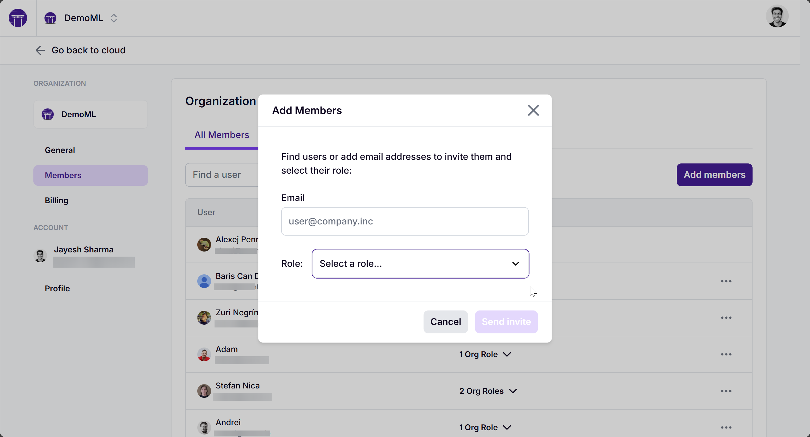
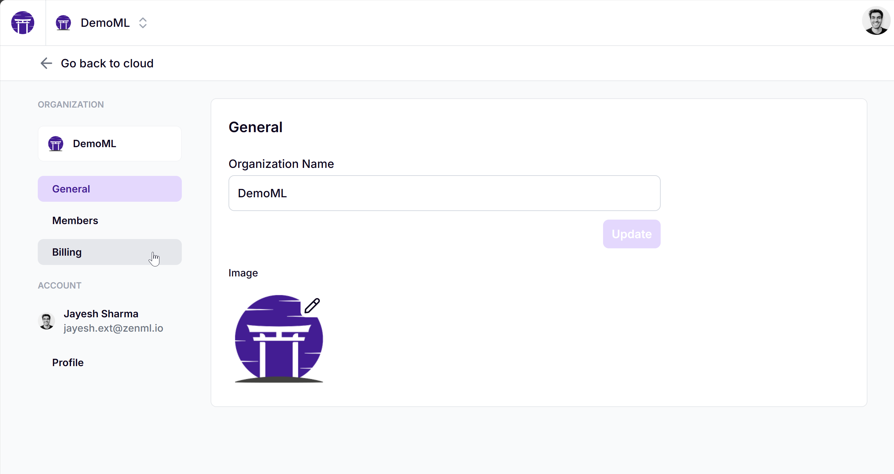
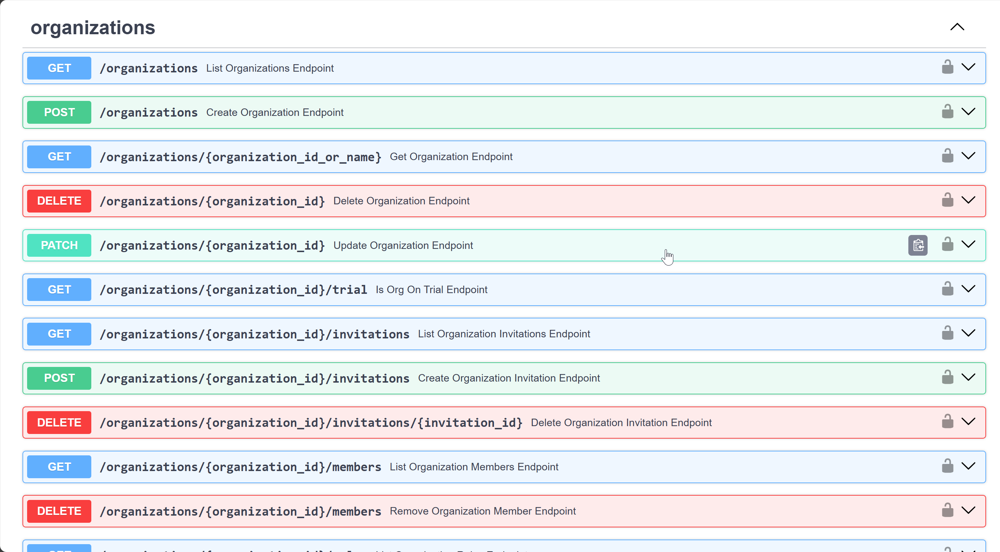

# Organizations

ZenML Pro arranges various aspects of your work experience around the concept
of an **Organization**. This is the top-most level structure within the ZenML Cloud environment.
Generally, an organization contains a group of users and one or more [tenants](./tenants.md).

## Inviting Team Members to Your Organization

Inviting users to your organization to work on the organization's tenants is
easy. Simply click `Add Member` in the Organization settings, and give them an
initial Role. The user will be sent an invitation email. If a user is part of an
organization, they can utilize their login on all tenants they have authority to
access.

## Manage Organization settings like billing and roles

The billing information for your tenants is managed on the organization level, among other settings like the members in your organization and the roles they have. You can access the organization settings by clicking on your profile picture in the top right corner and selecting "Settings".

## Other operations involving organizations

There are a lot of other operations involving Organizations that you can perform directly through the API. You can find more information about the API by visiting [https://cloudapi.zenml.io/](https://cloudapi.zenml.io/).

<!-- For scarf -->
<figure></figure>

